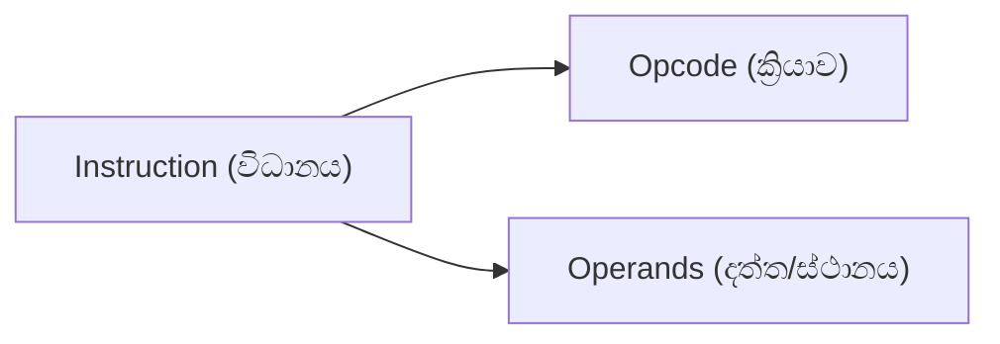
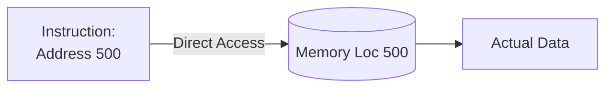
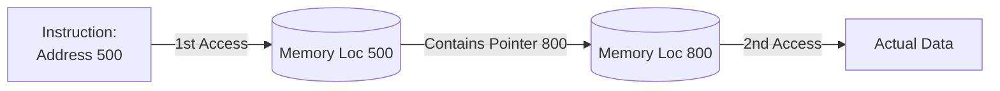
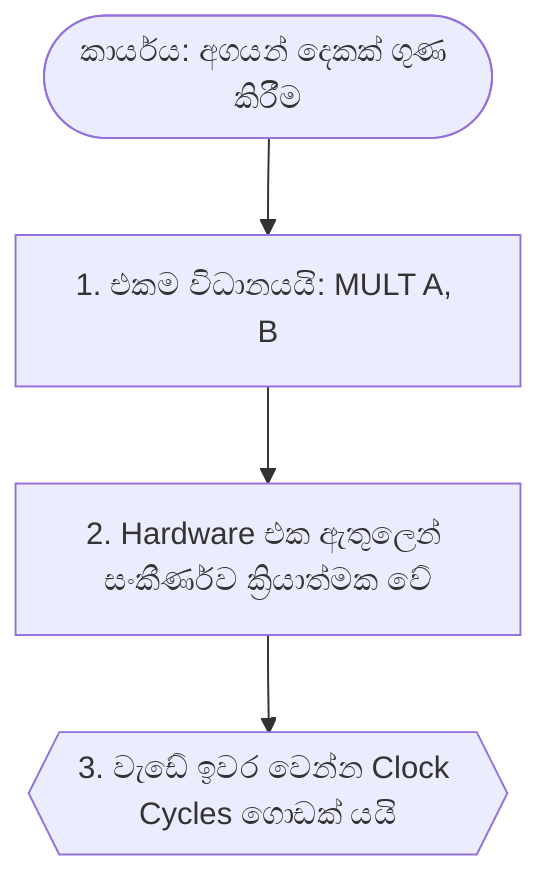
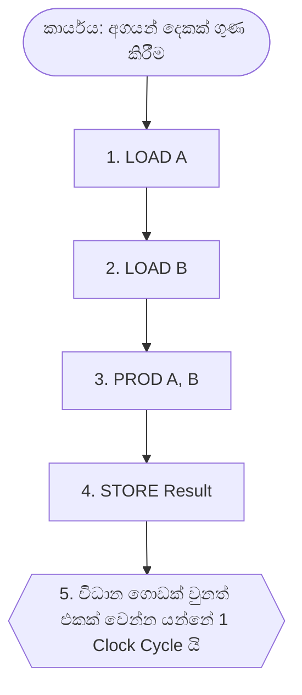

# 📚 CSA Complete Master Notes (L1 - L12)

> **AI Model Context File:** This file contains the complete syllabus, notes, and structure for Computer Systems Architecture (ICT 1022). Use this to understand the full scope of the course.

## 🗺️ Syllabus Unified Mindmap

```mermaid
mindmap
  root((CSA Full Syllabus))
    (Lesson 1)
      ["🏛️ Computer Organization vs Computer Architecture"]
        ("1. Computer Organization (පරිගණක සංවිධානය)")
        ("2. Computer Architecture (පරිගණක වාස්තු විද්‍යාව)")
      ["⏳ Historical Perspective & Evolution"]
        ("පරිගණකයේ ආරම්භක උත්සාහයන් (Early Computing Machines)")
        ("පරිගණක පරම්පරා (Generations of Computers)")
        ("📈 Moore's Law (මුවර්ගේ නියමය)")
        ("අනාගතය? (The Future?)")
      ["🖥️ Components of a Computer System"]
        ("1. Processor (සකසනය / CPU)")
        ("2. Memory Unit (මතක ඒකකය)")
        ("3. Input & Output Units (ආදාන සහ ප්‍රතිදාන ඒකක)")
    (Lesson 2)
      ["💻 Digital Computer & Programs"]
        ("1. Digital Computer (ඩිජිටල් පරිගණකය)")
        ("2. Program සහ Software යනු කුමක්ද?")
        ("3. Programming Languages (ක්‍රමලේඛන භාෂා)")
      ["🔄 Translators and High-Level Languages"]
        ("1. High-Level Language (උසස් මට්ටමේ භාෂා)")
        ("2. Assembly Language (ඇසෙම්බ්ලි භාෂාව)")
        ("3. Translators (පරිවර්තක)")
      ["🏗️ Multilevel Machine Concept"]
        ("🏢 Six-Level Machine Architecture (ස්තර 6කින් යුත් පරිගණක ව්‍යුහය)")
    (Lesson 3)
      ["💾 Interfacing with Primary Memory & Registers"]
        ("1. Memory Registers (මතකයට අදාළ රෙජිස්ටර්)")
        ("2. Memory Operations (මතකයේ මූලික ක්‍රියාවලිය)")
        ("3. Program/Instruction Registers (වැඩසටහන් පාලනය කරන රෙජිස්ටර්)")
      ["⚙️ Execution of Instructions (උපදෙස් ක්‍රියාත්මක වීම)"]
        ("උදාහරණ 1: `ADD R1, R2` (රෙජිස්ටර් දෙකක් එකතු කිරීම)")
        ("උදාහරණ 2: `ADD R1, LOCA` (මතකයේ ඇති අගයක් රෙජිස්ටරයක් සමඟ එකතු කිරීම)")
      ["🚌 Bus Architecture (බස් වාස්තු විද්‍යාව)"]
        ("1. System-Level Bus Architectures (පද්ධති මට්ටමේ බස්)")
        ("2. Architecture Inside the Processor (ප්‍රොසෙසරය අභ්‍යන්තරයේ ඇති බස්)")
    (Lesson 4)
      ["🗄️ Memory Organization & Terminologies"]
        ("1. මතකයේ සංකල්පීය ව්‍යුහය (Conceptual view of memory)")
        ("2. මූලික පාරිභාෂික වචන (Terminologies)")
        ("3. මතකයේ ධාරිතාව මනින ඒකක (Memory Units)")
        ("4. Processor - Memory Performance Gap (ප්‍රොසෙසරය සහ මතකය අතර වේග පරතරය)")
      ["📍 Memory Addressing & Endianness"]
        ("1. මතක ලිපින ගණනය කිරීම (Calculating Memory Addresses)")
        ("2. Byte Ordering Conventions (බයිට් පිළිවෙළට තැබීමේ ක්‍රම) - Endianness")
      ["📥 Memory Access & Translators"]
        ("1. මතකයට පිවිසෙන මූලික උපදෙස් (Memory Access by Instructions)")
        ("2. Assemblers and Compilers (පරිවර්තක)")
    (Lesson 5)
      ["💻 Software & Operating Systems"]
        ("1. මෘදුකාංග වර්ග (Types of Software)")
        ("2. Operating System (මෙහෙයුම් පද්ධතිය)")
      ["🏛️ Classification of Computer Architecture"]
        ("1. Von-Neumann Architecture")
        ("2. Harvard Architecture")
        ("3. Emerging Architectures (නැගී එන නව වාස්තු විද්‍යාවන්)")
      ["🚀 Pipelining in Executing Instructions"]
        ("Pipelining යනු කුමක්ද?")
        ("Harvard Architecture මඟින් Pipelining වේගවත් කරන්නේ කෙසේද?")
    (Lesson 6)
      ["📜 Instruction Set Architecture (ISA)"]
        ("🛠️ උපදෙස් මාලාවක් සැලසුම් කිරීමේදී ඇතිවන ගැටළු (Instruction Set Design Issues)")
      ["📈 Evolution of Instruction Sets"]
        ("1. Accumulator Based Architecture (1960 ගණන්වල)")
        ("2. Stack Based Architecture (1960-1970)")
        ("3. Memory-Memory Based Architecture (1970-1980)")
        ("4. Register-Memory Based Architecture (1970-අද දක්වා)")
        ("5. Register-Register (Load-Store) Architecture (1960-අද දක්වා)")
      ["🗃️ General Purpose Registers (GPRs)"]
        ("1. Special Purpose vs General Purpose Registers")
        ("2. Load-Store Architecture සහ RISC")
    (Lesson 7)
      ["🔢 Number Systems & Base Conversions"]
        ("1. Decimal to Binary Conversion (දශම සිට ද්විමය)")
        ("2. Hexadecimal Number System (ෂඩ්දශම පද්ධතිය)")
        ("3. Unsigned Binary Numbers (ලකුණක් නොමැති සංඛ්‍යා)")
      ["➕➖ Signed Integer Representation"]
        ("1. Sign-magnitude Representation")
        ("2. One’s Complement Representation (1's අනුපූරකය)")
        ("3. Two’s Complement Representation (2's අනුපූරකය)")
      ["🔄 Two's Complement Operations & Features"]
        ("1. 2's Complement සංඛ්‍යාවක පරාසය (Range)")
        ("2. 2's Complement වල සුවිශේෂී ලක්ෂණ")
    (Lesson 8)
      ["01. Instruction Format (විධානයක හැඩතලය)"]
        ("💡 ප්‍රායෝගික උදාහරණය (Real-World Analogy)")
        ("1. The Anatomy of an Instruction (විධානයක ව්‍යුහය)")
        ("2. Instruction Format Examples (උදාහරණ)")
        ("3. A 32-bit Instruction Encoding Example (උදාහරණයක්)")
        ("🎓 Exam Q&A (මහාචාර්ය මට්ටමේ ප්‍රශ්න සහ පිළිතුරු)")
      ["02. Addressing Modes (යොමු කිරීමේ ක්‍රම)"]
        ("💡 ප්‍රායෝගික උදාහරණය (Real-World Analogy)")
        ("1. Immediate Addressing (ක්ෂණික යොමු කිරීම)")
        ("2. Direct Addressing (සෘජු යොමු කිරීම)")
        ("3. Indirect Addressing (වක්‍ර යොමු කිරීම)")
        ("4. Register Addressing")
        ("5. Register Indirect Addressing")
        ("6. Relative Addressing (PC Relative)")
        ("7. Indexed Addressing")
        ("8. Stack Addressing")
        ("🎓 Exam Q&A (මහාචාර්ය මට්ටමේ ප්‍රශ්න සහ පිළිතුරු)")
      ["03. CISC vs RISC Architecture (සරල සහ ප්‍රායෝගික විවරණය)"]
        ("💡 ප්‍රායෝගික උදාහරණය (Real-World Analogy)")
        ("1. CISC (Complex Instruction Set Computer)")
        ("2. RISC (Reduced Instruction Set Computer)")
        ("🔄 Execution Flow Comparison (සංසන්දනාත්මක සටහන)")
        ("3. Comparative Study (සංසන්දනාත්මක අධ්‍යයනය)")
        ("4. ඇයි Intel x86 තවමත් පවතින්නේ? (The Intel Trick)")
        ("🎓 Exam Q&A (මහාචාර්ය මට්ටමේ ප්‍රශ්න සහ පිළිතුරු)")
      ["04. MIPS32 Architecture & CPU Registers"]
        ("💡 ප්‍රායෝගික උදාහරණය (Real-World Analogy)")
        ("1. MIPS32 CPU Registers (මූලික මතකයන්)")
        ("2. Assembly Language Conventions (සම්මත නාමයන්)")
        ("3. MIPS32 Assembly Code Examples (සැබෑ උදාහරණ)")
        ("🎓 Exam Q&A (මහාචාර්ය මට්ටමේ ප්‍රශ්න සහ පිළිතුරු)")
      ["🚀 Batch Kuppi Initiative (Semester 01)"]
        ("📌 About This Repository")
        ("🌐 View the Learning Portal")
        ("📂 Suggested Folder Structureං")
        ("🛠️ Our Methodology")
        ("🤝 How to Contribute")
    (Lesson 9)
      ["🗂️ MIPS32 Instruction Categories"]
        ("1. Load and Store Instructions (දත්ත ලබාගැනීම සහ ගබඩා කිරීම)")
        ("2. Arithmetic and Logic Instructions (ගණිතමය සහ තර්කන)")
        ("3. Jump and Branch Instructions (තීරණ ගැනීම සහ පැනීම)")
        ("4. Miscellaneous & Coprocessor (විවිධ සහ සහායක)")
      ["✖️➗ Multiply and Divide Instructions in MIPS"]
        ("1. ගුණ කිරීම (Multiplication)")
        ("2. බෙදීම (Division)")
        ("3. HI සහ LO වලින් දත්ත පිටතට ගැනීම")
      ["🏗️ MIPS Instruction Encoding & Addressing Modes"]
        ("1. MIPS Instruction Encoding Types")
        ("2. Addressing Modes in MIPS32 (ලිපින හැඳින්වීමේ ක්‍රම)")
    (Lesson 10)
      ["🔄 The Fetch-Execute Cycle"]
        ("1. මූලික පියවර 3 (The 3 Basic Steps)")
        ("2. PC සහ IR හි කාර්යභාරය")
        ("3. මතකයෙන් දත්තයක් ගෙන ඒම (Fetching a Word from Memory)")
      ["🚌 Bus Organizations & Internal Registers"]
        ("1. Single Internal Bus Organization (තනි අභ්‍යන්තර බස් ව්‍යුහය)")
        ("2. Three Bus Organization (බස් 3 ක ව්‍යුහය)")
        ("3. Organization of a Register (රෙජිස්ටරයක ව්‍යුහය)")
      ["⚙️ Micro-Operations & Control Steps"]
        ("1. ALU Operation එකක් සඳහා පියවර")
        ("2. මතකයෙන් දත්තයක් කියවීම (Fetch a word: `MOVE R1, (R2)`)")
        ("3. සම්පූර්ණ උපදෙසක් ක්‍රියාත්මක වීම (Execution of a Complete Instruction)")
    (Lesson 11)
      ["🗄️ Memory Characteristics & Classification"]
        ("1. මතක චිපයක මූලික ව්‍යුහය (Memory Module)")
        ("2. මතකය වර්ග කිරීම (Classification)")
      ["пирамида Memory Hierarchy & Locality"]
        ("1. Memory Hierarchy (මතක ධූරාවලිය)")
        ("2. මූලික විසඳුම් දෙකක් (Solutions for the Gap)")
        ("3. The 90/10 Rule & Locality")
      ["⚡ Memory Performance & Calculations"]
        ("1. මූලික පාරිභාෂික වචන (Terminologies)")
        ("2. Hit Rate සහ Miss Rate")
        ("3. Average Access Time (සාමාන්‍ය ප්‍රවේශ කාලය)")
        ("4. Efficiency and Speedup (කාර්යක්ෂමතාව සහ වේගවත් වීම)")
        ("5. Cost Calculation (පිරිවැය ගණනය කිරීම)")
    (Lesson 12)
      ["🔌 I/O Interfaces & Ports"]
        ("1. I/O Module එකක ව්‍යුහය")
        ("2. I/O ක්‍රියාවලියක සාමාන්‍ය පියවර (Typical Steps)")
        ("3. Input සහ Output Ports")
      ["🗺️ Memory-Mapped vs I/O-Mapped Interfaces"]
        ("1. Memory-Mapped I/O (මතකය මත සිතියම්ගත කළ)")
        ("2. I/O Mapped I/O (වෙනම සිතියම්ගත කළ)")
      ["🚀 Direct Memory Access (DMA)"]
        ("1. DMA යනු කුමක්ද?")
        ("2. DMA ක්‍රියාත්මක වන පියවර (Steps Involved)")
        ("3. DMA Transfer Modes (දත්ත යවන ආකාර)")
        ("4. DMA වල වෙනත් භාවිතයන්")
```




## 📑 Master Table of Contents

- [🏛️ Computer Organization vs Computer Architecture](#-computer-organization-vs-computer-architecture)
  - [1. Computer Organization (පරිගණක සංවිධානය)](#1-computer-organization--)
  - [2. Computer Architecture (පරිගණක වාස්තු විද්‍යාව)](#2-computer-architecture---)
    - [සාරාංශය (Summary)](#-summary)
- [⏳ Historical Perspective & Evolution](#-historical-perspective--evolution)
  - [පරිගණකයේ ආරම්භක උත්සාහයන් (Early Computing Machines)](#---early-computing-machines)
  - [පරිගණක පරම්පරා (Generations of Computers)](#--generations-of-computers)
    - [1. පළමු පරම්පරාව (First Generation: 1945-54)](#1---first-generation-1945-54)
    - [2. දෙවන පරම්පරාව (Second Generation: 1955-64)](#2---second-generation-1955-64)
    - [3. තෙවන පරම්පරාව (Third Generation: 1965-74)](#3---third-generation-1965-74)
    - [4. හතරවන පරම්පරාව (Fourth Generation: 1975-84)](#4---fourth-generation-1975-84)
    - [5. පස්වන පරම්පරාව (Fifth Generation: 1984-90)](#5---fifth-generation-1984-90)
    - [6. හයවන පරම්පරාව (Sixth Generation: 1990 සිට මේ දක්වා)](#6---sixth-generation-1990---)
  - [📈 Moore's Law (මුවර්ගේ නියමය)](#-moores-law--)
  - [අනාගතය? (The Future?)](#-the-future)
- [🖥️ Components of a Computer System](#-components-of-a-computer-system)
  - [1. Processor (සකසනය / CPU)](#1-processor---cpu)
    - [A. Arithmetic Logic Unit (ALU)](#a-arithmetic-logic-unit-alu)
    - [B. Control Unit (පාලන ඒකකය)](#b-control-unit--)
  - [2. Memory Unit (මතක ඒකකය)](#2-memory-unit--)
    - [විවිධ මතක වර්ග (Types of Memory)](#---types-of-memory)
  - [3. Input & Output Units (ආදාන සහ ප්‍රතිදාන ඒකක)](#3-input--output-units----)
    - [Input Unit (ආදාන ඒකකය)](#input-unit--)
    - [Output Unit (ප්‍රතිදාන ඒකකය)](#output-unit--)
- [💻 Digital Computer & Programs](#-digital-computer--programs)
  - [1. Digital Computer (ඩිජිටල් පරිගණකය)](#1-digital-computer--)
    - [සරල උපදෙස් (Simple Instructions) වලට උදාහරණ:](#--simple-instructions--)
  - [2. Program සහ Software යනු කුමක්ද?](#2-program--software--)
  - [3. Programming Languages (ක්‍රමලේඛන භාෂා)](#3-programming-languages--)
    - [Machine Language (යන්ත්‍ර භාෂාව)](#machine-language--)
- [🔄 Translators and High-Level Languages](#-translators-and-high-level-languages)
  - [1. High-Level Language (උසස් මට්ටමේ භාෂා)](#1-high-level-language---)
  - [2. Assembly Language (ඇසෙම්බ්ලි භාෂාව)](#2-assembly-language--)
  - [3. Translators (පරිවර්තක)](#3-translators-)
    - [A. Interpreter (අර්ථකථකය)](#a-interpreter-)
    - [B. Compiler (සම්පාදකය)](#b-compiler-)
- [🏗️ Multilevel Machine Concept](#-multilevel-machine-concept)
  - [🏢 Six-Level Machine Architecture (ස්තර 6කින් යුත් පරිගණක ව්‍යුහය)](#-six-level-machine-architecture--6---)
    - [Level 0: Digital Logic Level (ඩිජිටල් තාර්කික ස්තරය)](#level-0-digital-logic-level---)
    - [Level 1: Microarchitecture Level (ක්ෂුද්‍ර වාස්තු විද්‍යා ස්තරය)](#level-1-microarchitecture-level----)
    - [Level 2: Instruction Set Architecture (ISA) Level](#level-2-instruction-set-architecture-isa-level)
    - [Level 3: Operating System Machine Level (මෙහෙයුම් පද්ධති ස්තරය)](#level-3-operating-system-machine-level---)
    - [Level 4: Assembly Language Level (ඇසෙම්බ්ලි භාෂා ස්තරය)](#level-4-assembly-language-level---)
    - [Level 5: Problem-Oriented Language Level (ගැටළු-අභිමුඛ භාෂා ස්තරය)](#level-5-problem-oriented-language-level----)
- [💾 Interfacing with Primary Memory & Registers](#-interfacing-with-primary-memory--registers)
  - [1. Memory Registers (මතකයට අදාළ රෙජිස්ටර්)](#1-memory-registers---)
    - [A. MAR (Memory Address Register)](#a-mar-memory-address-register)
    - [B. MDR (Memory Data Register)](#b-mdr-memory-data-register)
  - [2. Memory Operations (මතකයේ මූලික ක්‍රියාවලිය)](#2-memory-operations---)
    - [මතකයෙන් කියවීම (Read from memory)](#--read-from-memory)
    - [මතකයට ලිවීම (Write into memory)](#--write-into-memory)
  - [3. Program/Instruction Registers (වැඩසටහන් පාලනය කරන රෙජිස්ටර්)](#3-programinstruction-registers----)
    - [A. PC (Program Counter)](#a-pc-program-counter)
    - [B. IR (Instruction Register)](#b-ir-instruction-register)
- [⚙️ Execution of Instructions (උපදෙස් ක්‍රියාත්මක වීම)](#-execution-of-instructions---)
  - [උදාහරණ 1: `ADD R1, R2` (රෙජිස්ටර් දෙකක් එකතු කිරීම)](#-1-add-r1-r2----)
  - [උදාහරණ 2: `ADD R1, LOCA` (මතකයේ ඇති අගයක් රෙජිස්ටරයක් සමඟ එකතු කිරීම)](#-2-add-r1-loca-------)
- [🚌 Bus Architecture (බස් වාස්තු විද්‍යාව)](#-bus-architecture---)
  - [1. System-Level Bus Architectures (පද්ධති මට්ටමේ බස්)](#1-system-level-bus-architectures---)
    - [A. Single Bus Architecture (තනි බස් ව්‍යුහය)](#a-single-bus-architecture---)
    - [B. Two Bus Architecture (ද්විත්ව බස් ව්‍යුහය)](#b-two-bus-architecture---)
  - [2. Architecture Inside the Processor (ප්‍රොසෙසරය අභ්‍යන්තරයේ ඇති බස්)](#2-architecture-inside-the-processor----)
    - [A. Single-Bus Architecture Inside the Processor](#a-single-bus-architecture-inside-the-processor)
    - [B. Multi-Bus Architecture](#b-multi-bus-architecture)
- [🗄️ Memory Organization & Terminologies](#-memory-organization--terminologies)
  - [1. මතකයේ සංකල්පීය ව්‍යුහය (Conceptual view of memory)](#1----conceptual-view-of-memory)
  - [2. මූලික පාරිභාෂික වචන (Terminologies)](#2----terminologies)
  - [3. මතකයේ ධාරිතාව මනින ඒකක (Memory Units)](#3-----memory-units)
  - [4. Processor - Memory Performance Gap (ප්‍රොසෙසරය සහ මතකය අතර වේග පරතරය)](#4-processor---memory-performance-gap------)
- [📍 Memory Addressing & Endianness](#-memory-addressing--endianness)
  - [1. මතක ලිපින ගණනය කිරීම (Calculating Memory Addresses)](#1-----calculating-memory-addresses)
  - [2. Byte Ordering Conventions (බයිට් පිළිවෙළට තැබීමේ ක්‍රම) - Endianness](#2-byte-ordering-conventions-------endianness)
    - [A. Little Endian (කුඩා අගය මුලින්)](#a-little-endian---)
    - [B. Big Endian (විශාල අගය මුලින්)](#b-big-endian---)
- [📥 Memory Access & Translators](#-memory-access--translators)
  - [1. මතකයට පිවිසෙන මූලික උපදෙස් (Memory Access by Instructions)](#1-----memory-access-by-instructions)
    - [A. Load (ලෝඩ් කිරීම)](#a-load--)
    - [B. Store (ස්ටෝර් කිරීම)](#b-store--)
  - [2. Assemblers and Compilers (පරිවර්තක)](#2-assemblers-and-compilers-)
    - [A. Assembler (ඇසෙම්බ්ලරය)](#a-assembler-)
    - [B. Compiler (සම්පාදකය)](#b-compiler-)
    - [Cross-Assembler / Cross-Compiler යනු කුමක්ද?](#cross-assembler--cross-compiler--)
- [💻 Software & Operating Systems](#-software--operating-systems)
  - [1. මෘදුකාංග වර්ග (Types of Software)](#1---types-of-software)
    - [A. Application Software (යෙදුම් මෘදුකාංග)](#a-application-software--)
    - [B. System Software (පද්ධති මෘදුකාංග)](#b-system-software--)
  - [2. Operating System (මෙහෙයුම් පද්ධතිය)](#2-operating-system--)
    - [මෙහෙයුම් පද්ධති වල විවිධ අරමුණු (Goals of OS)](#-----goals-of-os)
- [🏛️ Classification of Computer Architecture](#-classification-of-computer-architecture)
  - [1. Von-Neumann Architecture](#1-von-neumann-architecture)
  - [2. Harvard Architecture](#2-harvard-architecture)
  - [3. Emerging Architectures (නැගී එන නව වාස්තු විද්‍යාවන්)](#3-emerging-architectures-----)
    - [In-Memory Computing Architecture](#in-memory-computing-architecture)
- [🚀 Pipelining in Executing Instructions](#-pipelining-in-executing-instructions)
  - [Pipelining යනු කුමක්ද?](#pipelining--)
  - [Harvard Architecture මඟින් Pipelining වේගවත් කරන්නේ කෙසේද?](#harvard-architecture--pipelining---)
- [📜 Instruction Set Architecture (ISA)](#-instruction-set-architecture-isa)
  - [🛠️ උපදෙස් මාලාවක් සැලසුම් කිරීමේදී ඇතිවන ගැටළු (Instruction Set Design Issues)](#-------instruction-set-design-issues)
- [📈 Evolution of Instruction Sets](#-evolution-of-instruction-sets)
  - [1. Accumulator Based Architecture (1960 ගණන්වල)](#1-accumulator-based-architecture-1960-)
  - [2. Stack Based Architecture (1960-1970)](#2-stack-based-architecture-1960-1970)
  - [3. Memory-Memory Based Architecture (1970-1980)](#3-memory-memory-based-architecture-1970-1980)
  - [4. Register-Memory Based Architecture (1970-අද දක්වා)](#4-register-memory-based-architecture-1970--)
  - [5. Register-Register (Load-Store) Architecture (1960-අද දක්වා)](#5-register-register-load-store-architecture-1960--)
- [🗃️ General Purpose Registers (GPRs)](#-general-purpose-registers-gprs)
  - [1. Special Purpose vs General Purpose Registers](#1-special-purpose-vs-general-purpose-registers)
    - [ඇයි නව ප්‍රොසෙසර වල GPRs වැඩිපුර පාවිච්චි කරන්නේ?](#----gprs---)
  - [2. Load-Store Architecture සහ RISC](#2-load-store-architecture--risc)
    - [Load-Store / GPRs භාවිතයේ වාසි (Pros):](#load-store--gprs---pros)
    - [අවාසි (Cons):](#-cons)
- [🔢 Number Systems & Base Conversions](#-number-systems--base-conversions)
  - [1. Decimal to Binary Conversion (දශම සිට ද්විමය)](#1-decimal-to-binary-conversion---)
    - [පූර්ණ සංඛ්‍යා සඳහා (Integer Part):](#---integer-part)
    - [දශම ස්ථාන සඳහා (Fractional Part):](#---fractional-part)
  - [2. Hexadecimal Number System (ෂඩ්දශම පද්ධතිය)](#2-hexadecimal-number-system--)
    - [Binary $\leftrightarrow$ Hexadecimal Conversion](#binary-leftrightarrow-hexadecimal-conversion)
  - [3. Unsigned Binary Numbers (ලකුණක් නොමැති සංඛ්‍යා)](#3-unsigned-binary-numbers---)
- [➕➖ Signed Integer Representation](#-signed-integer-representation)
  - [1. Sign-magnitude Representation](#1-sign-magnitude-representation)
  - [2. One’s Complement Representation (1's අනුපූරකය)](#2-ones-complement-representation-1s-)
  - [3. Two’s Complement Representation (2's අනුපූරකය)](#3-twos-complement-representation-2s-)
- [🔄 Two's Complement Operations & Features](#-twos-complement-operations--features)
  - [1. 2's Complement සංඛ්‍යාවක පරාසය (Range)](#1-2s-complement---range)
  - [2. 2's Complement වල සුවිශේෂී ලක්ෂණ](#2-2s-complement---)
    - [A. බර තැබූ අගය (Weighted number representation)](#a----weighted-number-representation)
    - [B. වමට මාරු කිරීම (Shift left by $k$ positions)](#b----shift-left-by-k-positions)
    - [C. දකුණට මාරු කිරීම (Shift right by $k$ positions)](#c----shift-right-by-k-positions)
    - [D. Sign Extension (ප්‍රමාණය විශාල කිරීම)](#d-sign-extension---)
- [01. Instruction Format (විධානයක හැඩතලය)](#01-instruction-format--)
  - [💡 ප්‍රායෝගික උදාහරණය (Real-World Analogy)](#---real-world-analogy)
  - [1. The Anatomy of an Instruction (විධානයක ව්‍යුහය)](#1-the-anatomy-of-an-instruction--)
    - [A. Operation Code (Opcode)](#a-operation-code-opcode)
    - [B. Operand(s)](#b-operands)
  - [2. Instruction Format Examples (උදාහරණ)](#2-instruction-format-examples-)
  - [3. A 32-bit Instruction Encoding Example (උදාහරණයක්)](#3-a-32-bit-instruction-encoding-example-)
  - [🎓 Exam Q&A (මහාචාර්ය මට්ටමේ ප්‍රශ්න සහ පිළිතුරු)](#-exam-qa-----)
- [02. Addressing Modes (යොමු කිරීමේ ක්‍රම)](#02-addressing-modes---)
  - [💡 ප්‍රායෝගික උදාහරණය (Real-World Analogy)](#---real-world-analogy)
  - [1. Immediate Addressing (ක්ෂණික යොමු කිරීම)](#1-immediate-addressing---)
  - [2. Direct Addressing (සෘජු යොමු කිරීම)](#2-direct-addressing---)
  - [3. Indirect Addressing (වක්‍ර යොමු කිරීම)](#3-indirect-addressing---)
  - [4. Register Addressing](#4-register-addressing)
  - [5. Register Indirect Addressing](#5-register-indirect-addressing)
  - [6. Relative Addressing (PC Relative)](#6-relative-addressing-pc-relative)
  - [7. Indexed Addressing](#7-indexed-addressing)
  - [8. Stack Addressing](#8-stack-addressing)
  - [🎓 Exam Q&A (මහාචාර්ය මට්ටමේ ප්‍රශ්න සහ පිළිතුරු)](#-exam-qa-----)
- [03. CISC vs RISC Architecture (සරල සහ ප්‍රායෝගික විවරණය)](#03-cisc-vs-risc-architecture----)
  - [💡 ප්‍රායෝගික උදාහරණය (Real-World Analogy)](#---real-world-analogy)
  - [1. CISC (Complex Instruction Set Computer)](#1-cisc-complex-instruction-set-computer)
    - [ප්‍රධාන ලක්ෂණ (Main Features):](#--main-features)
  - [2. RISC (Reduced Instruction Set Computer)](#2-risc-reduced-instruction-set-computer)
    - [ප්‍රධාන ලක්ෂණ (Main Features):](#--main-features)
  - [🔄 Execution Flow Comparison (සංසන්දනාත්මක සටහන)](#-execution-flow-comparison--)
    - [1. CISC ක්‍රමය (Hardware අමාරුවේ වැටේ)](#1-cisc--hardware--)
    - [2. RISC ක්‍රමය (Compiler අමාරුවේ වැටේ)](#2-risc--compiler--)
  - [3. Comparative Study (සංසන්දනාත්මක අධ්‍යයනය)](#3-comparative-study--)
  - [4. ඇයි Intel x86 තවමත් පවතින්නේ? (The Intel Trick)](#4--intel-x86---the-intel-trick)
  - [🎓 Exam Q&A (මහාචාර්ය මට්ටමේ ප්‍රශ්න සහ පිළිතුරු)](#-exam-qa-----)
- [04. MIPS32 Architecture & CPU Registers](#04-mips32-architecture--cpu-registers)
  - [💡 ප්‍රායෝගික උදාහරණය (Real-World Analogy)](#---real-world-analogy)
  - [1. MIPS32 CPU Registers (මූලික මතකයන්)](#1-mips32-cpu-registers--)
  - [2. Assembly Language Conventions (සම්මත නාමයන්)](#2-assembly-language-conventions--)
  - [3. MIPS32 Assembly Code Examples (සැබෑ උදාහරණ)](#3-mips32-assembly-code-examples--)
  - [🎓 Exam Q&A (මහාචාර්ය මට්ටමේ ප්‍රශ්න සහ පිළිතුරු)](#-exam-qa-----)
- [🚀 Batch Kuppi Initiative (Semester 01)](#-batch-kuppi-initiative-semester-01)
  - [📌 About This Repository](#-about-this-repository)
  - [🌐 View the Learning Portal](#-view-the-learning-portal)
    - [🔗 How to use the Web Viewer (URL Parameters):](#-how-to-use-the-web-viewer-url-parameters)
  - [📂 Suggested Folder Structureං](#-suggested-folder-structure)
  - [🛠️ Our Methodology](#-our-methodology)
  - [🤝 How to Contribute](#-how-to-contribute)
- [🗂️ MIPS32 Instruction Categories](#-mips32-instruction-categories)
  - [1. Load and Store Instructions (දත්ත ලබාගැනීම සහ ගබඩා කිරීම)](#1-load-and-store-instructions-----)
  - [2. Arithmetic and Logic Instructions (ගණිතමය සහ තර්කන)](#2-arithmetic-and-logic-instructions---)
  - [3. Jump and Branch Instructions (තීරණ ගැනීම සහ පැනීම)](#3-jump-and-branch-instructions----)
  - [4. Miscellaneous & Coprocessor (විවිධ සහ සහායක)](#4-miscellaneous--coprocessor---)
- [✖️➗ Multiply and Divide Instructions in MIPS](#-multiply-and-divide-instructions-in-mips)
  - [1. ගුණ කිරීම (Multiplication)](#1---multiplication)
  - [2. බෙදීම (Division)](#2--division)
  - [3. HI සහ LO වලින් දත්ත පිටතට ගැනීම](#3-hi--lo----)
- [🏗️ MIPS Instruction Encoding & Addressing Modes](#-mips-instruction-encoding--addressing-modes)
  - [1. MIPS Instruction Encoding Types](#1-mips-instruction-encoding-types)
    - [A. R-type (Register)](#a-r-type-register)
    - [B. I-type (Immediate)](#b-i-type-immediate)
    - [C. J-type (Jump)](#c-j-type-jump)
  - [2. Addressing Modes in MIPS32 (ලිපින හැඳින්වීමේ ක්‍රම)](#2-addressing-modes-in-mips32---)
- [🔄 The Fetch-Execute Cycle](#-the-fetch-execute-cycle)
  - [1. මූලික පියවර 3 (The 3 Basic Steps)](#1---3-the-3-basic-steps)
  - [2. PC සහ IR හි කාර්යභාරය](#2-pc--ir--)
    - [Basic Processing Cycle (සමීකරණ ලෙස)](#basic-processing-cycle--)
  - [3. මතකයෙන් දත්තයක් ගෙන ඒම (Fetching a Word from Memory)](#3-----fetching-a-word-from-memory)
- [🚌 Bus Organizations & Internal Registers](#-bus-organizations--internal-registers)
  - [1. Single Internal Bus Organization (තනි අභ්‍යන්තර බස් ව්‍යුහය)](#1-single-internal-bus-organization----)
  - [2. Three Bus Organization (බස් 3 ක ව්‍යුහය)](#2-three-bus-organization--3--)
  - [3. Organization of a Register (රෙජිස්ටරයක ව්‍යුහය)](#3-organization-of-a-register--)
- [⚙️ Micro-Operations & Control Steps](#-micro-operations--control-steps)
  - [1. ALU Operation එකක් සඳහා පියවර](#1-alu-operation---)
  - [2. මතකයෙන් දත්තයක් කියවීම (Fetch a word: `MOVE R1, (R2)`)](#2----fetch-a-word-move-r1-r2)
  - [3. සම්පූර්ණ උපදෙසක් ක්‍රියාත්මක වීම (Execution of a Complete Instruction)](#3-----execution-of-a-complete-instruction)
- [🗄️ Memory Characteristics & Classification](#-memory-characteristics--classification)
  - [1. මතක චිපයක මූලික ව්‍යුහය (Memory Module)](#1-----memory-module)
  - [2. මතකය වර්ග කිරීම (Classification)](#2----classification)
    - [A. Volatile vs Non-volatile](#a-volatile-vs-non-volatile)
    - [B. Access Method (ප්‍රවේශ වන ආකාරය)](#b-access-method---)
    - [C. RAM vs ROM](#c-ram-vs-rom)
- [пирамида Memory Hierarchy & Locality](#-memory-hierarchy--locality)
  - [1. Memory Hierarchy (මතක ධූරාවලිය)](#1-memory-hierarchy--)
  - [2. මූලික විසඳුම් දෙකක් (Solutions for the Gap)](#2----solutions-for-the-gap)
    - [A. Cache Memory (කෑෂ් මතකය)](#a-cache-memory--)
    - [B. Virtual Memory (අතත්‍ය මතකය)](#b-virtual-memory--)
  - [3. The 90/10 Rule & Locality](#3-the-9010-rule--locality)
- [⚡ Memory Performance & Calculations](#-memory-performance--calculations)
  - [1. මූලික පාරිභාෂික වචන (Terminologies)](#1----terminologies)
  - [2. Hit Rate සහ Miss Rate](#2-hit-rate--miss-rate)
  - [3. Average Access Time (සාමාන්‍ය ප්‍රවේශ කාලය)](#3-average-access-time---)
  - [4. Efficiency and Speedup (කාර්යක්ෂමතාව සහ වේගවත් වීම)](#4-efficiency-and-speedup----)
  - [5. Cost Calculation (පිරිවැය ගණනය කිරීම)](#5-cost-calculation---)
- [🔌 I/O Interfaces & Ports](#-io-interfaces--ports)
    - [ඊට හේතු:](#-)
  - [1. I/O Module එකක ව්‍යුහය](#1-io-module--)
  - [2. I/O ක්‍රියාවලියක සාමාන්‍ය පියවර (Typical Steps)](#2-io----typical-steps)
  - [3. Input සහ Output Ports](#3-input--output-ports)
- [🗺️ Memory-Mapped vs I/O-Mapped Interfaces](#-memory-mapped-vs-io-mapped-interfaces)
  - [1. Memory-Mapped I/O (මතකය මත සිතියම්ගත කළ)](#1-memory-mapped-io----)
  - [2. I/O Mapped I/O (වෙනම සිතියම්ගත කළ)](#2-io-mapped-io---)
- [🚀 Direct Memory Access (DMA)](#-direct-memory-access-dma)
  - [1. DMA යනු කුමක්ද?](#1-dma--)
  - [2. DMA ක්‍රියාත්මක වන පියවර (Steps Involved)](#2-dma----steps-involved)
  - [3. DMA Transfer Modes (දත්ත යවන ආකාර)](#3-dma-transfer-modes---)
    - [A. Cycle Stealing Mode (චක්‍ර සොරකම් කිරීම)](#a-cycle-stealing-mode---)
    - [B. Block Transfer Mode (කාණ්ඩ ලෙස යැවීම)](#b-block-transfer-mode---)
  - [4. DMA වල වෙනත් භාවිතයන්](#4-dma---)

<hr>

## 📖 Detailed Course Content


<!-- ============================== -->
<!-- START: Kuppi Note - L1/01_Computer_Org_vs_Arch.md -->
<!-- ============================== -->

# 🏛️ Computer Organization vs Computer Architecture

පරිගණකයක් (Computer) ක්‍රියා කරන ආකාරය තේරුම් ගැනීමේදී, ප්‍රධාන වශයෙන් වචන දෙකක් භාවිතා වෙනවා. ඒ තමයි **Computer Organization** සහ **Computer Architecture**. මේ දෙක එකිනෙකට සම්බන්ධ වුණත්, ඉන් අදහස් වෙන්නේ වෙනස් දේවල් දෙකක්.

---

## 1. Computer Organization (පරිගණක සංවිධානය)

> [!NOTE]
> **ප්‍රධාන අදහස:** පරිගණකය නිර්මාණය කිරීමට භාවිතා කරන කොටස් (Components) සහ ඒවා ක්‍රියාකරන ආකාරය ගැන කතා කරයි.

Computer Organization කියන්නේ පරිගණකයක Hardware කොටස් කොහොමද සම්බන්ධ වෙන්නේ කියන එකයි. ඒ කියන්නේ, පරිගණකය හැදිලා තියෙන "Physical" කොටස් වල ක්‍රියාකාරීත්වයයි.

* **කාර්යය (Task):** පරිගණක පද්ධතියක් ගොඩනැගීමට භාවිතා කරන Components සහ Functional blocks නිර්මාණය කිරීම.
* **උදාහරණයක් (Analogy):** ගොඩනැගිල්ලක් හදනකොට **Civil Engineer (සිවිල් ඉංජිනේරුවා)** කරන කාර්යය වගේ. එයා තීරණය කරනවා කොහොමද සිමෙන්ති, ගඩොල්, යකඩ කූරු පාවිච්චි කරලා ගොඩනැගිල්ල ශක්තිමත්ව හදන්නේ කියලා.

---

## 2. Computer Architecture (පරිගණක වාස්තු විද්‍යාව)

> [!NOTE]
> **ප්‍රධාන අදහස:** අපිට අවශ්‍ය Performance එක ලබාගන්න, අර කියපු Components කොහොමද එකට එකතු කරන්නේ (Integrate කරන්නේ) කියන එක ගැන කතා කරයි.

Computer Architecture කියන්නේ පරිගණකයේ "සැලසුම" (Design) යි. Programmer කෙනෙක්ට පරිගණකය පේන විදිය සහ Instruction set එක, Data formats වගේ දේවල් මෙයට අයිතියි.

* **කාර්යය (Task):** අවශ්‍ය කාර්යක්ෂමතාව (Desired level of performance) ලබාගන්න, අර හදපු components ටික කොහොමද එකට සම්බන්ධ කරන්නේ කියන එක.
* **උදාහරණයක් (Analogy):** ගොඩනැගිල්ලක් සැලසුම් කරනකොට **Architect (වාස්තු විද්‍යාඥයා)** කරන කාර්යය වගේ. එයා තීරණය කරනවා කාමර කොහෙද එන්න ඕනේ, දොරවල් ජනෙල් කොහෙද තියෙන්න ඕනේ (Overall layout, floorplan) කියලා.

---

### සාරාංශය (Summary)

| ලක්ෂණය | Computer Organization (Civil Engineer) | Computer Architecture (Architect) |
| :--- | :--- | :--- |
| **අවධානය (Focus)** | Hardware කොටස් සහ ඒවායේ භෞතික සම්බන්ධතාවය. | පද්ධතියේ සැලසුම සහ Programmer ට පෙනෙන ආකාරය. |
| **ක්‍රියාව (Action)** | "කෙසේද මෙය හදන්නේ?" (How it is built?) | "මොනවද මේකෙන් කරන්න පුළුවන්?" (What does it do?) |
| **උදාහරණ (Examples)** | Control signals, Memory technology. | Instruction set, Addressing modes, Data types. |

> [!TIP]
> Architecture එකෙන් කියන්නේ පරිගණකය මොනවද කරන්න ඕනේ කියලා. Organization එකෙන් කියන්නේ ඒ දේවල් කොහොමද කරන්නේ කියලා.


<!-- ============================== -->
<!-- START: Kuppi Note - L1/02_Historical_Evolution.md -->
<!-- ============================== -->

# ⏳ Historical Perspective & Evolution

ස්වයංක්‍රීයව ගණනය කිරීම් (Automatic computing) කළ හැකි යන්ත්‍රයක් නිර්මාණය කිරීමේ අරමුණ තමයි අද තියෙන නවීන පරිගණක බිහිවීමට මූලිකම හේතුව වුණේ. පරිගණකයේ පරිණාමය (Evolution) ප්‍රධාන යුග (Generations) කිහිපයක් හරහා සිදුවුණා.

---

## පරිගණකයේ ආරම්භක උත්සාහයන් (Early Computing Machines)

1. **Pascaline (1642):**
   * **නිපදවූයේ:** බ්ලේස් පැස්කල් (Blaise Pascal).
   * **තාක්ෂණය:** Pulleys, Levers සහ Gears භාවිතා කළ යාන්ත්‍රික (Mechanical) උපකරණයකි.
   * **හැකියාව:** සෘජුවම එකතු කිරීම සහ අඩු කිරීම (Add & Subtract) කළ හැකි වූ අතර, නැවත නැවත කිරීමෙන් (by repetition) ගුණ කිරීම සහ බෙදීම ද කළ හැකි විය.

2. **Babbage Engine (19th Century):**
   * **නිපදවූයේ:** චාල්ස් බැබේජ් (Charles Babbage - *පරිගණකයේ පියා*).
   * **විශේෂත්වය:** මෙය ලොව ප්‍රථම ස්වයංක්‍රීය පරිගණක යන්ත්‍රය (Automatic computing engine) ලෙස සැලසුම් කළත්, ඔහුට එය සාදා නිම කිරීමට නොහැකි විය.
   * **ප්‍රථම නිර්මාණය:** වසර 153 කට පසු, 2002 දී පළමු සම්පූර්ණ Babbage Engine එක නිර්මාණය විය. (කොටස් 8000 කි, බර ටොන් 5 කි, දිග අඩි 11 කි).

3. **Harvard Mark 1 (1944):**
   * **නිපදවූයේ:** හාවඩ් විශ්වවිද්‍යාලය (IBM සමාගමේ සහාය ඇතිව).
   * **තාක්ෂණය:** දත්ත නිරූපණය කිරීමට Mechanical Relays (Switches) භාවිතා කළේය.
   * **ප්‍රමාණය:** ටොන් 35 ක් බර වූ අතර වයර් සැතපුම් 500 ක් පමණ භාවිතා කර තිබුණි.

---

## පරිගණක පරම්පරා (Generations of Computers)

> [!IMPORTANT]
> පරිගණක පරම්පරා බෙදෙන්නේ ප්‍රධාන වශයෙන් භාවිතා කළ **තාක්ෂණය (Main Technology)** මත පදනම්වයි.

### 1. පළමු පරම්පරාව (First Generation: 1945-54)
* **ප්‍රධාන තාක්ෂණය:** රික්තක නළ (Vacuum tubes) සහ Relays.
* **උදාහරණ:** 
  * **ENIAC:** ලොව ප්‍රථම ඉලෙක්ට්‍රොනික පරිගණකය. (University of Pennsylvania හි නිපදවන ලදී. රික්තක නළ 18,000 ක්, බර ටොන් 30 ක් සහ අඩි 30x50 ඉඩක් ගත්තේය).
  * **IBM-701**
* **භාෂාව:** Machine & Assembly language.

### 2. දෙවන පරම්පරාව (Second Generation: 1955-64)
* **ප්‍රධාන තාක්ෂණය:** ට්‍රාන්සිස්ටර (Transistors), මතකයන් (Memories) සහ I/O processors. ට්‍රාන්සිස්ටරයේ සොයාගැනීමත් සමඟ කුඩා කිරීමේ (Miniaturization) ගමන ආරම්භ විය.
* **උදාහරණ:** IBM-7090.
* **ලක්ෂණ:** Batch processing systems සහ High-Level Languages (HLL) භාවිතා විය.

### 3. තෙවන පරම්පරාව (Third Generation: 1965-74)
* **ප්‍රධාන තාක්ෂණය:** සංයුක්ත පරිපථ (Integrated Circuits - ICs). එනම් SSI (Small Scale Integration) සහ MSI (Medium Scale Integration).
* **උදාහරණ:** IBM 360 (දශක ගණනාවකට පසු මයික්‍රොප්‍රොසෙසර් වලට පැමිණි උසස් වාස්තු විද්‍යාත්මක සංකල්ප රැසක් හඳුන්වා දුන් Mainframe පරිගණකයකි), Intel 8008.

### 4. හතරවන පරම්පරාව (Fourth Generation: 1975-84)
* **ප්‍රධාන තාක්ෂණය:** LSI (Large Scale Integration) සහ VLSI (Very Large Scale Integration).
* **උදාහරණ:** Intel 8086, 8088.

### 5. පස්වන පරම්පරාව (Fifth Generation: 1984-90)
* **ප්‍රධාන තාක්ෂණය:** VLSI සහ Multiprocessor on-chip.
* **උදාහරණ:** Intel 486 (Parallel computing).

### 6. හයවන පරම්පරාව (Sixth Generation: 1990 සිට මේ දක්වා)
* **ප්‍රධාන තාක්ෂණය:** ULSI (Ultra Large Scale Integration), Scalable Architecture, Post-CMOS Technologies. චිපයක් මත ට්‍රාන්සිස්ටර බිලියන ගණනක්.
* **උදාහරණ:** Pentium, SUN Ultra workstations, Intel Core i7 (Dual-core, quad-core, 6-core ආදී වශයෙන් එන 64-bit processors).

---

## 📈 Moore's Law (මුවර්ගේ නියමය)

> [!NOTE]
> Intel සමාගමේ සම-නිර්මාතෘ Gordon Moore විසින් 1965 දී කරන ලද නිරීක්ෂණයකි.

* **නියමය:** ඒකාබද්ධ පරිපථ (ICs) වල වර්ග අඟලකට ඇති ට්‍රාන්සිස්ටර ගණන, සෑම වසරකදීම (දැන් සෑම මාස 18කට වරක්ම) ආසන්න වශයෙන් **දෙගුණයක් (Doubled)** වන බව ඔහු නිරීක්ෂණය කළේය.
* පරිගණක වල වේගය සහ ධාරිතාවය ඉතා වේගයෙන් වර්ධනය වීමට මෙය ප්‍රධාන හේතුවක් විය.

---

## අනාගතය? (The Future?)
පරිගණක පද්ධති Mainframe වල සිට Workstations, Laptops සහ Smart Phones දක්වා කුඩා වෙමින් (Miniaturization) පැමිණියා. අනාගතයේදී:
1. Large-scale IoT based systems (අන්තර්ජාලයට සම්බන්ධ උපාංග).
2. Wearable computing (ඇඟලාගත හැකි පරිගණක උපාංග).
3. Intelligent objects (බුද්ධිමත් උපකරණ) 
බිහිවනු ඇත.


<!-- ============================== -->
<!-- START: Kuppi Note - L1/03_Computer_Components.md -->
<!-- ============================== -->

# 🖥️ Components of a Computer System

පරිගණක පද්ධතියක ප්‍රධාන කොටස් සහ ඒවායේ ක්‍රියාකාරීත්වය තේරුම් ගැනීම සඳහා අප **Von-Neumann Architecture** (වොන්-නියුමාන් වාස්තු විද්‍යාව) භාවිතා කරයි. 

> [!TIP]
> **Von-Neumann Architecture හි මූලික සංකල්පය:**
> සියලුම උපදෙස් (Instructions) සහ දත්ත (Data) එකම මතකයක (Memory) ගබඩා කර තබන අතර, අවශ්‍ය වූ විට ප්‍රොසෙසරය (Processor) මඟින් ඒවා ලබාගෙන ක්‍රියාත්මක කරයි.

---

## 1. Processor (සකසනය / CPU)

Central Processing Unit (CPU) හෙවත් ප්‍රොසෙසරය පරිගණකයේ මොළය ලෙස ක්‍රියා කරයි. මෙහි ප්‍රධාන කාර්යය වන්නේ මතකයෙන් (Memory) උපදෙස් ලබාගෙන (Fetch), ඒවා තේරුම් ගෙන (Decode), අදාළ දත්ත මත ක්‍රියාත්මක කිරීමයි (Execute).

ප්‍රොසෙසරය ප්‍රධාන කොටස් 2 කින් සමන්විත වේ:

### A. Arithmetic Logic Unit (ALU)
සියලුම ගණනය කිරීම් (Calculations) සිදුවන්නේ මෙහිදීය.
* **Registers:** තාවකාලිකව දත්ත ගබඩා කර ගැනීමට General-purpose සහ Special-purpose රෙජිස්ටර් කිහිපයක් මෙහි අඩංගු වේ.
* **Logic Operations:** AND, OR, NOT, Shift, Compare වැනි තාර්කික ක්‍රියා සිදුකරයි.
* **Arithmetic Operations:** එකතු කිරීම (Addition), අඩු කිරීම (Subtraction), ගුණ කිරීම, බෙදීම වැනි ගණිතමය ක්‍රියා සිදුකරයි.

### B. Control Unit (පාලන ඒකකය)
මෙය පරිගණකයේ **ස්නායු මධ්‍යස්ථානය (Nerve Center)** ලෙස ක්‍රියා කරයි.
* අනෙකුත් සියලුම ඒකක වල තත්වය (State) නිරීක්ෂණය කරමින්, ඒවා පාලනය කිරීමට අවශ්‍ය **Control Signals (පාලන සංඥා)** නිකුත් කරයි.
* උදාහරණයක් ලෙස `R1 -> R2 + R3` යන ක්‍රියාව කිරීමට නම්:
  1. R2 සහ R3 රෙජිස්ටර් වල Output එක සක්‍රීය කිරීම.
  2. එකතු කිරීමේ (Addition) ක්‍රියාව තේරීම.
  3. ලැබෙන පිළිතුර නැවත R1 රෙජිස්ටරයේ ගබඩා කිරීම.
* උපදෙසක් (Instruction) මතකයෙන් ලබාගත් පසු, එහි ඇති Opcode එක (කළ යුතු ක්‍රියාව) Decode කර අදාළ සංඥා නිකුත් කරන්නේ Control Unit එක මඟිනි.

---

## 2. Memory Unit (මතක ඒකකය)

පරිගණකයේ මතකය ප්‍රධාන වශයෙන් කොටස් 2 කට බෙදිය හැක. (ප්‍රොසෙසරයට සෘජුවම සම්බන්ධ විය හැක්කේ ප්‍රාථමික මතකයට පමණි).

1. **Primary / Main Memory (ප්‍රාථමික මතකය):** දැනට ක්‍රියාත්මක වන වැඩසටහන් වලට අදාළ උපදෙස් (Active instructions) සහ දත්ත ගබඩා කර ගනී. (උදා: RAM, ROM)
2. **Secondary Memory (ද්විතියික මතකය):** Backup එකක් ලෙස සහ දැනට ක්‍රියාත්මක නොවන (Inactive) වැඩසටහන් සහ ලිපිගොනු (Files) ස්ථිරව ගබඩා කර තබා ගනී. (උදා: Hard Disks, SSDs)

> [!NOTE]
> වේගවත් මතකයකට පිවිසීමක් (Faster memory access) දැරිය හැකි මිලකට (Affordable cost) ලබාදීම සඳහා, මතකය **ස්ථර කිහිපයක් (Hierarchy)** ලෙස සකස් කර ඇත.
> *(L1 cache -> L2 cache -> L3 cache -> Primary memory -> Secondary memory)*

### විවිධ මතක වර්ග (Types of Memory)
* **RAM (Random Access Memory):** කියවීමට සහ ලිවීමට (Read/Write) එකම කාලයක් ගතවන, Cache සහ Primary මතකය සඳහා යොදාගන්නා මතකයකි.
* **ROM (Read Only Memory):** වෙනස් කළ නොහැකි ස්ථිර දත්ත ගබඩා කිරීමට භාවිතා කරයි.
* **Magnetic Disk:** ලෝහ තැටියක ඇති කුඩා චුම්භක අංශු භාවිතයෙන් දත්ත ගබඩා කරන ද්විතියික මතකයකි. (Hard drives).
* **Flash Memory:** Magnetic disks වෙනුවට දැන් බහුලව භාවිතා වේ. මේවා ඉතා වේගවත් වන අතර ප්‍රමාණයෙන් ද කුඩාය (SSD, Pen drives).

---

## 3. Input & Output Units (ආදාන සහ ප්‍රතිදාන ඒකක)

බාහිර ලෝකය (Outside world) සමග පරිගණකය සම්බන්ධ කිරීම මෙම ඒකක මඟින් සිදු කෙරේ.

### Input Unit (ආදාන ඒකකය)
බාහිර පරිසරයෙන් පරිගණකයට දත්ත ලබා දීමට (Feed data) භාවිතා කරයි. මෙහිදී දත්ත ලබාදී, ඒවා නිසි පරිදි කේතනය කර (Encoding) ප්‍රොසෙසරයට හෝ මතකයට යවයි.
* **උදාහරණ:** Keyboard, Mouse, Joystick, Camera, Scanner, Microphone.

### Output Unit (ප්‍රතිදාන ඒකකය)
පරිගණකය මඟින් කළ ගණනය කිරීම් වල (Computations) ප්‍රතිඵලය බාහිර ලෝකයට ලබාදීමට භාවිතා කරයි.
* **උදාහරණ:** LCD/LED Screen (Monitor), Printer, Plotter, Speaker, Buzzer, Projector.

---
> [!TIP]
> **ලැප්ටොප් පරිගණකයක ඇතුලත (Inside a laptop):** 
> ලැප්ටොප් වල සියලුම කොටස් ඉතා කුඩා කර (Miniaturization) ඇත. අද වන විට Hard Drives වෙනුවට Flash-based memory (SSD) ආදේශ වී ඇති අතර, සිසිලනය (Cooling) කිරීම ලැප්ටොප් වල ඇති ප්‍රධානතම අභියෝගයකි.


<!-- ============================== -->
<!-- START: Kuppi Note - L2/01_Digital_Computer_and_Programs.md -->
<!-- ============================== -->

# 💻 Digital Computer & Programs

පරිගණකයක් යනු කුමක්ද සහ එය ක්‍රියාත්මක වීමට අවශ්‍ය මූලික උපදෙස් මාලාවන් මොනවාද යන්න මෙම කොටසින් සාකච්ඡා කෙරේ.

---

## 1. Digital Computer (ඩිජිටල් පරිගණකය)

> [!NOTE]
> ඩිජිටල් පරිගණකයක් යනු තමන්ට ලබාදෙන **උපදෙස් මාලාවක් (Instructions)** ක්‍රියාත්මක කිරීම හරහා මිනිසුන්ගේ ගැටළු විසඳා දිය හැකි යන්ත්‍රයකි.

පරිගණකයක ඇතුළත ඇති ඉලෙක්ට්‍රොනික පරිපථ (Electronic circuits) වලට තේරුම් ගත හැක්කේ ඉතා සරල උපදෙස් කට්ටලයක් පමණි (Limited set of simple instructions). එබැවින් අප විසින් ලබාදෙන සංකීර්ණ උපදෙස්, පරිගණකයට තේරුම් ගත හැකි සරල උපදෙස් බවට පරිවර්තනය කළ යුතු වේ.

### සරල උපදෙස් (Simple Instructions) වලට උදාහරණ:
* අංක දෙකක් එකතු කිරීම.
* යම් අගයක් බිංදුවද (Zero) යන්න පරීක්ෂා කිරීම.
* මතකයේ (Memory) එක් තැනක ඇති දත්තයක් තවත් තැනකට පිටපත් (Copy) කිරීම.

---

## 2. Program සහ Software යනු කුමක්ද?

* **Program (වැඩසටහනක්):** යම් නිශ්චිත කාර්යයක් (Task) කිරීම සඳහා පරිගණකයට අනුගමනය කළ හැකි අනුක්‍රමික උපදෙස් මාලාවකට (Sequence of instructions) Program එකක් යැයි කියනු ලැබේ.
* **Software (මෘදුකාංග):** පරිගණකයට හෝ අදාළ උපාංගයට "කුමක් කළ යුතුද" යන්න කියා දෙන උපදෙස් සමූහයයි.

---

## 3. Programming Languages (ක්‍රමලේඛන භාෂා)

මිනිසුන් කතා කරන භාෂාවන් (සිංහල, English ආදිය) පරිගණකයට තේරෙන්නේ නැත. එබැවින් පරිගණකයට තේරුම් ගත හැකි අයුරින් Programs ලිවීමට විශේෂිත භාෂාවන් භාවිතා කරයි.
*(උදාහරණ: Java, Python, C++, C#, Ruby, PHP, JavaScript)*

### Machine Language (යන්ත්‍ර භාෂාව)
* මෙය පරිගණකයේ මව් භාෂාවයි (Native language).
* මෙය සම්පූර්ණයෙන්ම සෑදී ඇත්තේ අංකිත ද්විමය අගයන්ගෙනි (**Binary numbers - 0 සහ 1**).
* උදාහරණයක් ලෙස අංක 2ක් එකතු කිරීමට `1101101010011010` වැනි කේතයක් ලිවීමට සිදුවේ.
* **ගැටලුව:** මෙය මිනිසුන්ට ලිවීමට සහ තේරුම් ගැනීමට ඉතා අපහසු සහ කම්මැලි (Tedious) කාර්යයකි.
* **විසඳුම:** යන්ත්‍ර භාෂාවට වඩා මිනිසුන්ට පහසුවෙන් භාවිතා කළ හැකි **නව උපදෙස් කට්ටල (L1)** නිර්මාණය කිරීම. පසුව ඒවා පරිගණකයේ ඇති Machine instructions (L0) වලට පරිවර්තනය කෙරේ.


<!-- ============================== -->
<!-- START: Kuppi Note - L2/02_Translators_and_Languages.md -->
<!-- ============================== -->

# 🔄 Translators and High-Level Languages

මිනිසුන්ට Machine Language (යන්ත්‍ර භාෂාව) භාවිතයෙන් Program ලිවීම ඉතා අපහසු බැවින්, ඒ සඳහා පහසු විකල්ප භාෂාවන් සහ පරිවර්තක (Translators) හඳුන්වා දී ඇත.

---

## 1. High-Level Language (උසස් මට්ටමේ භාෂා)

* මේවා නව පරම්පරාවේ ක්‍රමලේඛන භාෂාවන් වේ (New generation of programming languages).
* **Platform Independent:** මෙම භාෂාවලින් ලියන ලද වැඩසටහන් ඕනෑම පරිගණකයක හෝ මෙහෙයුම් පද්ධතියක (OS) ක්‍රියාත්මක කළ හැක.
* **ඉංග්‍රීසි භාෂාවට සමානයි:** මෙම කේතයන් සාමාන්‍ය ඉංග්‍රීසි භාෂාවට සමාන බැවින් කියවීමට සහ තේරුම් ගැනීමට පහසුය.
  * *උදාහරණ:* `area = 5 * 5 * 3.14159;`

> [!NOTE]
> High-Level භාෂාවකින් ලියන ලද සම්පූර්ණ වැඩසටහනක් **Source Program** හෝ **Source Code** (මූල කේතය) ලෙස හැඳින්වේ.

---

## 2. Assembly Language (ඇසෙම්බ්ලි භාෂාව)

යන්ත්‍ර භාෂාවේ (0 සහ 1) ඇති උපදෙස් මතක තබා ගැනීමේ අපහසුව මඟ හැරීම සඳහා, ඒ වෙනුවට කෙටි සහ විස්තරාත්මක ඉංග්‍රීසි වචන (Mnemonic) භාවිතා කරන භාෂාවයි.
* *උදාහරණ:* `add 2, 3, result` 

---

## 3. Translators (පරිවර්තක)

පරිගණකයට කෙලින්ම Source Program එකක් ක්‍රියාත්මක කළ නොහැක. එය ක්‍රියාත්මක කිරීමට පෙර අනිවාර්යයෙන්ම **Machine Code එකක් බවට පරිවර්තනය (Translate) කළ යුතුම වේ.**

මෙම පරිවර්තන කටයුත්ත සඳහා ප්‍රධාන මෘදුකාංග මෙවලම් 2 ක් භාවිතා කරයි:

### A. Interpreter (අර්ථකථකය)
* Source Code එකේ ඇති උපදෙස් **එකින් එක (Line by line)** කියවයි.
* කියවන එම වාක්‍යය පමණක් Machine code එකට පරිවර්තනය කර, **එවේලේම ක්‍රියාත්මක කරයි (executes it right away).**
* දෝෂයක් හමුවුවහොත් එතැනින් ක්‍රියාවලිය නතර වේ. 

### B. Compiler (සම්පාදකය)
* Source Code එක **සම්පූර්ණයෙන්ම එකවර (entire source code)** කියවා තේරුම් ගනී.
* ඉන්පසු එය සම්පූර්ණයෙන්ම Machine-code file (Ex: `.exe` file) එකක් බවට පරිවර්තනය කර සුරක්ෂිත කරයි.
* පරිගණකය ක්‍රියාත්මක කරන්නේ එම නිපදවූ Machine-code file එකයි.

| ලක්ෂණය | Interpreter | Compiler |
| :--- | :--- | :--- |
| **පරිවර්තනය** | පේළියෙන් පේළියට (Statement by statement) | මුළු කේතයම එකවර (Entire code) |
| **ප්‍රතිදානය** | වෙනම ගොනුවක් සාදන්නේ නැත | Machine-code ගොනුවක් සාදයි |
| **වේගය** | ක්‍රියාත්මක වීම සාපේක්ෂව මන්දගාමීයි | ක්‍රියාත්මක වීම ඉතා වේගවත්ය |


<!-- ============================== -->
<!-- START: Kuppi Note - L2/03_Multilevel_Machine.md -->
<!-- ============================== -->

# 🏗️ Multilevel Machine Concept

නවීන පරිගණක නිර්මාණය කර ඇත්තේ ස්තර කිහිපයකින් (Levels) සමන්විත වූ "Multilevel Machine" එකක් ලෙසයි. පරිගණකයක වාස්තු විද්‍යාව තේරුම් ගැනීමට මෙය ඉතා වැදගත් සංකල්පයකි.

> [!IMPORTANT]
> **මූලික රීතිය:** ඉලෙක්ට්‍රොනික පරිපථ (Electronic circuits) වලට සෘජුවම කිසිදු පරිවර්තනයකින් තොරව ක්‍රියාත්මක කළ හැක්කේ **Level 0 (L0)** හි ඇති භාෂාවෙන් ලියූ වැඩසටහන් පමණි.

වෙනත් ඕනෑම භාෂාවකින් (L1, L2... Ln) ලියන වැඩසටහන් ක්‍රියාත්මක කිරීමට පෙර, පහළ මට්ටමේ භාෂාවකට (Lower-level language) පරිවර්තනය කිරීම හෝ අර්ථකථනය කිරීම (Interpreted) කළ යුතුමය.

---

## 🏢 Six-Level Machine Architecture (ස්තර 6කින් යුත් පරිගණක ව්‍යුහය)

පරිගණකයක ඇති ප්‍රධාන ස්තර 6 පහත පරිදි වේ:

### Level 0: Digital Logic Level (ඩිජිටල් තාර්කික ස්තරය)
* මෙය පරිගණකයේ පහළම මට්ටමයි (Hardware).
* මෙහිදී දත්ත සැකසීම සිදුවන්නේ **Logic Gates** (AND, OR ආදිය) භාවිතයෙනි. 

### Level 1: Microarchitecture Level (ක්ෂුද්‍ර වාස්තු විද්‍යා ස්තරය)
* CPU එක ඇතුළත ඇති Local memory (Registers) සහ ALU (Arithmetic Logic Unit) මෙයට අයත් වේ.
* දත්ත සහ ගණනය කිරීම් සිදුවන්නේ මෙම ස්තරයේදීය.

### Level 2: Instruction Set Architecture (ISA) Level
* මෙය පරිගණකයේ අත්පොත (Manual for the computer) ලෙස හැඳින්වේ. 
* Programmer කෙනෙකුට ලබා දිය හැකි සියලුම උපදෙස් (Instructions) සහ ඒවායේ හැඩය (Format) මෙහි අඩංගු වේ.

### Level 3: Operating System Machine Level (මෙහෙයුම් පද්ධති ස්තරය)
* මෙහෙයුම් පද්ධතිය (OS) මඟින් Hardware, Memory, CPU සහ Peripherals සෘජුවම පාලනය කරයි.
* පරිශීලකයින්ට (Users) සේවා සහ Interface ලබා දෙන්නේ මෙම ස්තරය හරහාය.

### Level 4: Assembly Language Level (ඇසෙම්බ්ලි භාෂා ස්තරය)
* Level 1, 2 සහ 3 සඳහා මිනිසුන්ට තේරුම් ගත හැකි අයුරින් වැඩසටහන් ලිවීමට මෙම ස්තරය පහසුකම් සලසයි.
* යන්ත්‍ර භාෂාවට වඩා මෙය ලිවීමට සහ කියවීමට පහසුය.

### Level 5: Problem-Oriented Language Level (ගැටළු-අභිමුඛ භාෂා ස්තරය)
* මෙය අප එදිනෙදා භාවිතා කරන High-Level Languages වලින් සමන්විත වූ ඉහළම ස්තරයයි.
* **උදාහරණ:** JAVA, C, C++, Python.

---

> [!TIP]
> **Programmers vs Designers:** 
> බොහෝ Programmers ලා අවධානය යොමු කරන්නේ ඉහළම ස්තරය (Level 5) ගැන පමණි. නමුත් නව පරිගණකයක් නිර්මාණය කරන Designer කෙනෙකුට මෙම **ස්තර 6 ගැනම මනා අවබෝධයක්** තිබීම අනිවාර්ය වේ.


<!-- ============================== -->
<!-- START: Kuppi Note - L3/01_Memory_and_Registers.md -->
<!-- ============================== -->

# 💾 Interfacing with Primary Memory & Registers

පරිගණකයක උපදෙස් (Instructions) ක්‍රියාත්මක වන ආකාරය තේරුම් ගැනීමට ප්‍රථමයෙන්, ප්‍රොසෙසරය (Processor) සහ ප්‍රාථමික මතකය (Primary Memory) අතර සන්නිවේදනය සිදුවන ආකාරය දැනගත යුතුය.

මතකය (Memory) යනු එකිනෙකට වෙනස් ලිපින (Unique addresses) සහිත ගබඩා ස්ථාන (Storage locations) වල රේඛීය අරාවක් (Linear array) ලෙස සැලකිය හැක.

---

## 1. Memory Registers (මතකයට අදාළ රෙජිස්ටර්)

ප්‍රොසෙසරය මතකය සමඟ ගනුදෙනු කිරීමේදී විශේෂිත රෙජිස්ටර් 2 ක් භාවිතා කරයි:

### A. MAR (Memory Address Register)
* අපට මතකයෙන් කියවීමට හෝ මතකයට ලිවීමට අවශ්‍ය ස්ථානයේ **ලිපිනය (Address) රඳවා ගන්නේ** මෙම රෙජිස්ටරයේය.

### B. MDR (Memory Data Register)
* මතකයට ලිවීමට අවශ්‍ය **දත්තය (Data)** හෝ මතකයෙන් කියවාගත් දත්තය රඳවා ගන්නේ මෙම රෙජිස්ටරයේය.

---

## 2. Memory Operations (මතකයේ මූලික ක්‍රියාවලිය)

### මතකයෙන් කියවීම (Read from memory)
1. කියවිය යුතු ස්ථානයේ ලිපිනය **MAR** එකට ඇතුළත් කිරීම (Load).
2. Control unit එක මඟින් **READ** සංඥාව නිකුත් කිරීම.
3. ඉන්පසු මතකයේ ඇති දත්තය කියවා **MDR** එකේ ගබඩා වේ.

### මතකයට ලිවීම (Write into memory)
1. දත්තය ලිවිය යුතු ස්ථානයේ ලිපිනය **MAR** එකට ඇතුළත් කිරීම.
2. ලිවිය යුතු දත්තය (Data) **MDR** එකට ඇතුළත් කිරීම.
3. Control unit එක මඟින් **WRITE** සංඥාව නිකුත් කිරීම.

---

## 3. Program/Instruction Registers (වැඩසටහන් පාලනය කරන රෙජිස්ටර්)

වැඩසටහනක් ක්‍රියාත්මක වෙද්දී, ඊළඟට කුමක් කළ යුතුද යන්න පාලනය කිරීමට විශේෂිත රෙජිස්ටර් 2 ක් ඇත:

### A. PC (Program Counter)
* මීළඟට ක්‍රියාත්මක කළ යුතු උපදෙස (Next instruction) මතකයේ පිහිටා ඇති **ලිපිනය (Address)** මෙහි ගබඩා කර ඇත.
* එක් උපදෙසක් ක්‍රියාත්මක වෙද්දී, ඊළඟ උපදෙස ලබා ගැනීමට PC එක ස්වයංක්‍රීයව වැඩි වේ (Automatically incremented - සාමාන්‍යයෙන් 4 කින්).

### B. IR (Instruction Register)
* මතකයෙන් ලබාගත් (Fetched) **උපදෙස තාවකාලිකව රඳවා ගන්නේ** මෙහිය.
* උපදෙස කුමක්ද (Instruction type) යන්න සහ දත්ත පිහිටි ස්ථාන ගැන තොරතුරු (Operand addresses) සොයාගැනීම සඳහා මෙම උපදෙස Decode කරන්නේ මෙම රෙජිස්ටරයේ ඇති විටය.


<!-- ============================== -->
<!-- START: Kuppi Note - L3/02_Instruction_Execution.md -->
<!-- ============================== -->

# ⚙️ Execution of Instructions (උපදෙස් ක්‍රියාත්මක වීම)

පරිගණකයක උපදෙසක් (Instruction) ක්‍රියාත්මක වීමේදී සිදුවන පියවරෙන් පියවර ක්‍රියාවලිය (Micro-operations) තේරුම් ගැනීම ඉතා වැදගත් වේ. මේ සඳහා අපි උදාහරණ 2 ක් සලකා බලමු.

---

## උදාහරණ 1: `ADD R1, R2` (රෙජිස්ටර් දෙකක් එකතු කිරීම)

> [!NOTE]
> **කාර්යය:** R2 හි ඇති අගය සහ R1 හි ඇති අගය එකතු කර, පිළිතුර නැවත R1 හි ගබඩා කිරීම. (`R1 <- R1 + R2`)
> **උපකල්පනය:** මෙම උපදෙස මතකයේ `1500` ලිපිනයේ ඇත. R1 හි අගය `50` ද, R2 හි අගය `200` ද වේ.

**සිදුවන Micro-operations (ක්ෂුද්‍ර ක්‍රියා):**
1. `MAR <- PC` (මෙම අවස්ථාවේ PC හි අගය 1500 බැවින්, එය MAR වෙත යවයි)
2. `MDR <- Mem[MAR]` (1500 ලිපිනයේ ඇති උපදෙස කියවා MDR වෙත ලබා ගනී)
3. `IR <- MDR` (MDR හි ඇති උපදෙස Instruction Register එකට යවයි)
4. `PC <- PC + 4` (ඊළඟ උපදෙස ලබා ගැනීම සඳහා PC හි අගය 1504 බවට පත් කරයි)
5. `R1 <- R1 + R2` (IR එක මඟින් උපදෙස Decode කර, Control Unit එක මඟින් සංඥා ලබාදී R1 සහ R2 එකතු කර පිළිතුර R1 හි ගබඩා කරයි. අවසානයේ R1 = 250 වේ).

---

## උදාහරණ 2: `ADD R1, LOCA` (මතකයේ ඇති අගයක් රෙජිස්ටරයක් සමඟ එකතු කිරීම)

> [!WARNING]
> **කාර්යය:** මතකයේ `LOCA` (උදා: 5000) ලිපිනයේ ඇති දත්තය කියවා, එය R1 හි ඇති අගය සමඟ එකතු කර නැවත R1 හි ගබඩා කිරීම. (`R1 <- R1 + Mem[LOCA]`)
> **උපකල්පනය:** මෙම උපදෙස මතකයේ `1000` ලිපිනයේ ඇත. `LOCA = 5000` වේ. එම ස්ථානයේ ඇති දත්තය `75` යි. R1 හි අගය `50` යි.

මෙහිදී දත්තය ඇත්තේ මතකයේ බැවින්, එය ලබා ගැනීමට **නැවත වරක් මතකයට (Memory) පිවිසිය යුතු වේ**.

**සිදුවන Micro-operations (ක්ෂුද්‍ර ක්‍රියා):**
1. `MAR <- PC` (PC හි අගය 1000 MAR වෙත යවයි)
2. `MDR <- Mem[MAR]` (1000 ලිපිනයේ ඇති `ADD R1, LOCA` උපදෙස කියවා MDR වෙත ගනී)
3. `IR <- MDR` (උපදෙස IR වෙත යවයි)
4. `PC <- PC + 4` (PC එක 1004 බවට පත් වේ)
5. `MAR <- IR[Operand]` (IR හි ඇති උපදෙස Decode කිරීමෙන් පසු දත්තය ඇති ලිපිනය එනම් 5000, MAR වෙත යවයි)
6. `MDR <- Mem[MAR]` (මතකයේ 5000 ලිපිනයේ ඇති දත්තය එනම් 75, MDR වෙත කියවා ගනී)
7. `R1 <- R1 + MDR` (Control Unit එක මඟින් සංඥා ලබාදී R1 සහ MDR එකතු කර පිළිතුර R1 හි ගබඩා කරයි. අවසානයේ R1 = 50 + 75 = 125 වේ).

> [!TIP]
> මතකයේ ඇති දත්තයක් සමඟ ක්‍රියා කිරීමේදී (`ADD R1, LOCA`), රෙජිස්ටර් සමඟ පමණක් ක්‍රියා කරනවාට වඩා (`ADD R1, R2`) **අමතර පියවර සහ කාලයක් (Extra memory cycles)** ගත වේ.


<!-- ============================== -->
<!-- START: Kuppi Note - L3/03_Bus_Architecture.md -->
<!-- ============================== -->

# 🚌 Bus Architecture (බස් වාස්තු විද්‍යාව)

පරිගණකයක විවිධ ඒකක (Processor, Memory, I/O devices) එකට සම්බන්ධ කර, ක්‍රියාකාරී පද්ධතියක් (Operational system) නිර්මාණය කරන්නේ **Bus (බස්)** නම් සංකල්පය භාවිතා කිරීමෙනි.

> [!NOTE]
> **Bus (බස් එකක්) යනු:** උපකරණ කිහිපයක් එකිනෙකට සම්බන්ධ කිරීමට භාවිතා කරන වයර්/රේඛා සමූහයකට (Group of lines) ලබාදෙන නමකි.

---

## 1. System-Level Bus Architectures (පද්ධති මට්ටමේ බස්)

මෙහිදී සම්පූර්ණ පද්ධතියම එකිනෙකට සම්බන්ධ කරන ආකාරය සලකා බලයි.

### A. Single Bus Architecture (තනි බස් ව්‍යුහය)
* ක්‍රියාකාරී ඒකක (Processor, Memory, Input, Output) සම්බන්ධ කිරීමට ඇති සරලම ක්‍රමයයි.
* සියලුම උපාංග සම්බන්ධ වන්නේ එක් ප්‍රධාන බස් එකකටය.
* **අවාසිය:** එක් ඔරලෝසු චක්‍රයක් (Clock cycle) තුළදී සිදුවිය හැක්කේ **එක් දත්ත හුවමාරුවක් (Only one data transfer) පමණි**. එබැවින් මෙය සාපේක්ෂව මන්දගාමී වේ.

### B. Two Bus Architecture (ද්විත්ව බස් ව්‍යුහය)
* මෙහි ප්‍රධාන බස් දෙකක් ඇත: එකක් Processor සහ Memory අතර සම්බන්ධතාවයටත්, අනෙක I/O උපාංග සඳහාත් ය.
* I/O Processor එකක් මඟින් I/O උපාංග පාලනය කරයි.

---

## 2. Architecture Inside the Processor (ප්‍රොසෙසරය අභ්‍යන්තරයේ ඇති බස්)

CPU එක ඇතුළත ද ALU එක සහ Registers එකිනෙකට සම්බන්ධ කර ඇත්තේ බස් හරහාය. මෙය බාහිරින් මතකය සම්බන්ධ කරන බස් එක සමඟ පටලවා නොගත යුතුය.

### A. Single-Bus Architecture Inside the Processor
* ප්‍රොසෙසරය ඇතුළත සියලුම රෙජිස්ටර් සහ ALU සම්බන්ධ වන්නේ එක් අභ්‍යන්තර බස් එකකිනි (Internal processor bus).
* මෙහි දත්ත තාවකාලිකව රඳවා ගැනීමට **Y සහ Z** ලෙස හඳුන්වන තාවකාලික රෙජිස්ටර් 2 ක් භාවිතා කරයි.
  * **Register Y:** ALU එකේ එක් Operand (දත්තයක්) එකක් තාවකාලිකව රඳවා ගනී.
  * **Register Z:** ALU එක මඟින් ලැබෙන පිළිතුර තාවකාලිකව රඳවා ගනී.
* **Multiplexer (MUX):** `PC <- PC + 4` වැනි ක්‍රියාවකදී අවශ්‍ය වන නියතය (Constant operand 4) ලබා දෙන්නේ මෙයින්‍ය.

### B. Multi-Bus Architecture
* නවීන ප්‍රොසෙසර (Modern processors) වල Registers සහ අනෙකුත් ඒකක සම්බන්ධ කිරීමට **බස් කිහිපයක්ම (Multiple buses)** ඇත.
* **වාසි:** 
  1. එකම ඔරලෝසු චක්‍රයේදී (Same clock cycle) දත්ත හුවමාරු කිහිපයක් එකවර කළ හැක (Parallelism).
  2. සමස්ත උපදෙස් ක්‍රියාත්මක වීමේ වේගය (Instruction execution speed) ඉතා ඉහළ යයි.
  3. එක් දිග බස් එකක් වෙනුවට කොට බස් කිහිපයක් භාවිතා කරන නිසා Parasitic capacitance එක අඩුවී, පමාවීම (Delay) අවම වේ.


<!-- ============================== -->
<!-- START: Kuppi Note - L4/01_Memory_Organization_and_Units.md -->
<!-- ============================== -->

# 🗄️ Memory Organization & Terminologies

පරිගණකයක සමස්ත කාර්යක්ෂමතාව (Overall performance) තීරණය කරන ප්‍රධානතම සාධකයක් වන්නේ එහි මතකයයි (Memory).

---

## 1. මතකයේ සංකල්පීය ව්‍යුහය (Conceptual view of memory)

මතකය යනු ගබඩා කිරීමේ ස්ථානවලින් සමන්විත වූ අරාවකි (Array of storage locations).
* සෑම ගබඩා ස්ථානයකටම එයටම ආවේණික වූ **ලිපිනයක් (Unique address)** ඇත.
* සෑම ස්ථානයකටම නිශ්චිත දත්ත ප්‍රමාණයක් රඳවාගත හැක. (දත්ත මනින කුඩාම ඒකකය **Bit** එක වේ).

> [!NOTE]
> මතක පද්ධතියක් සාමාන්‍යයෙන් **M x N memory** ලෙස හඳුන්වයි.
> මෙහි M යනු මුළු ගබඩා ස්ථාන (Locations) ගණන වන අතර, N යනු එක් ස්ථානයක ඇති බිට් (Bits) ගණනයි. (M සහ N සාමාන්‍යයෙන් 2 හි බලයන් වේ. උදා: 1024x8).

---

## 2. මූලික පාරිභාෂික වචන (Terminologies)

දත්ත මනින ඒකක පිළිබඳව දැනගැනීම අනිවාර්ය වේ:
* **Bit:** තනි ද්විමය අගයකි (0 හෝ 1).
* **Nibble:** බිට් 4 ක එකතුවකි (Collection of 4 bits).
* **Byte:** බිට් 8 ක එකතුවකි (Collection of 8 bits). මතකය බහුලවම මනින්නේ බයිට් (Byte-organized) වලිනි.
* **Word (වචනයක්):** මෙයට ස්ථාවර අගයක් නැත. පරිගණකයෙන් පරිගණකයට වෙනස් වේ (සාමාන්‍යයෙන් බිට් 32 හෝ 64 කි).
  * Half-word = 2 bytes
  * Word = 4 bytes (සාමාන්‍යයෙන්)
  * Long Word = 8 bytes

---

## 3. මතකයේ ධාරිතාව මනින ඒකක (Memory Units)

| Unit (ඒකකය) | අකුරු (Symbol) | Bytes ගණන (2 හි බලයක් ලෙස) | දශම ලෙස (Decimal) |
| :--- | :--- | :--- | :--- |
| **Kilobyte** | KB | $2^{10}$ | $10^3$ |
| **Megabyte** | MB | $2^{20}$ | $10^6$ |
| **Gigabyte** | GB | $2^{30}$ | $10^9$ |
| **Terabyte** | TB | $2^{40}$ | $10^{12}$ |
| **Petabyte** | PB | $2^{50}$ | $10^{15}$ |
| **Exabyte** | EB | $2^{60}$ | $10^{18}$ |
| **Zettabyte** | ZB | $2^{70}$ | $10^{21}$ |

---

## 4. Processor - Memory Performance Gap (ප්‍රොසෙසරය සහ මතකය අතර වේග පරතරය)

තාක්ෂණය දියුණු වීමත් සමඟ ප්‍රොසෙසරය සහ මතකය යන දෙකම වේගවත් වුවද, **ප්‍රොසෙසරයේ වේගය වැඩිවන ශීඝ්‍රතාවයට සමානව මතකයේ වේගය වැඩි වී නැත.**

මේ නිසා ප්‍රොසෙසරය සහ මතකය අතර ඇති **වේග පරතරය (Speed gap) දිනෙන් දින වැඩිවෙමින් පවතී.**

> [!TIP]
> මෙම පරතරය පියවා ගැනීම සඳහා විශේෂ තාක්ෂණික ක්‍රම භාවිතා කරයි:
> 1. **Cache memory** (කෑෂ් මතකය) භාවිතය.
> 2. **Memory interleaving** භාවිතය.
> 3. එකවර දත්ත බයිට් කිහිපයක් කියවීමට සහ ලිවීමට හැකි ලෙස මතකය සකස් කිරීම.


<!-- ============================== -->
<!-- START: Kuppi Note - L4/02_Addressing_and_Endianness.md -->
<!-- ============================== -->

# 📍 Memory Addressing & Endianness

## 1. මතක ලිපින ගණනය කිරීම (Calculating Memory Addresses)

මතක ලිපිනයක් සඳහා (Memory address) **n බිට් (n bits)** ප්‍රමාණයක් තිබේ නම්, එමඟින් ලබා ගත හැකි උපරිම මතක ස්ථාන (Storage locations) ප්‍රමාණය **$2^n$** වේ.

* ලිපිනය බිට් 8 නම් (n=8) $\rightarrow$ ස්ථාන 256 කි ($2^8$).
* ලිපිනය බිට් 16 නම් (n=16) $\rightarrow$ ස්ථාන 64K කි ($2^{16} = 65,536$).
* ලිපිනය බිට් 20 නම් (n=20) $\rightarrow$ ස්ථාන 1M කි ($1 Megabyte$).
* ලිපිනය බිට් 32 නම් (n=32) $\rightarrow$ ස්ථාන 4G කි ($4 Gigabytes$).

> [!TIP]
> **ප්‍රශ්නය 1:** පරිගණකයක 64 MB මතකයක් ඇත. මෙය byte-addressable නම්, ලිපිනයක් සඳහා බිට් කීයක් අවශ්‍යද?
> **පිළිතුර:** $64 MB = 2^6 \times 2^{20} Bytes = 2^{26} Bytes$. එබැවින් බිට් **26** ක් අවශ්‍ය වේ.
>
> **ප්‍රශ්නය 2:** පරිගණකයක 1 GB මතකයක් ඇත. මෙහි එක් Word එකක් බිට් 32 කි. එක් Word එකකට ලිපිනයක් සෑදීමට බිට් කීයක් අවශ්‍යද?
> **පිළිතුර:** $1 GB = 2^{30} Bytes$. එක් Word එකක් = 32 bits = 4 Bytes.
> මුළු වචන (Words) ගණන = $2^{30} / 4 = 2^{30} / 2^2 = 2^{28}$ Words. එබැවින් බිට් **28** ක් අවශ්‍ය වේ.

---

## 2. Byte Ordering Conventions (බයිට් පිළිවෙළට තැබීමේ ක්‍රම) - Endianness

සමහර දත්ත ගබඩා කිරීම සඳහා බයිට් (Bytes) කිහිපයක් අවශ්‍ය වේ. (උදා: බිට් 32 ක දත්තයකට බයිට් 4 ක් අවශ්‍යයි).
මෙම බයිට් මතකයේ ගබඩා කරන පිළිවෙළ, පරිගණකයෙන් පරිගණකයට වෙනස් වේ. ප්‍රධාන ක්‍රම 2 කි:

### A. Little Endian (කුඩා අගය මුලින්)
* මෙහිදී දත්තයේ ඇති **අඩුම අගය සහිත බයිටය (Least significant byte)** මතකයේ කුඩාම ලිපිනයේ (Lower address) ගබඩා කරයි.
* ඉන්පසු පිළිවෙලින් විශාල අගයන් ගබඩා කරයි.
* **භාවිතා වන තැන්:** Intel processors, DEC alpha.

### B. Big Endian (විශාල අගය මුලින්)
* මෙහිදී දත්තයේ ඇති **වැඩිම අගය සහිත බයිටය (Most significant byte)** මතකයේ කුඩාම ලිපිනයේ (Lower address) ගබඩා කරයි.
* **භාවිතා වන තැන්:** IBM’s 370 mainframes, Motorola microprocessors, TCP/IP.

> [!NOTE]
> **උදාහරණයක්:** `11001100 10101010` (බිට් 16 අගයක්) `2000` ලිපිනයේ සිට ගබඩා කරමු.
>
> **Little Endian හිදී:**
> `2000` ලිපිනය $\rightarrow$ `10101010` (අඩු අගය)
> `2001` ලිපිනය $\rightarrow$ `11001100` (වැඩි අගය)
>
> **Big Endian හිදී:**
> `2000` ලිපිනය $\rightarrow$ `11001100` (වැඩි අගය මුලින්)
> `2001` ලිපිනය $\rightarrow$ `10101010`


<!-- ============================== -->
<!-- START: Kuppi Note - L4/03_Memory_Access_and_Translators.md -->
<!-- ============================== -->

# 📥 Memory Access & Translators

## 1. මතකයට පිවිසෙන මූලික උපදෙස් (Memory Access by Instructions)

පරිගණක වැඩසටහන් සහ දත්ත ගබඩා වී ඇත්තේ මතකයේය. 
* **Von-Neumann Architecture** එකේදී උපදෙස් සහ දත්ත දෙකම එකම මතකයක ගබඩා වේ.
* **Harvard Architecture** එකේදී ඒවා වෙන වෙනම මතක දෙකක ගබඩා වේ.

මෙම මතකය සමඟ ගනුදෙනු කිරීමට මූලික උපදෙස් (Basic operations) 2 ක් භාවිතා කරයි:

### A. Load (ලෝඩ් කිරීම)
* නිශ්චිත මතක ස්ථානයක (Memory location) ඇති දත්තයක් කියවා, එය ප්‍රොසෙසරයේ ඇති රෙජිස්ටරයකට (Register) ඇතුළත් කිරීම.
* *උදාහරණ:* `LOAD R1, 2000` (මෙහිදී 2000 ලිපිනයේ ඇති දත්තය R1 වෙත කියවා ගනී).

### B. Store (ස්ටෝර් කිරීම)
* ප්‍රොසෙසරයේ රෙජිස්ටරයක ඇති අගයක්, නිශ්චිත මතක ස්ථානයක ලිවීම (Writing).
* *උදාහරණ:* `STORE 2020, R3` (මෙහිදී R3 හි අගය 2020 ලිපිනයේ ගබඩා කරයි).

> [!EXAMPLE]
> **ප්‍රායෝගික උදාහරණයක්:** `S = (A + B) – (C – D)` ගණනය කිරීම.
> 
> ```assembly
> LOAD R1, A      // A හි අගය R1 ට ගනී
> LOAD R2, B      // B හි අගය R2 ට ගනී
> ADD R3, R1, R2  // R3 = A + B
> LOAD R1, C      // C හි අගය R1 ට ගනී
> LOAD R2, D      // D හි අගය R2 ට ගනී
> SUB R4, R1, R2  // R4 = C - D
> SUB R3, R3, R4  // R3 = R3 - R4 එනම් (A+B) - (C-D)
> STORE S, R3     // අවසාන පිළිතුර S හි ගබඩා කරයි
> ```

---

## 2. Assemblers and Compilers (පරිවර්තක)

පෙර පාඩමකදී (L2) අප ඉගෙන ගත් පරිදි, මිනිසුන් ලියන කේත (Source code) පරිගණකයට තේරෙන යන්ත්‍ර භාෂාවට (Machine language) හැරවීමට මේවා භාවිතා කරයි.

### A. Assembler (ඇසෙම්බ්ලරය)
* Assembly භාෂාවෙන් (Mnemonics වලින්) ලියූ කේතයක් යන්ත්‍ර භාෂාවට හරවයි.

### B. Compiler (සම්පාදකය)
* High-Level භාෂාවකින් (C++, Java වැනි) ලියූ කේතයක් යන්ත්‍ර භාෂාවට හරවයි. සමහර අවස්ථාවලදී Compiler එක මඟින් කේතය මුලින්ම Assembly භාෂාවට හරවා, පසුව Assembler එක මඟින් යන්ත්‍ර භාෂාවට හරවයි.

### Cross-Assembler / Cross-Compiler යනු කුමක්ද?
සාමාන්‍යයෙන් Compiler එකක් ක්‍රියාත්මක වන්නේ අදාළ කේතය ක්‍රියාත්මක කිරීමට බලාපොරොත්තු වන යන්ත්‍රය (Target machine) මතමය. එහෙත්, වෙනත් උපකරණයකට අවශ්‍ය Machine code එකක්, අපගේ පරිගණකය (Desktop PC) තුළ සිට ජනනය කරන්නේ නම්, එය **Cross-Compiler / Cross-Assembler** ලෙස හඳුන්වයි.
* *උදාහරණ 1:* 8085 Microprocessor එකකට අදාළ කේතයක් ඔබගේ Windows පරිගණකය තුළ Compile කිරීම.
* *උදාහරණ 2:* Embedded board එකකට අදාළව ARM Embed-C කේතයක් පරිගණකය තුළ Compile කිරීම.


<!-- ============================== -->
<!-- START: Kuppi Note - L5/01_Software_and_OS.md -->
<!-- ============================== -->

# 💻 Software & Operating Systems

පරිගණකයක දෘඪාංග (Hardware) පමණක් තිබීමෙන් කාර්යයක් කරගත නොහැක. ඒ සඳහා මෘදුකාංග (Software) අත්‍යවශ්‍ය වේ.

---

## 1. මෘදුකාංග වර්ග (Types of Software)

ප්‍රධාන වශයෙන් මෘදුකාංග වර්ග 2 කට බෙදිය හැක:

### A. Application Software (යෙදුම් මෘදුකාංග)
* පරිශීලකයාගේ (User) යම් නිශ්චිත අවශ්‍යතාවයක් හෝ ගැටළුවක් විසඳා දීමට සකස් කළ වැඩසටහන් වේ.
* **උදාහරණ:** 
  * ගිණුම්කරණ මෘදුකාංග (Accounting packages)
  * ගණිතමය මෘදුකාංග (MATLAB, Mathematica)
  * කුලී රථ වෙන්කරගන්නා Apps (Uber, PickMe)
  * සෞඛ්‍ය තත්වය නිරීක්ෂණය කරන Apps.

### B. System Software (පද්ධති මෘදුකාංග)
* පරිශීලකයින්ට තමන්ගේ වැඩසටහන් සාදාගැනීමට, ක්‍රියාත්මක කිරීමට සහ පරිගණක පද්ධතිය පාලනය කිරීමට උදව් වන වැඩසටහන් සමූහයකි.
* **කාර්යයන්:** පරිශීලක ඉල්ලීම් හැසිරවීම (Handling user requests), ගොනු කළමනාකරණය (File management), I/O උපාංග පාලනය.
* **උදාහරණ:** Operating Systems (Windows, Linux), Compilers, Assemblers, Linkers, Editors.

---

## 2. Operating System (මෙහෙයුම් පද්ධතිය)

> [!NOTE]
> OS එකක් යනු පරිගණක දෘඪාංග (Hardware) සහ පරිශීලකයා (User) අතර ඇති අතුරුමුහුණතයි (Interface).

එය කිසිදාක ක්‍රියා විරහිත නොවන, පරිගණකය On කළ මොහොතේ සිට Off කරන තෙක් ක්‍රියාත්මක වන වැඩසටහනකි. මෙහි ප්‍රධාන ස්තර (Layers) 2 කි:
1. **Kernel (කර්නලය):** සම්පත් කළමනාකරණය (Resource management) කරන පහළම මට්ටමේ කේත මෙහි අඩංගු වේ.
2. **Shell (ෂෙල්):** Kernel එක හරහා Hardware සමඟ සම්බන්ධ වීමට පරිශීලකයාට අතුරුමුහුණතක් (Interface) සපයයි.

### මෙහෙයුම් පද්ධති වල විවිධ අරමුණු (Goals of OS)

පරිගණකය භාවිතා කරන කර්තව්‍යය අනුව OS එකේ අරමුණ වෙනස් වේ:

1. **Classical Multi-programming Systems:**
   * වැඩසටහන් කිහිපයක් එකවර මතකයට පටවයි. එක වැඩසටහනක් I/O බලාපොරොත්තුවෙන් නතර වුවහොත්, ප්‍රොසෙසරය වෙනත් වැඩසටහනකට මාරු වේ.
   * *අරමුණ:* සම්පත් උපරිමයෙන් භාවිතා කිරීම (Maximize resource utilization).

2. **Modern Time-sharing Systems:**
   * ප්‍රොසෙසරයේ කාලය (Time) පරිශීලකයින් කිහිප දෙනෙක් අතර බෙදා ගනී.
   * *අරමුණ:* පරිශීලක ප්‍රතිචාර කාලය අවම කිරීම (Reduce user response time).

3. **Real-time Systems (තත්කාලීන පද්ධති):**
   * ඉතා නිශ්චිත කාල රාමුවක් (Deadlines) තුළ වැඩ නිම කළ යුතු පද්ධති වේ. කාර්යයක් පැමිණි විගසම ප්‍රොසෙසරයට බාධා කර (Interrupt-driven) එය ක්‍රියාත්මක කරයි.
   * *උදාහරණ:* මිසයිල පාලන පද්ධති (Missile control), රෝගී සෞඛ්‍ය නිරීක්ෂක.

4. **Mobile Systems (ජංගම පද්ධති):**
   * පරිශීලක ප්‍රතිචාර දැක්වීම (Responsiveness) ඉතා වැදගත් වේ. වැඩි මතකයක් ගන්නා හෝ පද්ධතිය මන්දගාමී කරන Apps බලහත්කාරයෙන් නතර කරයි (Forcibly stopped).


<!-- ============================== -->
<!-- START: Kuppi Note - L5/02_Architecture_Types.md -->
<!-- ============================== -->

# 🏛️ Classification of Computer Architecture

පරිගණකයක අභ්‍යන්තර පරිපථ සාමාන්‍ය කැල්කියුලේටරයකට (Calculator) සමාන වුවද, පරිගණකය ඊට වඩා සංකීර්ණ වන්නේ එහි ඇති වාස්තු විද්‍යාව (Architecture) නිසාවෙනි. වාස්තු විද්‍යාව ප්‍රධාන වර්ග 2 කට බෙදිය හැක.

---

## 1. Von-Neumann Architecture

මෙහිදී වැඩසටහනේ උපදෙස් (Instructions) සහ දත්ත (Data) යන දෙකම ගබඩා කරන්නේ **එකම මතකයක (Same memory module)** ය.

* **වාසි:** 
  * වෙනස්කම් කිරීමට නම්‍යශීලී වේ (Flexible).
  * නිර්මාණය කිරීම පහසුය (Easier to implement).
  * සාමාන්‍ය භාවිතයේ (General purpose) ප්‍රොසෙසර බොහොමයක මෙය භාවිතා වේ.
* **අවාසිය (General Disadvantage):** 
  * දත්ත සහ උපදෙස් දෙකම ගමන් කරන්නේ එකම බස් (Bus) එකක් හරහා බැවින්, ප්‍රොසෙසරය සහ මතකය අතර ඇති බස් එක **අවහිරතාවයක් (Bottleneck)** බවට පත් වේ. (එනම් නලයක් හරහා යන වතුර මෙන් එකිනෙකාට බලා සිටීමට සිදුවේ).

---

## 2. Harvard Architecture

මෙම ක්‍රමයේදී උපදෙස් සහ දත්ත ගබඩා කිරීම සඳහා **වෙන වෙනම මතකයන් දෙකක් (Separate memory for program and data)** භාවිතා කරයි.

* **වාසි:** 
  * උපදෙස් ලබා ගැනීම සහ දත්ත ලබා ගැනීම **සමගාමීව (In parallel)** එකවර සිදු කළ හැක. 
  * මෙය Micro-controllers සහ Pipelines භාවිතා කරන අවස්ථා වලදී බහුලව යොදාගනී.
* **අවාසිය:**
  * ප්‍රොසෙසරය සහ මතකය අතර අවහිරතාවය (Bottleneck) යම්තාක් දුරකට මෙහිදී ද පවතී.

---

## 3. Emerging Architectures (නැගී එන නව වාස්තු විද්‍යාවන්)

ඉහත කී Von-Neumann සහ Harvard යන ආකෘති දෙකටම වඩා සම්පූර්ණයෙන්ම වෙනස් නව සංකල්ප දැන් යෝජනා වී ඇත.

### In-Memory Computing Architecture
* මෙහිදී ගබඩා කිරීම (Storage) සහ ගණනය කිරීම් (Computation) යන **දෙකම එකම ඒකකයක් තුළ** සිදුකිරීමට යෝජනා කර ඇත.
* මේ සඳහා **Memristors (මෘතිරෝධක)** නම් නව ඉලෙක්ට්‍රොනික උපාංග භාවිතා කිරීමට අපේක්ෂා කෙරේ.
* Memristors මඟින් ඉතා විශාල ධාරිතාවකින් යුත් විදුලිය විසන්ධි වූවත් දත්ත මැකී නොයන (Non-volatile) මතකයන් සෑදිය හැකි අතර, ඒවා තුළම ගණනය කිරීම් (Computations) ද සිදුකළ හැකි වනු ඇත.


<!-- ============================== -->
<!-- START: Kuppi Note - L5/03_Pipelining.md -->
<!-- ============================== -->

# 🚀 Pipelining in Executing Instructions

පරිගණකයක් තුළ උපදෙසක් (Instruction) ක්‍රියාත්මක වීම එකවර සිදුවන දෙයක් නොවේ. එය සාමාන්‍යයෙන් **අදියර 5 කට (5 stages)** බෙදා වෙන් කර ඇත:

1. **IF (Instruction Fetch):** මතකයෙන් උපදෙස ලබා ගැනීම.
2. **ID (Instruction Decode):** ලබාගත් උපදෙස කුමක්ද යන්න තේරුම් ගැනීම.
3. **EX (ALU Operation / Execute):** ALU එක හරහා ගණනය කිරීම් සිදු කිරීම.
4. **MEM (Memory Access):** අවශ්‍ය නම් මතකයෙන් දත්ත ලබාගැනීම හෝ ලිවීම.
5. **WB (Write Back):** ලැබුණු පිළිතුර නැවත රෙජිස්ටරයක ගබඩා කිරීම.

---

## Pipelining යනු කුමක්ද?

එක් උපදෙසක් සම්පූර්ණයෙන්ම අවසන් වන තෙක් සිට, ඊළඟ උපදෙස ආරම්භ කිරීම ඉතා කාලය නාස්ති වන ක්‍රියාවකි. මේ සඳහා විසඳුම වන්නේ **Pipelining (පයිප්ලයින් කිරීම)** යි. 

> [!TIP]
> Pipelining හිදී, එක් උපදෙසක අදියරක් අවසන් වී ඊළඟ අදියරට යන විටම, ඊළඟ උපදෙසේ පළමු අදියර ආරම්භ කරයි. (උදාහරණයක් ලෙස: පළමු උපදෙස `ID` අදියරේ සිටින විට, දෙවන උපදෙස `IF` අදියරට පැමිණේ).
> මෙසේ එකිනෙක මත වැටෙන සේ (Overlapped fashion) උපදෙස් ක්‍රියාත්මක කිරීමෙන් කාලය විශාල වශයෙන් ඉතිරි වී පරිගණකය වේගවත් වේ.

---

## Harvard Architecture මඟින් Pipelining වේගවත් කරන්නේ කෙසේද?

Pipelining ක්‍රියාවලියේදී එකවර අදියර කිහිපයක් ක්‍රියාත්මක වේ. 
උදාහරණයක් ලෙස: 4 වන ඔරලෝසු චක්‍රයේදී (Clock cycle 4),
* උපදෙස් 4, මතකයෙන් උපදෙසක් ලබාගැනීමට (`IF`) උත්සහ කරයි.
* ඒ මොහොතේම උපදෙස් 1, මතකයෙන් දත්තයක් කියවීමට (`MEM`) උත්සහ කරයි.

**අවහිරතාවය (The Problem):**
* **Von-Neumann Architecture** එකකදී දත්ත සහ උපදෙස් දෙකම ඇත්තේ එකම මතකයක බැවින්, මේ දෙදෙනාටම එකවර මතකයට යා නොහැක. එක්කෙනෙකුට බලා සිටීමට (Wait) සිදුවන බැවින් Pipelining මන්දගාමී වේ (Pipeline slowdown).

**විසඳුම (The Solution):**
* **Harvard Architecture** එකකදී දත්ත සහ උපදෙස් ඇත්තේ මතකයන් දෙකක (Separate memories) බැවින්, කිසිදු බලාපොරොත්තුවකින් තොරව දෙදෙනාටම තම කාර්යයන් එකවර (No speed penalty) කරගත හැක.


<!-- ============================== -->
<!-- START: Kuppi Note - L6/01_Instruction_Set_Architecture.md -->
<!-- ============================== -->

# 📜 Instruction Set Architecture (ISA)

පරිගණකයක දෘඪාංග (Hardware) සහ මෘදුකාංග (Software) අතර සම්බන්ධතාවය ගොඩනඟන ප්‍රධානතම අතුරුමුහුණත (Interface) වන්නේ **Instruction Set Architecture (ISA)** යි.

> [!NOTE]
> ISA එකක් යනු Programmer කෙනෙකුට පරිගණකය පෙනෙන ආකාරයයි (Programmer's view). මෙයට රෙජිස්ටර්, බස් (Buses) සහ පරිගණකයට ලබා දිය හැකි සියලුම උපදෙස් මාලාව (Instruction set) අයත් වේ.

ISA එකක් යනු කිසියම් නිශ්චිත පරිගණකයකට පමණක් සීමා වූවක් නොවේ. හොඳ ISA එකක් පරම්පරා ගණනාවක් පුරා භාවිතා වේ (Survive across generations). 
* *උදාහරණ:* Intel x86 series, IBM 360 series.

---

## 🛠️ උපදෙස් මාලාවක් සැලසුම් කිරීමේදී ඇතිවන ගැටළු (Instruction Set Design Issues)

නව ISA එකක් නිර්මාණය කිරීමේදී ප්‍රධාන කරුණු කිහිපයක් ගැන තීරණ ගත යුතුය:

1. **Operands ගණන (Number of explicit operands):**
   * එක් උපදෙසක පැහැදිලිව දැක්විය යුතු දත්ත (Operands) කීයක් තිබේද? (0, 1, 2 හෝ 3 විය හැක).
2. **Operands පිහිටන ස්ථානය (Location):**
   * දත්ත ලබා ගත යුත්තේ කොතැනින්ද? (Registers, Accumulator, හෝ Memory).
3. **ලිපින ක්‍රමය (Specification of operand locations):**
   * දත්තය ඇති තැන දක්වන්නේ කෙසේද? (Addressing modes: Immediate, Direct, Indirect, ආදිය).
4. **දත්තවල ප්‍රමාණය (Sizes of operands supported):**
   * බිට් 8 (Byte), බිට් 16 (Half-word), බිට් 32 (Word), බිට් 64 (Double).
5. **සහාය දක්වන ක්‍රියාකාරකම් (Supported operations):**
   * එකතු කිරීම, අඩු කිරීම, තර්කන ක්‍රියා ආදිය (ADD, SUB, MUL, AND, OR, CMP, MOVE, JMP).


<!-- ============================== -->
<!-- START: Kuppi Note - L6/02_Evolution_of_ISAs.md -->
<!-- ============================== -->

# 📈 Evolution of Instruction Sets

කාලයත් සමඟ පරිගණක උපදෙස් මාලාවන් (Instruction sets) ප්‍රධාන වර්ග 5 ක් හරහා පරිණාමය වී ඇත.

---

## 1. Accumulator Based Architecture (1960 ගණන්වල)
මෙම ක්‍රමයේදී, සියලුම ගණනය කිරීම් සඳහා එක් විශේෂිත රෙජිස්ටරයක් භාවිතා කරයි. එය **Accumulator (ACC)** ලෙස හැඳින්වේ. සෑම උපදෙසකදීම එක් දත්තයක් සහ පිළිතුර සැමවිටම ඇත්තේ ACC එක තුළ බව උපකල්පනය කරයි (One of the operands is implicitly the accumulator).

> [!EXAMPLE]
> **කාර්යය:** `Z = X + Y`
> ```assembly
> LOAD X    // ACC = Mem[X] (X හි අගය ACC එකට ගනී)
> ADD Y     // ACC = ACC + Mem[Y] (Y හි අගය ACC එකට එකතු කරයි)
> STORE Z   // Mem[Z] = ACC (පිළිතුර Z හි ගබඩා කරයි)
> ```

---

## 2. Stack Based Architecture (1960-1970)
මෙහිදී දත්ත රඳවා තබා ගැනීමට **Stack (ස්ටැක්)** එකක් භාවිතා කරයි. මෙහි Operands කිසිවක් උපදෙසේ ලියන්නේ නැත (0-address instructions). ගණනය කිරීම සඳහා Stack එකේ ඉහළින්ම ඇති අගයන් දෙක (Top of Stack) ස්වයංක්‍රීයව භාවිතා කරයි.

> [!EXAMPLE]
> **කාර්යය:** `Z = X + Y`
> ```assembly
> PUSH X    // X අගය Stack එකට දමයි
> PUSH Y    // Y අගය Stack එකට දමයි
> ADD       // Stack එකේ උඩින්ම ඇති දෙක (X සහ Y) ගෙන එකතු කර, පිළිතුර නැවත Stack එකට දමයි
> POP Z     // Stack එකෙන් පිළිතුර අරන් Z හි ගබඩා කරයි
> ```

---

## 3. Memory-Memory Based Architecture (1970-1980)
මෙහිදී උපදෙස් වලට අදාළ සියලුම දත්ත (Operands) ලබා ගන්නේ සහ ගබඩා කරන්නේ කෙලින්ම **මතකයෙනි (Memory)**. (මෙහි Registers භාවිතයක් නැත). මෙය Operands 2ක් හෝ 3ක් සහිතව ලිවිය හැක.

> [!EXAMPLE]
> **කාර්යය:** `Z = X + Y`
> ```assembly
> // Operands 3ක් භාවිතා කිරීම:
> ADD Z, X, Y  // X සහ Y එකතු කර Z හි ගබඩා කරයි
> 
> // Operands 2ක් භාවිතා කිරීම:
> MOV Z, X     // X හි අගය Z ට දමයි
> ADD Z, Y     // Z හි අගයට Y එකතු කර Z හිම ගබඩා කරයි
> ```

---

## 4. Register-Memory Based Architecture (1970-අද දක්වා)
එක් දත්තයක් රෙජිස්ටරයක ද (Register), අනෙක් දත්තය මතකයේ ද (Memory) ඇති බව උපකල්පනය කර ගණනය කිරීම් සිදු කරයි. (Intel x86 processors වල මෙය භාවිතා වේ).

> [!EXAMPLE]
> **කාර්යය:** `Z = X + Y`
> ```assembly
> LOAD R1, X     // X හි අගය R1 රෙජිස්ටරයට ගනී
> ADD R1, Y      // R1 වලට Y අගය (මතකයෙන් ගෙන) එකතු කරයි
> STORE Z, R1    // පිළිතුර R1 හි සිට Z මතක ස්ථානයට යවයි
> ```

---

## 5. Register-Register (Load-Store) Architecture (1960-අද දක්වා)
මෙහිදී සියලුම ගණනය කිරීම් (ALU operations) සිදු කරන්නේ **රෙජිස්ටර් අතර පමණි**. මතකයට (Memory) පිවිසිය හැක්කේ `LOAD` සහ `STORE` යන උපදෙස් දෙකට පමණි. (මෙය MIPS වැනි RISC Architecture වල භාවිතා වේ).

> [!EXAMPLE]
> **කාර්යය:** `Z = X + Y`
> ```assembly
> LOAD R1, X       // X හි අගය R1 ට ගනී
> LOAD R2, Y       // Y හි අගය R2 ට ගනී
> ADD R3, R1, R2   // R1 සහ R2 එකතු කර පිළිතුර R3 හි ගබඩා කරයි
> STORE Z, R3      // R3 හි අගය Z මතක ස්ථානයේ ගබඩා කරයි
> ```


<!-- ============================== -->
<!-- START: Kuppi Note - L6/03_General_Purpose_Registers.md -->
<!-- ============================== -->

# 🗃️ General Purpose Registers (GPRs)

පරිගණකයක ගණනය කිරීම් සහ දත්ත හුවමාරුව කාර්යක්ෂම කිරීමට රෙජිස්ටර් (Registers) විශාල කාර්යභාරයක් ඉටු කරයි.

---

## 1. Special Purpose vs General Purpose Registers

* **පැරණි වාස්තු විද්‍යාවන් (Older architectures):**
  * පැරණි පරිගණක වල වැඩිපුරම තිබුණේ එක් එක් විශේෂිත කාර්යයකට පමණක් වෙන්වූ Special Purpose Registers ය.
  * *උදාහරණ:* Program counter, Stack pointer, Index register, Flag register, Accumulator.

* **නව වාස්තු විද්‍යාවන් (Newer architectures):**
  * වර්තමාන පරිගණක වල බහුලවම ඇත්තේ ඕනෑම කාර්යයකට භාවිතා කළ හැකි **General Purpose Registers (GPRs)** ය. (බොහෝ ප්‍රොසෙසර වල GPRs 32 ක් හෝ ඊට වැඩි ගණනක් ඇත).

### ඇයි නව ප්‍රොසෙසර වල GPRs වැඩිපුර පාවිච්චි කරන්නේ?
1. **පරිවර්තකයට ඇති පහසුව (Easy for compiler):** විචල්‍යයන් (Variables) වල අගයන් රෙජිස්ටර් වලට ලබාදීමට Compiler එකට පහසු වේ.
2. **වේගය (Speed):** රෙජිස්ටර් වල වේගය සාමාන්‍ය මතකයට (Memory) වඩා ඉතා ඉහළ ය.
3. **කේතය කුඩා වීම (Compact instruction encoding):** මතකයේ ලිපිනයක් සෙවීමට වඩා රෙජිස්ටරයක් සෙවීමට යන බිට් ගණන අඩු බැවින් (උදා: රෙජිස්ටර් 32 ක් සෙවීමට අවශ්‍ය වන්නේ බිට් 5 ක් පමණි), උපදෙස් සඳහා වැයවන ඉඩ ප්‍රමාණය අඩු වේ.

---

## 2. Load-Store Architecture සහ RISC

ඉහත කතා කළ GPRs බහුලවම භාවිතා වන්නේ Register-Register හෙවත් **Load-Store Architecture** එකකය. මෙම වාස්තු විද්‍යාව RISC (Reduced Instruction Set Computer) හි පදනම වේ.
* *උදාහරණ:* MIPS, ARM.

### Load-Store / GPRs භාවිතයේ වාසි (Pros):
* දත්ත වරක් මතකයෙන් රෙජිස්ටරයට ගත් පසු (`LOAD`), සියලුම ගණනය කිරීම් රෙජිස්ටර් ඇතුළතම සිදුවන බැවින් මතකයට යන වාර ගණන (Memory traffic) විශාල ලෙස අඩු වේ.
* Compiler එක මඟින් ඉතා කාර්යක්ෂම කේත (Efficient code) නිපදවයි.

### අවාසි (Cons):
* වැඩසටහනක් අතරතුර යම් Function එකක් (Procedure) කෝල් කළහොත් හෝ Interrupt එකක් පැමිණියහොත්, ඒ මොහොතේ රෙජිස්ටර් වල ඇති අගයන් සියල්ලම මතකයේ Save කර, නැවත Restore කළ යුතු වේ.
* රෙජිස්ටර් ගණන වැඩි වූ විට මේ සඳහා අමතර කාලයක් සහ ඉඩක් (Overhead) වැය වේ.


<!-- ============================== -->
<!-- START: Kuppi Note - L7/01_Base_Conversions.md -->
<!-- ============================== -->

# 🔢 Number Systems & Base Conversions

පරිගණකය දත්ත තේරුම් ගන්නේ ද්විමය (Binary) භාෂාවෙනි. නමුත් අප භාවිතා කරන්නේ දශම (Decimal) භාෂාවයි. මෙම සංඛ්‍යා පද්ධති එකිනෙකට පරිවර්තනය කිරීම (Conversion) ඉතා වැදගත් වේ.

---

## 1. Decimal to Binary Conversion (දශම සිට ද්විමය)

පූර්ණ සංඛ්‍යා (Integer part) සහ දශම සංඛ්‍යා (Fractional part) සඳහා ක්‍රම 2 ක් භාවිතා කරයි.

### පූර්ණ සංඛ්‍යා සඳහා (Integer Part):
* සංඛ්‍යාව 2 න් බෙදමින් ගොස් ඉතිරි වන අගයන් (Remainders) එකතු කරන්න.
* අවසානයේ එම ඉතිරි අගයන් **පහළ සිට ඉහළට (Reverse order)** ලියන්න.
> *උදාහරණ: 239 ද්විමයට හැරවීම:*
> 239 / 2 = 119, ඉතිරිය 1
> 119 / 2 = 59, ඉතිරිය 1... 
> පිළිතුර: `(11101111)2`

### දශම ස්ථාන සඳහා (Fractional Part):
* දශම සංඛ්‍යාව 2 න් ගුණ කරමින් ගොස් ලැබෙන අගයේ පූර්ණ සංඛ්‍යා කොටස (0 හෝ 1) වෙන් කරගන්න.
* එම පූර්ණ අගයන් **ඉහළ සිට පහළට (Normal order)** ලියන්න.
> *උදාහරණ: 0.634 ද්විමයට හැරවීම:*
> 0.634 x 2 = 1.268 (පූර්ණ අගය 1) -> ඉතිරි 0.268 නැවත ගුණ කරන්න
> 0.268 x 2 = 0.536 (පූර්ණ අගය 0)...
> පිළිතුර: `(0.10100...)2`

---

## 2. Hexadecimal Number System (ෂඩ්දශම පද්ධතිය)

ද්විමය සංඛ්‍යා ලිවීමට විශාල ඉඩක් යන බැවින්, එය වඩාත් කෙටියෙන් (Compact way) ලිවීමට Base-16 හෙවත් Hexadecimal පද්ධතිය භාවිතා කරයි.
* මෙහි බිට් 4 ක කාණ්ඩයක් (Group of 4 bits) එක සංකේතයකින් දක්වයි.
* **සංකේත:** `0, 1, 2, 3, 4, 5, 6, 7, 8, 9, A, B, C, D, E, F`
* ලිවීමේදී පිටුපසින් `H` අකුර (උදා: `2AH`) හෝ මුලින් `0x` (උදා: `0x2AB4`) භාවිතා කරයි.

### Binary $\leftrightarrow$ Hexadecimal Conversion
1. **පූර්ණ සංඛ්‍යා (Integer part):** දකුණේ සිට වමට බිට් 4 බැගින් කාණ්ඩ කරන්න. ඉදිරියට බිට් මදි නම් බිංදු (Leading zeros) එකතු කරන්න.
2. **දශම ස්ථාන (Fractional part):** වමේ සිට දකුණට බිට් 4 බැගින් කාණ්ඩ කරන්න. අගට බිට් මදි නම් බිංදු (Trailing zeros) එකතු කරන්න.
3. ඉන්පසු එම සෑම කාණ්ඩයක්ම ඊට අදාළ Hex සංකේතයෙන් ලියන්න.

---

## 3. Unsigned Binary Numbers (ලකුණක් නොමැති සංඛ්‍යා)

ධන (Positive) පමණක් වන සංඛ්‍යා මින් අදහස් වේ.
* **n-bit** සංඛ්‍යාවකින් සෑදිය හැකි මුළු එකතුවන් ගණන (Combinations) = **$2^n$**
* පරාසය (Range) = **0 සිට $2^n - 1$ දක්වා**

> *උදාහරණ:*
> 8-bits $\rightarrow$ 0 සිට 255 දක්වා ($2^8 - 1$)
> 16-bits $\rightarrow$ 0 සිට 65,535 දක්වා ($2^{16} - 1$)


<!-- ============================== -->
<!-- START: Kuppi Note - L7/02_Signed_Numbers.md -->
<!-- ============================== -->

# ➕➖ Signed Integer Representation

පරිගණකයක ධන (+) සහ සෘණ (-) සංඛ්‍යා ගබඩා කිරීමට ලකුණක් (Sign) භාවිතා කළ යුතු වේ. මේ සඳහා ප්‍රධාන ක්‍රම 3 ක් භාවිතා කරයි:

---

## 1. Sign-magnitude Representation

මෙහිදී සංඛ්‍යාවේ මුලින්ම ඇති බිට් එක (Most Significant Bit - MSB) ලකුණ නියෝජනය කිරීමට භාවිතා කරයි.
* **MSB = 0** නම් $\rightarrow$ ධන (+) සංඛ්‍යාවකි.
* **MSB = 1** නම් $\rightarrow$ සෘණ (-) සංඛ්‍යාවකි.
* ඉතිරි බිට් වලින් සංඛ්‍යාවේ විශාලත්වය (Magnitude) දක්වයි.

> [!WARNING]
> **අවාසිය (A Problem):**
> බිංදුව (0) සඳහා මෙහි නිරූපණයන් දෙකක් පවතී.
> `+0` $\rightarrow$ `0000...000`
> `-0` $\rightarrow$ `1000...000`
> මෙය පරිගණක පරිපථ වලට හඳුනාගැනීම ගැටළු සහගතය.

---

## 2. One’s Complement Representation (1's අනුපූරකය)

මෙහිදී ධන සංඛ්‍යා Sign-magnitude ක්‍රමයේදී මෙන්ම (MSB = 0) ලියනු ලැබේ. නමුත් සෘණ සංඛ්‍යා ලියන්නේ එහි 1 හි අනුපූරක (1's complement) ක්‍රමයෙනි.

* **1's Complement සාදන්නේ කෙසේද?**
  * සංඛ්‍යාවේ ඇති සෑම `0` ක්ම `1` බවටත්, සෑම `1` ක්ම `0` බවටත් වෙනස් කරන්න (Invert the bits).
  * *උදාහරණ:* `+4` = `0100` නම්, `-4` ලබාගැනීමට $\rightarrow$ `1011`.

> [!TIP]
> **වාසිය (Advantage):** අඩු කිරීමේ (Subtraction) ගණිත කර්ම, එකතු කිරීම (Addition) හරහාම කළ හැකි බැවින් පරිපථ සංකීර්ණ වීම අඩු වේ (Saving in circuitry).
>
> **අවාසිය (Problem):** මෙහිදී ද බිංදුව සඳහා +0 සහ -0 ලෙස අගයන් දෙකක් පවතී.
> `+0` $\rightarrow$ `000...0`
> `-0` $\rightarrow$ `111...1`

---

## 3. Two’s Complement Representation (2's අනුපූරකය)

මෙම ක්‍රමය අද බොහෝ පරිගණක වල සෘණ සංඛ්‍යා නිරූපණයට යොදා ගන්නා ප්‍රමිතියයි (Standard).

* ධන සංඛ්‍යා ඉහත ක්‍රම වලදී මෙන්ම (MSB = 0) ලියනු ලැබේ.
* **2's Complement සාදන්නේ කෙසේද?**
  1. පළමුව 1's Complement එක සාදාගන්න (බිට් සියල්ලම මාරු කරන්න).
  2. ඉන්පසු ලැබෙන පිළිතුරට එකක් (1) එකතු කරන්න.
  * *උදාහරණ:* `-4` සෑදීම.
    `+4` $\rightarrow$ `0100`
    1's Comp $\rightarrow$ `1011`
    2's Comp $\rightarrow$ `1011 + 1 = 1100` (මෙය -4 වේ).

> [!TIP]
> **වාසි (Advantages):**
> 1. බිංදුව (0) සඳහා ඇත්තේ **එක් අනන්‍ය නිරූපණයක් පමණි (Unique representation of zero)**.
> 2. අඩු කිරීමේ ගණිත කර්ම, එකතු කිරීම මඟින්ම කිරීමෙන් පරිපථ සරල වේ.
> 
> *මේ හේතුව නිසා අද පවතින බොහෝ පරිගණක (Almost all computers today) සෘණ සංඛ්‍යා ගබඩා කිරීමට භාවිතා කරන්නේ Two's Complement ක්‍රමයයි.*


<!-- ============================== -->
<!-- START: Kuppi Note - L7/03_Two_Complement_Operations.md -->
<!-- ============================== -->

# 🔄 Two's Complement Operations & Features

2's Complement ක්‍රමය භාවිතා කරමින් ගණනය කිරීම් සහ මාරු කිරීම් (Shifting) කරන ආකාරය ඉතා වැදගත් වේ.

---

## 1. 2's Complement සංඛ්‍යාවක පරාසය (Range)

n-bit 2's Complement සංඛ්‍යාවක් භාවිතා කර ලිවිය හැකි උපරිම සහ අවම අගයන් පහත පරිදි වේ:
* **උපරිම අගය (Maximum):** $+ (2^{n-1} - 1)$
* **අවම අගය (Minimum):** $- 2^{n-1}$

> *උදාහරණය: බිට් 4 ක් (n=4) සඳහා*
> උපරිම අගය = $+ (2^{4-1} - 1) = + (2^3 - 1) = +7$
> අවම අගය = $- 2^{4-1} = -2^3 = -8$

---

## 2. 2's Complement වල සුවිශේෂී ලක්ෂණ

### A. බර තැබූ අගය (Weighted number representation)
මෙහිදී මුලින්ම ඇති බිට් එකේ (MSB) බර (Weight) **සෘණ අගයක් ($-2^{n-1}$)** ලෙස සැලකේ.
* *උදාහරණ:* `1100` (බිට් 4)
  $D = -1(2^3) + 1(2^2) + 0(2^1) + 0(2^0)$
  $D = -8 + 4 + 0 + 0 = -4$

### B. වමට මාරු කිරීම (Shift left by $k$ positions)
* බිට් රටාව වම් පසට ස්ථාන $k$ ගණනකින් මාරු කර, හිස් වන තැන් වලට බිංදු (Zeros) පිරවීමෙන්, එම සංඛ්‍යාව **$2^k$ වලින් ගුණ වේ**.
* *උදාහරණ:* `00010011` (+19) ස්ථාන 2 කින් වමට (Shift left by 2) $\rightarrow$ `01001100` (+76).

### C. දකුණට මාරු කිරීම (Shift right by $k$ positions)
* බිට් රටාව දකුණු පසට ස්ථාන $k$ ගණනකින් මාරු කර, හිස් වන තැන් වලට ලකුණ (Sign bit - එනම් මුල්ම බිට් එක) පිරවීමෙන්, එම සංඛ්‍යාව **$2^k$ වලින් බෙදේ**.
* *උදාහරණ:* `11100100` (-28) ස්ථාන 2 කින් දකුණට (Shift right by 2) $\rightarrow$ `11111001` (-7). (මෙහිදී හිස් වූ තැන් වලට පැමිණියේ මුල් Sign bit එක වූ 1 යි).

### D. Sign Extension (ප්‍රමාණය විශාල කිරීම)
* බිට් ගණනකින් අඩු සංඛ්‍යාවක් ඊට වඩා විශාල බිට් ගණනකට හැරවීමේදී (උදා: බිට් 8 සිට බිට් 32 ට), සංඛ්‍යාවේ මුලට ලකුණ (Sign bit) අවශ්‍ය වාර ගණනක් පිටපත් කරයි (Copied). මෙය Sign extension ලෙස හැඳින්වේ.
* *උදාහරණ 1:* `00101111` (+47) බිට් 8 සිට බිට් 32 දක්වා (Sign=0)
  $\rightarrow$ `00000000 00000000 00000000 00101111`
* *උදාහරණ 2:* `10100011` (-93) බිට් 8 සිට බිට් 32 දක්වා (Sign=1)
  $\rightarrow$ `11111111 11111111 11111111 10100011`


<!-- ============================== -->
<!-- START: Kuppi Note - L8/01_Instruction_Format.md -->
<!-- ============================== -->

# 01. Instruction Format (විධානයක හැඩතලය)

> [!NOTE]
> **පසුබිම (Background):** පරිගණකයක මොළය වන CPU එකට තනියම කිසිවක් සිතිය නොහැක. එයට යම් වැඩක් කිරීමට නම්, අප විසින් "විධානයක්" (Instruction) ලබා දිය යුතුය. මෙම විධානයක් තුළ අනිවාර්යයෙන්ම තිබිය යුතු ප්‍රධාන කොටස් දෙකක් ඇත.

---

## 💡 ප්‍රායෝගික උදාහරණය (Real-World Analogy)

මෙය හරියට **"කෝකියෙකුට (Chef) කෑමක් හදන්න උපදෙස් දීමක්"** වගේ වැඩක්:

* **Opcode (මොකක්ද කරන්න ඕනේ?):** මේක හරියට "කපන්න", "බදින්න", "තම්බන්න" කියන **ක්‍රියාව (Action)** වගේ.
* **Operand (කාටද/මොකටද කරන්නේ?):** මේක හරියට "ළූණු", "මස්", "කැරට්" වගේ පාවිච්චි කරන **අමුද්‍රව්‍ය (Ingredients)** වගේ.

<div align="center">
  
  <br>
  <em><small style="color: #64748b;">රූප සටහන 1: Opcode (ක්‍රියාව) සහ Operands (අමුද්‍රව්‍ය)</small></em>
</div>

---

## 1. The Anatomy of an Instruction (විධානයක ව්‍යුහය)

ඕනෑම Instruction එකක් ප්‍රධාන කොටස් 2කට වෙන් වේ:



### A. Operation Code (Opcode)

* **සරල තේරුම:** "මොකක්ද කරන්න ඕනේ?" (What to do?)
* විධානය මඟින් කළ යුතු **ක්‍රියාව (Operation)** කුමක්දැයි CPU එකට දන්වන්නේ මෙයයි.
* **කාණ්ඩ (Categories):**
  * *Data transfer:* දත්ත එහා මෙහා ගෙන යාම (උදා: `LOAD`, `STORE`)
  * *Arithmetic and logical:* ගණිතමය හා තාර්කික වැඩ (උදා: `ADD`, `AND`)
  * *Control:* පාලනය කිරීම් (උදා: `JUMP`, `BRANCH`)
  * *I/O:* ආදාන/ප්‍රතිදාන

### B. Operand(s)

* **සරල තේරුම:** "කාටද/කොහෙන්ද ඒක කරන්නේ?" (To whom / Where?)
* ක්‍රියාව සිදු කිරීමට අවශ්‍ය කරන **දත්ත (Data)** හෝ එම දත්ත ඇති **ස්ථානය (Location)** පෙන්වා දෙයි.
* **Sources (ආදානයක් ලෙස ලබා දෙන තැන්):**
  1. Immediate data (කෙලින්ම අංකයක් දීම - e.g., `#25`)
  2. Register එකක් (e.g., `R1`)
  3. Memory address එකක් (e.g., `Mem[500]`)
* **Destination (ප්‍රතිඵලය ගබඩා කරන තැන):** Register එකක් හෝ Memory address එකක් විය හැක.

> [!WARNING]
> **Student Trap (සිසුන්ට වරදින තැන):**
> විභාගයේදී "Opcode" සහ "Operand" මාරු කරගන්න එපා. "Opcode" කියන්නේ "Operation" (ක්‍රියාව). "Operand" කියන්නේ "Data" (දත්තය).

---

## 2. Instruction Format Examples (උදාහරණ)

> [!IMPORTANT]
> **Exam Point:** විවිධ CPU Architecture අනුව එක Instruction එකක තිබිය හැකි Operands ගණන වෙනස් වේ.

| Instruction Type              | Format                         | Example            | Explanation (විස්තරය)                                                                               |
| :---------------------------- | :----------------------------- | :----------------- | :--------------------------------------------------------------------------------------------------------- |
| **0-address** (Implied) | `[Opcode]`                   | `HALT`, `NOP`  | Operand එකක් නැත. Opcode එක පමණි.                                                             |
| **1-address**           | `[Opcode] [Mem/Reg]`         | `ADD X`          | එක Operand එකක් පමණි (සාමාන්‍යයෙන් Accumulator එක සමග ක්‍රියා කරයි). |
| **2-address**           | `[Opcode] [Mem] [Mem]`       | `ADD X, Y`       | Memory Address දෙකක් හෝ Registers දෙකක් ඇත.                                                  |
| **Register-Memory**     | `[Opcode] [Reg] [Mem]`       | `ADD R1, X`      | එකක් Register එකකි, අනෙක Memory Address එකකි.                                              |
| **Register-Register**   | `[Opcode] [Reg] [Reg] [Reg]` | `ADD R1, R2, R3` | සියල්ලම Registers වේ. (RISC වල බහුලව පවතී).                                            |

> [!TIP]
> **Study Tip (මතක තබා ගන්න):**
> සියලුම Operands, Registers වන විට (Register-Register) එය අතිශය **වේගවත් (Fastest)** වේ, මන්ද Memory (RAM) එකට යාමට අවශ්‍ය නොවන බැවිනි.

---

## 3. A 32-bit Instruction Encoding Example (උදාහරණයක්)

> [!NOTE]
> 32-bit Instruction Architecture එකක (උදා: MIPS), හැම Instruction එකකම දිග හරියටම Bits 32යි. ඒ 32 ඇතුලේ Opcode එක සහ Operands (Registers) ගානට බෙදිලා තියෙනවා. Registers 32ක් තියෙනවා නම්, එක Register එකක් අඳුරගන්න **Bits 5ක්** අවශ්‍ය වේ ($2^5 = 32$).

**උදාහරණ 1: LOAD Instruction (Memory එකෙන් අගයක් ගෙන ඒම)**
`LOAD R11, 100(R2)` (R11 = Mem[R2 + 100])
මෙහි 32-bits බෙදෙන ආකාරය:

| 6 bits |   5 bits   |   5 bits   |           16 bits           |
| :----: | :--------: | :---------: | :-------------------------: |
| Opcode | Dest (R11) | Source (R2) | 16-bit Immediate Data (100) |

**උදාහරණ 2: ADD Instruction (Registers 3ක් එකතු කිරීම)**
`ADD R2, R5, R8` (R2 = R5 + R8)

| 6 bits |  5 bits  |    5 bits    |    5 bits    |   11 bits   |
| :----: | :-------: | :-----------: | :-----------: | :----------: |
| Opcode | Dest (R2) | Source 1 (R5) | Source 2 (R8) | ALU Function |

*(මෙමගින් Instruction දිග එකම ප්‍රමාණයක (Fixed size) තබාගෙන Hardware Decoding අතිශය පහසු කරයි).*

---

## 🎓 Exam Q&A (මහාචාර්ය මට්ටමේ ප්‍රශ්න සහ පිළිතුරු)

> [!TIP]
> විභාගයේදී මේ ප්‍රශ්න හරහා ඔයාගේ තර්කන හැකියාව පරීක්ෂා කරනු ඇත.

**Q1: Why is the "Register-Register" instruction format considered the fastest?**
(සියලුම Operands, Registers වන විට එය අතිශය වේගවත් වන්නේ ඇයි?)

* **Answer:** Registers are located inside the CPU and operate at the CPU's clock speed. Accessing the main memory (RAM) takes a lot of time. In a Register-Register format (e.g., `ADD R1, R2, R3`), there is **no memory access** required to fetch the operands or store the result. Everything happens instantly inside the CPU.

**Q2: If a CPU has 64 general-purpose registers, how many bits are required to specify one register operand in an instruction?**
(CPU එකක Registers 64ක් තිබේ නම්, ඉන් එක් Register එකක් Instruction එකක් තුළ පෙන්වීමට Bits කීයක් අවශ්‍යද?)

* **Answer:** **6 bits.** Because $2^6 = 64$. Therefore, a 6-bit field in the instruction can uniquely identify any one of the 64 registers (from `000000` to `111111`).

**Q3: What is a 0-address instruction? Give an example.**
(0-address Instruction එකක් යනු කුමක්ද? උදාහරණයක් දෙන්න.)

* **Answer:** A 0-address instruction contains **only an Opcode** and no explicit operands. The operands are implied (e.g., they might be inherently stored in a Stack).
* **Example:** `HALT` (stops the execution), `NOP` (No operation - does nothing but wastes a clock cycle, useful in pipelining), or `RET` (Return from function).

**Q4: Explain the difference between an Opcode and an Operand.**
(Opcode සහ Operand අතර වෙනස පැහැදිලි කරන්න.)

* **Answer:**
  * **Opcode:** Specifies the **action or operation** to be performed (e.g., Add, Subtract, Load).
  * **Operand:** Specifies the **data or the location** of the data upon which the operation is performed (e.g., Register R1, Memory Address 1050, Immediate value 5).


<!-- ============================== -->
<!-- START: Kuppi Note - L8/02_Addressing_Modes.md -->
<!-- ============================== -->

# 02. Addressing Modes (යොමු කිරීමේ ක්‍රම)

> [!NOTE]
> **පසුබිම (Background):** CPU එකට ක්‍රියාවක් කරන්න නම්, ඒකට අදාළ දත්තය (Operand Data) හොයාගන්න ඕනේ. දත්තය තියෙන තැනට යන පාර පෙන්වන විවිධ ක්‍රම වලට අපි **Addressing Modes** කියනවා. ("Mechanism by which the operand data can be located").

---

## 💡 ප්‍රායෝගික උදාහරණය (Real-World Analogy)

හිතන්න ඔයාට යාලුවෙක්ගේ ගෙදරකට යන්න ඕනේ කියලා. යාලුවා ඒක ඔයාට කියන්න පුළුවන් ක්‍රම කිහිපයක් තියෙනවා:
1. **Immediate (ක්ෂණික):** යාලුවාම ඔයාගේ ළඟට ඇවිත් බඩුමල්ල දෙනවා. ගෙවල් හොයන්න ඕනේ නෑ.
2. **Direct (සෘජු):** යාලුවා ගෙදර Address එක කෙලින්ම දෙනවා. ඔයා කෙලින්ම ගෙදරට යනවා.
3. **Indirect (වක්‍ර):** යාලුවා කියනවා "කඩේ මුදලාලි හම්බෙන්න" කියලා. කඩේට ගියාම මුදලාලි තමයි යාලුවගේ ගෙදර Address එක කියන්නේ.

<div align="center">
  
  <br>
  <em><small style="color: #64748b;">රූප සටහන 1: Immediate, Direct, සහ Indirect යන ක්‍රම වල සරල විවරණය</small></em>
</div>

---

## 1. Immediate Addressing (ක්ෂණික යොමු කිරීම)
* **ක්‍රමය:** Data එක හොයන්න කොහෙවත් යන්න ඕනේ නෑ. Instruction එක ඇතුලෙම (Part of the instruction itself) Data එක දීලා තියෙනවා.
* **වාසි/අවාසි:** Memory එකට යන්න අවශ්‍ය නැති නිසා **අතිශය වේගවත් (Fast)**. නමුත් Instruction එකේ Bits ගාණ සීමිත නිසා ලොකු අගයන් දෙන්න බෑ (Limited range).
* **උදාහරණ:** `ADDI #25` (මෙහි `25` යනු Immediate data වේ).

## 2. Direct Addressing (සෘජු යොමු කිරීම)
* **ක්‍රමය:** Instruction එක ඇතුලේ Data එක තියෙන **නියම Memory Address (ලිපිනය)** කෙලින්ම දීලා තියෙනවා.
* **වාසි/අවාසි:** එක පාරක් විතරක් Memory එකට යන්න ඕනේ (Single memory access). Address එක හොයන්න වෙන Calculations නෑ. නමුත් Address Space එක සීමිතයි.
* **උදාහරණ:** `ADD R1, 20A6H` (20A6H කියන කාමරේ තියෙන දත්තය ගේන්න).



## 3. Indirect Addressing (වක්‍ර යොමු කිරීම)
* **ක්‍රමය:** Instruction එකේ තියෙන්නේ Address එකක්. හැබැයි ඒ Address එකට ගියාම එතන තියෙන්නේ දත්තය නෙවෙයි, **තවත් Address එකක් (Pointer එකක්)**. ඒ දෙවෙනි Address එකට ගියාම තමයි නියම දත්තය (Operand) හම්බෙන්නේ.
* **වාසි/අවාසි:** විශාල Address space එකකට යන්න පුළුවන්. නමුත් **Memory එකට දෙපාරක් යන්න ඕනේ (Two memory accesses)** නිසා වේගය අඩුයි (Slower).
* **උදාහරණ:** `ADD R1, (20A6H)`



## 4. Register Addressing
* **ක්‍රමය:** Data තියෙන්නේ Memory (RAM) එකේ නෙවෙයි, CPU එක ඇතුලෙම තියෙන කුඩා වේගවත් මතකයන් වන **Registers** වල.
* **වාසි/අවාසි:** Memory Access කිසිවක් නැති නිසා **වේගවත්ම ක්‍රමයයි (Faster execution)**. Modern Load-Store Architectures (RISC) වල ප්‍රධාන වශයෙන් භාවිතා වේ.
* **උදාහරණ:** `ADD R1, R2, R3` (R1 = R2 + R3)

## 5. Register Indirect Addressing
* **ක්‍රමය:** Instruction එකේ Register එකක් තියෙනවා. ඒ Register එක ඇතුලේ තියෙන්නේ **Memory Address එකක්**. ඊටපස්සේ ඒ Address එකට (Memory එකට) ගිහින් Data ගන්නවා. (හරියට යාලුවෙක්ගේ සාක්කුවේ Address එක තියෙනවා වගේ).
* **උදාහරණ:** `ADD R1, (R5)` (R5 වල තියෙන Address එකට ගිහින් දත්තය ගේන්න).

## 6. Relative Addressing (PC Relative)
* **ක්‍රමය:** මෙහි සම්පූර්ණ Address එක Instruction එකේ නෑ. තියෙන්නේ පුංචි අගයක් (Offset / Displacement). CPU එක මේ Offset එක **Program Counter (PC)** එකට එකතු කරලා තමයි නියම Address (Effective Address) එක හදාගන්නේ.
* **සූත්‍රය:** `Effective Address = PC + Offset`
* **උදාහරණ:** Offset එක 12-bit නම්, -2048 සිට +2047 දක්වා පරාසයකට යන්න පුළුවන්. මෙය Branching සඳහා බහුලව යොදා ගනී.

## 7. Indexed Addressing
* **ක්‍රමය:** Offset එකකට **Index Register** එකක තියෙන අගය එකතු කරලා Effective Address එක හොයාගනී.
* **භාවිතය:** **Array (අරාවක) මූලද්‍රව්‍ය පිළිවෙලට කියවගෙන යන්න (Sequentially access)** මෙය ඉතා වැදගත් වේ. Offset එකෙන් Array එකේ මුලත් (Starting address), Index Register එකෙන් අදාළ ඉලක්කමත් (Array element index) පෙන්වයි.
* **උදාහරණ:** `LOAD R1, 1050(R3)` (Mem[1050 + R3]).

## 8. Stack Addressing
* **ක්‍රමය:** Data එක Stack එකේ උඩම (Top of the stack) තියෙනවා යැයි උපකල්පනය කරයි (Implicit).
* **උදාහරණ:** `PUSH X`, `POP X`, `ADD`. (SP - Stack Pointer එක මඟින් Stack එකේ Top එක පෙන්වයි).

---

## 🎓 Exam Q&A (මහාචාර්ය මට්ටමේ ප්‍රශ්න සහ පිළිතුරු)

> [!WARNING]
> **Exam Examiner's View (විභාග පරීක්ෂකගේ ඇසින්):**

**Q1: Which addressing modes require NO memory access to fetch the operand?**
(Memory Access එකක්වත් අවශ්‍ය නොවන Addressing Modes මොනවාද?)
* **Answer:** **Immediate Addressing** (Operand is inside the instruction) and **Register Addressing** (Operand is in a CPU register).

**Q2: Why is Indirect Addressing considered slower than Direct Addressing?**
(Indirect ක්‍රමය Direct ක්‍රමයට වඩා ප්‍රමාද (Slower) වීමට හේතුව කුමක්ද?)
* **Answer:** Direct addressing requires only **one memory access** to fetch the operand. However, Indirect addressing requires **two memory accesses**: the first access fetches the pointer (address of the operand), and the second access fetches the actual data.

**Q3: If a programmer needs to sequentially process elements of an Array, which addressing mode is the most suitable? Explain why.**
(Array එකක මූලද්‍රව්‍ය පිළිවෙලට සැකසීමට වඩාත්ම සුදුසු ක්‍රමය කුමක්ද? හේතු දක්වන්න.)
* **Answer:** **Indexed Addressing**. It allows keeping the starting address of the array in the instruction (as an offset) and using an Index Register to hold the index (e.g., 0, 1, 2). The CPU automatically adds them (`Effective Address = Offset + Index Register`). By simply incrementing the Index Register inside a loop, the program can efficiently scan through the entire array without changing the instruction itself.

**Q4: How does Relative Addressing (PC Relative) help in creating relocatable code?**
(කේතය වෙනත් ස්ථානයකට ගෙන යාමේදී (Relocatable code) Relative Addressing වැදගත් වන්නේ කෙසේද?)
* **Answer:** In Relative Addressing, the address is calculated as `PC + Offset`. Instead of hardcoding a fixed absolute address in the memory, it just says "Jump 5 steps forward from the current PC". Therefore, even if the entire program is loaded into a different part of the memory, the distance (Offset) remains the same, making the code fully position-independent (Relocatable).


<!-- ============================== -->
<!-- START: Kuppi Note - L8/03_CISC_vs_RISC.md -->
<!-- ============================== -->

# 03. CISC vs RISC Architecture (සරල සහ ප්‍රායෝගික විවරණය)

> [!NOTE]
> **පසුබිම (Background):** 1970 දශකයේදී Memory (RAM) ඉතා මිල අධික විය. එබැවින් විද්‍යාඥයින් උත්සාහ කළේ ඉතා කෙටි, එහෙත් සංකීර්ණ Instructions (Complex instructions) සෑදීමටයි. මෙය **CISC** විය. නමුත් පසුව Memory ලාභදායී වූ අතර CPU වේගවත් විය. එවිට ඔවුන් තේරුම් ගත්තා "සරල Instructions ගොඩක්" වේගයෙන් Run කිරීම වඩාත් ඵලදායී බව. මෙය **RISC** විය.

---

## 💡 ප්‍රායෝගික උදාහරණය (Real-World Analogy)

මෙය හරියට **"ගේයක් හැදීම"** (Task) වගේ දෙයක් කියලා හිතන්න:

* **CISC (Complex) ක්‍රමය:**
  ඔයා **එක අතිදක්ෂ බාස් කෙනෙක්ට (Master Builder)** වැඩේ දෙනවා. ඔයා දෙන්නේ එකම එක Instruction එකයි: *"මට ගෙයක් හදලා දෙන්න"*. එයා ගල් බඳින්න, වයරින් කරන්න, පයිප්ප දාන්න ඔක්කොම දන්නවා. හැබැයි මේ එකම Instruction එක ඉවර කරන්න එයාට ගොඩක් කල් යනවා. ඒ වගේම එයාගේ මොළය (Hardware) හරිම සංකීර්ණයි.
* **RISC (Reduced) ක්‍රමය:**
  ඔයා ගේ හදන්න **සාමාන්‍ය කම්කරුවන් කණ්ඩායමකට (Assembly workers)** දෙනවා. එයාලා "ගේ හදන්න" දන්නේ නෑ. ඔයා එයාලට සරල Instructions දහස් ගාණක් දෙන්න ඕනේ: *"මේ ගඩොල තියන්න"*, *"සිමෙන්ති අනන්න"*. ඔයා (Compiler එක) ගොඩක් මහන්සි වෙලා Instructions දුන්නට, කම්කරුවෝ සරල වැඩේ ඉතාමත් වේගයෙන් සහ කාර්යක්ෂමව (Pipelining) ඉවර කරනවා!

<div align="center">
  
  <br>
  <em><small style="color: #64748b;">රූප සටහන 1: CISC (තනි දක්ෂ බාස්) සහ RISC (කම්කරුවන් කණ්ඩායම)</small></em>
</div>

> [!TIP]
> **Key Concept:** **CISC** uses hardware to do the complex work (Hard for Hardware, Easy for Compiler). **RISC** uses simple hardware but requires the compiler to do the complex work (Easy for Hardware, Hard for Compiler).

---

## 1. CISC (Complex Instruction Set Computer)

පැරණි (Traditional) ප්‍රවේශයයි. මෙහි ප්‍රධාන අරමුණ වූයේ Hardware මඟින් වැඩි කාර්යභාරයක් සිදු කර, Software Instructions සංඛ්‍යාව අඩු කිරීමයි.

### ප්‍රධාන ලක්ෂණ (Main Features):

* **සංකීර්ණ විධාන (Complex instruction set):** එක විධානයකින් කාර්යයන් කිහිපයක් කරයි.
* **බොහෝ Addressing Modes:** (R-R, R-M, M-M, Indexed, Indirect ආදී බොහෝ ක්‍රම ඇත).
* **විශේෂ Registers:** Special-purpose registers සහ Flags (Sign, Zero, Carry) විශාල ප්‍රමාණයක් ඇත.
* **විචල්‍ය දිග (Variable-length instructions):** එක එක Instruction එකේ දිග (Bits ගාණ) වෙනස්‍ ය.
* **සංකීර්ණත්වය:** Instruction එක Decode කිරීම සහ Pipeline එක හදන්න අතිශය අමාරුයි (Complex control unit).
* **උදාහරණ:** IBM 360/370, VAX-11/780, **Intel x86 / Pentium**.

---

## 2. RISC (Reduced Instruction Set Computer)

නවීන ප්‍රවේශයයි. මෙය **Load-Store Architecture** ලෙසද හැඳින්වේ.

### ප්‍රධාන ලක්ෂණ (Main Features):

* **Memory Access සීමිතයි:** Memory එකට යන්න පුළුවන් `LOAD` සහ `STORE` කියන Instructions දෙකට විතරයි! අනිත් හැමදේම කරන්නේ Processor Registers ඇතුලෙමයි.
* **සරල Architecture:** ඉතා පහසුවෙන් Pipelining කළ හැකි සරල සැලසුමකි.
* **අඩු Addressing Modes:** සරල ක්‍රම කිහිපයක් පමණක් ඇත.
* **General Registers:** General-purpose registers විශාල ප්‍රමාණයක් ඇත.
* **සමාන දිග (Uniform length):** හැම Instruction එකකම දිග (e.g., 32-bits) සමාන නිසා Decode කරන්න ලේසියි.
* **උදාහරණ:** CDC 6600, MIPS family, SPARC, **ARM**.

---

## 🔄 Execution Flow Comparison (සංසන්දනාත්මක සටහන)

### 1. CISC ක්‍රමය (Hardware අමාරුවේ වැටේ)


### 2. RISC ක්‍රමය (Compiler අමාරුවේ වැටේ)


---

## 3. Comparative Study (සංසන්දනාත්මක අධ්‍යයනය)

> [!IMPORTANT]
> **Exam Point:** 1991 දී VAX (CISC) සහ MIPS (RISC) අතර කළ පරීක්ෂණයේ ප්‍රතිඵල.

| Feature (ලක්ෂණය)                 | CISC (VAX)              | RISC (MIPS)                                                                                          |
| :------------------------------------- | :---------------------- | :--------------------------------------------------------------------------------------------------- |
| **Number of Instructions**       | අඩුයි              | **දෙගුණයක් (x2)** විධාන අවශ්‍ය විය.                                      |
| **Cycles Per Instruction (CPI)** | ගොඩක් වැඩියි | VAX එකේ CPI අගය MIPS වලට වඩා**6 ගුණයක්** විශාල විය.                  |
| **Overall Performance**          | අඩුයි              | MIPS හි ක්‍රියාකාරීත්වය VAX ට වඩා**3 ගුණයක් (x3)** වැඩි විය! |
| **Hardware Required**            | ගොඩක් වැඩියි | ඉතා අඩු Hardware ප්‍රමාණයක් අවශ්‍ය විය.                                     |

---

## 4. ඇයි Intel x86 තවමත් පවතින්නේ? (The Intel Trick)

ලෝකයේ අසාර්ථක වුණත් Intel x86 (CISC) තාම Desktop/Laptops වල පවතින්නේ ඇයි?

1. **Backward Compatibility:** පරණ Software ගොඩක් තියෙන නිසා අලුත් මැෂින් වලත් ඒවා වැඩ කරන්න ඕනේ.
2. **The Internal Trick (සමතුලිත ප්‍රවේශය):**
   * පිටතින් බලන User ට පේන්නේ ඒක **CISC** වගේ.
   * නමුත් ඇතුළත Hardware මඟින් ඒ හැම CISC Instruction එකක්ම **RISC Micro-operations ගොඩකට Translate (පරිවර්තනය)** කරනවා.
   * ඊටපස්සේ ඇතුළත තියෙන RISC Pipeline එකෙන් ඒක ඉතා වේගයෙන් Execute කරනවා!

---

## 🎓 Exam Q&A (මහාචාර්ය මට්ටමේ ප්‍රශ්න සහ පිළිතුරු)

> [!TIP]
> විභාගයේදී මේ ප්‍රශ්න හරහා ඔයාගේ තර්කන හැකියාව (Reasoning Skills) පරීක්ෂා කරනු ඇත.

**Q1: Why is RISC called a "Load-Store Architecture"? Explain the advantage.**
(RISC යනු Load-Store Architecture එකක් ලෙස හඳුන්වන්නේ ඇයි? එහි වාසිය පැහැදිලි කරන්න.)

* **Answer:** In RISC, only `LOAD` and `STORE` instructions are allowed to access the main memory. All other operations (like ALU operations) must be performed only on data already inside the CPU **Registers**.
* **Advantage (වාසිය):** Memory access එක limit කරලා තියෙන නිසා Instructions ගොඩක් වේගයෙන් Execute වෙනවා. ඒ වගේම Instructions වල දිග (length) එක සමාන කරගන්න මේක උදව් වෙනවා. මෙය **Pipelining** ඉතා පහසු කරයි.

**Q2: "RISC moves the complexity from hardware to software (compiler)". Justify this statement.**
("RISC විසින් සංකීර්ණත්වය Hardware වලින් Software (Compiler) එකට මාරු කරයි". මෙම ප්‍රකාශය සාධාරණීකරණය කරන්න.)

* **Answer:** CISC වල තියෙන සංකීර්ණ Instructions එකකින් කරන ලොකු කාර්යය, RISC වලදී සරල Instructions කිහිපයක් බවට කඩන්න ඕනේ. Hardware සරල නිසා, මේ විදියට "කඩලා දෙන කාර්යය" (Instruction scheduling) කරන්නේ **Compiler** එක විසිනි. ඒ නිසා Compiler එක ඉතාමත් සංකීර්ණ (Complex) වෙනවා. (Think of it as giving precise, step-by-step instructions to the assembly workers).

**Q3: If RISC has better performance, why does Intel (CISC) still dominate the PC market? How do they achieve high performance?**
(RISC හි ක්‍රියාකාරීත්වය හොඳ නම්, Intel (CISC) තවමත් PC වෙළඳපොලේ ආධිපත්‍යය දරන්නේ ඇයි? ඔවුන් ඉහළ Performance එකක් ලබා ගන්නේ කෙසේද?)

* **Answer:** Intel dominates because of **Backward Compatibility**—they need to support decades of existing software. To achieve high performance, modern Intel processors use a hybrid approach. They take CISC instructions and use a **hardware translator** internally to break them down into simple RISC-like instructions (called micro-operations or μops). These are then executed on a fast, modern **RISC pipeline** inside the chip.

**Q4: Compare the Instruction length and decoding difficulty between CISC and RISC.**
(CISC සහ RISC අතර Instruction දිග සහ Decoding අපහසුතාවය සංසන්දනය කරන්න.)

* **Answer:**
  * **CISC:** Has **variable-length** instructions (e.g., 1 byte to 15 bytes). Decoding is **extremely difficult** and takes multiple clock cycles because the processor doesn't know where the next instruction starts until it decodes the current one.
  * **RISC:** Has **fixed-length** instructions (usually 32 bits / 4 bytes). Decoding is **very easy** and fast because the hardware always knows the exact size and format of every instruction.

> [!CAUTION]
> විභාගයේදී **CISC** (Complex) සහ **RISC** (Reduced) යන වචන වල තේරුම හොඳින් මතක තියාගෙන, ඒක පදනම් කරගෙන තර්කානුකූලව පිළිතුරු ගොඩනගන්න.


<!-- ============================== -->
<!-- START: Kuppi Note - L8/04_MIPS32_Architecture.md -->
<!-- ============================== -->

# 04. MIPS32 Architecture & CPU Registers

> [!NOTE]
> **පසුබිම (Background):** RISC Architecture එකට දිය හැකි හොඳම උදාහරණය (Case Study) තමයි MIPS32 කියන්නේ. මේකේ Instruction set එක, Data path එක සහ Pipelining ගැන විභාගයේදී අනිවාර්යයෙන්ම ප්‍රශ්න එනවා.

---

## 💡 ප්‍රායෝගික උදාහරණය (Real-World Analogy)

CPU එක ඇතුලේ තියෙන **Registers** කියන්නේ හරියට "පාසල් ළමයින්ගේ Lockers (කබඩ්)" වගේ. 
* **GPRs (General Purpose Registers):** මේවා සාමාන්‍ය ළමයින්ගේ කබඩ් 32ක් වගේ. ඕනෑම කෙනෙක්ට පොත් (Data) දාන්න ගන්න පුළුවන්. 
* **PC (Program Counter):** මේක හරියට "ඊළඟට උගන්නන්න තියෙන පාඩම" ගහලා තියෙන Notice Board එකක් වගේ. 
* **HI & LO:** මේ කබඩ් දෙක ලොකු ගණන් හදද්දි උත්තරේ කෑලි දෙකට කඩලා දාන්න වෙන් කරපු විශේෂ කබඩ් දෙකක්.

<div align="center">
  
  <br>
  <em><small style="color: #64748b;">රූප සටහන 1: CPU එක ඇතුළත ඇති Registers (Lockers)</small></em>
</div>

---

## 1. MIPS32 CPU Registers (මූලික මතකයන්)

Programmer ට පෙනෙන (Visible) ප්‍රධාන Registers වර්ග 3ක් ඇත:

1. **General Purpose Registers (GPRs):**
   * R0 සිට R31 දක්වා 32-bit Registers 32ක් ඇත.
2. **Program Counter (PC):**
   * මීළඟට Fetch කර Execute කළ යුතු Instruction එකේ Address එක මතක තබා ගන්නා 32-bit විශේෂ Register එකයි.
   * මෙය Programmer ට කෙලින්ම වෙනස් කළ නොහැක (Not directly visible). Jump, Branch වැනි විධාන මඟින් වක්‍රව වෙනස් වේ.
3. **HI and LO Registers:**
   * Multiply (ගුණ කිරීම්) සහ Divide (බෙදීම්) වල පිළිතුරු රඳවා ගැනීමට භාවිතා කරන 32-bit Registers දෙකකි.
   * **Multiply (ගුණ කිරීමකදී):** `HI` හි ඉහළ Bits 32 ද, `LO` හි පහළ Bits 32 ද ගබඩා වේ.
   * **Divide (බෙදීමකදී):** `HI` හි ඉතිරිය (Remainder) ද, `LO` හි පිළිතුර (Quotient) ද ගබඩා වේ.

> [!WARNING]
> **Exam Trap (අනිවාර්යයෙන් වරදින තැන):**
> MIPS32 වල සාමාන්‍ය Processors (උදා: Intel x86) වල තියෙන දේවල් දෙකක් **නැහැ**!
>
> 1. වෙනම **Stack Pointer (SP) එකක් නැහැ**. ඒ වෙනුවට ඕනෑම GPR එකක් SP ලෙස භාවිතා කළ හැක (සාමාන්‍යයෙන් R29 භාවිතා කරයි). PUSH, POP විධාන නැත.
> 2. වෙනම **Flag Registers (ZERO, SIGN, CARRY) නැහැ**. Flags පාවිච්චි කළොත් Pipeline එකට බාධා වෙන නිසා අගයන් සාමාන්‍ය Registers වලම තියාගනී.

---

## 2. Assembly Language Conventions (සම්මත නාමයන්)

> [!IMPORTANT]
> R0 ඉඳන් R31 වෙනකම් Registers තිබ්බට, ලෝකයේ සම්මතයක් විදියට මේවට වෙනත් නම් (Alternate names) භාවිතා කරනවා. **විභාගයේදී මේ නම් අනිවාර්යයෙන්ම මතක තිබිය යුතුයි!**

| Register Name | No. | Usage (භාවිතය - සිංහලෙන්) | English Meaning |
| :---: | :---: | :--- | :--- |
| **`$zero`** | R0 | සැමවිටම අගය **0** වේ. කොතරම් උත්සාහ කළත් වෙනස් කළ නොහැක. | Hard-wired constant zero. |
| **`$at`** | R1 | Assembler එක විසින් තාවකාලිකව භාවිතා කරයි. අපිට පාවිච්චි කරන්න බෑ. | Reserved for assembler. |
| **`$v0`, `$v1`** | R2, R3 | Function එකකින් එළියට දෙන පිළිතුරු (Return values). | Result of function. |
| **`$a0` - `$a3`** | R4-R7 | Function එකකට යවන අගයන් (Arguments). | Arguments 1 to 4. |
| **`$t0` - `$t9`** | - | තාවකාලික වැඩ වලට. (Function call එකකදී මැකෙන්න පුළුවන්). | Temporary (Not preserved). |
| **`$s0` - `$s7`** | - | මේවත් තාවකාලික වැඩ වලට. හැබැයි Function call එකකදී මැකෙන්නේ නෑ. | Saved (Preserved across calls). |
| **`$gp`** | R28 | Global variables තියෙන තැන පෙන්වයි. | Pointer to global area. |
| **`$sp`** | R29 | **Stack එකේ උඩම තැන (Top of stack)** පෙන්වයි. | Stack pointer. |
| **`$fp`** | R30 | Stack එකේ Activation record පෙන්වයි. | Frame pointer. |
| **`$ra`** | R31 | **Return address** (Function එකකින් ආපහු එන්න ඕනේ Address එක). | Return address. |

> [!TIP]
> **Study Tip:** මෙහිදී `$zero` (R0), `$ra` (R31) සහ `$sp` අනිවාර්යයෙන්ම මතක තබා ගන්න!

---

## 3. MIPS32 Assembly Code Examples (සැබෑ උදාහරණ)

* **Memory එකෙන් Register එකට ගෙන ඒම (Load):**
  `LD R4, 50(R3)`  --> අදහස: `R4 = Mem[50 + R3]`
* **Registers දෙකක් එකතු කිරීම (Add):**
  `ADD R2, R1, R4` --> අදහස: `R2 = R1 + R4`
* **Register එකෙන් Memory එකට යැවීම (Store):**
  `SD 54(R3), R2`  --> අදහස: `Mem[54 + R3] = R2`
* **නියතයක් (Constant) එකතු කිරීම (Add Immediate):**
  `ADDI R1, R0, 35` --> අදහස: `R1 = 0 + 35` ($zero හෙවත් R0 යනු ශුන්‍යයයි)

**Function Call එකක් සිදු කරන ආකාරය (JAL & JR භාවිතය):**

```assembly
MAIN: 
    ADDI R1, R0, 35    // R1 = 35
    ADDI R2, R0, 56    // R2 = 56
    JAL GCD            // GCD Function එකට Jump කරන්න. (R31 / $ra ට Return Address එක සේව් වේ).
  
GCD: 
    .....              // GCD සෙවීමේ කේතය
    JR R31             // Function එක අවසන් වී ආපසු MAIN වෙත යාමට R31 (Return Address) භාවිතා කරයි.
```

---

## 🎓 Exam Q&A (මහාචාර්ය මට්ටමේ ප්‍රශ්න සහ පිළිතුරු)

> [!TIP]
> විභාගයේදී මේ ප්‍රශ්න හරහා ඔයාගේ තර්කන හැකියාව පරීක්ෂා කරනු ඇත.

**Q1: Why doesn't the MIPS32 architecture have dedicated PUSH and POP instructions for Stack operations?**
(MIPS32 හි Stack සඳහා වෙනම PUSH සහ POP විධාන නැත්තේ ඇයි?)
* **Answer:** MIPS follows a strict RISC philosophy where simplicity is key. Instead of creating complex, dedicated PUSH/POP instructions, it expects the compiler to use standard `Load` and `Store` instructions along with arithmetic instructions (to increment/decrement the Stack Pointer `$sp`) to achieve the same result. This keeps the hardware simple and fast.

**Q2: What is the purpose of the HI and LO registers in MIPS? Explain with an example.**
(HI සහ LO Registers වල ප්‍රයෝජනය කුමක්ද? උදාහරණයක් සහිතව පැහැදිලි කරන්න.)
* **Answer:** When multiplying two 32-bit numbers, the result can be up to 64 bits long, which cannot fit into a single 32-bit GPR. Therefore, MIPS uses the `HI` and `LO` registers to hold the 64-bit result (`HI` gets the upper 32 bits, `LO` gets the lower 32 bits). Similarly, for division, `HI` holds the remainder, and `LO` holds the quotient.

**Q3: Explain the role of `$ra` (Register 31) when a function call is made using the `JAL` instruction.**
(`JAL` විධානය හරහා Function call එකක් කිරීමේදී `$ra` හෙවත් Register 31 හි කාර්යභාරය පැහැදිලි කරන්න.)
* **Answer:** `JAL` stands for "Jump And Link". When calling a function, the CPU needs to remember where to return after the function finishes. The `JAL` instruction automatically saves the address of the next instruction (the Return Address) into `$ra` (Register 31). Inside the function, the `JR $ra` (Jump Register) instruction is used to jump back to that saved address.

**Q4: If a programmer accidentally writes a value into `$zero` (R0), what happens?**
(ක්‍රමලේඛකයෙක් අත්වැරදීමකින් `$zero` වෙත අගයක් ආදේශ කළහොත් කුමක් සිදුවේද?)
* **Answer:** **Nothing happens.** The `$zero` register is hardware-wired to always contain the constant value `0`. Any attempt to write data into it is simply ignored by the processor. This is very useful for synthesizing instructions like copying values (`ADD R1, R2, $zero` effectively means `R1 = R2`).


<!-- ============================== -->
<!-- START: Kuppi Note - L8/README.md -->
<!-- ============================== -->

# 🚀 Batch Kuppi Initiative (Semester 01)

<div align="center">
  <h3>"එකෙක්වත් Repeat නොවන, මුළු Batch එකම එකතු වෙන Master Plan එක!"</h3>
</div>

## 📌 About This Repository

This is the official centralized repository for the **Semester 01 Batch Kuppi Initiative**. Our primary goal is to collaboratively study, share resources, and ensure a **100% Pass Rate** for the upcoming final exams across **ALL Semester 01 Subjects**, paving the way for ICT Special Degree opportunities.

*Note: We have kick-started the initiative with **ICT 1022 (Computer Systems Architecture)** since it is our very first exam, but materials for all other subjects will be added continuously!*

## 🌐 View the Learning Portal

We have built a custom, fully responsive Web Portal (Mini LMS) to view all notes, PDFs, recordings, and external links beautifully without downloading anything. It works perfectly on Mobiles, Tablets, Laptops, and Smart TVs!

👉 **[Click Here to Visit the Kuppi Portal](https://pathum-official.github.io/Batch-Kuppi-Initiative/)**

### 🔗 How to use the Web Viewer (URL Parameters):

You can link any resource directly by adding parameters to the URL. The system automatically handles complex folder paths, spaces, and formatting!

- **📝 Markdown Notes:** `?note=ICT1022/01_Instruction_Format`
- **📕 PDFs:** `?pdf=ICT1011/Slides/Lecture1.pdf`
- **🎬 Local Videos:** `?video=Recordings/Zoom_Day1.mp4`
- **🖼️ Images:** `?img=Maths/Diagrams/logic.png`
- **▶️ YouTube Videos:** `?yt=dQw4w9WgXcQ` *(Just provide the Video ID)*
- **🌍 External Links/LMS:** `?url=https://lms.aitscollege.lk/...`

## 📂 Suggested Folder Structureං

```text
📦 Batch-Kuppi-Initiative
 ┣ 📜 index.html              # The dynamic web viewer (Mini LMS)
 ┣ 📜 README.md               # This documentation file
 ┣ 📂 ICT_1022_Architecture   # 📚 Subject 1
 ┃ ┣ 📜 00_Table_of_Contents.md
 ┃ ┣ 📜 01_Instruction_Format.md
 ┃ ┗ ...
 ┣ 📂 ICT_1011_Programming    # 📚 Subject 2
 ┃ ┗ ...
 ┗ 📂 Math_1030_Calculus      # 📚 Subject 3
```

## 🛠️ Our Methodology

1. **Smart Task Allocation:** Lecture notes are divided among members for summarizing.
2. **Daily Night Sessions:** 9:00 PM uninterrupted Zoom Kuppi discussions.
3. **Shared Resources:** Centralized repository for all materials.
4. **Active Q&A:** 24/7 WhatsApp channel for quick problem-solving.

## 🤝 How to Contribute

Everyone in the batch is encouraged to contribute!

1. Assign yourself a topic in our Live Progress Tracker (Google Sheet).
2. Write the summary in Markdown (`.md`).
3. Upload it to this repository inside the relevant Subject folder.

---

*💬 "තනිවම යනවාට වඩා, එකතු වී යාමෙන් අපට බොහෝ දුර යා හැකිය!"*


<!-- ============================== -->
<!-- START: Kuppi Note - L9/01_MIPS_Instruction_Categories.md -->
<!-- ============================== -->

# 🗂️ MIPS32 Instruction Categories

MIPS32 යනු Load-Store ආකෘතිය (RISC) භාවිතා කරන ප්‍රොසෙසරයකි. මෙහි ඇති **සියලුම උපදෙස් බිට් 32 කින් (32 bits)** සමන්විත වේ.

MIPS32 හි ඇති උපදෙස් ප්‍රධාන කාණ්ඩ කිහිපයකට බෙදිය හැක:

---

## 1. Load and Store Instructions (දත්ත ලබාගැනීම සහ ගබඩා කිරීම)
MIPS32 හි මතකයට (Memory) පිවිසිය හැක්කේ Load සහ Store උපදෙස් වලට පමණි. අනෙක් සියලුම ගණනය කිරීම් සිදුවන්නේ රෙජිස්ටර් තුළය.

* **Size එක අනුව:**
  * Word (බිට් 32): `LW`, `SW`
  * Half-word (බිට් 16): `LH`, `SH`
  * Byte (බිට් 8): `LB`, `SB`
* **ලකුණ (Sign) අනුව:**
  * සාමාන්‍යයෙන් Load කිරීමේදී Sign Extension සිදුවේ (Signed).
  * ලකුණ අවශ්‍ය නැත්නම් Unsigned ලෙස Load කළ හැක (උදා: `LHU`, `LBU`).

> [!NOTE]
> **Alignment of Words (වචන පෙළගැස්ම):** 
> MIPS වල මතකයෙන් Word එකක් කියවීමේදී එය 4 න් බෙදෙන ලිපිනයකින් (Power of 4) ආරම්භ විය යුතුමය. (එනම් ලිපිනයේ අග බිට් දෙක 00 විය යුතුය). මෙසේ පෙළගස්වා ඇති විට එක් ඔරලෝසු චක්‍රයකින් (Single cycle) දත්තය ලබා ගත හැක.

---

## 2. Arithmetic and Logic Instructions (ගණිතමය සහ තර්කන)
මේවා ක්‍රියාත්මක වන්නේ රෙජිස්ටර් මත පමණි.

* **3-Operand (දත්ත 3 ක් අවශ්‍ය ඒවා):**
  * `ADD`, `SUB`, `AND`, `OR`, `XOR`, `NOR` 
  * `SLT` (Set on Less Than - එකක් අනෙකට වඩා කුඩාදැයි බැලීමට)
* **Immediate (නියත අගයන් සමඟ ක්‍රියා කරන ඒවා):**
  * උපදෙසේම අංකයක් අඩංගු වේ (16-bit). අගට `I` අකුර යොදයි.
  * `ADDI`, `ANDI`, `ORI`, `LUI` (Load Upper Immediate)
* **Shift (බිට් මාරු කිරීම):**
  * `SLL` (Shift Left Logical), `SRL` (Shift Right Logical), `SRA` (Shift Right Arithmetic)

---

## 3. Jump and Branch Instructions (තීරණ ගැනීම සහ පැනීම)
වැඩසටහනක සාමාන්‍ය ගමන් මාර්ගය වෙනස් කිරීමට මේවා භාවිතා කරයි.

* **PC-Relative Conditional Branch:**
  * යම් කොන්දේසියක් සත්‍ය නම් පමණක් වෙනත් තැනකට යයි.
  * රෙජිස්ටර් දෙකක් සසඳන: `BEQ` (Branch on Equal), `BNE` (Not Equal)
  * බිංදුව සමඟ සසඳන: `BGEZ` (Greater Than or Equal to Zero), `BGTZ`, `BLEZ`
* **Unconditional Jump:**
  * කොන්දේසියක් නොමැතිව කෙලින්ම වෙනත් තැනකට යයි.
  * `J` (Jump), `JAL` (Jump and Link - Function call වලදී Return address එක R31 හි ගබඩා කරයි).
* **Absolute Register Jump:**
  * රෙජිස්ටරයක ඇති ලිපිනයකට පැනීම. `JR` (Jump Register).

---

## 4. Miscellaneous & Coprocessor (විවිධ සහ සහායක)
* **Miscellaneous:** Exception හැසිරවීමට, `NOP` (කිසිවක් නොකර සිටීම).
* **Coprocessor:** MIPS හි සහායක ප්‍රොසෙසර 4 ක් ඇත. `CP0` (System Control, Exceptions හැසිරවීමට), `CP1` (Floating point සඳහා).


<!-- ============================== -->
<!-- START: Kuppi Note - L9/02_MIPS_Multiply_and_Divide.md -->
<!-- ============================== -->

# ✖️➗ Multiply and Divide Instructions in MIPS

ගුණ කිරීමේ (Multiply) සහ බෙදීමේ (Divide) ගණිත කර්ම වලදී සාමාන්‍ය ගණිත කර්ම වලට වඩා වෙනස් වූ ප්‍රතිඵලයක් ලැබේ.
සාමාන්‍යයෙන් බිට් 32 සංඛ්‍යා දෙකක් ගුණ කළ විට **බිට් 64 ක** පිළිතුරක් (Product) ලැබේ. එසේම බෙදීමකදී පිළිතුරු දෙකක් එනම් **ලබ්ධිය (Quotient)** සහ **ඉතිරිය (Remainder)** ලැබේ.

මේ නිසා මෙම උපදෙස් වල පිළිතුරු සාමාන්‍ය රෙජිස්ටර් වලට (GPRs) නොගොස් විශේෂිත රෙජිස්ටර් යුගලයකට (Register pair) යයි. ඒවා නම්:
1. **HI Register (High)**
2. **LO Register (Low)**

---

## 1. ගුණ කිරීම (Multiplication)

* ගුණ කිරීමෙන් පසු ලැබෙන බිට් 64 පිළිතුරේ පහළ කොටස (Low half) **LO** රෙජිස්ටරයට ද, ඉහළ කොටස (Higher half) **HI** රෙජිස්ටරයට ද ස්වයංක්‍රීයව යයි.
* `MULT` (Multiply Word)
* `MULTU` (Multiply Unsigned Word)
* `MADD` / `MSUB` (Multiply-Add / Multiply-Subtract) - ගුණ කර ලැබෙන බිට් 64 පිළිතුර HI සහ LO හි දැනටමත් ඇති අගයට එකතු කිරීම හෝ අඩු කිරීම සිදු කරයි.

> [!TIP]
> **විශේෂ අවස්ථාව (Exception):** 
> `MUL` (Multiply Word to Register) උපදෙස භාවිත කළහොත්, පිළිතුරේ පහළ කොටස පමණක් කෙලින්ම සාමාන්‍ය රෙජිස්ටරයකට (GPR) යවයි. මෙය පිළිතුර බිට් 32 ට අඩුවෙන් (කුඩා සංඛ්‍යා) පැමිණෙන බව විශ්වාස අවස්ථාවලදී ප්‍රයෝජනවත් වේ.

---

## 2. බෙදීම (Division)

* බෙදීමකින් පසුව ලැබෙන ලබ්ධිය (Quotient) ස්වයංක්‍රීයව **LO** රෙජිස්ටරයට යයි.
* ඉතිරිය (Remainder) ස්වයංක්‍රීයව **HI** රෙජිස්ටරයට යයි.
* `DIV` (Divide Word)
* `DIVU` (Divide Unsigned Word)

---

## 3. HI සහ LO වලින් දත්ත පිටතට ගැනීම

පිළිතුර HI සහ LO වල තිබුණද, අපට එය සාමාන්‍ය වැඩකටයුතු සඳහා General Purpose Register (GPR) එකකට ගත යුතු වේ. ඒ සඳහා උපදෙස් 2 ක් ඇත:

* **MFHI (Move From HI):** HI රෙජිස්ටරයේ ඇති අගය සාමාන්‍ය රෙජිස්ටරයකට ගනී.
* **MFLO (Move From LO):** LO රෙජිස්ටරයේ ඇති අගය සාමාන්‍ය රෙජිස්ටරයකට ගනී.

*(මීට අමතරව සාමාන්‍ය රෙජිස්ටරයකින් HI/LO වෙත දත්ත යැවීමට `MTHI` සහ `MTLO` භාවිතා කළ හැක).*


<!-- ============================== -->
<!-- START: Kuppi Note - L9/03_Instruction_Encoding_and_Addressing.md -->
<!-- ============================== -->

# 🏗️ MIPS Instruction Encoding & Addressing Modes

MIPS32 හි ඇති **සියලුම උපදෙස් බිට් 32 දිගකින් යුක්ත වේ**. මෙම බිට් 32, අදාළ උපදෙසේ වර්ගය අනුව කුඩා කොටස් වලට (Fields) වෙන් කර ඇත. මෙම කේතනය කිරීමේ (Encoding) ක්‍රමවේද 3 ක් පවතී:

---

## 1. MIPS Instruction Encoding Types

### A. R-type (Register)
* මෙහිදී ගණනය කිරීම් සඳහා අවශ්‍ය දත්ත සියල්ලම රෙජිස්ටර් (Registers) වලින්ම ලබා ගනී. (උපරිම රෙජිස්ටර් 3 ක් භාවිතා කළ හැක: දෙකක් Input සඳහා සහ එකක් Output සඳහා).
* **Fields:** 
  `opcode (6)` | `rs (5)` | `rt (5)` | `rd (5)` | `shamt (5)` | `funct (6)`
  * `opcode` සහ `funct` මඟින් උපදෙස කුමක්ද යන්න හඳුනාගනී.
  * `rs` සහ `rt` මඟින් Input රෙජිස්ටර් දෙකක් (Source) දක්වයි.
  * `rd` මඟින් Output රෙජිස්ටරය (Destination) දක්වයි.
  * `shamt` මඟින් බිට් මාරු (Shift) කරන ප්‍රමාණය දක්වයි.

### B. I-type (Immediate)
* මෙහිදී එක් Input එකක් රෙජිස්ටරයක් වන අතර, අනෙක් Input එක උපදෙසේම ලියා ඇති අංකයකි (Immediate data).
* **Fields:** 
  `opcode (6)` | `rs (5)` | `rt (5)` | `Immediate Data (16)`
  * `Immediate Data` සඳහා බිට් 16 ක් වෙන්වී ඇති බැවින්, අවශ්‍ය නම් එය බිට් 32 දක්වා දිගු කර (Sign-extended) ගණනය කිරීම් සඳහා යොදා ගනී.

### C. J-type (Jump)
* මෙහි කිසිදු රෙජිස්ටරයක් භාවිතා නොකරන අතර, පැනීම (Jump) කළ යුතු ලිපිනය පමණක් අඩංගු වේ.
* **Fields:** 
  `opcode (6)` | `Immediate Data / Jump Address (26)`
  * මෙහි ඇති ලිපිනය බිට් 26 කි. එය දකුණු පසින් බිංදු 2 ක් එකතු කිරීම මඟින් බිට් 28 ක් දක්වා විශාල කෙරේ (Padding two 0's on the right).

> [!TIP]
> **ප්‍රයෝජනය:** මෙම ආකෘති 3 හිම `opcode`, `rs`, `rt` වැනි මූලික කොටස් පිහිටා ඇත්තේ එකම ස්ථානයකය (එකම බිට් පරාසයකය). මේ නිසා පරිගණකයට උපදෙස හඳුනාගැනීම (Instruction decoding) ඉතා වේගවත් සහ සරල වේ.

---

## 2. Addressing Modes in MIPS32 (ලිපින හැඳින්වීමේ ක්‍රම)

දත්තය හෝ ඊළඟට ක්‍රියාත්මක කළ යුතු උපදෙස ඇත්තේ කොතැනද යන්න සෙවීමට ක්‍රම 5 ක් භාවිතා කරයි:

1. **Register Addressing:** දත්ත ඇත්තේ රෙජිස්ටරයකමය. (උදා: `add $s1, $s2, $s3`)
2. **Immediate Addressing:** දත්තය උපදෙසේම අඩංගු වේ. (උදා: `addi $s1, $s2, 200`)
3. **Base Addressing:** දත්තයේ ලිපිනය සෑදීමට රෙජිස්ටරයක ඇති අගයකට, නියත අගයක් (Offset) එකතු කරයි. (උදා: `lw $s1, 150($s2)`).
4. **PC Relative Addressing:** ඊළඟට පැනිය යුතු ස්ථානය සෙවීමට, PC එකේ දැනට ඇති අගයට බිට් 16 ක Offset අගයක් එකතු කරයි. (උදා: `beq $s1, $s2, Label`).
5. **Pseudo-direct Addressing:** J-type උපදෙස් වල ලිපිනය සෑදීම. බිට් 26 ලිපිනය වමට බිට් 2 කින් මාරු කර (Shifted left by 2), PC එකට එකතු කිරීම මඟින් ඉලක්ක ලිපිනය සාදයි. (උදා: `j Label`).


<!-- ============================== -->
<!-- START: Kuppi Note - L10/01_Fetch_Execute_Cycle.md -->
<!-- ============================== -->

# 🔄 The Fetch-Execute Cycle

පරිගණකයක පාලන ඒකකය (Control Unit) ක්‍රියාත්මක වන ප්‍රධානතම රටාව වන්නේ **Fetch-Execute Cycle** එකයි. පරිගණකය ක්‍රියාත්මක වන තාක් කල් මෙම චක්‍රය නොනවත්වා ක්‍රියාත්මක වේ.

---

## 1. මූලික පියවර 3 (The 3 Basic Steps)

ඕනෑම උපදෙසක් ක්‍රියාත්මක වීමේදී පහත පියවර 3 අනිවාර්යයෙන්ම සිදුවේ:

1. **Fetch (ලබාගැනීම):** මීළඟට ක්‍රියාත්මක කළ යුතු උපදෙස (Instruction) මතකයෙන් (Memory) ප්‍රොසෙසරය තුළට ගෙන ඒම.
2. **Decode (තේරුම් ගැනීම):** ලබාගත් උපදෙස කුමක්ද යන්න පාලන ඒකකය (Control Unit) මඟින් තේරුම් ගැනීම.
3. **Execute (ක්‍රියාත්මක කිරීම):** උපදෙසට අදාළ ගණනය කිරීම් හෝ දත්ත හුවමාරුව සිදු කිරීම.

---

## 2. PC සහ IR හි කාර්යභාරය

මෙම චක්‍රය සාර්ථකව සිදු කිරීමට අත්‍යවශ්‍ය රෙජිස්ටර් 2 කි:

* **PC (Program Counter):** ඊළඟට ලබාගත යුතු උපදෙස පිහිටි ලිපිනය (Address) රඳවා ගනී.
  * *සැ.යු:* MIPS උපදෙස් සාමාන්‍යයෙන් බයිට් 4 ක් (බිට් 32) දිග බැවින්, එක් උපදෙසක් ගත් පසු ඊළඟ උපදෙසට යාමට PC එක සෑම විටම **4 කින් වැඩිවේ (Incremented by 4)**. එනම් `PC <- PC + 4`.
* **IR (Instruction Register):** මතකයෙන් Fetch කරගත් උපදෙස Execute වන තෙක් රඳවා ගන්නේ මෙහිදීය.

### Basic Processing Cycle (සමීකරණ ලෙස)
1. `IR <- Mem[PC]` (PC හි ඇති ලිපිනයට ගොස් උපදෙස IR එකට ගෙන ඒම - Fetch)
2. `PC <- PC + 4` (PC එක ඊළඟ උපදෙස සඳහා යාවත්කාලීන කිරීම)
3. IR හි ඇති උපදෙස ක්‍රියාත්මක කිරීම (Execute).

---

## 3. මතකයෙන් දත්තයක් ගෙන ඒම (Fetching a Word from Memory)

යම්කිසි දත්තයක් (Operand) හෝ උපදෙසක් මතකයෙන් කියවීමේදී (Read) සිදුවන පියවර:
1. කියවිය යුතු ලිපිනය `MAR` (Memory Address Register) එකට යවයි.
2. ප්‍රොසෙසරය මඟින් `READ` සංඥාව නිකුත් කරයි.
3. මතකයෙන් ලැබෙන දත්තය `MDR` (Memory Data Register) වෙත පැමිණේ.
4. ඉන්පසු එය අදාළ රෙජිස්ටරයට හෝ ALU එකට යවයි.

> [!WARNING]
> **WMFC (Wait for Memory Function Complete)**
> මතකය ප්‍රොසෙසරයට වඩා සෙමින් ක්‍රියා කරන බැවින්, ප්‍රොසෙසරය READ හෝ WRITE සංඥාවක් යැවූ පසු මතකයේ වැඩය අවසන් වන තෙක් බලා සිටිය යුතුය. 
> මතකයේ වැඩය අවසන් වූ පසු **MFC (Memory Function Complete)** නම් සංඥාවක් (Signal=1) ප්‍රොසෙසරයට ලබා දෙයි. එතෙක් ප්‍රොසෙසරය බලා සිටීම `WMFC` ලෙස දක්වයි.


<!-- ============================== -->
<!-- START: Kuppi Note - L10/02_Bus_Organizations_and_Registers.md -->
<!-- ============================== -->

# 🚌 Bus Organizations & Internal Registers

දත්ත ගමන් කරන මාර්ගය (Data path) සහ රෙජිස්ටර් සම්බන්ධ වී ඇති ආකාරය පාලන ඒකකයේ (Control Unit) ක්‍රියාකාරීත්වයට සෘජුවම බලපායි.

---

## 1. Single Internal Bus Organization (තනි අභ්‍යන්තර බස් ව්‍යුහය)

මෙහිදී ප්‍රොසෙසරය අභ්‍යන්තරයේ ඇති සියලුම රෙජිස්ටර් ($R_0$ සිට $R_{n-1}$ දක්වා) සහ ALU එක සම්බන්ධ වන්නේ **එකම තනි බස් එකකටය (Single internal bus)**.

* **Y සහ Z රෙජිස්ටර්:** 
  ALU එකට එකවර දත්ත 2 ක් ඇතුළත් කළ යුතු වුවත්, තනි බස් එකක් හරහා එකවර යැවිය හැක්කේ එක් දත්තයක් පමණි. එබැවින් පළමු දත්තය ගෙනවිත් **Y** හි තාවකාලිකව රඳවයි. පසුව දෙවන දත්තය බස් එක හරහා ගෙනවිත් ගණනය කිරීම් කර, ලැබෙන පිළිතුර තාවකාලිකව **Z** හි රඳවයි. (මෙම Y සහ Z Programmer ට දැකගත නොහැක).
* **Multiplexer (MUX):**
  PC එක 4 කින් වැඩි කිරීමේදී (`PC <- PC + 4`), ALU එකට නියත අගය 4 (Constant 4) ලබා දෙන්නේ මෙම MUX එක හරහාය.

---

## 2. Three Bus Organization (බස් 3 ක ව්‍යුහය)

තනි බස් ව්‍යුහයේදී එක් වරකට එක් දත්තයක් පමණක් යැවිය හැකි බැවින් උපදෙසක් ක්‍රියාත්මක වීමට වැඩි කාලයක් / ඔරලෝසු චක්‍ර ගණනක් (Cycles) ගත වේ.

මෙයට විසඳුමක් ලෙස **Three Bus Organization** හඳුන්වා දී ඇත:
* මෙහිදී අභ්‍යන්තර බස් 3 ක් පවතී (Bus A, Bus B, Bus C).
* මෙහි වාසිය වන්නේ **එකවර දත්ත 3 ක් (Three parallel data transfers)** හුවමාරු කළ හැකි වීමයි.
* මේ නිසා උපදෙසක් අවසන් කිරීමට ගතවන චක්‍ර ගණන (Number of cycles) විශාල ලෙස අඩුවේ.

---

## 3. Organization of a Register (රෙජිස්ටරයක ව්‍යුහය)

රෙජිස්ටරයක් (Ri) බස් එකට සම්බන්ධ වී ඇත්තේ පාලනය කළ හැකි ස්විච් (Controlled switches) හරහාය.
ප්‍රධාන පාලන සංඥා (Control signals) 2 කි:

1. **$Ri_{in}$:** 
   මෙම සංඥාව 1 වූ විට ($Ri_{in} = 1$), බස් එකේ ඇති දත්තය රෙජිස්ටරය ඇතුළට ගනී (Loaded into Ri).
2. **$Ri_{out}$:**
   මෙම සංඥාව 1 වූ විට ($Ri_{out} = 1$), රෙජිස්ටරයේ ඇති දත්තය බස් එක මතට මුදා හරී (Placed on the bus).

> [!EXAMPLE]
> `MOVE R1, R2` (R2 හි අගය R1 ට දැමීම)
> මෙහිදී සිදුවන පාලන සංඥා:
> 1. R2 ගේ දත්තය බස් එකට දැමිය යුතු බැවින් $R2_{out} = 1$ කළ යුතුය.
> 2. ඒ සමඟම R1 එය ඇතුළට ගත යුතු බැවින් $R1_{in} = 1$ කළ යුතුය.
> 
> *ලියන ආකාරය (Time Step 1 හිදී):*
> `T1: R2_out, R1_in`


<!-- ============================== -->
<!-- START: Kuppi Note - L10/03_Micro_Operations_and_Control_Steps.md -->
<!-- ============================== -->

# ⚙️ Micro-Operations & Control Steps

උපදෙසක් ක්‍රියාත්මක වීමේදී (Instruction Execution) පියවරෙන් පියවර සිදුවන කුඩාම ක්‍රියාවලි **Micro-operations** ලෙස හඳුන්වයි. මේවා පාලනය වන්නේ Control signals මඟිනි.

---

## 1. ALU Operation එකක් සඳහා පියවර

**උදාහරණය:** `ADD R1, R2` (R1 = R1 + R2)
මෙහිදී තනි බස් ව්‍යුහයක් (Single internal bus) භාවිතා වන බව උපකල්පනය කරන්න.

* **T1:** `R1_out, Y_in`
  (R1 හි අගය බස් එකට දමා, එය Y රෙජිස්ටරය ඇතුළට ගනී).
* **T2:** `R2_out, SelectY, ADD, Z_in`
  (R2 හි අගය බස් එක හරහා කෙලින්ම ALU එකට යවයි. ඒ සමඟම Y හි අගයද ALU එකට තෝරාගනී (SelectY). ඉන්පසු ADD ක්‍රියාව කර, පිළිතුර Z රෙජිස්ටරයට ගනී).
* **T3:** `Z_out, R1_in`
  (Z හි ඇති පිළිතුර නැවත බස් එක හරහා R1 වෙත ගෙන ගබඩා කරයි).

---

## 2. මතකයෙන් දත්තයක් කියවීම (Fetch a word: `MOVE R1, (R2)`)

මෙහි `(R2)` යනු R2 හි ඇති ලිපිනයට ගොස් මතකයෙන් දත්තයක් ගෙන ඒමයි.
මතකය වෙත යන දත්ත බස් එකට සම්බන්ධ වීමට MDR හි අමතර පාලන සංඥා දෙකක් ඇත: `MDR_inE` (මතකයෙන් MDR ට) සහ `MDR_outE` (MDR සිට මතකයට).

* **T1:** `R2_out, MAR_in, Read`
  (R2 හි ඇති ලිපිනය MAR වෙත යවා, මතකයට කියවන ලෙස (Read) දන්වයි).
* **T2:** `MDR_inE, WMFC`
  (මතකයෙන් එන දත්තය MDR එකට ලබා ගනී (`MDR_inE`). නමුත් මතකය සෙමින් ක්‍රියා කරන බැවින් එය අවසන් වී MFC සංඥාව එනතෙක් ප්‍රොසෙසරය බලා සිටී (`WMFC`)).
* **T3:** `MDR_out, R1_in`
  (දැන් අභ්‍යන්තර බස් එක හරහා MDR හි ඇති අගය R1 වෙත යවයි).

---

## 3. සම්පූර්ණ උපදෙසක් ක්‍රියාත්මක වීම (Execution of a Complete Instruction)

සාමාන්‍යයෙන් උපදෙසක් ක්‍රියාත්මක වන සම්පූර්ණ චක්‍රයේ (Fetch + Execute) පියවර පහත පරිදි වේ:
**(උදාහරණය: යම් ගණිතමය කර්මයක් සඳහා)**

* **T1 (Fetch):** `PC_out, MAR_in, Read, Select4, ADD, Z_in`
  (PC එකේ ඇති ලිපිනය MAR ට යවා Read කරයි. ඒ සමඟම PC අගයට 4 ක් එකතු කර Z හි රඳවයි).
* **T2 (Wait):** `Z_out, PC_in, Y_in, WMFC`
  (Z හි ඇති අලුත් ලිපිනය (PC+4) නැවත PC එකට යාවත්කාලීන කරයි. ඒ සමඟම Y හි ද රඳවයි. මතකයෙන් උපදෙස එනතෙක් WMFC මඟින් බලා සිටී).
* **T3 (Decode):** `MDR_out, IR_in`
  (ලැබුණු උපදෙස MDR සිට Instruction Register එකට (IR) යවයි).
* **T4 (Execute පටන්ගනී):** `R1_out, Y_in, SelectY`
  (මෙතැන් සිට අදාළ උපදෙසට අනුව ගණනය කිරීම් සිදු වේ).
* **T5:** `R2_out, ADD, Z_in`
* **T6:** `Z_out, R1_in`


<!-- ============================== -->
<!-- START: Kuppi Note - L11/01_Memory_Characteristics.md -->
<!-- ============================== -->

# 🗄️ Memory Characteristics & Classification

පරිගණකයක උපදෙස් සහ දත්ත ගබඩා කිරීමේ ප්‍රධානතම ඒකකය වන්නේ මතකයයි (Memory). මෙය ප්‍රොසෙසරයට සම්බන්ධ වන්නේ ප්‍රධාන බස් (Buses) 3 ක් හරහාය:
1. **Address Bus:** දත්තය ඇති ස්ථානයේ ලිපිනය ගෙන යයි.
2. **Data Bus:** දත්ත එහා මෙහා ගෙන යයි (Bidirectional).
3. **Control Bus:** කියවන්නද, ලියන්නද යන්න (READ/WRITE) උපදෙස් ලබා දෙයි.

---

## 1. මතක චිපයක මූලික ව්‍යුහය (Memory Module)

මතක චිපයක් නිර්මාණය වී ඇත්තේ මතක කෝෂ (Memory cells) අරාවක් ලෙසිනි. සෑම කෝෂයකම එක් බිට් එකක් (1 bit) ගබඩා කළ හැක.

* **Address lines ($n$):** ලිපින මාර්ග $n$ ගණනක් තිබේ නම්, උපරිම මතක ස්ථාන $2^n$ ක් සෑදිය හැක. (ඒ සඳහා $n \times 2^n$ Decoder එකක් භාවිතා කරයි).
* **Data lines ($m$):** එකවර යැවිය හැකි හෝ ලබාගත හැකි බිට් ගණන.
* **CS (Chip Select):** මෙම චිපය ක්‍රියාත්මක කරන්නද නැද්ද යන්න තීරණය කරයි.

> [!EXAMPLE]
> **256 x 16 Memory චිපයකට අවශ්‍ය මුළු කටු (Pins / Connections) ගණන සෙවීම:**
> * $256$ යනු ස්ථාන ගණනයි ($2^8$). එබැවින් Address සඳහා pins $8$ කි.
> * $16$ යනු Data ප්‍රමාණයයි. එබැවින් Data සඳහා pins $16$ කි.
> * Read/Write සඳහා $1$ යි.
> * Chip Select (CS) සඳහා $1$ යි.
> * Power සහ Ground සඳහා $2$ යි.
> * **මුළු ගණන:** $8 + 16 + 1 + 1 + 2 = 28$ pins.

---

## 2. මතකය වර්ග කිරීම (Classification)

### A. Volatile vs Non-volatile
* **Volatile Memory:** විදුලිය විසන්ධි වූ විට දත්ත මැකී යයි. (උදා: SRAM, DRAM).
* **Non-volatile Memory:** විදුලිය විසන්ධි වූවත් දත්ත මැකී නොයයි. (උදා: ROM, Hard Disk, Flash Memory).

### B. Access Method (ප්‍රවේශ වන ආකාරය)
* **Random-access:** ඕනෑම තැනක ඇති දත්තයක් එකම වේගයකින් ලබාගත හැක (උදා: RAM).
* **Sequential-access:** දත්ත ලබාගත යුත්තේ පිළිවෙළකටය. අග ඇති දත්තයක් ගැනීමට කල් ගතවේ (උදා: Magnetic tape).
* **Direct-access:** යම්කිසි කොටසකට කෙලින්ම ගොස්, එතැන් සිට පිළිවෙළට කියවයි (උදා: Hard Disk).

### C. RAM vs ROM
* **RAM (Random Access Memory):** කියවීමට මෙන්ම ලිවීමටද හැක. 
  * *SRAM (Static RAM):* ඉතා වේගවත්ය. විදුලිය ඇති තාක් දත්ත පවතී. (Cache memory සඳහා භාවිතා කරයි).
  * *DRAM (Dynamic RAM):* SRAM වලට වඩා ලාභදායී වුවත් මන්දගාමී වේ. මෙහි දත්ත රැඳී තිබීමට නිතරම Refresh කළ යුතුය.
* **ROM (Read Only Memory):** දත්ත වෙනස් කළ නොහැක. (උදා: PROM, EEPROM).


<!-- ============================== -->
<!-- START: Kuppi Note - L11/02_Memory_Hierarchy_and_Locality.md -->
<!-- ============================== -->

#  пирамида Memory Hierarchy & Locality

ප්‍රොසෙසරයේ වේගය (Processor speed) අතිශයින් ඉහළ ය. නමුත් ප්‍රධාන මතකයේ (Main Memory / RAM) වේගය එතරම් වේගවත් නැත. මේ නිසා ප්‍රොසෙසරයට දත්ත ලැබෙන තුරු නිකරුනේ බලා සිටීමට (Wait) සිදුවේ. මෙය **ප්‍රොසෙසර-මතක වේග පරතරය (Processor-Memory Gap)** ලෙස හැඳින්වේ.

මෙයට විසඳුමක් ලෙස විවිධ වේගයන්ගෙන් සහ විවිධ ප්‍රමාණයන්ගෙන් යුත් මතකයන් කිහිපයක් ස්තර කිහිපයකට (Hierarchy) යොදාගනී. 

---

## 1. Memory Hierarchy (මතක ධූරාවලිය)

ප්‍රොසෙසරයේ සිට ඈතට යන විට මතකයන් පහත අනුපිළිවෙලින් සකස් කර ඇත:
1. **Registers (රෙජිස්ටර්):** ප්‍රොසෙසරය තුළම පවතී. වේගවත්ම වේ.
2. **Level-1 (L1) Cache:** ප්‍රොසෙසරය තුළම පවතී. ඉතා වේගවත්ය.
3. **Level-2 (L2) Cache:** L1 ට වඩා තරමක් විශාලයි.
4. **Level-3 (L3) Cache:** Cache වලින් විශාලතම වේ.
5. **Main Memory (ප්‍රධාන මතකය - RAM):** ප්‍රමාණයෙන් විශාල නමුත් Cache වලට වඩා මන්දගාමී වේ.
6. **Secondary Memory (Hard Disk / Flash):** ප්‍රමාණයෙන් විශාලතම සහ ලාභදායී වේ, නමුත් ඉතාමත් මන්දගාමී වේ.

> [!TIP]
> **රීතිය (The Rule):** ප්‍රොසෙසරයෙන් ඈතට යත්ම $\rightarrow$
> * ධාරිතාව (Size) වැඩි වේ.
> * වේගය (Speed) අඩු වේ.
> * ගබඩා කිරීමේ වියදම (Cost per bit) අඩු වේ.

---

## 2. මූලික විසඳුම් දෙකක් (Solutions for the Gap)

මෙම වේග පරතරය මඟහරවා ගැනීමට ප්‍රධාන ක්‍රම 2 ක් භාවිතා කරයි:

### A. Cache Memory (කෑෂ් මතකය)
ප්‍රොසෙසරය සහ ප්‍රධාන මතකය අතර ඇති ඉතා වේගවත් (SRAM) කුඩා මතකයකි. නිතර භාවිතා වන දත්ත මෙහි ගබඩා කර තබා ගන්නා බැවින්, ප්‍රොසෙසරයට ප්‍රධාන මතකයට යනවාට වඩා වේගයෙන් දත්ත ලබාගත හැක.

### B. Virtual Memory (අතත්‍ය මතකය)
ප්‍රධාන මතකය (RAM) පිරුණු විට, Hard Disk එකේ කොටසක් තාවකාලිකව RAM එක ලෙස භාවිතා කිරීමයි. මෙයින් පරිශීලකයාට විශාල මතකයක් ඇති බවට මායාවක් (Illusion) ලබා දෙයි.

---

## 3. The 90/10 Rule & Locality

> [!NOTE]
> වැඩසටහනක් ක්‍රියාත්මක වීමට යන මුළු කාලයෙන් 90% ක් ම වැය වන්නේ, එහි ඇති කේතයෙන් 10% ක් පමණක් (උදා: Loops වැනි දේ) නැවත නැවත ක්‍රියාත්මක කිරීමටයි. මෙය **90/10 Rule** ලෙස හැඳින්වේ.

මෙම නියමය මත පදනම්ව **Locality of Reference (ස්ථානීයතාව)** සංකල්පය නිර්මාණය වී ඇත. මෙහි ප්‍රධාන මාන 2 කි:

1. **Temporal Locality (කාලීන ස්ථානීයතාව):**
   යම් දත්තයක් හෝ උපදෙසක් දැන් භාවිතා කළේ නම්, එය **ඉදිරි කෙටි කාලය තුළදී නැවතත් භාවිතා වීමට** බොහෝ දුරට ඉඩ ඇත (උදා: Loop එකක ඇති විචල්‍යයක්).
2. **Spatial Locality (අවකාශීය ස්ථානීයතාව):**
   යම් දත්තයක් දැන් භාවිතා කළේ නම්, මතකයේ **ඊට ආසන්නව පිහිටි දත්තයන්ද නුදුරේදීම භාවිතා වීමට** බොහෝ දුරට ඉඩ ඇත (උදා: Array එකක දත්ත කියවීම).

මෙම සංකල්ප නිසා, යම් දත්තයක් අවශ්‍ය වූ විට එම දත්තය පමණක් නොව, ඒ අවට ඇති දත්ත සමූහයක්ම (Block) එකවරම ප්‍රධාන මතකයේ සිට Cache මතකය වෙතට ගෙන එනු ලැබේ.


<!-- ============================== -->
<!-- START: Kuppi Note - L11/03_Performance_and_Calculations.md -->
<!-- ============================== -->

# ⚡ Memory Performance & Calculations

මතක ධූරාවලියක (Memory hierarchy) කාර්යක්ෂමතාවය මැනීමට අදාළ මූලික පද සහ සමීකරණ කිහිපයක් පවතී.

---

## 1. මූලික පාරිභාෂික වචන (Terminologies)

1. **Block (බ්ලොක් එකක්):** 
   මතක ස්තර දෙකක් අතර දත්ත හුවමාරු වන කුඩාම ඒකකයයි (සාමාන්‍යයෙන් බයිට් කිහිපයකි).
2. **Hit:** 
   ප්‍රොසෙසරයට අවශ්‍ය දත්තය වේගවත්ම (Upper level) මතකයේ තිබීම.
3. **Miss:** 
   ප්‍රොසෙසරයට අවශ්‍ය දත්තය වේගවත් මතකයේ නොමැති වීම. (එවිට එය ඊට පහළ මට්ටමේ මතකයකින් ගෙන ආ යුතුය).
4. **Hit Time ($t_{HIT}$):** 
   දත්තයක් Hit වූ විට එය කියවීමට ගතවන කාලය. (මෙයට Hit ද, Miss ද යන්න සෙවීමට ගතවන කාලයත් අයත් වේ).
5. **Miss Penalty ($t_{MISS}$):** 
   දත්තයක් Miss වූ විට එය පහළ මට්ටමකින් ගෙන ඒමට ගතවන අමතර කාලය (Overhead).

---

## 2. Hit Rate සහ Miss Rate

$M_1$ (උදා: Cache) සහ $M_2$ (උදා: RAM) ලෙස මතක මට්ටම් දෙකක් සලකමු.

* **Hit Ratio / Hit Rate ($H$):** 
  ප්‍රොසෙසරය ඉල්ලන දත්තයකින්, $M_1$ මතකයේ තිබීමට ඇති සම්භාවිතාවයයි (Probability).
  $H = \frac{N_1}{N_1 + N_2}$ 
  *(මෙහි $N_1$ යනු $M_1$ වලින් සොයාගත් වාර ගණනයි. $N_2$ යනු $M_2$ වලින් ගෙන ආ වාර ගණනයි).*
* **Miss Ratio:**
  දත්තය $M_1$ හි නොතිබීමට ඇති සම්භාවිතාවයයි. එනම් $(1 - H)$ වේ.

---

## 3. Average Access Time (සාමාන්‍ය ප්‍රවේශ කාලය)

$M_1$ හි ගතවන කාලය $t_{A1}$ ද, $M_2$ හි ගතවන කාලය $t_{A2}$ ද නම්, සමස්ත මතකයට දත්තයක් ලබාගැනීමට ගතවන සාමාන්‍ය කාලය ($t_A$) පහත පරිදි වේ:

$$ t_A = H \cdot t_{A1} + (1 - H) \cdot t_{MISS} $$

> [!NOTE]
> මෙහිදී $t_{MISS}$ යනු $M_2$ වෙතින් දත්තය ගෙන ඒමට යන කාලයයි.
> සරලම ආකාරයට සිතුවහොත්, $t_{MISS} = t_{A2}$ ලෙස ගත හැක. එවිට:
> **$t_A = H \cdot t_{A1} + (1 - H) \cdot t_{A2}$**

---

## 4. Efficiency and Speedup (කාර්යක්ෂමතාව සහ වේගවත් වීම)

* **Efficiency ($e$):** 
  $t_{A1}$ සහ $t_A$ අතර අනුපාතයයි. ($e = t_{A1} / t_A$)
  $r = t_{A2} / t_{A1}$ නම්,
  $e = \frac{1}{H + (1 - H)r}$

* **Speedup ($S$):** 
  $M_1$ (Cache) නොමැතිව $M_2$ (RAM) පමණක් භාවිතා කළාට වඩා, $M_1$ ද භාවිතා කිරීමෙන් වේගය කොපමණකින් වැඩි වූවාද යන්නයි. ($S = t_{A2} / t_A$)
  $S = \frac{1}{H/r + (1 - H)}$

---

## 5. Cost Calculation (පිරිවැය ගණනය කිරීම)

$M_1$ හි ධාරිතාව $S_1$ සහ එක බිට් එකකට යන වියදම $c_1$ ද, $M_2$ හි ධාරිතාව $S_2$ සහ වියදම $c_2$ ද නම්:

සමස්ත පද්ධතියේ එක බිට් එකකට යන සාමාන්‍ය පිරිවැය ($c$):
**$c = \frac{c_1 S_1 + c_2 S_2}{S_1 + S_2}$**

*(සමස්ත පිරිවැය $c_2$ අගයටම සමාන කිරීමට නම්, $S_1$ (Cache) හි ධාරිතාව $S_2$ (RAM) ට වඩා ඉතාමත් කුඩා විය යුතුය. එනම් $S_1 \ll S_2$ විය යුතුය).*


<!-- ============================== -->
<!-- START: Kuppi Note - L12/01_IO_Interfaces_and_Ports.md -->
<!-- ============================== -->

# 🔌 I/O Interfaces & Ports

පරිගණකයකට බාහිර උපාංග (I/O devices) සම්බන්ධ කිරීම, මතකය (Memory) සම්බන්ධ කරනවාට වඩා බෙහෙවින් සංකීර්ණ කාර්යයකි. 

### ඊට හේතු:
1. **විවිධත්වය (Wide variety):** කීබෝඩ්, මවුස්, ප්‍රින්ටර් ආදී වශයෙන් එකිනෙකට හාත්පසින්ම වෙනස් උපාංග තිබීම.
2. **වේගයන් වෙනස් වීම (Varying speeds):** ඒවා ක්‍රියාත්මක වන වේගයන් එකිනෙකට වෙනස් වීම.
3. **දත්ත ප්‍රමාණය (Data size):** එකවර යවන දත්ත ප්‍රමාණය බයිට් කිහිපයක සිට කිලෝබයිට් ගණනක් දක්වා වෙනස් වීම.

මේ නිසා ප්‍රොසෙසරය සහ බාහිර උපාංගය අතරට සම්බන්ධීකරණ මොඩියුලයක් (**I/O Interface / I/O Module**) යොදා ගනී.

---

## 1. I/O Module එකක ව්‍යුහය

I/O මොඩියුලයක ප්‍රධාන පැති දෙකක් ඇත:
1. **System Bus පැත්ත:** ප්‍රොසෙසරය සහ මතකය සමඟ සම්බන්ධ වන පැත්ත. මෙයට Data lines, Address lines සහ Control lines සම්බන්ධ වේ.
2. **Device පැත්ත:** බාහිර උපාංග (I/O Devices) සමඟ සම්බන්ධ වන පැත්ත.

මොඩියුලය ඇතුළත දත්ත රඳවා ගැනීමට **Data Registers** ද, උපාංගයේ තත්වය දැනගැනීමට සහ පාලනයට **Status / Control Registers** ද ඇත.

---

## 2. I/O ක්‍රියාවලියක සාමාන්‍ය පියවර (Typical Steps)

ප්‍රොසෙසරය හරහා දත්තයක් ලබා ගැනීමේදී (උදාහරණයක් ලෙස කීබෝඩ් එකෙන්) සිදුවන පියවර:
1. ප්‍රොසෙසරය විසින් I/O මොඩියුලයෙන් උපාංගයේ තත්වය (Status) විමසයි.
2. මොඩියුලය විසින් තත්වය ලබා දෙයි.
3. උපාංගය සූදානම් නම් (Ready), ප්‍රොසෙසරය විසින් දත්තය ඉල්ලයි.
4. මොඩියුලය විසින් උපාංගයෙන් දත්තය ලබා ගනී.
5. මොඩියුලය විසින් දත්තය ප්‍රොසෙසරයට යවයි.
6. ප්‍රොසෙසරය විසින් එය මතකයේ (Memory) ගබඩා කරයි.

---

## 3. Input සහ Output Ports

බාහිර උපාංග ප්‍රොසෙසරයට සම්බන්ධ වන්නේ Ports හරහාය.
* **Output Port:** 
  ප්‍රොසෙසරයේ සිට උපාංගයට දත්ත යැවීමට භාවිතා කරයි. මෙය මූලිකවම **PIPO (Parallel-In Parallel-Out) Register** එකකි. දත්ත බස් එකෙන් එන දත්තය රඳවාගෙන උපාංගයට යවයි.
* **Input Port:** 
  උපාංගයෙන් ප්‍රොසෙසරයට දත්ත ගැනීමට භාවිතා කරයි. මෙය මූලිකවම **Tri-state Bus Driver** එකකි. උපාංගයෙන් එන දත්තය, අවශ්‍ය වූ විට පමණක් දත්ත බස් එකට (Data bus) මුදා හරී.


<!-- ============================== -->
<!-- START: Kuppi Note - L12/02_Memory_Mapped_vs_IO_Mapped.md -->
<!-- ============================== -->

# 🗺️ Memory-Mapped vs I/O-Mapped Interfaces

ප්‍රොසෙසරයකට I/O උපාංග සහ මතකය (Memory) එකවර කළමනාකරණය කිරීමට ප්‍රධාන ක්‍රම 2 ක් භාවිතා කළ හැක.

---

## 1. Memory-Mapped I/O (මතකය මත සිතියම්ගත කළ)

මෙහිදී I/O උපාංග සඳහා වෙනමම ලිපින (Addresses) ලබා නොදී, මතකයට ලබා දී ඇති සමස්ත ලිපින පරාසයෙන්ම කොටසක් I/O උපාංග සඳහා වෙන් කරයි.

* **Address Decoder:** මතකය සහ I/O උපාංග දෙකටම ඇත්තේ එකම Address Decoder එකකි.
* **උපදෙස් (Instructions):** මතකයේ දත්ත හුවමාරු කිරීමට භාවිතා කරන (උදා: `LOAD`, `STORE`) සාමාන්‍ය උපදෙස් මඟින්ම I/O උපාංග වෙතින්ද දත්ත හුවමාරු කළ හැක. I/O සඳහා වෙනම උපදෙස් අවශ්‍ය නැත.
* ප්‍රොසෙසරය ජනනය කරන ලිපිනයක් මතකයේ එකක් ද, I/O උපාංගයක එකක් ද යන්න වෙන් කර හඳුනාගැනීමට අමතර සංඥා (Signals) අවශ්‍ය නැත.

---

## 2. I/O Mapped I/O (වෙනම සිතියම්ගත කළ)

මෙහිදී මතකයට අදාළ ලිපින පරාසය සහ I/O උපාංග වලට අදාළ ලිපින පරාසය යනු එකිනෙකට වෙනස්, සම්පූර්ණයෙන්ම වෙන් වූ පරාසයන් දෙකකි.

* **උපදෙස් (Instructions):** I/O උපාංග සමඟ දත්ත හුවමාරුවට විශේෂිත වූ වෙනම උපදෙස් පවතී (උදා: `IN`, `OUT`). සාමාන්‍ය මතක උපදෙස් මේ සඳහා භාවිතා කළ නොහැක.
* **Address Decoder:** මතකය සඳහා එක් Decoder එකක් ද, I/O උපාංග සඳහා තවත් Decoder එකක් ද ලෙස වෙන වෙනම භාවිතා කරයි.
* **පාලන සංඥා (Control Signals):** ප්‍රොසෙසරය මඟින් නිකුත් කරන ලිපිනය මතකයට අදාළ එකක් ද, නැතහොත් I/O උපාංගයකට අදාළ එකක් ද යන්න දැක්වීමට ප්‍රොසෙසරය විශේෂ සංඥාවක් නිකුත් කළ යුතුය.

> [!TIP]
> **වාසිය (Advantage):** 
> I/O Mapped ක්‍රමයේදී I/O උපාංග සඳහා මතකයේ ඉඩක් වෙන් නොකරන බැවින්, පරිගණකයට සම්බන්ධ කර ඇති සම්පූර්ණ මතක ධාරිතාවයම (Complete memory address space) කිසිදු බාධාවකින් තොරව භාවිතා කළ හැක.


<!-- ============================== -->
<!-- START: Kuppi Note - L12/03_Direct_Memory_Access_DMA.md -->
<!-- ============================== -->

# 🚀 Direct Memory Access (DMA)

Programmed I/O යනු ප්‍රොසෙසරයේ උපදෙස් (Machine instructions) මඟින් I/O උපාංග සහ මතකය අතර දත්ත හුවමාරු කිරීමයි. මෙහිදී සෑම දත්තයක්ම ප්‍රොසෙසරය හරහා ගමන් කරන බැවින් එය ප්‍රොසෙසරයට විශාල වදයක් (Overhead) වේ.

> [!WARNING]
> Hard Disk වැනි අතිශය වේගවත් උපාංග වලින් විශාල දත්ත ප්‍රමාණයක් (Large blocks of data) එකවර ලබාගැනීමට Programmed I/O කිසිසේත්ම සුදුසු නොවේ. (හේතුව: ප්‍රොසෙසරය කොතරම් වේගවත් වුවත් එක දත්තයකට උපදෙස් කිහිපයක් ක්‍රියාත්මක කළ යුතු බැවින් දත්ත හුවමාරු වේගය සීමා වේ).

මේ සඳහා ඇති හොඳම විසඳුම **Direct Memory Access (DMA)** වේ.

---

## 1. DMA යනු කුමක්ද?

DMA හිදී සිදුවන්නේ, I/O උපාංගයට ප්‍රොසෙසරයේ (CPU) කිසිදු මැදිහත් වීමකින් තොරව, **කෙලින්ම මතකය (Memory) වෙතට දත්ත යැවීමට හෝ ලබාගැනීමට ඉඩ සැලසීමයි.**

මේ සඳහා පරිගණකයට **DMA Controller** නමින් වෙනමම Hardware කොටසක් සම්බන්ධ කර ඇත.

---

## 2. DMA ක්‍රියාත්මක වන පියවර (Steps Involved)

1. ප්‍රොසෙසරයට යම් දත්තයක් Hard Disk එකෙන් ලබාගැනීමට අවශ්‍ය වූ විට, එය DMA Controller එකට දන්වයි (දත්ත ප්‍රමාණය සහ මතකයේ එය ගබඩා කළ යුතු ලිපිනය). ඉන්පසු ප්‍රොසෙසරය වෙනත් වැඩක නිරත වේ.
2. Hard disk එක දත්ත යැවීමට සූදානම් වූ පසු, DMA Controller එක විසින් ප්‍රොසෙසරයට `DMA-RQ` (DMA Request) සංඥාවක් යවයි.
3. ප්‍රොසෙසරය එම සංඥාව ලැබුණු විට, එහි ඊළඟ Breakpoint එකේදී බස් එක අත්හැර දමා (Relinquishes control of the bus - High impedance state), DMA Controller එක වෙත `DMA-ACK` (DMA Acknowledge) සංඥාවක් යවයි.
4. දැන් සම්පූර්ණ බස් එකම (Data/Address) පාලනය කරන්නේ DMA Controller එකයි. එය Hard disk එකේ ඇති දත්ත කෙලින්ම මතකයට යවයි (Directly to memory).
5. දත්ත යවා අවසන් වූ පසු DMA Controller එක `DMA-RQ` සංඥාව අක්‍රිය කර, ප්‍රොසෙසරයට Interrupt එකක් යවයි.
6. ප්‍රොසෙසරය නැවතත් බස් එකේ පාලනය සියතට ගනී.

---

## 3. DMA Transfer Modes (දත්ත යවන ආකාර)

DMA Controller එක බස් එකේ පාලනය ලබාගන්නා ආකාර 2 කි:

### A. Cycle Stealing Mode (චක්‍ර සොරකම් කිරීම)
මෙහිදී DMA Controller එක බස් එක ලබාගන්නේ එක්වරකට ඔරලෝසු චක්‍ර (Cycles) 1 ක් හෝ 2 ක් වැනි ඉතා කුඩා වෙලාවකටය. ප්‍රොසෙසරය මතකය භාවිතා නොකරන වෙලාවල් බලා මෙය සිදුකරන බැවින්, ප්‍රොසෙසරයට එය නොදැනීම සිදුවේ (Stealing without CPU knowing it).

### B. Block Transfer Mode (කාණ්ඩ ලෙස යැවීම)
මෙහිදී DMA Controller එක බස් එකේ පාලනය ලබාගත් පසු, සම්පූර්ණ දත්ත කාණ්ඩයම (Whole block of data) යවා අවසන් වනතුරු බස් එක ප්‍රොසෙසරයට දෙන්නේ නැත. මෙහිදී උපරිම වේගයකින් දත්ත හුවමාරු වන නමුත් ප්‍රොසෙසරයට එම කාලය පුරාවටම නිකරුනේ බලා සිටීමට (Idle) සිදුවේ.

---

## 4. DMA වල වෙනත් භාවිතයන්

බාහිර උපාංග වලින් දත්ත ලබාගැනීමට අමතරව වෙනත් කාර්යයන් සඳහා ද DMA භාවිතා වේ:
* **Memory-to-memory block move:** මතකයේ එක තැනක ඇති විශාල දත්ත කොටසක් මතකයේම තවත් තැනකට වේගයෙන් පිටපත් කිරීමට.
* **Refreshing DRAM:** Dynamic RAM වල දත්ත මැකී නොයන ලෙස ඒවා නිතර Refresh කිරීමේ කාර්යය ස්වයංක්‍රීයව සිදු කිරීමට.
