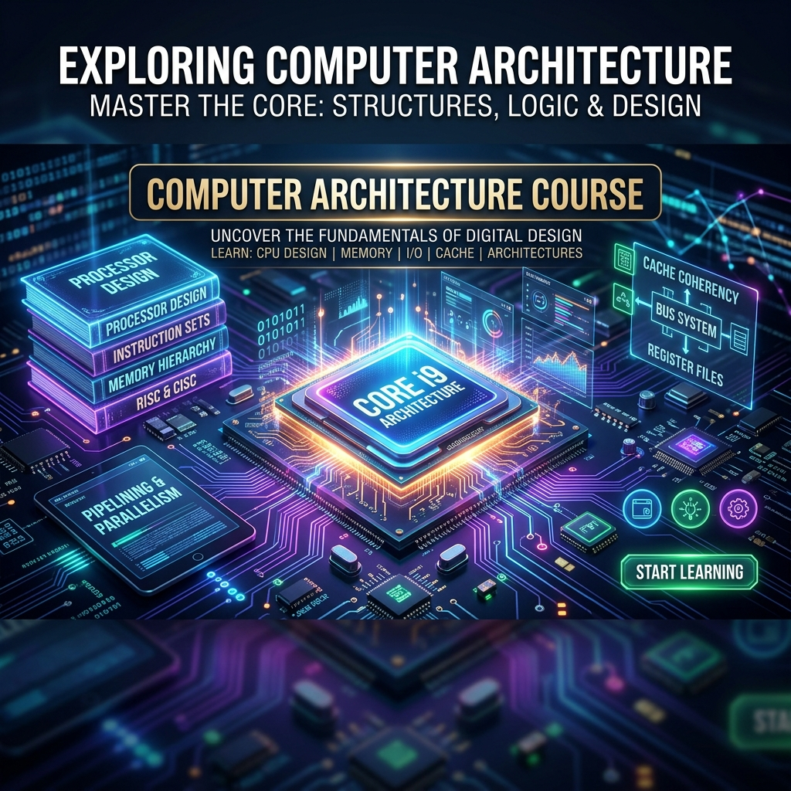

  

# 📚 ICT 1022 - Computer Systems Architecture (L8 Kuppi Notes)

> [!NOTE]
> මෙම ගොනු සමූහය 100% ක්ම බිංදුවේ සිට අදාළ විෂය කරුණු තේරුම් ගැනීම සඳහා සකසා ඇත. විශේෂයෙන් විභාගයට අදාළ ඉංග්‍රීසි පද සහ තර්කනයන් (Reasoning points) මෙහි සලකුණු කර ඇත.
> "Kuppi" පන්ති සඳහා මෙය කදිම මාර්ගෝපදේශයකි. 

පහත Link මත Click කර අදාළ පාඩම වෙත යන්න:

### 1. 📝 [01. Instruction Format (විධානයක හැඩතලය)](?note=ICT/1022/L8/01_Instruction_Format)
* Opcode සහ Operands යනු මොනවාද? (ප්‍රායෝගික උදාහරණ සහිතව)
* Instruction Types (0-address සිට Register-Register දක්වා)
* මහාචාර්ය මට්ටමේ Exam Q&A

### 2. 🎯 [02. Addressing Modes (යොමු කිරීමේ ක්‍රම)](?note=ICT/1022/L8/02_Addressing_Modes)
* Immediate, Direct, Indirect ක්‍රම අතර වෙනස (රූප සටහන් සහිතව)
* Register, Relative, සහ Indexed ක්‍රම වල වැදගත්කම
* විභාග පරීක්ෂකගේ ඇසින් (Exam Traps) සහ Exam Q&A

### 3. ⚖️ [03. CISC vs RISC Architecture](?note=ICT/1022/L8/03_CISC_vs_RISC)
* CISC සහ RISC හි ප්‍රධාන ලක්ෂණ සහ පසුබිම
* VAX සහ MIPS සංසන්දනය (Comparative Study)
* ඇයි Intel x86 තවමත් පවතින්නේ? (The Intel Trick)
* මහාචාර්ය මට්ටමේ Exam Q&A

### 4. ⚙️ [04. MIPS32 Architecture & CPU Registers](?note=ICT/1022/L8/04_MIPS32_Architecture)
* GPRs, PC, HI සහ LO Registers (ප්‍රායෝගික උදාහරණ සහිතව)
* විභාගයේදී සිසුන්ට වරදින තැන් (Traps - SP & Flags)
* Assembly Language Conventions (සම්මත නාමයන් - e.g. `$zero`, `$ra`, `$sp`)
* මහාචාර්ය මට්ටමේ Exam Q&A

---
### 🧠 [05. Interactive Mind Map (සම්පූර්ණ සාරාංශය) 🌟](05_Mindmap.html)
* මුළු පාඩමම එකම තැනකින් (Zoom/Pan/Click කළ හැකි)

---
> [!TIP]
> **Study Tip:** මෙම සටහන් පිළිවෙලට (1 සිට 4 දක්වා) අධ්‍යයනය කර, අවසානයේ Mind Map එක මඟින් සම්පූර්ණ පාඩම මතක් කරගන්න.
