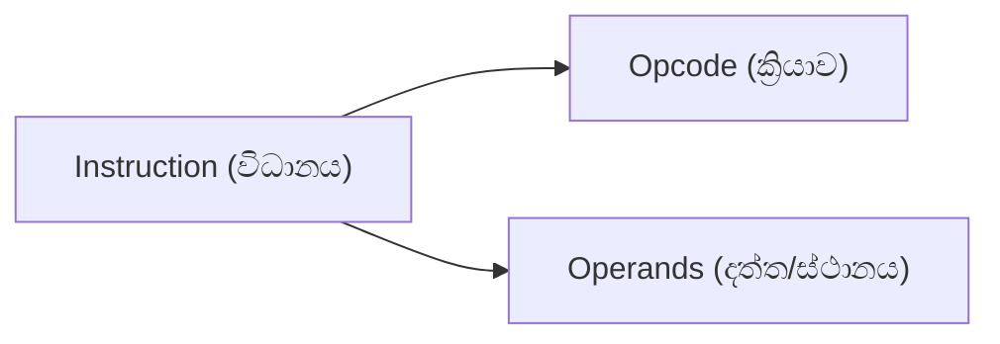

# 01. Instruction Format (විධානයක හැඩතලය)

> [!NOTE]
> **පසුබිම (Background):** පරිගණකයක මොළය වන CPU එකට තනියම කිසිවක් සිතිය නොහැක. එයට යම් වැඩක් කිරීමට නම්, අප විසින් "විධානයක්" (Instruction) ලබා දිය යුතුය. මෙම විධානයක් තුළ අනිවාර්යයෙන්ම තිබිය යුතු ප්‍රධාන කොටස් දෙකක් ඇත.

---

## 💡 ප්‍රායෝගික උදාහරණය (Real-World Analogy)

මෙය හරියට **"කෝකියෙකුට (Chef) කෑමක් හදන්න උපදෙස් දීමක්"** වගේ වැඩක්:

* **Opcode (මොකක්ද කරන්න ඕනේ?):** මේක හරියට "කපන්න", "බදින්න", "තම්බන්න" කියන **ක්‍රියාව (Action)** වගේ.
* **Operand (කාටද/මොකටද කරන්නේ?):** මේක හරියට "ළූණු", "මස්", "කැරට්" වගේ පාවිච්චි කරන **අමුද්‍රව්‍ය (Ingredients)** වගේ.

  
   
  <em><small style="color: #64748b;">රූප සටහන 1: Opcode (ක්‍රියාව) සහ Operands (අමුද්‍රව්‍ය)</small></em>

---

## 1. The Anatomy of an Instruction (විධානයක ව්‍යුහය)

ඕනෑම Instruction එකක් ප්‍රධාන කොටස් 2කට වෙන් වේ:

### A. Operation Code (Opcode)

* **සරල තේරුම:** "මොකක්ද කරන්න ඕනේ?" (What to do?)
* විධානය මඟින් කළ යුතු **ක්‍රියාව (Operation)** කුමක්දැයි CPU එකට දන්වන්නේ මෙයයි.
* **කාණ්ඩ (Categories):**
  * *Data transfer:* දත්ත එහා මෙහා ගෙන යාම (උදා: `LOAD`, `STORE`)
  * *Arithmetic and logical:* ගණිතමය හා තාර්කික වැඩ (උදා: `ADD`, `AND`)
  * *Control:* පාලනය කිරීම් (උදා: `JUMP`, `BRANCH`)
  * *I/O:* ආදාන/ප්‍රතිදාන

### B. Operand(s)

* **සරල තේරුම:** "කාටද/කොහෙන්ද ඒක කරන්නේ?" (To whom / Where?)
* ක්‍රියාව සිදු කිරීමට අවශ්‍ය කරන **දත්ත (Data)** හෝ එම දත්ත ඇති **ස්ථානය (Location)** පෙන්වා දෙයි.
* **Sources (ආදානයක් ලෙස ලබා දෙන තැන්):**
  1. Immediate data (කෙලින්ම අංකයක් දීම - e.g., `#25`)
  2. Register එකක් (e.g., `R1`)
  3. Memory address එකක් (e.g., `Mem[500]`)
* **Destination (ප්‍රතිඵලය ගබඩා කරන තැන):** Register එකක් හෝ Memory address එකක් විය හැක.

> [!WARNING]
> **Student Trap (සිසුන්ට වරදින තැන):**
> විභාගයේදී "Opcode" සහ "Operand" මාරු කරගන්න එපා. "Opcode" කියන්නේ "Operation" (ක්‍රියාව). "Operand" කියන්නේ "Data" (දත්තය).

---

## 2. Instruction Format Examples (උදාහරණ)

> [!IMPORTANT]
> **Exam Point:** විවිධ CPU Architecture අනුව එක Instruction එකක තිබිය හැකි Operands ගණන වෙනස් වේ.

| Instruction Type              | Format                         | Example            | Explanation (විස්තරය)                                                                               |
| :---------------------------- | :----------------------------- | :----------------- | :--------------------------------------------------------------------------------------------------------- |
| **0-address** (Implied) | `[Opcode]`                   | `HALT`, `NOP`  | Operand එකක් නැත. Opcode එක පමණි.                                                             |
| **1-address**           | `[Opcode] [Mem/Reg]`         | `ADD X`          | එක Operand එකක් පමණි (සාමාන්‍යයෙන් Accumulator එක සමග ක්‍රියා කරයි). |
| **2-address**           | `[Opcode] [Mem] [Mem]`       | `ADD X, Y`       | Memory Address දෙකක් හෝ Registers දෙකක් ඇත.                                                  |
| **Register-Memory**     | `[Opcode] [Reg] [Mem]`       | `ADD R1, X`      | එකක් Register එකකි, අනෙක Memory Address එකකි.                                              |
| **Register-Register**   | `[Opcode] [Reg] [Reg] [Reg]` | `ADD R1, R2, R3` | සියල්ලම Registers වේ. (RISC වල බහුලව පවතී).                                            |

> [!TIP]
> **Study Tip (මතක තබා ගන්න):**
> සියලුම Operands, Registers වන විට (Register-Register) එය අතිශය **වේගවත් (Fastest)** වේ, මන්ද Memory (RAM) එකට යාමට අවශ්‍ය නොවන බැවිනි.

---

## 3. A 32-bit Instruction Encoding Example (උදාහරණයක්)

> [!NOTE]
> 32-bit Instruction Architecture එකක (උදා: MIPS), හැම Instruction එකකම දිග හරියටම Bits 32යි. ඒ 32 ඇතුලේ Opcode එක සහ Operands (Registers) ගානට බෙදිලා තියෙනවා. Registers 32ක් තියෙනවා නම්, එක Register එකක් අඳුරගන්න **Bits 5ක්** අවශ්‍ය වේ ($2^5 = 32$).

**උදාහරණ 1: LOAD Instruction (Memory එකෙන් අගයක් ගෙන ඒම)**
`LOAD R11, 100(R2)` (R11 = Mem[R2 + 100])
මෙහි 32-bits බෙදෙන ආකාරය:

| 6 bits |   5 bits   |   5 bits   |           16 bits           |
| :----: | :--------: | :---------: | :-------------------------: |
| Opcode | Dest (R11) | Source (R2) | 16-bit Immediate Data (100) |

**උදාහරණ 2: ADD Instruction (Registers 3ක් එකතු කිරීම)**
`ADD R2, R5, R8` (R2 = R5 + R8)

| 6 bits |  5 bits  |    5 bits    |    5 bits    |   11 bits   |
| :----: | :-------: | :-----------: | :-----------: | :----------: |
| Opcode | Dest (R2) | Source 1 (R5) | Source 2 (R8) | ALU Function |

*(මෙමගින් Instruction දිග එකම ප්‍රමාණයක (Fixed size) තබාගෙන Hardware Decoding අතිශය පහසු කරයි).*

---

## 🎓 Exam Q&A (මහාචාර්ය මට්ටමේ ප්‍රශ්න සහ පිළිතුරු)

> [!TIP]
> විභාගයේදී මේ ප්‍රශ්න හරහා ඔයාගේ තර්කන හැකියාව පරීක්ෂා කරනු ඇත.

**Q1: Why is the "Register-Register" instruction format considered the fastest?**
(සියලුම Operands, Registers වන විට එය අතිශය වේගවත් වන්නේ ඇයි?)

* **Answer:** Registers are located inside the CPU and operate at the CPU's clock speed. Accessing the main memory (RAM) takes a lot of time. In a Register-Register format (e.g., `ADD R1, R2, R3`), there is **no memory access** required to fetch the operands or store the result. Everything happens instantly inside the CPU.

**Q2: If a CPU has 64 general-purpose registers, how many bits are required to specify one register operand in an instruction?**
(CPU එකක Registers 64ක් තිබේ නම්, ඉන් එක් Register එකක් Instruction එකක් තුළ පෙන්වීමට Bits කීයක් අවශ්‍යද?)

* **Answer:** **6 bits.** Because $2^6 = 64$. Therefore, a 6-bit field in the instruction can uniquely identify any one of the 64 registers (from `000000` to `111111`).

**Q3: What is a 0-address instruction? Give an example.**
(0-address Instruction එකක් යනු කුමක්ද? උදාහරණයක් දෙන්න.)

* **Answer:** A 0-address instruction contains **only an Opcode** and no explicit operands. The operands are implied (e.g., they might be inherently stored in a Stack).
* **Example:** `HALT` (stops the execution), `NOP` (No operation - does nothing but wastes a clock cycle, useful in pipelining), or `RET` (Return from function).

**Q4: Explain the difference between an Opcode and an Operand.**
(Opcode සහ Operand අතර වෙනස පැහැදිලි කරන්න.)

* **Answer:**
  * **Opcode:** Specifies the **action or operation** to be performed (e.g., Add, Subtract, Load).
  * **Operand:** Specifies the **data or the location** of the data upon which the operation is performed (e.g., Register R1, Memory Address 1050, Immediate value 5).
