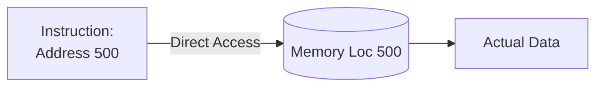
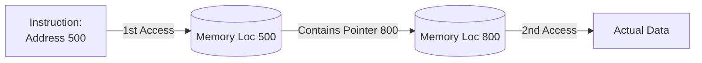

# 02. Addressing Modes (යොමු කිරීමේ ක්‍රම)

> [!NOTE]
> **පසුබිම (Background):** CPU එකට ක්‍රියාවක් කරන්න නම්, ඒකට අදාළ දත්තය (Operand Data) හොයාගන්න ඕනේ. දත්තය තියෙන තැනට යන පාර පෙන්වන විවිධ ක්‍රම වලට අපි **Addressing Modes** කියනවා. ("Mechanism by which the operand data can be located").

---

## 💡 ප්‍රායෝගික උදාහරණය (Real-World Analogy)

හිතන්න ඔයාට යාලුවෙක්ගේ ගෙදරකට යන්න ඕනේ කියලා. යාලුවා ඒක ඔයාට කියන්න පුළුවන් ක්‍රම කිහිපයක් තියෙනවා:
1. **Immediate (ක්ෂණික):** යාලුවාම ඔයාගේ ළඟට ඇවිත් බඩුමල්ල දෙනවා. ගෙවල් හොයන්න ඕනේ නෑ.
2. **Direct (සෘජු):** යාලුවා ගෙදර Address එක කෙලින්ම දෙනවා. ඔයා කෙලින්ම ගෙදරට යනවා.
3. **Indirect (වක්‍ර):** යාලුවා කියනවා "කඩේ මුදලාලි හම්බෙන්න" කියලා. කඩේට ගියාම මුදලාලි තමයි යාලුවගේ ගෙදර Address එක කියන්නේ.

  
   
  <em><small style="color: #64748b;">රූප සටහන 1: Immediate, Direct, සහ Indirect යන ක්‍රම වල සරල විවරණය</small></em>

---

## 1. Immediate Addressing (ක්ෂණික යොමු කිරීම)
* **ක්‍රමය:** Data එක හොයන්න කොහෙවත් යන්න ඕනේ නෑ. Instruction එක ඇතුලෙම (Part of the instruction itself) Data එක දීලා තියෙනවා.
* **වාසි/අවාසි:** Memory එකට යන්න අවශ්‍ය නැති නිසා **අතිශය වේගවත් (Fast)**. නමුත් Instruction එකේ Bits ගාණ සීමිත නිසා ලොකු අගයන් දෙන්න බෑ (Limited range).
* **උදාහරණ:** `ADDI #25` (මෙහි `25` යනු Immediate data වේ).

## 2. Direct Addressing (සෘජු යොමු කිරීම)
* **ක්‍රමය:** Instruction එක ඇතුලේ Data එක තියෙන **නියම Memory Address (ලිපිනය)** කෙලින්ම දීලා තියෙනවා.
* **වාසි/අවාසි:** එක පාරක් විතරක් Memory එකට යන්න ඕනේ (Single memory access). Address එක හොයන්න වෙන Calculations නෑ. නමුත් Address Space එක සීමිතයි.
* **උදාහරණ:** `ADD R1, 20A6H` (20A6H කියන කාමරේ තියෙන දත්තය ගේන්න).

## 3. Indirect Addressing (වක්‍ර යොමු කිරීම)
* **ක්‍රමය:** Instruction එකේ තියෙන්නේ Address එකක්. හැබැයි ඒ Address එකට ගියාම එතන තියෙන්නේ දත්තය නෙවෙයි, **තවත් Address එකක් (Pointer එකක්)**. ඒ දෙවෙනි Address එකට ගියාම තමයි නියම දත්තය (Operand) හම්බෙන්නේ.
* **වාසි/අවාසි:** විශාල Address space එකකට යන්න පුළුවන්. නමුත් **Memory එකට දෙපාරක් යන්න ඕනේ (Two memory accesses)** නිසා වේගය අඩුයි (Slower).
* **උදාහරණ:** `ADD R1, (20A6H)`

## 4. Register Addressing
* **ක්‍රමය:** Data තියෙන්නේ Memory (RAM) එකේ නෙවෙයි, CPU එක ඇතුලෙම තියෙන කුඩා වේගවත් මතකයන් වන **Registers** වල.
* **වාසි/අවාසි:** Memory Access කිසිවක් නැති නිසා **වේගවත්ම ක්‍රමයයි (Faster execution)**. Modern Load-Store Architectures (RISC) වල ප්‍රධාන වශයෙන් භාවිතා වේ.
* **උදාහරණ:** `ADD R1, R2, R3` (R1 = R2 + R3)

## 5. Register Indirect Addressing
* **ක්‍රමය:** Instruction එකේ Register එකක් තියෙනවා. ඒ Register එක ඇතුලේ තියෙන්නේ **Memory Address එකක්**. ඊටපස්සේ ඒ Address එකට (Memory එකට) ගිහින් Data ගන්නවා. (හරියට යාලුවෙක්ගේ සාක්කුවේ Address එක තියෙනවා වගේ).
* **උදාහරණ:** `ADD R1, (R5)` (R5 වල තියෙන Address එකට ගිහින් දත්තය ගේන්න).

## 6. Relative Addressing (PC Relative)
* **ක්‍රමය:** මෙහි සම්පූර්ණ Address එක Instruction එකේ නෑ. තියෙන්නේ පුංචි අගයක් (Offset / Displacement). CPU එක මේ Offset එක **Program Counter (PC)** එකට එකතු කරලා තමයි නියම Address (Effective Address) එක හදාගන්නේ.
* **සූත්‍රය:** `Effective Address = PC + Offset`
* **උදාහරණ:** Offset එක 12-bit නම්, -2048 සිට +2047 දක්වා පරාසයකට යන්න පුළුවන්. මෙය Branching සඳහා බහුලව යොදා ගනී.

## 7. Indexed Addressing
* **ක්‍රමය:** Offset එකකට **Index Register** එකක තියෙන අගය එකතු කරලා Effective Address එක හොයාගනී.
* **භාවිතය:** **Array (අරාවක) මූලද්‍රව්‍ය පිළිවෙලට කියවගෙන යන්න (Sequentially access)** මෙය ඉතා වැදගත් වේ. Offset එකෙන් Array එකේ මුලත් (Starting address), Index Register එකෙන් අදාළ ඉලක්කමත් (Array element index) පෙන්වයි.
* **උදාහරණ:** `LOAD R1, 1050(R3)` (Mem[1050 + R3]).

## 8. Stack Addressing
* **ක්‍රමය:** Data එක Stack එකේ උඩම (Top of the stack) තියෙනවා යැයි උපකල්පනය කරයි (Implicit).
* **උදාහරණ:** `PUSH X`, `POP X`, `ADD`. (SP - Stack Pointer එක මඟින් Stack එකේ Top එක පෙන්වයි).

---

## 🎓 Exam Q&A (මහාචාර්ය මට්ටමේ ප්‍රශ්න සහ පිළිතුරු)

> [!WARNING]
> **Exam Examiner's View (විභාග පරීක්ෂකගේ ඇසින්):**

**Q1: Which addressing modes require NO memory access to fetch the operand?**
(Memory Access එකක්වත් අවශ්‍ය නොවන Addressing Modes මොනවාද?)
* **Answer:** **Immediate Addressing** (Operand is inside the instruction) and **Register Addressing** (Operand is in a CPU register).

**Q2: Why is Indirect Addressing considered slower than Direct Addressing?**
(Indirect ක්‍රමය Direct ක්‍රමයට වඩා ප්‍රමාද (Slower) වීමට හේතුව කුමක්ද?)
* **Answer:** Direct addressing requires only **one memory access** to fetch the operand. However, Indirect addressing requires **two memory accesses**: the first access fetches the pointer (address of the operand), and the second access fetches the actual data.

**Q3: If a programmer needs to sequentially process elements of an Array, which addressing mode is the most suitable? Explain why.**
(Array එකක මූලද්‍රව්‍ය පිළිවෙලට සැකසීමට වඩාත්ම සුදුසු ක්‍රමය කුමක්ද? හේතු දක්වන්න.)
* **Answer:** **Indexed Addressing**. It allows keeping the starting address of the array in the instruction (as an offset) and using an Index Register to hold the index (e.g., 0, 1, 2). The CPU automatically adds them (`Effective Address = Offset + Index Register`). By simply incrementing the Index Register inside a loop, the program can efficiently scan through the entire array without changing the instruction itself.

**Q4: How does Relative Addressing (PC Relative) help in creating relocatable code?**
(කේතය වෙනත් ස්ථානයකට ගෙන යාමේදී (Relocatable code) Relative Addressing වැදගත් වන්නේ කෙසේද?)
* **Answer:** In Relative Addressing, the address is calculated as `PC + Offset`. Instead of hardcoding a fixed absolute address in the memory, it just says "Jump 5 steps forward from the current PC". Therefore, even if the entire program is loaded into a different part of the memory, the distance (Offset) remains the same, making the code fully position-independent (Relocatable).
