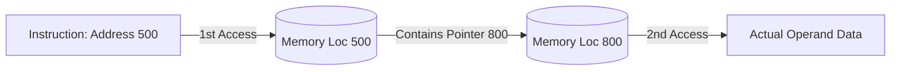

# 02. Addressing Modes (යොමු කිරීමේ ක්‍රම)

> [!NOTE]
> **පසුබිම (Background):** හිතන්න ඔයාට යාලුවෙක්ගේ ගෙදරකට යන්න ඕනේ කියලා. යාලුවා ඔයාට ඒක කියන්න පුළුවන් ක්‍රම කිහිපයක් තියෙනවා. 
> 1. එයාම ඔයාගේ ළඟට ඇවිත් හම්බවෙනවා (Immediate).
> 2. ගෙදර Address එක කෙලින්ම දෙනවා (Direct).
> 3. වෙන කඩෙකට යන්න කියනවා, එතන මුදලාලි ගෙදර Address එක කියනවා (Indirect).
> 
> අන්න ඒ වගේ CPU එකට Operand එක (Data එක) හොයාගන්න පාර කියන ක්‍රම වලට තමයි **Addressing Modes** කියන්නේ! ("Mechanism by which the operand data can be located").

---

## 1. Immediate Addressing (ක්ෂණික යොමු කිරීම)
* **ක්‍රමය:** Data එක හොයන්න කොහෙවත් යන්න ඕනේ නෑ. Instruction එක ඇතුලෙම (Part of the instruction itself) Data එක දීලා තියෙනවා.
* **වාසි/අවාසි:** Memory එකට යන්න අවශ්‍ය නැති නිසා **අතිශය වේගවත් (Fast)**. නමුත් Instruction එකේ Bits ගාණ සීමිත නිසා ලොකු අගයන් දෙන්න බෑ (Limited range).
* **උදාහරණ:** `ADDI #25` (මෙහි `25` යනු Immediate data වේ).

## 2. Direct Addressing (සෘජු යොමු කිරීම)
* **ක්‍රමය:** Instruction එක ඇතුලේ Data එක තියෙන **නියම Memory Address (ලිපිනය)** කෙලින්ම දීලා තියෙනවා.
* **වාසි/අවාසි:** එක පාරක් විතරක් Memory එකට යන්න ඕනේ (Single memory access). Address එක හොයන්න වෙන Calculations නෑ. නමුත් Address Space එක සීමිතයි.
* **උදාහරණ:** `ADD R1, 20A6H` (20A6H කියන කාමරේ තියෙන දත්තය ගේන්න).

```mermaid
graph LR
    A[Instruction: Opcode | Address 500] -->|Directly goes to| B[(Memory Location 500)]
    B --> C[Operand Data]
    style A fill:#f9f,stroke:#333,stroke-width:2px
    style B fill:#bbf,stroke:#333,stroke-width:2px
```

## 3. Indirect Addressing (වක්‍ර යොමු කිරීම)
* **ක්‍රමය:** Instruction එකේ තියෙන්නේ Address එකක්. හැබැයි ඒ Address එකට ගියාම එතන තියෙන්නේ දත්තය නෙවෙයි, **තවත් Address එකක් (Pointer එකක්)**. ඒ දෙවෙනි Address එකට ගියාම තමයි නියම දත්තය (Operand) හම්බෙන්නේ.
* **වාසි/අවාසි:** විශාල Address space එකකට යන්න පුළුවන්. නමුත් **Memory එකට දෙපාරක් යන්න ඕනේ (Two memory accesses)** නිසා වේගය අඩුයි (Slower).
* **උදාහරණ:** `ADD R1, (20A6H)`



## 4. Register Addressing
* **ක්‍රමය:** Data තියෙන්නේ Memory (RAM) එකේ නෙවෙයි, CPU එක ඇතුලෙම තියෙන කුඩා වේගවත් මතකයන් වන **Registers** වල.
* **වාසි/අවාසි:** Memory Access කිසිවක් නැති නිසා **වේගවත්ම ක්‍රමයයි (Faster execution)**. Modern Load-Store Architectures (RISC) වල ප්‍රධාන වශයෙන් භාවිතා වේ.
* **උදාහරණ:** `ADD R1, R2, R3` (R1 = R2 + R3)

## 5. Register Indirect Addressing
* **ක්‍රමය:** Instruction එකේ Register එකක් තියෙනවා. ඒ Register එක ඇතුලේ තියෙන්නේ **Memory Address එකක්**. ඊටපස්සේ ඒ Address එකට (Memory එකට) ගිහින් Data ගන්නවා.
* **උදාහරණ:** `ADD R1, (R5)` (R5 වල තියෙන Address එකට ගිහින් දත්තය ගේන්න).

## 6. Relative Addressing (PC Relative)
* **ක්‍රමය:** මෙහි සම්පූර්ණ Address එක Instruction එකේ නෑ. තියෙන්නේ පුංචි අගයක් (Offset / Displacement). CPU එක මේ Offset එක **Program Counter (PC)** එකට එකතු කරලා තමයි නියම Address (Effective Address) එක හදාගන්නේ.
* **සූත්‍රය:** `Effective Address = PC + Offset`
* **උදාහරණ:** Offset එක 12-bit නම්, -2048 සිට +2047 දක්වා පරාසයකට යන්න පුළුවන්.

## 7. Indexed Addressing
* **ක්‍රමය:** Offset එකකට **Index Register** එකක තියෙන අගය එකතු කරලා Effective Address එක හොයාගනී.
* **භාවිතය:** **Array (අරාවක) මූලද්‍රව්‍ය පිළිවෙලට කියවගෙන යන්න (Sequentially access)** මෙය ඉතා වැදගත් වේ. Offset එකෙන් Array එකේ මුලත් (Starting address), Index Register එකෙන් අදාළ ඉලක්කමත් (Array element) පෙන්වයි.
* **උදාහරණ:** `LOAD R1, 1050(R3)` (Mem[1050 + R3]).

## 8. Stack Addressing
* **ක්‍රමය:** Data එක Stack එකේ උඩම (Top of the stack) තියෙනවා යැයි උපකල්පනය කරයි (Implicit).
* **උදාහරණ:** `PUSH X`, `POP X`, `ADD`. (SP - Stack Pointer එක මඟින් Stack එකේ Top එක පෙන්වයි).

## 9. Base / Autoincrement / Autodecrement
* **Base Addressing:** Base Register එකට Address එක එකතු කරයි. Memory එකේ කේතය එහා මෙහා ගෙනියන්න පහසුයි (Easy movement of code).
* **Autoincrement / Autodecrement:** Data එක ගත්තට පස්සේ Register එකේ අගය ඉබේම වැඩි/අඩු වේ (C භාෂාවේ `a++` / `a--` මෙන්).

> [!WARNING]
> **Exam Examiner's View (විභාග පරීක්ෂකගේ ඇසින්):**
> 1. "Memory Access එකක්වත් නැති ක්‍රම මොනවාද?" -> Immediate සහ Register.
> 2. "Memory Access දෙකක් (Two accesses) ඕනේ ක්‍රමය මොකක්ද?" -> Indirect Addressing.
> 3. "Arrays පාවිච්චි කරන්න හොඳම ක්‍රමය?" -> Indexed Addressing.
