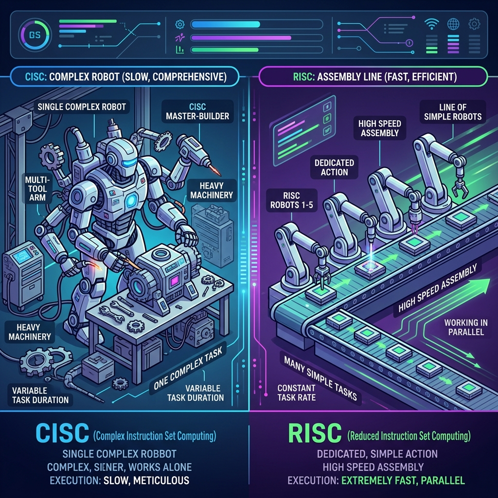
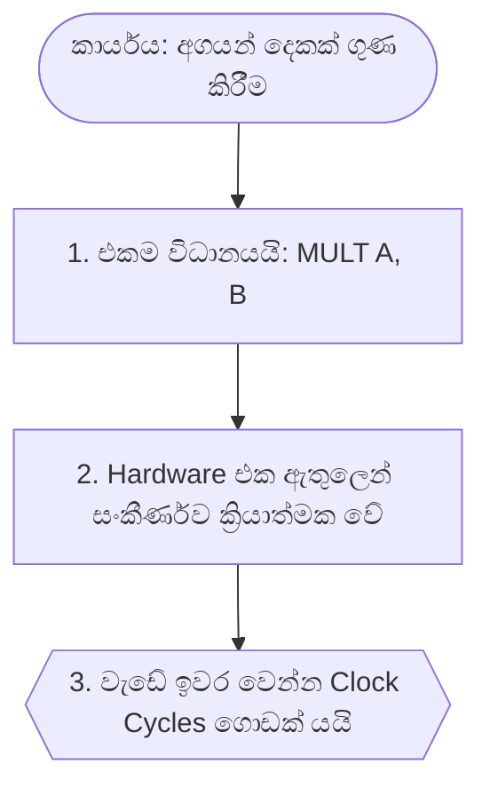
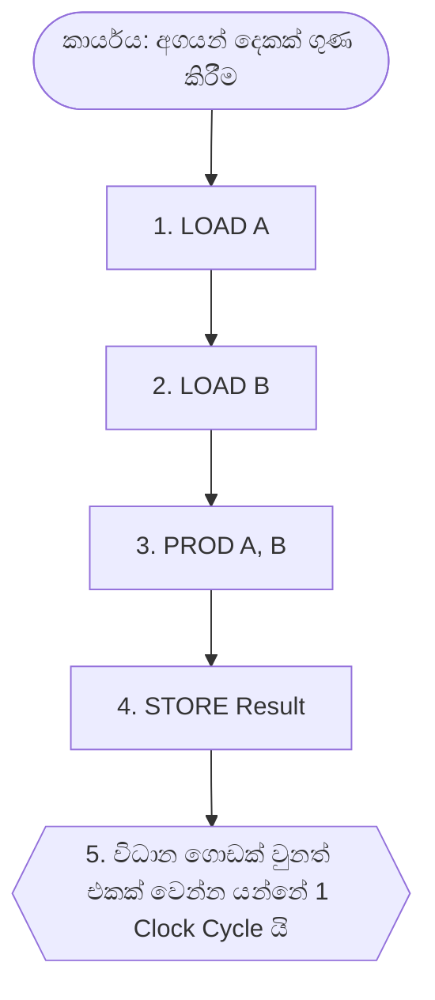

# 03. CISC vs RISC Architecture (සරල සහ ප්‍රායෝගික විවරණය)

> [!NOTE]
> **පසුබිම (Background):** 1970 දශකයේදී Memory (RAM) ඉතා මිල අධික විය. එබැවින් විද්‍යාඥයින් උත්සාහ කළේ ඉතා කෙටි, එහෙත් සංකීර්ණ Instructions (Complex instructions) සෑදීමටයි. මෙය **CISC** විය. නමුත් පසුව Memory ලාභදායී වූ අතර CPU වේගවත් විය. එවිට ඔවුන් තේරුම් ගත්තා "සරල Instructions ගොඩක්" වේගයෙන් Run කිරීම වඩාත් ඵලදායී බව. මෙය **RISC** විය.

---

## 💡 ප්‍රායෝගික උදාහරණය (Real-World Analogy)

මෙය හරියට **"ගේයක් හැදීම"** (Task) වගේ දෙයක් කියලා හිතන්න:

* **CISC (Complex) ක්‍රමය:**
  ඔයා **එක අතිදක්ෂ බාස් කෙනෙක්ට (Master Builder)** වැඩේ දෙනවා. ඔයා දෙන්නේ එකම එක Instruction එකයි: *"මට ගෙයක් හදලා දෙන්න"*. එයා ගල් බඳින්න, වයරින් කරන්න, පයිප්ප දාන්න ඔක්කොම දන්නවා. හැබැයි මේ එකම Instruction එක ඉවර කරන්න එයාට ගොඩක් කල් යනවා. ඒ වගේම එයාගේ මොළය (Hardware) හරිම සංකීර්ණයි.
* **RISC (Reduced) ක්‍රමය:**
  ඔයා ගේ හදන්න **සාමාන්‍ය කම්කරුවන් කණ්ඩායමකට (Assembly workers)** දෙනවා. එයාලා "ගේ හදන්න" දන්නේ නෑ. ඔයා එයාලට සරල Instructions දහස් ගාණක් දෙන්න ඕනේ: *"මේ ගඩොල තියන්න"*, *"සිමෙන්ති අනන්න"*. ඔයා (Compiler එක) ගොඩක් මහන්සි වෙලා Instructions දුන්නට, කම්කරුවෝ සරල වැඩේ ඉතාමත් වේගයෙන් සහ කාර්යක්ෂමව (Pipelining) ඉවර කරනවා!

  
   
  <em><small style="color: #64748b;">රූප සටහන 1: CISC (තනි දක්ෂ බාස්) සහ RISC (කම්කරුවන් කණ්ඩායම)</small></em>

> [!TIP]
> **Key Concept:** **CISC** uses hardware to do the complex work (Hard for Hardware, Easy for Compiler). **RISC** uses simple hardware but requires the compiler to do the complex work (Easy for Hardware, Hard for Compiler).

---

## 1. CISC (Complex Instruction Set Computer)

පැරණි (Traditional) ප්‍රවේශයයි. මෙහි ප්‍රධාන අරමුණ වූයේ Hardware මඟින් වැඩි කාර්යභාරයක් සිදු කර, Software Instructions සංඛ්‍යාව අඩු කිරීමයි.

### ප්‍රධාන ලක්ෂණ (Main Features):

* **සංකීර්ණ විධාන (Complex instruction set):** එක විධානයකින් කාර්යයන් කිහිපයක් කරයි.
* **බොහෝ Addressing Modes:** (R-R, R-M, M-M, Indexed, Indirect ආදී බොහෝ ක්‍රම ඇත).
* **විශේෂ Registers:** Special-purpose registers සහ Flags (Sign, Zero, Carry) විශාල ප්‍රමාණයක් ඇත.
* **විචල්‍ය දිග (Variable-length instructions):** එක එක Instruction එකේ දිග (Bits ගාණ) වෙනස්‍ ය.
* **සංකීර්ණත්වය:** Instruction එක Decode කිරීම සහ Pipeline එක හදන්න අතිශය අමාරුයි (Complex control unit).
* **උදාහරණ:** IBM 360/370, VAX-11/780, **Intel x86 / Pentium**.

---

## 2. RISC (Reduced Instruction Set Computer)

නවීන ප්‍රවේශයයි. මෙය **Load-Store Architecture** ලෙසද හැඳින්වේ.

### ප්‍රධාන ලක්ෂණ (Main Features):

* **Memory Access සීමිතයි:** Memory එකට යන්න පුළුවන් `LOAD` සහ `STORE` කියන Instructions දෙකට විතරයි! අනිත් හැමදේම කරන්නේ Processor Registers ඇතුලෙමයි.
* **සරල Architecture:** ඉතා පහසුවෙන් Pipelining කළ හැකි සරල සැලසුමකි.
* **අඩු Addressing Modes:** සරල ක්‍රම කිහිපයක් පමණක් ඇත.
* **General Registers:** General-purpose registers විශාල ප්‍රමාණයක් ඇත.
* **සමාන දිග (Uniform length):** හැම Instruction එකකම දිග (e.g., 32-bits) සමාන නිසා Decode කරන්න ලේසියි.
* **උදාහරණ:** CDC 6600, MIPS family, SPARC, **ARM**.

---

## 🔄 Execution Flow Comparison (සංසන්දනාත්මක සටහන)

### 1. CISC ක්‍රමය (Hardware අමාරුවේ වැටේ)

### 2. RISC ක්‍රමය (Compiler අමාරුවේ වැටේ)

---

## 3. Comparative Study (සංසන්දනාත්මක අධ්‍යයනය)

> [!IMPORTANT]
> **Exam Point:** 1991 දී VAX (CISC) සහ MIPS (RISC) අතර කළ පරීක්ෂණයේ ප්‍රතිඵල.

| Feature (ලක්ෂණය)                 | CISC (VAX)              | RISC (MIPS)                                                                                          |
| :------------------------------------- | :---------------------- | :--------------------------------------------------------------------------------------------------- |
| **Number of Instructions**       | අඩුයි              | **දෙගුණයක් (x2)** විධාන අවශ්‍ය විය.                                      |
| **Cycles Per Instruction (CPI)** | ගොඩක් වැඩියි | VAX එකේ CPI අගය MIPS වලට වඩා**6 ගුණයක්** විශාල විය.                  |
| **Overall Performance**          | අඩුයි              | MIPS හි ක්‍රියාකාරීත්වය VAX ට වඩා**3 ගුණයක් (x3)** වැඩි විය! |
| **Hardware Required**            | ගොඩක් වැඩියි | ඉතා අඩු Hardware ප්‍රමාණයක් අවශ්‍ය විය.                                     |

---

## 4. ඇයි Intel x86 තවමත් පවතින්නේ? (The Intel Trick)

ලෝකයේ අසාර්ථක වුණත් Intel x86 (CISC) තාම Desktop/Laptops වල පවතින්නේ ඇයි?

1. **Backward Compatibility:** පරණ Software ගොඩක් තියෙන නිසා අලුත් මැෂින් වලත් ඒවා වැඩ කරන්න ඕනේ.
2. **The Internal Trick (සමතුලිත ප්‍රවේශය):**
   * පිටතින් බලන User ට පේන්නේ ඒක **CISC** වගේ.
   * නමුත් ඇතුළත Hardware මඟින් ඒ හැම CISC Instruction එකක්ම **RISC Micro-operations ගොඩකට Translate (පරිවර්තනය)** කරනවා.
   * ඊටපස්සේ ඇතුළත තියෙන RISC Pipeline එකෙන් ඒක ඉතා වේගයෙන් Execute කරනවා!

---

## 🎓 Exam Q&A (විභාග මට්ටමේ ප්‍රශ්න සහ පිළිතුරු)

> [!TIP]
> විභාගයේදී මේ ප්‍රශ්න හරහා ඔයාගේ තර්කන හැකියාව (Reasoning Skills) පරීක්ෂා කරනු ඇත.

**Q1: Why is RISC called a "Load-Store Architecture"? Explain the advantage.**
(RISC යනු Load-Store Architecture එකක් ලෙස හඳුන්වන්නේ ඇයි? එහි වාසිය පැහැදිලි කරන්න.)

* **Answer:** In RISC, only `LOAD` and `STORE` instructions are allowed to access the main memory. All other operations (like ALU operations) must be performed only on data already inside the CPU **Registers**.
* **Advantage (වාසිය):** Memory access එක limit කරලා තියෙන නිසා Instructions ගොඩක් වේගයෙන් Execute වෙනවා. ඒ වගේම Instructions වල දිග (length) එක සමාන කරගන්න මේක උදව් වෙනවා. මෙය **Pipelining** ඉතා පහසු කරයි.

**Q2: "RISC moves the complexity from hardware to software (compiler)". Justify this statement.**
("RISC විසින් සංකීර්ණත්වය Hardware වලින් Software (Compiler) එකට මාරු කරයි". මෙම ප්‍රකාශය සාධාරණීකරණය කරන්න.)

* **Answer:** CISC වල තියෙන සංකීර්ණ Instructions එකකින් කරන ලොකු කාර්යය, RISC වලදී සරල Instructions කිහිපයක් බවට කඩන්න ඕනේ. Hardware සරල නිසා, මේ විදියට "කඩලා දෙන කාර්යය" (Instruction scheduling) කරන්නේ **Compiler** එක විසිනි. ඒ නිසා Compiler එක ඉතාමත් සංකීර්ණ (Complex) වෙනවා. (Think of it as giving precise, step-by-step instructions to the assembly workers).

**Q3: If RISC has better performance, why does Intel (CISC) still dominate the PC market? How do they achieve high performance?**
(RISC හි ක්‍රියාකාරීත්වය හොඳ නම්, Intel (CISC) තවමත් PC වෙළඳපොලේ ආධිපත්‍යය දරන්නේ ඇයි? ඔවුන් ඉහළ Performance එකක් ලබා ගන්නේ කෙසේද?)

* **Answer:** Intel dominates because of **Backward Compatibility**—they need to support decades of existing software. To achieve high performance, modern Intel processors use a hybrid approach. They take CISC instructions and use a **hardware translator** internally to break them down into simple RISC-like instructions (called micro-operations or μops). These are then executed on a fast, modern **RISC pipeline** inside the chip.

**Q4: Compare the Instruction length and decoding difficulty between CISC and RISC.**
(CISC සහ RISC අතර Instruction දිග සහ Decoding අපහසුතාවය සංසන්දනය කරන්න.)

* **Answer:**
  * **CISC:** Has **variable-length** instructions (e.g., 1 byte to 15 bytes). Decoding is **extremely difficult** and takes multiple clock cycles because the processor doesn't know where the next instruction starts until it decodes the current one.
  * **RISC:** Has **fixed-length** instructions (usually 32 bits / 4 bytes). Decoding is **very easy** and fast because the hardware always knows the exact size and format of every instruction.

> [!CAUTION]
> විභාගයේදී **CISC** (Complex) සහ **RISC** (Reduced) යන වචන වල තේරුම හොඳින් මතක තියාගෙන, ඒක පදනම් කරගෙන තර්කානුකූලව පිළිතුරු ගොඩනගන්න.
