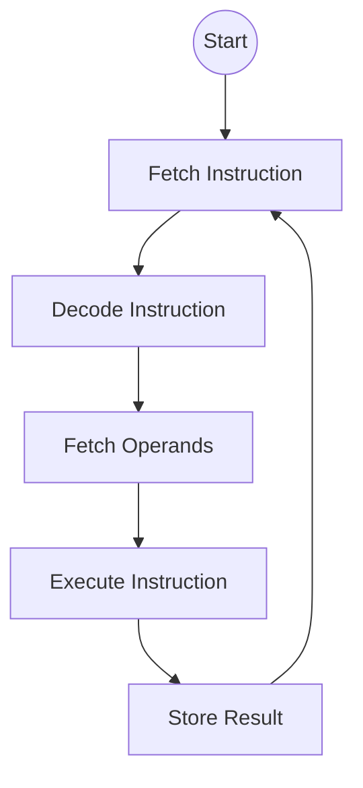
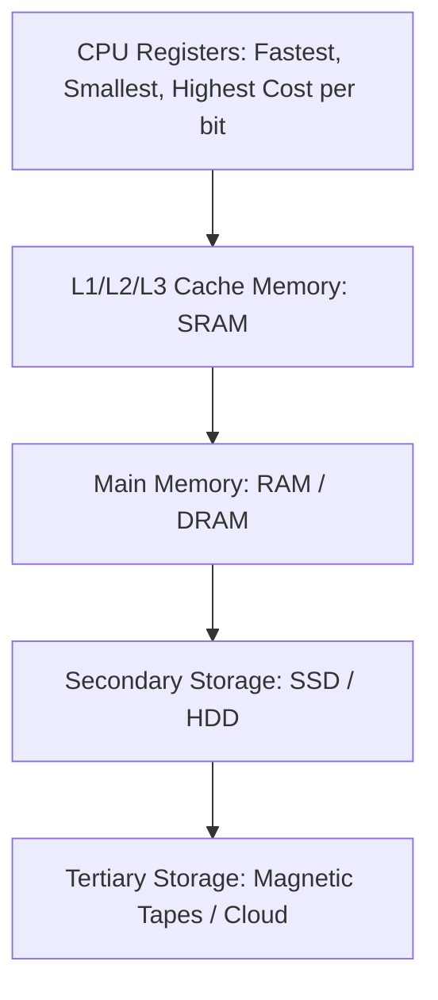

# 📘 2025 CSA Past Paper Review (Official)

මෙය 2025 වර්ෂයේ ලබාදුන් සැබෑ විභාග ප්‍රශ්න පත්‍රයේ (CSA 2025.pdf) සම්පූර්ණ සහ නිවැරදි විවරණයයි. මෙහි සෑම ප්‍රශ්නයකම නිවැරදි සිංහල පරිවර්තනය සහ පැහැදිලි කිරීම් අඩංගු කර ඇත.

---

## 📝 Question 01 [30 Marks]

### i. Modern processors often use a modified Harvard architecture instead of a pure Von Neumann or Harvard architecture.

#### a. Briefly explain what a modified Harvard architecture is, and how it differs from pure Von Neumann and Harvard models. [6 marks]
**❓ සිංහල පරිවර්තනය:** නවීන ප්‍රොසෙසරයන් බොහෝ විට පිරිසිදු Von Neumann හෝ Harvard ගෘහ නිර්මාණ ශිල්පයන් වෙනුවට වෙනස් කරන ලද (modified) Harvard ගෘහ නිර්මාණ ශිල්පයක් භාවිතා කරයි. Modified Harvard Architecture යනු කුමක්දැයි කෙටියෙන් පැහැදිලි කර, එය පිරිසිදු Von Neumann සහ Harvard ආකෘති වලින් වෙනස් වන්නේ කෙසේදැයි දක්වන්න.
**💡 පැහැදිලි කිරීම:** Von Neumann එකේ Data, Instructions සේරම එකම Memory එකක තියෙන්නේ (Bottleneck). Pure Harvard එකේ Data වලටයි Instructions වලටයි වෙන වෙනම Main Memories දෙකක් තියෙනවා (Costly). Modified Harvard කියන්නේ මේ දෙකේම මිශ්‍රණයක්. ඒ කියන්නේ Main Memory එක එකයි (Von Neumann වගේ), හැබැයි CPU එක ඇතුළේ Cache එක Data Cache සහ Instruction Cache කියලා දෙකකට කඩලා තියෙනවා (Harvard වගේ).

**✍️ Exam Answer:**
* **Modified Harvard Architecture:** It is a hybrid model that uses a single, unified main memory for both data and instructions (like Von Neumann) externally, but separates them internally within the CPU using distinct, separate L1 caches for data and instructions (like Harvard).
* **Differences:** 
  * *Pure Von Neumann:* Uses a single unified memory and a single bus for both data and instructions internally and externally, leading to a bottleneck.
  * *Pure Harvard:* Strictly uses two physically separate main memory modules and buses for data and instructions, which is highly expensive and complex.
  * *Modified Harvard:* Merges the best of both by keeping main memory unified (cheaper, flexible) while dividing internal cache memory (faster, no bottlenecks).
* **🎯 Marking Scheme:** 2 marks for defining Modified Harvard (Unified Main Mem + Split Cache). 2 marks for Von Neumann difference. 2 marks for Pure Harvard difference.

#### b. Discuss two key advantages of using a modified Harvard architecture in modern processors. [4 marks]
**❓ සිංහල පරිවර්තනය:** නවීන ප්‍රොසෙසර වල modified Harvard architecture භාවිතා කිරීමේ ප්‍රධාන වාසි දෙකක් සාකච්ඡා කරන්න.
**💡 පැහැදිලි කිරීම:** මේකේ වාසි දෙකයි. 1. වේගවත් (Cache දෙකක් තියෙන නිසා එකවර Data සහ Instructions ගන්න පුළුවන්). 2. ලාභයි සහ පහසුයි (Main memory එක එකක් නිසා).

**✍️ Exam Answer:**
1. **Concurrency / High Throughput:** Because there are separate internal caches and buses for data and instructions, the CPU can fetch an instruction and read/write data simultaneously in the exact same clock cycle without any stalls.
2. **Cost & Space Efficiency:** It maintains a single unified main memory (RAM). This is much cheaper and simpler to build on a motherboard than requiring two separate, massive memory banks as dictated by a pure Harvard model.
* **🎯 Marking Scheme:** 2 marks per valid advantage with explanation.

#### c. Explain how the use of caches in a modified Harvard architecture helps improve instruction throughput and overall CPU performance. [5 marks]
**❓ සිංහල පරිවර්තනය:** Modified Harvard architecture එකක් තුළ කෑෂ් (caches) භාවිතා කිරීම මගින් උපදෙස් කාර්යසාධනය (instruction throughput) සහ සමස්ත CPU ක්‍රියාකාරීත්වය වැඩිදියුණු කිරීමට උපකාරී වන්නේ කෙසේදැයි පැහැදිලි කරන්න.
**💡 පැහැදිලි කිරීම:** Cache කියන්නේ CPU එක ගාවම තියෙන වේගවත්ම මතකය. ඒක දෙකට කඩලා තියෙන (L1d සහ L1i) නිසා, CPU එකට Main memory එකට යනකම් බලාගෙන ඉන්න ඕනේ නෑ.

**✍️ Exam Answer:**
* By implementing **split caches** (L1 Instruction Cache and L1 Data Cache) directly on the CPU chip, the processor rarely has to access the much slower external Main Memory.
* It completely eliminates structural hazards in the CPU pipeline. During the Fetch stage, the CPU fetches from the Instruction Cache, and during the Memory stage, it interacts with the Data Cache. Since they are physically separate, both stages can execute at the exact same time, vastly increasing throughput and minimizing pipeline stalls.
* **🎯 Marking Scheme:** 2 marks for mentioning split L1 caches. 3 marks for explaining how it eliminates structural hazards/pipeline stalls by allowing concurrent access.

### ii. Explain the functions of the Arithmetic Logic Unit (ALU) in detail. Include at least four operations it can perform. [8 marks]
**❓ සිංහල පරිවර්තනය:** Arithmetic Logic Unit (ALU) හි කාර්යයන් සවිස්තරාත්මකව පැහැදිලි කරන්න. එයට සිදු කළ හැකි මෙහෙයුම් හතරක්වත් (four operations) ඇතුළත් කරන්න.
**💡 පැහැදිලි කිරීම:** ALU එකෙන් කරන්නේ ගණිතමය සහ තාර්කික වැඩ කියලා ලියලා, උදාහරණ විදිහට ADD, SUB, AND, OR, NOT වගේ දේවල් ලියන්න.

**✍️ Exam Answer:**
* **Function:** The ALU is the computational heart of the CPU. It is purely responsible for executing all mathematical and logical data processing operations as dictated by the Control Unit. It takes raw inputs from registers, processes them through combinational logic circuits, and outputs the result back to a register, while also updating status flags (like Zero, Carry, or Negative).
* **Four Operations it can perform:**
  1. **Arithmetic Addition (ADD):** Adds two integer values.
  2. **Arithmetic Subtraction (SUB):** Subtracts one value from another using 2's complement logic.
  3. **Logical AND:** Performs a bitwise AND operation for masking bits.
  4. **Logical Shift (LSL/LSR):** Shifts bits left or right, effectively multiplying or dividing by powers of 2.
* **🎯 Marking Scheme:** 4 marks for a detailed functional explanation. 1 mark each (up to 4) for listing distinct operations.

### iii. Compare assembly language and high-level language in terms of readability, portability, and execution. [7 marks]
**❓ සිංහල පරිවර්තනය:** කියවීමේ හැකියාව (readability), ගෙනයාමේ හැකියාව (portability) සහ ක්‍රියාත්මක කිරීම (execution) යන කරුණු යටතේ assembly language සහ high-level language සන්සන්දනය කරන්න.
**💡 පැහැදිලි කිරීම:** මේ භාෂා දෙක ඔය කියන කරුණු 3 යටතේ වෙනස් වෙන හැටි වගුවකින් හරි ඡේද වලින් හරි ලියන්න ඕනේ. (උදා: HLL කියවන්න ලේසියි, Assembly අමාරුයි).

**✍️ Exam Answer:**
| Feature | Assembly Language (Low-Level) | High-Level Language (HLL) |
| :--- | :--- | :--- |
| **1. Readability** | Difficult to read and write. Uses obscure mnemonics (`MOV`, `LW`) and manages bare registers. | Highly readable and user-friendly. Uses English-like syntax (`if`, `while`, `print`). |
| **2. Portability** | Highly Non-Portable. Code written for one CPU architecture (e.g. ARM) will entirely fail on another (e.g. x86). | Highly Portable. The same source code can be compiled to run on almost any architecture. |
| **3. Execution** | Extremely fast and highly efficient. Runs almost directly on hardware with zero abstraction overhead. | Slower. Must be translated by heavy compilers or interpreters, adding overhead. |
* **🎯 Marking Scheme:** For each of the 3 points (Readability, Portability, Execution), allocate 1 mark for Assembly description and 1 mark for HLL description (Total 6). 1 mark for overall clarity/presentation.

---

## 📝 Question 02 [35 Marks]

### i. a. Illustrate the instruction execution cycle of a computer with the help of a diagram. [5 marks]
**❓ සිංහල පරිවර්තනය:** රූපසටහනක ආධාරයෙන් පරිගණකයක උපදෙස් ක්‍රියාත්මක කිරීමේ චක්‍රය (instruction execution cycle) නිරූපණය කරන්න.
**💡 පැහැදිලි කිරීම:** CPU එකක් ඇතුළේ program එකක් run වෙද්දී සිදුවෙන මූලික පියවර 4 (Fetch, Decode, Execute, Write-back) චක්‍රයක් (Loop එකක්) විදිහට අඳින්නයි කියන්නේ.

**✍️ Exam Answer:**

* **🎯 Marking Scheme:** 1 mark for each valid block (Fetch, Decode, Execute, Store). 1 mark for indicating the cyclic/looping nature.

### b. Briefly explain the role of the PC, IR, MAR, and MDR. [8 marks]
**❓ සිංහල පරිවර්තනය:** PC, IR, MAR සහ MDR හි කාර්යභාරය කෙටියෙන් පැහැදිලි කරන්න.
**💡 පැහැදිලි කිරීම:** මේවා CPU එක ඇතුළේ තියෙන ප්‍රධාන Registers 4 ක්. ඒ ඒ එකෙන් කරන දේ ලියන්න.

**✍️ Exam Answer:**
* **PC (Program Counter):** Holds the specific memory address of the *next* instruction to be fetched from memory.
* **IR (Instruction Register):** Holds the actual, current instruction that has just been fetched from memory and is actively being decoded and executed by the Control Unit.
* **MAR (Memory Address Register):** Connected to the Address Bus. It holds the memory address of the data or instruction that the CPU currently wants to read from or write to in Main Memory.
* **MDR (Memory Data Register):** Connected to the Data Bus. It acts as a buffer, holding the actual data that was just read from memory, or the data that is about to be written to memory.
* **🎯 Marking Scheme:** 2 marks per accurately described register.

### ii. Consider the instruction ADD R1, R2 where the initial values of R1 = 50 and R2 = 200. Describe step-by-step how this instruction is executed. [6 marks]
**❓ සිංහල පරිවර්තනය:** R1 = 50 සහ R2 = 200 ආරම්භක අගයන් ඇති `ADD R1, R2` යන උපදෙස සලකා බලන්න. මෙම උපදෙස ක්‍රියාත්මක වන ආකාරය පියවරෙන් පියවර විස්තර කරන්න.
**💡 පැහැදිලි කිරීම:** මේක Execute වෙන පියවර ලියන්න. (R1, R2 අගයන් ALU එකට යවලා, 250 හදලා, ඒක ආයේ R1 එකටම ලියන විදිහ).

**✍️ Exam Answer:**
1. **Decode:** The Control Unit decodes the instruction and signals the ALU to perform an addition.
2. **Fetch Operands:** The values currently stored in the registers are sent over the internal datapath to the ALU inputs. Operand 1 gets `50` (from R1) and Operand 2 gets `200` (from R2).
3. **Execute:** The ALU performs binary addition on the inputs: `50 + 200 = 250`.
4. **Write-Back:** The ALU places the final result (`250`) back onto the internal bus, and it is written into the destination register (`R1`). The old value of R1 is erased, and R1 now holds `250`.
* **🎯 Marking Scheme:** 1.5 marks for each distinct logical step (Decode, Inputs to ALU, Math operation, Write-back to destination).

### iii. Explain the difference between single-bus architecture and multi-bus architecture. [6 marks]
**❓ සිංහල පරිවර්තනය:** තනි බස් ගෘහ නිර්මාණ ශිල්පය (single-bus architecture) සහ බහු-බස් ගෘහ නිර්මාණ ශිල්පය (multi-bus architecture) අතර වෙනස පැහැදිලි කරන්න.
**💡 පැහැදිලි කිරීම:** සේරම (CPU, RAM, HDD) එකම පාරක (bus) යන Single-bus සහ වේගයන් අනුව පාරවල් කිහිපයකට (multi-bus) වෙන් කරලා තියෙන විදිහ සංසන්දනය කරන්න.

**✍️ Exam Answer:**
* **Single-Bus Architecture:** All components (CPU, RAM, and all slow I/O devices) share exactly one common system bus. 
  * *Disadvantage:* Causes severe bottlenecks because only one device can transmit at a time, forcing the lightning-fast CPU to wait for slow mechanical devices.
* **Multi-Bus Architecture:** The system uses a hierarchy of different buses connected by bridge chips. A fast Local/Front-Side bus connects the CPU tightly to RAM, while a slower Peripheral bus (like PCI/USB) handles I/O devices.
  * *Advantage:* Allows concurrent data transfers (CPU can talk to RAM while a hard drive talks to the network), completely removing the slow-device bottleneck.
* **🎯 Marking Scheme:** 3 marks for describing Single-bus and its bottleneck. 3 marks for describing Multi-bus and its parallel advantage.

### iv. Modern computers use a memory hierarchy instead of a single large memory.
#### a. Draw and label a typical memory hierarchy. [6 marks]
**❓ සිංහල පරිවර්තනය:** නවීන පරිගණක තනි විශාල මතකයක් වෙනුවට මතක ධූරාවලියක් (memory hierarchy) භාවිතා කරයි. සාමාන්‍ය මතක ධූරාවලියක් ඇඳ නම් කරන්න.
**💡 පැහැදිලි කිරීම:** වේගය වැඩිම සහ ධාරිතාව අඩුම Registers වල ඉඳන් පහළට පිරමීඩයක් විදිහට අඳින්න.

**✍️ Exam Answer:**

*(In an exam, draw this as a pyramid/triangle).*
* **🎯 Marking Scheme:** 2 marks for showing a top-down hierarchical structure. 4 marks for correctly ordering Registers, Cache, RAM, and HDD/Storage.

#### b. Explain how temporal locality and spatial locality are exploited in cache memory. [4 marks]
**❓ සිංහල පරිවර්තනය:** Cache මතකය තුළ temporal locality සහ spatial locality ප්‍රයෝජනයට ගන්නේ කෙසේදැයි පැහැදිලි කරන්න.
**💡 පැහැදිලි කිරීම:** Temporal කියන්නේ "දැන් ගත්ත දත්තයක් ආයෙත් ළඟදීම ඕනේ වෙයි" කියන එක (Loops වගේ). Spatial කියන්නේ "දැන් ගත්ත දත්තයට ළඟින්ම තියෙන දත්තයත් ළඟදීම ඕනේ වෙයි" කියන එක (Arrays වගේ). Cache එක මේ දෙකම පාවිච්චි කරලා අනුමාන කරලා දත්ත ගෙනත් තියාගන්නවා.

**✍️ Exam Answer:**
* **Temporal Locality (Locality in Time):** The principle that if a memory location is accessed now, it is highly likely to be accessed again very soon (e.g., instructions inside a `while` loop). Cache exploits this by keeping recently accessed data stored inside the cache instead of discarding it immediately.
* **Spatial Locality (Locality in Space):** The principle that if a memory location is accessed, nearby memory locations will likely be accessed soon (e.g., reading an array sequentially). Cache exploits this by always fetching entire *Blocks* (or lines) of data from RAM into the cache at once, rather than fetching just a single byte.
* **🎯 Marking Scheme:** 2 marks for Temporal Locality. 2 marks for Spatial Locality.

---

## 📝 Question 03 [35 Marks]

### i. A calculator displays the results in both binary and decimal. Consider the 6-bit signed binary numbers: A=001101₂, B=000111₂. Showing all intermediate steps, perform the subtraction A-B using the signed-2's complement method. [6 marks]
**❓ සිංහල පරිවර්තනය:** කැල්කියුලේටරයක් ප්‍රතිඵල ද්විමය සහ දශම දෙකෙන්ම පෙන්වයි. 6-bit සලකුණු සහිත ද්විමය සංඛ්‍යා දෙකක් සලකන්න: $A=001101_2$, $B=000111_2$. සියලුම අතරමැදි පියවර පෙන්වමින්, signed-2's complement ක්‍රමය භාවිතයෙන් $A-B$ අඩු කිරීම සිදු කරන්න.
**💡 පැහැදිලි කිරීම:** $A - B$ කියන්නේ $A + (-B)$ ට සමානයි. ඒ නිසා B වල 2's complement එක (එනම් -B) හොයාගෙන ඒක A ට එකතු කරන්න.

**✍️ Exam Answer (Steps):**
* **Given:**
  * $A = 001101$  (which is +13 in decimal)
  * $B = 000111$  (which is +7 in decimal)
* **Goal:** Calculate $A - B$, which is equivalent to $A + (-B)$.
* **Step 1: Find 2's complement of B (to get -B):**
  * 1's complement of B (invert bits): `111000`
  * Add 1: `111000 + 1` = `111001` (This is -B)
* **Step 2: Add A and (-B):**
  ```text
    001101
  + 111001
  ---------
  1 000110  (Discard the carry out bit '1')
  ```
* **Result:** `000110`
* *(Verification: The result is 000110 which equals +6 in decimal. Since 13 - 7 = 6, the calculation is perfectly correct).*
* **🎯 Marking Scheme:** 2 marks for 1's complement of B. 1 mark for adding 1 to get 2's complement. 2 marks for binary addition. 1 mark for correct final answer and ignoring carry.

### ii. Consider the following instruction: LOAD R4, 50(R3)
#### a. Identify the addressing mode used. [4 marks]
**❓ සිංහල පරිවර්තනය:** භාවිතා කර ඇති ලිපින මාදිලිය (addressing mode) හඳුනාගන්න.
**💡 පැහැදිලි කිරීම:** මෙතනදී 50 කියන offset අගය R3 register එකේ තියෙන අගයට එකතු කරනවා. මේකට කියන්නේ Base/Displacement Addressing කියලා.

**✍️ Exam Answer:**
* **Addressing Mode:** Base Addressing Mode (also widely known as Displacement Addressing Mode or Indexed Addressing).
* **🎯 Marking Scheme:** 4 marks for correctly identifying Base/Displacement/Indexed mode.

#### b. If R3 = 1000, show the step-by-step calculation of the effective memory address accessed. [5 marks]
**❓ සිංහල පරිවර්තනය:** R3 = 1000 නම්, ප්‍රවේශ වූ සැබෑ මතක ලිපිනය (effective memory address) ගණනය කිරීමේ පියවරෙන් පියවර ක්‍රියාවලිය පෙන්වන්න.
**💡 පැහැදිලි කිරීම:** Effective Address = Register Value + Offset/Displacement Value.

**✍️ Exam Answer:**
* **Formula:** `Effective Address (EA) = Value in Base Register + Displacement (Offset) value`
* **Given:** 
  * Value in Base Register (R3) = `1000`
  * Displacement = `50`
* **Calculation:** `EA = 1000 + 50`
* **Effective Address = `1050`**
* **Explanation:** The CPU will go to memory location 1050, fetch the data stored there, and load it into register R4.
* **🎯 Marking Scheme:** 2 marks for formula/concept. 3 marks for correct final address (1050).

### iii. MIPS32 follows a load-store architecture. Explain why this design choice simplifies pipelining. [5 marks]
**❓ සිංහල පරිවර්තනය:** MIPS32 load-store ගෘහ නිර්මාණ ශිල්පයක් අනුගමනය කරයි. මෙම සැලසුම් තේරීම මගින් pipelining සරල කරන්නේ මන්දැයි පැහැදිලි කරන්න.
**💡 පැහැදිලි කිරීම:** Load-Store ආකෘතියකදී (RISC), මතකයට යන්න (RAM එකට යන්න) පුළුවන් Load සහ Store උපදෙස් වලට විතරයි. ADD/SUB වගේ අනිත් හැම උපදෙසක්ම වැඩ කරන්නේ Registers ඇතුළේ විතරයි. මේ නිසා හැම instruction එකක්ම එකම දිගක් ගන්නවා වගේම, Pipeline එක හිරවෙන්නේ නෑ.

**✍️ Exam Answer:**
* In a Load-Store architecture (RISC), arithmetic and logic operations (like ADD, SUB) can *only* be performed on values already inside CPU registers. They are strictly forbidden from directly interacting with main memory. Only `LOAD` and `STORE` instructions can access memory.
* **Why it simplifies pipelining:** 
  1. It forces all instructions to have a highly uniform, predictable length and execution time.
  2. Because ALU instructions don't need to wait for a slow memory read in the middle of their execution, the pipeline stages (IF, ID, EX, MEM, WB) become perfectly balanced and regular. The "MEM" stage is simply bypassed or sits idle for ALU operations, eliminating complex stalls and ensuring smooth instruction flow.
* **🎯 Marking Scheme:** 2 marks for defining Load-store (only load/store touch memory). 3 marks for explaining uniform length and balanced pipeline stages without complex memory stalls.

### iv. Consider the following MIPS32 instructions:
```assembly
add $t1, $s1, $s2
lw $t2, 100($s3)
j 40000
```
#### a. For each instruction, identify its type format (R-type, I-type, J-type). [3 marks]
**❓ සිංහල පරිවර්තනය:** එක් එක් උපදෙස සඳහා, එහි ආකෘති වර්ගය (R-type, I-type, J-type) හඳුනාගන්න.
**💡 පැහැදිලි කිරීම:** ADD කියන්නේ registers විතරක් පාවිච්චි වෙන R-type එකක්. lw (load word) කියන්නේ ඉලක්කමක් (100) පාවිච්චි වෙන I-type එකක්. j (jump) කියන්නේ J-type එකක්.

**✍️ Exam Answer:**
* `add $t1, $s1, $s2` ➔ **R-type** (Register-type)
* `lw $t2, 100($s3)` ➔ **I-type** (Immediate-type)
* `j 40000` ➔ **J-type** (Jump-type)
* **🎯 Marking Scheme:** 1 mark each (3 total).

#### b. Show the instruction encoding fields as appropriate. [6 marks]
**❓ සිංහල පරිවර්තනය:** අදාළ පරිදි උපදෙස් කේතන ක්ෂේත්‍ර (instruction encoding fields) පෙන්වන්න.
**💡 පැහැදිලි කිරීම:** ඒ ඒ format එකට අදාළව bit 32 වෙන්වෙලා තියෙන blocks ටික ලියන්න.

**✍️ Exam Answer:**
* **R-type Format (32 bits):** `[opcode (6)] | [rs (5)] | [rt (5)] | [rd (5)] | [shamt (5)] | [funct (6)]`
* **I-type Format (32 bits):** `[opcode (6)] | [rs (5)] | [rt (5)] | [immediate (16)]`
* **J-type Format (32 bits):** `[opcode (6)] | [target address (26)]`
* **🎯 Marking Scheme:** 2 marks for correctly showing the fields of each format (Total 6).

#### c. Translate the MIPS32 assembly instructions into MIPS32 machine instructions. [6 marks]
*(Using the provided supplementary details table)*
**❓ සිංහල පරිවර්තනය:** ලබා දී ඇති වගුව භාවිතා කරමින්, MIPS32 assembly උපදෙස් MIPS32 යන්ත්‍ර උපදෙස් (machine instructions - 0 සහ 1) බවට පරිවර්තනය කරන්න.
**💡 පැහැදිලි කිරීම:** වගුවෙන් අදාළ අගයන් අරගෙන බයිනරි වලට හරවලා කලින් ලියපු fields වලට දාන්න.

**✍️ Exam Answer:**
*(Note: Registers from table: `$t1`=9, `$s1`=17, `$s2`=18, `$t2`=10, `$s3`=19. Opcode for R-type=000000. Funct for add=100000. Opcode for lw=100011. Opcode for j=000010).*

**1. `add $t1, $s1, $s2` (R-type: opcode, rs, rt, rd, shamt, funct)**
* rs = $s1 = 17 = `10001`
* rt = $s2 = 18 = `10010`
* rd = $t1 = 9  = `01001`
* **Machine Code:** `000000 10001 10010 01001 00000 100000`

**2. `lw $t2, 100($s3)` (I-type: opcode, rs, rt, immediate)**
* rs (base) = $s3 = 19 = `10011`
* rt (dest) = $t2 = 10 = `01010`
* immediate = 100 = `0000000001100100` (16-bit binary)
* **Machine Code:** `100011 10011 01010 0000000001100100`

**3. `j 40000` (J-type: opcode, target address)**
* Target address = 40000 / 4 (MIPS shifts by 2) = 10000 = `000000000010011100010000` (26 bits). 
* *(Assuming direct 26-bit embedding of 40000 if bit shifting is ignored as per standard simple questions: 40000 = `000000000010011100010000`)*
* **Machine Code:** `000010 000000000010011100010000`
* **🎯 Marking Scheme:** 2 marks per accurately translated machine instruction (Total 6).
