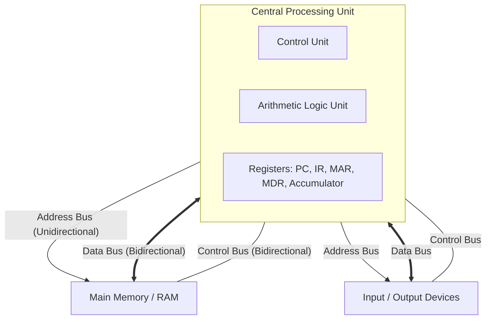
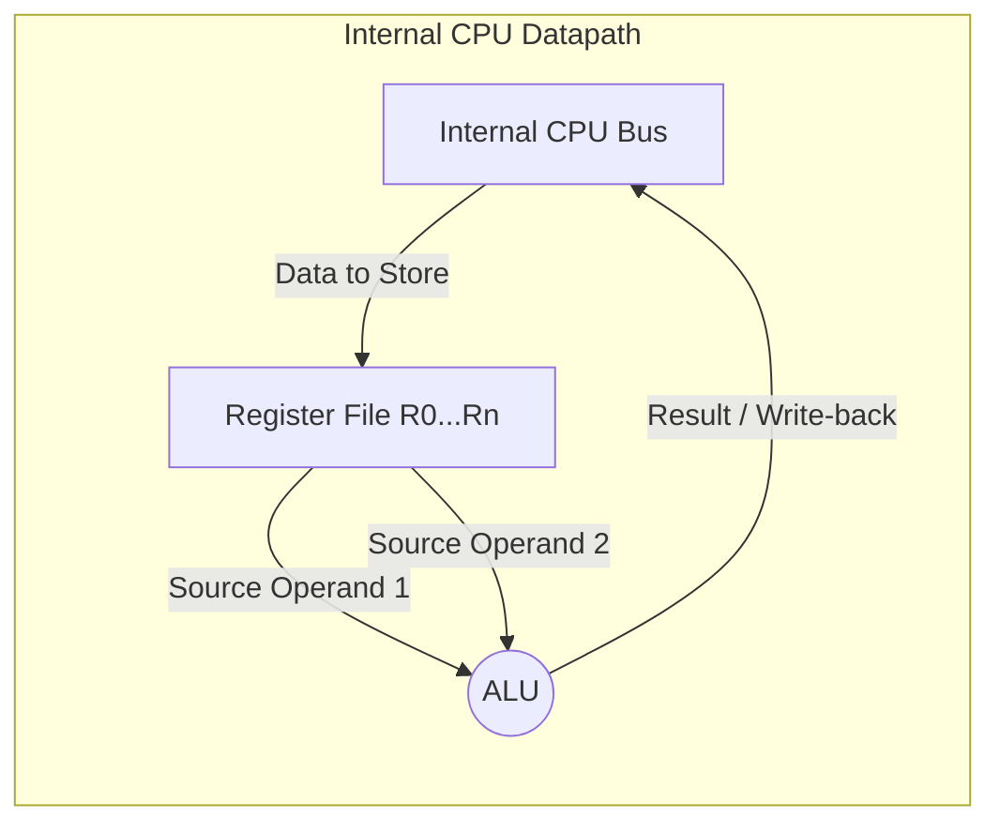
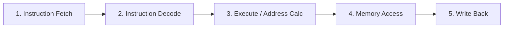

# 📘 CSA Model Paper 04 (The Masterpiece - Advanced & Diagrams)

මෙය මහාචාර්යවරයෙකුගේ (Professor level) කෝණයෙන් සකසන ලද, රූපසටහන් ඇඳීමට සහ ගැඹුරු ගණනය කිරීම් වලට ප්‍රමුඛත්වය දුන් විශේෂ අනුමාන ප්‍රශ්න පත්‍රයයි. මෙහි සෑම ප්‍රශ්නයකම නිවැරදි සිංහල පරිවර්තනය සහ පැහැදිලි කිරීම් අඩංගු කර ඇත.

---

## 📝 Question 01 [30 Marks]
**📌 ආවරණය වන දේශන:** L2 (Digital Computer), L4 (Basic Operation)

### 🔹 Part (i) - System Architectures (15 Marks)

> [!IMPORTANT]
> **Drawing Tip:** විභාගයේදී රූපසටහන් අඳින විට කොටු සහ ඊතල (Arrows) වල දිශාව අනිවාර්යයෙන්ම නිවැරදි විය යුතුය. (උදා: Data bus එක Two-way, නමුත් Address bus එක One-way).

#### a. Draw and completely label the block diagram of the basic Von Neumann Architecture. Include the CPU (with ALU, CU, Registers), Main Memory, I/O Subsystem, and the connecting Buses. [8 marks]
**❓ සිංහල පරිවර්තනය:** මූලික Von Neumann ගෘහ නිර්මාණ ශිල්පයේ (Architecture) බ්ලොක් රූප සටහන (block diagram) ඇඳ සම්පූර්ණයෙන්ම නම් කරන්න. මෙයට CPU (ALU, CU, Registers සමඟ), ප්‍රධාන මතකය (Main Memory), I/O උපපද්ධතිය සහ ඒවා සම්බන්ධ කරන බස් මාර්ග (Buses) ඇතුළත් කරන්න.
**💡 පැහැදිලි කිරීම:** පරිගණකයක මූලිකම කොටස් ටික පෙන්නන රූප සටහන අඳින්නයි කියන්නේ. මෙතනදී බස් 3 (Address, Data, Control) යන දිශාවන් හරියටම ඊතල වලින් පෙන්නන්න ඕනේ.

**✍️ Exam Answer:**

* **🎯 Marking Scheme:** 2 marks for CPU internals (ALU, CU, Registers). 2 marks for Memory and I/O blocks. 4 marks for correctly identifying and pointing the 3 buses (Address=Unidirectional from CPU, Data=Bidirectional, Control=Bidirectional).

#### b. Draw the internal Datapath of a basic CPU, clearly showing how the ALU, Register File, and Internal CPU Bus are connected. [7 marks]
**❓ සිංහල පරිවර්තනය:** මූලික CPU එකක අභ්‍යන්තර දත්ත මාර්ගය (Internal Datapath) අඳින්න. එහිදී ALU, Register File සහ අභ්‍යන්තර CPU බස් රථය (Internal CPU Bus) සම්බන්ධ වී ඇති ආකාරය පැහැදිලිව පෙන්වන්න.
**💡 පැහැදිලි කිරීම:** මේකෙන් අහන්නේ CPU එක ඇතුළේ වැඩ කෙරෙන හැටි. Register එකේ තියෙන අගයන් දෙකක් ALU එකට ගිහින්, එකතු වෙලා, ආයේ Register එකටම එන cycle එක අඳින්න ඕනේ.

**✍️ Exam Answer:**

* **🎯 Marking Scheme:** 3 marks for showing Registers feeding into ALU. 4 marks for showing ALU output feeding back into the internal bus/registers.

---

## 📝 Question 02 [35 Marks]
**📌 ආවරණය වන දේශන:** L1 (Performance), L11 (Memory Hierarchy)

### 🔹 Part (i) - CPU Performance Calculations (20 Marks)

#### A processor operates at a Clock Rate of 2 GHz. A program contains a total of $10 \times 10^6$ instructions. The instruction mix and the CPI (Cycles Per Instruction) for each class are given below:
* **ALU instructions:** 50% of total, CPI = 1
* **Load/Store instructions:** 30% of total, CPI = 3
* **Branch instructions:** 20% of total, CPI = 2

#### a. Calculate the overall Average CPI for this program. [8 marks]
**❓ සිංහල පරිවර්තනය:** (ප්‍රශ්නයේ දත්ත:) ප්‍රොසෙසරයක ඔරලෝසු වේගය (Clock Rate) 2 GHz වේ. වැඩසටහනක මුළු උපදෙස් (instructions) $10 \times 10^6$ ක් ඇත. උපදෙස් මිශ්‍රණය සහ එක් එක් වර්ගයේ CPI පහත පරිදි වේ: (ALU = 50%, CPI=1) (Load/Store = 30%, CPI=3) (Branch = 20%, CPI=2).
**මෙම වැඩසටහන සඳහා සමස්ත සාමාන්‍ය CPI (Average CPI) ගණනය කරන්න.**
**💡 පැහැදිලි කිරීම:** සාමාන්‍ය CPI එක හොයන්න ඕනේ. ඒකට කරන්නේ ඒ ඒ instruction වර්ගයේ ප්‍රතිශතය, ඒකේ CPI එකෙන් ගුණ කරලා ඔක්කොම එකතු කරන එකයි.

**✍️ Exam Answer (Steps):**
* **Formula:** `Average CPI = Σ (Fraction of Instruction Type × CPI of that Type)`
* `Average CPI = (0.50 × 1) + (0.30 × 3) + (0.20 × 2)`
* `Average CPI = 0.5 + 0.9 + 0.4`
* **Answer:** `Average CPI = 1.8 cycles/instruction`
* **🎯 Marking Scheme:** 3 marks for formula/concept. 3 marks for correct substitution. 2 marks for final answer.

#### b. Calculate the total CPU Execution Time (in milliseconds) for this program. [12 marks]
**❓ සිංහල පරිවර්තනය:** මෙම වැඩසටහන සඳහා මුළු CPU ක්‍රියාත්මක වීමේ කාලය (Execution Time) මිලි තත්පර වලින් (milliseconds) ගණනය කරන්න.
**💡 පැහැදිලි කිරීම:** Execution Time එක හොයන සූත්‍රය (`IC × CPI × Clock Cycle Time`) පාවිච්චි කරන්න ඕනේ. මුලින්ම 2 GHz වලට අදාළ Clock Cycle Time එක හොයාගෙන, අනිත් අගයන් දාලා ගුණ කරන්න. අන්තිමට තත්පර (seconds) වලින් එන උත්තරේ මිලි තත්පර (ms) වලට හරවන්න.

**✍️ Exam Answer (Steps):**
* **Formula:** `CPU Time = Instruction Count (IC) × Average CPI × Clock Cycle Time`
* **Given Data:**
  * `IC = 10 × 10^6`
  * `Average CPI = 1.8`
  * `Clock Rate = 2 GHz = 2 × 10^9 Hz`
* **Calculate Clock Cycle Time (T):**
  * `T = 1 / Clock Rate = 1 / (2 × 10^9) seconds = 0.5 × 10^-9 seconds (or 0.5 ns)`
* **Calculate CPU Time:**
  * `CPU Time = (10 × 10^6) × 1.8 × (0.5 × 10^-9)`
  * `CPU Time = 18 × 10^6 × 0.5 × 10^-9`
  * `CPU Time = 9 × 10^-3 seconds`
* **Convert to milliseconds:**
  * `9 × 10^-3 seconds = 9 milliseconds (ms)`
* **Answer:** `9 ms`
* **🎯 Marking Scheme:** 3 marks for Clock Cycle Time calculation. 4 marks for CPU Time formula substitution. 3 marks for math. 2 marks for final answer with correct units.

### 🔹 Part (ii) - Advanced Cache Math (15 Marks)

#### A computer system has a Level 1 (L1) Cache and a Main Memory. 
* The L1 Cache Hit Time is **2 ns**. 
* The Main Memory access time (Miss Penalty) is **50 ns**. 
* The program requires 1000 memory accesses, and out of those, 950 accesses are found in the L1 Cache.

#### Calculate the Average Memory Access Time (AMAT). [15 marks]
**❓ සිංහල පරිවර්තනය:** (දත්ත:) පරිගණක පද්ධතියක L1 Cache එකක් සහ Main Memory එකක් ඇත. L1 Cache Hit Time එක 2 ns වේ. Main Memory access time එක (Miss Penalty) 50 ns වේ. වැඩසටහනකට memory accesses 1000 ක් අවශ්‍ය වන අතර, ඉන් 950 ක් L1 Cache තුළින් හමුවේ.
**සාමාන්‍ය මතක ප්‍රවේශ කාලය (AMAT - Average Memory Access Time) ගණනය කරන්න.**
**💡 පැහැදිලි කිරීම:** මුලින්ම 1000 න් 950 ක් කියන්නේ Hit rate එක කීයද (0.95), Miss rate එක කීයද (0.05) කියලා හොයාගන්න. ඊටපස්සේ ඒ දත්ත AMAT සූත්‍රයට දාලා සුළු කරන්න.

**✍️ Exam Answer (Steps):**
* **Step 1: Calculate Hit Rate and Miss Rate.**
  * `Hit Rate (h) = 950 / 1000 = 0.95` (or 95%)
  * `Miss Rate (m) = 1 - h = 1 - 0.95 = 0.05` (or 5%)
* **Step 2: Formula for AMAT.**
  * `AMAT = Hit Time + (Miss Rate × Miss Penalty)`
* **Step 3: Substitution.**
  * `AMAT = 2 ns + (0.05 × 50 ns)`
  * `AMAT = 2 ns + 2.5 ns`
* **Answer:** `AMAT = 4.5 ns`
* **🎯 Marking Scheme:** 5 marks for finding Hit/Miss rates. 5 marks for the AMAT formula. 5 marks for the final correct calculation.

<br><hr><br>

## 📝 Question 03 [35 Marks]
**📌 ආවරණය වන දේශන:** L9 (MIPS32 & Pipelining)

### 🔹 Part (i) - The 5-Stage Pipeline (15 Marks)

#### Draw a block diagram of the standard 5-Stage MIPS Pipelined Datapath. Label the 5 stages and briefly state what happens in each stage. [15 marks]
**❓ සිංහල පරිවර්තනය:** සම්මත 5-Stage MIPS Pipelined Datapath හි බ්ලොක් රූප සටහනක් අඳින්න. අදියර (stages) 5 නම් කර, එක් එක් අදියරේදී සිදුවන්නේ කුමක්දැයි කෙටියෙන් සඳහන් කරන්න.
**💡 පැහැදිලි කිරීම:** Instruction එකක් execute වෙන්න යන පියවර 5 න්‍යායාත්මකව පෙළගස්වලා අඳින්න. ඒ එක් එක් පියවර (IF, ID, EX, MEM, WB) වලින් කෙරෙන කාර්යය ලියන්න.

**✍️ Exam Answer:**

* **Stage 1 (IF - Instruction Fetch):** Fetches the instruction from memory using the PC.
* **Stage 2 (ID - Instruction Decode):** Decodes the instruction and reads the required operands from the Register File.
* **Stage 3 (EX - Execute):** The ALU performs the mathematical/logical operation or calculates a memory address.
* **Stage 4 (MEM - Memory):** Data is read from or written to the Data Memory (only for load/store instructions).
* **Stage 5 (WB - Write Back):** The final result is written back into the destination register in the Register File.
* **🎯 Marking Scheme:** 5 marks for drawing the correct sequence. 10 marks (2x5) for correctly describing what happens in each of the 5 stages.

### 🔹 Part (ii) - Pipelining Hazards & Diagrams (20 Marks)

#### Consider the following sequence of instructions:
1. `ADD R1, R2, R3`  (R1 = R2 + R3)
2. `SUB R4, R1, R5`  (R4 = R1 - R5)

#### a. Identify the type of hazard present in this sequence. Explain why it occurs. [6 marks]
**❓ සිංහල පරිවර්තනය:** ඉහත උපදෙස් අනුක්‍රමයේ (instruction sequence) ඇති දෝෂය (hazard) කුමක්දැයි හඳුනාගන්න. එය ඇතිවන්නේ මන්දැයි පැහැදිලි කරන්න.
**💡 පැහැදිලි කිරීම:** ADD එකෙන් R1 වලට අගයක් දානවා, SUB එක ඊළඟටම ඇවිත් ඒ R1 අගය ඉල්ලනවා. තාම ADD එක ඒක register එකට ලියලා ඉවර නෑ. මේ ප්‍රශ්නෙට කියන්නේ Data Hazard එකක් කියලා විස්තර කරන්න.

**✍️ Exam Answer:**
* **Hazard Type:** **Data Hazard** (Specifically, Read-After-Write / RAW dependency).
* **Why it occurs:** The `SUB` instruction needs to read the value of `R1` in its Decode (ID) stage. However, the `ADD` instruction hasn't finished calculating and hasn't written the new value of `R1` into the register file yet (which happens in its Write-Back / WB stage). Therefore, the `SUB` instruction will read stale/old data if executed immediately.
* **🎯 Marking Scheme:** 2 marks for naming Data Hazard/RAW. 4 marks for explaining the timing issue (R1 dependency).

#### b. Draw a Pipeline Execution Diagram (Timing Diagram) showing how a CPU *without* Data Forwarding handles this hazard by inserting stall cycles (bubbles). [14 marks]
**❓ සිංහල පරිවර්තනය:** Data Forwarding (දත්ත ඉදිරියට යැවීම) *නොමැති* CPU එකක් මගින් stall cycles (bubbles) ඇතුළත් කරමින් මෙම hazard එක හසුරුවන ආකාරය පෙන්වන Pipeline Execution Diagram (Timing Diagram) එකක් අඳින්න.
**💡 පැහැදිලි කිරීම:** Forwarding නැත්තම් CPU එකට කරන්න තියෙන එකම දේ ADD එක R1 ට ලියනකම් (WB stage එක එනකම්) බලාගෙන ඉන්න එක (Stall වෙන එක). ඒ බලාගෙන ඉන්න කොටස වගුවක් විදිහට අඳින්න.

**✍️ Exam Answer:**
* To solve the hazard without forwarding, the CPU must stall the `SUB` instruction in the ID stage until the `ADD` instruction completes its WB stage.

```text
Clock Cycle:   CC1   CC2   CC3   CC4   CC5   CC6   CC7
------------------------------------------------------
ADD R1,R2,R3 | IF  | ID  | EX  | MEM | WB  |     |     |
SUB R4,R1,R5 |     | IF  | ID  |stall|stall| EX  | MEM | WB |
```
*(Note: The SUB instruction stalls after fetching, waiting in the Decode stage for CC4 and CC5 so that the ADD instruction can write the new R1 value at the end of CC5. SUB moves to EX in CC6).*
* **🎯 Marking Scheme:** 7 marks for correctly placing the 5 stages of the ADD instruction. 7 marks for correctly showing the SUB instruction stalling for 2 cycles before entering EX.
