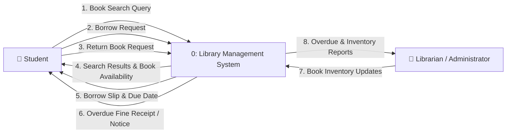
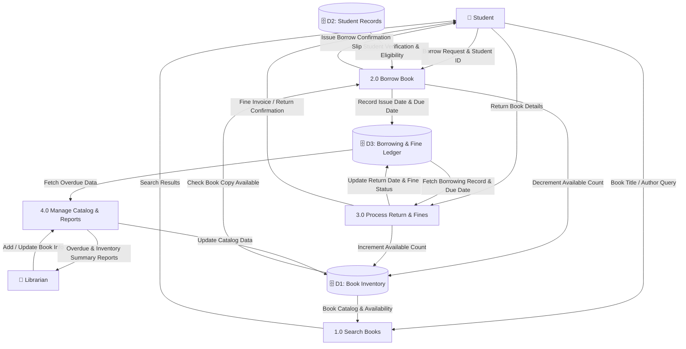

# 🏛️ ICT 1032 Software Architecture & Design — September 2025 Past Paper Master Discussion

> [!NOTE]
> **Course:** ICT 1032 / ICT 1032 2.0 (Software Architecture & Design) — 1st Year 1st Semester  
> **Academic Unit:** Department of Computer Science, Faculty of Applied Sciences, University of Sri Jayewardenepura  
> **Source Document:** [`SAD Paper.pdf`](./SAD%20Paper.pdf)  
> **Examination Date:** September 2025  
> **Time Allowed:** 02 Hours | **Total Marks:** 100 Marks (4 Questions $\times$ 25 Marks)  
> **Course Index:** [ICT 1032 Master Syllabus Index](../Short%20Notes/00_ICT_1032_SAD_Syllabus_Master_Index.md)

---

## 🧭 Paper Navigation & Question Breakdown

```mermaid
graph TD
    Paper["ICT 1032 September 2025 Examination (100 Marks)"] --> Q1["Question 1 (25 Marks)"]
    Paper --> Q2["Question 2 (25 Marks)"]
    Paper --> Q3["Question 3 (25 Marks)"]
    Paper --> Q4["Question 4 (25 Marks)"]

    Q1 --> Q1A["Part A (9 M): Scope, Quality Attributes, Architectural Styles"]
    Q1 --> Q1B["Part B (6 M): 3 True/False with Justifications"]
    Q1 --> Q1C["Part C (10 M): Hospital Patient System Case Study"]

    Q2 --> Q2A["Part A (9 M): Importance of SAD, 3 Structure Groups, Layered Benefits"]
    Q2 --> Q2B["Part B (6 M): 3 True/False with Justifications"]
    Q2 --> Q2C["Part C (10 M): Smart City Traffic Management & ABC"]

    Q3 --> Q3A["Part A (9 M): 3 Data Flow Categories, Logical vs Physical DFD, 4 Components"]
    Q3 --> Q3B["Part B (6 M): 3 True/False with Justifications"]
    Q3 --> Q3C["Part C (10 M): Library Management Context & Level-0 DFDs"]

    Q4 --> Q4A["Part A (9 M): ESB in SOA, Microservices Challenges, Documentation Practices"]
    Q4 --> Q4B["Part B (6 M): 3 True/False with Justifications"]
    Q4 --> Q4C["Part C (10 M): Healthcare Patient Portal SOA vs Microservices"]
```

---

# 📝 Question 01 [25 Marks]

> 🔗 **අදාළ Short Notes & Lecture Slides:**
> * 📘 **Short Notes:** 
>   * [01. Introduction to Software Architecture & Design](../Short%20Notes/01_Introduction_to_Software_Architecture_and_Design.md)
>   * [02. Architectural Principles, Elements & Quality Attributes](../Short%20Notes/02_Architectural_Principles_Elements_and_Quality_Attributes.md)
> * 📑 **Lecture Slides:**
>   * [`01_Lecture_01_Introduction_Software_Architecture_and_Design.pdf`](../Lecture%20Notes/01_Lecture_01_Introduction_Software_Architecture_and_Design.pdf)
>   * [`02_Lecture_02_Software_Architecture_Foundations.pdf`](../Lecture%20Notes/02_Lecture_02_Software_Architecture_Foundations.pdf)

---

### ❓ Question 1 — Part A [3 $\times$ 3 = 9 Marks]

#### i) Differentiate between Software Architecture and Software Design in terms of scope. `[3 Marks]`
* **Software Architecture (System-Wide Scope):** Operates at the highest, global level of abstraction. It defines the overall system structure, major subsystems, component-connector boundaries, and focuses on satisfying system-wide non-functional requirements (**Quality Attributes** such as scalability, security, and performance).
* **Software Design (Local / Component-Level Scope):** Operates at the localized, detailed implementation level within individual components. It specifies internal class diagrams, algorithmic workflows, data structures, method signatures, and localized design patterns (e.g. Factory, Singleton).

---

#### ii) List and briefly explain two types of quality attributes in software systems. `[3 Marks]`
*(Any two of the following with brief explanation):*
1. **Security (ආරක්ෂාව):** The measure of the system's ability to resist unauthorized access, cyber attacks, and data breaches while ensuring authorized users have uninterrupted access (**Confidentiality, Integrity, Availability - CIA**).
2. **Performance (ක්‍රියාකාරීත්ව වේගය):** The timeliness of the system's response to events, measured in terms of throughput (transactions per second), response latency, and resource utilization under varying workloads.
3. **Availability / Reliability (සක්‍රීයතාව):** The proportion of time that a system is operational and accessible when required by users (e.g. 99.99% uptime).
4. **Modifiability / Maintainability (වෙනස් කිරීමේ හැකියාව):** The ease with which the software can undergo changes, feature additions, or bug fixes without causing ripple effects in other parts of the system.

---

#### iii) Explain how an architectural style provides a framework for system design. `[3 Marks]`
An **Architectural Style** defines a coordinated family of systems by establishing:
1. A predefined set of **component types** (e.g., Clients, Servers, Filters, Databases).
2. A predefined set of **connector types** (e.g., RPC, Message queues, REST HTTP, Pipes).
3. A set of **topological constraints** (e.g., in Layered style, Layer $N$ can only call Layer $N-1$; in Pipe-and-Filter, filters must be independent and unidirectional).
* By providing these rules and patterns, an architectural style serves as a proven blueprint/template that guides design decisions, ensures consistency, and guarantees specific quality attribute characteristics.

---

### ❓ Question 1 — Part B [3 $\times$ 2 = 6 Marks]
**State whether the following statements are true or false. For each case briefly describe your answer.**

#### i) "Architectural style focuses on the detailed algorithms and workflows of a system." `[2 Marks]`
* **Verdict:** **FALSE**.
* **Justification:** Architectural style operates at a high level of abstraction, defining component types, connectors, and structural organization. Detailed algorithms, pseudo-code, and internal workflows belong to **Software Design and Implementation**, not architectural style.

---

#### ii) "Software architecture always includes private implementation details of components." `[2 Marks]`
* **Verdict:** **FALSE**.
* **Justification:** Software architecture is an abstraction that purposefully hides private implementation details. It strictly focuses on the **externally visible properties** and public interfaces of elements.

---

#### iii) "Software requirements alone are always sufficient to design an architecture." `[2 Marks]`
* **Verdict:** **FALSE**.
* **Justification:** Requirements alone are never sufficient. Architecture is heavily influenced by the **Architecture Business Cycle (ABC)**, which includes business goals of the developing organization, technical environment/standards, budget/schedule constraints, and the architect's past domain experience.

---

### ❓ Question 1 — Part C [2 $\times$ 5 = 10 Marks]
**Case Study Scenario:**
*A hospital is planning to develop a patient management system. The initial requirements include storing patient details, managing appointments, and generating reports. However, the system must also support future expansion, handle sensitive medical data securely, and work reliably under heavy usage.*

#### i) Identify and explain two architectural decisions (business or technical) that would strongly influence the quality attributes of this system. `[5 Marks]`
1. **Decision 1: Implementing a Database-Level & Transport-Level End-to-End Encryption Strategy (Influences Security & Compliance):**
   * *Explanation:* Encrypting patient health records at rest using AES-256 and in transit via TLS 1.3, combined with Role-Based Access Control (RBAC), directly ensures compliance with medical privacy laws (such as HIPAA/GDPR) and protects sensitive medical histories from unauthorized data breaches.
2. **Decision 2: Adopting a Modular N-Tier / Layered or Microservices Architecture with Load Balancing (Influences Scalability, Availability & Modifiability):**
   * *Explanation:* Decoupling the appointment scheduling, report generation, and patient records into independent layers or services behind a load balancer ensures that heavy usage in report generation does not crash emergency appointment scheduling (High Availability & Scalability), while allowing new hospital modules (e.g. Pharmacy, Telemedicine) to be added in the future without rewriting existing code (High Modifiability).

---

#### ii) Suggest one suitable architectural style for this system and justify your choice. `[5 Marks]`
* **Recommended Style:** **Layered (N-Tier) Architecture Style** *(or Service-Oriented / Microservices Style)*.
* **Justification:**
  1. **Separation of Concerns:** Clearly isolates the Presentation Layer (Web/Mobile UI for doctors and patients), Business Logic Layer (Appointment rules, validation, report generation), and Data Access/Database Layer (Secure patient repository).
  2. **Security Isolation:** Security policies, role authorization, and audit logging can be enforced strictly at the Business and Data Access boundaries before any sensitive SQL queries reach the medical database.
  3. **High Modifiability & Extensibility:** New hospital departments (e.g. Radiology, Laboratory, Billing) can be integrated by extending the business layer without modifying the underlying database architecture.
  4. **Manageable Complexity & Cost:** For a hospital transitioning to a patient management system, a Layered architecture avoids the extreme distributed DevOps complexity of microservices while providing robust reliability.

---

# 📝 Question 02 [25 Marks]

> 🔗 **අදාළ Short Notes & Lecture Slides:**
> * 📘 **Short Notes:**
>   * [01. Introduction to Software Architecture & Design](../Short%20Notes/01_Introduction_to_Software_Architecture_and_Design.md)
>   * [03. Architectural Structures and Views](../Short%20Notes/03_Architectural_Structures_and_Views_Model.md)
>   * [04. The Architecture Business Cycle & Stakeholders](../Short%20Notes/04_The_Architecture_Business_Cycle_and_Stakeholder_Analysis.md)
>   * [07. Hierarchical Architecture (Layered & Master-Slave)](../Short%20Notes/07_Hierarchical_Architecture_Layered_and_Master_Slave.md)
> * 📑 **Lecture Slides:**
>   * [`03_Lecture_03_Architectural_Structures_and_Views.pdf`](../Lecture%20Notes/03_Lecture_03_Architectural_Structures_and_Views.pdf)
>   * [`04_Lecture_04_The_Architecture_Business_Cycle.pdf`](../Lecture%20Notes/04_Lecture_04_The_Architecture_Business_Cycle.pdf)
>   * [`07_Lecture_07_Hierarchical_Software_Architecture.pdf`](../Lecture%20Notes/07_Lecture_07_Hierarchical_Software_Architecture.pdf)

---

### ❓ Question 2 — Part A [3 $\times$ 3 = 9 Marks]

#### i) Briefly explain three main reasons why software architecture is important in software development. `[3 Marks]`
1. **Enables or Inhibits System Quality Attributes:** It is impossible to achieve high scalability, availability, or security purely through low-level coding if the architectural structure is flawed.
2. **Early Design Decisions are Hard to Change:** Decisions made at the architectural level dictate the entire project lifecycle. Reversing architectural mistakes late in development is catastrophic in cost.
3. **Facilitates Stakeholder Communication & Work Assignment:** Provides a common, understandable mental model for technical and non-technical stakeholders, and guides how development tasks are partitioned among engineering teams (Work Breakdown Structure).

---

#### ii) List the three main groups of architectural structures and provide one example for each. `[3 Marks]`
1. **Module Structures:** Partition the system into static implementation units.  
   * *Example:* **Decomposition Structure** (or Layered Structure, Uses Structure).
2. **Component-and-Connector (C&C) Structures:** Represent runtime computational elements and their communication pathways.  
   * *Example:* **Client-Server Structure** (or Pipe-and-Filter Structure, Shared-Data/Repository Structure).
3. **Allocation Structures:** Define how software elements map onto non-software environmental entities (hardware, network, teams).  
   * *Example:* **Deployment Structure** (or Work Assignment Structure, Implementation/File Structure).

---

#### iii) Briefly describe the Layered Architecture style and explain three benefits of organizing a system into layers. `[3 Marks]`
* **Description:** An architectural style where software is organized into horizontal hierarchical layers. Each layer provides specific services to the layer immediately above it and relies on services from the layer below it.
* **Three Benefits:**
  1. **Separation of Concerns & High Modifiability:** Changes in one layer (e.g. updating UI from Web to Mobile) do not impact other layers (Business or Data layers).
  2. **Component Reusability:** Core business logic layers can be reused across multiple frontends (Web, Mobile, External API).
  3. **Enhanced Testability:** Layers can be tested in isolation using mock objects or stubbed interfaces.

---

### ❓ Question 2 — Part B [3 $\times$ 2 = 6 Marks]
**State whether the following statements are true or false. For each case briefly describe your answer.**

#### i) "A reference model and a reference architecture are identical." `[2 Marks]`
* **Verdict:** **FALSE**.
* **Justification:** A **Reference Model** is a purely conceptual division of functionality without software implementation (e.g. OSI 7-Layer Model), whereas a **Reference Architecture** maps those functions to concrete software elements and data flows (e.g. AUTOSAR).

---

#### ii) "Using an architectural pattern like client-server automatically guarantees high system performance." `[2 Marks]`
* **Verdict:** **FALSE**.
* **Justification:** No pattern automatically guarantees performance. In fact, a centralized server in a client-server pattern can become a severe performance bottleneck if overwhelmed by requests or poorly provisioned.

---

#### iii) "Software architecture is just the source code of a system written in a structured way." `[2 Marks]`
* **Verdict:** **FALSE**.
* **Justification:** Architecture is a high-level abstraction consisting of structures, element relationships, quality attributes, and early design decisions, whereas source code is the low-level implementation.

---

### ❓ Question 2 — Part C [2 $\times$ 5 = 10 Marks]
**Case Study Scenario:**
*A software company is developing a smart city traffic management system. The system must:*
* *Process real-time data from thousands of sensors and cameras.*
* *Allow modular development by different teams (data collection, analytics, reporting).*
* *Run on distributed servers for scalability and reliability.*
* *Be easily maintainable and support future upgrades.*

#### i) Identify and briefly explain two architectural structures that would be most useful for this system. `[5 Marks]`
1. **Module Decomposition Structure (or Work Assignment Structure):**
   * *Explanation:* Decomposes the codebase into distinct static modules (`DataCollectionModule`, `TrafficAnalyticsModule`, `ReportingModule`). This allows different engineering teams to work concurrently on their specific subsystems without code collisions, directly satisfying the modular development and maintainability requirements.
2. **Component-and-Connector (C&C) - Pipe & Filter / Publish-Subscribe Structure:**
   * *Explanation:* Sensor streams from thousands of IoT cameras and road sensors continuously publish real-time traffic data to a message broker (e.g. Apache Kafka), which streams data through filtering and analytics components. This enables real-time stream processing and high throughput across distributed servers.
3. *(Alternative)* **Deployment Structure (Allocation):**
   * *Explanation:* Maps the software processes onto edge computing nodes (at traffic signals), centralized cloud servers, and redundant databases to analyze network bandwidth, latency, and fault tolerance.

---

#### ii) Explain how the Architecture Business Cycle (ABC) could influence the design of this system, mentioning two external factors. `[5 Marks]`
* **Influence of ABC:** The ABC explains how external environmental factors shape the traffic architecture, and how the resulting system subsequently impacts the organization and environment.
* **Two External Factors:**
  1. **Stakeholder Requirements (e.g. Municipal Traffic Police & City Commuters):** The traffic police require automated real-time incident detection (e.g., crashes within 5 seconds), while commuters require accurate route guidance. This forces the architect to prioritize **Performance (Low Latency)** and **High Availability**.
  2. **Technical Environment (e.g. IoT Edge Computing, 5G & Cloud Platforms):** The availability of 5G cellular networks and cloud-native stream processing tools (e.g. Kafka, AWS IoT) allows the architect to design an event-driven edge-to-cloud architecture.
* **Feedback Loop:** Once built, the system creates reusable IoT traffic assets for the company, enabling them to bid for smart city contracts in other international cities (Feedback to Developing Organization).

---

# 📝 Question 03 [25 Marks]

> 🔗 **අදාළ Short Notes & Lecture Slides:**
> * 📘 **Short Notes:**
>   * [05. Data Flow Architecture Styles & Case Studies](../Short%20Notes/05_Data_Flow_Architecture_Styles_and_Case_Studies.md)
>   * [06. Data Flow Diagrams (DFD) Modeling & Rules](../Short%20Notes/06_Data_Flow_Diagrams_DFD_Modeling_and_Rules.md)
> * 📑 **Lecture Slides:**
>   * [`05_Lecture_05_Data_Flow_Architecture.pdf`](../Lecture%20Notes/05_Lecture_05_Data_Flow_Architecture.pdf)
>   * [`06_Lecture_06_Data_Flow_Diagrams_DFD.pdf`](../Lecture%20Notes/06_Lecture_06_Data_Flow_Diagrams_DFD.pdf)

---

### ❓ Question 3 — Part A [3 $\times$ 3 = 9 Marks]

#### i) Briefly explain the three categories of Data-Flow Architectures with one example for each. `[3 Marks]`
1. **Batch Sequential:** Data is processed in whole discrete batches. A subsystem must finish processing the entire batch before the next subsystem can begin.  
   * *Example:* Nightly banking payroll calculation, end-of-month tax report generator.
2. **Pipe and Filter:** Data flows as a continuous stream through unidirectional pipes and is incrementally transformed by independent filters with high concurrency.  
   * *Example:* Real-time audio DSP equalizer pipeline, Unix command line (`cat file.txt | grep "error" | wc -l`).
3. **Process Control (Closed Loop):** System maintains an output variable at a desired set point by monitoring feedback from sensors and adjusting actuators.  
   * *Example:* Automated traffic light controller, home thermostat temperature regulator.

---

#### ii) Differentiate between a Logical Data Flow Diagram and a Physical Data Flow Diagram. `[3 Marks]`
* **Logical DFD:** Models **WHAT** the business system does conceptually. It is completely technology-independent and depicts business processes, logical data flows, and business entities (e.g. `Process Payment`, `Customer File`).
* **Physical DFD:** Models **HOW** the system is physically implemented in technology. It specifies hardware servers, database technologies, file names, program names, and manual human operations (e.g. `Java Spring AuthController`, `MySQL tbl_customers`, `Bar Code Scanner`).

---

#### iii) List and briefly describe the four main components of a Data Flow Diagram (DFD). `[3 Marks]`
1. **External Entity (Terminator):** An external entity (person, organization, or system) outside the boundary that sends or receives data (represented by a Rectangle).
2. **Process:** A transformation of incoming data into outgoing data (represented by a Rounded Rectangle or Circle).
3. **Data Store:** A repository of data at rest (database, file, ledger) (represented by Open-Ended Rectangles / Parallel Lines).
4. **Data Flow:** The pathway carrying data in motion between entities, processes, and stores (represented by a Directed Arrow with a noun label).

---

### ❓ Question 3 — Part B [3 $\times$ 2 = 6 Marks]
**State whether the following statements are true or false. For each case briefly describe your answer.**

#### i) "In a Batch Sequential System, subsystems can start processing before the previous one finishes." `[2 Marks]`
* **Verdict:** **FALSE**.
* **Justification:** In a Batch Sequential system, each subsystem must complete processing the entire batch and write intermediate results to disk before the subsequent subsystem can begin execution.

---

#### ii) "In a Data Flow Diagram, every process must have at least one input and one output data flow." `[2 Marks]`
* **Verdict:** **TRUE**.
* **Justification:** By definition, a process transforms data. A process with only inputs is a **Black Hole** (data vanishes), and a process with only outputs is a **Miracle** (spontaneous generation). Both are illegal DFD errors.

---

#### iii) "In a Data-Flow Architecture, the flow of control determines the execution order of components." `[2 Marks]`
* **Verdict:** **FALSE**.
* **Justification:** In a Data-Flow architecture, computation is **Data-Driven**, meaning the availability and arrival of data triggers execution, not explicit centralized control flow.

---

### ❓ Question 3 — Part C [10 Marks]
**Case Study Scenario:**
*A library management system is being designed to automate book borrowing and returning. The system must:*
* *Allow students to search for books and borrow them.*
* *Update the book inventory when a book is borrowed or returned.*
* *Maintain student records, including borrowed books and due dates.*
* *Generate fine details for overdue books.*

#### i) Draw a Context Diagram and a Level-0 Data Flow Diagram (DFD) for the library management system. `[10 Marks]`

---

#### 🏛️ Diagram 1: Context Diagram (Level 0) `[4 Marks]`

---

#### 🏛️ Diagram 2: Level-1 / Level-0 Process Decomposition DFD `[6 Marks]`

---

# 📝 Question 04 [25 Marks]

> 🔗 **අදාළ Short Notes & Lecture Slides:**
> * 📘 **Short Notes:**
>   * [08. Service-Oriented Architecture (SOA) & ESB](../Short%20Notes/08_Service_Oriented_Architecture_SOA_and_ESB.md)
>   * [09. Microservices Architecture Design & Patterns](../Short%20Notes/09_Microservices_Architecture_Design_and_Patterns.md)
> * 📑 **Lecture Slides:**
>   * [`08_Lecture_08_Service_Oriented_Architecture_SOA.pdf`](../Lecture%20Notes/08_Lecture_08_Service_Oriented_Architecture_SOA.pdf)
>   * [`09_Lecture_09_Microservices_Architecture.pdf`](../Lecture%20Notes/09_Lecture_09_Microservices_Architecture.pdf)

---

### ❓ Question 4 — Part A [3 $\times$ 3 = 9 Marks]

#### i) Briefly explain the role of the Enterprise Service Bus (ESB) in Service-Oriented Architecture (SOA). `[3 Marks]`
The **Enterprise Service Bus (ESB)** acts as a centralized middleware backbone that facilitates communication and integration among disparate heterogeneous enterprise services.
* **Key Roles:**
  1. **Protocol Transformation:** Converts incoming protocols (e.g. HTTP/REST to JMS or legacy IBM MQ).
  2. **Data & Message Transformation:** Transforms payload formats (e.g. JSON to XML/SOAP).
  3. **Intelligent Routing:** Dynamically routes messages based on content or business rules.
  4. **Centralized Security & Orchestration:** Handles authentication, rate limiting, and multi-service transaction workflows.

---

#### ii) List any three challenges of Microservices Architecture. `[3 Marks]`
1. **Distributed Data Consistency:** Each service has its own private database, eliminating ACID transactions and requiring complex **Eventual Consistency** patterns (e.g. Saga Pattern).
2. **Network Latency & Fault Tolerance:** Increased inter-service communication over TCP/IP networks adds latency and introduces points of network failure (requires Circuit Breakers).
3. **Distributed Debugging, Tracing & Monitoring:** Diagnosing bugs across dozens of distributed services requires specialized distributed tracing tools (e.g. Jaeger, Zipkin, OpenTelemetry).
4. *(Alternative)* **DevOps & Operational Complexity:** Managing hundreds of containers, Kubernetes clusters, and automated CI/CD pipelines requires high engineering overhead.

---

#### iii) State three best practices for writing effective software documentation. `[3 Marks]`
1. **Write from the Reader’s Point of View:** Structure documentation according to specific stakeholder needs (e.g., high-level views for clients, detailed API schemas for developers).
2. **Avoid Repetition & Redundancy:** Keep information in a single authoritative source to prevent documentation drift and contradictions.
3. **Keep Documentation Current and Integrated with Code:** Treat documentation as code (Docs-as-Code using Markdown/Swagger) and update it automatically in CI/CD pipelines.

---

### ❓ Question 4 — Part B [3 $\times$ 2 = 6 Marks]
**State whether the following statements are true or false. For each case briefly describe your answer.**

#### i) "In SOA, services are tightly coupled, which makes them harder to reuse." `[2 Marks]`
* **Verdict:** **FALSE**.
* **Justification:** A fundamental principle of SOA is **Loose Coupling**, ensuring services are independent, highly reusable, and easily interoperable across heterogeneous platforms.

---

#### ii) "Microservices architecture always guarantees simpler debugging compared to monolithic systems." `[2 Marks]`
* **Verdict:** **FALSE**.
* **Justification:** Debugging microservices is substantially **more complex** than monolithic systems due to asynchronous event streams, distributed databases, network timeouts, and cross-service dependencies.

---

#### iii) "Cloud services based on SOA or Microservices allow independent scaling of components to handle variable workloads." `[2 Marks]`
* **Verdict:** **TRUE**.
* **Justification:** Microservices and cloud-based services can be scaled elastically and independently (e.g. auto-scaling only the high-traffic payment container without scaling the rest of the application).

---

### ❓ Question 4 — Part C [2 $\times$ 5 = 10 Marks]
**Case Study Scenario:**
*A healthcare provider is building a new patient portal system. The system must:*
* *Allow patients to access lab results and appointment schedules.*
* *Integrate securely with existing hospital databases and external pharmacy services.*
* *Scale to support thousands of concurrent users.*

#### i) Recommend whether SOA or Microservices would be a better fit for this system. Justify your answer. `[5 Marks]`
* **Recommendation:** **Service-Oriented Architecture (SOA) with an Enterprise Service Bus (ESB)** *(or a Hybrid SOA/Microservices architecture)*.
* **Justification:**
  1. **Legacy Heterogeneous Integration:** The primary requirement involves integrating with **existing legacy hospital databases** and **external 3rd-party pharmacy systems**. An ESB is purpose-built to handle protocol and message transformations (converting legacy SOAP/HL7 hospital messages to modern JSON).
  2. **Enterprise Security & Compliance:** A centralized ESB gateway easily enforces strict healthcare security (HIPAA/GDPR compliance, auditing, encryption) across disparate legacy backends.
  3. **Lower Migration Risk:** Unlike microservices, which would require completely re-architecting and rewriting existing hospital databases into isolated database-per-service containers, SOA allows wrapping existing databases with reusable service adapters.

*(Alternative Valid Answer: If justifying **Microservices**, emphasize cloud-native scalability for thousands of concurrent users, independent scaling of the appointment vs lab results services, and high availability).*

---

#### ii) Identify and explain two key quality attributes that this architecture would improve. `[5 Marks]`
1. **Interoperability (අන්තර්ක්‍රියාකාරිත්වය):**
   * *Explanation:* The ESB enables disparate, heterogeneous systems (hospital legacy database, external pharmacy APIs, modern mobile portal) to communicate seamlessly despite differences in operating systems, programming languages, and communication protocols.
2. **Scalability & Availability (දරාගැනීමේ හැකියාව සහ සක්‍රීයතාව):**
   * *Explanation:* The patient-facing portal and appointment services can scale independently to handle traffic spikes during peak morning appointment booking hours, while ensuring that if an external pharmacy service goes offline, the core patient lab viewing feature remains fully available (Fault Isolation).
