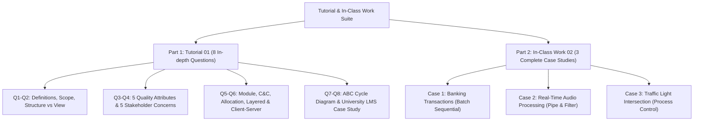
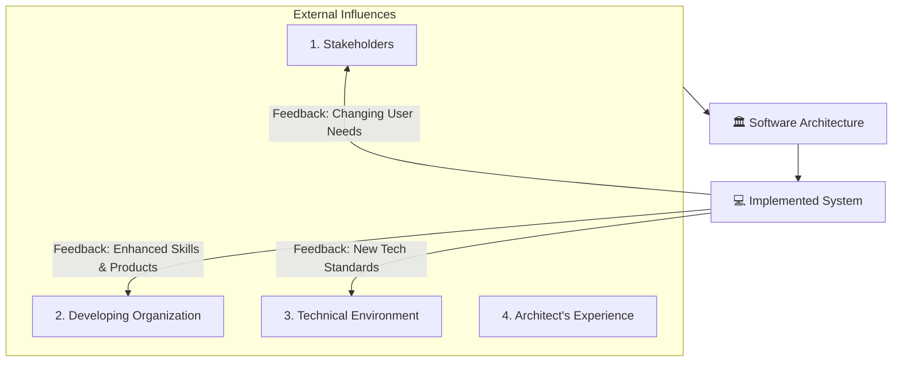
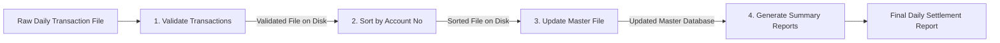

# 🏛️ ICT 1032 Software Architecture & Design — Tutorial 01 & In-Class Work 02 Master Discussion

> [!NOTE]
> **Course:** ICT 1032 / ICT 1032 2.0 (Software Architecture & Design)  
> **Source Documents:**  
> * [`10_Tutorial_01_SAD_Foundation_Exercises.pdf`](../Lecture%20Notes/10_Tutorial_01_SAD_Foundation_Exercises.pdf)  
> * [`11_In_Class_Work_02_Data_Flow_Case_Studies.pdf`](../Lecture%20Notes/11_In_Class_Work_02_Data_Flow_Case_Studies.pdf)  
> **Course Index:** [ICT 1032 Master Syllabus Index](../Short%20Notes/00_ICT_1032_SAD_Syllabus_Master_Index.md)

---

## 🧭 Document Navigation

---

# 📚 PART 1: Tutorial 01 (Foundations, Structures & ABC)

> 🔗 **අදාළ Short Notes & Lecture Slides:**
> * 📘 **Short Notes:** 
>   * [01. Introduction to Software Architecture & Design](../Short%20Notes/01_Introduction_to_Software_Architecture_and_Design.md)
>   * [02. Architectural Principles & Quality Attributes](../Short%20Notes/02_Architectural_Principles_Elements_and_Quality_Attributes.md)
>   * [03. Architectural Structures and Views](../Short%20Notes/03_Architectural_Structures_and_Views_Model.md)
>   * [04. The Architecture Business Cycle & Stakeholders](../Short%20Notes/04_The_Architecture_Business_Cycle_and_Stakeholder_Analysis.md)
> * 📑 **Lecture Slides:**
>   * [`01_Lecture_01_Introduction_Software_Architecture_and_Design.pdf`](../Lecture%20Notes/01_Lecture_01_Introduction_Software_Architecture_and_Design.pdf)
>   * [`02_Lecture_02_Software_Architecture_Foundations.pdf`](../Lecture%20Notes/02_Lecture_02_Software_Architecture_Foundations.pdf)
>   * [`03_Lecture_03_Architectural_Structures_and_Views.pdf`](../Lecture%20Notes/03_Lecture_03_Architectural_Structures_and_Views.pdf)
>   * [`04_Lecture_04_The_Architecture_Business_Cycle.pdf`](../Lecture%20Notes/04_Lecture_04_The_Architecture_Business_Cycle.pdf)

---

### ❓ Question 1 [10 Marks]
**Define the following core terms:**

* **a) Software Architecture:** The set of structures needed to reason about the system, comprising software elements, relations among them, and properties of both.
* **b) Software Design:** The low-level process of defining the internal structure, classes, algorithms, data structures, and interfaces of specific software modules to satisfy functional specifications.
* **c) Software Architect:** A high-level technical leader responsible for making strategic architectural decisions, balancing business goals with technical constraints, championing quality attributes, and communicating with stakeholders.
* **d) Quality Attribute:** A measurable or testable non-functional property of a software system (such as Performance, Security, Modifiability, Availability) that indicates how well the system performs its required functions.
* **e) Architectural Pattern:** A proven, reusable, structural design blueprint that provides a solution to a recurring architectural problem within a specific software context (e.g. MVC, Client-Server, Microservices).

---

### ❓ Question 2 [10 Marks]

#### i) Differentiate Software Architecture and Software Design:
* **Scope:** Architecture is system-wide (global); Design is component-level (local).
* **Abstraction:** Architecture deals with high-level components and connectors; Design deals with detailed classes, methods, and algorithms.
* **Cost of Change:** Modifying architecture late in development is extremely costly; refactoring code-level design is relatively fast and inexpensive.

#### ii) Differentiate Structure and View:
* **Structure:** The actual set of software/hardware elements and relations as they physically exist in the system reality.
* **View:** A documented representation of a coherent set of architectural elements designed to be read by specific stakeholders. (Rule: A view represents a structure).

---

### ❓ Question 3 [10 Marks]
**Explain five quality attributes with real-world examples:**

1. **Performance (ක්‍රියාකාරීත්ව වේගය):** Timeliness of system response.  
   * *Example:* An e-commerce search engine returning product results within 150 milliseconds under 20,000 concurrent user requests.
2. **Security (ආරක්ෂාව):** Resisting unauthorized access and protecting data integrity.  
   * *Example:* A banking application enforcing 2-Factor Authentication (2FA) and AES-256 encryption on all wire transfers.
3. **Availability (සක්‍රීයතාව):** System uptime and fault tolerance.  
   * *Example:* A hospital ICU monitoring system maintaining 99.999% uptime with automatic failover servers.
4. **Modifiability (වෙනස් කිරීමේ හැකියාව):** Ease of updating software without cascading breaks.  
   * *Example:* Adding a new cryptocurrency payment gateway into an e-commerce platform in 2 days without altering existing credit card modules.
5. **Scalability (දරාගැනීමේ හැකියාව):** Ability to handle increased workloads by adding hardware.  
   * *Example:* A video streaming platform automatically provisioning 50 additional cloud container instances during a live World Cup broadcast.

---

### ❓ Question 4 [10 Marks]
**List five stakeholders and explain their primary concerns:**

1. **End User (අවසාන පරිශීලකයා):** Concerned with an intuitive, error-free UI, fast response times, and system reliability.
2. **Customer / Client (ගනුදෙනුකරු):** Concerned with project budget, return on investment (ROI), contractual delivery schedule, and business value.
3. **Project Manager (ව්‍යාපෘති කළමනාකරු):** Concerned with resource allocation, team velocity, predictable milestones, and risk minimization.
4. **Software Developer (මෘදුකාංග සංවර්ධකයා):** Concerned with clean code boundaries, clear API specifications, modern libraries, and ease of unit testing.
5. **Maintainer / DevOps Engineer (නඩත්තු ඉංජිනේරු):** Concerned with modularity, comprehensive error logging, automated CI/CD deployment, and observability metrics.

---

### ❓ Question 5 [15 Marks]
**Explain the 3 main structure groups:**

1. **Module Structure:** Represents the system partitioned into static implementation units (packages, classes, files). Relations include "is-part-of", "inherits", and "allowed-to-use". (e.g. Decomposition Structure).
2. **Component-and-Connector (C&C) Structure:** Represents runtime entities with execution identity (processes, servers, databases) and communication paths (RPC, pipes, REST). (e.g. Client-Server Structure).
3. **Allocation Structure:** Maps software elements to non-software environmental elements (physical servers, disk storage, development teams). (e.g. Deployment Structure).

---

### ❓ Question 6 [15 Marks]
**Explain with examples:**

1. **Decomposition Structure:** A module structure that breaks down large software subsystems into progressively smaller sub-units to guide team assignments and budget tracking (e.g. E-Commerce System decomposed into `CatalogModule`, `PaymentModule`, `CartModule`).
2. **Layered Structure:** A hierarchical module structure where software is partitioned into horizontal layers, and layer $N$ only relies on services of layer $N-1$ (e.g. 3-Tier Web App: UI Layer $\to$ Business Logic Layer $\to$ Data Access Layer).
3. **Client-Server Structure:** A runtime C&C structure where independent client processes initiate requests across a network to a centralized server component that processes requests and returns responses (e.g. Web Browser client requesting web pages from an Apache HTTP Server).

---

### ❓ Question 7 [15 Marks]
**Explain the Architecture Business Cycle (ABC) and draw the diagram:**

* **Explanation:** Software architecture is not created in a vacuum; it is shaped by business goals, stakeholder demands, prevailing technology standards, and the architect's background. Once built, the system exerts reciprocal feedback on the organization, tech environment, and stakeholders.

---

### ❓ Question 8 [15 Marks]
**Discuss how Stakeholder Requirements, Developing Organization, and Technical Environment influence a University Learning Management System (LMS) architecture:**

1. **Stakeholder Requirements Influence:**
   * *Students & Lecturers:* Demand mobile-friendly access, fast video lecture streaming, and instant quiz submission.
   * *Exam Division:* Requires strict security, anti-cheating exam locks, and audit logs.
   * *Architectural Outcome:* The architect chooses a **Layered or Microservices pattern** with high availability and a dedicated Redis caching layer to handle 10,000 students submitting assignments at 11:59 PM.
2. **Developing Organization Influence:**
   * The university IT center has a limited budget and in-house expertise in PHP and MySQL (Moodle ecosystem).
   * *Architectural Outcome:* The architect chooses an open-source, modular PHP/MySQL architecture rather than an expensive proprietary enterprise stack.
3. **Technical Environment Influence:**
   * Growth of Cloud computing (AWS/Azure) and Single-Sign-On (SSO) standards (OAuth2, SAML).
   * *Architectural Outcome:* The architect designs cloud deployment containers (Docker) and integrates with the university's central Microsoft 365 identity directory.

---

# 📚 PART 2: In-Class Work 02 (Data Flow Case Studies)

> 🔗 **අදාළ Short Notes & Lecture Slides:**
> * 📘 **Short Notes:** [05. Data Flow Architecture Styles & Case Studies](../Short%20Notes/05_Data_Flow_Architecture_Styles_and_Case_Studies.md)
> * 📑 **Lecture Slides:** [`05_Lecture_05_Data_Flow_Architecture.pdf`](../Lecture%20Notes/05_Lecture_05_Data_Flow_Architecture.pdf)

---

### 🏦 Case Study 1: Banking Transactions (Batch Sequential)

#### a. Identify each subsystem in this batch sequential process:
1. **Validation Subsystem:** Validates incoming transaction records against account formats.
2. **Sorting Subsystem:** Sorts valid transaction records numerically by account number.
3. **Master Update Subsystem:** Applies transactions sequentially to update the master account balance database.
4. **Summary Report Generator:** Reads updated balances and generates end-of-day reconciliation reports.

#### b. Explain why the Batch Sequential Architecture is suitable:
* Nightly banking processing deals with millions of non-time-critical transactions accumulated during the day. Processing them in an offline, predictable batch during off-peak hours maximizes disk throughput, guarantees complete auditability, and allows safe rollbacks if errors occur.

#### c. Draw a simple block diagram showing the data flow:

#### d. State one limitation of using batch processing here:
* **High Latency / Lack of Real-Time Information:** Account balances and report summaries are only up-to-date as of the previous night's batch run. Immediate daytime fraud or account overdrafts cannot be detected in real-time.

---

### 🎙️ Case Study 2: Real-Time Audio Processing (Pipe & Filter)

#### a. Identify the filters and pipes in this system:
* **Filters (Data Transformers):**
  1. *Filter 1:* Noise Reduction Filter
  2. *Filter 2:* Equalizer Filter
  3. *Filter 3:* Compressor Filter
* **Pipes (Communication Channels):**
  * Unidirectional shared-memory audio data stream buffers connecting Microphone $\to$ Filter 1 $\to$ Filter 2 $\to$ Filter 3 $\to$ Speaker Output.

#### b. Explain how concurrency can improve performance in this pipeline:
* Downstream filters do not wait for the entire audio track to finish. As Filter 1 processes audio block $N+1$, Filter 2 simultaneously equalizes block $N$, and Filter 3 compresses block $N-1$ across separate CPU cores. This multi-threaded pipelining drastically reduces end-to-end audio latency.

#### c. State one benefit and one limitation of Pipe & Filter architecture:
* **Benefit:** High reusability and modifiability (filters can easily be reordered or replaced, e.g., swapping a 5-band EQ with a 10-band EQ).
* **Limitation:** Performance overhead caused by continuous data buffering, format conversions, and synchronization across pipes.

#### d. Suggest one situation where this architecture may not work well:
* In an interactive audio editing GUI with complex global state (e.g. multi-track undo/redo, user clicking random track markers, and dynamic parameter adjustments), where execution is control-driven rather than stream-driven.

---

### 🚦 Case Study 3: Traffic Light Control System (Process Control)

#### a. Identify variables in this system:
* **Input Variables:** Sensor signals from road induction loops, pedestrian button press events, internal clock timer.
* **Controlled Variable (Output being regulated):** Vehicle queue length / traffic delay at the four-way intersection.
* **Manipulated Variable (Adjusted by controller):** Green light duration and signal light switching cycle times.

#### b. Define the term Set Point in this context:
* **Set Point:** The target/desired operating value that the controller attempts to maintain (e.g. *"Average vehicle waiting time at intersection must not exceed 45 seconds"*).

#### c. Explain how feedback is used in this closed-loop control system:
* Embedded road sensors continuously measure the actual traffic density (Controlled Variable) and feed this data back to the comparator. The controller calculates the error between the actual traffic queue and the Set Point, dynamically adjusting green light durations (Manipulated Variable) to restore optimal traffic flow.

#### d. Describe one real-world disturbance that could affect performance:
* An unexpected road accident or vehicle breakdown blocking an intersection lane, an emergency ambulance requiring immediate priority override, or severe flash flooding covering the road sensors.
