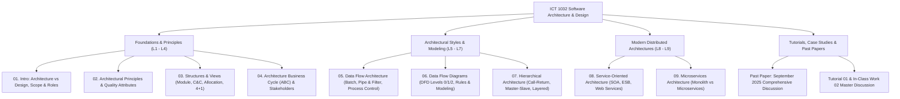

# 🏛️ ICT 1032 Software Architecture & Design — Master Syllabus & Course Navigation Index

> [!NOTE]
> **Course Code:** ICT 1032 / ICT 1032 2.0 (Software Architecture & Design)  
> **Academic Unit:** Department of Computer Science, Faculty of Applied Sciences, University of Sri Jayewardenepura  
> **Target Audience:** First Year ICT Undergraduates  
> **Standard:** Complete Zero-to-Hero University Examination Reference

---

## 🗺️ Master Curriculum Tree & Topic Map

---

## 📚 1. Master Lecture Modules Index

| Module | Title & Core Coverage | Primary Lecture Slides | Master Short Note |
| :---: | :--- | :--- | :---: |
| **01** | **Introduction to Software Architecture & Design** • Architecture vs Design (Scope & Abstraction) • Role of the Software Architect • Why Architecture Matters (Early decisions, Quality enables) | [`01_Lecture_01...pdf`](../Lecture%20Notes/01_Lecture_01_Introduction_Software_Architecture_and_Design.pdf) | [01. Intro to SAD](./01_Introduction_to_Software_Architecture_and_Design.md) |
| **02** | **Architectural Principles & Quality Attributes** • Formal Definitions (Bass/Clements/Kazman, Garlan & Shaw) • 7 Major Quality Attributes (Performance, Security, Modifiability, Availability, Scalability, etc.) • Reference Models vs Reference Architectures | [`02_Lecture_02...pdf`](../Lecture%20Notes/02_Lecture_02_Software_Architecture_Foundations.pdf) | [02. Principles & Qualities](./02_Architectural_Principles_Elements_and_Quality_Attributes.md) |
| **03** | **Architectural Structures and Views** • Structure vs View concept (Human body analogy) • 3 Main Structure Groups: Module, C&C, Allocation • Kruchten's 4+1 View Model | [`03_Lecture_03...pdf`](../Lecture%20Notes/03_Lecture_03_Architectural_Structures_and_Views.pdf) | [03. Structures & Views](./03_Architectural_Structures_and_Views_Model.md) |
| **04** | **The Architecture Business Cycle (ABC)** • ABC Influences (Stakeholders, Org, Tech Environment, Architect) • Feedback Loops & Architecture Evaluation • Stakeholder Conflict Management | [`04_Lecture_04...pdf`](../Lecture%20Notes/04_Lecture_04_The_Architecture_Business_Cycle.pdf) | [04. ABC & Stakeholders](./04_The_Architecture_Business_Cycle_and_Stakeholder_Analysis.md) |
| **05** | **Data Flow Architecture Styles** • Data-driven vs Control-driven computation • 3 Categories: Batch Sequential, Pipe & Filter, Process Control • Real-world Pipelines (Audio DSP, Banking Batch) | [`05_Lecture_05...pdf`](../Lecture%20Notes/05_Lecture_05_Data_Flow_Architecture.pdf) | [05. Data Flow Styles](./05_Data_Flow_Architecture_Styles_and_Case_Studies.md) |
| **06** | **Data Flow Diagrams (DFD)** • 4 Elements (Entity, Process, Store, Flow) • Context Diagram, Level-0, Level-1 Decomposition • Logical vs Physical DFD & Validation Rules | [`06_Lecture_06...pdf`](../Lecture%20Notes/06_Lecture_06_Data_Flow_Diagrams_DFD.pdf) | [06. DFD Modeling](./06_Data_Flow_Diagrams_DFD_Modeling_and_Rules.md) |
| **07** | **Hierarchical Software Architecture** • Main Program & Subroutines (Call-and-Return) • Master-Slave Architecture (Parallelism & Fault tolerance) • Layered Architecture (N-Tier, Separation of Concerns) | [`07_Lecture_07...pdf`](../Lecture%20Notes/07_Lecture_07_Hierarchical_Software_Architecture.pdf) | [07. Hierarchical Styles](./07_Hierarchical_Architecture_Layered_and_Master_Slave.md) |
| **08** | **Service-Oriented Architecture (SOA)** • Core Principles (Loose coupling, Autonomy, Reusability) • Roles: Provider, Consumer, Registry (Find-Bind-Publish) • Enterprise Service Bus (ESB) & Web Services (SOAP/WSDL) | [`08_Lecture_08...pdf`](../Lecture%20Notes/08_Lecture_08_Service_Oriented_Architecture_SOA.pdf) | [08. SOA & ESB](./08_Service_Oriented_Architecture_SOA_and_ESB.md) |
| **09** | **Microservices Architecture** • Monolith vs SOA vs Microservices • Database-per-service, API Gateway, Service Discovery • Distributed Challenges (Eventual consistency, Network latency) | [`09_Lecture_09...pdf`](../Lecture%20Notes/09_Lecture_09_Microservices_Architecture.pdf) | [09. Microservices](./09_Microservices_Architecture_Design_and_Patterns.md) |

---

## 📝 2. Past Examination Papers & Tutorial Discussions

| Document | Source File | Master Discussion Guide | Description & Coverage |
| :--- | :--- | :--- | :--- |
| **Past Paper (Sept 2025)** | [`SAD Paper.pdf`](../Papers/SAD%20Paper.pdf) | [SAD Past Paper 2025 Master Discussion](../Papers/ICT_1032_SAD_Past_Paper_September_2025_Discussion.md) | **100 Marks Full Solution Guide** • Q1 (25 M): Arch vs Design, Quality Attributes, Hospital Patient Case Study. • Q2 (25 M): Importance of SAD, 3 Structure Groups, Smart City Traffic Case Study. • Q3 (25 M): Data Flow Categories, DFD Rules, Library Management System Context & Level-0 DFD. • Q4 (25 M): ESB in SOA, Microservices Challenges, Documentation Best Practices, Patient Portal Case Study. |
| **Tutorial 01 & In-Class 02** | [`10_Tutorial_01...pdf`](../Lecture%20Notes/10_Tutorial_01_SAD_Foundation_Exercises.pdf) [`11_In_Class_02...pdf`](../Lecture%20Notes/11_In_Class_Work_02_Data_Flow_Case_Studies.pdf) | [Tutorial & In-Class Work Master Discussion](../Papers/ICT_1032_Tutorial_01_and_InClass_Work_Master_Discussion.md) | **Complete Problem Set Discussion** • Tutorial 01: All 8 Foundation Questions & University LMS Case Study. • In-Class Work 02: Banking Batch Sequential, Audio DSP Pipe & Filter, Traffic Light Closed-Loop Process Control. |

---

## ⚡ 3. Architectural Styles Comparison Cheat Sheet

| Architectural Style | Key Driving Principle | Primary Components & Connectors | Major Advantages | Major Limitations / Trade-offs | Ideal Real-World Use Cases |
| :--- | :--- | :--- | :--- | :--- | :--- |
| **Batch Sequential** | Discrete stages processing data in whole batches | Independent Programs / Files & Magnetic Tapes | Simple flow, High throughput for bulk data | High latency, No intermediate feedback, No concurrency | Nightly Payroll processing, Billing, Bulk report generation |
| **Pipe and Filter** | Stream transformation of continuous data | Filters (Transformers) / Pipes (Data streams) | Reusability, Concurrency, Easy maintenance | High data transformation overhead, Not for interactive UI | Unix shell commands (`ls \| grep`), Audio/Video DSP pipelines, Compiler phases |
| **Layered (N-Tier)** | Horizontal separation of concerns | Layers (Presentation, Logic, Data) / Method calls | High modifiability, Reusability, Loose coupling | Performance overhead (pass-through calls), Layer bridge violations | Enterprise Web Applications, Operating Systems (OSI, Linux Kernel) |
| **Master-Slave** | Central coordination with distributed workers | Master controller / Replicated Slave workers | Fault tolerance, High computational throughput | Master is single point of failure (SPOF), Communication overhead | Database replication, Distributed matrix multiplication, Fault-tolerant avionics |
| **Service-Oriented (SOA)** | Enterprise-wide service reuse via ESB | Services, ESB, Service Registry / SOAP/REST protocols | Interoperability across legacy systems, High reuse | ESB complexity, Performance overhead, Complex governance | Large enterprise integration (Banking core + CRM + ERP), Healthcare portals |
| **Microservices** | Domain-driven independent autonomous services | Microservices, API Gateway, Event Bus / REST, gRPC, Kafka | Independent deployability, Polyglot tech, Extreme scalability | Distributed data consistency, Network latency, High operational complexity | Large cloud platforms (Netflix, Amazon, Uber, Spotify) |
