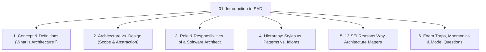
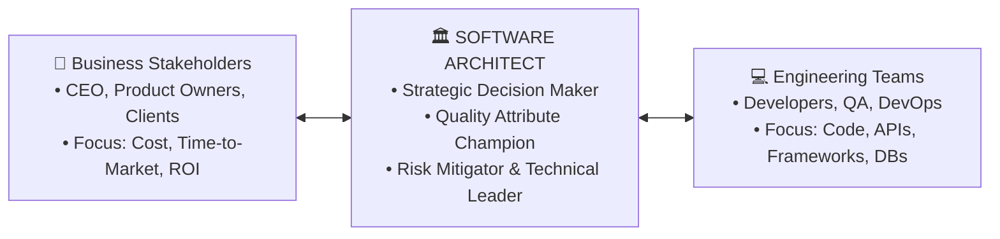
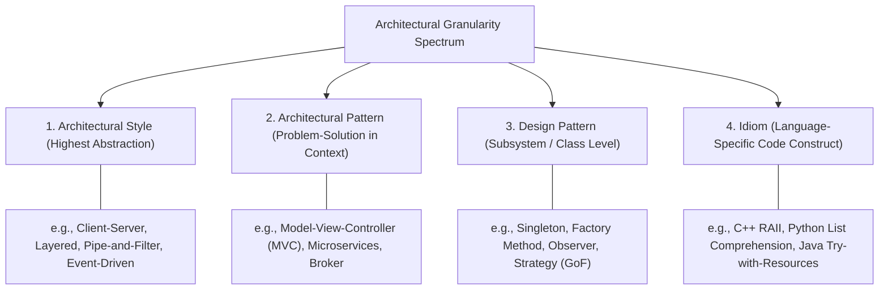

# 🏛️ Module 01: Introduction to Software Architecture & Design

> [!NOTE]
> **Course Module Reference:** ICT 1032 / ICT 1032 2.0 (Software Architecture & Design) — Lecture 01  
> **Source Lecture PDF:** [`01_Lecture_01_Introduction_Software_Architecture_and_Design.pdf`](../Lecture%20Notes/01_Lecture_01_Introduction_Software_Architecture_and_Design.pdf)  
> **Primary References:** Bass, Clements, & Kazman (*Software Architecture in Practice*); Shaw & Garlan  
> **Master Index:** [ICT 1032 Master Syllabus Index](./00_ICT_1032_SAD_Syllabus_Master_Index.md)

---

## 🧭 Topic Navigation & Learning Map



---

## 🎨 Visual Concept: Architecture vs. Design


---

## 1. What is Software Architecture?

### 📖 1.1 Formal Definition (Bass, Clements, & Kazman - SEI)
> "The **Software Architecture** of a computing system is the set of structures needed to reason about the system, which comprises software elements, relations among them, and properties of both."

#### 🔑 The 3 Pillars of the Definition:
1. **Software Elements (මෘදුකාංග මූලද්‍රව්‍ය):** The constituent runtime or static computational blocks (e.g., Clients, Servers, Databases, Microservices, UI Components, Batch Processors).
2. **Relations Among Elements (සම්බන්ධතා):** How elements interact and bind together (e.g., REST API calls, RPC, Message Queues, SQL queries, Unix Pipes, Inheritance).
3. **Properties of Both (ගුණාංග):** The externally observable behaviors, interface contracts, performance constraints, and security guarantees.
4. **Abstraction (වියුක්තකරණය):** Architecture purposefully hides internal implementation details (e.g., whether an algorithm uses QuickSort or BubbleSort) and focuses solely on **external behavior and system-wide interactions**.

---

## 2. Software Architecture vs. Software Design (Deep Comparative Analysis)

> 💡 **The Skyscraper Construction Analogy (මහල් ගොඩනැගිලි උපමාව):**  
> * **Software Architecture (ගොඩනැගිලි සැලැස්ම):** ගොඩනැගිල්ලක ප්‍රධාන රාමුව (Structural Steel Frame), අත්තිවාරම (Deep Foundation), භූමිකම්පා වලට ඔරොත්තු දීමේ හැකියාව (Earthquake Resistance), සහ ප්‍රධාන ජල/විදුලි නල පද්ධතියයි (Global Utilities). මෙය මුළු ගොඩනැගිල්ලේම පැවැත්ම සහ ආරක්ෂාව තීරණය කරයි.
> * **Software Design (අභ්‍යන්තර කාමර සැලසුම):** එක් එක් කාමරය ඇතුළත මේස පුටු තබන ආකාරය (Furniture Layout), කාමරයේ බිත්තිවල පාට (Color Scheme), දොර අගුල් (Door Locks), සහ ස්විච පිහිටුවන ආකාරයයි.

### 📊 Master Comparison Matrix (Past Paper Guaranteed)

| Feature / Dimension | Software Architecture (ගෘහ නිර්මාණ ශිල්පය) | Software Design (මෘදුකාංග සැලසුම්කරණය) |
| :--- | :--- | :--- |
| **Scope (පරාසය)** | **System-wide / Global** (මුළු පද්ධතියම ආවරණය කරයි). | **Component-level / Local** (තනි මොඩියුලයක් හෝ Class එකක් තුළට සීමා වේ). |
| **Level of Abstraction** | **Highest Level** (Subsystems, Components, Connectors). | **Low / Detailed Level** (Classes, Methods, Data Structures, Loops). |
| **Primary Focus** | Non-Functional Requirements (**Quality Attributes**: Scalability, Security, Performance). | Functional Requirements (Specific business logic, CRUD operations, UI rendering). |
| **Key Questions Addressed** | **"WHAT" & "WHERE"** (What are the major blocks, where does data flow?). | **"HOW"** (How does a specific method execute its internal algorithm?). |
| **Cost of Change (වෙනස් කිරීමේ පිරිවැය)** | **Catastrophically High** (Changing architecture late requires rebuilding the foundation). | **Low to Moderate** (Refactoring a class or method can be completed in hours). |
| **Key Deliverables / Artifacts** | C&C Views, Deployment Diagrams, Context Diagrams, Level-0 DFDs. | Class Diagrams, Sequence Diagrams, Activity Diagrams, State Machines. |
| **Key Decision Makers** | Chief Architect, Enterprise Architect, CTO. | Senior Software Engineers, Developers. |

---

## 3. The Software Architect: Roles & Responsibilities

The Software Architect is the central strategic leader who connects **Business Stakeholders** (money, schedule, ROI) with **Technical Engineers** (code, frameworks, databases).



### 📋 5 Core Responsibilities of an Architect:
1. **Translating Business Goals into Architecture:** Converting vague client needs into concrete architectural constraints.
2. **Quality Attribute Champion:** Ensuring the system meets non-functional requirements (e.g. 99.99% uptime, <200ms latency).
3. **Strategic Technology Selection:** Evaluating trade-offs between frameworks, cloud providers, and databases.
4. **Risk Mitigation:** Identifying performance bottlenecks, single points of failure, and security holes *before* coding starts.
5. **Technical Governance & Mentorship:** Enforcing coding standards and architectural rules across development teams.

---

## 4. Granularity Spectrum: Styles vs. Patterns vs. Idioms



---

## 5. Why Architecture Matters (13 SEI Key Reasons)

The Software Engineering Institute (SEI) outlines why software architecture is critical:

1. **Inhibits or Enables Quality Attributes:** You cannot code your way out of a flawed architecture (e.g., adding encryption cannot fix an inherently unscalable synchronous monolith).
2. **Early Design Decisions are Hardest to Reverse:** The foundation sets the trajectory of the entire software lifecycle.
3. **Facilitates Stakeholder Communication:** Provides a shared, understandable abstraction for non-programmers.
4. **Governs Work Breakdown Structure (WBS):** Dictates how teams are split and assign modular tasks.
5. **Enables Software Reuse and Product Lines:** Reusing an architectural framework across multiple client apps saves 70%+ development costs.
6. **Facilitates Accurate Cost & Schedule Estimation:** Project managers base estimates on component boundaries.
7. **Limits Complexity:** Breaks down massive cognitive load into manageable, isolated subsystems.

---

## 🧠 Memory Tricks & Mnemonics (මතක තබා ගැනීමේ කෙටි උපක්‍රම)

```
Mnemonic for Architecture vs Design Scope:
"A-B-C-D"
A -> Architecture = Broad & Conceptual (System-wide, What & Where)
D -> Design = Detailed & Dedicated (Component-level, How)
```

---

## ⚠️ Common Exam Pitfalls & Traps (විභාගයේදී සිසුන්ට නිතරම වරදින තැන්)

* ❌ **Trap 1:** *"Architecture is just source code written cleanly."*  
  👉 **Reality:** Architecture is an **abstraction**. It deliberately omits internal code details and focuses on externally visible properties and component relations.
* ❌ **Trap 2:** Confusing **Architectural Pattern** with **Design Pattern**.  
  👉 **Reality:** MVC and Microservices are *Architectural Patterns* (system-wide structural blueprints), while Singleton and Factory are *Design Patterns* (localized object-oriented solutions).
* ❌ **Trap 3:** Believing requirements alone are enough to design an architecture.  
  👉 **Reality:** Architecture is heavily driven by the **Architecture Business Cycle (ABC)**, including organizational goals, technical environment, and architect's experience.

---

## 💡 Sinhala Zero-to-Hero Conceptual Summary (සරල සිංහල පැහැදිලි කිරීම)

* **Software Architecture කියන්නේ මොකක්ද?**  
  මෘදුකාංග පද්ධතියක ප්‍රධාන කොටස් (Components) මොනවාද, ඒවා එකිනෙක සම්බන්ධ වෙන්නේ කොහොමද (Connectors), සහ පද්ධතියේ වේගය, ආරක්ෂාව, සහ දරාගැනීමේ හැකියාව (Quality Attributes) තීරණය කරන උසස් මට්ටමේ ප්‍රධාන සැලැස්මයි.
* **Architecture සහ Design අතර වෙනස:**  
  * **Architecture:** මහල් ගොඩනැගිල්ලක structural blueprint එක වැනිය (ප්‍රධාන බාල්ක, අත්තිවාරම, විදුලි/ජල ප්‍රධාන මාර්ග). පද්ධති මට්ටමේ තීරණයකි (System-wide).
  * **Design:** කාමරයක් ඇතුළත interior design එක වැනිය (මේස තබන තැන, දොර අගුල්, බිත්තිවල පාට). Class සහ Method මට්ටමේ තීරණයකි (Component-level).

---

## 🎯 Exam Review & Model Questions (Spot Questions)

### ❓ Question 1 (Essay - 10 Marks)
**Differentiate between Software Architecture and Software Design across: (i) Scope, (ii) Level of Abstraction, (iii) Cost of Change, and (iv) Artifacts Produced. Give a real-world civil engineering analogy.**
* **Model Marking Breakdown:**
  * Scope differentiation $\to$ [2 Marks]
  * Level of Abstraction $\to$ [2 Marks]
  * Cost of Change $\to$ [2 Marks]
  * Artifacts produced $\to$ [2 Marks]
  * Civil engineering analogy (Skyscraper Blueprint vs Interior Design) $\to$ [2 Marks]
