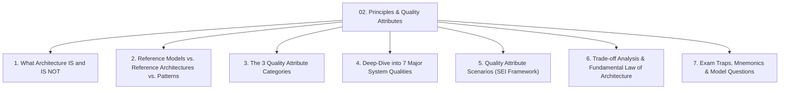
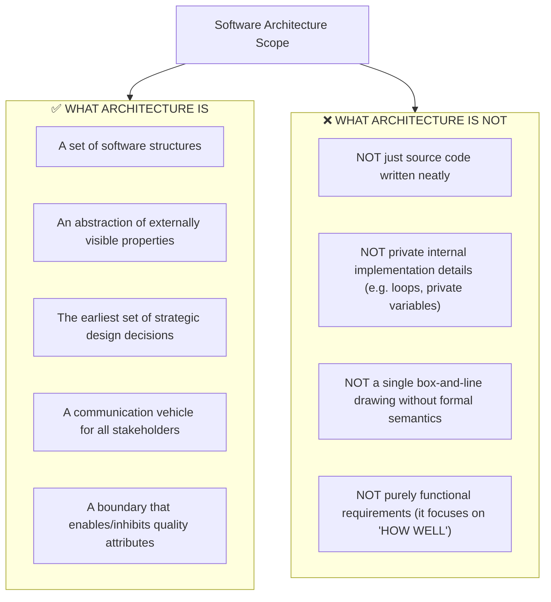
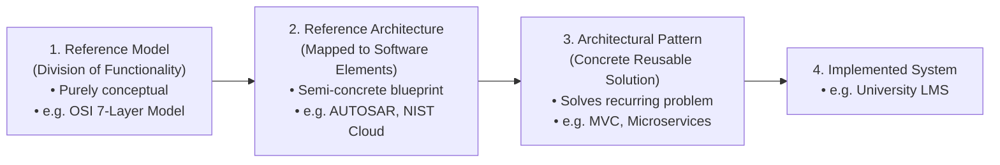
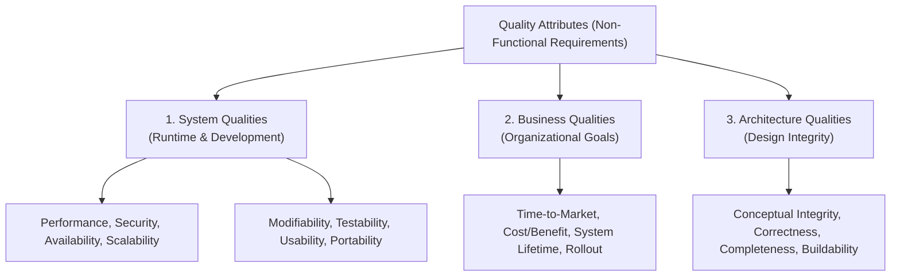
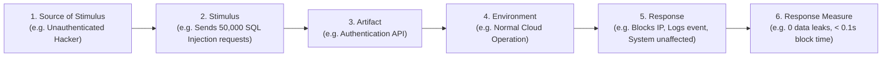
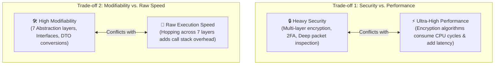

# 🏛️ Module 02: Architectural Principles, Elements & Quality Attributes

> [!NOTE]
> **Course Module Reference:** ICT 1032 / ICT 1032 2.0 (Software Architecture & Design) — Lecture 02  
> **Source Lecture PDF:** [`02_Lecture_02_Software_Architecture_Foundations.pdf`](../Lecture%20Notes/02_Lecture_02_Software_Architecture_Foundations.pdf)  
> **Primary References:** Bass, Clements, & Kazman (*Software Architecture in Practice*, Chapters 4 & 5); ISO/IEC 25010  
> **Master Index:** [ICT 1032 Master Syllabus Index](./00_ICT_1032_SAD_Syllabus_Master_Index.md)

---

## 🧭 Topic Navigation & Learning Map



---

## 1. What Software Architecture IS and IS NOT



---

## 2. Reference Models vs. Reference Architectures vs. Architectural Patterns

A classic university examination question (e.g. September 2025 Paper Q2 Part B(i)).



### 📊 Master Comparison Matrix

| Term | Formal Definition | Abstraction Level | Concrete Real-World Example |
| :--- | :--- | :--- | :--- |
| **Reference Model (යොමු ආකෘතිය)** | A standard division of functionality that partitions a problem domain into well-defined functional layers without specifying software components or code. | **Purely Conceptual** (No software elements or data flows specified). | **OSI 7-Layer Network Model**, 6-Phase Compiler Model. |
| **Reference Architecture (යොමු ගෘහ නිර්මාණ ශිල්පය)** | A reference model mapped onto software elements (components, connectors, and data flows) providing a standardized blueprint for a family of applications. | **Semi-Concrete Architectural Blueprint**. | **AUTOSAR** (Automotive Open System Architecture), **NIST Cloud Reference Architecture**. |
| **Architectural Pattern (ගෘහ නිර්මාණ රටාව)** | A proven, reusable solution to a commonly occurring architectural problem within a specific technical context. | **Concrete Design Solution**. | **Model-View-Controller (MVC)**, **Layered Pattern**, **Client-Server**. |

---

## 3. The 3 Categories of Quality Attributes



---

## 4. Deep-Dive into the 7 Major System Quality Attributes

```
🧠 Mnemonic to remember the 7 Major Quality Attributes:
"P - S - M - A - S - T - U"
P -> Performance (වේගය)
S -> Security (ආරක්ෂාව)
M -> Modifiability (වෙනස් කිරීමේ පහසුව)
A -> Availability (සක්‍රීයතාව)
S -> Scalability (දරාගැනීමේ හැකියාව)
T -> Testability (පරීක්ෂා කිරීමේ හැකියාව)
U -> Usability (පරිශීලක පහසුව)
```

---

### ⚡ 4.1 Performance (ක්‍රියාකාරීත්ව වේගය)
* **Definition:** The timeliness of the system’s response to events under varying loads.
* **Key Metrics:** **Latency** (response time in ms), **Throughput** (transactions/sec), **Resource Utilization** (CPU/RAM %).
* **Architectural Tactics:**
  1. *Introduce Concurrency:* Use multi-threading, worker pools, asynchronous event queues.
  2. *Caching:* Store frequently accessed data in fast in-memory stores (e.g. Redis, Memcached).
  3. *Load Balancing:* Distribute incoming traffic evenly across multiple server nodes.

### 🛡️ 4.2 Security (ආරක්ෂාව)
* **Definition:** The system's ability to resist unauthorized actions while providing service to legitimate users (**CIA Triad**).
* **Key Pillars:**
  * **Confidentiality:** Unauthorized parties cannot read data (Encryption via AES-256, TLS 1.3).
  * **Integrity:** Data cannot be tampered with or corrupted (Digital Signatures, Hash Checks).
  * **Availability:** System remains operational during DDoS attacks.
* **Architectural Tactics:** Authenticate users (OAuth2, JWT), Authorize permissions (RBAC), Audit user activity (Audit Logs).

### 🛠️ 4.3 Modifiability & Maintainability (වෙනස් කිරීමේ හැකියාව)
* **Definition:** The ease with which the software can be modified to add features, fix bugs, or adapt to new platforms without breaking existing components.
* **Architectural Tactics:**
  1. *Reduce Coupling:* Use interfaces, dependency injection, and message brokers.
  2. *Increase Cohesion:* Keep related functionality bundled within the same module (Single Responsibility).
  3. *Information Hiding & Encapsulation:* Hide internal data representation behind private interfaces.

### ⏱️ 4.4 Availability & Reliability (සක්‍රීයතාව)
* **Definition:** The percentage of time the system is functioning correctly and accessible when needed (e.g. $99.999\%$ "Five Nines" = only 5.26 minutes downtime per year!).
* **Architectural Tactics:**
  1. *Fault Detection:* Heartbeat monitoring, Ping/Echo, Exceptions.
  2. *Fault Recovery:* Failover to hot standby backup server, Master-Slave replication, Circuit Breaker.
  3. *Redundancy:* Replicating critical servers in multiple geographic cloud zones.

### 📈 4.5 Scalability (දරාගැනීමේ හැකියාව)
* **Definition:** The ability to handle growing workloads by adding hardware resources.
* **Vertical Scaling (Scale-Up):** Adding more CPU/RAM/Disks to a single machine (Has physical hardware limits).
* **Horizontal Scaling (Scale-Out):** Adding more identical server instances behind a load balancer (Virtually unlimited cloud scaling).

### 🧪 4.6 Testability & 👤 4.7 Usability
* **Testability:** How easily the system can reveal its faults through automated test suites (Tactics: Dependency Injection, Mock interfaces).
* **Usability:** How easily and intuitively human users can accomplish their goals (Tactics: Task cancellation, Undo, Progress indicators).

---

## 5. Quality Attribute Scenarios (SEI 6-Part Framework)

To specify a quality attribute unambiguously, SEI defines a **6-Part Scenario**:



---

## 6. The Fundamental Law of Architecture: Trade-off Analysis

> [!IMPORTANT]
> **Fundamental Law of Architecture:**  
> "There are no perfect solutions in software architecture; there are only trade-offs." You cannot maximize all quality attributes simultaneously!



---

## ⚠️ Common Exam Pitfalls & Traps (විභාගයේදී සිසුන්ට නිතරම වරදින තැන්)

* ❌ **Trap 1:** Writing *"A Reference Model and Reference Architecture are identical."*  
  👉 **Truth:** A Reference Model is purely conceptual (no software specified), while a Reference Architecture maps those functions to concrete software elements.
* ❌ **Trap 2:** Assuming an architectural pattern automatically guarantees performance.  
  👉 **Truth:** A pattern provides a structural blueprint, but poor configuration, unindexed databases, or network bottlenecks can still ruin performance.
* ❌ **Trap 3:** Confusing Functional Requirements with Quality Attributes.  
  👉 **Truth:** "User can view bank balance" is Functional. "Balance loads in $< 100$ms under 10,000 users" is a Quality Attribute.

---

## 💡 Sinhala Zero-to-Hero Conceptual Summary (සරල සිංහල පැහැදිලි කිරීම)

* **Quality Attributes (තත්ත්ව ගුණාංග):** මෘදුකාංගයක් "කරන්නේ මොනවාද" (Functional Requirements) යන්නට අමතරව, එය "කොතරම් වේගයෙන්, කොතරම් ආරක්ෂිතව සහ කොතරම් විශ්වාසදායකව කරනවාද" (Non-Functional Requirements) යන්නයි.
* **Trade-offs (අන්‍යෝන්‍ය හුවමාරුව):** එක ගුණාංගයක් වැඩි කරන විට තව එකක් අඩු වේ. උදාහරණයක් ලෙස, ආරක්ෂාව (Security) වැඩි කිරීමට හැම තැනම බරපතල Encryption යෙදූ විට, CPU එක කාර්යබහුල වී වේගය (Performance) අඩුවේ.

---

## 🎯 Exam Review & Model Questions (Spot Questions)

### ❓ Question 1 (True/False with Justification - 6 Marks)
1. *"A reference model and a reference architecture are identical."* $\to$ **FALSE** (Model is conceptual; Architecture maps to software elements).
2. *"Using a client-server pattern automatically guarantees high performance."* $\to$ **FALSE** (Central server can easily become a performance bottleneck).
3. *"Architecture is strictly the source code written neatly."* $\to$ **FALSE** (Architecture is an abstraction hiding internal code details).
