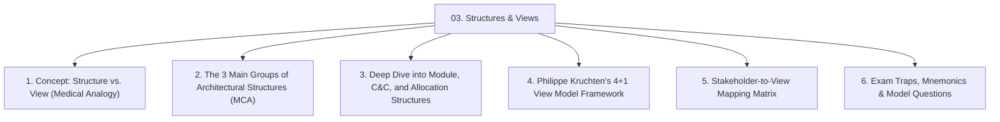
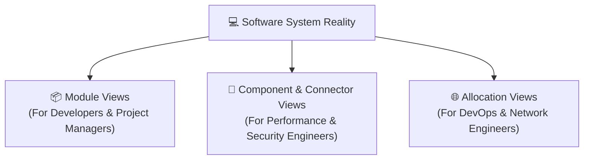
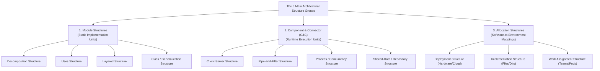
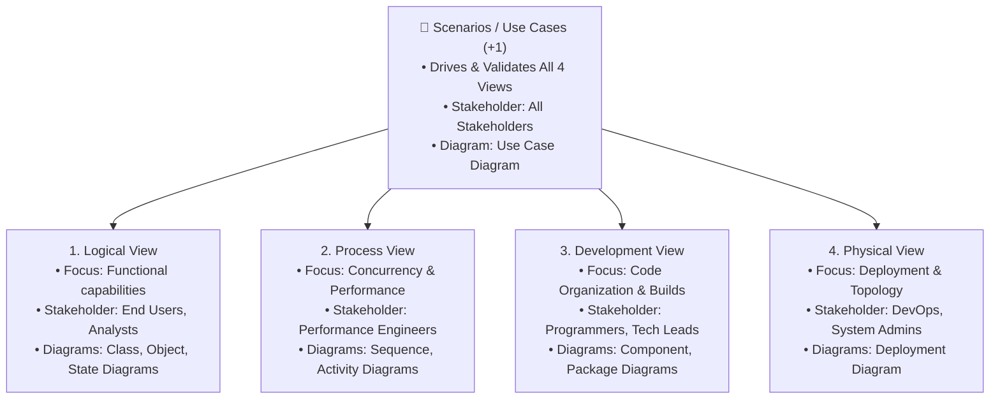

# 🏛️ Module 03: Architectural Structures and Views

> [!NOTE]
> **Course Module Reference:** ICT 1032 / ICT 1032 2.0 (Software Architecture & Design) — Lecture 03  
> **Source Lecture PDF:** [`03_Lecture_03_Architectural_Structures_and_Views.pdf`](../Lecture%20Notes/03_Lecture_03_Architectural_Structures_and_Views.pdf)  
> **Primary References:** Clements et al. (*Documenting Software Architectures: Views and Beyond*); Philippe Kruchten (IEEE Software)  
> **Master Index:** [ICT 1032 Master Syllabus Index](./00_ICT_1032_SAD_Syllabus_Master_Index.md)

---

## 🧭 Topic Navigation & Learning Map



---

## 1. Structures vs. Views (The Medical & Blueprint Analogy)

> 💡 **The Medical Specialist Analogy (වෛද්‍ය විශේෂඥ උපමාව):**  
> * **මිනිස් සිරුර (The Reality):** එකම මිනිස් සිරුරක් තුළ ස්නායු පද්ධතිය (Nervous System), සංසරණ පද්ධතිය (Circulatory System), සහ අස්ථි පද්ධතිය (Skeletal System) එකට බැඳී පවතී.
> * **වෛද්‍යවරුන්ගේ දෘෂ්ටිය (The Views):**
>   * ස්නායු විශේෂඥයා (Neurologist) බලන්නේ **ස්නායු දෘෂ්ටිය (Nervous View)** පමණි.
>   * හෘද රෝග විශේෂඥයා (Cardiologist) බලන්නේ **රුධිර සංසරණ දෘෂ්ටිය (Circulatory View)** පමණි.
>   * විකලාංග විශේෂඥයා (Orthopedist) බලන්නේ **ඇටසැකිලි දෘෂ්ටිය (Skeletal View)** පමණි.
> * **නිගමනය:** සිරුර තුළ ඇත්තෙන්ම පවතින්නේ **"Structure"** (ව්‍යුහයන්) වන අතර, එක් එක් විශේෂඥයාට අවශ්‍ය පරිදි එය චිත්‍රණය කර පෙන්වන්නේ **"View"** (දෘෂ්ටිය) මගිනි.



### 📖 Formal Definitions:
* **Structure (ව්‍යුහය):** The set of elements themselves as they exist in software or hardware reality.
* **View (දෘෂ්ටිය):** A representation of a coherent set of architectural elements written and read by system stakeholders to reason about specific concerns.
* **Fundamental Rule:** *"A View is a representation of a Structure."*

---

## 2. The 3 Main Groups of Architectural Structures

```
🧠 Mnemonic for the 3 Structure Groups:
"M - C - A"
M -> Module Structures (Static code units - Classes, Packages)
C -> Component-and-Connector Structures (Runtime execution elements - Servers, APIs, Pipes)
A -> Allocation Structures (Software-to-Hardware environment mappings)
```



---

## 3. Comprehensive Analysis of the 3 Structure Groups

### 📦 3.1 Module Structures (Static Units)
* **What are the elements?** Static code units (Packages, Classes, Files, Subsystems).
* **What are the relations?** Code dependencies ("is-part-of", "uses", "inherits", "allowed-to-use").
* **Sub-types:**
  1. **Decomposition Structure:** Breaks large software down into manageable sub-units. Guides budgeting, team resource allocation, and project management.
  2. **Uses Structure:** Module $A$ "uses" Module $B$ if $A$'s correctness depends on $B$. Crucial for building incremental software releases and subsets.
  3. **Layered Structure:** Modules partitioned into horizontal layers where Layer $N$ can only use Layer $N-1$. Provides high modifiability and portability.
  4. **Class / Generalization Structure:** Object-oriented inheritance hierarchies ("is-a" relations).

---

### 🔌 3.2 Component-and-Connector (C&C) Structures (Runtime Units)
* **What are the elements?** Runtime entities with execution identity (Processes, Objects, Servers, Web Clients, Databases, Filters).
* **What are the relations?** Connectors / communication mechanisms (RPC, REST HTTP calls, Message Queues, Unix Pipes, Event Buses).
* **Sub-types:**
  1. **Client-Server Structure:** Client components initiate network requests to centralized server components.
  2. **Pipe-and-Filter Structure:** Independent filter components transform streams of data passed via unidirectional pipes.
  3. **Process / Concurrency Structure:** Parallel executing threads/processes communicating via shared memory or inter-process communication (IPC).
  4. **Shared-Data (Repository) Structure:** Independent compute components reading/writing to a central persistent database or blackboard.

---

### 🌐 3.3 Allocation Structures (Software-to-Environment)
* **What are the elements?** Software elements mapped onto environmental resources.
* **Sub-types:**
  1. **Deployment Structure:** Maps runtime components and connectors onto physical hardware servers, virtual machines, cloud containers, and network links.
  2. **Implementation / File Structure:** Maps software modules onto file systems, directories, version control branches, and build binaries.
  3. **Work Assignment Structure:** Maps modules to specific engineering teams, subcontractors, or offshore development pods.

---

## 4. Philippe Kruchten's 4+1 View Model Framework

The universally accepted industry standard framework for organizing architectural documentation.

```
🧠 Mnemonic for 4+1 Views:
"L - P - D - P + S"
L -> Logical View (End-User Functionality)
P -> Process View (Runtime Concurrency & Threads)
D -> Development View (Software Module & Package Organization)
P -> Physical View (Hardware Deployment & Server Topology)
+ S -> Scenarios / Use Cases (Unifies & Drives all 4 Views)
```



### 📊 4+1 View Model Matrix (Exam Table)

| View | Primary Target Stakeholder | Core Concerns Addressed | Key UML Diagrams |
| :--- | :--- | :--- | :--- |
| **Logical View** | End Users, Business Analysts | Functional requirements, business entities, domain models. | Class Diagrams, Object Diagrams. |
| **Process View** | System Integrators, Performance Engineers | Non-functional runtime behavior: Concurrency, threads, synchronization, deadlocks, throughput. | Sequence Diagrams, Activity Diagrams. |
| **Development View** | Developers, Software Architects | Static code organization, packages, software layers, build dependencies, libraries. | Component Diagrams, Package Diagrams. |
| **Physical View** | DevOps, Network Engineers, System Admins | Hardware deployment, cloud virtual machines, network bandwidth, server topologies. | Deployment Diagrams. |
| **Scenarios (+1)** | All Stakeholders | Validates and illustrates how elements across all 4 views collaborate to execute user journeys. | Use Case Diagrams. |

---

## ⚠️ Common Exam Pitfalls & Traps (විභාගයේදී සිසුන්ට නිතරම වරදින තැන්)

* ❌ **Trap 1:** Writing that a *Structure* and a *View* are the same thing.  
  👉 **Truth:** Structure is the actual physical/code reality; View is the representation created for a specific stakeholder.
* ❌ **Trap 2:** Putting *Client-Server* under Module structures.  
  👉 **Truth:** Client-Server exists only at runtime (processes communicating over a network), so it is strictly a **Component-and-Connector (C&C)** structure.
* ❌ **Trap 3:** Confusing *Process View* with *Logical View*.  
  👉 **Truth:** Logical view represents *what* the system does functionally; Process view represents *how threads and processes run concurrently* at runtime.

---

## 💡 Sinhala Zero-to-Hero Conceptual Summary (සරල සිංහල පැහැදිලි කිරීම)

* **Structure සහ View අතර වෙනස:**  
  * **Structure:** මෘදුකාංග පද්ධතිය ඇතුළේ සැබවින්ම තියෙන දේවල් (කෝඩ්, සර්වර්, ඩේටාබේස්).
  * **View:** එකිනෙකාට ඕනෑ විදිහට එය ඇඳ පෙන්වන පින්තූරය (Documentation).
* **ප්‍රධාන Structure වර්ග 3 (MCA):**
  1. **Module:** Code එක ලියන විදිහ (Packages, Classes).
  2. **Component & Connector (C&C):** System එක Run වෙනකොට වැඩකරන හැටි (Clients, Servers, APIs).
  3. **Allocation:** Code එක Server සහ Network වලට Map කරන විදිහ (Deployment, Hardware).
* **4+1 View Model:** මෘදුකාංගයක් එකම කෝණයකින් බලන්නේ නැතිව, පාරිභෝගිකයාට (Logical), ප්‍රෝග්‍රෑමර්ට (Development), නෙට්වර්ක් ඉංජිනේරුට (Physical), සහ Concurrency බලන කෙනාට (Process) වෙන වෙනම දෘෂ්ටිකෝණ 4කින් බැලීමයි.

---

## 🎯 Exam Review & Model Questions (Spot Questions)

### ❓ Question 1 (Past Paper Sept 2025 Q2 Part A(ii) - 3 Marks)
**List the three main groups of architectural structures and provide one example for each.**
* **Model Answer:**
  1. Module Structures $\implies$ *Decomposition Structure* [1 Mark]
  2. Component-and-Connector (C&C) Structures $\implies$ *Client-Server Structure* [1 Mark]
  3. Allocation Structures $\implies$ *Deployment Structure* [1 Mark]
