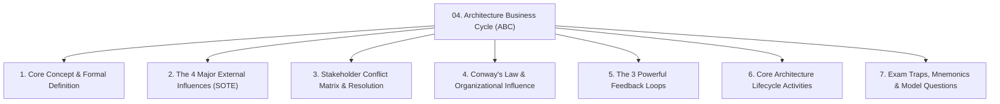
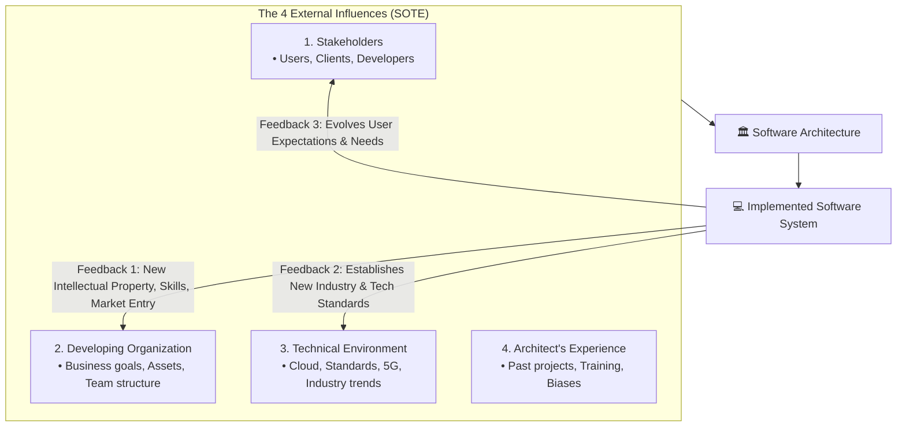
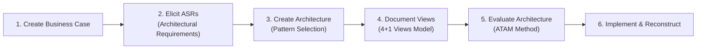

# 🏛️ Module 04: The Architecture Business Cycle (ABC) & Stakeholder Analysis

> [!NOTE]
> **Course Module Reference:** ICT 1032 / ICT 1032 2.0 (Software Architecture & Design) — Lecture 04  
> **Source Lecture PDF:** [`04_Lecture_04_The_Architecture_Business_Cycle.pdf`](../Lecture%20Notes/04_Lecture_04_The_Architecture_Business_Cycle.pdf)  
> **Primary References:** Bass, Clements, & Kazman (*Software Architecture in Practice*, Chapter 1)  
> **Master Index:** [ICT 1032 Master Syllabus Index](./00_ICT_1032_SAD_Syllabus_Master_Index.md)

---

## 🧭 Topic Navigation & Learning Map



---

## 1. What is the Architecture Business Cycle (ABC)?

> [!IMPORTANT]
> **Core Definition (Bass et al.):**  
> "The **Architecture Business Cycle (ABC)** is the continuous, bidirectional feedback relationship where a software system's architecture is shaped by **technical, business, and social influences**, and in turn, the completed system affects those same environments to influence future architectures."



---

## 2. The 4 Major External Influences on Architecture

```
🧠 Mnemonic for the 4 Influences on Architecture:
"S - O - T - E"
S -> Stakeholders (Users, Clients, Developers, Maintainers)
O -> Developing Organization (Business goals, Budget, Conway's Law)
T -> Technical Environment (Current industry tools, Cloud, Standards)
E -> Architect's Experience (Past domain knowledge, Biases, Training)
```

---

### 👥 2.1 Stakeholders (පාර්ශවකරුවන්)
Individuals and organizations with a direct interest in the system. The fundamental architectural challenge is that **stakeholder concerns are inherently in conflict!**

#### 📊 Stakeholder Conflict Resolution Matrix (Exam Essential)

| Stakeholder Group | Primary Goal / Concern | Typical Conflict With Other Stakeholders | Architect's Balancing Role |
| :--- | :--- | :--- | :--- |
| **End User (පරිශීලකයා)** | Ultra-fast UI, zero downtime, intuitive workflows. | Conflicts with Client's budget and Developer's time. | Implements client-side caching & responsive UI frameworks. |
| **Customer / Client (ගනුදෙනුකරු)** | Lowest possible cost, rapid time-to-market. | Conflicts with Developer's desire for perfect clean code and Security officer's strict requirements. | Uses open-source components & phased releases (MVP). |
| **Developer (සංවර්ධකයා)** | Clean modular code, modern tech stacks, simple APIs. | Conflicts with Client's rush to deploy before refactoring. | Enforces strict architectural layers and CI/CD linting. |
| **Maintainer / DevOps (නඩත්තු ඉංජිනේරු)** | Easy bug fixing, modularity, detailed audit logs. | Conflicts with Developer's desire to write fast ad-hoc code. | Enforces standardized logging, containerization & observability. |
| **Security Officer (ආරක්ෂක නිලධාරී)** | Heavy encryption, 2FA, air-gapped networks. | Conflicts with User's desire for friction-free instant login and high performance. | Implements SSO, JWT tokens, and hardware-accelerated SSL. |

---

### 🏢 2.2 Developing Organization & Conway's Law

The company building the software shapes the architecture through:
1. **Immediate Business Goals:** Need to capture market share in 3 months.
2. **Long-Term Strategic Goals:** Creating a reusable software product line (SPL) for future clients.
3. **Existing Technical Assets & Staff:** If the company employs 40 expert Python developers, the architecture will favor Python/FastAPI.
4. **Conway's Law (1968):**  
   > *"Organizations which design systems are constrained to produce designs which are copies of the communication structures of these organizations."*  
   *(උදා: කණ්ඩායම් 3ක් ස්ථාන 3ක වැඩ කරන්නේ නම්, ඔවුන් නිර්මාණය කරන මෘදුකාංගයද ස්වභාවිකවම 3-Tier/Layered ආකාරයට බෙදී නිර්මාණය වේ).*

---

### 🌐 2.3 Technical Environment (තාක්ෂණික පරිසරය)
* Current state-of-the-art technologies: Cloud Native (AWS/GCP), Kubernetes, Microservices, Event-Driven Kafka, REST/GraphQL.
* Industry Regulations & Standards: GDPR, HIPAA in Healthcare, PCI-DSS in Banking.

### 🧠 2.4 Architect's Experience (ගෘහ නිර්මාණ ශිල්පියාගේ පළපුරුද්ද)
* An architect who successfully built a high-throughput system with **Pipe-and-Filter** in the past will naturally consider it for new streaming projects.

---

## 3. The 3 Powerful Feedback Loops of the ABC

Once a software system is deployed, it exerts **massive reciprocal feedback**:

1. **Feedback to Developing Organization:**
   * Generates new business revenue, intellectual property (IP), and patents.
   * Trains employees in cutting-edge tech (e.g. your team becomes cloud microservices experts).
   * Opens new market niches (e.g. Amazon building an internal infrastructure which became AWS).
2. **Feedback to Technical Environment:**
   * Systems advance the entire software industry by creating open-source tools (e.g. Netflix created Eureka/Hystrix; Google created Kubernetes and Android).
3. **Feedback to Stakeholders:**
   * Users get accustomed to real-time mobile experiences, demanding even more features for future versions.

---

## 4. Core Architecture Lifecycle Activities



* **ATAM (Architecture Tradeoff Analysis Method):** A rigorous SEI method used to evaluate an architecture *before writing code* to identify risks, non-risks, sensitivity points, and trade-off points.

---

## ⚠️ Common Exam Pitfalls & Traps (විභාගයේදී සිසුන්ට නිතරම වරදින තැන්)

* ❌ **Trap 1:** *"The ABC is a one-way street from requirements to architecture."*  
  👉 **Truth:** The ABC is a **bidirectional cycle** with powerful feedback loops shaping the future environment.
* ❌ **Trap 2:** Ignoring the **Developing Organization** in architectural questions.  
  👉 **Truth:** A company's budget, deadlines, staff skills, and Conway's Law dictate the architecture just as much as technical requirements do.

---

## 💡 Sinhala Zero-to-Hero Conceptual Summary (සරල සිංහල පැහැදිලි කිරීම)

* **Architecture Business Cycle (ABC) කියන්නේ මොකක්ද?**  
  මෘදුකාංගයක Architecture එක තීරණය වන්නේ පාර්ශවකරුවන්ගේ (Stakeholders) අවශ්‍යතා, ආයතනයේ මුදල්/පිරිස් බලය (Organization), පවතින තාක්ෂණය (Tech Environment), සහ Architect ගේ පළපුරුද්ද (Experience) මතය (SOTE). පද්ධතිය හදලා අවසන් වූ පසු, එය නැවතත් සමාගමට අලුත් දැනුමක් සහ තාක්ෂණික ලෝකයට නව මෙවලම් ලබාදෙමින් ලෝකය වෙනස් කරයි (Feedback Loop).
* **Conway's Law:** සමාගමේ සේවක කණ්ඩායම් බෙදී වැඩ කරන ආකාරයටම (Team Structure) ඔවුන් හදන මෘදුකාංග පද්ධතියේ කොටස්ද (System Architecture) බෙදී නිර්මාණය වේ.

---

## 🎯 Exam Review & Model Questions (Spot Questions)

### ❓ Question 1 (Past Paper Sept 2025 Q2 Part C(ii) - 5 Marks)
**Explain how the Architecture Business Cycle (ABC) could influence the design of a Smart City Traffic Management System, mentioning two external factors.**
* **Model Marking Breakdown:**
  * Definition of ABC & Bidirectional feedback $\to$ [1 Mark]
  * External Factor 1: Stakeholders (Traffic police & Commuters demand real-time low latency) $\to$ [2 Marks]
  * External Factor 2: Technical Environment (5G IoT edge sensors & Cloud streaming) $\to$ [2 Marks]
