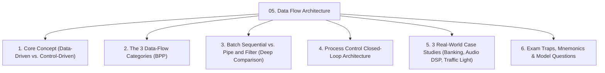
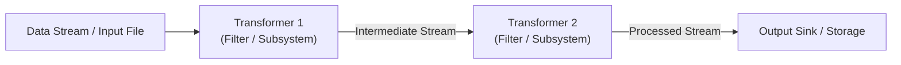
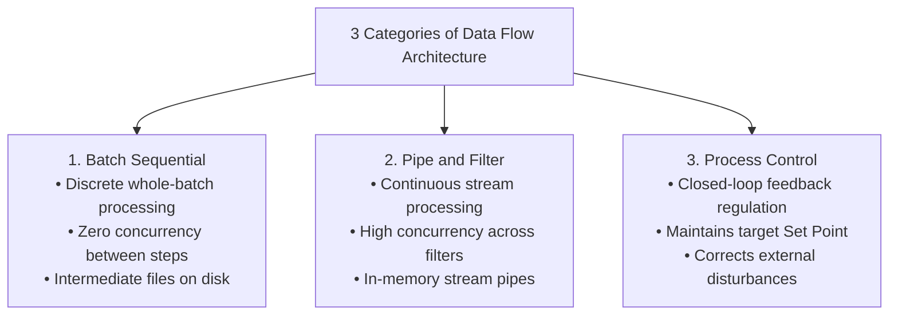
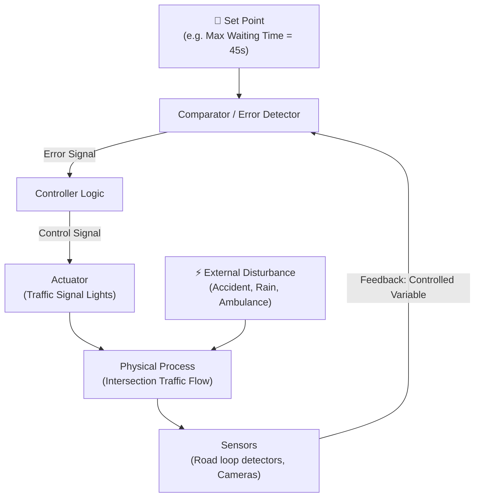
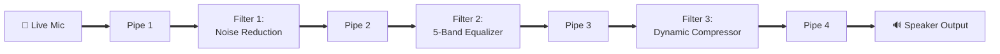

# 🏛️ Module 05: Data Flow Architecture Styles & Case Studies

> [!NOTE]
> **Course Module Reference:** ICT 1032 / ICT 1032 2.0 (Software Architecture & Design) — Lecture 05  
> **Source Lecture PDF:** [`05_Lecture_05_Data_Flow_Architecture.pdf`](../Lecture%20Notes/05_Lecture_05_Data_Flow_Architecture.pdf)  
> **In-Class Work Reference:** [`11_In_Class_Work_02_Data_Flow_Case_Studies.pdf`](../Lecture%20Notes/11_In_Class_Work_02_Data_Flow_Case_Studies.pdf)  
> **Primary References:** Garlan & Shaw (*Software Architecture: Perspectives on an Emerging Discipline*)  
> **Master Index:** [ICT 1032 Master Syllabus Index](./00_ICT_1032_SAD_Syllabus_Master_Index.md)

---

## 🧭 Topic Navigation & Learning Map



---

## 1. Core Concept: Data-Driven vs. Control-Driven Computation

In traditional systems, computation is **Control-Driven** (explicit loops, if-else statements, call hierarchies dictate execution). In a **Data-Flow Architecture**, computation is strictly **Data-Driven**: the arrival and availability of data at a component's input port triggers its execution.



---

## 2. The 3 Categories of Data Flow Architectures

```
🧠 Mnemonic for 3 Data Flow Categories:
"B - P - P"
B -> Batch Sequential (Discrete whole batches, high latency, offline)
P -> Pipe and Filter (Continuous streams, high concurrency, real-time)
P -> Process Control (Closed-loop feedback, set point regulation)
```



---

## 3. Deep Comparative Analysis: Batch Sequential vs. Pipe and Filter

A guaranteed university examination question (e.g. September 2025 Paper Q3 Part A(i) & B(i)).

| Comparative Feature | Batch Sequential (කාණ්ඩ අනුක්‍රමික) | Pipe and Filter (නළ සහ පෙරහන්) |
| :--- | :--- | :--- |
| **Data Unit Processed** | **Entire Discrete Batch** (Massive files, tables). | **Continuous Stream** (Bytes, packets, audio samples). |
| **Concurrency / Parallelism** | **Zero Concurrency** (Subsystem $N$ must wait until Subsystem $N-1$ finishes the entire batch). | **High Concurrency** (All filters execute simultaneously on sequential data chunks). |
| **Intermediate Storage** | Written to **persistent storage** (Disk files, tape). | Transferred via **in-memory buffers / pipes**. |
| **Latency** | **Very High** (Wait hours for full batch to process). | **Low** (First output produced within milliseconds). |
| **Component Nature** | Separate, independent executable programs. | Independent, stateless stream transformation filters. |
| **Best Used For** | Nightly payroll, monthly tax billing, bulk report generation. | Audio/Video DSP pipelines, Unix shell pipelines, Compilers. |

---

## 4. Process Control Architecture (Closed Loop)

Regulates a physical or computational process to maintain a target variable at a desired **Set Point** despite external **Disturbances**.



### 📋 5 Core Elements of Process Control:
1. **Input Variables:** Raw signals entering the system (e.g. vehicle sensor pulses, pedestrian crossing buttons).
2. **Controlled Variable:** The actual output property being regulated (e.g. vehicle queue length, waiting delay).
3. **Manipulated Variable:** The parameter adjusted by the controller (e.g. green light duration in seconds).
4. **Set Point:** The target desired value (e.g. average wait time $< 45$ seconds).
5. **Disturbance:** Uncontrolled environmental factors (e.g. sudden thunderstorm, traffic accident).

---

## 5. In-Class Work 02 Case Studies Deep-Dive

### 🏦 Case Study 1: Banking Transactions (Batch Sequential)
*A bank processes all daily transactions (withdrawals, deposits, transfers) at night using a batch job.*
* **Subsystems in Order:**
  1. *Validation Subsystem:* Validates account numbers and transaction checksums.
  2. *Sorting Subsystem:* Sorts validated transaction records numerically by account number.
  3. *Master Update Subsystem:* Sequentially applies transactions to update master balances.
  4. *Summary Report Generator:* Produces daily reconciliation and financial audit reports.
* **Why Batch Sequential is Ideal:** Offline processing during off-peak hours handles massive transaction volumes with 100% auditability and complete database rollback safety.
* **Limitation:** Lack of real-time balance updates during daytime banking hours.

---

### 🎙️ Case Study 2: Real-Time Audio Processing (Pipe & Filter)
*An audio application processes live microphone input through Noise Reduction $\to$ Equalizer $\to$ Compressor.*



* **Why Concurrency Improves Performance:** Downstream filters don't wait for the entire song to record! While Filter 1 denoises audio buffer $N+1$, Filter 2 equalizes buffer $N$, and Filter 3 compresses buffer $N-1$ concurrently across multi-core CPUs.
* **Limitation:** High buffering overhead; unsuitable for non-linear interactive editing (e.g. multi-track timeline dragging).

---

### 🚦 Case Study 3: Traffic Light Control System (Process Control)
* **Input Variables:** Induction loop pulses, pedestrian push buttons, timer clock.
* **Controlled Variable:** Vehicle queue length / traffic congestion index at the intersection.
* **Manipulated Variable:** Green light duration and signal phase switching cycles.
* **Set Point:** Target max queue wait time ($45$ seconds).
* **Feedback Mechanism:** Road sensors measure actual traffic queue, and the controller dynamically expands green light duration on congested lanes while shrinking empty lanes.

---

## ⚠️ Common Exam Pitfalls & Traps (විභාගයේදී සිසුන්ට නිතරම වරදින තැන්)

* ❌ **Trap 1:** *"In Batch Sequential, a subsystem can start processing before the previous one finishes."*  
  👉 **Truth:** Strictly **FALSE**. Each stage must finish 100% of the batch before the next stage begins.
* ❌ **Trap 2:** *"In Data Flow, control flow dictates execution order."*  
  👉 **Truth:** Strictly **FALSE**. Execution is **Data-Driven** (triggered by the availability of input data).

---

## 💡 Sinhala Zero-to-Hero Conceptual Summary (සරල සිංහල පැහැදිලි කිරීම)

* **Batch Sequential:** වැඩේ සම්පූර්ණයෙන්ම ඉවර වෙනකන් ඊළඟ කෑල්ල පටන් ගන්නේ නැත (උදා: රෑට එකවර කරන බැංකු ගනුදෙනු).
* **Pipe and Filter:** දත්ත වතුර බටයක් දිගේ ගලා යන්නාක් මෙන්, එන එන දත්ත කෑල්ල එසැණින් Process කර ඊළඟ Filter එකට යවයි (උදා: Audio/Video streaming).
* **Process Control:** නියමිත ඉලක්කයක් (Set Point) පවත්වා ගැනීමට Sensor වලින් මැන Actuator මගින් වෙනස් කිරීම (උදා: Smart Traffic Light, Thermostat).

---

## 🎯 Exam Review & Model Questions (Spot Questions)

### ❓ Question 1 (Past Paper Sept 2025 Q3 Part A(i) - 3 Marks)
**Briefly explain the three categories of Data-Flow Architectures with one example for each.**
* **Model Answer:**
  1. *Batch Sequential:* Discrete batch processing. (e.g. Nightly banking payroll) [1 Mark]
  2. *Pipe and Filter:* Stream processing with concurrency. (e.g. Unix pipe `cat \| grep`, Audio DSP) [1 Mark]
  3. *Process Control:* Closed-loop feedback regulation. (e.g. Traffic light controller) [1 Mark]
