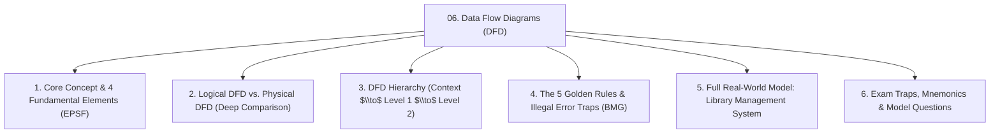
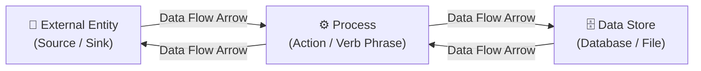
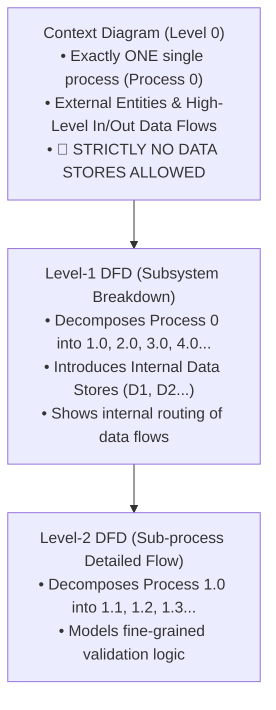
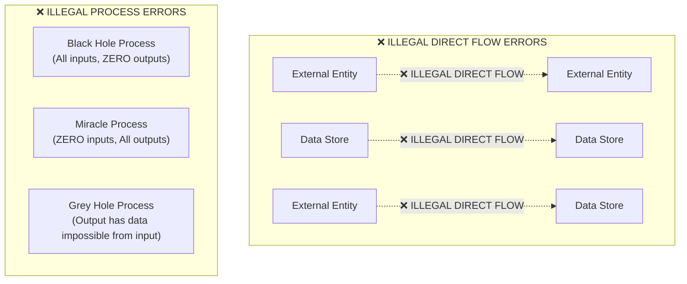
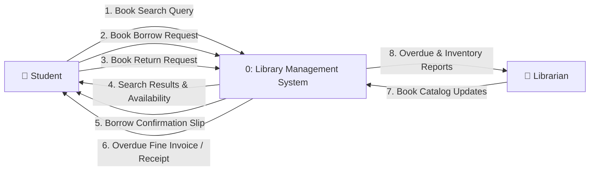
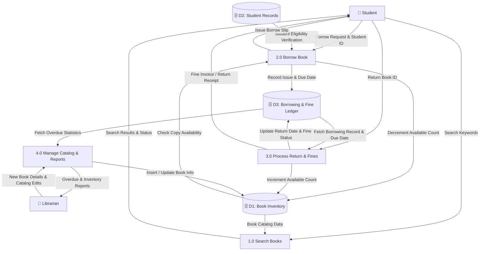

# 🏛️ Module 06: Data Flow Diagrams (DFD) Modeling & Rules

> [!NOTE]
> **Course Module Reference:** ICT 1032 / ICT 1032 2.0 (Software Architecture & Design) — Lecture 06  
> **Source Lecture PDF:** [`06_Lecture_06_Data_Flow_Diagrams_DFD.pdf`](../Lecture%20Notes/06_Lecture_06_Data_Flow_Diagrams_DFD.pdf)  
> **Lecturer:** Dr. W.M.K.S. Ilmini, Department of Computer Science  
> **Master Index:** [ICT 1032 Master Syllabus Index](./00_ICT_1032_SAD_Syllabus_Master_Index.md)

---

## 🧭 Topic Navigation & Learning Map



---

## 1. The 4 Fundamental Elements of a Data Flow Diagram

```
🧠 Mnemonic for the 4 DFD Elements:
"E - P - S - F"
E -> External Entity (Source / Sink of data - Rectangle)
P -> Process (Transforms incoming data to outgoing data - Circle/Rounded Rect)
S -> Data Store (Data repository at rest - Open-ended Rect)
F -> Data Flow (Data pathway in motion - Directed Arrow)
```



### 📋 Elements Specification Table (Past Paper Guaranteed)

| Element | Symbol / Notation | Description | Standard Naming Convention | Valid Real-World Example |
| :--- | :--- | :--- | :--- | :--- |
| **External Entity (බාහිර ඒකකය)** | Rectangle / Square | An external person, organization, or external IT system that feeds data into or receives data from the system boundary. | Singular Noun Phrase | `Student`, `Librarian`, `Payment Gateway` |
| **Process (ක්‍රියාවලිය)** | Rounded Rectangle / Circle | Performs a computational or business transformation on incoming data to produce outgoing data. | **Verb-Noun Phrase** | `1.0 Validate Borrow Request`, `2.0 Calculate Fine` |
| **Data Store (දත්ත ගබඩාව)** | Open-ended Rectangle / Parallel Lines | Represents data at rest (database tables, files, spreadsheets, ledger). | Plural Noun Phrase | `D1: Book Catalog`, `D2: Student Ledger` |
| **Data Flow (දත්ත ප්‍රවාහය)** | Directed Arrow ($\rightarrow$) | Represents data in motion carrying packets of information across system boundaries. | Descriptive Noun Phrase | `Search Query`, `Borrow Confirmation Slip` |

---

## 2. Logical DFD vs. Physical DFD

A major theoretical comparison in university examinations (September 2025 Paper Q3 Part A(ii)).

| Dimension | Logical Data Flow Diagram (තාර්කික DFD) | Physical Data Flow Diagram (භෞතික DFD) |
| :--- | :--- | :--- |
| **Core Objective** | Models **WHAT** business functions the system performs. | Models **HOW** the system is physically implemented in hardware/software. |
| **Technology Dependency** | **100% Technology-Independent** (No mention of programming languages, hardware, or databases). | **Technology-Dependent** (Explicitly specifies MySQL, JSON, React, Barcode scanners). |
| **Process Naming** | Business activities (e.g. `1.0 Verify Account`). | Implementation units (e.g. `1.0 Spring Boot AuthController`, `2.0 Cashier Terminal`). |
| **Data Store Naming** | Business entities (e.g. `Customer Records`). | Concrete storage files (e.g. `PostgreSQL: tbl_users`, `AWS S3 Bucket`, `Filing Cabinet`). |
| **Project Phase** | Requirements Analysis & High-Level Architecture. | Detailed System Design & Implementation. |

---

## 3. DFD Hierarchy & Level Decomposition



---

## 4. The 5 Golden Rules & Illegal Error Traps

```
🧠 Mnemonic for Process Errors:
"B - M - G"
B -> Black Hole (Data enters, NOTHING leaves!)
M -> Miracle / White Hole (Data exits, NOTHING entered!)
G -> Grey Hole (Output contains data not present in inputs!)
```



### 🚫 The 5 Golden Rules of DFDs:
1. **Rule 1 (Process Mediation):** Data cannot move on its own! Every data flow **MUST** connect to at least one Process.
   * *Illegal:* Entity $\to$ Entity (Direct)
   * *Illegal:* Entity $\to$ Store (Direct without a process handling the write)
   * *Illegal:* Store $\to$ Store (Direct without a process transferring data)
2. **Rule 2 (No Black Holes):** A process cannot have only input flows and no output flows.
3. **Rule 3 (No Miracles / White Holes):** A process cannot produce output flows without receiving input flows.
4. **Rule 4 (No Grey Holes):** Output data must be logically derivable from input data.
5. **Rule 5 (Diagram Balancing):** All data flows entering/leaving a process in a parent diagram must match the external flows in its decomposed child diagram.

---

## 5. Complete Model: Library Management System (Past Paper Q3 Part C)

### 🏛️ 5.1 Context Diagram (Level 0)



---

### 🏛️ 5.2 Level-1 Data Flow Diagram (DFD)



---

## ⚠️ Common Exam Pitfalls & Traps (විභාගයේදී සිසුන්ට නිතරම වරදින තැන්)

* ❌ **Trap 1: Drawing Data Stores in the Context Diagram!**  
  👉 **Truth:** Strictly forbidden! A Context Diagram has **EXACTLY ONE Process (0)**, External Entities, and data flows. Data Stores appear **only in Level-1 DFD and below**.
* ❌ **Trap 2: Drawing direct flows from Entity to Database.**  
  👉 **Truth:** Data cannot write itself to a database. An intermediate process (e.g. `1.0 Register Student`) must handle the database write.
* ❌ **Trap 3: Using Noun labels for Processes.**  
  👉 **Truth:** Processes are actions; they must always start with an active verb (e.g., `1.0 Process Payment`, NOT `1.0 Payment`).

---

## 💡 Sinhala Zero-to-Hero Conceptual Summary (සරල සිංහල පැහැදිලි කිරීම)

* **DFD මූලික නීති (Golden Rules):**  
  1. Data එකක් Entity එකකින් තව Entity එකකට හෝ Database එකකට කෙලින්ම යන්න බෑ. මැදින් Process එකක් තියෙන්නම ඕන.
  2. **Black Hole:** Process එකකට දත්ත එනවා විතරයි, එළියට මුකුත් යන්නේ නැහැ (වැරදියි).
  3. **Miracle:** Process එකට මුකුත් එන්නේ නැතුව එළියට දත්ත මැවෙනවා (වැරදියි).
  4. **Context Diagram:** මුළු පද්ධතියම තනි බෝලයකින් (Process 0) පෙන්වන අතර මෙහි කිසි විටෙකත් Data Stores අඳින්නේ නැත.

---

## 🎯 Exam Review & Model Questions (Spot Questions)

### ❓ Question 1 (Past Paper Sept 2025 Q3 Part C - 10 Marks)
**Draw a Context Diagram and a Level-0/1 Data Flow Diagram for a Library Management System automating search, borrowing, inventory updates, student records, and overdue fines.**
* **Model Marking Breakdown:**
  * Context Diagram (Entities, Process 0, Input/Output flows, No stores) $\to$ [4 Marks]
  * Level-1 DFD (Processes 1.0 - 4.0, Data Stores D1-D3, Balanced flows) $\to$ [6 Marks]
