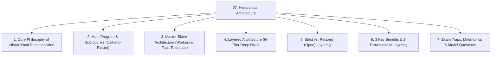
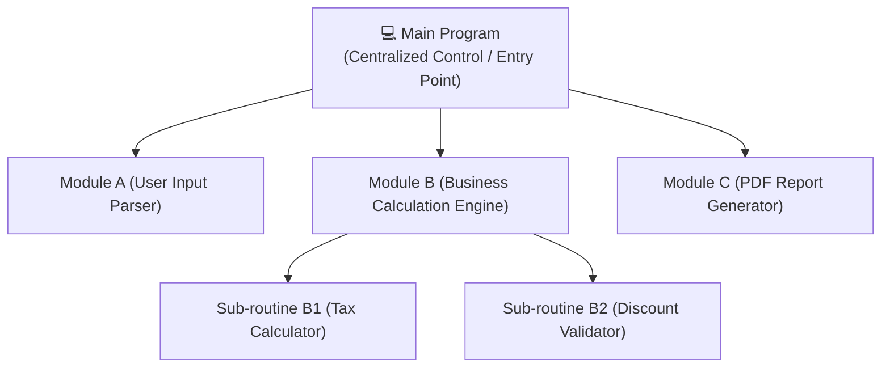
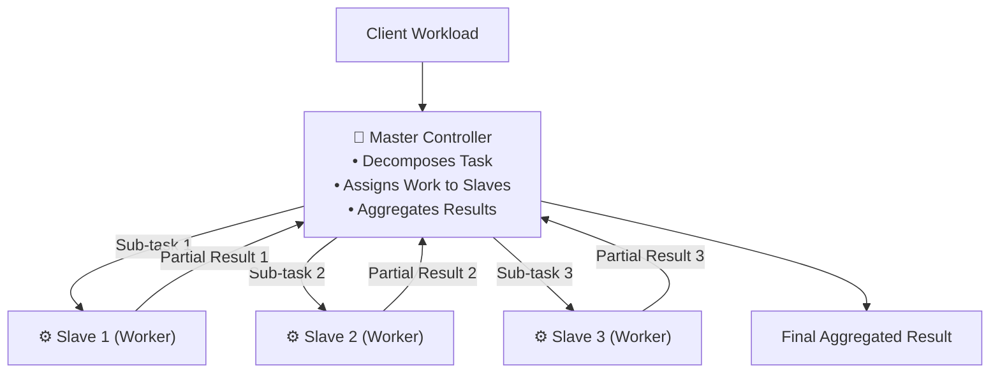
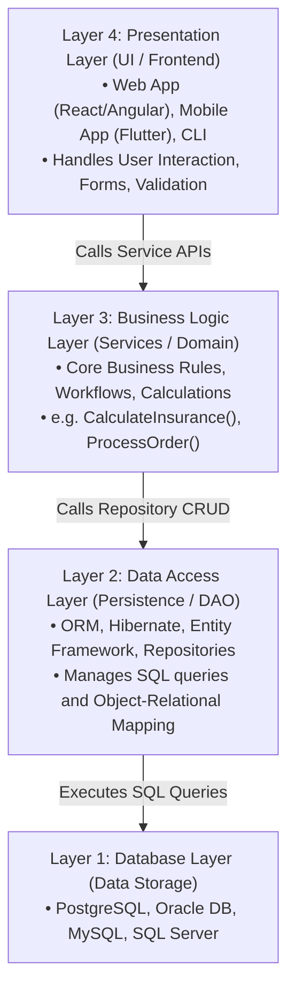
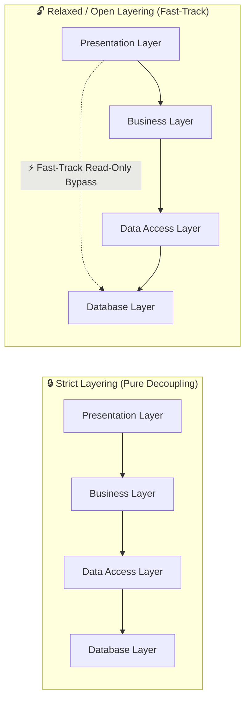

# 🏛️ Module 07: Hierarchical Architecture (Layered & Master-Slave)

> [!NOTE]
> **Course Module Reference:** ICT 1032 / ICT 1032 2.0 (Software Architecture & Design) — Lecture 07  
> **Source Lecture PDF:** [`07_Lecture_07_Hierarchical_Software_Architecture.pdf`](../Lecture%20Notes/07_Lecture_07_Hierarchical_Software_Architecture.pdf)  
> **Primary References:** Buschmann et al. (*Pattern-Oriented Software Architecture*); Garlan & Shaw  
> **Master Index:** [ICT 1032 Master Syllabus Index](./00_ICT_1032_SAD_Syllabus_Master_Index.md)

---

## 🧭 Topic Navigation & Learning Map



---

## 1. Overview of Hierarchical Architecture

Hierarchical software architecture decomposes a complex software system into ranked logical levels or sub-systems. High-level modules manage abstract business decisions and delegate low-level technical execution (e.g. SQL, hardware drivers, network sockets) to lower layers.

```
🧠 Mnemonic for Hierarchical Styles:
"M - M - L"
M -> Main Program & Subroutines (Classical Call-and-Return)
M -> Master-Slave (Centralized Coordinator with Distributed Workers)
L -> Layered (N-Tier Horizontal Separation of Concerns)
```

---

## 2. Main Program and Subroutines (Call-and-Return Style)

The classical top-down procedural hierarchy (e.g. C, Pascal, Fortran).



* **Control Mechanism:** Synchronous, single-threaded function/method calls.
* **Advantages:** Extremely simple mental model, linear execution tracing.
* **Limitations:** Tight coupling, vulnerability to global shared variables, unable to scale across distributed multi-core servers.

---

## 3. Master-Slave Architecture

A distributed hierarchical pattern where a **Master** component divides work, assigns sub-tasks to independent **Slave** workers, and aggregates results.



### 🎯 3 Major Use Cases of Master-Slave:
1. **Parallel & High-Performance Computing:** Matrix multiplication, 3D video rendering farms, big data MapReduce (Master partitions dataset into chunks for slaves).
2. **Safety-Critical Fault Tolerance (Avionics & Space):** Triple Modular Redundancy (TMR). The Master gives identical computations to 3 independent slave processors and uses a majority voting algorithm to filter out hardware faults.
3. **Database Primary-Secondary Replication:** Single Master database handles all write transactions ($O_w$) and replicates asynchronously to multiple Read Slaves ($O_r$) to handle massive read traffic.

---

## 4. Layered Architecture (N-Tier Architecture)

The dominant architectural style for modern enterprise web and mobile applications.



---

### ⚖️ 4.1 Strict Layering vs. Relaxed (Open) Layering



* **Strict Layering (තදින් ස්ථරීකරණය):** Layer $N$ can **ONLY** call services in Layer $N-1$.
  * *Advantage:* Maximum decoupling and isolation. Replacing the database does not require touching the UI layer.
  * *Disadvantage:* Performance overhead (pass-through calls add latency).
* **Relaxed / Open Layering (ලිහිල් ස්ථරීකරණය):** Layer $N$ can bypass intermediate layers to access Layer $N-2$ or Layer $N-3$.
  * *Advantage:* Higher execution speed for simple read-only queries.
  * *Disadvantage:* Tight coupling; leaks database schema details directly into the UI.

---

## 5. Benefits and Trade-offs of Layered Architecture

### 🌟 3 Key Benefits (Past Paper Sept 2025 Q2 Part A(iii)):
1. **Separation of Concerns & Modifiability:** Each layer has a well-defined single responsibility. Migrating the frontend from Angular to React requires zero changes to the Business or Database layers.
2. **Component Reusability:** The central Business Logic Layer can be reused simultaneously across Web, iOS, Android, and 3rd-party REST API clients.
3. **Enhanced Testability:** Layers can be tested in isolation using **Mock Objects** or stubbed repositories without needing an active database connection.

### ⚠️ 2 Key Limitations / Drawbacks:
1. **Performance Sinkhole Overhead:** User requests must traverse multiple layers, serializing and deserializing data at every layer boundary.
2. **Cascading Changes:** Adding a single new data column (e.g. `National ID`) may force modifications across all 4 layers (UI $\to$ DTO $\to$ Service $\to$ DAO $\to$ Database Schema).

---

## ⚠️ Common Exam Pitfalls & Traps (විභාගයේදී සිසුන්ට නිතරම වරදින තැන්)

* ❌ **Trap 1:** Believing that Layered Architecture allows any layer to call any other layer randomly.  
  👉 **Truth:** In strict layering, calls must strictly flow downwards ($N \to N-1$).
* ❌ **Trap 2:** Confusing **Master-Slave** with **Client-Server**.  
  👉 **Truth:** In Client-Server, clients initiate requests to access shared services. In Master-Slave, the Master actively divides and assigns tasks to slave workers.

---

## 💡 Sinhala Zero-to-Hero Conceptual Summary (සරල සිංහල පැහැදිලි කිරීම)

* **Layered Architecture කියන්නේ මොකක්ද?**  
  මෘදුකාංග පද්ධතියක් තට්ටු (Layers) වලට වෙන් කිරීමයි:
  1. **Presentation Layer:** පාරිභෝගිකයාට පෙනෙන Screen එක (UI).
  2. **Business Logic Layer:** පද්ධතියේ නීති සහ ගණනය කිරීම් (Rules).
  3. **Data Access Layer:** Database එකට දත්ත දාන/ගන්නා කෝඩ් එක (DAO/ORM).
  4. **Database Layer:** සැබෑ දත්ත ගබඩාව (SQL/Oracle).
* **Master-Slave:** එක් ප්‍රධානියෙක් (Master) විසින් වැඩ කෑලි වලට කඩා සේවකයන්ට (Slaves) බෙදා දී වැඩ අවසන් වූ පසු එකතු කිරීම (උදා: Parallel computing, Database replication, ගුවන් යානා පාලන පද්ධති).

---

## 🎯 Exam Review & Model Questions (Spot Questions)

### ❓ Question 1 (Past Paper Sept 2025 Q2 Part A(iii) - 3 Marks)
**Briefly describe the Layered Architecture style and explain three benefits of organizing a system into layers.**
* **Model Marking Breakdown:**
  * Definition of Layered Architecture $\to$ [1 Mark]
  * Benefit 1: Separation of Concerns / Modifiability $\to$ [1 Mark]
  * Benefit 2: Reusability across frontends $\to$ [0.5 Mark]
  * Benefit 3: Enhanced Testability via Mocking $\to$ [0.5 Mark]
