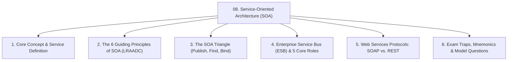
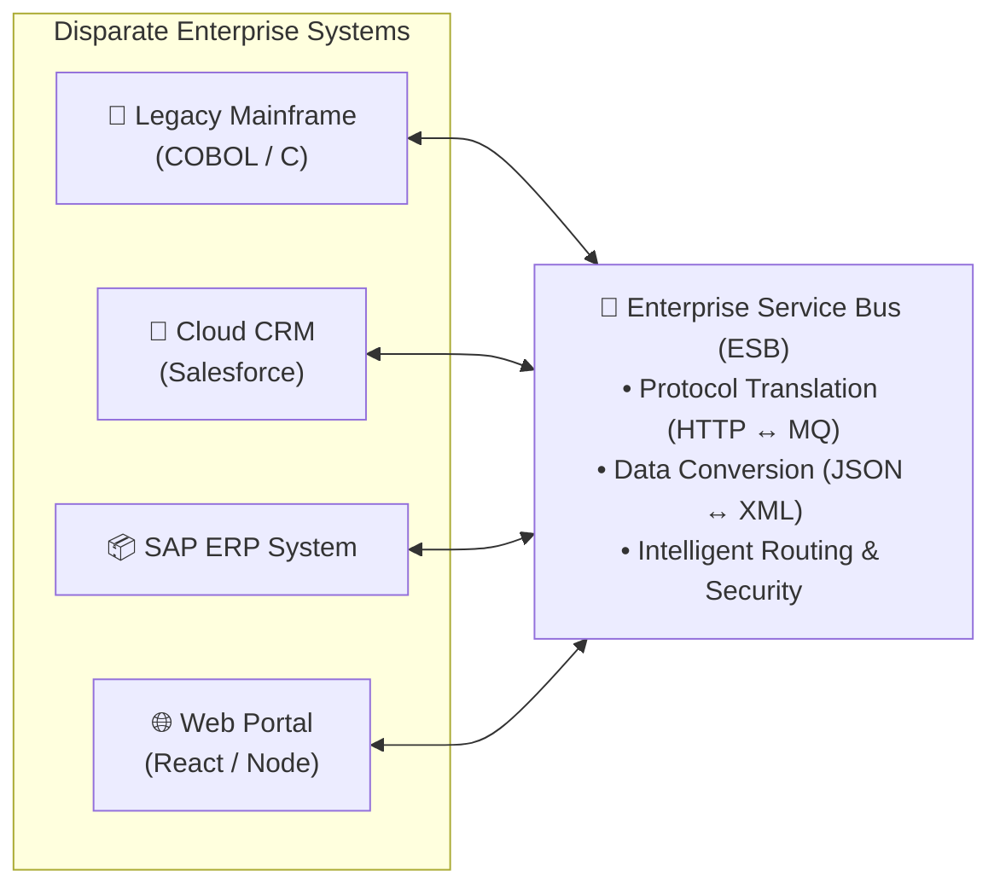
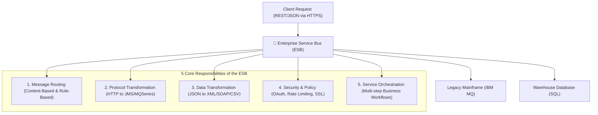

# 🏛️ Module 08: Service-Oriented Architecture (SOA) & ESB

> [!NOTE]
> **Course Module Reference:** ICT 1032 / ICT 1032 2.0 (Software Architecture & Design) — Lecture 08  
> **Source Lecture PDF:** [`08_Lecture_08_Service_Oriented_Architecture_SOA.pdf`](../Lecture%20Notes/08_Lecture_08_Service_Oriented_Architecture_SOA.pdf)  
> **Primary References:** Thomas Erl (*Service-Oriented Architecture: Concepts, Technology, and Design*); OASIS Standard  
> **Master Index:** [ICT 1032 Master Syllabus Index](./00_ICT_1032_SAD_Syllabus_Master_Index.md)

---

## 🧭 Topic Navigation & Learning Map



---

## 🎨 Visual Concept: Enterprise Service Bus in SOA


---

## 1. What is Service-Oriented Architecture (SOA)?

> [!IMPORTANT]
> **Core Definition:**  
> **Service-Oriented Architecture (SOA)** is an enterprise architectural style where application components provide services to other components over a network, promoting **loose coupling**, **enterprise interoperability**, and **service reusability** across heterogeneous systems.

### 🧩 What is a Service?
A service is an autonomous, self-contained software unit representing a discrete business function (e.g. `CheckCreditRating`, `ProcessPayment`, `BookFlightTicket`).



---

## 2. The 6 Core Principles of SOA

```
🧠 Mnemonic for the 6 SOA Principles:
"L - R - A - A - D - C"
L -> Loose Coupling (Minimal dependencies between services)
R -> Reusability (Reused across diverse business applications)
A -> Autonomy (Full control over internal logic and execution)
A -> Abstraction (Hides implementation; exposes only public contract)
D -> Discoverability (Searchable via metadata in registry)
C -> Contract-Based (Strict standardized contracts - WSDL, OpenAPI)
```

1. **Loose Coupling (ලිහිල්ව බැඳීම):** Services interact through abstract contracts, minimizing direct dependencies so changes in one service don't break consumers.
2. **Service Reusability (නැවත භාවිතය):** Services are engineered as general-purpose enterprise assets (e.g. `ValidateCustomer` used by web, mobile, and branch systems).
3. **Service Autonomy (ස්වාධීනත්වය):** Services control their own execution environment and internal data state.
4. **Service Abstraction (වියුක්තතාවය):** The internal code (Java, C#, Python) and database schema remain completely hidden from callers.
5. **Service Discoverability (සොයා ගැනීමේ හැකියාව):** Services publish metadata to service catalogs (UDDI, Service Registry) for automated discovery.
6. **Standardized Service Contract (සම්මත ගිවිසුම):** Formal contract definitions governing messages, parameters, and error schemas.

---

## 3. The SOA Triangle: Publish, Find, and Bind

The runtime operational lifecycle of SOA:

```mermaid
graph TD
    Broker["🏢 Service Registry / Broker<br>(e.g. UDDI / API Catalog)"]
    Provider["🛠️ Service Provider<br>(e.g. Airline Booking Service)"]
    Consumer["📱 Service Consumer<br>(e.g. Travel Booking Portal)"]

    Provider -->|1. Publish (WSDL Contract & Endpoint)| Broker
    Consumer -->|2. Find (Search for 'Flight Booking' Service)| Broker
    Consumer -->|3. Bind & Execute (SOAP / REST Request)| Provider
    Provider -->|4. Response Data (XML / JSON)| Consumer
```

1. **Publish:** The Service Provider registers its capabilities and interface contract (WSDL) with the Service Registry.
2. **Find:** The Service Consumer queries the Service Registry to locate a service meeting its requirements.
3. **Bind:** The Service Consumer directly invokes the Service Provider's endpoint using standard communication protocols.

---

## 4. The Enterprise Service Bus (ESB): 5 Core Roles

A guaranteed university examination question (e.g. September 2025 Paper Q4 Part A(i)).



### 📋 Detailed Explanation of the 5 ESB Roles:
1. **Message Routing (පණිවිඩ යොමු කිරීම):** Dynamically routes messages based on payload content, headers, or recipient server load without hardcoded endpoints.
2. **Protocol Transformation (ප්‍රොටෝකෝල පරිවර්තනය):** Bridges incompatible communication protocols on the fly (e.g. converting an incoming HTTP/REST call into a legacy IBM MQ or JMS message).
3. **Data Transformation (දත්ත පරිවර්තනය):** Converts incompatible data formats (e.g. transforming modern JSON payloads into complex legacy XML, SOAP, or EDI formats).
4. **Security & Policy Enforcement (ආරක්ෂාව සහ ප්‍රතිපත්ති):** Centralizes authentication, authorization, SSL encryption, rate limiting, and audit logging across all backend services.
5. **Service Orchestration (සේවා සම්බන්ධීකරණය):** Combines multiple fine-grained backend services into a single composite transaction (e.g. `CheckoutWorkflow` calling inventory, payment, and courier services in order).

---

## 5. Web Service Standards: SOAP vs. REST

| Dimension | SOAP (Simple Object Access Protocol) | REST (Representational State Transfer) |
| :--- | :--- | :--- |
| **Type** | Formal, rigid W3C standard protocol. | Lightweight, flexible architectural style. |
| **Data Format** | **Strictly XML only**. | **JSON (dominant)**, XML, Plain Text, HTML. |
| **Contract Definition** | **Mandatory WSDL** interface contract. | Optional schema (OpenAPI / Swagger). |
| **Transport Protocols** | Protocol-independent (HTTP, SMTP, JMS, TCP). | Exclusively uses **HTTP/HTTPS** methods. |
| **Overhead & Speed** | Heavy XML envelope; higher network latency. | Lightweight, minimal payload; ultra-fast parsing. |
| **Ideal Use Cases** | Enterprise banking, ACID financial transactions. | Mobile apps, public web APIs, cloud microservices. |

---

## ⚠️ Common Exam Pitfalls & Traps (විභාගයේදී සිසුන්ට නිතරම වරදින තැන්)

* ❌ **Trap 1:** *"In SOA, services are tightly coupled."*  
  👉 **Truth:** Strictly **FALSE**. The fundamental principle of SOA is **Loose Coupling** to guarantee reusability.
* ❌ **Trap 2:** Believing the ESB is only a simple message router.  
  👉 **Truth:** The ESB also performs **protocol transformation**, **data format transformation**, **security enforcement**, and **orchestration**.

---

## 💡 Sinhala Zero-to-Hero Conceptual Summary (සරල සිංහල පැහැදිලි කිරීම)

* **SOA කියන්නේ මොකක්ද?**  
  ආයතනයක තියෙන විවිධ පද්ධති (උදා: බැංකුවක පරණ Mainframe එක, අලුත් Web App එක, SAP ERP එක) එකිනෙක සම්බන්ධ කර ගැනීමට පුළුවන් පොදු සේවාවන් (Services) ලෙස සකස් කර ගැනීමයි.
* **Enterprise Service Bus (ESB):**  
  විවිධ භාෂා කතා කරන පද්ධති අතර "පරිවර්තකයෙක් සහ පාලකයෙක්" (Translator & Central Router) ලෙස ක්‍රියා කරයි. Web App එකෙන් එන JSON දත්ත පරණ Mainframe එකට තේරෙන XML වලට හරවා යවන්නේ ESB එකෙනි.

---

## 🎯 Exam Review & Model Questions (Spot Questions)

### ❓ Question 1 (Past Paper Sept 2025 Q4 Part A(i) - 3 Marks)
**Briefly explain the role of the Enterprise Service Bus (ESB) in Service-Oriented Architecture (SOA).**
* **Model Marking Breakdown:**
  * Protocol Transformation $\to$ [1 Mark]
  * Data/Message Transformation (JSON $\leftrightarrow$ XML) $\to$ [1 Mark]
  * Intelligent Message Routing & Security $\to$ [1 Mark]
