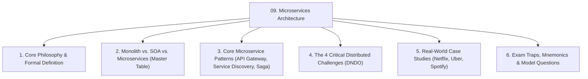
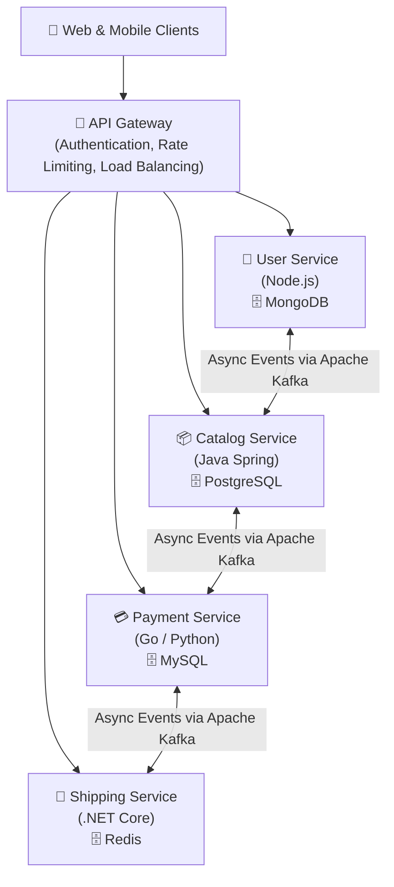
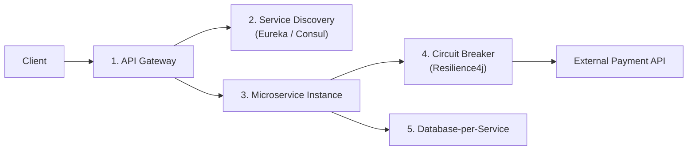
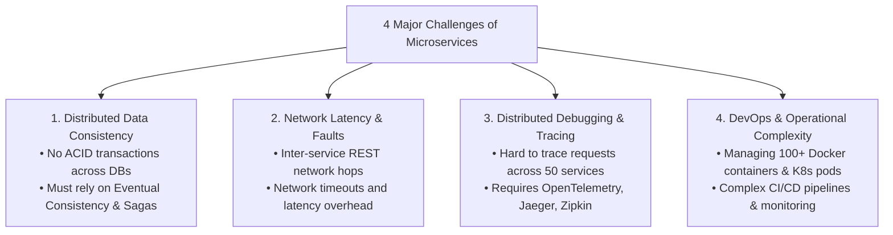

# 🏛️ Module 09: Microservices Architecture Design & Patterns

> [!NOTE]
> **Course Module Reference:** ICT 1032 / ICT 1032 2.0 (Software Architecture & Design) — Lecture 09  
> **Source Lecture PDF:** [`09_Lecture_09_Microservices_Architecture.pdf`](../Lecture%20Notes/09_Lecture_09_Microservices_Architecture.pdf)  
> **Primary References:** Martin Fowler & James Lewis; Sam Newman (*Building Microservices*, 2nd Edition)  
> **Master Index:** [ICT 1032 Master Syllabus Index](./00_ICT_1032_SAD_Syllabus_Master_Index.md)

---

## 🧭 Topic Navigation & Learning Map



---

## 🎨 Visual Concept: Monolithic vs. Microservices Architecture


---

## 1. What is Microservices Architecture?

> [!IMPORTANT]
> **Core Definition (Martin Fowler):**  
> **Microservices Architecture** is an architectural approach where a complex application is structured as a collection of **small, autonomous, independently deployable services**, each running in its own process, communicating with lightweight protocols (REST, gRPC, Event Streams), and designed around specific **business domains**.



---

## 2. Monolith vs. SOA vs. Microservices (Master Comparison Table)

A guaranteed university examination question (e.g. September 2025 Paper Q4 Part B & Part C).

| Architectural Feature | Monolithic Architecture | Service-Oriented Architecture (SOA) | Microservices Architecture |
| :--- | :--- | :--- | :--- |
| **Component Granularity** | **Single Massive Codebase** (All features compiled into one binary/WAR). | **Coarse-Grained Services** (Enterprise-wide reusable services). | **Fine-Grained Services** (Focused on a single business capability). |
| **Database Architecture** | **Single Shared Database** (All tables in one schema). | Often shared enterprise databases across services. | **Database-per-Service** (Strictly private; no cross-DB queries allowed). |
| **Communication Mechanism** | In-memory function calls and shared memory. | Centralized **Enterprise Service Bus (ESB)** using SOAP/WSDL. | **Smart Endpoints & Dumb Pipes** (Lightweight REST, gRPC, Kafka). |
| **Deployment Independence** | **Zero** (Must redeploy the entire application for a 1-line bug fix). | Moderate (Services deployable, but often bound to central ESB). | **100% Independent** (Each microservice has its own CI/CD pipeline). |
| **Technology Stack (Polyglot)** | **Monolithic Stack** (Entire system forced into Java, C#, or PHP). | Polyglot backend, but constrained by enterprise ESB standards. | **100% Polyglot** (Service A uses Node.js, Service B uses Go, Service C uses Python). |
| **Scalability Model** | Scale entire monolith horizontally (Expensive & wasteful). | Scale individual enterprise servers. | **Selective Elastic Scaling** (Scale only high-traffic payment containers). |
| **Failure Isolation** | **Poor** (A memory leak in one feature crashes the entire application). | Moderate (ESB failure impacts all enterprise services). | **High** (If shipping service fails, catalog and checkout still work). |

---

## 3. Core Architectural Patterns in Microservices



1. **API Gateway Pattern:** The single entry point for all external client traffic. Handles SSL termination, authentication/JWT verification, request routing, caching, and rate limiting.
2. **Service Discovery & Registry Pattern:** Containerized microservices dynamically spin up/down with changing IP addresses in Kubernetes. A Service Registry (e.g. Netflix Eureka, Consul) automatically tracks live service endpoints.
3. **Database-per-Service Pattern:** Every microservice owns its private persistent database. No other service can query the database directly; all interactions must happen via public APIs.
4. **Circuit Breaker Pattern:** Prevents cascading system failures. If a downstream payment gateway fails, the circuit "trips open", returning a fallback response immediately instead of consuming all server threads.
5. **Saga Pattern (Distributed Transactions):** Manages data consistency across multiple databases using a sequence of local transactions and compensating (rollback/undo) transactions if a step fails.

---

## 4. The 4 Critical Challenges of Microservices Architecture

Exam favorite (September 2025 Paper Q4 Part A(ii)):

```
🧠 Mnemonic for Microservices Challenges:
"D - N - D - O"
D -> Distributed Data Consistency (No ACID transactions across DBs; Saga needed)
N -> Network Latency & Faults (Inter-service network hops add latency)
D -> Distributed Debugging & Tracing (Hard to trace requests across 50 services)
O -> Operational & DevOps Complexity (Managing 100s of Docker containers & K8s pods)
```



1. **Distributed Data Consistency (ව්‍යාප්ත දත්ත අනුකූලතාවය):** Since each microservice has its own private database, you cannot execute single-database ACID transactions (`BEGIN ... COMMIT`). Architects must design for **Eventual Consistency** using event streams.
2. **Network Latency & Faults (ජාල ප්‍රමාදය සහ දෝෂ):** In a monolith, method calls take nanoseconds in memory. In microservices, every inter-service call goes over TCP/IP networks, introducing latency and connection drops.
3. **Distributed Debugging & Tracing (දෝෂ සෙවීමේ සංකීර්ණතාව):** When a user transaction fails, tracking which service failed out of 50 microservices requires specialized distributed tracing tools (Jaeger, Zipkin, OpenTelemetry).
4. **DevOps & Operational Complexity (මෙහෙයුම් සංකීර්ණතාව):** Managing hundreds of Docker containers, Kubernetes clusters, service meshes, and CI/CD pipelines requires high engineering overhead.

---

## ⚠️ Common Exam Pitfalls & Traps (විභාගයේදී සිසුන්ට නිතරම වරදින තැන්)

* ❌ **Trap 1:** *"Microservices architecture always guarantees simpler debugging."*  
  👉 **Truth:** Strictly **FALSE**. Debugging microservices is substantially **more complex** than monoliths due to distributed network calls, asynchronous queues, and distributed databases.
* ❌ **Trap 2:** *"All microservices should share one single MySQL database to make joins easy."*  
  👉 **Truth:** Strictly forbidden! Sharing a single database creates tight data coupling, turning the system into a **Distributed Monolith** (the worst of both worlds). Each service must have its own private database.

---

## 💡 Sinhala Zero-to-Hero Conceptual Summary (සරල සිංහල පැහැදිලි කිරීම)

* **Microservices Architecture කියන්නේ මොකක්ද?**  
  විශාල මෘදුකාංග පද්ධතියක් එකට අලවා හදන්නේ නැතුව (Monolith), ස්වාධීනව ක්‍රියාත්මක වන කුඩා කුඩා සේවාවන් වලට (උදා: Login Service, Cart Service, Payment Service) කඩා හදන ක්‍රමයයි.
* **ප්‍රධාන වාසි:**  
  1. Payment Service එක විතරක් කාර්යබහුල නම්, ඒ සර්විස් එක විතරක් Servers 10කට වැඩි කර Scalability ලබාගත හැක.
  2. එක සර්විස් එකක් Crash වුණත් මුළු App එකම එකවර බිඳ වැටෙන්නේ නැත (Fault Isolation).
* **ප්‍රධාන අභියෝග 4 (DNDO):**  
  1. **Distributed Data:** හැම සර්විස් එකකටම වෙනම Database තියෙන නිසා දත්ත එකඟතාවය (Data Consistency) පවත්වා ගැනීම අමාරුය.
  2. **Network Latency:** Services අතර Network හරහා කතා කරන විට ප්‍රමාද වීම් ඇතිවීම.
  3. **Distributed Debugging:** කෝඩ් එකේ දෝෂයක් ආ විට සර්විස් 50ක් අතරින් වැරැද්ද කොතැනදැයි සොයා ගැනීම අපහසු වීම.
  4. **DevOps Complexity:** Docker, Kubernetes සහ CI/CD කළමනාකරණය සංකීර්ණ වීම.

---

## 🎯 Exam Review & Model Questions (Spot Questions)

### ❓ Question 1 (Past Paper Sept 2025 Q4 Part A(ii) - 3 Marks)
**List any three challenges of Microservices Architecture.**
* **Model Marking Breakdown:**
  * Distributed Data Consistency / Lack of ACID $\to$ [1 Mark]
  * Network Latency & Inter-service Communication Overhead $\to$ [1 Mark]
  * Distributed Debugging, Tracing & Monitoring Complexity $\to$ [1 Mark]
