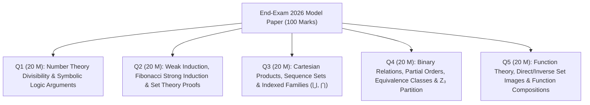

# 🏛️ PMT 1013 Foundations of Mathematics — End-Exam 2026 Model Paper Master Discussion

> [!NOTE]
> **Course:** PMT 1013 / MAT 111 (Foundations of Mathematics) — 1st Year 1st Semester  
> **Source Document:** [`End-Exam 2026 Model Paper.pdf`](PMAT/1013/Papers/End-Exam%202026%20Model%20Paper.pdf)  
> **Time Allowed:** 03 Hours | **Total Questions:** 05 (Answer All 05 Questions) | **Total Marks:** 100 Marks (20 Marks each)  
> **Course Index:** [PMT 1013 Master Syllabus Index](PMAT/1013/Short%20Notes/00_PMT_1013_Foundations_of_Mathematics_Master_Index.md)

---

## 🧭 Paper Navigation & Question Breakdown

---

# 📝 Question 01 [20 Marks] — Divisibility & Formal Symbolic Logic

> 🔗 **අදාළ පාඩම් සහ ලෙච්චර් සටහන්:**
> * 📘 [Module 03: Proof Techniques & Number Theory Foundations](PMAT/1013/Short%20Notes/03_Proof_Techniques_and_Number_Theory_Foundations.md)
> * 📘 [Module 02: Predicates, Quantifiers & Rules of Inference](PMAT/1013/Short%20Notes/02_Predicates_Quantifiers_and_Rules_of_Inference.md)
> * 📑 Lecture Slides: [`01_D01_Logic_and_Statements.pdf`](PMAT/1013/Lecture%20Notes/01_D01_Logic_and_Statements.pdf) | [`01_D02_Proof_Techniques_Intro.pdf`](PMAT/1013/Lecture%20Notes/01_D02_Proof_Techniques_Intro.pdf) | [`03_D06_Number_Theory_Divisibility_Proofs.pdf`](PMAT/1013/Lecture%20Notes/03_D06_Number_Theory_Divisibility_Proofs.pdf) | [`02_D05_Rules_of_Inference_and_Arguments.pdf`](PMAT/1013/Lecture%20Notes/02_D05_Rules_of_Inference_and_Arguments.pdf)

---

### ❓ Question 01 (a) [12 Marks - 4 Marks each]
**$\mathbb{Z}$ denotes the set of all integers. Prove the following statements:**
1. (i) For all integers $a, b, c \in \mathbb{Z}$, if $a \mid b$ and $a \mid c$, then $a \mid (b + c)$.
2. (ii) For all integers $a, b, c \in \mathbb{Z}$, if $a \mid b$ and $a \nmid c$, then $a \nmid (b + c)$.
3. (iii) For all integers $a, b \in \mathbb{Z}$, if $a \nmid -b$, then $a \nmid b$.

---

#### 💡 Strategy & Proof Breakdown in Sinhala
* **(i) සඳහා Direct Proof:** $a \mid b \implies b = ak_1$ සහ $a \mid c \implies c = ak_2$ යැයි උපකල්පනය කර $b+c = a(k_1+k_2)$ ලෙස $a$ පිටතට පොදුවේ ගෙන ඔප්පු කරයි.
* **(ii) සඳහා Contradiction:** ප්‍රතිඵලය අසත්‍ය යැයි උපකල්පනය කර ($a \mid (b+c)$), $c = (b+c) - b = a(k_2-k_1)$ මගින් $a \mid c$ බව ලැබී මුල් උපකල්පනය වන $a \nmid c$ සමග පරස්පර (Contradiction) වන බව පෙන්වයි.
* **(iii) සඳහා Contrapositive:** $P \implies Q$ වෙනුවට $\neg Q \implies \neg P$ (එනම් $a \mid b \implies a \mid -b$) සාධනය කිරීම ඉතාම සුළු පියවරකින් කළ හැක.

---

#### ✍️ Step-by-Step Model Answer

**(i) Statement:** For all integers $a, b, c \in \mathbb{Z}$, if $a \mid b$ and $a \mid c$, then $a \mid (b + c)$.

$$\begin{array}{rll}
\text{\bf Proof (Direct Proof):} & & \\
\text{1.} & \text{Let } a, b, c \in \mathbb{Z} \text{ with } a \neq 0. \text{ Assume } a \mid b \text{ and } a \mid c. & \text{[1 Mark]} \\
\text{2.} & \text{By the definition of divisibility:} & \\
& a \mid b \implies \exists k_1 \in \mathbb{Z} \text{ such that } b = a k_1 & \text{[1 Mark]} \\
& a \mid c \implies \exists k_2 \in \mathbb{Z} \text{ such that } c = a k_2 & \\
\text{3.} & \text{Consider the sum } (b + c): & \\
& b + c = a k_1 + a k_2 = a(k_1 + k_2) & \text{[1 Mark]} \\
\text{4.} & \text{Since } k_1, k_2 \in \mathbb{Z}\text{, their sum } k_3 = (k_1 + k_2) \in \mathbb{Z}. & \\
& \text{Thus, } b + c = a k_3\text{, which implies by definition that } a \mid (b + c). & \text{[1 Mark]} \\
& & \blacksquare
\end{array}$$

---

**(ii) Statement:** For all integers $a, b, c \in \mathbb{Z}$, if $a \mid b$ and $a \nmid c$, then $a \nmid (b + c)$.

$$\begin{array}{rll}
\text{\bf Proof (by Contradiction):} & & \\
\text{1.} & \text{Assume to the contrary that } a \mid b \text{ and } a \nmid c\text{, but } \mathbf{a \mid (b + c)}. & \text{[1 Mark]} \\
\text{2.} & \text{By definition of divisibility:} & \\
& a \mid b \implies \exists k_1 \in \mathbb{Z} \text{ such that } b = a k_1 & \text{[1 Mark]} \\
& a \mid (b + c) \implies \exists k_2 \in \mathbb{Z} \text{ such that } b + c = a k_2 & \\
\text{3.} & \text{Express } c \text{ as } (b + c) - b: & \\
& c = (b + c) - b = a k_2 - a k_1 = a(k_2 - k_1) & \text{[1 Mark]} \\
\text{4.} & \text{Since } k_1, k_2 \in \mathbb{Z}\text{, } k_3 = (k_2 - k_1) \in \mathbb{Z}. \text{ Thus } c = a k_3 \implies a \mid c. & \\
\text{5.} & \text{This directly contradicts the given hypothesis that } \mathbf{a \nmid c}. & \text{[1 Mark]} \\
\text{6.} & \text{Therefore, our assumption is false, which proves } a \nmid (b + c). & \\
& & \blacksquare
\end{array}$$

---

**(iii) Statement:** For all integers $a, b \in \mathbb{Z}$, if $a \nmid -b$, then $a \nmid b$.

$$\begin{array}{rll}
\text{\bf Proof (by Contrapositive):} & & \\
\text{1.} & \text{The statement is of the form } P \implies Q\text{, where } P: a \nmid -b \text{ and } Q: a \nmid b. & \\
& \text{The contrapositive is } \mathbf{\neg Q \implies \neg P}\text{, which states: "If } a \mid b\text{, then } a \mid -b\text{".} & \text{[1 Mark]} \\
\text{2.} & \text{Assume } a \mid b. \text{ By definition, } \exists k \in \mathbb{Z} \text{ such that } b = a k. & \text{[1 Mark]} \\
\text{3.} & \text{Multiply both sides by } -1: & \\
& -b = -(a k) = a(-k) & \text{[1 Mark]} \\
\text{4.} & \text{Since } k \in \mathbb{Z}\text{, } m = -k \in \mathbb{Z}. \text{ Thus } -b = a m \implies a \mid -b. & \\
\text{5.} & \text{Since the contrapositive } \neg Q \implies \neg P \text{ is true, } P \implies Q \text{ is also true.} & \text{[1 Mark]} \\
& & \blacksquare
\end{array}$$

---

### ❓ Question 01 (b) [8 Marks]
**Express the following argument in symbolic form and, without using a truth table, determine whether it is valid or invalid:**
> *"If an integer is divisible by 4, then it is even.*  
> *If an integer is even and perfect square, then it is divisible by 4.*  
> *16 is even.*  
> *Therefore, 16 is a perfect square."*

---

#### 💡 Strategy & Proof Breakdown in Sinhala
තර්කයක් වලංගු නොවන බව (Invalid / Fallacy) පෙන්වීමට, සියලුම Premises සත්‍ය වන නමුත් Conclusion එක අසත්‍ය වන Countermodel අවස්ථාවක් සෑදීම ප්‍රමාණවත්ය. 

---

#### ✍️ Step-by-Step Model Answer

*   **Step 1: Define Propositional Variables [2 Marks]**
    For an integer $x = 16$:
    *   $P$: "$x$ is divisible by 4"
    *   $Q$: "$x$ is even"
    *   $R$: "$x$ is a perfect square"

*   **Step 2: Translate into Symbolic Form [2 Marks]**
    *   Premise 1 ($p_1$): $P \to Q$
    *   Premise 2 ($p_2$): $(Q \land R) \to P$
    *   Premise 3 ($p_3$): $Q$
    *   Conclusion ($C$): $R$
    
    The argument is:
    $$\mathbf{[(P \to Q) \land ((Q \land R) \to P) \land Q] \implies R}$$

*   **Step 3: Analyze Validity without Truth Table [4 Marks]**
    To test validity, we attempt to make all premises True ($\mathbf{T}$) while making the conclusion False ($\mathbf{F}$):
    1. Set conclusion $R = \mathbf{F}$.
    2. Premise 3 must be True: $Q = \mathbf{T}$.
    3. Now evaluate Premise 2: $(Q \land R) \to P \equiv (\mathbf{T} \land \mathbf{F}) \to P \equiv \mathbf{F} \to P \equiv \mathbf{T}$ (True regardless of $P$).
    4. Choose $P = \mathbf{F}$.
    5. Evaluate Premise 1: $P \to Q \equiv \mathbf{F} \to \mathbf{T} \equiv \mathbf{T}$.
    
    **Evaluation of Assignment $(P = \mathbf{F}, Q = \mathbf{T}, R = \mathbf{F})$:**
    *   Premise 1: $\mathbf{T}$
    *   Premise 2: $\mathbf{T}$
    *   Premise 3: $\mathbf{T}$
    *   Conclusion: $\mathbf{F}$
    
    **Verdict:** Since all premises can be True while the conclusion is False, the argument is **INVALID (Fallacy of Affirming the Consequent)**. $\blacksquare$

---

# 📝 Question 02 [20 Marks] — Induction & Set Difference Identities

> 🔗 **අදාළ පාඩම් සහ ලෙච්චර් සටහන්:**
> * 📘 [Module 04: Mathematical Induction & Strong Induction](PMAT/1013/Short%20Notes/04_Mathematical_Induction_and_Strong_Induction.md)
> * 📘 [Module 05: Set Theory Operations & Algebraic Proofs](PMAT/1013/Short%20Notes/05_Set_Theory_Operations_and_Algebraic_Proofs.md)
> * 📑 Lecture Slides: [`04_D07_Mathematical_Induction.pdf`](PMAT/1013/Lecture%20Notes/04_D07_Mathematical_Induction.pdf) | [`04_D08_Strong_Induction_and_Well_Ordering.pdf`](PMAT/1013/Lecture%20Notes/04_D08_Strong_Induction_and_Well_Ordering.pdf) | [`05_D10_Set_Identities_and_Element_Proofs.pdf`](PMAT/1013/Lecture%20Notes/05_D10_Set_Identities_and_Element_Proofs.pdf)

---

### ❓ Question 02 (a) [12 Marks]
1. (i) Let $x_1 = 1$ and $x_{n+1} = \sqrt{1 + 2x_n}$ for all $n \in \mathbb{N}$. Using Mathematical Induction prove that for all $n \in \mathbb{N}, x_n < 4$. **[5 Marks]**
2. (ii) Let $x_1 = 1, x_2 = 1$ and $x_n = x_{n-1} + x_{n-2}$ for all $n \ge 3$. Use Strong Mathematical Induction to prove that for all $n \in \mathbb{N}$: **[7 Marks]**
   $$x_n = \frac{1}{\sqrt{5}} \left[ \left(\frac{1+\sqrt{5}}{2}\right)^n - \left(\frac{1-\sqrt{5}}{2}\right)^n \right]$$

---

#### ✍️ Step-by-Step Model Answer

**(i) Proof of $x_n < 4$ by Mathematical Induction:**

*   **Base Step ($n = 1$):**
    For $n = 1$, $x_1 = 1$. Since $1 < 4$, $x_1 < 4$ is **True**. `[1 Mark]`
*   **Inductive Hypothesis:**
    Assume the statement holds for some $k \in \mathbb{N}, k \ge 1$:
    $$x_k < 4 \quad \text{[1 Mark]}$$
*   **Inductive Step (Prove $x_{k+1} < 4$):**
    Using the hypothesis $x_k < 4$:
    $$\begin{aligned}
    2x_k &< 8 \\
    1 + 2x_k &< 9 \\
    \sqrt{1 + 2x_k} &< \sqrt{9} = 3
    \end{aligned}$$
    By definition of recurrence, $x_{k+1} = \sqrt{1 + 2x_k}$:
    $$x_{k+1} < 3$$
    Since $3 < 4$, it follows that $x_{k+1} < 4$. `[2 Marks]`
*   **Conclusion:**
    By the Principle of Mathematical Induction, $x_n < 4$ for all $n \in \mathbb{N}$. `[1 Mark]` $\blacksquare$

---

**(ii) Proof of Binet's Formula by Strong Mathematical Induction:**

Let $\alpha = \frac{1+\sqrt{5}}{2}$ and $\beta = \frac{1-\sqrt{5}}{2}$. Since $\alpha, \beta$ are roots of $r^2 - r - 1 = 0$, we have:
$$\alpha^2 = \alpha + 1 \quad \text{and} \quad \beta^2 = \beta + 1$$

*   **Base Steps ($n = 1$ and $n = 2$):** `[2 Marks]`
    *   $n = 1$: $\frac{1}{\sqrt{5}}(\alpha^1 - \beta^1) = \frac{1}{\sqrt{5}}\left(\frac{1+\sqrt{5}}{2} - \frac{1-\sqrt{5}}{2}\right) = \frac{1}{\sqrt{5}}(\sqrt{5}) = 1 = x_1$. (True)
    *   $n = 2$: $\frac{1}{\sqrt{5}}(\alpha^2 - \beta^2) = \frac{1}{\sqrt{5}}((\alpha+1) - (\beta+1)) = \frac{1}{\sqrt{5}}(\alpha-\beta) = 1 = x_2$. (True)
*   **Inductive Hypothesis (Strong Induction):** `[2 Marks]`
    Assume the formula holds for all integers $1 \le i \le k$ where $k \ge 2$.
    Specifically, $x_{k-1} = \frac{1}{\sqrt{5}}(\alpha^{k-1} - \beta^{k-1})$ and $x_k = \frac{1}{\sqrt{5}}(\alpha^k - \beta^k)$.
*   **Inductive Step (Prove for $n = k + 1$):** `[2 Marks]`
    Since $k+1 \ge 3$, by the recurrence relation:
    $$\begin{aligned}
    x_{k+1} &= x_k + x_{k-1} \\
    &= \frac{1}{\sqrt{5}}(\alpha^k - \beta^k) + \frac{1}{\sqrt{5}}(\alpha^{k-1} - \beta^{k-1}) \\
    &= \frac{1}{\sqrt{5}}\left[ \alpha^{k-1}(\alpha + 1) - \beta^{k-1}(\beta + 1) \right] \\
    &= \frac{1}{\sqrt{5}}\left[ \alpha^{k-1}(\alpha^2) - \beta^{k-1}(\beta^2) \right] \\
    &= \frac{1}{\sqrt{5}}\left( \alpha^{k+1} - \beta^{k+1} \right) = \frac{1}{\sqrt{5}} \left[ \left(\frac{1+\sqrt{5}}{2}\right)^{k+1} - \left(\frac{1-\sqrt{5}}{2}\right)^{k+1} \right]
    \end{aligned}$$
*   **Conclusion:**
    By Strong Mathematical Induction, the formula is true for all $n \in \mathbb{N}$. `[1 Mark]` $\blacksquare$

---

### ❓ Question 02 (b) [8 Marks]
**Let $A, B$ and $C$ be three non-empty subsets of the universal set $E$.**
1. (i) Use definitions to prove that $(A \setminus B) \setminus C = A \setminus (B \cup C)$ and $(A \setminus B) \cap (B \setminus C) = \emptyset$. **[5 Marks]**
2. (ii) Prove or disprove $A \setminus (B \cup C) = (A \setminus B) \cup (A \setminus C)$. **[3 Marks]**

---

#### ✍️ Step-by-Step Model Answer

**(b)(i) Part 1: Prove $(A \setminus B) \setminus C = A \setminus (B \cup C)$ using Double Inclusion:**
*   **$(\subseteq)$:** Let $x \in (A \setminus B) \setminus C$.
    $x \in (A \setminus B) \land x \notin C \implies (x \in A \land x \notin B) \land x \notin C$.
    By Associativity and De Morgan's: $x \in A \land (x \notin B \land x \notin C) \iff x \in A \land x \notin (B \cup C) \iff x \in A \setminus (B \cup C)$.
    Thus $(A \setminus B) \setminus C \subseteq A \setminus (B \cup C)$. `[2 Marks]`
*   **$(\supseteq)$:** Let $y \in A \setminus (B \cup C) \implies y \in A \land y \notin (B \cup C) \implies y \in A \land (y \notin B \land y \notin C) \implies (y \in A \land y \notin B) \land y \notin C \implies y \in (A \setminus B) \setminus C$.
    Thus $A \setminus (B \cup C) \subseteq (A \setminus B) \setminus C$. `[1 Mark]`
    $\therefore (A \setminus B) \setminus C = A \setminus (B \cup C)$.

**(b)(i) Part 2: Prove $(A \setminus B) \cap (B \setminus C) = \emptyset$:**
*   Assume $\exists x \in (A \setminus B) \cap (B \setminus C)$.
*   Then $x \in (A \setminus B) \implies \mathbf{x \notin B}$, and $x \in (B \setminus C) \implies \mathbf{x \in B}$.
*   This yields $x \notin B \land x \in B$ (Contradiction). Hence $(A \setminus B) \cap (B \setminus C) = \emptyset$. `[2 Marks]`

**(b)(ii) Disprove $A \setminus (B \cup C) = (A \setminus B) \cup (A \setminus C)$:**
*   The statement is **FALSE**. `[1 Mark]`
*   **Counterexample:** Let $A = \{1, 2\}, B = \{1\}, C = \{2\}$. `[1 Mark]`
    *   $\text{LHS} = A \setminus (B \cup C) = \{1, 2\} \setminus \{1, 2\} = \mathbf{\emptyset}$.
    *   $\text{RHS} = (A \setminus B) \cup (A \setminus C) = \{2\} \cup \{1\} = \mathbf{\{1, 2\}}$.
    *   Since $\text{LHS} \neq \text{RHS}$, the statement is disproved. `[1 Mark]` $\blacksquare$

---

# 📝 Question 03 [20 Marks] — Cartesian Products & Indexed Families

> 🔗 **අදාළ පාඩම් සහ ලෙච්චර් සටහන්:**
> * 📘 [Module 05: Set Theory Operations & Algebraic Proofs](PMAT/1013/Short%20Notes/05_Set_Theory_Operations_and_Algebraic_Proofs.md)
> * 📘 [Module 06: Indexed Families of Sets & Partitions](PMAT/1013/Short%20Notes/06_Indexed_Families_of_Sets_and_Partitions.md)
> * 📑 Lecture Slides: [`05_D09_Set_Theory_Operations_and_Cartesian_Product.pdf`](PMAT/1013/Lecture%20Notes/05_D09_Set_Theory_Operations_and_Cartesian_Product.pdf) | [`06_D11_Indexed_Families_of_Sets.pdf`](PMAT/1013/Lecture%20Notes/06_D11_Indexed_Families_of_Sets.pdf)

---

### ❓ Question 03 (a) [6 Marks]
**Let $A, B$ and $C$ be three non-empty subsets of the universal set $E$. Prove that:**
1. (i) $A \times (B \setminus C) = (A \times B) \setminus (A \times C)$. **[4 Marks]**
2. (ii) $B \subseteq C \implies A \times B \subseteq A \times C$. **[2 Marks]**

---

#### ✍️ Step-by-Step Model Answer

**(a)(i) Prove $A \times (B \setminus C) = (A \times B) \setminus (A \times C)$ using Double Inclusion:**

*   **Part 1 ($A \times (B \setminus C) \subseteq (A \times B) \setminus (A \times C)$):**
    1. Let $(x, y) \in A \times (B \setminus C) \implies x \in A \land y \in (B \setminus C) \implies x \in A \land y \in B \land y \notin C$.
    2. Since $x \in A \land y \in B \implies (x, y) \in A \times B$.
    3. If $(x, y) \in A \times C \implies x \in A \land y \in C$, which contradicts $y \notin C$. Thus $(x, y) \notin A \times C$.
    4. Therefore, $(x, y) \in (A \times B) \setminus (A \times C)$. `[2 Marks]`
*   **Part 2 ($(A \times B) \setminus (A \times C) \subseteq A \times (B \setminus C)$):**
    1. Let $(x, y) \in (A \times B) \setminus (A \times C) \implies (x, y) \in A \times B \land (x, y) \notin A \times C$.
    2. $(x, y) \in A \times B \implies x \in A \land y \in B$.
    3. $(x, y) \notin A \times C \implies \neg(x \in A \land y \in C) \implies (x \notin A \lor y \notin C)$. Since $x \in A$, we must have $y \notin C$.
    4. Thus $y \in B \land y \notin C \implies y \in (B \setminus C)$.
    5. Hence $(x, y) \in A \times (B \setminus C)$. `[2 Marks]`
    $\therefore A \times (B \setminus C) = (A \times B) \setminus (A \times C)$. $\blacksquare$

**(a)(ii) Prove $B \subseteq C \implies A \times B \subseteq A \times C$:**
*   Assume $B \subseteq C$. Let $(x, y) \in A \times B \implies x \in A \land y \in B$.
*   Since $y \in B$ and $B \subseteq C$, $y \in C$.
*   Thus $x \in A \land y \in C \implies (x, y) \in A \times C$.
*   Therefore, $A \times B \subseteq A \times C$. `[2 Marks]` $\blacksquare$

---

### ❓ Question 03 (b) [6 Marks - 2 Marks each]
**For each $n \in \mathbb{Z}$, define $A_n = \{k \mid k \in \mathbb{N} \text{ and } k > n\}$. Determine whether the following statements are true or false. Justify your answer:**
1. (i) $A_1 = \mathbb{N}$.
2. (ii) For all $i, j \in \mathbb{N}$, if $i < j$, then $A_i \subseteq A_j$.
3. (iii) $\bigcap_{i \in \mathbb{N}} A_i = \emptyset$.

---

#### ✍️ Step-by-Step Model Answer
*   **(i) $A_1 = \mathbb{N}$:** **FALSE**. $A_1 = \{2, 3, 4, \dots\}$, whereas $\mathbb{N} = \{1, 2, 3, \dots\}$. Notice $1 \in \mathbb{N}$ but $1 \notin A_1$. `[2 Marks]`
*   **(ii) If $i < j$, then $A_i \subseteq A_j$:** **FALSE**. For $i=1, j=2$ ($1<2$), $A_1 = \{2, 3, \dots\}$ and $A_2 = \{3, 4, \dots\}$. Notice $2 \in A_1$ but $2 \notin A_2$. (In reality, $A_j \subseteq A_i$). `[2 Marks]`
*   **(iii) $\bigcap_{i \in \mathbb{N}} A_i = \emptyset$:** **TRUE**. If $\exists m \in \bigcap_{i \in \mathbb{N}} A_i$, then $m \in A_i$ for all $i \in \mathbb{N}$. Choose index $i = m$, then $m \in A_m \implies m > m$ (Contradiction). `[2 Marks]` $\blacksquare$

---

### ❓ Question 03 (c) [8 Marks - 4 Marks each]
**Let $\Lambda$ be a non-empty indexing set, and $\mathcal{A} = \{A_\alpha \mid \alpha \in \Lambda\}$ be an indexed family of sets. Prove:**
1. (i) $B \cup \bigcap_{\alpha \in \Lambda} A_\alpha = \bigcap_{\alpha \in \Lambda} (B \cup A_\alpha)$
2. (ii) $B \cap \bigcup_{\alpha \in \Lambda} A_\alpha = \bigcup_{\alpha \in \Lambda} (B \cap A_\alpha)$

---

#### ✍️ Step-by-Step Model Answer

**(i) Generalized Distributive Law over Intersection:**
$$\begin{aligned}
x \in B \cup \bigcap_{\alpha \in \Lambda} A_\alpha &\iff x \in B \lor x \in \bigcap_{\alpha \in \Lambda} A_\alpha && \text{(Def. of Union)} \\
&\iff x \in B \lor (\forall \alpha \in \Lambda, x \in A_\alpha) && \text{(Def. of Generalized Intersection)} \\
&\iff \forall \alpha \in \Lambda (x \in B \lor x \in A_\alpha) && \text{(Distributive Law of Logic)} \\
&\iff \forall \alpha \in \Lambda (x \in B \cup A_\alpha) && \text{(Def. of Union)} \\
&\iff x \in \bigcap_{\alpha \in \Lambda} (B \cup A_\alpha) && \text{(Def. of Generalized Intersection)}
\end{aligned}$$
`[4 Marks]` $\blacksquare$

**(ii) Generalized Distributive Law over Union:**
$$\begin{aligned}
x \in B \cap \bigcup_{\alpha \in \Lambda} A_\alpha &\iff x \in B \land x \in \bigcup_{\alpha \in \Lambda} A_\alpha && \text{(Def. of Intersection)} \\
&\iff x \in B \land (\exists \alpha \in \Lambda \text{ such that } x \in A_\alpha) && \text{(Def. of Generalized Union)} \\
&\iff \exists \alpha \in \Lambda (x \in B \land x \in A_\alpha) && \text{(Distributive Law of Logic)} \\
&\iff \exists \alpha \in \Lambda (x \in B \cap A_\alpha) && \text{(Def. of Intersection)} \\
&\iff x \in \bigcup_{\alpha \in \Lambda} (B \cap A_\alpha) && \text{(Def. of Generalized Union)}
\end{aligned}$$
`[4 Marks]` $\blacksquare$

---

# 📝 Question 04 [20 Marks] — Relations, Equivalence Classes & Partitions

> 🔗 **අදාළ පාඩම් සහ ලෙච්චර් සටහන්:**
> * 📘 [Module 07: Binary Relations & Properties](PMAT/1013/Short%20Notes/07_Binary_Relations_and_Properties.md)
> * 📘 [Module 08: Equivalence Relations & Congruence Classes](PMAT/1013/Short%20Notes/08_Equivalence_Relations_and_Congruence_Classes.md)
> * 📘 [Module 09: Posets, Hasse Diagrams & Lattices](PMAT/1013/Short%20Notes/09_Partial_Orders_Posets_Hasse_Diagrams_and_Lattices.md)
> * 📑 Lecture Slides: [`07_D13_Binary_Relations_and_Compositions.pdf`](PMAT/1013/Lecture%20Notes/07_D13_Binary_Relations_and_Compositions.pdf) | [`07_D14_Relation_Properties_and_Proofs.pdf`](PMAT/1013/Lecture%20Notes/07_D14_Relation_Properties_and_Proofs.pdf) | [`08_D15_Equivalence_Relations_and_Partitions.pdf`](PMAT/1013/Lecture%20Notes/08_D15_Equivalence_Relations_and_Partitions.pdf)

---

### ❓ Question 04 (a) [4 Marks]
**Let $\mathcal{R}$ and $\mathcal{S}$ be relations on a set $A$. Prove that:**
1. (i) $(\mathcal{R}^{-1})^{-1} = \mathcal{R}$ `[1 Mark]`
2. (ii) $\mathcal{R} \subseteq \mathcal{S} \implies \mathcal{R}^{-1} \subseteq \mathcal{S}^{-1}$ `[1.5 Marks]`
3. (iii) $(\mathcal{R} \cup \mathcal{S})^{-1} = \mathcal{R}^{-1} \cup \mathcal{S}^{-1}$ `[1.5 Marks]`

---

#### ✍️ Step-by-Step Model Answer
*   **(i)** $(x, y) \in (\mathcal{R}^{-1})^{-1} \iff (y, x) \in \mathcal{R}^{-1} \iff (x, y) \in \mathcal{R}$. Thus $(\mathcal{R}^{-1})^{-1} = \mathcal{R}$.
*   **(ii)** Assume $\mathcal{R} \subseteq \mathcal{S}$. Let $(x, y) \in \mathcal{R}^{-1} \implies (y, x) \in \mathcal{R} \subseteq \mathcal{S} \implies (y, x) \in \mathcal{S} \implies (x, y) \in \mathcal{S}^{-1}$. Thus $\mathcal{R}^{-1} \subseteq \mathcal{S}^{-1}$.
*   **(iii)** $(x, y) \in (\mathcal{R} \cup \mathcal{S})^{-1} \iff (y, x) \in \mathcal{R} \cup \mathcal{S} \iff (y, x) \in \mathcal{R} \lor (y, x) \in \mathcal{S} \iff (x, y) \in \mathcal{R}^{-1} \lor (x, y) \in \mathcal{S}^{-1} \iff (x, y) \in \mathcal{R}^{-1} \cup \mathcal{S}^{-1}$. $\blacksquare$

---

### ❓ Question 04 (b) [6 Marks]
1. (i) Prove $\mathcal{R}$ is transitive $\iff \mathcal{R} \circ \mathcal{R} \subseteq \mathcal{R}$. **[2 Marks]**
2. (ii) Prove $\mathcal{R}$ is antisymmetric $\iff \mathcal{R} \cap \mathcal{R}^{-1} \subseteq I_A$. **[2 Marks]**
3. (iii) Let $A = \{1, 2, 3, 4\}$ and $\mathcal{R} = \{(1,3), (1,4), (3,2), (3,3), (3,4)\}$. Is $\mathcal{R}$ transitive? antisymmetric? partial order? Add minimum pairs to make it a partial order. **[2 Marks]**

---

#### ✍️ Step-by-Step Model Answer
*   **(i) Transitivity:**
    *   $(\implies):$ Let $(x, z) \in \mathcal{R} \circ \mathcal{R} \implies \exists y ((x, y) \in \mathcal{R} \land (y, z) \in \mathcal{R}) \implies (x, z) \in \mathcal{R}$ (by transitivity). Thus $\mathcal{R} \circ \mathcal{R} \subseteq \mathcal{R}$.
    *   $(\impliedby):$ If $(x, y) \in \mathcal{R} \land (y, z) \in \mathcal{R} \implies (x, z) \in \mathcal{R} \circ \mathcal{R} \subseteq \mathcal{R} \implies (x, z) \in \mathcal{R}$.
*   **(ii) Antisymmetry:**
    *   $(\implies):$ Let $(x, y) \in \mathcal{R} \cap \mathcal{R}^{-1} \implies (x, y) \in \mathcal{R} \land (y, x) \in \mathcal{R} \implies x = y \implies (x, x) \in I_A$.
    *   $(\impliedby):$ If $(x, y) \in \mathcal{R} \land (y, x) \in \mathcal{R} \implies (x, y) \in \mathcal{R} \cap \mathcal{R}^{-1} \subseteq I_A \implies x = y$.
*   **(iii) Concrete Relation Analysis:**
    *   **Transitive?** **NO**, because $(1, 3) \in \mathcal{R}$ and $(3, 2) \in \mathcal{R}$, but $(1, 2) \notin \mathcal{R}$.
    *   **Antisymmetric?** **YES**, no distinct elements have bidirectional pairs.
    *   **Partial Order?** **NO** (not reflexive, not transitive).
    *   **Minimum pairs to add:**
        *   To make Reflexive: Add $\{(1,1), (2,2), (4,4)\}$
        *   To make Transitive: Add $(1,2)$
        *   **Total Pairs to Add:** **$\{(1,1), (2,2), (4,4), (1,2)\}$** (4 pairs). $\blacksquare$

---

### ❓ Question 04 (c) [4 Marks]
**Let $A$ be a non-empty set and "$\sim$" an equivalence relation on $A$. Prove:**
1. (i) $x \sim y \iff [x] = [y]$ **[2 Marks]**
2. (ii) $A = \bigcup_{x \in A} [x]$ **[2 Marks]**

---

#### ✍️ Step-by-Step Model Answer
*   **(i)**
    *   $(\implies):$ Assume $x \sim y$. Let $z \in [x] \implies z \sim x \implies z \sim y$ (transitivity) $\implies z \in [y]$. Thus $[x] \subseteq [y]$. Similarly $[y] \subseteq [x]$. Hence $[x] = [y]$.
    *   $(\impliedby):$ Assume $[x] = [y]$. Since $x \sim x \implies x \in [x] = [y] \implies x \sim y$.
*   **(ii)**
    *   For every $x \in A$, $[x] \subseteq A \implies \bigcup_{x \in A} [x] \subseteq A$.
    *   For any $a \in A$, by reflexivity $a \in [a] \subseteq \bigcup_{x \in A} [x] \implies A \subseteq \bigcup_{x \in A} [x]$.
    *   $\therefore A = \bigcup_{x \in A} [x]$. $\blacksquare$

---

### ❓ Question 04 (d) [6 Marks]
**Relation $\rho$ on $\mathbb{Z}$ defined by $x \rho y \iff 3 \mid (x - y)$:**
1. (i) Show that $\rho$ is an equivalence relation on $\mathbb{Z}$. **[3 Marks]**
2. (ii) Find the equivalence classes $[0], [1], [2]$. **[1.5 Marks]**
3. (iii) Show that $\{[0], [1], [2]\}$ is a partition of $\mathbb{Z}$. **[1.5 Marks]**

---

#### ✍️ Step-by-Step Model Answer
*   **(i) Equivalence Proof:**
    *   *Reflexive:* $x - x = 0 = 3(0) \implies 3 \mid (x-x) \implies x \rho x$.
    *   *Symmetric:* $x \rho y \implies x - y = 3k \implies y - x = 3(-k) \implies 3 \mid (y-x) \implies y \rho x$.
    *   *Transitive:* $x \rho y \land y \rho z \implies x - y = 3k_1, y - z = 3k_2 \implies x - z = 3(k_1+k_2) \implies x \rho z$.
*   **(ii) Equivalence Classes:**
    *   $[0] = \{3k \mid k \in \mathbb{Z}\} = \{\dots, -6, -3, 0, 3, 6, \dots\}$
    *   $[1] = \{3k + 1 \mid k \in \mathbb{Z}\} = \{\dots, -5, -2, 1, 4, 7, \dots\}$
    *   $[2] = \{3k + 2 \mid k \in \mathbb{Z}\} = \{\dots, -4, -1, 2, 5, 8, \dots\}$
*   **(iii) Partition of $\mathbb{Z}$:**
    1. $[0], [1], [2]$ are non-empty.
    2. $[0] \cap [1] = \emptyset, [1] \cap [2] = \emptyset, [0] \cap [2] = \emptyset$ (distinct remainders modulo 3).
    3. $[0] \cup [1] \cup [2] = \mathbb{Z}$ (by Division Algorithm, every integer leaves remainder 0, 1, or 2). $\blacksquare$

---

# 📝 Question 05 [20 Marks] — Functions, Set Images & Compositions

> 🔗 **අදාළ පාඩම් සහ ලෙච්චර් සටහන්:**
> * 📘 [Module 10: Functions, Direct/Inverse Images & Bijectivity](PMAT/1013/Short%20Notes/10_Functions_Injectivity_Surjectivity_and_Set_Images.md)
> * 📑 Lecture Slides: [`10_D18_Functions_Injectivity_and_Surjectivity.pdf`](PMAT/1013/Lecture%20Notes/10_D18_Functions_Injectivity_and_Surjectivity.pdf) | [`10_D19_Function_Composition_and_Inverses.pdf`](PMAT/1013/Lecture%20Notes/10_D19_Function_Composition_and_Inverses.pdf) | [`10_D20_Direct_and_Inverse_Images_under_Functions.pdf`](PMAT/1013/Lecture%20Notes/10_D20_Direct_and_Inverse_Images_under_Functions.pdf)

---

### ❓ Question 05 (a) [4 Marks - 2 Marks each]
**Let $f: A \to B$ be a function. Let $U \subseteq A$ and $V \subseteq B$. Define:**
1. (i) $f(U)$ the image of $U$ under $f$.
2. (ii) $f^{-1}(V)$ the inverse image of $V$ under $f$.

---

#### ✍️ Step-by-Step Model Answer
*   **(i) Direct Image:**
    $$\mathbf{f(U) = \{f(x) \mid x \in U\} = \{y \in B \mid \exists x \in U \text{ such that } y = f(x)\}}$$
*   **(ii) Inverse Image:**
    $$\mathbf{f^{-1}(V) = \{x \in A \mid f(x) \in V\}}$$

---

### ❓ Question 05 (b) [6 Marks]
**Let $f: \mathbb{R} \setminus \{0\} \to \mathbb{R}$ defined by $f(x) = x + \frac{1}{x}$.**
1. (i) Find $f(U)$, where $U = \{x \in \mathbb{R} \mid 1 < x \le 3\}$. **[2 Marks]**
2. (ii) Find $f^{-1}(V)$, where $V = \{x \in \mathbb{R} \mid -2 < x < 0\}$. **[2 Marks]**
3. (iii) Show that $f$ is not injective. Is $f$ surjective? Justify your answer. **[2 Marks]**

---

#### ✍️ Step-by-Step Model Answer
*   **(i) Find $f(U)$:**
    For $x \in (1, 3]$, $f'(x) = 1 - \frac{1}{x^2} > 0 \implies f$ is strictly increasing.
    * $\lim_{x \to 1^+} f(x) = 1 + 1 = 2$ (not included).
    * $f(3) = 3 + \frac{1}{3} = \frac{10}{3}$.
    $$\mathbf{f(U) = \left(2, \frac{10}{3}\right]}$$
*   **(ii) Find $f^{-1}(V)$:**
    For $x < 0$, $x + \frac{1}{x} \le -2$. For $x > 0$, $x + \frac{1}{x} \ge 2$.
    Thus no $x \in \mathbb{R} \setminus \{0\}$ maps into $(-2, 0)$.
    $$\mathbf{f^{-1}(V) = \emptyset}$$
*   **(iii) Injectivity & Surjectivity:**
    *   **Injective?** **NO**. Take $x_1 = 2, x_2 = \frac{1}{2}$. $f(2) = 2.5 = f(1/2)$, but $2 \neq 1/2$.
    *   **Surjective?** **NO**. Numbers in $(-2, 2)$ (like $y = 0$) have no preimage in domain. $\blacksquare$

---

### ❓ Question 05 (c) [5 Marks]
**Let $f: A \to B$ be a function. Let $E, F \subseteq A$ and $G, H \subseteq B$. Prove that:**
1. (i) $f(E \cap F) \subseteq f(E) \cap f(F)$ **[2.5 Marks]**
2. (ii) $f^{-1}(G \cap H) \subseteq f^{-1}(G) \cap f^{-1}(H)$ **[2.5 Marks]**

---

#### ✍️ Step-by-Step Model Answer
*   **(i) Direct Image of Intersection:**
    1. Let $y \in f(E \cap F) \implies \exists x \in E \cap F$ such that $y = f(x)$.
    2. $x \in E \cap F \implies x \in E \land x \in F$.
    3. $x \in E \implies f(x) \in f(E) \implies y \in f(E)$.
    4. $x \in F \implies f(x) \in f(F) \implies y \in f(F)$.
    5. Thus $y \in f(E) \cap f(F) \implies f(E \cap F) \subseteq f(E) \cap f(F)$. $\blacksquare$
*   **(ii) Inverse Image of Intersection:**
    $$\begin{aligned}
    x \in f^{-1}(G \cap H) &\iff f(x) \in G \cap H \\
    &\iff f(x) \in G \land f(x) \in H \\
    &\iff x \in f^{-1}(G) \land x \in f^{-1}(H) \\
    &\iff x \in f^{-1}(G) \cap f^{-1}(H)
    \end{aligned}$$
    Thus $f^{-1}(G \cap H) = f^{-1}(G) \cap f^{-1}(H)$, which proves $f^{-1}(G \cap H) \subseteq f^{-1}(G) \cap f^{-1}(H)$. $\blacksquare$

---

### ❓ Question 05 (d) [5 Marks - 2.5 Marks each]
**Suppose $f: A \to B$ and $g: B \to C$ are functions. Prove that:**
1. (i) If $g \circ f$ is onto, then $g$ is onto.
2. (ii) If $g \circ f$ is one-to-one, then $f$ is one-to-one.

---

#### ✍️ Step-by-Step Model Answer
*   **(i) Prove $g \circ f$ is onto $\implies g$ is onto:**
    1. Let $z \in C$ be arbitrary.
    2. Since $g \circ f: A \to C$ is onto, $\exists x \in A$ such that $(g \circ f)(x) = z$.
    3. By definition of composition, $g(f(x)) = z$.
    4. Let $y = f(x) \in B$. Then $g(y) = z$.
    5. Hence $\forall z \in C, \exists y \in B$ such that $g(y) = z$, proving $g$ is onto. $\blacksquare$
*   **(ii) Prove $g \circ f$ is one-to-one $\implies f$ is one-to-one:**
    1. Let $x_1, x_2 \in A$ such that $f(x_1) = f(x_2)$.
    2. Applying $g$ to both sides: $g(f(x_1)) = g(f(x_2)) \implies (g \circ f)(x_1) = (g \circ f)(x_2)$.
    3. Since $g \circ f$ is injective, $(g \circ f)(x_1) = (g \circ f)(x_2) \implies x_1 = x_2$.
    4. Therefore, $f$ is one-to-one. $\blacksquare$
