# 🏛️ PMT 1013 Foundations of Mathematics — Master Syllabus & Course Navigation Index

> [!NOTE]
> **Course Information**
> * **Course Code:** PMT 1013 / MAT 111 (Foundations of Mathematics)
> * **Academic Unit:** Department of Mathematics, Faculty of Applied Sciences, University of Sri Jayewardenepura
> * **Target Audience:** First Year BSc Undergraduates
> * **Purpose:** To build a rigorous foundation in mathematical logic, formal proof techniques, set theory, binary relations, order theory (posets & lattices), function theory, and transfinite cardinality.

---

## 🗺️ Master Curriculum & Note Module Map

Click on any module below to jump directly to its complete, step-by-step "Zero-to-Hero" study guide:

```mermaid
graph TD
    A["PMT 1013 Foundations of Mathematics"] --> B["Module 01: Propositional Logic & Truth Tables"]
    A --> C["Module 02: Predicates, Quantifiers & Inference Rules"]
    A --> D["Module 03: Proof Techniques & Number Theory"]
    A --> E["Module 04: Mathematical Induction (Weak & Strong)"]
    A --> F["Module 05: Set Theory Operations & Element Proofs"]
    A --> G["Module 06: Indexed Families of Sets & Partitions"]
    A --> H["Module 07: Binary Relations, Inverses & Compositions"]
    A --> I["Module 08: Equivalence Relations & Congruence Classes"]
    A --> J["Module 09: Posets, Hasse Diagrams & Lattices"]
    A --> K["Module 10: Functions, Direct/Inverse Images & Bijectivity"]
    A --> L["Module 11: Set Cardinality, Countability & Cantor Theorems"]
```

---

### 📑 Comprehensive Modules Directory

| # | Note Module File | Corresponding Lecture PDFs | Core Focus Areas & Proof Techniques |
| :-: | :--- | :--- | :--- |
| **01** | [01. Propositional Logic & Truth Tables](PMAT/1013/Short%20Notes/01_Logic_Propositions_and_Truth_Tables.md) | [`01_D01`](PMAT/1013/Lecture%20Notes/01_D01_Logic_and_Statements.pdf), [`01_D03`](PMAT/1013/Lecture%20Notes/01_D03_Propositional_Logic_and_Truth_Tables.pdf) | Statements, Logical Connectives ($\land, \lor, \neg, \to, \leftrightarrow$), Truth Tables, Tautologies, Contradictions, Logical Equivalences, Laws of Logic |
| **02** | [02. Predicates, Quantifiers & Inference Rules](MAT/1032/Short%20Notes/02_Predicates_Quantifiers_and_Rules_of_Inference.md) | [`02_D04`](PMAT/1013/Lecture%20Notes/02_D04_Predicates_and_Quantifiers.pdf), [`02_D05`](PMAT/1013/Lecture%20Notes/02_D05_Rules_of_Inference_and_Arguments.pdf) | Predicates $P(x)$, Universal $\forall$, Existential $\exists$, Negating Quantifiers, Nested Quantifiers, Rules of Inference (Modus Ponens, Modus Tollens, Syllogism), Formal Valid/Invalid Arguments |
| **03** | [03. Proof Techniques & Number Theory](PMAT/1013/Short%20Notes/03_Proof_Techniques_and_Number_Theory_Foundations.md) | [`01_D01`](PMAT/1013/Lecture%20Notes/01_D01_Logic_and_Statements.pdf), [`01_D02`](PMAT/1013/Lecture%20Notes/01_D02_Proof_Techniques_Intro.pdf), [`03_D06`](PMAT/1013/Lecture%20Notes/03_D06_Number_Theory_Divisibility_Proofs.pdf) | Axioms, Definitions, Conjectures, Direct Proof, Contrapositive ($P \to Q \equiv \neg Q \to \neg P$), Contradiction ($P \land \neg Q \implies \mathbf{F}$), Counterexamples, Divisibility in $\mathbb{Z}$ ($a\|b$), Division Algorithm |
| **04** | [04. Mathematical Induction & Strong Induction](PMAT/1013/Short%20Notes/04_Mathematical_Induction_and_Strong_Induction.md) | [`04_D07`](PMAT/1013/Lecture%20Notes/04_D07_Mathematical_Induction.pdf), [`04_D08`](PMAT/1013/Lecture%20Notes/04_D08_Strong_Induction_and_Well_Ordering.pdf) | Principle of Mathematical Induction (Base Step, Inductive Step), Summation Identities, Inequalities, Divisibility by Induction, Strong Induction, Well-Ordering Principle, Fibonacci & Recurrences |
| **05** | [05. Set Theory Operations & Algebraic Proofs](PMAT/1013/Short%20Notes/05_Set_Theory_Operations_and_Algebraic_Proofs.md) | [`05_D09`](PMAT/1013/Lecture%20Notes/05_D09_Set_Theory_Operations_and_Cartesian_Product.pdf), [`05_D10`](PMAT/1013/Lecture%20Notes/05_D10_Set_Identities_and_Element_Proofs.pdf) | Set Definitions, Subsets ($A \subseteq B$), Power Set $\mathcal{P}(A)$, Cartesian Product $A \times B$, Set Operations ($\cup, \cap, \setminus, \triangle, A^c$), Element Method (Double Inclusion proofs: $X \subseteq Y$ and $Y \subseteq X$) |
| **06** | [06. Indexed Families of Sets & Partitions](PMAT/1013/Short%20Notes/06_Indexed_Families_of_Sets_and_Partitions.md) | [`06_D11`](PMAT/1013/Lecture%20Notes/06_D11_Indexed_Families_of_Sets.pdf), [`06_D12`](PMAT/1013/Lecture%20Notes/06_D12_Set_Partitions_and_Inclusion_Exclusion.pdf) | Indexed Collections $\{A_\alpha\}_{\alpha \in \Lambda}$, Generalized $\bigcup_{\alpha \in \Lambda} A_\alpha$ and $\bigcap_{\alpha \in \Lambda} A_\alpha$, Generalized De Morgan's Laws, Distributive Laws, Partitions of Sets, Disjoint Collections |
| **07** | [07. Binary Relations & Properties](PMAT/1013/Short%20Notes/07_Binary_Relations_and_Properties.md) | [`07_D13`](PMAT/1013/Lecture%20Notes/07_D13_Binary_Relations_and_Compositions.pdf), [`07_D14`](PMAT/1013/Lecture%20Notes/07_D14_Relation_Properties_and_Proofs.pdf) | Binary Relations $R \subseteq A \times B$, Domain, Codomain, Range, Matrix & Digraph Representations, Inverse Relations $R^{-1}$, Composition $R \circ S$, Properties: Reflexive, Symmetric, Antisymmetric, Transitive (Algebraic characterizations) |
| **08** | [08. Equivalence Relations & Congruence Classes](PMAT/1013/Short%20Notes/08_Equivalence_Relations_and_Congruence_Classes.md) | [`08_D15`](PMAT/1013/Lecture%20Notes/08_D15_Equivalence_Relations_and_Partitions.pdf) | Equivalence Relations, Equivalence Classes $[x]$, Fundamental Theorem of Equivalence Relations (Partition Theorem $A = \bigcup [x]$), Congruence Modulo $n$ ($a \equiv b \pmod n$), Quotient Sets $\mathbb{Z}_n$ |
| **09** | [09. Posets, Hasse Diagrams & Lattices](PMAT/1013/Short%20Notes/09_Partial_Orders_Posets_Hasse_Diagrams_and_Lattices.md) | [`09_D16`](PMAT/1013/Lecture%20Notes/09_D16_Partial_Orders_Posets_and_Hasse_Diagrams.pdf), [`09_D17`](PMAT/1013/Lecture%20Notes/09_D17_Lattices_and_Total_Orders.pdf) | Partial Order Relations (Posets $(A, \le)$), Hasse Diagrams, Chains & Antichains, Maximal, Minimal, Greatest, Least Elements, Upper/Lower Bounds, LUB (Supremum), GLB (Infimum), Lattices |
| **10** | [10. Functions, Direct/Inverse Images & Bijectivity](PMAT/1013/Short%20Notes/10_Functions_Injectivity_Surjectivity_and_Set_Images.md) | [`10_D18`](PMAT/1013/Lecture%20Notes/10_D18_Functions_Injectivity_and_Surjectivity.pdf), [`10_D19`](PMAT/1013/Lecture%20Notes/10_D19_Function_Composition_and_Inverses.pdf), [`10_D20`](PMAT/1013/Lecture%20Notes/10_D20_Direct_and_Inverse_Images_under_Functions.pdf) | Function Definitions, Injective (1-1), Surjective (Onto), Bijective, Direct Image $f(U)$, Inverse Image $f^{-1}(V)$, Algebraic Set Properties of Images, Function Composition $g \circ f$, Invertibility Criteria |
| **11** | [11. Set Cardinality, Countability & Cantor Theorems](PMAT/1013/Short%20Notes/11_Cardinality_Countability_and_Cantor_Theorems.md) | [`11_D21`](PMAT/1013/Lecture%20Notes/11_D21_Cardinality_and_Countable_Sets.pdf), [`11_D22`](PMAT/1013/Lecture%20Notes/11_D22_Uncountability_and_Cantor_Theorems.pdf), [`11_D23`](PMAT/1013/Lecture%20Notes/11_D23_Proof_Techniques_Synthesis_and_Review.pdf), [`11_D24`](PMAT/1013/Lecture%20Notes/11_D24_Course_Summary_and_Exam_Prep.pdf) | Finite & Infinite Sets, Equinumerous Sets ($A \approx B$), Countable (Denumerable) Sets ($\mathbb{N}, \mathbb{Z}, \mathbb{Q}$), Uncountable Sets ($\mathbb{R}$, intervals $(0,1)$), Cantor's Diagonal Argument, Cantor's Theorem ($|A| < |\mathcal{P}(A)|$), Cantor-Schröder-Bernstein Theorem |

---

## 🧠 Master Mathematical Symbol Reference Table

| Symbol | LaTeX | Meaning | Sinhala Meaning |
| :---: | :---: | :--- | :--- |
| $\in$ | `\in` | Element of / Belongs to | අයත් වේ |
| $\notin$ | `\notin` | Not an element of | අයත් නොවේ |
| $\subseteq$ | `\subseteq` | Subset of | උප කුලකයකි |
| $\subset$ | `\subset` | Proper subset | නියම උප කුලකයකි |
| $\forall$ | `\forall` | For all / Universal quantifier | සියලුම ... සඳහා |
| $\exists$ | `\exists` | There exists / Existential quantifier | පවතී / අවම වශයෙන් එකක් හෝ ඇත |
| $\exists!$ | `\exists!` | There exists uniquely | අනන්‍යව එකක් පමණක් පවතී |
| $\iff$ | `\iff` | If and only if / Logical equivalence | නම් සහ නම් පමණි |
| $\implies$ | `\implies` | Implies / Conditional | නම් ... වේ |
| $\land$ | `\land` | Logical AND / Conjunction | සහ |
| $\lor$ | `\lor` | Logical OR / Disjunction | හෝ |
| $\neg$ | `\neg` | Logical NOT / Negation | නොවේ / නිශේධනය |
| $\setminus$ | `\setminus` | Set difference | කුලක අන්තරය ($A$ හි ඇති, $B$ හි නැති) |
| $\times$ | `\times` | Cartesian product | කාටීසීය ගුණිතය |
| $\mathcal{P}(A)$ | `\mathcal{P}(A)` | Power set of $A$ | $A$ හි බල කුලකය ($2^{|A|}$ සාමාජිකයන්) |
| $R^{-1}$ | `R^{-1}` | Inverse relation | ප්‍රතිලෝම සම්බන්ධතාව |
| $R \circ S$ | `R \circ S` | Composition of relations | සම්බන්ධතා සංයුක්තය |
| $\equiv$ | `\equiv` | Congruent / Identical | සමගාමී / තුල්‍ය |
| $[x]$ | `[x]` | Equivalence class of $x$ | $x$ හි තුල්‍යතා පන්තිය |
| $\sup$ / $\text{LUB}$ | `\sup` | Least Upper Bound (Supremum) | කුඩාම උඩ සීමාව |
| $\inf$ / $\text{GLB}$ | `\inf` | Greatest Lower Bound (Infimum) | විශාලම යට සීමාව |
| $\approx$ | `\approx` | Equinumerous (Same cardinality) | සමසාමාජික (සමාන කාඩිනලතාව) |
| $\aleph_0$ | `\aleph_0` | Aleph-null (Cardinality of $\mathbb{N}$) | ඇලෙෆ්-නල් ($\mathbb{N}$ හි කාඩිනලතාව) |

---

## 🏆 Exam Preparation Golden Rules for Pure Mathematics
1. **Never use specific numerical examples to prove a universal statement ($\forall$):** Showing $1+3=4$ (even) is not a proof that the sum of two odd numbers is always even. You must use arbitrary algebraic elements $x = 2k+1, y = 2m+1$.
2. **Use a counterexample to disprove a universal statement ($\forall$):** A single counterexample is 100% sufficient to disprove a universal claim!
3. **Double Inclusion ($X \subseteq Y \land Y \subseteq X$) is the gold standard for Set Equality:** To prove $A = B$, start with $x \in A \implies \dots \implies x \in B$ (showing $A \subseteq B$), then $y \in B \implies \dots \implies y \in A$ (showing $B \subseteq A$).
4. **Distinguish $\in$ from $\subseteq$:** $\emptyset \subseteq A$ is always TRUE for any set $A$. But $\emptyset \in A$ is only true if the empty set is explicitly an element inside $A$ (such as in power sets).

---

## 📜 Past Papers & Model Paper Master Discussions

| Paper Title | Original PDF Document | Comprehensive Discussion & Solutions |
| :--- | :--- | :--- |
| **End-Exam 2026 Model Paper** | [`End-Exam 2026 Model Paper.pdf`](PMAT/1013/Papers/End-Exam%202026%20Model%20Paper.pdf) | [End-Exam 2026 Model Paper Master Discussion](PMAT/1013/Papers/End-Exam_2026_Model_Paper_Discussion.md) |
