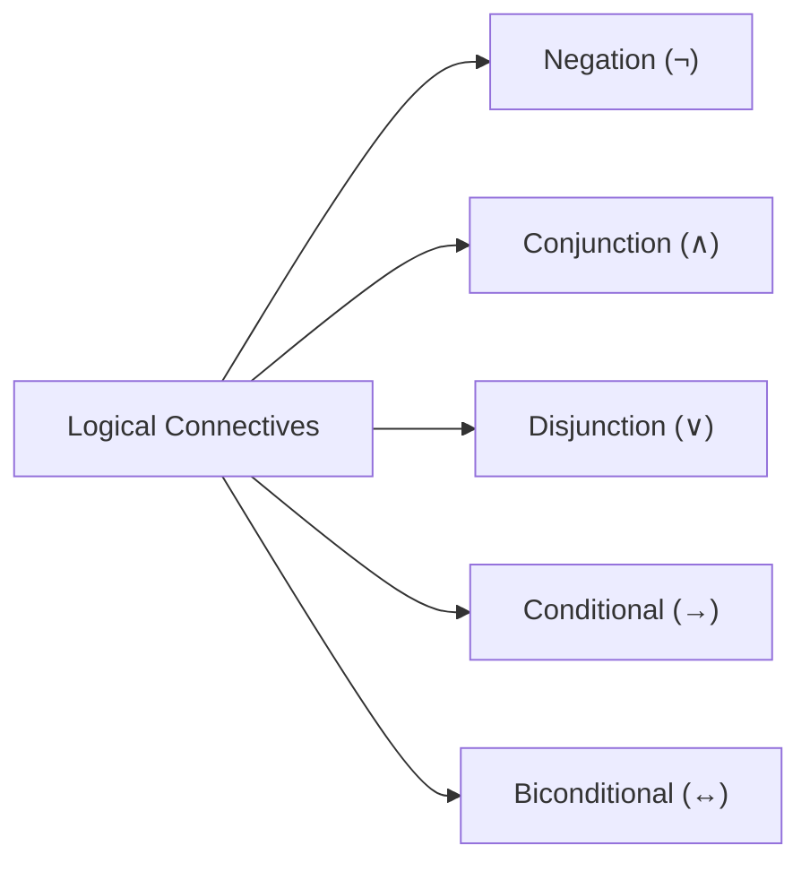

# 01. Propositional Logic & Truth Tables

> [!NOTE]
> **Course Module Reference:** PMT 1013 (Foundations of Mathematics)
> **Corresponding Lecture Slides:** [01_D01_Logic_and_Statements.pdf](../01_D01_Logic_and_Statements.pdf), [01_D03_Propositional_Logic_and_Truth_Tables.pdf](../01_D03_Propositional_Logic_and_Truth_Tables.pdf)
> **Prerequisites:** Basic understanding of declarative sentences and boolean values (True / False).

---

## 1. Background & Prerequisites (අවශ්‍ය මූලික දැනුම)

ගණිතයේදී ඕනෑම ප්‍රමේයයක් (Theorem) හෝ සත්‍යතාවයක් ඔප්පු කිරීමට පෙර, අප භාවිතා කරන ප්‍රකාශන (Statements) නිවැරදිව තර්කානුකූලව ගොඩනැගිය යුතුය. 

*   **Proposition (ප්‍රස්තාවය / ප්‍රකාශනය):** සත්‍ය (True - $\mathbf{T}$) හෝ අසත්‍ය (False - $\mathbf{F}$) යන අගයන් දෙකෙන් එකක් පමණක් ගත හැකි ප්‍රකාශන වාක්‍යයකි. (දෙකම එකවර විය නොහැක).
*   **Truth Value (සත්‍යතා අගය):** ප්‍රකාශනයක් සත්‍ය නම් එහි අගය $\mathbf{T}$ (හෝ $1$) ද, අසත්‍ය නම් $\mathbf{F}$ (හෝ $0$) ද වේ.

### 💡 "Dummy-Proof" Concept: ප්‍රකාශනයක් ද නැද්ද කියා තත්පරයෙන් අඳුරගන්නේ මෙහෙමයි!
ප්‍රකාශනයක් වීමට නම් ඒ වාක්‍යය දිහා බලා **"මේක ඇත්තද? නැත්නම් බොරුද?"** කියලා පැහැදිලි තනි උත්තරයක් දෙන්න පුළුවන් වෙන්න ඕනේ.
*   *"කොළඹ යනු ශ්‍රී ලංකාවේ අගනුවරයි."* $\implies$ සත්‍ය ප්‍රකාශනයකි ($\mathbf{T}$).
*   *"$2 + 3 = 7$"* $\implies$ අසත්‍ය ප්‍රකාශනයකි ($\mathbf{F}$).
*   *"ඔයා කොහෙද යන්නේ?"* $\implies$ ප්‍රශ්නයකි, ප්‍රකාශනයක් **නොවේ**.
*   *"දොර වහන්න!"* $\implies$ අණ කිරීමකි (Command), ප්‍රකාශනයක් **නොවේ**.
*   *"$x + 5 = 10$"* $\implies$ $x$ ගේ අගය නොදන්නා බැවින් ඇත්තද බොරුද කිව නොහැක. එබැවින් මෙය ප්‍රස්තාවයක් නොවේ (මෙය Open Sentence / Predicate එකකි).

---

## 2. Logical Connectives (තර්කන සම්බන්ධක) & Truth Tables

තනි ප්‍රකාශන (Simple Propositions) එකතු කර සංයුක්ත ප්‍රකාශන (Compound Propositions) සෑදීමට සම්බන්ධක 5ක් භාවිතා කරයි:

### (1) Negation (නිශේධනය - $\neg P$ හෝ $\sim P$)
* **තේරුම:** "නොවේ" (NOT).
* **නීතිය:** මුල් අගය අනිත් පැත්ත පෙරළයි. ($\mathbf{T} \to \mathbf{F}$, $\mathbf{F} \to \mathbf{T}$).

### (2) Conjunction (සංයෝජනය - $P \land Q$)
* **තේරුම:** $P$ "සහ" $Q$ (AND).
* **නීතිය:** $P$ සහ $Q$ **දෙකම $\mathbf{T}$ නම් පමණක් $\mathbf{T}$ වේ**. අනිත් හැමවිටම $\mathbf{F}$ වේ.

### (3) Disjunction (වියෝජනය - $P \lor Q$)
* **තේරුම:** $P$ "හෝ" $Q$ (Inclusive OR).
* **නීතිය:** දෙකෙන් එකක් හෝ $\mathbf{T}$ නම් $\mathbf{T}$ වේ. **දෙකම $\mathbf{F}$ නම් පමණක් $\mathbf{F}$ වේ**.

### (4) Conditional / Implication (කොන්දේසි ප්‍රකාශනය - $P \to Q$)
* **තේරුම:** "$P$ නම් $Q$ වේ" (If $P$, then $Q$).
* $P$ = Hypothesis / Antecedent (පූර්ව උපකල්පනය), $Q$ = Conclusion / Consequent (නිගමනය).
* **නීතිය:** **ඇත්තකින් පටන් ගෙන බොරුවකින් අවසන් වුවහොත් පමණක් $\mathbf{F}$ වේ** ($\mathbf{T} \to \mathbf{F}$ is $\mathbf{F}$). මුල බොරු නම් ($\mathbf{F} \to \text{ඕනෑම එකක්}$), ප්‍රතිඵලය නිතරම **$\mathbf{T}$ (Vacuously True)** වේ!

### (5) Biconditional (ද්වි-කොන්දේසි ප්‍රකාශනය - $P \leftrightarrow Q$ හෝ $P \iff Q$)
* **තේරුම:** "$P$ නම් සහ නම් පමණක් $Q$" ($P$ if and only if $Q$).
* **නීතිය:** $P$ සහ $Q$ දෙකේම **සත්‍යතා අගයන් සමාන නම් $\mathbf{T}$ වේ** ($\mathbf{T} \leftrightarrow \mathbf{T}$ is $\mathbf{T}$, සහ $\mathbf{F} \leftrightarrow \mathbf{F}$ is $\mathbf{T}$). අගයන් වෙනස් නම් $\mathbf{F}$ වේ.

---

### 📊 Master Truth Table (ප්‍රධාන සත්‍යතා වගුව)

| $P$ | $Q$ | $\neg P$ | $P \land Q$ | $P \lor Q$ | $P \to Q$ | $P \leftrightarrow Q$ | $P \oplus Q$ (XOR) |
| :-: | :-: | :-: | :-: | :-: | :-: | :-: | :-: |
| $\mathbf{T}$ | $\mathbf{T}$ | $\mathbf{F}$ | $\mathbf{T}$ | $\mathbf{T}$ | $\mathbf{T}$ | $\mathbf{T}$ | $\mathbf{F}$ |
| $\mathbf{T}$ | $\mathbf{F}$ | $\mathbf{F}$ | $\mathbf{F}$ | $\mathbf{T}$ | $\mathbf{F}$ | $\mathbf{F}$ | $\mathbf{T}$ |
| $\mathbf{F}$ | $\mathbf{T}$ | $\mathbf{T}$ | $\mathbf{F}$ | $\mathbf{T}$ | $\mathbf{T}$ | $\mathbf{F}$ | $\mathbf{T}$ |
| $\mathbf{F}$ | $\mathbf{F}$ | $\mathbf{T}$ | $\mathbf{F}$ | $\mathbf{F}$ | $\mathbf{T}$ | $\mathbf{T}$ | $\mathbf{F}$ |

---

## 3. Variations of Conditional Statements ($P \to Q$)

විභාග වලදී නිතරම අහන වැදගත් හැඩතල 3කි:

1. **Converse (ප්‍රතිලෝමය):** $Q \to P$
2. **Inverse (විලෝමය):** $\neg P \to \neg Q$
3. **Contrapositive (ප්‍රතිවිරුද්ධය):** $\neg Q \to \neg P$

> [!IMPORTANT]
> **Golden Rule:** 
> * මුල් ප්‍රකාශනය ($P \to Q$) සහ එහි Contrapositive ($\neg Q \to \neg P$) සෑමවිටම තාර්කිකව සමාන වේ ($P \to Q \equiv \neg Q \to \neg P$).
> * Converse ($Q \to P$) සහ Inverse ($\neg P \to \neg Q$) එකිනෙකට සමාන වේ.
> * නමුත් $P \to Q \not\equiv Q \to P$ (මුල් ප්‍රකාශනය එහි Converse එකට සමාන නොවේ!).

---

## 4. Tautology, Contradiction & Logical Equivalence ($\equiv$)

* **Tautology ($\mathbf{T}_0$ / Tautology):** කුමන ආදේශයක් යටතේ වුවද සෑමවිටම සත්‍ය ($\mathbf{T}$) වන ප්‍රකාශන. (උදා: $P \lor \neg P$).
* **Contradiction ($\mathbf{F}_0$ / Fallacy):** සෑමවිටම අසත්‍ය ($\mathbf{F}$) වන ප්‍රකාශන. (උදා: $P \land \neg P$).
* **Contingency:** සමහර අවස්ථා වල $\mathbf{T}$ ද, සමහර අවස්ථා වල $\mathbf{F}$ ද වන සාමාන්‍ය ප්‍රකාශන.
* **Logical Equivalence ($A \equiv B$):** ප්‍රකාශන දෙකක සත්‍යතා වගු වල ප්‍රතිඵල තීරුව (Final column) හරියටම සමාන වේ නම් $A \equiv B$ වේ. (එනම් $A \leftrightarrow B$ යනු Tautology එකක් වේ).

---

## 5. Master Laws of Propositional Logic (තර්කන නීති)

විභාගයේදී **"Without using truth tables, prove that..."** කියා ලැබෙන ප්‍රශ්න විසඳන්නේ මෙම නීති මගිනි:

| නීතියේ නම | Conjunction ($\land$) හැඩය | Disjunction ($\lor$) හැඩය |
| :--- | :--- | :--- |
| **Identity Laws** | $P \land \mathbf{T} \equiv P$ | $P \lor \mathbf{F} \equiv P$ |
| **Domination Laws** | $P \land \mathbf{F} \equiv \mathbf{F}$ | $P \lor \mathbf{T} \equiv \mathbf{T}$ |
| **Idempotent Laws** | $P \land P \equiv P$ | $P \lor P \equiv P$ |
| **Double Negation** | $\neg(\neg P) \equiv P$ | — |
| **Commutative Laws** | $P \land Q \equiv Q \land P$ | $P \lor Q \equiv Q \lor P$ |
| **Associative Laws** | $(P \land Q) \land R \equiv P \land (Q \land R)$ | $(P \lor Q) \lor R \equiv P \lor (Q \lor R)$ |
| **Distributive Laws** | $P \land (Q \lor R) \equiv (P \land Q) \lor (P \land R)$ | $P \lor (Q \land R) \equiv (P \lor Q) \land (P \lor R)$ |
| **De Morgan's Laws** | $\neg(P \land Q) \equiv \neg P \lor \neg Q$ | $\neg(P \lor Q) \equiv \neg P \land \neg Q$ |
| **Absorption Laws** | $P \land (P \lor Q) \equiv P$ | $P \lor (P \land Q) \equiv P$ |
| **Negation / Complement** | $P \land \neg P \equiv \mathbf{F}$ | $P \lor \neg P \equiv \mathbf{T}$ |

### 🔥 අතිශය වැදගත් පරිවර්තන නීති (Crucial Transformation Rules):
1. **Conditional Law:** $P \to Q \equiv \neg P \lor Q$
2. **Negation of Conditional:** $\neg(P \to Q) \equiv P \land \neg Q$  *(විභාග වලට නිතරම එයි!)*
3. **Biconditional Law:** $P \leftrightarrow Q \equiv (P \to Q) \land (Q \to P) \equiv (\neg P \lor Q) \land (\neg Q \lor P)$
4. **Contrapositive Law:** $P \to Q \equiv \neg Q \to \neg P$

---

## ✍️ Step-by-Step Worked Exam Problems

### 📌 Example 1: Truth Table මගින් Logical Equivalence පෙන්වීම
**Question:** Prove that $\neg(P \lor (\neg P \land Q)) \equiv \neg P \land \neg Q$ using a truth table.

**Solution:**

| $P$ | $Q$ | $\neg P$ | $\neg Q$ | $\neg P \land Q$ | $P \lor (\neg P \land Q)$ | **(Column 1)** $\neg(P \lor (\neg P \land Q))$ | **(Column 2)** $\neg P \land \neg Q$ |
| :-: | :-: | :-: | :-: | :-: | :-: | :-: | :-: |
| $\mathbf{T}$ | $\mathbf{T}$ | $\mathbf{F}$ | $\mathbf{F}$ | $\mathbf{F}$ | $\mathbf{T}$ | **$\mathbf{F}$** | **$\mathbf{F}$** |
| $\mathbf{T}$ | $\mathbf{F}$ | $\mathbf{F}$ | $\mathbf{T}$ | $\mathbf{F}$ | $\mathbf{T}$ | **$\mathbf{F}$** | **$\mathbf{F}$** |
| $\mathbf{F}$ | $\mathbf{T}$ | $\mathbf{T}$ | $\mathbf{F}$ | $\mathbf{T}$ | $\mathbf{T}$ | **$\mathbf{F}$** | **$\mathbf{F}$** |
| $\mathbf{F}$ | $\mathbf{F}$ | $\mathbf{T}$ | $\mathbf{T}$ | $\mathbf{F}$ | $\mathbf{F}$ | **$\mathbf{T}$** | **$\mathbf{T}$** |

**Conclusion:** Column 1 සහ Column 2 හි සියලුම පේළි වල සත්‍යතා අගයන් එකිනෙකට සමාන බැවින්, $\neg(P \lor (\neg P \land Q)) \equiv \neg P \land \neg Q$ වේ. $\blacksquare$

---

### 📌 Example 2: Truth Tables රහිතව තර්කන නීති මගින් සාධනය කිරීම
**Question:** Without using truth tables, prove that $(P \to Q) \land (P \to R) \equiv P \to (Q \land R)$.

**Step-by-Step Algebraic Proof:**
$$\begin{aligned}
\text{LHS} &= (P \to Q) \land (P \to R) \\
&\equiv (\neg P \lor Q) \land (\neg P \lor R) && \text{(Conditional Law)} \\
&\equiv \neg P \lor (Q \land R) && \text{(Distributive Law)} \\
&\equiv P \to (Q \land R) && \text{(Conditional Law)} \\
&= \text{RHS} \quad \blacksquare
\end{aligned}$$

---

## ⚠️ Exam Traps & Common Pitfalls

> [!CAUTION]
> **1. $P \to Q$ හි නිශේධනය වැරදීම:**
> ළමුන් බොහෝවිට $\neg(P \to Q)$ යන්න $\neg P \to \neg Q$ ලෙස වැරදියට ලියයි. 
> නිවැරදි ආකාරය: **$\neg(P \to Q) \equiv P \land \neg Q$**.
> 
> **2. De Morgan's Law යෙදීමේදී ලකුණ මාරු නොකිරීම:**
> $\neg(P \land Q)$ ලිවීමේදී $\neg P \land \neg Q$ ලෙස ලියයි. මැද ලකුණ $\land \to \lor$ විය යුතුය!
> නිවැරදි ආකාරය: **$\neg(P \land Q) \equiv \neg P \lor \neg Q$**.
> 
> **3. Conditional ප්‍රකාශනයක $P = \mathbf{F}$ වූ විට:**
> මුල් ප්‍රකාශනය බොරු නම් ($\mathbf{F}$), නිගමනය කුමක් වුවත් $P \to Q$ නිතරම **$\mathbf{T}$** වේ!
