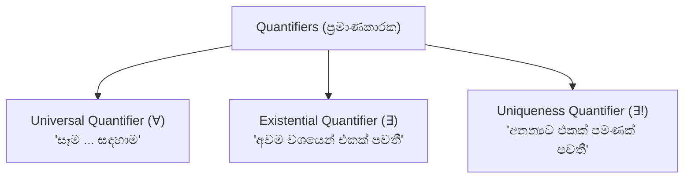

# 02. Predicates, Quantifiers & Rules of Inference

> [!NOTE]
> **Course Module Reference:** PMT 1013 (Foundations of Mathematics)
> **Corresponding Lecture Slides:** [02_D04_Predicates_and_Quantifiers.pdf](PMAT/1013/Lecture%20Notes/02_D04_Predicates_and_Quantifiers.pdf), [02_D05_Rules_of_Inference_and_Arguments.pdf](PMAT/1013/Lecture%20Notes/02_D05_Rules_of_Inference_and_Arguments.pdf)
> **Prerequisites:** Propositional Logic, Truth Tables, Logical Connectives (Module 01).

---

## 1. Predicates & Quantifiers (විධෙයයන් සහ ප්‍රමාණකාරක)

### 📘 Definitions & Core Concepts

*   **Predicate / Propositional Function ($P(x)$):** එක් විචල්‍යයක් හෝ කිහිපයක් අඩංගු, විචල්‍යයට නිශ්චිත අගයක් ආදේශ කළ විට ප්‍රස්තාවයක් (Proposition) බවට පත්වන විවෘත වාක්‍යයකි.
    *   *උදාහරණය:* $P(x): "x > 3"$. $P(4)$ සත්‍ය ($\mathbf{T}$) වන අතර, $P(2)$ අසත්‍ය ($\mathbf{F}$) වේ.
*   **Domain of Discourse ($D$ / Universe):** $x$ විචල්‍යය සඳහා ආදේශ කළ හැකි සියලුම වලංගු අගයන්ගේ කුලකයයි.

---

## 2. Quantifiers (ප්‍රමාණකාරක)

### (1) Universal Quantifier ($\forall$ - සර්වත්‍ර ප්‍රමාණකාරකය)
*   **සංකේතය:** $\forall x P(x)$ $\implies$ "Domain එකේ ඇති **සෑම $x$ සඳහාම** $P(x)$ සත්‍ය වේ."
*   **$\mathbf{T}$ වීමට:** $D$ හි ඇති සෑම $x$ එකක් සඳහාම $P(x) = \mathbf{T}$ විය යුතුය.
*   **$\mathbf{F}$ වීමට:** $P(x) = \mathbf{F}$ වන **තනි එක් අගයක් (Counterexample)** පෙන්වීම ප්‍රමාණවත්ය!

### (2) Existential Quantifier ($\exists$ - අස්තිත්ව ප්‍රමාණකාරකය)
*   **සංකේතය:** $\exists x P(x)$ $\implies$ "$P(x)$ සත්‍ය වන **අවම වශයෙන් එක් $x$ අගයක් හෝ පවතී**."
*   **$\mathbf{T}$ වීමට:** $P(x) = \mathbf{T}$ වන එක් උදාහරණයක් හෝ පෙන්වීම ප්‍රමාණවත්ය.
*   **$\mathbf{F}$ වීමට:** $D$ හි ඇති කිසිදු $x$ අගයකට $P(x)$ සත්‍ය නොවිය යුතුය (එනම් සැමටම අසත්‍ය විය යුතුය).

### (3) Uniqueness Quantifier ($\exists!$ - අනන්‍යතා ප්‍රමාණකාරකය)
*   **සංකේතය:** $\exists! x P(x)$ $\implies$ "$P(x)$ සත්‍ය වන **එකම එක $x$ අගයක් පමණක්** පවතී."
*   **විධිමත් අර්ථ දැක්වීම:** $\exists x [P(x) \land \forall y (P(y) \to y = x)]$.

---

## 3. Negating Quantified Statements (ප්‍රමාණකාරක නිශේධනය - De Morgan's)

විභාග වලදී නිතරම අහන අතිශය වැදගත් නීති දෙකකි:

$$\mathbf{\neg(\forall x P(x)) \equiv \exists x (\neg P(x))}$$
*තේරුම:* "හැමෝම දක්ෂයි" යන්න බොරු නම්, "අවම වශයෙන් එක් අයෙක් හෝ දක්ෂ නැත".

$$\mathbf{\neg(\exists x P(x)) \equiv \forall x (\neg P(x))}$$
*තේරුම:* "කිසිවකු හෝ සමත් වූයේ නැත" යනු "සෑම අයෙක්ම අසමත් විය".

---

## 4. Nested Quantifiers (ගැටගැසුණු ප්‍රමාණකාරක)

විචල්‍යයන් දෙකක් හෝ වැඩි ගණනක් ඇති විට ප්‍රමාණකාරක වල අනුපිළිවෙල (Order) ඉතා වැදගත් වේ!

*   $\forall x \forall y P(x,y) \equiv \forall y \forall x P(x,y)$ (අනුපිළිවෙල මාරු කළ හැක).
*   $\exists x \exists y P(x,y) \equiv \exists y \exists x P(x,y)$ (අනුපිළිවෙල මාරු කළ හැක).
*   **නමුත්:** $\forall x \exists y P(x,y) \not\equiv \exists y \forall x P(x,y)$ (මාරු කළ නොහැක!).

> [!TIP]
> **පැහැදිලි උදාහරණය:**
> *   $\forall x \exists y (x + y = 0)$ over $\mathbb{R}$: "ඕනෑම $x$ අගයකට, $x+y=0$ වන $y$ එකක් තෝරාගත හැක ($y = -x$)." $\implies$ **$\mathbf{T}$**
> *   $\exists y \forall x (x + y = 0)$ over $\mathbb{R}$: "සෑම $x$ කටම එකතු කළ විට 0 දෙන පොදු තනි $y$ අගයක් ලෝකයේ තිබේ." $\implies$ **$\mathbf{F}$**

---

## 5. Rules of Inference (අපෝහක නීති & වලංගු තර්ක)

තර්කයක් (Argument) යනු පූර්ව ප්‍රමේයයන් (Premises $p_1, p_2, \dots, p_k$) මාලාවකින් අවසාන නිගමනයකට ($q$) එළඹීමයි:
$$p_1 \land p_2 \land \dots \land p_k \vdash q \quad \text{හෝ} \quad (p_1 \land p_2 \land \dots \land p_k) \to q$$

*   **Valid Argument (වලංගු තර්කය):** සියලුම Premises සත්‍ය වන විට, අනිවාර්යයෙන්ම Conclusion එකද සත්‍ය වේ නම් (එනම් $(p_1 \land \dots \land p_k) \to q$ යනු Tautology එකක් නම්).
*   **Fallacy (තර්කාභාසය / Invalid Argument):** තර්කය වලංගු නොවේ නම්.

### 📋 Master Table of Rules of Inference

| නම (Rule Name) | Tautology හැඩය | Inference හැඩය |
| :--- | :--- | :--- |
| **Modus Ponens** (Law of Detachment) | $(P \land (P \to Q)) \to Q$ | $P$ $P \to Q$ $\therefore Q$ |
| **Modus Tollens** (Law of Contraposition) | $(\neg Q \land (P \to Q)) \to \neg P$ | $\neg Q$ $P \to Q$ $\therefore \neg P$ |
| **Hypothetical Syllogism** (Transitivity) | $((P \to Q) \land (Q \to R)) \to (P \to R)$ | $P \to Q$ $Q \to R$ $\therefore P \to R$ |
| **Disjunctive Syllogism** | $((P \lor Q) \land \neg P) \to Q$ | $P \lor Q$ $\neg P$ $\therefore Q$ |
| **Addition** | $P \to (P \lor Q)$ | $P$ $\therefore P \lor Q$ |
| **Simplification** | $(P \land Q) \to P$ | $P \land Q$ $\therefore P$ |
| **Conjunction** | $((P) \land (Q)) \to (P \land Q)$ | $P$ $Q$ $\therefore P \land Q$ |
| **Resolution** | $((P \lor Q) \land (\neg P \lor R)) \to (Q \lor R)$ | $P \lor Q$ $\neg P \lor R$ $\therefore Q \lor R$ |

---

## 6. Common Logical Fallacies (නිතර සිදුවන වැරදි තර්ක)

> [!CAUTION]
> **1. Fallacy of Affirming the Consequent (පසු උපකල්පනය තහවුරු කිරීමේ තර්කාභාසය):**
> *   $P \to Q$ (වැස්සොත් පොළොව තෙමෙයි).
> *   $Q$ (පොළොව තෙමී ඇත).
> *   $\therefore P$ (එමනිසා වැස්ස වැටුණි) $\implies$ **INVALID!** (වතුර බටයක් කැඩී පොළොව තෙමෙන්නටද පුළුවන).
> 
> **2. Fallacy of Denying the Antecedent (පූර්ව උපකල්පනය ප්‍රතික්ෂේප කිරීමේ තර්කාභාසය):**
> *   $P \to Q$ (වැස්සොත් පොළොව තෙමෙයි).
> *   $\neg P$ (වැස්සේ නැත).
> *   $\therefore \neg Q$ (එමනිසා පොළොව තෙමී නැත) $\implies$ **INVALID!**

---

## ✍️ Step-by-Step Worked Exam Problems

### 📌 Problem 1: Formal Argument Validation (End-Exam 2026 Model Paper Q1(b))
**Question:** Express the following argument in symbolic form and, **without using a truth table**, determine whether it is valid or invalid:
> *"If an integer is divisible by 4, then it is even.*  
> *If an integer is even and a perfect square, then it is divisible by 4.*  
> *16 is even.*  
> *Therefore, 16 is a perfect square."*

**Step-by-Step Solution:**

**Step 1: සංකේත අර්ථ දැක්වීම (Define Propositional Variables)**
Let for an integer $x = 16$:
*   $P$: "$x$ is divisible by 4"
*   $Q$: "$x$ is even"
*   $R$: "$x$ is a perfect square"

**Step 2: තර්කය සංකේතාත්මකව ලිවීම (Symbolic Form)**
*   Premise 1 ($p_1$): $P \to Q$
*   Premise 2 ($p_2$): $(Q \land R) \to P$
*   Premise 3 ($p_3$): $Q$
*   Conclusion ($C$): $R$

The argument is:
$$\mathbf{[(P \to Q) \land ((Q \land R) \to P) \land Q] \implies R}$$

**Step 3: වලංගුතාවය පරීක්ෂා කිරීම (Check Validity without Truth Table)**
අපි බලමු Premises සියල්ල සත්‍ය ($\mathbf{T}$) වන නමුත් නිගමනය $R = \mathbf{F}$ වන අවස්ථාවක් (Countermodel) සෑදිය හැකිද කියා:
1. නිගමනය අසත්‍ය යැයි ගනිමු: **$R = \mathbf{F}$**.
2. Premise 3 සත්‍ය විය යුතුය: **$Q = \mathbf{T}$**.
3. දැන් $Q \land R = \mathbf{T} \land \mathbf{F} = \mathbf{F}$.
4. එවිට Premise 2 වන්නේ: $(Q \land R) \to P \equiv \mathbf{F} \to P \equiv \mathbf{T}$ (මෙය $P$ හි ඕනෑම අගයකට සත්‍ය වේ!).
5. $P = \mathbf{F}$ යැයි තෝරාගනිමු.
6. එවිට Premise 1: $P \to Q \equiv \mathbf{F} \to \mathbf{T} \equiv \mathbf{T}$.

**ප්‍රතිඵලය:**
$P = \mathbf{F}, Q = \mathbf{T}, R = \mathbf{F}$ වූ විට:
*   Premise 1 = $\mathbf{T}$
*   Premise 2 = $\mathbf{T}$
*   Premise 3 = $\mathbf{T}$
*   නමුත් Conclusion $R = \mathbf{F}$ වේ!

**Conclusion:** සියලුම පූර්ව නිගමන සත්‍ය වන විට නිගමනය අසත්‍ය වන අවස්ථාවක් පවතින බැවින්, මෙම තර්කය **INVALID (වලංගු නොවන තර්කාභාසයකි / Fallacy of Affirming the Consequent)**. $\blacksquare$

---

### 📌 Problem 2: Rules of Inference මගින් විධිමත් සාධනය
**Question:** Show that the hypotheses $(P \land Q) \lor R$ and $R \to S$ imply $P \lor S$.

**Formal Proof:**
| Step | Statement | Reason / Justification |
| :-: | :--- | :--- |
| 1 | $(P \land Q) \lor R$ | Premise |
| 2 | $((P \land Q) \lor R) \equiv (P \lor R) \land (Q \lor R)$ | Distributive Law |
| 3 | $P \lor R$ | Simplification from Step 2 |
| 4 | $\neg P \to R$ | Conditional Equivalence ($P \lor R \equiv \neg P \to R$) |
| 5 | $R \to S$ | Premise |
| 6 | $\neg P \to S$ | Hypothetical Syllogism from Steps 4 and 5 |
| 7 | $P \lor S$ | Conditional Equivalence ($\neg P \to S \equiv P \lor S$) |

$\therefore$ The argument is valid. $\blacksquare$
