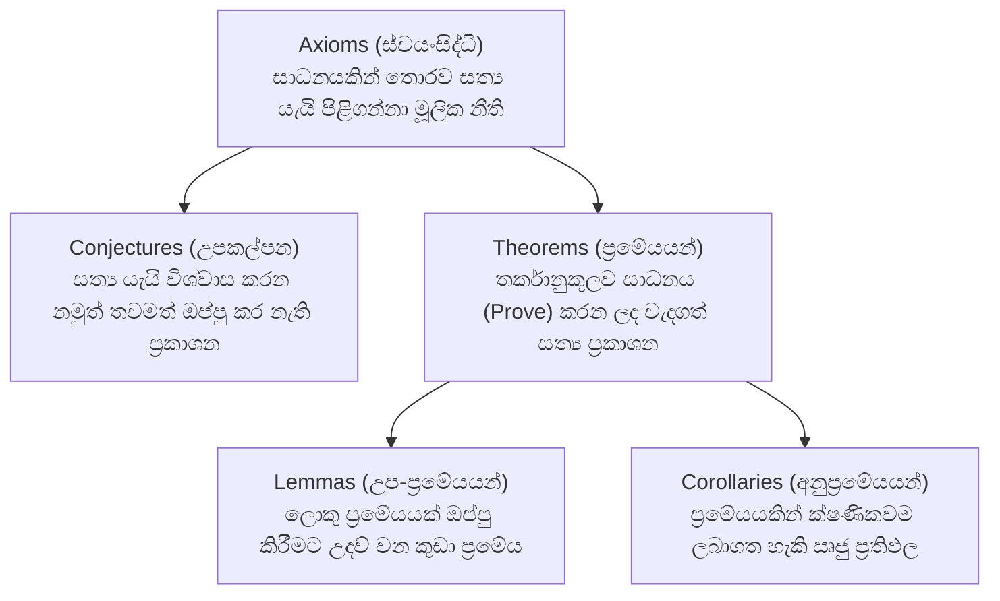
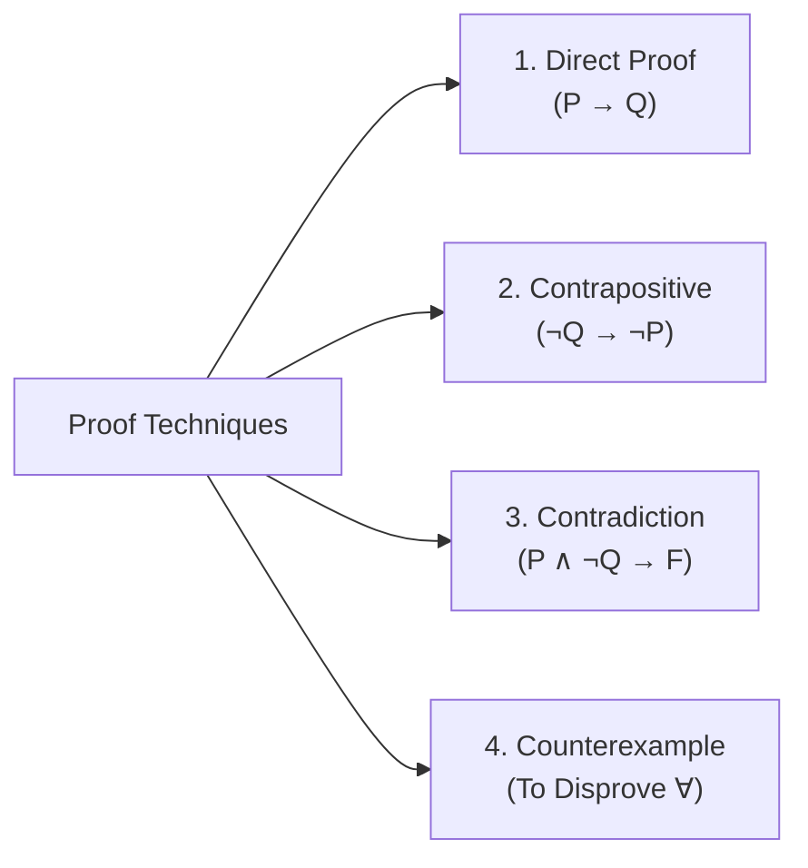

# 03. Proof Techniques & Number Theory Foundations

> [!NOTE]
> **Course Module Reference:** PMT 1013 (Foundations of Mathematics)
> **Corresponding Lecture Slides:** [01_D01_Logic_and_Statements.pdf](../01_D01_Logic_and_Statements.pdf), [01_D02_Proof_Techniques_Intro.pdf](../01_D02_Proof_Techniques_Intro.pdf), [03_D06_Number_Theory_Divisibility_Proofs.pdf](../03_D06_Number_Theory_Divisibility_Proofs.pdf)
> **Prerequisites:** Propositional Logic & Conditional Statements (Module 01).

---

## 1. Mathematical Architecture: Axioms, Conjectures & Theorems

Pure Mathematics (ශුද්ධ ගණිතය) ගොඩනැගී ඇති මූලික ගඩොල් 4කි:

### 🌟 ප්‍රසිද්ධ ගණිතමය උපකල්පන (Famous Conjectures):
1. **Goldbach's Conjecture (ගෝල්ඩ්බැක් උපකල්පනය):** 2 ට වඩා විශාල ඕනෑම ඉරට්ටේ සංඛ්‍යාවක් ප්‍රථමක සංඛ්‍යා දෙකක එකතුවක් ලෙස ලිවිය හැක. (උදා: $4=2+2, 6=3+3, 8=3+5, 10=3+7$).
2. **Twin Prime Conjecture (නිවුන් ප්‍රථමක උපකල්පනය):** අන්තරය 2 ක් වන ප්‍රථමක සංඛ්‍යා යුගල (උදා: $(3,5), (5,7), (11,13), (17,19)$) අනන්ත සංඛ්‍යාවක් පවතී.
3. **Collatz Conjecture ($3n+1$ ගැටලුව):** ඕනෑම ධන නිඛිලයකින් පටන් ගෙන, ඉරට්ටේ නම් 2 න් බෙදමින්ද, ඔත්තේ නම් $3n+1$ කරමින්ද ඉදිරියට යන විට සෑමවිටම අවසානයේ 1 වෙත ළඟා වේ.

---

## 2. The 4 Fundamental Proof Techniques (ප්‍රධාන සාධන ක්‍රම 4)

$P \implies Q$ ("$P$ නම් $Q$ වේ") ආකාරයේ ප්‍රකාශනයක් ඔප්පු කිරීමට භාවිතා කරන ක්‍රම 4:

### 1️⃣ Direct Proof (ඍජු සාධනය)
* **ක්‍රමය:** $P$ සත්‍ය යැයි උපකල්පනය කර (Assume $P$ is true), අර්ථ දැක්වීම් සහ වීජ ගණිතය මගින් පියවරෙන් පියවර ගොස් $Q$ සත්‍ය බව පෙන්වයි.
* **භාවිතයට හොඳම අවස්ථා:** ප්‍රකාශනය සරලව ධනාත්මකව ඇති විට (උදා: $x$ ඉරට්ටේ නම් $x^2$ ඉරට්ටේ වේ).

### 2️⃣ Proof by Contrapositive (ප්‍රතිවිරුද්ධයෙන් සාධනය)
* **ක්‍රමය:** $P \implies Q$ ඔප්පු කරනවා වෙනුවට, එහි තාර්කික සමානතාව වන **$\neg Q \implies \neg P$** ("$Q$ අසත්‍ය නම් $P$ ද අසත්‍ය වේ") ඔප්පු කරයි.
* **භාවිතයට හොඳම අවස්ථා:** Conclusion ($Q$) එකේ වර්ගජ හෝ සංකීර්ණ පද ඇති විට සහ Hypothesis ($P$) එක සරල කරගැනීමට අවශ්‍ය වූ විට. (උදා: "$n^2$ ඔත්තේ නම් $n$ ඔත්තේ වේ" යන්න ඔප්පු කිරීමට $\neg Q: \text{'n is even'} \implies \neg P: \text{'n² is even'}$ පෙන්වීම ඉතා පහසුය).

### 3️⃣ Proof by Contradiction / Reductio ad Absurdum (විරෝධාභාසයෙන් සාධනය)
* **ක්‍රමය:** $P$ සත්‍ය යැයිද, නමුත් **$Q$ අසත්‍ය යැයිද උපකල්පනය කරයි** (Assume $P \land \neg Q$). ඊට පසු තර්කානුකූලව ඉදිරියට යන විට කිසිදා විය නොහැකි පරස්පර විරෝධයක් (Contradiction: $\mathbf{F}$, උදා: $0=1$ හෝ $x$ ඉරට්ටේ මෙන්ම ඔත්තේ වේ) හමුවේ. එමගින් අපගේ මුල් උපකල්පනය වැරදි බවත් $Q$ අනිවාර්යයෙන්ම සත්‍ය විය යුතු බවත් තහවුරු වේ.
* **භාවිතයට හොඳම අවස්ථා:** $\sqrt{2}$ අපරිමේය බව, ප්‍රථමක සංඛ්‍යා අනන්ත ගණනක් ඇති බව, සහ $a \nmid (b+c)$ වැනි "නොවේ" ($\notin, \nmid$) අඩංගු ප්‍රකාශන සාධනයට.

### 4️⃣ Disproving by Counterexample (ප්‍රති-උදාහරණයක් මගින් අසත්‍ය බව පෙන්වීම)
* $\forall x P(x)$ ("සෑම $x$ සඳහාම") ආකාරයේ ප්‍රකාශනයක් **අසත්‍ය බව පෙන්වීමට තනි එක් ප්‍රති-උදාහරණයක් (Single Counterexample) දැක්වීම 100% ක් ප්‍රමාණවත්ය!**

---

## 3. Number Theory Foundations: Divisibility in $\mathbb{Z}$ (භාජ්‍යතාව)

Pure Mathematics හි වඩාත්ම මූලික අර්ථ දැක්වීම්:

### 📜 Formal Definition: Divisibility (භාජ්‍යතාවය - $a | b$)
නිඛිල $a, b \in \mathbb{Z}$ (මෙහි $a \neq 0$) සඳහා, **$b = ak$** වන පරිදි $k \in \mathbb{Z}$ නිඛිලයක් පවතී නම්, **"$a$ මගින් $b$ බෙදේ" ($a$ divides $b$)** යැයි කියනු ලබන අතර එය **$a | b$** ලෙස ලියයි.
*   $a | b \iff \exists k \in \mathbb{Z} \text{ such that } b = ak$.
*   $a \nmid b \iff \text{කිසිදු } k \in \mathbb{Z} \text{ සඳහා } b = ak \text{ නොවේ}$.

### 📜 Even and Odd Integers (ඉරට්ටේ සහ ඔත්තේ සංඛ්‍යා)
*   **Even ($n$ ඉරට්ටේ):** $n = 2k$ for some $k \in \mathbb{Z}$ (එනම් $2 | n$).
*   **Odd ($n$ ඔත්තේ):** $n = 2k + 1$ for some $k \in \mathbb{Z}$ (එනම් $2 \nmid n$).

### 📜 Division Algorithm (බෙදීමේ ඇල්ගොරිතමය)
ඕනෑම $a \in \mathbb{Z}$ සහ $b \in \mathbb{Z}^+$ (ධන නිඛිලයක්) සඳහා:
$$\mathbf{a = bq + r \quad \text{where } 0 \le r < b}$$
වන පරිදි **අනන්‍ය (Unique) $q, r \in \mathbb{Z}$** පවතී. ($q$ = Quotient / ලබ්ධිය, $r$ = Remainder / ශේෂය).

---

## ✍️ Step-by-Step Worked Exam Proofs

### 📌 Problem 1: Divisibility Linear Combination (End-Exam 2026 Model Paper Q1(a)(i))
**Theorem:** For all integers $a, b, c \in \mathbb{Z}$, if $a | b$ and $a | c$, then $a | (b + c)$.

**Direct Proof:**
1. **Hypothesis:** Assume $a | b$ and $a | c$ for integers $a, b, c \in \mathbb{Z}$ with $a \neq 0$.
2. By the definition of divisibility:
   * $a | b \implies \exists k_1 \in \mathbb{Z}$ such that $b = a k_1$.
   * $a | c \implies \exists k_2 \in \mathbb{Z}$ such that $c = a k_2$.
3. Consider the sum $(b + c)$:
   $$b + c = a k_1 + a k_2 = a(k_1 + k_2)$$
4. Since $k_1, k_2 \in \mathbb{Z}$, their sum $(k_1 + k_2)$ is also an integer. Let $k_3 = k_1 + k_2 \in \mathbb{Z}$.
5. Therefore, $b + c = a k_3$, which means by definition that $a | (b + c)$. $\blacksquare$

---

### 📌 Problem 2: Divisibility Non-Divisor Proof (End-Exam 2026 Model Paper Q1(a)(ii))
**Theorem:** For all integers $a, b, c \in \mathbb{Z}$, if $a | b$ and $a \nmid c$, then $a \nmid (b + c)$.

**Proof by Contradiction:**
1. **Assume the contrary:** Suppose $a | b$ and $a \nmid c$, but **$a | (b + c)$**.
2. By definition of divisibility:
   * $a | b \implies b = a k_1$ for some $k_1 \in \mathbb{Z}$.
   * $a | (b + c) \implies b + c = a k_2$ for some $k_2 \in \mathbb{Z}$.
3. Express $c$ in terms of $b+c$ and $b$:
   $$c = (b + c) - b = a k_2 - a k_1 = a(k_2 - k_1)$$
4. Since $k_1, k_2 \in \mathbb{Z}$, $(k_2 - k_1) \in \mathbb{Z}$. Let $k_3 = k_2 - k_1 \in \mathbb{Z}$.
5. This gives $c = a k_3$, which implies **$a | c$**.
6. But this directly contradicts our premise that **$a \nmid c$**! ($\text{Contradiction: } a | c \land a \nmid c$).
7. Hence, our assumption was false. Therefore, $a \nmid (b + c)$. $\blacksquare$

---

### 📌 Problem 3: Negative Divisibility Property (End-Exam 2026 Model Paper Q1(a)(iii))
**Theorem:** For all integers $a, b \in \mathbb{Z}$, if $a \nmid -b$, then $a \nmid b$.

**Proof by Contrapositive:**
1. The statement is of the form $P \implies Q$, where:
   * $P: a \nmid -b$
   * $Q: a \nmid b$
2. Its contrapositive is $\mathbf{\neg Q \implies \neg P}$, which states:
   $$\text{"If } a | b, \text{ then } a | -b\text{"}$$
3. Let us prove the contrapositive directly:
   * Assume $a | b$. By definition, $\exists k \in \mathbb{Z}$ such that $b = a k$.
   * Multiply both sides by $-1$:
     $$-b = -(a k) = a(-k)$$
   * Since $k \in \mathbb{Z}$, $(-k) \in \mathbb{Z}$. Let $m = -k \in \mathbb{Z}$.
   * Thus, $-b = a m$, which proves by definition that $a | -b$.
4. Since the contrapositive $\neg Q \implies \neg P$ is true, the original statement $P \implies Q$ is also true. $\blacksquare$

---

### 📌 Problem 4: Irrationality of $\sqrt{2}$ (Classic Contradiction)
**Theorem:** $\sqrt{2}$ is irrational.

**Proof by Contradiction:**
1. Assume to the contrary that $\sqrt{2}$ is rational. Then $\sqrt{2} = \frac{a}{b}$ where $a, b \in \mathbb{Z}, b \neq 0$, and $\gcd(a, b) = 1$ (in simplest form / irreducible).
2. Squaring both sides: $2 = \frac{a^2}{b^2} \implies a^2 = 2b^2$.
3. This implies $a^2$ is even, so $a$ must be even. Thus $a = 2k$ for some $k \in \mathbb{Z}$.
4. Substitute $a = 2k$: $(2k)^2 = 2b^2 \implies 4k^2 = 2b^2 \implies b^2 = 2k^2$.
5. This implies $b^2$ is even, so $b$ must be even.
6. If both $a$ and $b$ are even, they both share a common factor of 2.
7. This contradicts $\gcd(a, b) = 1$!
8. Therefore, $\sqrt{2}$ cannot be rational; it is irrational. $\blacksquare$

---

## ⚠️ Exam Traps & Common Pitfalls

> [!CAUTION]
> **1. Circular Reasoning (Begging the Question):**
> සාධනය ආරම්භයේදීම ඔප්පු කිරීමට ඇති ප්‍රතිඵලය ($Q$) සත්‍ය යැයි උපකල්පනය කර ගණනය කිරීම බරපතල වරදකි! (උදා: $a|(b+c)$ ඔප්පු කිරීමට $b+c = ak$ කියා මුලින්ම ලියන්න එපා).
> 
> **2. Counterexample මගින් සාධනය කිරීමට උත්සාහ කිරීම:**
> $1+3=4$ (ඉරට්ටේ) කියා එක් අංකයක් ආදේශ කර පෙන්වීම සාධනයක් නොවේ! $\forall$ ප්‍රකාශනයක් ඔප්පු කිරීමට අනිවාර්යයෙන්ම $x = 2k+1$ වැනි විචල්‍යයන් භාවිත කළ යුතුය.
> 
> **3. Contradiction හි නිවැරදි ආරම්භය:**
> Contradiction ආරම්භයේදී පැහැදිලිව **"Assume to the contrary that..."** හෝ **"Suppose that $P$ is true and $Q$ is false"** කියා ප්‍රකාශ කළ යුතුය.
