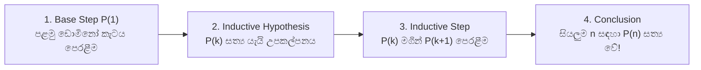

# 04. Mathematical Induction & Strong Induction

> [!NOTE]
> **Course Module Reference:** PMT 1013 (Foundations of Mathematics)
> **Corresponding Lecture Slides:** [04_D07_Mathematical_Induction.pdf](../04_D07_Mathematical_Induction.pdf), [04_D08_Strong_Induction_and_Well_Ordering.pdf](../04_D08_Strong_Induction_and_Well_Ordering.pdf)
> **Prerequisites:** Direct Proofs & Algebraic Inequalities (Module 03).

---

## 1. The Domino Effect: Intuition behind Mathematical Induction

ගණිත අභ්‍යුහනය (Mathematical Induction) යනු සියලුම ධන නිඛිල $n \in \mathbb{N}$ (හෝ $n \ge n_0$) සඳහා ප්‍රකාශනයක් ($P(n)$) සත්‍ය බව ඔප්පු කරන ප්‍රබලතම සාධන යන්ත්‍රයයි.

### 💡 "Dummy-Proof" Concept: ඩොමිනෝ කැට පෙළේ උපමාව!
කැට පේළියක් බිම තියලා තියෙනවා:
1. ඔයා පළමු කැටය ($n=1$) පෙරළනවා (**Base Step**).
2. $k$ වැනි කැටය පෙරළුනොත්, ඒක ගිහින් ඊළඟට තියෙන $(k+1)$ වැනි කැටය පෙරළනවා කියලා ඔප්පු කරනවා (**Inductive Step**).
3. එහෙනම් මුළු පේළියේම තියෙන අනන්ත කැට සියල්ලම එකින් එක පෙරළෙනවා නේද? මෙයයි Mathematical Induction!

---

## 2. Principle of Mathematical Induction (Weak Induction)

### 📜 Formal Structure (සම්මත ලියන ආකෘතිය)
1. **Base Step (මූලික පියවර):** $n = 1$ (හෝ ආරම්භක අගය $n_0$) ආදේශ කර $P(1)$ සත්‍ය බව පෙන්වන්න ($\text{LHS} = \text{RHS}$).
2. **Inductive Hypothesis (අභ්‍යුහන උපකල්පනය):** යම් $k \ge n_0$ නිඛිලයක් සඳහා $P(k)$ සත්‍ය යැයි උපකල්පනය කරන්න (Assume $P(k)$ is true).
3. **Inductive Step (අභ්‍යුහන පියවර):** ඉහත $P(k)$ උපකල්පනය භාවිතා කරමින් $P(k+1)$ සත්‍ය බව තර්කානුකූලව ගොඩනගන්න.
4. **Conclusion (අවසාන නිගමනය):** "By the Principle of Mathematical Induction, $P(n)$ is true for all $n \in \mathbb{N}$."

---

## 3. Strong Mathematical Induction (ප්‍රබල ගණිත අභ්‍යුහනය)

සාමාන්‍ය (Weak) Induction වලදී $P(k+1)$ ඔප්පු කිරීමට අවශ්‍ය වන්නේ ඊට පෙර තිබූ $P(k)$ පදය පමණි. 
නමුත් Fibonacci වැනි දෙවන මාත්‍රයේ ශ්‍රිත වලදී (උදා: $x_n = x_{n-1} + x_{n-2}$) $(k+1)$ වැනි පදය රඳා පවතින්නේ ඊට පෙර තිබූ පද **දෙකක් හෝ ඊට වැඩි ගණනක් මතය**. එවිට අපි Strong Induction භාවිතා කරමු!

### 📜 Strong Induction Structure:
1. **Base Steps:** අවශ්‍ය ආරම්භක අගයන් සියල්ලම පරීක්ෂා කරන්න (උදා: $n=1$ සහ $n=2$).
2. **Inductive Hypothesis:** $1 \le i \le k$ වන **සියලුම $i$ සඳහා $P(i)$ සත්‍ය යැයි උපකල්පනය කරන්න** (Assume $P(1), P(2), \dots, P(k)$ are all true).
3. **Inductive Step:** මේ සියල්ල ආධාරයෙන් $P(k+1)$ සත්‍ය බව ඔප්පු කරන්න.

---

## 4. The Well-Ordering Principle (සුපිළිවෙල මූලධර්මය - WOP)

*   **Axiom:** $\mathbb{N}$ හි ඕනෑම හිස් නොවන (Non-empty) උපකුලකයක **කුඩාම අගයක් (Least Element / Minimum)** පවතී.
*   **The Equivalence Theorem:** 
    $$\mathbf{\text{Weak Induction}} \iff \mathbf{\text{Strong Induction}} \iff \mathbf{\text{Well-Ordering Principle}}$$
    (මේ තුනම එකම මූලික ගණිතමය සත්‍යයේ වෙනස් මුහුණුවරවල් 3කි).

---

## ✍️ Step-by-Step Worked Exam Proofs

### 📌 Problem 1: Recursive Inequality (End-Exam 2026 Model Paper Q2(a)(i))
**Question:** Let $x_1 = 1$ and $x_{n+1} = \sqrt{1 + 2x_n}$ for all $n \in \mathbb{N}$. Using Mathematical Induction, prove that for all $n \in \mathbb{N}$, **$x_n < 4$**.

**Rigorous Proof:**
Let $P(n)$ be the statement: "$x_n < 4$".

*   **Step 1: Base Step ($n = 1$)**
    For $n = 1$, we are given $x_1 = 1$.
    Clearly, $1 < 4$, so $x_1 < 4$.
    Therefore, $P(1)$ is **True**.

*   **Step 2: Inductive Hypothesis**
    Assume $P(k)$ is true for some $k \in \mathbb{N}, k \ge 1$.
    That is, assume:
    $$\mathbf{x_k < 4}$$

*   **Step 3: Inductive Step (Prove $P(k+1)$ is true, i.e., $x_{k+1} < 4$)**
    Starting from the inductive hypothesis:
    $$x_k < 4$$
    Multiply both sides by 2 (since $2 > 0$, inequality direction remains):
    $$2x_k < 8$$
    Add 1 to both sides:
    $$1 + 2x_k < 1 + 8 = 9$$
    Take the positive square root on both sides (since square root is a strictly increasing function on $\mathbb{R}^+$):
    $$\sqrt{1 + 2x_k} < \sqrt{9}$$
    By the recurrence definition, $x_{k+1} = \sqrt{1 + 2x_k}$, and $\sqrt{9} = 3$:
    $$x_{k+1} < 3$$
    Since $3 < 4$, it strictly follows by transitivity that:
    $$x_{k+1} < 4$$
    This proves that $P(k+1)$ is **True**.

*   **Step 4: Conclusion**
    By the Principle of Mathematical Induction, $x_n < 4$ for all $n \in \mathbb{N}$. $\blacksquare$

---

### 📌 Problem 2: Fibonacci Sequence / Binet's Formula (End-Exam 2026 Model Paper Q2(a)(ii))
**Question:** Let $x_1 = 1, x_2 = 1$ and $x_n = x_{n-1} + x_{n-2}$ for all $n \ge 3$. Use **Strong Mathematical Induction** to prove that for all $n \in \mathbb{N}$:
$$\mathbf{x_n = \frac{1}{\sqrt{5}} \left[ \left(\frac{1+\sqrt{5}}{2}\right)^n - \left(\frac{1-\sqrt{5}}{2}\right)^n \right]}$$

**Rigorous Proof:**
Let $\alpha = \frac{1+\sqrt{5}}{2}$ and $\beta = \frac{1-\sqrt{5}}{2}$.
Notice that $\alpha$ and $\beta$ are the roots of $r^2 - r - 1 = 0$, which gives the fundamental properties:
$$\alpha^2 = \alpha + 1 \quad \text{and} \quad \beta^2 = \beta + 1$$
We want to prove $P(n): x_n = \frac{1}{\sqrt{5}}(\alpha^n - \beta^n)$ for all $n \ge 1$.

*   **Step 1: Base Steps ($n = 1$ and $n = 2$)**
    *   For $n = 1$:
        $$\frac{1}{\sqrt{5}}(\alpha^1 - \beta^1) = \frac{1}{\sqrt{5}}\left(\frac{1+\sqrt{5}}{2} - \frac{1-\sqrt{5}}{2}\right) = \frac{1}{\sqrt{5}}\left(\frac{2\sqrt{5}}{2}\right) = 1 = x_1$$
        Thus $P(1)$ is **True**.
    *   For $n = 2$:
        $$\frac{1}{\sqrt{5}}(\alpha^2 - \beta^2) = \frac{1}{\sqrt{5}}((\alpha+1) - (\beta+1)) = \frac{1}{\sqrt{5}}(\alpha - \beta) = 1 = x_2$$
        Thus $P(2)$ is **True**.

*   **Step 2: Inductive Hypothesis (Strong Induction)**
    Assume $P(i)$ is true for all integers $1 \le i \le k$ where $k \ge 2$.
    Specifically, $x_{k-1} = \frac{1}{\sqrt{5}}(\alpha^{k-1} - \beta^{k-1})$ and $x_k = \frac{1}{\sqrt{5}}(\alpha^k - \beta^k)$.

*   **Step 3: Inductive Step (Prove $P(k+1)$)**
    Since $k+1 \ge 3$, by the recurrence relation:
    $$x_{k+1} = x_k + x_{k-1}$$
    Substitute the inductive hypotheses:
    $$\begin{aligned}
    x_{k+1} &= \frac{1}{\sqrt{5}}(\alpha^k - \beta^k) + \frac{1}{\sqrt{5}}(\alpha^{k-1} - \beta^{k-1}) \\
    &= \frac{1}{\sqrt{5}} \left[ (\alpha^k + \alpha^{k-1}) - (\beta^k + \beta^{k-1}) \right] \\
    &= \frac{1}{\sqrt{5}} \left[ \alpha^{k-1}(\alpha + 1) - \beta^{k-1}(\beta + 1) \right]
    \end{aligned}$$
    Using the identity $\alpha + 1 = \alpha^2$ and $\beta + 1 = \beta^2$:
    $$\begin{aligned}
    x_{k+1} &= \frac{1}{\sqrt{5}} \left[ \alpha^{k-1}(\alpha^2) - \beta^{k-1}(\beta^2) \right] \\
    &= \frac{1}{\sqrt{5}} \left[ \alpha^{k+1} - \beta^{k+1} \right] \\
    &= \frac{1}{\sqrt{5}} \left[ \left(\frac{1+\sqrt{5}}{2}\right)^{k+1} - \left(\frac{1-\sqrt{5}}{2}\right)^{k+1} \right]
    \end{aligned}$$
    This proves that $P(k+1)$ is **True**.

*   **Step 4: Conclusion**
    By the Principle of Strong Mathematical Induction, the formula holds for all $n \in \mathbb{N}$. $\blacksquare$

---

## ⚠️ Exam Traps & Common Pitfalls

> [!CAUTION]
> **1. Strong Induction වලදී Base Case එකක් පමණක් බැලීම:**
> Recurrence එකක $x_n = x_{n-1} + x_{n-2}$ ඇති විට, $n=1$ පමණක් බැලීම ප්‍රමාණවත් නොවේ! $n=1$ සහ $n=2$ යන ආරම්භක අවස්ථා **දෙකම (Two Base Cases)** අනිවාර්යයෙන්ම පෙන්විය යුතුය.
> 
> **2. $P(k+1)$ හිදී $P(k)$ භාවිතා නොකිරීම:**
> $P(k+1)$ පේළිය ලිවීමේදී කොතැනක හෝ අනිවාර්යයෙන්ම $P(k)$ උපකල්පනය ආදේශ විය යුතුය. එසේ නොමැතිව $P(k+1)$ සාධනය කිරීම Induction නොවේ.
