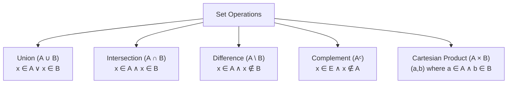
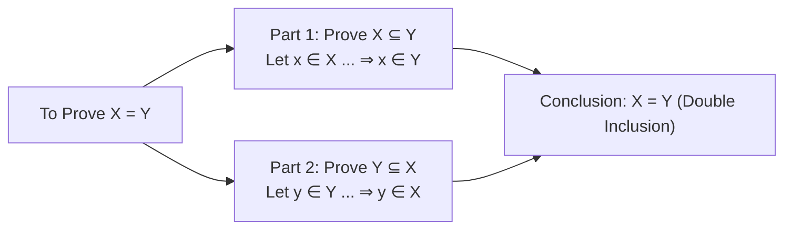

# 05. Set Theory Operations & Algebraic Proofs

> [!NOTE]
> **Course Module Reference:** PMT 1013 (Foundations of Mathematics)
> **Corresponding Lecture Slides:** [05_D09_Set_Theory_Operations_and_Cartesian_Product.pdf](PMAT/1013/Lecture%20Notes/05_D09_Set_Theory_Operations_and_Cartesian_Product.pdf), [05_D10_Set_Identities_and_Element_Proofs.pdf](PMAT/1013/Lecture%20Notes/05_D10_Set_Identities_and_Element_Proofs.pdf)
> **Prerequisites:** Propositional Logic, De Morgan's Laws & Quantifiers (Modules 01 & 02).

---

## 1. Fundamental Set Definitions & Notations

*   **Set (කුලකය):** එකිනෙකට වෙනස් වස්තූන්ගේ මනා ලෙස අර්ථ දක්වන ලද එකතුවකි.
*   **Element / Membership ($\in$):** $x \in A \implies$ "$x$ යනු $A$ හි සාමාජිකයෙකි".
*   **Subset ($\subseteq$ - උපකුලකය):** $A$ හි සිටින සෑම සාමාජිකයෙක්ම $B$ හිද සිටී නම්, $A \subseteq B$ වේ.
    $$\mathbf{A \subseteq B \iff \forall x (x \in A \implies x \in B)}$$
*   **Set Equality ($A = B$ - කුලක සමානතාව):** කුලක දෙකක සිටින සාමාජිකයන් හරියටම සමාන නම් වේ.
    $$\mathbf{A = B \iff (A \subseteq B \land B \subseteq A)}$$
*   **Empty Set ($\emptyset$ - හිස් කුලකය):** කිසිදු සාමාජිකයෙකු නොමැති කුලකයයි. ඕනෑම කුලකයක් $A$ සඳහා **$\emptyset \subseteq A$ සෑමවිටම සත්‍ය වේ**.
*   **Power Set ($\mathcal{P}(A)$ - බල කුලකය):** $A$ හි සියලුම උපකුලක වල එකතුවයි. $A$ හි සාමාජිකයන් $n$ ක් ඇත්නම්, $|\mathcal{P}(A)| = 2^n$ වේ.
    $$\mathcal{P}(A) = \{X : X \subseteq A\}$$

---

## 2. Set Operations (කුලක කර්ම)

| Operation | Formal Definition | Logical Equivalent |
| :--- | :--- | :--- |
| **Union ($A \cup B$)** | $\{x : x \in A \lor x \in B\}$ | $\lor$ (හෝ) |
| **Intersection ($A \cap B$)** | $\{x : x \in A \land x \in B\}$ | $\land$ (සහ) |
| **Set Difference ($A \setminus B$)** | $\{x : x \in A \land x \notin B\}$ | $x \in A \land \neg(x \in B)$ |
| **Complement ($A^c$ / $E \setminus A$)** | $\{x \in E : x \notin A\}$ | $\neg(x \in A)$ |
| **Symmetric Difference ($A \triangle B$)** | $(A \setminus B) \cup (B \setminus A) = (A \cup B) \setminus (A \cap B)$ | $\oplus$ (XOR) |
| **Cartesian Product ($A \times B$)** | $\{(a, b) : a \in A \land b \in B\}$ | Ordered pairs $(a,b)$ |

---

## 3. The Element Method (Double Inclusion Technique)

Pure Mathematics හි කුලක සමීකරණයක් ($X = Y$) ඔප්පු කිරීමට ඇති සම්මත විශ්වවිද්‍යාල ක්‍රමවේදය:

---

## ✍️ Step-by-Step Worked Exam Proofs

### 📌 Problem 1: Difference & Union Identity (End-Exam 2026 Model Paper Q2(b)(i) Part 1)
**Theorem:** Use definitions to prove that **$(A \setminus B) \setminus C = A \setminus (B \cup C)$**.

**Rigorous Proof using Element Method (Double Inclusion):**

*   **Part 1: Prove $(A \setminus B) \setminus C \subseteq A \setminus (B \cup C)$**
    1. Let $x \in (A \setminus B) \setminus C$ be an arbitrary element.
    2. By definition of set difference:
       $$x \in (A \setminus B) \land x \notin C$$
    3. Applying definition of difference to $x \in (A \setminus B)$:
       $$(x \in A \land x \notin B) \land x \notin C$$
    4. By Associative Law of logic:
       $$x \in A \land (x \notin B \land x \notin C)$$
    5. By De Morgan's Law of logic, $(x \notin B \land x \notin C) \equiv \neg(x \in B \lor x \in C) \equiv x \notin (B \cup C)$:
       $$x \in A \land x \notin (B \cup C)$$
    6. By definition of set difference, this means:
       $$x \in A \setminus (B \cup C)$$
    7. Since every element of $(A \setminus B) \setminus C$ belongs to $A \setminus (B \cup C)$:
       $$\mathbf{(A \setminus B) \setminus C \subseteq A \setminus (B \cup C)} \quad \text{--- (1)}$$

*   **Part 2: Prove $A \setminus (B \cup C) \subseteq (A \setminus B) \setminus C$**
    1. Let $y \in A \setminus (B \cup C)$.
    2. By definition of difference:
       $$y \in A \land y \notin (B \cup C)$$
    3. Since $y \notin (B \cup C) \equiv \neg(y \in B \lor y \in C) \equiv (y \notin B \land y \notin C)$:
       $$y \in A \land (y \notin B \land y \notin C)$$
    4. By Associative Law:
       $$(y \in A \land y \notin B) \land y \notin C$$
    5. Since $(y \in A \land y \notin B) \iff y \in (A \setminus B)$:
       $$y \in (A \setminus B) \land y \notin C$$
    6. By definition of set difference:
       $$y \in (A \setminus B) \setminus C$$
    7. Thus:
       $$\mathbf{A \setminus (B \cup C) \subseteq (A \setminus B) \setminus C} \quad \text{--- (2)}$$

*   **Conclusion:**
    From (1) and (2), by double inclusion, **$(A \setminus B) \setminus C = A \setminus (B \cup C)$**. $\blacksquare$

---

### 📌 Problem 2: Disjoint Differences (End-Exam 2026 Model Paper Q2(b)(i) Part 2)
**Theorem:** Use definitions to prove that **$(A \setminus B) \cap (B \setminus C) = \emptyset$**.

**Proof by Contradiction:**
1. Assume to the contrary that $(A \setminus B) \cap (B \setminus C) \neq \emptyset$.
2. Then there exists an element $x \in (A \setminus B) \cap (B \setminus C)$.
3. By definition of intersection:
   $$x \in (A \setminus B) \quad \land \quad x \in (B \setminus C)$$
4. By definition of set difference:
   * $x \in (A \setminus B) \implies x \in A \land \mathbf{x \notin B}$
   * $x \in (B \setminus C) \implies \mathbf{x \in B} \land x \notin C$
5. Combining these statements gives:
   $$\mathbf{x \notin B \quad \land \quad x \in B}$$
6. This is a direct logical contradiction ($\mathbf{F}$).
7. Therefore, no such element $x$ can exist, which proves that **$(A \setminus B) \cap (B \setminus C) = \emptyset$**. $\blacksquare$

---

### 📌 Problem 3: Prove or Disprove (End-Exam 2026 Model Paper Q2(b)(ii))
**Question:** Prove or disprove: **$A \setminus (B \cup C) = (A \setminus B) \cup (A \setminus C)$**.

**Solution (Disproof by Counterexample):**
The statement is **FALSE**. We disprove it by constructing a concrete counterexample.

*   **Counterexample:**
    Let universal set $E = \{1, 2, 3\}$.
    Let $A = \{1, 2\}$, $B = \{1\}$, $C = \{2\}$.
*   **Calculate LHS:**
    $B \cup C = \{1\} \cup \{2\} = \{1, 2\}$.
    $$\text{LHS} = A \setminus (B \cup C) = \{1, 2\} \setminus \{1, 2\} = \mathbf{\emptyset}$$
*   **Calculate RHS:**
    $A \setminus B = \{1, 2\} \setminus \{1\} = \{2\}$.
    $A \setminus C = \{1, 2\} \setminus \{2\} = \{1\}$.
    $$\text{RHS} = (A \setminus B) \cup (A \setminus C) = \{2\} \cup \{1\} = \mathbf{\{1, 2\}}$$
*   **Conclusion:**
    Since $\text{LHS} = \emptyset \neq \{1, 2\} = \text{RHS}$, the statement is **DISPROVED**. $\blacksquare$
    *(Note: The correct identity is $A \setminus (B \cup C) = (A \setminus B) \cap (A \setminus C)$ by De Morgan's Law).*

---

### 📌 Problem 4: Cartesian Product & Difference (End-Exam 2026 Model Paper Q3(a)(i))
**Theorem:** Prove that **$A \times (B \setminus C) = (A \times B) \setminus (A \times C)$**.

**Rigorous Proof using Element Method (Double Inclusion):**

*   **Part 1: Prove $A \times (B \setminus C) \subseteq (A \times B) \setminus (A \times C)$**
    1. Let $(x, y) \in A \times (B \setminus C)$ be an arbitrary ordered pair.
    2. By definition of Cartesian product:
       $$x \in A \quad \land \quad y \in (B \setminus C)$$
    3. By definition of set difference, $y \in (B \setminus C) \implies y \in B \land y \notin C$:
       $$x \in A \quad \land \quad y \in B \quad \land \quad y \notin C$$
    4. Since $x \in A$ and $y \in B$, by definition of Cartesian product:
       $$(x, y) \in A \times B$$
    5. Now suppose to the contrary that $(x, y) \in A \times C$.
       Then by definition, $x \in A$ and $y \in C$, which directly contradicts $y \notin C$.
       Therefore, $(x, y) \notin A \times C$.
    6. Since $(x, y) \in A \times B$ and $(x, y) \notin A \times C$, by definition of set difference:
       $$(x, y) \in (A \times B) \setminus (A \times C)$$
    7. Thus, we have proved:
       $$\mathbf{A \times (B \setminus C) \subseteq (A \times B) \setminus (A \times C)} \quad \text{--- (1)}$$

*   **Part 2: Prove $(A \times B) \setminus (A \times C) \subseteq A \times (B \setminus C)$**
    1. Let $(x, y) \in (A \times B) \setminus (A \times C)$ be an arbitrary element.
    2. By definition of set difference:
       $$(x, y) \in A \times B \quad \land \quad (x, y) \notin A \times C$$
    3. Since $(x, y) \in A \times B$, we have $x \in A$ and $y \in B$.
    4. Since $(x, y) \notin A \times C \iff \neg(x \in A \land y \in C) \iff (x \notin A \lor y \notin C)$:
       Since we already know $x \in A$ (so $x \notin A$ is false), it must strictly follow that $y \notin C$.
    5. Now we have $y \in B$ and $y \notin C$, which means $y \in (B \setminus C)$.
    6. Since $x \in A$ and $y \in (B \setminus C)$, by definition of Cartesian product:
       $$(x, y) \in A \times (B \setminus C)$$
    7. Thus, we have proved:
       $$\mathbf{(A \times B) \setminus (A \times C) \subseteq A \times (B \setminus C)} \quad \text{--- (2)}$$

*   **Conclusion:**
    From (1) and (2), by double inclusion, **$A \times (B \setminus C) = (A \times B) \setminus (A \times C)$**. $\blacksquare$

---

### 📌 Problem 5: Cartesian Product Subset Monotonicity (End-Exam 2026 Model Paper Q3(a)(ii))
**Theorem:** Prove that **$B \subseteq C \implies A \times B \subseteq A \times C$**.

**Direct Proof:**
1. Assume $B \subseteq C$.
2. To show $A \times B \subseteq A \times C$, let $(x, y) \in A \times B$ be an arbitrary element.
3. By definition of Cartesian product, $(x, y) \in A \times B \implies x \in A \land y \in B$.
4. Since $y \in B$ and by hypothesis $B \subseteq C$, it follows that $y \in C$.
5. Now we have $x \in A$ and $y \in C$.
6. By definition of Cartesian product, this implies $(x, y) \in A \times C$.
7. Since every $(x, y) \in A \times B$ is in $A \times C$, we conclude $A \times B \subseteq A \times C$. $\blacksquare$

---

## ⚠️ Exam Traps & Common Pitfalls

> [!CAUTION]
> **1. Cartesian Product හි සාමාජිකයන් තනි අකුරු ලෙස ගැනීම:**
> $A \times B$ හි සාමාජිකයෙක් තෝරාගැනීමේදී "Let $x \in A \times B$" ලෙස නොගෙන, **අනිවාර්යයෙන්ම "Let $(x, y) \in A \times B$" (Ordered Pair)** ලෙස ලියන්න.
> 
> **2. $\in$ (Element) සහ $\subseteq$ (Subset) පටලවා ගැනීම:**
> *   $A = \{1, 2\}$ නම්, $1 \in A$ (True), $\{1\} \subseteq A$ (True), නමුත් $\{1\} \in A$ (False!).
> *   $\emptyset \subseteq A$ (සැමට True), නමුත් $\emptyset \in A$ වන්නේ $A = \{\emptyset, 1\}$ ලෙස හිස් කුලකය සාමාජිකයෙකු ලෙස පැවතුණහොත් පමණි.
