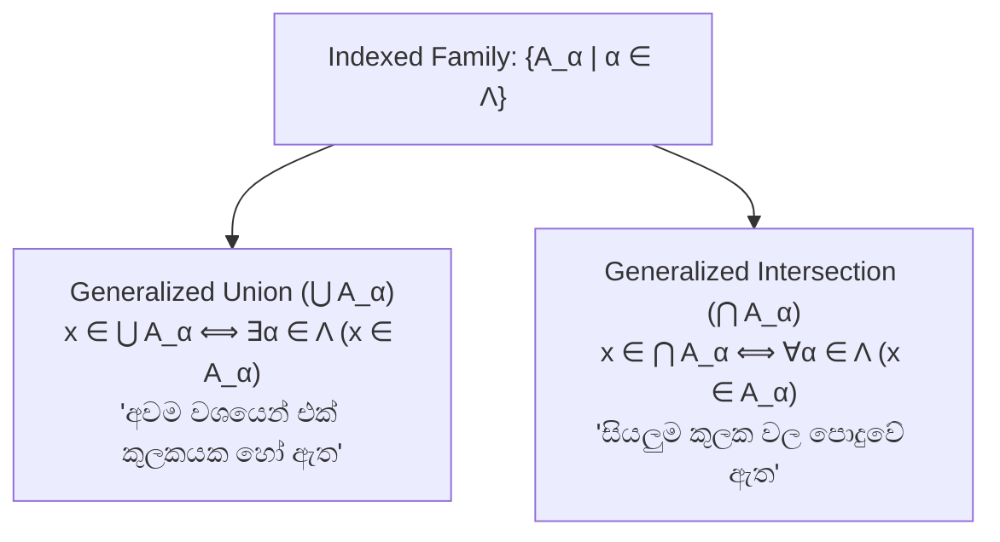
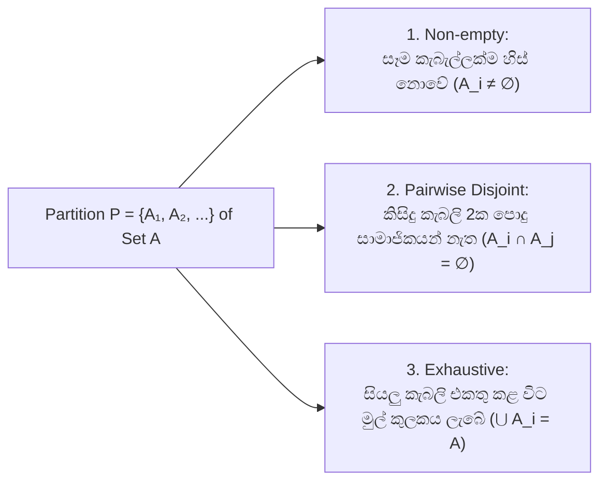

# 06. Indexed Families of Sets & Partitions

> [!NOTE]
> **Course Module Reference:** PMT 1013 (Foundations of Mathematics)
> **Corresponding Lecture Slides:** [06_D11_Indexed_Families_of_Sets.pdf](../06_D11_Indexed_Families_of_Sets.pdf), [06_D12_Set_Partitions_and_Inclusion_Exclusion.pdf](../06_D12_Set_Partitions_and_Inclusion_Exclusion.pdf)
> **Prerequisites:** Quantifiers ($\forall, \exists$) & Set Operations (Modules 02 & 05).

---

## 1. Indexed Families of Sets (දර්ශකගත කුලක පවුල්)

කුලක 2ක් හෝ 3ක් වෙනුවට, අපට කුලක දහස් ගණනක් හෝ අනන්ත කුලක එකතුවක් තිබිය හැක. එවිට ඒ සෑම කුලකයකටම ලේබලයක් (Index) ලබාදී කුලක පවුලක් (Family of Sets) ලෙස හඳුන්වයි.

*   **Indexing Set ($\Lambda$ හෝ $I$):** ලේබල් අඩංගු කුලකයයි (උදා: $\Lambda = \mathbb{N} = \{1, 2, 3, \dots\}$).
*   **Indexed Family:** $\mathcal{A} = \{A_\alpha : \alpha \in \Lambda\}$. (එනම් $A_1, A_2, A_3, \dots$).

### 📜 Formal Definitions

1. **Generalized Union (සර්වත්‍ර මේලය):**
   $$\mathbf{x \in \bigcup_{\alpha \in \Lambda} A_\alpha \iff \exists \alpha \in \Lambda \text{ such that } x \in A_\alpha}$$
   
2. **Generalized Intersection (සර්වත්‍ර ඡේදනය):**
   $$\mathbf{x \in \bigcap_{\alpha \in \Lambda} A_\alpha \iff \forall \alpha \in \Lambda, x \in A_\alpha}$$

---

## 2. Generalized De Morgan's & Distributive Laws

### 🌟 Generalized De Morgan's Laws:
$$\left( \bigcup_{\alpha \in \Lambda} A_\alpha \right)^c = \bigcap_{\alpha \in \Lambda} A_\alpha^c \qquad \text{සහ} \qquad \left( \bigcap_{\alpha \in \Lambda} A_\alpha \right)^c = \bigcup_{\alpha \in \Lambda} A_\alpha^c$$

### 🌟 Generalized Distributive Laws:
$$B \cup \left( \bigcap_{\alpha \in \Lambda} A_\alpha \right) = \bigcap_{\alpha \in \Lambda} (B \cup A_\alpha) \qquad \text{සහ} \qquad B \cap \left( \bigcup_{\alpha \in \Lambda} A_\alpha \right) = \bigcup_{\alpha \in \Lambda} (B \cap A_\alpha)$$

---

## 3. Partitions of a Set (කුලකයක කොටස් කිරීම්)

හිස් නොවන කුලකයක් $A$ කැබලි (Subsets) වලට වෙන් කිරීමකි.

### 📜 Formal Definition of a Partition
කුලකයක $A$ හි උපකුලක එකතුවක් වන $\mathcal{P} = \{A_i : i \in I\}$ යනු $A$ හි **Partition (කොටස් කිරීමක්)** වන්නේ පහත කොන්දේසි 3ම තෘප්ත වේ නම් පමණි:
1. $\forall i \in I, A_i \neq \emptyset$ (කිසිදු උපකුලකයක් හිස් නොවිය යුතුය).
2. $\forall i, j \in I (i \neq j \implies A_i \cap A_j = \emptyset)$ (එකිනෙකින් වියුක්ත විය යුතුය).
3. $\bigcup_{i \in I} A_i = A$ (සියල්ලේ මේලය මුල් කුලකය විය යුතුය).

---

## ✍️ Step-by-Step Worked Exam Proofs

### 📌 Problem 1: Generalized Distributive Law over Intersection (End-Exam 2026 Model Paper Q3(c)(i))
**Theorem:** Let $\Lambda$ be a non-empty indexing set, $\mathcal{A} = \{A_\alpha : \alpha \in \Lambda\}$ be an indexed family of sets, and $B$ be any set. Prove that:
$$\mathbf{B \cup \bigcap_{\alpha \in \Lambda} A_\alpha = \bigcap_{\alpha \in \Lambda} (B \cup A_\alpha)}$$

**Rigorous Proof:**
Let $x$ be an arbitrary element in the universal set $E$.
$$\begin{aligned}
x \in B \cup \bigcap_{\alpha \in \Lambda} A_\alpha &\iff x \in B \lor x \in \bigcap_{\alpha \in \Lambda} A_\alpha && \text{(Def. of Union)} \\
&\iff x \in B \lor (\forall \alpha \in \Lambda, x \in A_\alpha) && \text{(Def. of Generalized Intersection)} \\
&\iff \forall \alpha \in \Lambda (x \in B \lor x \in A_\alpha) && \text{(Distributive Law of Logic)} \\
&\iff \forall \alpha \in \Lambda (x \in B \cup A_\alpha) && \text{(Def. of Union)} \\
&\iff x \in \bigcap_{\alpha \in \Lambda} (B \cup A_\alpha) && \text{(Def. of Generalized Intersection)}
\end{aligned}$$
Since each step is a bidirectional logical equivalence ($\iff$), this completes the proof that $B \cup \bigcap_{\alpha \in \Lambda} A_\alpha = \bigcap_{\alpha \in \Lambda} (B \cup A_\alpha)$. $\blacksquare$

---

### 📌 Problem 2: Generalized Distributive Law over Union (End-Exam 2026 Model Paper Q3(c)(ii))
**Theorem:** Show that:
$$\mathbf{B \cap \bigcup_{\alpha \in \Lambda} A_\alpha = \bigcup_{\alpha \in \Lambda} (B \cap A_\alpha)}$$

**Rigorous Proof:**
Let $x$ be an arbitrary element.
$$\begin{aligned}
x \in B \cap \bigcup_{\alpha \in \Lambda} A_\alpha &\iff x \in B \land x \in \bigcup_{\alpha \in \Lambda} A_\alpha && \text{(Def. of Intersection)} \\
&\iff x \in B \land (\exists \alpha \in \Lambda \text{ such that } x \in A_\alpha) && \text{(Def. of Generalized Union)} \\
&\iff \exists \alpha \in \Lambda (x \in B \land x \in A_\alpha) && \text{(Distributive Law of Logic)} \\
&\iff \exists \alpha \in \Lambda (x \in B \cap A_\alpha) && \text{(Def. of Intersection)} \\
&\iff x \in \bigcup_{\alpha \in \Lambda} (B \cap A_\alpha) && \text{(Def. of Generalized Union)}
\end{aligned}$$
Thus, $B \cap \bigcup_{\alpha \in \Lambda} A_\alpha = \bigcup_{\alpha \in \Lambda} (B \cap A_\alpha)$. $\blacksquare$

---

### 📌 Problem 3: Sequence Family Analysis (End-Exam 2026 Model Paper Q3(b))
**Question:** For each $n \in \mathbb{Z}$, define $A_n = \{k \mid k \in \mathbb{N} \text{ and } k > n\}$. Determine whether the following statements are true or false. Justify your answer.
> (i) $A_1 = \mathbb{N}$  
> (ii) For all $i, j \in \mathbb{N}$, if $i < j$, then $A_i \subseteq A_j$  
> (iii) $\bigcap_{i \in \mathbb{N}} A_i = \emptyset$

**Step-by-Step Justifications:**

**(i) $A_1 = \mathbb{N}$:**
*   By definition, $A_1 = \{k \in \mathbb{N} \mid k > 1\} = \{2, 3, 4, 5, \dots\}$.
*   $\mathbb{N} = \{1, 2, 3, 4, 5, \dots\}$.
*   Notice that $1 \in \mathbb{N}$ but $1 \notin A_1$ (since $1 \ngtr 1$).
*   **Verdict:** **FALSE**. (In fact, $A_0 = \mathbb{N}$, not $A_1$).

**(ii) If $i < j$, then $A_i \subseteq A_j$:**
*   Let $i = 1$ and $j = 2$. Clearly $1 < 2$.
*   $A_1 = \{2, 3, 4, 5, \dots\}$ and $A_2 = \{3, 4, 5, \dots\}$.
*   Notice that $2 \in A_1$ but $2 \notin A_2$.
*   Thus $A_1 \not\subseteq A_2$. (In reality, $i < j \implies A_j \subseteq A_i$, not the other way around!).
*   **Verdict:** **FALSE**.

**(iii) $\bigcap_{i \in \mathbb{N}} A_i = \emptyset$:**
*   Assume to the contrary that $\bigcap_{i \in \mathbb{N}} A_i \neq \emptyset$.
*   Then there exists an element $m \in \bigcap_{i \in \mathbb{N}} A_i$.
*   By definition of generalized intersection, $m \in A_i$ for **ALL** $i \in \mathbb{N}$.
*   Since $m \in \mathbb{N}$, choose the specific index $i = m \in \mathbb{N}$.
*   Then $m \in A_m \implies m > m$, which is an absurd contradiction ($m \ngtr m$).
*   **Verdict:** **TRUE**. $\blacksquare$

---

## ⚠️ Exam Traps & Common Pitfalls

> [!CAUTION]
> **1. Quantifiers ($\forall$ vs $\exists$) generalized operations වලදී මාරු වීම:**
> *   $x \in \bigcup A_\alpha \implies \exists \alpha$ (අවම එකක්).
> *   $x \in \bigcap A_\alpha \implies \forall \alpha$ (සියල්ලම).
> *   $\neg(x \in \bigcap A_\alpha) \iff x \notin \bigcap A_\alpha \iff \exists \alpha (x \notin A_\alpha)$.
> 
> **2. Nested Sets වල Subset දිශාව:**
> $k > n$ මගින් $n$ විශාල වන විට කුලකය **කුඩා වේ** ($A_1 \supset A_2 \supset A_3 \dots$). එබැවින් $i < j \implies A_j \subseteq A_i$ මිස $A_i \subseteq A_j$ නොවේ!
