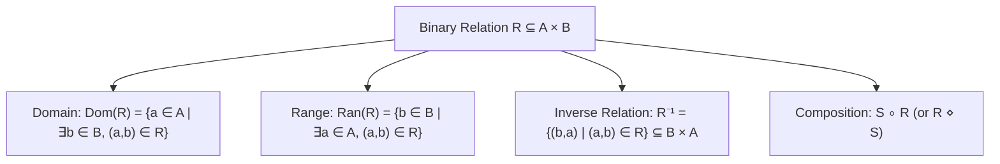
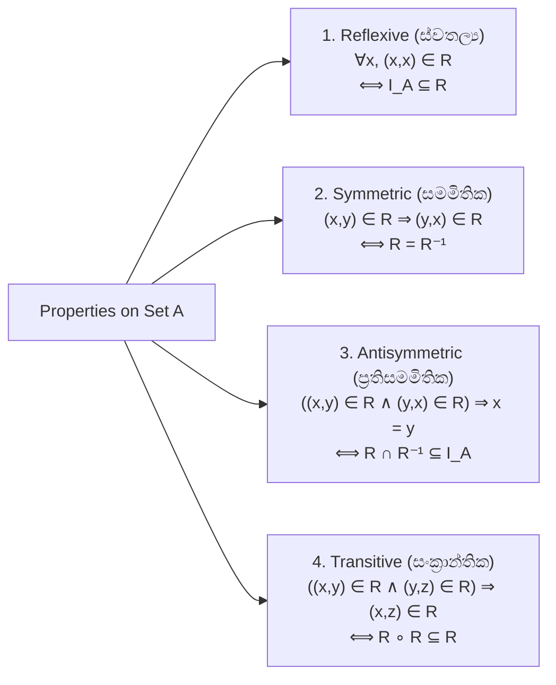

# 07. Binary Relations & Properties

> [!NOTE]
> **Course Module Reference:** PMT 1013 (Foundations of Mathematics)
> **Corresponding Lecture Slides:** [07_D13_Binary_Relations_and_Compositions.pdf](../07_D13_Binary_Relations_and_Compositions.pdf), [07_D14_Relation_Properties_and_Proofs.pdf](../07_D14_Relation_Properties_and_Proofs.pdf)
> **Prerequisites:** Cartesian Products & Set Operations (Module 05).

---

## 1. Binary Relations (ද්විපද සම්බන්ධතා)

*   **Binary Relation from $A$ to $B$ ($R$):** කාටීසීය ගුණිතයේ $A \times B$ ඕනෑම උපකුලකයකි ($R \subseteq A \times B$).
*   **Relation on a Set $A$ ($R$):** $R \subseteq A \times A$ වූ විට.
*   **Notation:** $(a, b) \in R$ යන්න **$a R b$** ලෙසද ලියයි ("$a$ is related to $b$").

### 📜 Identity Relation ($I_A$)
කුලකයක $A$ සාමාජිකයන් තමන්ටම පමණක් සම්බන්ධ වන විශේෂ සම්බන්ධතාවය:
$$I_A = \{(x, x) \mid x \in A\}$$

### 📜 Composition of Relations ($S \circ R$)
Let $R \subseteq A \times B$ and $S \subseteq B \times C$.
$$\mathbf{S \circ R = \{(a, c) \in A \times C \mid \exists b \in B \text{ such that } (a, b) \in R \land (b, c) \in S\}}$$
*(Note: සමහර පෙළපොත් වල සහ දේශන වල මෙය $R \diamond S$ ලෙසද ලියයි).*

---

## 2. Fundamental Relation Inversion Theorems

### 🌟 4 Essential Inversion Identities (Model Paper Q4(a)):
1. **Double Inversion:** $\mathbf{(R^{-1})^{-1} = R}$
2. **Subset Monotonicity:** $\mathbf{R \subseteq S \implies R^{-1} \subseteq S^{-1}}$
3. **Union Inversion:** $\mathbf{(R \cup S)^{-1} = R^{-1} \cup S^{-1}}$
4. **Composition Inversion:** $\mathbf{(S \circ R)^{-1} = R^{-1} \circ S^{-1}}$

---

## 3. The 4 Fundamental Properties of Relations on a Set $A$

Pure Mathematics හි සම්බන්ධතාවයක වැදගත්ම ලක්ෂණ 4 සහ ඒවායේ **කුලක වීජීය (Set-Theoretic) සූත්‍ර**:

| Property | Element Definition | Set / Algebraic Characterization |
| :--- | :--- | :--- |
| **Reflexive (ස්වතල්‍ය)** | $\forall x \in A, (x, x) \in R$ | $\mathbf{I_A \subseteq R}$ |
| **Symmetric (සමමිතික)** | $\forall x, y \in A, (x, y) \in R \implies (y, x) \in R$ | $\mathbf{R = R^{-1}}$ (or $R^{-1} \subseteq R$) |
| **Antisymmetric (ප්‍රතිසමමිතික)** | $\forall x, y \in A, [(x, y) \in R \land (y, x) \in R] \implies x = y$ | $\mathbf{R \cap R^{-1} \subseteq I_A}$ |
| **Transitive (සංක්‍රාන්තික)** | $\forall x, y, z \in A, [(x, y) \in R \land (y, z) \in R] \implies (x, z) \in R$ | $\mathbf{R \circ R \subseteq R}$ (or $R \diamond R \subseteq R$) |

---

## ✍️ Step-by-Step Worked Exam Proofs

### 📌 Problem 1: Inverse Relation Identities (End-Exam 2026 Model Paper Q4(a))
**Theorem:** Let $\mathcal{R}$ and $\mathcal{S}$ be relations on a set $A$. Prove that:
> (i) $(\mathcal{R}^{-1})^{-1} = \mathcal{R}$  
> (ii) $\mathcal{R} \subseteq \mathcal{S} \implies \mathcal{R}^{-1} \subseteq \mathcal{S}^{-1}$  
> (iii) $(\mathcal{R} \cup \mathcal{S})^{-1} = \mathcal{R}^{-1} \cup \mathcal{S}^{-1}$

**Rigorous Proofs:**

**(i) Prove $(\mathcal{R}^{-1})^{-1} = \mathcal{R}$:**
Let $(x, y)$ be an arbitrary ordered pair in $A \times A$.
$$\begin{aligned}
(x, y) \in (\mathcal{R}^{-1})^{-1} &\iff (y, x) \in \mathcal{R}^{-1} && \text{(Def. of inverse relation)} \\
&\iff (x, y) \in \mathcal{R} && \text{(Def. of inverse relation)}
\end{aligned}$$
Since $(x, y) \in (\mathcal{R}^{-1})^{-1} \iff (x, y) \in \mathcal{R}$, we have $(\mathcal{R}^{-1})^{-1} = \mathcal{R}$. $\blacksquare$

**(ii) Prove $\mathcal{R} \subseteq \mathcal{S} \implies \mathcal{R}^{-1} \subseteq \mathcal{S}^{-1}$:**
1. Assume $\mathcal{R} \subseteq \mathcal{S}$.
2. Let $(x, y) \in \mathcal{R}^{-1}$ be an arbitrary element.
3. By definition of inverse, $(x, y) \in \mathcal{R}^{-1} \implies (y, x) \in \mathcal{R}$.
4. Since $(y, x) \in \mathcal{R}$ and $\mathcal{R} \subseteq \mathcal{S}$, it follows that $(y, x) \in \mathcal{S}$.
5. By definition of inverse, $(y, x) \in \mathcal{S} \implies (x, y) \in \mathcal{S}^{-1}$.
6. Therefore, $\mathcal{R}^{-1} \subseteq \mathcal{S}^{-1}$. $\blacksquare$

**(iii) Prove $(\mathcal{R} \cup \mathcal{S})^{-1} = \mathcal{R}^{-1} \cup \mathcal{S}^{-1}$:**
Let $(x, y) \in A \times A$.
$$\begin{aligned}
(x, y) \in (\mathcal{R} \cup \mathcal{S})^{-1} &\iff (y, x) \in \mathcal{R} \cup \mathcal{S} && \text{(Def. of inverse)} \\
&\iff (y, x) \in \mathcal{R} \lor (y, x) \in \mathcal{S} && \text{(Def. of union)} \\
&\iff (x, y) \in \mathcal{R}^{-1} \lor (x, y) \in \mathcal{S}^{-1} && \text{(Def. of inverse)} \\
&\iff (x, y) \in \mathcal{R}^{-1} \cup \mathcal{S}^{-1} && \text{(Def. of union)}
\end{aligned}$$
Thus $(\mathcal{R} \cup \mathcal{S})^{-1} = \mathcal{R}^{-1} \cup \mathcal{S}^{-1}$. $\blacksquare$

---

### 📌 Problem 2: Transitivity Set-Theoretic Characterization (End-Exam 2026 Model Paper Q4(b)(i))
**Theorem:** Prove that a relation $\mathcal{R}$ on a set $A$ is **transitive if and only if $\mathcal{R} \circ \mathcal{R} \subseteq \mathcal{R}$** (i.e. $\mathcal{R} \diamond \mathcal{R} \subseteq \mathcal{R}$).

**Proof of $(\implies)$ Direction (Transitive $\implies \mathcal{R} \circ \mathcal{R} \subseteq \mathcal{R}$):**
1. Assume $\mathcal{R}$ is transitive.
2. Let $(x, z) \in \mathcal{R} \circ \mathcal{R}$ be an arbitrary element.
3. By definition of composition, $\exists y \in A$ such that $(x, y) \in \mathcal{R}$ and $(y, z) \in \mathcal{R}$.
4. Since $\mathcal{R}$ is transitive, $(x, y) \in \mathcal{R} \land (y, z) \in \mathcal{R} \implies (x, z) \in \mathcal{R}$.
5. Therefore, $\mathcal{R} \circ \mathcal{R} \subseteq \mathcal{R}$.

**Proof of $(\impliedby)$ Direction ($\mathcal{R} \circ \mathcal{R} \subseteq \mathcal{R} \implies$ Transitive):**
1. Assume $\mathcal{R} \circ \mathcal{R} \subseteq \mathcal{R}$.
2. Let $x, y, z \in A$ such that $(x, y) \in \mathcal{R}$ and $(y, z) \in \mathcal{R}$.
3. By definition of composition, $(x, y) \in \mathcal{R} \land (y, z) \in \mathcal{R} \implies (x, z) \in \mathcal{R} \circ \mathcal{R}$.
4. Since $\mathcal{R} \circ \mathcal{R} \subseteq \mathcal{R}$, it directly follows that $(x, z) \in \mathcal{R}$.
5. Hence, by definition, $\mathcal{R}$ is transitive.

**Conclusion:** $\mathcal{R}$ is transitive $\iff \mathcal{R} \circ \mathcal{R} \subseteq \mathcal{R}$. $\blacksquare$

---

### 📌 Problem 3: Antisymmetry Set-Theoretic Characterization (End-Exam 2026 Model Paper Q4(b)(ii))
**Theorem:** Prove that $\mathcal{R}$ is **antisymmetric if and only if $\mathcal{R} \cap \mathcal{R}^{-1} \subseteq I_A$**.

**Proof of $(\implies)$ Direction:**
1. Assume $\mathcal{R}$ is antisymmetric.
2. Let $(x, y) \in \mathcal{R} \cap \mathcal{R}^{-1}$.
3. Then $(x, y) \in \mathcal{R}$ and $(x, y) \in \mathcal{R}^{-1} \implies (y, x) \in \mathcal{R}$.
4. By antisymmetry of $\mathcal{R}$, $(x, y) \in \mathcal{R} \land (y, x) \in \mathcal{R} \implies x = y$.
5. Since $x = y$, $(x, y) = (x, x) \in I_A$.
6. Thus, $\mathcal{R} \cap \mathcal{R}^{-1} \subseteq I_A$.

**Proof of $(\impliedby)$ Direction:**
1. Assume $\mathcal{R} \cap \mathcal{R}^{-1} \subseteq I_A$.
2. Let $x, y \in A$ such that $(x, y) \in \mathcal{R}$ and $(y, x) \in \mathcal{R}$.
3. Since $(y, x) \in \mathcal{R}$, $(x, y) \in \mathcal{R}^{-1}$.
4. Thus $(x, y) \in \mathcal{R} \cap \mathcal{R}^{-1}$.
5. Since $\mathcal{R} \cap \mathcal{R}^{-1} \subseteq I_A$, we must have $(x, y) \in I_A$, which means $x = y$.
6. Hence $\mathcal{R}$ is antisymmetric. $\blacksquare$

---

### 📌 Problem 4: Concrete Relation Analysis & Partial Order Completion (End-Exam 2026 Model Paper Q4(b)(iii))
**Question:** Let $A = \{1, 2, 3, 4\}$ and $\mathcal{R} = \{(1,3), (1,4), (3,2), (3,3), (3,4)\}$.
> (i) Is $\mathcal{R}$ transitive?  
> (ii) Is $\mathcal{R}$ antisymmetric?  
> (iii) Is $\mathcal{R}$ a partial order? If not, add the minimum number of ordered pairs necessary so that it becomes a partial order.

**Detailed Step-by-Step Solution:**

*   **(i) Check Transitivity:**
    Look at the chain: $(1, 3) \in \mathcal{R}$ and $(3, 2) \in \mathcal{R}$.
    For transitivity, we MUST have $(1, 2) \in \mathcal{R}$.
    However, **$(1, 2) \notin \mathcal{R}$**.
    **Verdict:** $\mathcal{R}$ is **NOT transitive**.

*   **(ii) Check Antisymmetry:**
    The pairs in $\mathcal{R}$ are $(1,3), (1,4), (3,2), (3,3), (3,4)$.
    Check if any reverse pairs exist:
    * $(1,3) \in \mathcal{R}$, but $(3,1) \notin \mathcal{R}$ (OK)
    * $(1,4) \in \mathcal{R}$, but $(4,1) \notin \mathcal{R}$ (OK)
    * $(3,2) \in \mathcal{R}$, but $(2,3) \notin \mathcal{R}$ (OK)
    * $(3,4) \in \mathcal{R}$, but $(4,3) \notin \mathcal{R}$ (OK)
    * $(3,3) \in \mathcal{R} \land (3,3) \in \mathcal{R} \implies 3 = 3$ (OK)
    **Verdict:** $\mathcal{R}$ is **Antisymmetric**.

*   **(iii) Check Partial Order & Add Minimum Pairs:**
    A Partial Order must be: **Reflexive, Antisymmetric, and Transitive**.
    1. **To make it Reflexive:** We need all $(x, x)$ for $x \in \{1, 2, 3, 4\}$.
       Currently only $(3,3) \in \mathcal{R}$.
       $\implies$ Must add: **$\{(1,1), (2,2), (4,4)\}$** (3 pairs).
    2. **To make it Transitive:**
       From $(1,3)$ and $(3,2)$, we must add: **$(1,2)$**.
       Check other chains with newly added pairs:
       $(1,3)$ and $(3,4) \implies (1,4) \in \mathcal{R}$ (Already present).
    3. Check if newly formed relation $\mathcal{R}' = \mathcal{R} \cup \{(1,1), (2,2), (4,4), (1,2)\}$ is antisymmetric:
       No symmetric conflicts were created.

**Final Answer:**
Minimum ordered pairs to add = **$\{(1,1), (2,2), (4,4), (1,2)\}$** (4 pairs in total). $\blacksquare$

---

## ⚠️ Exam Traps & Common Pitfalls

> [!CAUTION]
> **1. Symmetric vs Antisymmetric:**
> "Antisymmetric" කියන්නේ "Symmetric නොවේ" (Not symmetric) කියන එක නොවේ! සම්බන්ධතාවයක් එකවර Symmetric මෙන්ම Antisymmetric විය හැක (උදා: $I_A = \{(1,1), (2,2)\}$).
> 
> **2. Transitivity පරීක්ෂාවේදී $(x,y)$ සහ $(y,z)$ සෙවීම:**
> $(x,y) \in R$ වූ විට, $y$ ගෙන් පටන් ගන්නා සියලුම $(y, z) \in R$ පරීක්ෂා කළ යුතුය. එකක් හෝ මඟහැරුණහොත් පිළිතුර වැරදේ.
