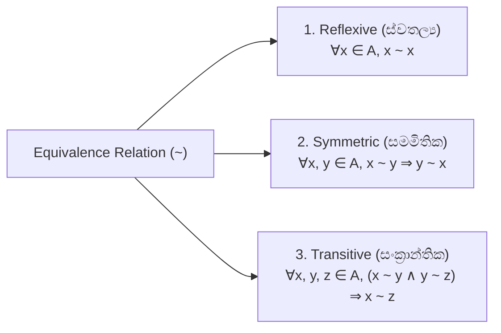

# 08. Equivalence Relations & Congruence Classes

> [!NOTE]
> **Course Module Reference:** PMT 1013 (Foundations of Mathematics)
> **Corresponding Lecture Slides:** [08_D15_Equivalence_Relations_and_Partitions.pdf](../08_D15_Equivalence_Relations_and_Partitions.pdf)
> **Prerequisites:** Relation Properties & Partitions (Modules 06 & 07).

---

## 1. Equivalence Relations (තුල්‍යතා සම්බන්ධතා)

කුලකයක $A$ ඇති සම්බන්ධතාවයක් ($\sim$ හෝ $\mathcal{R}$) **Equivalence Relation (තුල්‍යතා සම්බන්ධතාවයක්)** වන්නේ එය පහත කොන්දේසි 3ම එකවර තෘප්ත කරන්නේ නම් පමණි:

---

## 2. Equivalence Classes (තුල්‍යතා පන්ති)

තුල්‍යතා සම්බන්ධතාවයකදී, එකිනෙකට සම්බන්ධ වන (එක හා සමාන ගතිගුණ ඇති) සියලුම සාමාජිකයන් එකතු කර සාදන උපකුලකයට **Equivalence Class (තුල්‍යතා පන්තිය)** යැයි කියනු ලැබේ.

### 📜 Formal Definition
$x \in A$ හි තුල්‍යතා පන්තිය ($[x]$ හෝ $\bar{x}$ හෝ $cl(x)$):
$$\mathbf{[x] = \{y \in A \mid y \sim x\} = \{y \in A \mid (x, y) \in \mathcal{R}\}}$$

---

## 3. The 3 Master Properties of Equivalence Classes

තුල්‍යතා පන්ති වල වඩාත්ම වැදගත් ලක්ෂණ 3:

1. **Non-emptiness:** $\forall x \in A, x \in [x]$ (ස්වතල්‍යතාව නිසා සෑම සාමාජිකයෙක්ම තමන්ගේම පන්තිය තුළ සිටී).
2. **Equality vs Disjointness:** ඕනෑම පන්ති දෙකක් ගත් විට, **ඒවා එකිනෙකට සම්පූර්ණයෙන්ම සමාන වේ ($[x] = [y]$) නැතහොත් සම්පූර්ණයෙන්ම වියුක්ත වේ ($[x] \cap [y] = \emptyset$)**. (අඩක් ඡේදනය වන පන්ති පැවතිය නොහැක!).
3. **Exhaustive Union:** සියලුම තුල්‍යතා පන්ති වල මේලය මුල් කුලකය ($A$) ලබා දෙයි.
   $$\mathbf{A = \bigcup_{x \in A} [x]}$$

---

## 4. Fundamental Theorem of Equivalence Relations (Partition Theorem)

> [!IMPORTANT]
> **The Partition Theorem:**
> 1. කුලකයක් $A$ මත අර්ථ දක්වන ඕනෑම Equivalence Relation එකක් මගින් $A$ කුලකය **Partition (වියුක්ත කොටස් වලට)** බෙදනු ලබයි.
> 2. ආපසු හැරවූ විට, $A$ හි ඕනෑම Partition එකක් මගින් $A$ මත Equivalence Relation එකක් ඇති කරයි.

---

## ✍️ Step-by-Step Worked Exam Proofs

### 📌 Problem 1: Equivalence of Elements and Classes (End-Exam 2026 Model Paper Q4(c)(i))
**Theorem:** Let $A$ be a non-empty set and "$\sim$" an equivalence relation on $A$. Prove that for any $x, y \in A$:
$$\mathbf{x \sim y \iff [x] = [y]}$$

**Rigorous Proof:**

*   **Part 1: Prove $(\implies)$ Direction ($x \sim y \implies [x] = [y]$)**
    1. Assume $x \sim y$.
    2. We prove $[x] = [y]$ using double inclusion ($[x] \subseteq [y]$ and $[y] \subseteq [x]$):
       * **To show $[x] \subseteq [y]$:**
         Let $z \in [x]$. By definition, $z \sim x$.
         Since $z \sim x$ and $x \sim y$, by **Transitivity** of $\sim$, we have $z \sim y$.
         By definition of $[y]$, $z \sim y \implies z \in [y]$.
         Therefore, **$[x] \subseteq [y]$**.
       * **To show $[y] \subseteq [x]$:**
         Let $w \in [y]$. By definition, $w \sim y$.
         Since $x \sim y$, by **Symmetry** of $\sim$, we have $y \sim x$.
         Now $w \sim y$ and $y \sim x \implies w \sim x$ by **Transitivity**.
         Thus $w \in [x]$, which proves **$[y] \subseteq [x]$**.
    3. From both inclusions, $[x] = [y]$.

*   **Part 2: Prove $(\impliedby)$ Direction ($[x] = [y] \implies x \sim y$)**
    1. Assume $[x] = [y]$.
    2. By **Reflexivity** of $\sim$, $x \sim x \implies x \in [x]$.
    3. Since $[x] = [y]$, it follows that $x \in [y]$.
    4. By definition of $[y]$, $x \in [y] \implies x \sim y$.

*   **Conclusion:**
    Combining Part 1 and Part 2, $x \sim y \iff [x] = [y]$. $\blacksquare$

---

### 📌 Problem 2: Union of Equivalence Classes (End-Exam 2026 Model Paper Q4(c)(ii))
**Theorem:** Let $A$ be a non-empty set and "$\sim$" an equivalence relation on $A$. Prove that:
$$\mathbf{A = \bigcup_{x \in A} [x]}$$

**Rigorous Proof (Double Inclusion):**

*   **Part 1: Prove $\bigcup_{x \in A} [x] \subseteq A$**
    1. For each $x \in A$, by definition $[x] = \{y \in A \mid y \sim x\} \subseteq A$.
    2. Since each $[x]$ is a subset of $A$, the union of all such subsets is also contained in $A$:
       $$\bigcup_{x \in A} [x] \subseteq A$$

*   **Part 2: Prove $A \subseteq \bigcup_{x \in A} [x]$**
    1. Let $a \in A$ be an arbitrary element.
    2. By reflexivity of $\sim$, $a \sim a$, which implies $a \in [a]$.
    3. Since $[a]$ is one of the sets in the family $\{[x] \mid x \in A\}$, it follows by definition of union that:
       $$a \in [a] \subseteq \bigcup_{x \in A} [x]$$
    4. Thus $a \in \bigcup_{x \in A} [x]$, proving $A \subseteq \bigcup_{x \in A} [x]$.

*   **Conclusion:**
    By double inclusion, $A = \bigcup_{x \in A} [x]$. $\blacksquare$

---

### 📌 Problem 3: Congruence Modulo 3 & Partitions (End-Exam 2026 Model Paper Q4(d))
**Question:** Relation $\rho$ on $\mathbb{Z}$ is defined by:
$$x \rho y \iff 3 \mid (x - y)$$
> (i) Show that $\rho$ is an equivalence relation on $\mathbb{Z}$.  
> (ii) Find the equivalence classes $[0], [1], [2]$.  
> (iii) Show that $\{[0], [1], [2]\}$ is a partition of $\mathbb{Z}$.

**Detailed Step-by-Step Solution:**

*   **(i) Prove $\rho$ is an Equivalence Relation:**
    1. **Reflexive:** For any $x \in \mathbb{Z}$, $x - x = 0 = 3(0)$. Since $0 \in \mathbb{Z}$, $3 \mid (x - x) \implies x \rho x$. $\therefore \rho$ is reflexive.
    2. **Symmetric:** Let $x, y \in \mathbb{Z}$ such that $x \rho y$.
       $x \rho y \implies 3 \mid (x - y) \implies x - y = 3k$ for some $k \in \mathbb{Z}$.
       Then $y - x = -(x - y) = -3k = 3(-k)$. Since $-k \in \mathbb{Z}$, $3 \mid (y - x) \implies y \rho x$. $\therefore \rho$ is symmetric.
    3. **Transitive:** Let $x, y, z \in \mathbb{Z}$ such that $x \rho y$ and $y \rho z$.
       $x \rho y \implies x - y = 3k_1$ ($k_1 \in \mathbb{Z}$) and $y \rho z \implies y - z = 3k_2$ ($k_2 \in \mathbb{Z}$).
       Add the two equations:
       $$(x - y) + (y - z) = 3k_1 + 3k_2 \implies x - z = 3(k_1 + k_2)$$
       Since $k_1 + k_2 \in \mathbb{Z}$, $3 \mid (x - z) \implies x \rho z$. $\therefore \rho$ is transitive.
    4. Since $\rho$ is reflexive, symmetric, and transitive, it is an **Equivalence Relation**.

*   **(ii) Find the Equivalence Classes $[0], [1], [2]$:**
    *   **$[0]$:** $\{x \in \mathbb{Z} \mid x \rho 0\} = \{x \in \mathbb{Z} \mid 3 \mid (x - 0)\} = \{x \in \mathbb{Z} \mid x = 3k\} = \mathbf{\{\dots, -6, -3, 0, 3, 6, 9, \dots\}}$
    *   **$[1]$:** $\{x \in \mathbb{Z} \mid x \rho 1\} = \{x \in \mathbb{Z} \mid 3 \mid (x - 1)\} = \{x \in \mathbb{Z} \mid x = 3k + 1\} = \mathbf{\{\dots, -5, -2, 1, 4, 7, 10, \dots\}}$
    *   **$[2]$:** $\{x \in \mathbb{Z} \mid x \rho 2\} = \{x \in \mathbb{Z} \mid 3 \mid (x - 2)\} = \{x \in \mathbb{Z} \mid x = 3k + 2\} = \mathbf{\{\dots, -4, -1, 2, 5, 8, 11, \dots\}}$

*   **(iii) Show $\{[0], [1], [2]\}$ is a Partition of $\mathbb{Z}$:**
    We verify the 3 partition conditions:
    1. **Non-empty:** $[0] \neq \emptyset, [1] \neq \emptyset, [2] \neq \emptyset$ (e.g. $0 \in [0], 1 \in [1], 2 \in [2]$).
    2. **Pairwise Disjoint:** By the Division Algorithm, every integer $x$ when divided by 3 has an unique remainder $r \in \{0, 1, 2\}$. Since remainders cannot be equal, $[0] \cap [1] = \emptyset$, $[1] \cap [2] = \emptyset$, and $[0] \cap [2] = \emptyset$.
    3. **Exhaustive Union:** By the Division Algorithm, for any $n \in \mathbb{Z}$, $n = 3q + r$ where $r \in \{0, 1, 2\}$. Hence every integer belongs to either $[0], [1]$, or $[2]$.
       Thus $[0] \cup [1] \cup [2] = \mathbb{Z}$.
    **Conclusion:** $\{[0], [1], [2]\}$ is a **Partition of $\mathbb{Z}$**. $\blacksquare$

---

## ⚠️ Exam Traps & Common Pitfalls

> [!CAUTION]
> **1. Symmetric සහ Transitive ඔප්පු කිරීමේදී $\exists k \in \mathbb{Z}$ ප්‍රකාශ නොකිරීම:**
> $3 \mid (x-y)$ ලිවීමේදී "$\implies x - y = 3k$ where $k \in \mathbb{Z}$" යනුවෙන් නිඛිලයක් පවතින බව සඳහන් කළ යුතුය.
> 
> **2. Partition හි කොන්දේසි 3ම නොලිවීම:**
> බොහෝ සිසුන් Disjoint බව පමණක් පෙන්වා Union එක $\mathbb{Z}$ බව පෙන්වීම අමතක කරයි. ලකුණු ලබා ගැනීමට කරුණු 3ම අත්‍යවශ්‍ය වේ!
