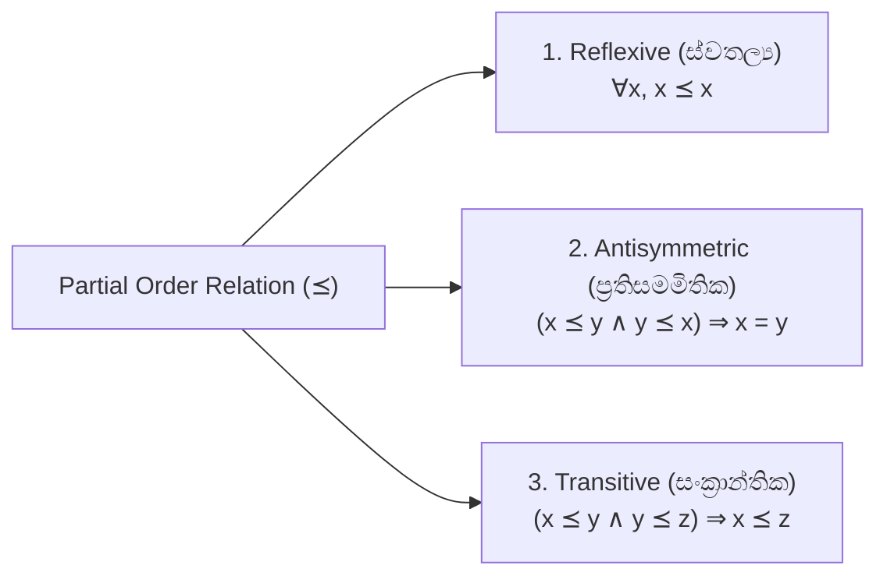
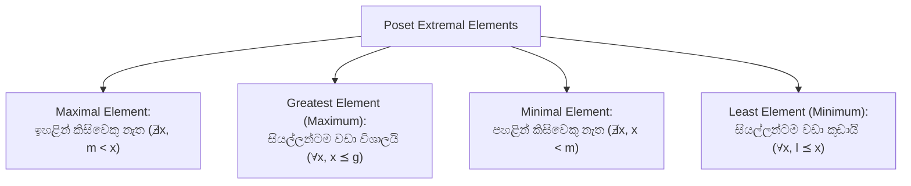

# 09. Posets, Hasse Diagrams & Lattices

> [!NOTE]
> **Course Module Reference:** PMT 1013 (Foundations of Mathematics)
> **Corresponding Lecture Slides:** [09_D16_Partial_Orders_Posets_and_Hasse_Diagrams.pdf](../09_D16_Partial_Orders_Posets_and_Hasse_Diagrams.pdf), [09_D17_Lattices_and_Total_Orders.pdf](../09_D17_Lattices_and_Total_Orders.pdf)
> **Prerequisites:** Relation Properties: Reflexivity, Antisymmetry, Transitivity (Module 07).

---

## 1. Partially Ordered Sets (Posets)

කුලකයක $A$ ඇති සම්බන්ධතාවයක් ($\preceq$ හෝ $\le$) **Partial Order (අර්ධ අනුපිළිවෙලක්)** වන්නේ එය පහත කොන්දේසි 3ම තෘප්ත කරන්නේ නම් පමණි:



*   **Poset:** $(A, \preceq)$ යුගලය **Partially Ordered Set (Poset)** එකක් ලෙස හඳුන්වයි.
*   *ප්‍රධාන උදාහරණ:*
    1. $(\mathbb{R}, \le)$ — සාමාන්‍ය කුඩා හෝ සමාන සම්බන්ධතාව.
    2. $(\mathcal{P}(S), \subseteq)$ — කුලක අඩංගු වීමේ සම්බන්ධතාව.
    3. $(\mathbb{Z}^+, \mid)$ — ධන නිඛිල වල භාජ්‍යතා සම්බන්ධතාව ($a \mid b$).

---

## 2. Comparability, Chains & Total Orders

*   **Comparable (සැසඳිය හැකි):** $a, b \in A$ සඳහා, **$a \preceq b$ හෝ $b \preceq a$** වේ නම්, $a$ සහ $b$ සැසඳිය හැක.
*   **Incomparable ($a \parallel b$):** $a \not\preceq b$ සහ $b \not\preceq a$ නම් (එකිනෙකට සම්බන්ධයක් නැත්නම්).
*   **Total Order / Linear Order (පූර්ණ අනුපිළිවෙල):** කුලකයේ ඇති **ඕනෑම සාමාජිකයන් දෙදෙනෙකු සැසඳිය හැකි නම්** (කිසිදු incomparable යුගලයක් නැත්නම්). එවිට $(A, \preceq)$ යනු **Chain (දාමයක්)** වේ.
*   **Antichain (ප්‍රති-දාමය):** කුලකයක ඇති කිසිදු සාමාජික යුගලයක් සැසඳිය නොහැකි නම්.

---

## 3. Hasse Diagrams (හැසේ රූපසටහන්)

Poset එකක් චිත්‍රකව (Graphically) නිරූපණය කරන සරලම හා පැහැදිලිම ක්‍රමයයි.

### 🎨 Hasse Diagram ඇඳීමේ රීති 3:
1. **Reflexive Loops ඉවත් කිරීම:** සෑම $x$ සඳහාම $(x, x)$ ඇති බව දන්නා නිසා තමන්ටම වදින රවුම් ඊතල (Self-loops) අඳින්නේ නැත.
2. **Transitive Edges ඉවත් කිරීම:** $a \preceq b$ සහ $b \preceq c$ නම්, $a$ සිට $c$ දක්වා වෙනම රේඛා අඳින්නේ නැත (අතරමැදි සම්බන්ධයෙන් එය තේරුම් ගනී).
3. **දිශාව ඉහළට තැබීම (Direction):** විශාල සාමාජිකයා ($b$) කුඩා සාමාජිකයාට ($a$) වඩා ඉහළින් තබා සරල රේඛාවකින් යා කරයි (ඊතල හිස් අවශ්‍ය නැත, පහළ සිට ඉහළට කියවයි).

```
   උදාහරණය: Divisors of 12 with | (භාජ්‍යතාව)
             12
           /    \
          4      6
          |    /   \
          2   /     3
           \ /     /
            1 ----'
```

---

## 4. Special Extremal Elements in a Poset

විභාග වලදී සිසුන් වැඩිපුරම පටලවා ගන්නා සංකල්ප 4:



| Element Type | Formal Definition | Hasse Diagram හි පිහිටීම | පැවැත්ම & අනන්‍යතාව |
| :--- | :--- | :--- | :--- |
| **Maximal Element (උපරිමක සාමාජිකයා)** | $\nexists x \in A \text{ such that } m < x$ | රූපසටහනේ උඩින්ම කෙළවර වන ලක්ෂ්‍ය | කිහිපයක් තිබිය හැක |
| **Greatest Element (විශාලතම සාමාජිකයා)** | $\forall x \in A, x \preceq g$ | සියලුම රේඛා එකතුවන තනි උසම ලක්ෂ්‍යය | පවතී නම් **අනන්‍ය වේ (Unique - එකක් පමණි)** |
| **Minimal Element (අවමක සාමාජිකයා)** | $\nexists x \in A \text{ such that } x < m$ | රූපසටහනේ පහළින්ම කෙළවර වන ලක්ෂ්‍ය | කිහිපයක් තිබිය හැක |
| **Least Element (කුඩාතම සාමාජිකයා)** | $\forall x \in A, l \preceq x$ | සියලුම රේඛා පටන් ගන්නා තනි පහත්ම ලක්ෂ්‍යය | පවතී නම් **අනන්‍ය වේ (Unique - එකක් පමණි)** |

---

## 5. Bounds & Lattices (සීමා සහ ජාලක)

උපකුලකයක් $S \subseteq A$ සලකන්න:

*   **Upper Bound (උඩ සීමාව):** $\forall s \in S, s \preceq u$ වන පරිදි $u \in A$.
*   **Lower Bound (යට සීමාව):** $\forall s \in S, l \preceq s$ වන පරිදි $l \in A$.
*   **Least Upper Bound (LUB / Supremum / $\sup S$ / $\bigvee S$ / Join):** උඩ සීමාවන් අතරින් කුඩාම අගය.
*   **Greatest Lower Bound (GLB / Infimum / $\inf S$ / $\bigwedge S$ / Meet):** යට සීමාවන් අතරින් විශාලම අගය.

### 📜 Lattice (ජාලකය)
Poset එකක් $(L, \preceq)$ **Lattice (ජාලකයක්)** වන්නේ, එහි ඇති **ඕනෑම සාමාජිකයන් දෙදෙනෙකු සඳහාම $\{a, b\}$ GLB ($a \wedge b$) සහ LUB ($a \vee b$) පවතී නම් පමණි**.

---

## ✍️ Step-by-Step Worked Exam Problems

### 📌 Problem 1: Divisibility Poset Analysis & Hasse Diagram
**Question:** Let $A = \{1, 2, 3, 4, 6, 12\}$ ordered by divisibility ($a \mid b$).
> (i) Draw the Hasse diagram.  
> (ii) Find all maximal, minimal, greatest, and least elements.  
> (iii) For $S = \{2, 3\}$, find all upper bounds, lower bounds, $\sup(S)$, and $\inf(S)$.  
> (iv) Is $(A, \mid)$ a lattice?

**Detailed Solution:**

*   **(i) Hasse Diagram Construction:**
    *   Level 0: $1$ (Divides everyone)
    *   Level 1: $2, 3$ (Divisible by 1)
    *   Level 2: $4$ (Divisible by 2), $6$ (Divisible by 2 and 3)
    *   Level 3: $12$ (Divisible by 4 and 6)
    *(Edges: $1-2, 1-3, 2-4, 2-6, 3-6, 4-12, 6-12$).*

*   **(ii) Extremal Elements:**
    *   **Maximal Elements:** $\{12\}$ (No element strictly divides 12).
    *   **Greatest Element:** $12$ (Since $\forall x \in A, x \mid 12$).
    *   **Minimal Elements:** $\{1\}$.
    *   **Least Element:** $1$ (Since $\forall x \in A, 1 \mid x$).

*   **(iii) Bounds for $S = \{2, 3\}$:**
    *   **Upper Bounds of $\{2, 3\}$:** Elements divisible by both 2 and 3 $\implies \{6, 12\}$.
    *   **Lower Bounds of $\{2, 3\}$:** Elements that divide both 2 and 3 $\implies \{1\}$.
    *   **$\sup(\{2, 3\})$ (LUB):** The least element among upper bounds $\{6, 12\} \implies \mathbf{6} = \operatorname{LCM}(2, 3)$.
    *   **$\inf(\{2, 3\})$ (GLB):** The greatest element among lower bounds $\{1\} \implies \mathbf{1} = \gcd(2, 3)$.

*   **(iv) Lattice Verification:**
    For any pair $\{a, b\} \subseteq A$, $\sup(a, b) = \operatorname{LCM}(a, b) \in A$ and $\inf(a, b) = \gcd(a, b) \in A$.
    Since both exist for every pair, $(A, \mid)$ is a **Lattice**. $\blacksquare$

---

## ⚠️ Exam Traps & Common Pitfalls

> [!CAUTION]
> **1. Maximal vs Greatest පටලවා ගැනීම:**
> Greatest element එකක් සෑම Poset එකකම නොතිබිය හැක! (උදා: Hasse Diagram එකේ උඩින්ම වෙන් වුණු ලක්ෂ්‍ය දෙකක් තිබුණොත්, Maximal elements 2 ක් පවතින නමුත් Greatest element එකක් නැත).
> 
> **2. Incomparable Elements:**
> ඉහත උදාහරණයේ $4$ සහ $6$ යනු Incomparable වේ (මන්ද $4 \nmid 6$ සහ $6 \nmid 4$). එබැවින් Hasse diagram එකේ 4 සහ 6 අතර කෙලින්ම රේඛා අඳින්න එපා!
