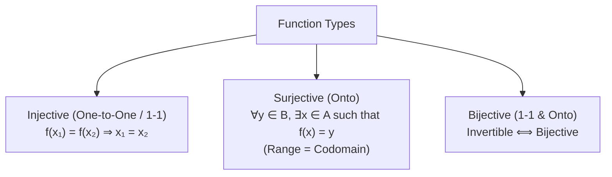
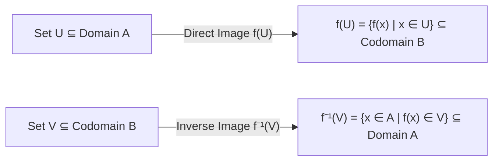

# 10. Functions, Direct/Inverse Images & Bijectivity

> [!NOTE]
> **Course Module Reference:** PMT 1013 (Foundations of Mathematics)
> **Corresponding Lecture Slides:** [10_D18_Functions_Injectivity_and_Surjectivity.pdf](PMAT/1013/Lecture%20Notes/10_D18_Functions_Injectivity_and_Surjectivity.pdf), [10_D19_Function_Composition_and_Inverses.pdf](PMAT/1013/Lecture%20Notes/10_D19_Function_Composition_and_Inverses.pdf), [10_D20_Direct_and_Inverse_Images_under_Functions.pdf](PMAT/1013/Lecture%20Notes/10_D20_Direct_and_Inverse_Images_under_Functions.pdf)
> **Prerequisites:** Binary Relations, Domain, Range & Set Operations (Modules 05 & 07).

---

## 1. Formal Definition of a Function (ශ්‍රිතයක විධිමත් අර්ථ දැක්වීම)

*   **Function ($f: A \to B$):** $A$ හි සිට $B$ දක්වා වූ විශේෂ සම්බන්ධතාවයකි ($f \subseteq A \times B$).
*   **Axiomatic Condition:** $A$ හි සිටින **සෑම සාමාජිකයෙකුටම ($a \in A$), $B$ තුළ අනන්‍යව එකම එක ප්‍රතිබිම්භයක් ($b \in B$)** තිබිය යුතුය:
    $$\mathbf{\forall a \in A, \exists! b \in B \text{ such that } (a, b) \in f \quad (\text{i.e. } f(a) = b)}$$
*   $A$ = **Domain** (ප්‍රදේශය), $B$ = **Codomain** (සහ-ප්‍රදේශය), $\operatorname{Ran}(f) = \{f(a) \mid a \in A\} \subseteq B$ = **Range** (පරාසය).

---

## 2. Injective, Surjective & Bijective Functions

### 1️⃣ Injective Function (එක-එක ශ්‍රිතය - 1-1 / Injection)
*   **තේරුම:** වෙනස් ආදාන (Inputs) වලට ලැබෙන්නේ වෙනස් ප්‍රතිදාන (Outputs) පමණි.
*   **සාධනය කරන සම්මත ක්‍රමය:**
    $$\mathbf{f(x_1) = f(x_2) \implies x_1 = x_2}$$
*   **අසත්‍ය බව පෙන්වීමට (Counterexample):** $x_1 \neq x_2$ වන නමුත් $f(x_1) = f(x_2)$ වන එක් යුගලයක් පෙන්වන්න.

### 2️⃣ Surjective Function (පරික්ෂේපක ශ්‍රිතය - Onto / Surjection)
*   **තේරුම:** Codomain එකේ සිටින කිසිදු සාමාජිකයෙක් අතහැරෙන්නේ නැත (Range = Codomain).
*   **සාධනය කරන සම්මත ක්‍රමය:**
    ඕනෑම $y \in B$ එකක් ගෙන, $y = f(x)$ සූත්‍රයෙන් $x$ උක්ත කර $x \in A$ බව පෙන්වන්න:
    $$\mathbf{\forall y \in B, \exists x \in A \text{ such that } f(x) = y}$$

### 3️⃣ Bijective Function (ද්වික්ෂේපක ශ්‍රිතය - Bijection)
*   $f$ යනු **Injective මෙන්ම Surjective ද වේ නම්** එය Bijective වේ.
*   **Invertibility Theorem:** $f$ හි ප්‍රතිලෝම ශ්‍රිතය ($f^{-1}: B \to A$) පවතින්නේ **$f$ යනු Bijective නම් පමණි!**

---

## 3. Direct Image & Inverse Image of Sets (කුලක ප්‍රතිබිම්භ සහ ප්‍රතිලෝම ප්‍රතිබිම්භ)

විභාග වලදී නිතරම අහන අතිශය වැදගත් අර්ථ දැක්වීම් දෙකකි (Model Paper Q5(a)):

### 📜 Formal Definitions

1. **Direct Image of a Subset $U \subseteq A$ under $f$:**
   $$\mathbf{f(U) = \{f(x) \mid x \in U\} = \{y \in B \mid \exists x \in U \text{ such that } y = f(x)\}}$$

2. **Inverse Image of a Subset $V \subseteq B$ under $f$:**
   $$\mathbf{f^{-1}(V) = \{x \in A \mid f(x) \in V\}}$$
   *(Note: $f^{-1}(V)$ යනු කුලකයකි. මෙහිදී $f$ ප්‍රතිලෝම විය යුතු නොවේ!).*

---

## 4. Master Image Identities & Properties

| Operation | Direct Image Property ($E, F \subseteq A$) | Inverse Image Property ($G, H \subseteq B$) |
| :--- | :--- | :--- |
| **Union ($\cup$)** | $\mathbf{f(E \cup F) = f(E) \cup f(F)}$ | $\mathbf{f^{-1}(G \cup H) = f^{-1}(G) \cup f^{-1}(H)}$ |
| **Intersection ($\cap$)** | $\mathbf{f(E \cap F) \subseteq f(E) \cap f(F)}$ *(Equality if 1-1)* | $\mathbf{f^{-1}(G \cap H) = f^{-1}(G) \cap f^{-1}(H)}$ *(Always Equal!)* |
| **Difference ($\setminus$)** | $f(E) \setminus f(F) \subseteq f(E \setminus F)$ | $\mathbf{f^{-1}(G \setminus H) = f^{-1}(G) \setminus f^{-1}(H)}$ |
| **Subsets ($\subseteq$)** | $E \subseteq F \implies f(E) \subseteq f(F)$ | $G \subseteq H \implies f^{-1}(G) \subseteq f^{-1}(H)$ |

---

## ✍️ Step-by-Step Worked Exam Proofs

### 📌 Problem 1: Concrete Direct & Inverse Images (End-Exam 2026 Model Paper Q5(b))
**Question:** Let $f: \mathbb{R} \setminus \{0\} \to \mathbb{R}$ defined by $f(x) = x + \frac{1}{x}$.
> (i) Find $f(U)$, where $U = \{x \in \mathbb{R} \mid 1 < x \le 3\} = (1, 3]$.  
> (ii) Find $f^{-1}(V)$, where $V = \{x \in \mathbb{R} \mid -2 < x < 0\} = (-2, 0)$.  
> (iii) Is $f$ injective? Is $f$ surjective? Justify your answers.

**Detailed Step-by-Step Solution:**

*   **(i) Find $f(U)$ for $U = (1, 3]$:**
    Consider $f(x) = x + \frac{1}{x}$ for $x \in (1, 3]$.
    $f'(x) = 1 - \frac{1}{x^2} = \frac{x^2 - 1}{x^2} > 0$ for all $x > 1$.
    Thus $f$ is strictly increasing on $(1, 3]$.
    * As $x \to 1^+$, $f(x) \to 1 + 1 = 2$. (Not attained since $x > 1$).
    * At $x = 3$, $f(3) = 3 + \frac{1}{3} = \frac{10}{3}$.
    $$\mathbf{f(U) = \left(2, \frac{10}{3}\right] = \left\{y \in \mathbb{R} \;\middle|\; 2 < y \le \frac{10}{3}\right\}}$$

*   **(ii) Find $f^{-1}(V)$ for $V = (-2, 0)$:**
    We seek all $x \in \mathbb{R} \setminus \{0\}$ such that $-2 < x + \frac{1}{x} < 0$.
    * For $x < 0$, let $x = -t$ where $t > 0$. Then $x + \frac{1}{x} = -\left(t + \frac{1}{t}\right)$.
    * By AM-GM inequality, $t + \frac{1}{t} \ge 2$, which means $x + \frac{1}{x} \le -2$ for all $x < 0$.
    * For $x > 0$, $x + \frac{1}{x} \ge 2 > 0$.
    * Therefore, there is **NO** real number $x$ for which $x + \frac{1}{x} \in (-2, 0)$.
    $$\mathbf{f^{-1}(V) = \emptyset}$$

*   **(iii) Injectivity & Surjectivity:**
    *   **Is $f$ Injective?**
        Take $x_1 = 2$ and $x_2 = \frac{1}{2}$. Notice $x_1 \neq x_2$.
        $f(2) = 2 + \frac{1}{2} = \frac{5}{2}$ and $f(1/2) = \frac{1}{2} + 2 = \frac{5}{2}$.
        Since $f(2) = f(1/2)$ but $2 \neq 1/2$, **$f$ is NOT Injective**.
    *   **Is $f$ Surjective?**
        From part (ii), the range of $f$ is $(-\infty, -2] \cup [2, \infty)$.
        Numbers in $(-2, 2)$ (such as $y = 0$) have no preimage in $\mathbb{R} \setminus \{0\}$ ($x + \frac{1}{x} = 0 \implies x^2 = -1$, no real solution).
        Since $\operatorname{Ran}(f) \neq \mathbb{R}$ (Codomain), **$f$ is NOT Surjective**. $\blacksquare$

---

### 📌 Problem 2: Direct Image of Intersection (End-Exam 2026 Model Paper Q5(c)(i))
**Theorem:** Prove that **$f(E \cap F) \subseteq f(E) \cap f(F)$**.

**Rigorous Proof:**
1. Let $y \in f(E \cap F)$ be an arbitrary element.
2. By definition of direct image, $\exists x \in E \cap F$ such that $y = f(x)$.
3. Since $x \in E \cap F$, by definition of intersection:
   $$x \in E \quad \land \quad x \in F$$
4. Since $x \in E$ and $y = f(x)$, it follows that $y \in f(E)$.
5. Since $x \in F$ and $y = f(x)$, it follows that $y \in f(F)$.
6. Thus $y \in f(E) \land y \in f(F)$, which by definition of intersection means:
   $$y \in f(E) \cap f(F)$$
7. Therefore, $f(E \cap F) \subseteq f(E) \cap f(F)$. $\blacksquare$

---

### 📌 Problem 3: Inverse Image of Intersection (End-Exam 2026 Model Paper Q5(c)(ii))
**Theorem:** Prove that **$f^{-1}(G \cap H) \subseteq f^{-1}(G) \cap f^{-1}(H)$** (and in fact $f^{-1}(G \cap H) = f^{-1}(G) \cap f^{-1}(H)$).

**Rigorous Proof:**
Let $x \in A$ be an arbitrary element.
$$\begin{aligned}
x \in f^{-1}(G \cap H) &\iff f(x) \in (G \cap H) && \text{(Def. of inverse image)} \\
&\iff f(x) \in G \land f(x) \in H && \text{(Def. of intersection)} \\
&\iff x \in f^{-1}(G) \land x \in f^{-1}(H) && \text{(Def. of inverse image)} \\
&\iff x \in f^{-1}(G) \cap f^{-1}(H) && \text{(Def. of intersection)}
\end{aligned}$$
Thus $f^{-1}(G \cap H) = f^{-1}(G) \cap f^{-1}(H)$, which also directly proves $f^{-1}(G \cap H) \subseteq f^{-1}(G) \cap f^{-1}(H)$. $\blacksquare$

---

### 📌 Problem 4: Composition Properties (End-Exam 2026 Model Paper Q5(d))
**Theorems:** Let $f: A \to B$ and $g: B \to C$ be functions.
> (i) If $g \circ f$ is onto, then $g$ is onto.  
> (ii) If $g \circ f$ is one-to-one, then $f$ is one-to-one.

**Rigorous Proofs:**

**(i) Prove $g \circ f$ is onto $\implies g$ is onto:**
1. Assume $g \circ f: A \to C$ is onto (surjective).
2. We must show that $\forall z \in C, \exists y \in B$ such that $g(y) = z$.
3. Let $z \in C$ be arbitrary.
4. Since $g \circ f$ is onto, $\exists x \in A$ such that $(g \circ f)(x) = z$.
5. By definition of function composition, $(g \circ f)(x) = g(f(x)) = z$.
6. Let $y = f(x) \in B$.
7. Then $g(y) = z$, which proves that $g$ is onto. $\blacksquare$

**(ii) Prove $g \circ f$ is one-to-one $\implies f$ is one-to-one:**
1. Assume $g \circ f: A \to C$ is one-to-one (injective).
2. Let $x_1, x_2 \in A$ such that $f(x_1) = f(x_2)$.
3. Applying the function $g$ to both sides:
   $$g(f(x_1)) = g(f(x_2)) \implies (g \circ f)(x_1) = (g \circ f)(x_2)$$
4. Since $g \circ f$ is injective, $(g \circ f)(x_1) = (g \circ f)(x_2) \implies x_1 = x_2$.
5. Thus $f(x_1) = f(x_2) \implies x_1 = x_2$, which proves that $f$ is one-to-one. $\blacksquare$

---

## ⚠️ Exam Traps & Common Pitfalls

> [!CAUTION]
> **1. $f^{-1}(V)$ යනු ප්‍රතිලෝම ශ්‍රිතය යැයි වැරදියට සිතීම:**
> $f^{-1}(V)$ (Inverse image of a set) යනු $f$ Bijective නොවුනද ඕනෑම ශ්‍රිතයකට සෙවිය හැකි කුලකයකි! $f^{-1}(x)$ (Inverse function) පවතින්නේ Bijective විට පමණි.
> 
> **2. Direct Image Intersection හි සමානතාවය ($\subseteq$ vs $=$):**
> සාමාන්‍ය ශ්‍රිත සඳහා $f(E \cap F) = f(E) \cap f(F)$ නොවේ! සත්‍ය වන්නේ **$f(E \cap F) \subseteq f(E) \cap f(F)$** පමණි. සමාන වන්නේ $f$ යනු 1-1 වූ විට පමණි.
