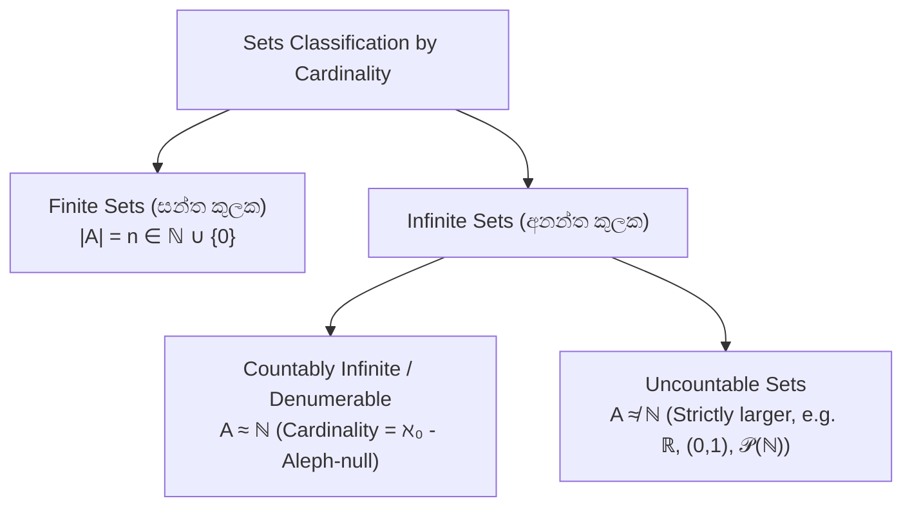

# 11. Set Cardinality, Countability & Cantor's Theorems

> [!NOTE]
> **Course Module Reference:** PMT 1013 (Foundations of Mathematics)
> **Corresponding Lecture Slides:** [11_D21_Cardinality_and_Countable_Sets.pdf](../11_D21_Cardinality_and_Countable_Sets.pdf), [11_D22_Uncountability_and_Cantor_Theorems.pdf](../11_D22_Uncountability_and_Cantor_Theorems.pdf), [11_D23_Proof_Techniques_Synthesis_and_Review.pdf](../11_D23_Proof_Techniques_Synthesis_and_Review.pdf), [11_D24_Course_Summary_and_Exam_Prep.pdf](../11_D24_Course_Summary_and_Exam_Prep.pdf)
> **Prerequisites:** Bijections & Power Sets (Modules 05 & 10).

---

## 1. Equinumerous Sets & Cardinality (සමසාමාජික කුලක සහ කාඩිනලතාව)

අනන්ත කුලක (Infinite Sets) වල විශාලත්වය මනින්නේ සාමාන්‍ය ගණන් කිරීමෙන් නොවේ; ඒවා අතර **Bijective (1-1 සහ Onto) ශ්‍රිතයක්** ගොඩනැගිය හැකිද යන්න පරීක්ෂා කිරීමෙනි.

*   **Equinumerous ($A \approx B$):** $A$ සිට $B$ දක්වා **Bijection (ද්වික්ෂේපක ශ්‍රිතයක්)** පවතී නම්, $A$ සහ $B$ සමසාමාජික වේ (එනම් සමාන විශාලත්වයක්/කාඩිනලතාවක් ඇත).
    $$\mathbf{A \approx B \iff \exists f: A \to B \text{ such that } f \text{ is a bijection}}$$
*   **Equivalence Relation:** කුලක අතර $\approx$ සම්බන්ධතාවය Reflexive, Symmetric, සහ Transitive වන Equivalence Relation එකකි.

---

## 2. Countable vs Uncountable Sets (ගණ්‍ය සහ අගණ්‍ය කුලක)

### 📜 Definitions
1. **Countable Set (ගණ්‍ය කුලකය):** කුලකයක් සන්ත (Finite) නම් හෝ ස්වාභාවික සංඛ්‍යා කුලකයට සමසාමාජික ($\approx \mathbb{N}$) නම්, එය **Countable** වේ. (එහි සාමාජිකයන් $a_1, a_2, a_3, \dots$ ලෙස ලැයිස්තුගත කළ හැක).
2. **Uncountable Set (අගණ්‍ය කුලකය):** Countable නොවන (අනන්තයටත් වඩා විශාල) කුලකයකි.

### 🌟 Master Classification Table

| Set | Cardinality | Classification | Reason / Bijection |
| :--- | :---: | :--- | :--- |
| $\mathbb{N} = \{1, 2, 3, \dots\}$ | $\aleph_0$ | **Countably Infinite** | Base reference set |
| $\mathbb{Z} = \{\dots, -2, -1, 0, 1, 2, \dots\}$ | $\aleph_0$ | **Countably Infinite** | $f(n) = \frac{n}{2}$ (even), $-\frac{n-1}{2}$ (odd) |
| $\mathbb{Q}$ (Rational Numbers) | $\aleph_0$ | **Countably Infinite** | Grid listing / Cantor's Snake |
| $\mathbb{N} \times \mathbb{N}$ | $\aleph_0$ | **Countably Infinite** | Cantor Pairing Function |
| $(0, 1)$ (Open Real Interval) | $c = 2^{\aleph_0}$ | **UNCOUNTABLE** | Cantor's Diagonal Argument |
| $\mathbb{R}$ (Real Numbers) | $c = 2^{\aleph_0}$ | **UNCOUNTABLE** | $(0, 1) \approx \mathbb{R}$ via $f(x) = \tan(\pi(x - 1/2))$ |
| $\mathcal{P}(\mathbb{N})$ (Power Set of $\mathbb{N}$) | $2^{\aleph_0}$ | **UNCOUNTABLE** | Cantor's Theorem ($|A| < |\mathcal{P}(A)|$) |

---

## 3. The 3 Master Theorems of Transfinite Set Theory

### 1️⃣ Cantor's Theorem (කැන්ටර්ගේ ප්‍රමේයය)
> **Theorem:** ඕනෑම කුලකයක් $A$ සඳහා, එහි බල කුලකයේ ($\mathcal{P}(A)$) කාඩිනලතාව $A$ හි කාඩිනලතාවට වඩා მკაცರವಾಗಿ විශාල වේ.
> $$\mathbf{|A| < |\mathcal{P}(A)|}$$
> *(එනම් $A$ සිට $\mathcal{P}(A)$ දක්වා කිසිදු Surjective (Onto) ශ්‍රිතයක් පැවතිය නොහැක!).*

### 2️⃣ Cantor's Diagonalization Theorem (කැන්ටර්ගේ විකර්ණ සාධනය)
> **Theorem:** $(0, 1)$ විවෘත තාත්වික ප්‍රාන්තරය Uncountable වේ.

### 3️⃣ Cantor-Schröder-Bernstein (CSB) Theorem
> **Theorem:** කුලක $A, B$ සඳහා $A$ සිට $B$ ට Injection එකක්ද ($|A| \le |B|$), $B$ සිට $A$ ට Injection එකක්ද ($|B| \le |A|$) පවතී නම්:
> $$\mathbf{|A| = |B| \quad (\text{i.e. } A \approx B)}$$

---

## ✍️ Step-by-Step Worked Exam Proofs

### 📌 Problem 1: Countability of $\mathbb{Z}$ ($\mathbb{Z} \approx \mathbb{N}$)
**Theorem:** Prove that the set of all integers $\mathbb{Z}$ is countably infinite.

**Rigorous Proof:**
We construct an explicit bijection $f: \mathbb{N} \to \mathbb{Z}$ defined by:
$$f(n) = \begin{cases} \frac{n}{2} & \text{if } n \text{ is even} \\ -\frac{n-1}{2} & \text{if } n \text{ is odd} \end{cases}$$
Listing of elements:
$$f(1) = 0, \quad f(2) = 1, \quad f(3) = -1, \quad f(4) = 2, \quad f(5) = -2, \quad \dots$$

*   **Injective:** 
    * If $n_1, n_2$ are both even: $f(n_1) = f(n_2) \implies \frac{n_1}{2} = \frac{n_2}{2} \implies n_1 = n_2$.
    * If $n_1, n_2$ are both odd: $f(n_1) = f(n_2) \implies -\frac{n_1-1}{2} = -\frac{n_2-1}{2} \implies n_1 = n_2$.
    * If one is even and one is odd: $f(n_{\text{even}}) > 0$ and $f(n_{\text{odd}}) \le 0$, so their images can never be equal.
    * Thus $f$ is injective.
*   **Surjective:** 
    * Let $k \in \mathbb{Z}$.
    * If $k > 0$, choose $n = 2k \in \mathbb{N}$ (even), then $f(n) = k$.
    * If $k \le 0$, choose $n = -2k + 1 \in \mathbb{N}$ (odd), then $f(n) = -\frac{(-2k+1)-1}{2} = k$.
    * Thus $f$ is surjective.

Since $f$ is a bijection, $\mathbb{Z} \approx \mathbb{N}$, proving that $\mathbb{Z}$ is countably infinite. $\blacksquare$

---

### 📌 Problem 2: Uncountability of $(0, 1)$ (Cantor's Diagonalization Argument)
**Theorem:** The open interval $(0, 1)$ is uncountable.

**Proof by Contradiction (Cantor's Diagonal Argument):**
1. Assume to the contrary that $(0, 1)$ is countable.
2. Then all numbers in $(0, 1)$ can be listed in an infinite sequence: $r_1, r_2, r_3, r_4, \dots$
3. Write each real number in its unique infinite decimal expansion (avoiding infinite trailing 9s):
   $$\begin{aligned}
   r_1 &= 0.d_{11}d_{12}d_{13}d_{14}\dots \\
   r_2 &= 0.d_{21}d_{22}d_{23}d_{24}\dots \\
   r_3 &= 0.d_{31}d_{32}d_{33}d_{34}\dots \\
   r_4 &= 0.d_{41}d_{42}d_{43}d_{44}\dots \\
   &\vdots
   \end{aligned}$$
4. Construct a new number $x = 0.x_1 x_2 x_3 x_4 \dots \in (0, 1)$ using the diagonal digits $d_{ii}$ by the rule:
   $$x_i = \begin{cases} 4 & \text{if } d_{ii} \neq 4 \\ 5 & \text{if } d_{ii} = 4 \end{cases}$$
5. Now consider this number $x$:
   * Clearly $x \in (0, 1)$ because $0 < x < 1$.
   * $x \neq r_1$ because their 1st decimal digits differ ($x_1 \neq d_{11}$).
   * $x \neq r_2$ because their 2nd decimal digits differ ($x_2 \neq d_{22}$).
   * In general, **$x \neq r_n$ for every $n \in \mathbb{N}$** because their $n$-th decimal digits differ ($x_n \neq d_{nn}$).
6. Thus $x$ is a real number in $(0, 1)$ that is **NOT in the listed sequence**!
7. This directly contradicts the assumption that $(0, 1)$ could be completely listed in a countable sequence.
8. Therefore, $(0, 1)$ is **UNCOUNTABLE**. $\blacksquare$

---

### 📌 Problem 3: Cantor's Theorem ($|A| < |\mathcal{P}(A)|$)
**Theorem:** For any set $A$, there is no surjective function from $A$ to $\mathcal{P}(A)$.

**Proof by Contradiction:**
1. Assume to the contrary that there exists a surjection $f: A \to \mathcal{P}(A)$.
2. For each element $a \in A$, $f(a)$ is a subset of $A$.
3. Define the subset $B \subseteq A$ as:
   $$\mathbf{B = \{x \in A \mid x \notin f(x)\}}$$
4. Since $B \subseteq A$, $B \in \mathcal{P}(A)$.
5. Since $f$ is surjective, there must exist some element $b \in A$ such that **$f(b) = B$**.
6. Now, ask the question: **Is $b \in B$?**
   * If $b \in B \implies b \notin f(b) \implies b \notin B$ (Contradiction!).
   * If $b \notin B \implies b \notin f(b) \implies b \in B$ (Contradiction!).
7. In both cases, we obtain an impossible contradiction ($b \in B \iff b \notin B$).
8. Therefore, no such surjection $f$ can exist, proving that $|\mathcal{P}(A)| > |A|$. $\blacksquare$

---

## ⚠️ Exam Traps & Common Pitfalls

> [!CAUTION]
> **1. Cantor's Diagonal Argument හි 0 සහ 9 ඉලක්කම් භාවිතය:**
> Diagonal අගයන් තෝරාගැනීමේදී 0 සහ 9 මාරු නොකර 4 සහ 5 වැනි සාමාන්‍ය ඉලක්කම් තෝරාගන්න. (මන්ද $0.4999\dots = 0.5000\dots$ වැනි දශම සමානතා ගැටලු ඇතිවීම වැළැක්වීමට).
> 
> **2. Countable vs Denumerable:**
> *   Denumerable / Countably Infinite $\implies$ Exact $\aleph_0$ (අනන්තයි).
> *   Countable $\implies$ Finite හෝ Countably Infinite (සන්ත හෝ අනන්ත විය හැක).
