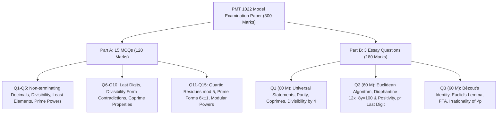

# 🏛️ PMT 1022 Introduction to Number Theory — Model Examination Paper Master Discussion

> [!NOTE]
> **Course:** PMT 1022 / MAT 122 (Basics of Number Theory / Introduction to Number Theory)  
> **Academic Unit:** Department of Mathematics, Faculty of Applied Sciences, University of Sri Jayewardenepura  
> **Source Document:** [`model paper.pdf`](./model%20paper.pdf)  
> **Time Allowed:** 02 Hours | **Total Marks:** 300 Marks  
> **Structure:**  
> * **Part A:** 15 Multiple Choice Questions ($15 \times 8 = 120$ Marks)  
> * **Part B:** 03 Essay Type Questions ($3 \times 60 = 180$ Marks)  
> **Course Index:** [PMT 1022 Master Syllabus Index](../Notes/00_PMT_1022_Number_Theory_Syllabus_Master_Index.md)

---

## 🧭 Paper Navigation & Structure

---

# 🎯 PART A: Multiple Choice Questions (120 Marks — 8 Marks each)

---

### ❓ MCQ 01 [8 Marks]
**Question:** From the following rational numbers, choose all rationals which have **non-terminating decimal expansions**:
$$\frac{1}{84}, \quad \frac{1}{250}, \quad \frac{1}{750}, \quad \frac{1}{1024}, \quad \frac{1}{256}$$

> 🔗 **අදාළ Short Note & Lecture Slides:**
> * 📘 **Short Note:** [01_Foundations_Real_Numbers_and_Base_Representations.md](../Notes/01_Foundations_Real_Numbers_and_Base_Representations.md)
> * 📑 **Lecture Slide:** [`01_Lesson_01_Introduction_to_Number_Theory_and_Sets.pdf`](../01_Lesson_01_Introduction_to_Number_Theory_and_Sets.pdf)

#### 💡 Strategy & Concept (පරිමේය සංඛ්‍යාවක දශම ප්‍රසාරණය තේරුම් ගැනීම):
* සරලම ආකාරයෙන් ලියූ පරිමේය සංඛ්‍යාවක ($\frac{1}{D}$) හරය $D$ හි ප්‍රථමක සාධක **$2$ සහ $5$ පමණක් ($D = 2^a \cdot 5^b$)** අඩංගු වේ නම්, එය **අවසාන වන (Terminating)** දශමයකි (මන්ද $10 = 2 \times 5$ බැවින් 10 හි බලයකට පහසුවෙන් හැරවිය හැක).
* හරය $D$ තුළ 2 හෝ 5 හැර වෙනත් ඕනෑම ප්‍රථමක සාධකයක් (උදා: $3, 7, 11, 13\dots$) අඩංගු වේ නම්, එය කිසිදා අවසාන නොවන **ආවර්තී (Non-terminating periodic)** දශමයක් බවට පත්වේ.

#### ✍️ Step-by-Step Analysis:
1. $84 = 2^2 \cdot \mathbf{3} \cdot \mathbf{7} \implies 3$ සහ $7$ ඇති බැවින් $\implies$ **Non-terminating (අවසාන නොවේ)**.
2. $250 = 2 \cdot 5^3 \implies 2$ සහ $5$ පමණක් ඇති බැවින් $\implies$ **Terminating (අවසාන වේ)** ($\frac{1}{250} = 0.004$).
3. $750 = 2 \cdot \mathbf{3} \cdot 5^3 \implies 3$ ඇති බැවින් $\implies$ **Non-terminating (අවසාන නොවේ)**.
4. $1024 = 2^{10} \implies 2$ පමණක් ඇති බැවින් $\implies$ **Terminating (අවසාන වේ)**.
5. $256 = 2^8 \implies 2$ පමණක් ඇති බැවින් $\implies$ **Terminating (අවසාන වේ)**.

**Correct Choice:** **(a) $\frac{1}{84}, \frac{1}{750}$** $\blacksquare$

---

### ❓ MCQ 02 [8 Marks]
**Question:** Let $a, b$ are integers. What is true about the followings?
* (i) If $a + b$ is divisible by 6, then at least one of $a$ or $b$ must be divisible by 6.
* (ii) If $a + b$ is divisible by 6, then $ab$ product must be divisible by 6.
* (iii) If $ab$ is divisible by 6, then at least one of $a$ or $b$ must be divisible by 6.

> 🔗 **අදාළ Short Note & Lecture Slides:**
> * 📘 **Short Note:** [03_Divisibility_Theory_and_Elementary_Properties.md](../Notes/03_Divisibility_Theory_and_Elementary_Properties.md)
> * 📑 **Lecture Slide:** [`03_Lesson_05_Divisibility_Theory_and_Properties.pdf`](../03_Lesson_05_Divisibility_Theory_and_Properties.pdf)

#### 💡 Strategy & Counterexamples (ප්‍රති-උදාහරණ මගින් ප්‍රතික්ෂේප කිරීම):
1. **(i) සඳහා:** $a = 1, b = 5$ ගන්න. $a + b = 6$ ($6$ න් බෙදේ), නමුත් $6 \nmid 1$ සහ $6 \nmid 5$. එබැවින් (i) **අසත්‍යයි (FALSE)**.
2. **(ii) සඳහා:** $a = 1, b = 5$ ගන්න. $a + b = 6$ ($6$ න් බෙදේ), නමුත් $ab = 1 \times 5 = 5$ ($6$ න් නොබෙදේ). එබැවින් (ii) **අසත්‍යයි (FALSE)**.
3. **(iii) සඳහා:** $a = 2, b = 3$ ගන්න. $ab = 6$ ($6$ න් බෙදේ), නමුත් $6 \nmid 2$ සහ $6 \nmid 3$ (6 යනු සංයුක්ත සංඛ්‍යාවක් බැවින් Euclid's Lemma යෙදිය නොහැක). එබැවින් (iii) **අසත්‍යයි (FALSE)**.

**Correct Choice:** **(a) All are false** $\blacksquare$

---

### ❓ MCQ 03 [8 Marks]
**Question:** What is true about following two sets?
$$A = \left\{\frac{1}{3n+1} : n \in \mathbb{Z}\right\}, \quad B = \left\{\frac{1}{n} : n \in \mathbb{Z} \setminus \{0\}\right\}$$

> 🔗 **අදාළ Short Note & Lecture Slides:**
> * 📘 **Short Note:** [02_Mathematical_Induction_and_Well_Ordering_Principle.md](../Notes/02_Mathematical_Induction_and_Well_Ordering_Principle.md)
> * 📑 **Lecture Slide:** [`02_Lesson_04_Well_Ordering_Principle.pdf`](../02_Lesson_04_Well_Ordering_Principle.pdf)

#### 💡 Strategy & Least Element Analysis (කුඩාම අගය සෙවීම):
* **$A$ කුලකය සඳහා:**
  * $n = 0 \implies 1$
  * $n = 1 \implies 1/4$
  * $n = -1 \implies \frac{1}{3(-1)+1} = \frac{1}{-2} = -0.5 = -\frac{1}{2}$
  * $n = -2 \implies \frac{1}{-5} = -0.2 > -0.5$
  * සෘණ $n \le -1$ සඳහා කුඩාම අගය වන්නේ $-1/2$ වේ. නමුත් $-1$ කිසිදා $A$ තුළ නැත ($3n+1 = -1 \implies 3n = -2 \implies n = -2/3 \notin \mathbb{Z}$).
* **$B$ කුලකය සඳහා:**
  * $n = -1 \implies \frac{1}{-1} = \mathbf{-1}$.
  * ඕනෑම සෘණ $n \le -2$ සඳහා $\frac{1}{n} \ge -\frac{1}{2} > -1$.
  * ධන $n$ සඳහා $\frac{1}{n} > 0 > -1$.
  * එබැවින් $B$ හි කුඩාම අගය (Least element) වන්නේ **$-1$** වේ.

**Correct Choice:** **(b) / (d) The least element of $A$ is $-1/2$ ($-1 \notin A$) and the least element of $B$ is $-1$** $\blacksquare$

---

### ❓ MCQ 04 [8 Marks]
**Question:** What is the largest power of 5 which exactly divides $125,000,000,000$?

> 🔗 **අදාළ Short Note & Lecture Slides:**
> * 📘 **Short Note:** [07_Prime_Numbers_Factorization_and_Euclid_Lemmas.md](../Notes/07_Prime_Numbers_Factorization_and_Euclid_Lemmas.md)
> * 📑 **Lecture Slide:** [`07_Lesson_10_Primes_and_Fundamental_Theorem_of_Arithmetic.pdf`](../07_Lesson_10_Primes_and_Fundamental_Theorem_of_Arithmetic.pdf)

#### ✍️ Step-by-Step Solution:
1. සංඛ්‍යාව ප්‍රථමක සාධක වල ගුණිතයක් ලෙස ලියන්න:
   $$N = 125 \times 10^9$$
2. $125 = 5^3$ සහ $10 = 2 \times 5$ ආදේශ කරන්න:
   $$N = 5^3 \times (2 \times 5)^9 = 5^3 \times 2^9 \times 5^9 = 2^9 \times 5^{3 + 9} = 2^9 \times \mathbf{5^{12}}$$
3. $N$ හරියටම බෙදිය හැකි 5 හි උපරිම බලය වන්නේ **12** වේ.

**Correct Choice:** **(d) 12** $\blacksquare$

---

### ❓ MCQ 05 [8 Marks]
**Question:** Let $A = \{2^p 3^q \mid p, q \in \mathbb{Z}\}$. What is true about followings?
* (i) $A$ has infinitely many odd integers.
* (ii) $A$ has a least element.
* (iii) $324$ is an element of $A$.

> 🔗 **අදාළ Short Note & Lecture Slides:**
> * 📘 **Short Note:** [02_Mathematical_Induction_and_Well_Ordering_Principle.md](../Notes/02_Mathematical_Induction_and_Well_Ordering_Principle.md)
> * 📑 **Lecture Slide:** [`02_Lesson_04_Well_Ordering_Principle.pdf`](../02_Lesson_04_Well_Ordering_Principle.pdf)

#### ✍️ Step-by-Step Analysis:
* **(i) සත්‍යයි:** $p = 0$ වන විට $2^0 3^q = 3^q$ වේ. $q = 1, 2, 3, \dots$ ගන්නා විට $\{3, 9, 27, 81, \dots\}$ ලෙස අනන්ත ඔත්තේ නිඛිල සංඛ්‍යා ලැබේ. $\implies$ **TRUE**.
* **(ii) අසත්‍යයි:** $p, q \to -\infty$ වන විට අගයන් ශුන්‍යය දෙසට අසීමිතව කුඩා වන බැවින් ($2^{-10} 3^{-10} \to 0$) කුලකයට අවම ධන අගයක් (Least element) නොමැත. $\implies$ **FALSE**.
* **(iii) සත්‍යයි:** $324 = 4 \times 81 = 2^2 \times 3^4$. මෙහි $p = 2 \in \mathbb{Z}$ සහ $q = 4 \in \mathbb{Z}$ බැවින් $324 \in A$. $\implies$ **TRUE**.

**Correct Choice:** **(e) Only (i) & (iii)** $\blacksquare$

---

### ❓ MCQ 06 [8 Marks]
**Question:** What are the last digits of $29^{18}$ and $7^{32}$ respectively?

> 🔗 **අදාළ Short Note & Lecture Slides:**
> * 📘 **Short Note:** [04_The_Division_Algorithm_and_Form_of_Integers.md](../Notes/04_The_Division_Algorithm_and_Form_of_Integers.md) | [08_Modular_Arithmetic_Congruences_and_Linear_Congruences.md](../Notes/08_Modular_Arithmetic_Congruences_and_Linear_Congruences.md)
> * 📑 **Lecture Slide:** [`04_Lesson_07_Division_Algorithm_Applications_and_Parity.pdf`](../04_Lesson_07_Division_Algorithm_Applications_and_Parity.pdf) | [`08_Lesson_11_Modular_Arithmetic_and_Congruences.pdf`](../08_Lesson_11_Modular_Arithmetic_and_Congruences.pdf)

#### ✍️ Step-by-Step Solution:
* **$29^{18} \pmod{10}$ හි අවසන් ඉලක්කම:**
  $$29 \equiv -1 \pmod{10} \implies 29^{18} \equiv (-1)^{18} \equiv \mathbf{1 \pmod{10}}$$
* **$7^{32} \pmod{10}$ හි අවසන් ඉලක්කම:**
  7 හි බලයන්හි ආවර්තය 4 කි ($7^1=7, 7^2=9, 7^3=3, 7^4 \equiv 1 \pmod{10}$).
  $$7^{32} = (7^4)^8 \equiv (1)^8 \equiv \mathbf{1 \pmod{10}}$$
* පිළිතුර පිළිවෙලින් **1 සහ 1** වේ.

**Correct Choice:** **(e) None of the above** $\blacksquare$

---

### ❓ MCQ 07 [8 Marks]
**Question:** Which is true about followings?
* (i) For every integer $a$, 3 is not a factor of $a^2 + 29$
* (ii) For every integer $a$, 3 is not a factor of $a^2 + 15$
* (iii) For every integer $a$, 3 is not a factor of $a^2 + 25$

> 🔗 **අදාළ Short Note & Lecture Slides:**
> * 📘 **Short Note:** [04_The_Division_Algorithm_and_Form_of_Integers.md](../Notes/04_The_Division_Algorithm_and_Form_of_Integers.md)
> * 📑 **Lecture Slide:** [`04_Lesson_07_Division_Algorithm_Applications_and_Parity.pdf`](../04_Lesson_07_Division_Algorithm_Applications_and_Parity.pdf)

#### ✍️ Step-by-Step Analysis modulo 3:
ඕනෑම $a \in \mathbb{Z}$ නිඛිලයක් සඳහා පූර්ණ වර්ගයක ශේෂය $a^2 \equiv 0 \text{ හෝ } 1 \pmod 3$ වේ.
* **(i) සඳහා:** $a^2 + 29 \equiv a^2 + 2 \pmod 3$. $a = 1$ විට $a^2 \equiv 1 \implies 1 + 2 = 3 \equiv 0 \pmod 3$ ($1^2 + 29 = 30$, 3 න් බෙදේ). $\implies$ **FALSE**.
* **(ii) සඳහා:** $a = 3$ විට $3^2 + 15 = 24$ (3 න් බෙදේ). $\implies$ **FALSE**.
* **(iii) සඳහා:** $a^2 + 25 \equiv a^2 + 1 \pmod 3$.
  * $a^2 \equiv 0 \implies 0 + 1 = 1 \not\equiv 0 \pmod 3$.
  * $a^2 \equiv 1 \implies 1 + 1 = 2 \not\equiv 0 \pmod 3$.
  * එබැවින් කිසිදු නිඛිලයක් සඳහා $a^2 + 25$ අගය 3 න් **නොබෙදේ**! $\implies$ **TRUE**.

**Correct Choice:** **(d) Only (iii) is true** $\blacksquare$

---

### ❓ MCQ 08 [8 Marks]
**Question:** Which is true about following?
* (i) Every subset of negative integers has a least element.
* (ii) The set of integers has a least element.
* (iii) Every non-empty subset of natural numbers has a least element.

> 🔗 **අදාළ Short Note & Lecture Slides:**
> * 📘 **Short Note:** [02_Mathematical_Induction_and_Well_Ordering_Principle.md](../Notes/02_Mathematical_Induction_and_Well_Ordering_Principle.md)
> * 📑 **Lecture Slide:** [`02_Lesson_04_Well_Ordering_Principle.pdf`](../02_Lesson_04_Well_Ordering_Principle.pdf)

#### ✍️ Analysis via Well-Ordering Principle:
* (i) අසත්‍යයි (උදා: සෘණ නිඛිල කුලකය $\{-1, -2, -3, \dots\}$ සෘණ අනන්තයට යන බැවින් කුඩාම අගයක් නැත).
* (ii) අසත්‍යයි ($\mathbb{Z}$ කුලකයට කුඩාම අගයක් නැත).
* (iii) **සත්‍යයි** (ස්වාභාවික සංඛ්‍යා $\mathbb{N}$ හි ඕනෑම හිස් නොවන උපකුලකයකට කුඩාම අගයක් පවතී — මෙය **Well-Ordering Principle** වේ).

**Correct Choice:** **(c) Only (iii)** $\blacksquare$

---

### ❓ MCQ 09 [8 Marks]
**Question:** Which is true about following?
* (i) If integers $a$ and $b$ relatively prime then at least one of $a$ and $b$ must be prime.
* (ii) If integers $a$ and $b$ both prime then $a$ and $b$ relatively prime (for distinct primes).

> 🔗 **අදාළ Short Note & Lecture Slides:**
> * 📘 **Short Note:** [05_Greatest_Common_Divisor_and_Bezout_Identity.md](../Notes/05_Greatest_Common_Divisor_and_Bezout_Identity.md)
> * 📑 **Lecture Slide:** [`05_Lesson_08_Greatest_Common_Divisor_and_Properties.pdf`](../05_Lesson_08_Greatest_Common_Divisor_and_Properties.pdf)

#### ✍️ Analysis:
* (i) අසත්‍යයි (ප්‍රති-උදාහරණය: $a = 8 = 2^3$ සහ $b = 9 = 3^2$ දෙකම සංයුක්ත සංඛ්‍යා වුවත් $\gcd(8, 9) = 1$ වේ).
* (ii) **සත්‍යයි** (වෙනස් ප්‍රථමක සංඛ්‍යා දෙකක් $p \neq q$ සඳහා $\gcd(p, q) = 1$ වේ).

**Correct Choice:** **(b) Only (ii) is true** $\blacksquare$

---

### ❓ MCQ 10 [8 Marks]
**Question:** Which is true about following?
* (i) For any $k \in \mathbb{Z}$, $\gcd(5k + 4, 6k + 5) = 1$
* (ii) For any $k \in \mathbb{Z}$, $\gcd(5k + 3, 6k + 1) = 1$

> 🔗 **අදාළ Short Note & Lecture Slides:**
> * 📘 **Short Note:** [05_Greatest_Common_Divisor_and_Bezout_Identity.md](../Notes/05_Greatest_Common_Divisor_and_Bezout_Identity.md)
> * 📑 **Lecture Slide:** [`05_Lesson_08_Greatest_Common_Divisor_and_Properties.pdf`](../05_Lesson_08_Greatest_Common_Divisor_and_Properties.pdf)

#### ✍️ Analysis:
* **(i) සඳහා:** $6(5k + 4) - 5(6k + 5) = (30k + 24) - (30k + 25) = -1$. රේඛීය සංයෝජනය $-1$ වන බැවින් $\gcd(5k+4, 6k+5) = 1$ සෑම විටම සත්‍ය වේ. $\implies$ **TRUE**.
* **(ii) සඳහා:** $6(5k + 3) - 5(6k + 1) = (30k + 18) - (30k + 5) = 13$. $k = 2$ විට $5(2)+3 = 13$ සහ $6(2)+1 = 13 \implies \gcd(13, 13) = 13 \neq 1$. $\implies$ **FALSE**.

**Correct Choice:** **(e) Only (i) is true** $\blacksquare$

---

### ❓ MCQ 11 [8 Marks]
**Question:** Let $a$ be any integer. What are all possible remainders when $a^4$ is divided by 5?

> 🔗 **අදාළ Short Note & Lecture Slides:**
> * 📘 **Short Note:** [08_Modular_Arithmetic_Congruences_and_Linear_Congruences.md](../Notes/08_Modular_Arithmetic_Congruences_and_Linear_Congruences.md)
> * 📑 **Lecture Slide:** [`08_Lesson_11_Modular_Arithmetic_and_Congruences.pdf`](../08_Lesson_11_Modular_Arithmetic_and_Congruences.pdf)

#### ✍️ Analysis modulo 5:
* $a \equiv 0 \implies 0^4 \equiv \mathbf{0 \pmod 5}$.
* $a \equiv 1, 2, 3, 4 \pmod 5$ විට Fermat's Little Theorem මගින්:
  $1^4 \equiv 1, 2^4 = 16 \equiv 1, 3^4 = 81 \equiv 1, 4^4 \equiv (-1)^4 = 1 \implies \mathbf{1 \pmod 5}$.
* එබැවින් ශේෂයන් වන්නේ **0 සහ 1** පමණි.

**Correct Choice:** **(ii) 0, 1** $\blacksquare$

---

### ❓ MCQ 12 [8 Marks]
**Question:** Which is true about following?
* (i) For any integers $a$ and $b$, 4 is not a factor of $a^2 + b^2 + 23$
* (ii) For any integers $a$ and $b$, 4 is not a factor of $a^2 + b^2 + 16$
* (iii) For any integers $a$ and $b$, 4 is not a factor of $a^2 + b^2 + 29$

> 🔗 **අදාළ Short Note & Lecture Slides:**
> * 📘 **Short Note:** [04_The_Division_Algorithm_and_Form_of_Integers.md](../Notes/04_The_Division_Algorithm_and_Form_of_Integers.md)
> * 📑 **Lecture Slide:** [`04_Lesson_07_Division_Algorithm_Applications_and_Parity.pdf`](../04_Lesson_07_Division_Algorithm_Applications_and_Parity.pdf)

#### ✍️ Analysis modulo 4:
$a^2, b^2 \in \{0, 1\} \pmod 4 \implies a^2 + b^2 \in \{0, 1, 2\} \pmod 4$ (කිසිදා 3 විය නොහැක).
* (i) $a^2 + b^2 + 23 \equiv a^2 + b^2 + 3 \pmod 4$. $a=1, b=0 \implies 1 + 0 + 23 = 24$ (4 න් බෙදේ). $\implies$ **FALSE**.
* (ii) $a^2 + b^2 + 16 \equiv a^2 + b^2 \pmod 4$. $a=0, b=0 \implies 16$ (4 න් බෙදේ). $\implies$ **FALSE**.
* (iii) $a^2 + b^2 + 29 \equiv a^2 + b^2 + 1 \pmod 4$. මෙය 4 න් බෙදීමට $a^2 + b^2 \equiv 3 \pmod 4$ විය යුතුය. නමුත් $a^2 + b^2$ කිසිදා 3 නොවන බැවින් **4 කිසිදා සාධකයක් නොවේ**! $\implies$ **TRUE**.

**Correct Choice:** **(d) Only (iii) is true** $\blacksquare$

---

### ❓ MCQ 13 [8 Marks]
**Question:** Let $p_n$ be the $n^{\text{th}}$ prime ($p_1=2, p_2=3, p_3=5\dots$).
* (i) $p_1 p_2 \dots p_n + 1$ is prime for all $n \in \mathbb{N}$
* (ii) $p_n \equiv 1 \pmod 6$ or $p_n \equiv 5 \pmod 6$ for all $n > 2$.

> 🔗 **අදාළ Short Note & Lecture Slides:**
> * 📘 **Short Note:** [07_Prime_Numbers_Factorization_and_Euclid_Lemmas.md](../Notes/07_Prime_Numbers_Factorization_and_Euclid_Lemmas.md)
> * 📑 **Lecture Slide:** [`07_Lesson_10_Primes_and_Fundamental_Theorem_of_Arithmetic.pdf`](../07_Lesson_10_Primes_and_Fundamental_Theorem_of_Arithmetic.pdf)

#### ✍️ Analysis:
* (i) අසත්‍යයි ($2 \cdot 3 \cdot 5 \cdot 7 \cdot 11 \cdot 13 + 1 = 30031 = 59 \times 509$, සංයුක්ත වේ).
* (ii) **සත්‍යයි** (3 ට වැඩි ඕනෑම ප්‍රථමක සංඛ්‍යාවක් 2 න් සහ 3 න් නොබෙදෙන බැවින් $6k \pm 1$ ආකාර වේ).

**Correct Choice:** **Only (ii) is true** $\blacksquare$

---

### ❓ MCQ 14 [8 Marks]
**Question:** If $a \equiv 0 \pmod n$ and $b \equiv 0 \pmod n$, which is true?
* (i) $ab \equiv 0 \pmod{n^2}$
* (ii) $a^2 b^2 \equiv 0 \pmod{n^4}$

> 🔗 **අදාළ Short Note & Lecture Slides:**
> * 📘 **Short Note:** [08_Modular_Arithmetic_Congruences_and_Linear_Congruences.md](../Notes/08_Modular_Arithmetic_Congruences_and_Linear_Congruences.md)
> * 📑 **Lecture Slide:** [`08_Lesson_11_Modular_Arithmetic_and_Congruences.pdf`](../08_Lesson_11_Modular_Arithmetic_and_Congruences.pdf)

#### ✍️ Analysis:
* $a = k_1 n$ සහ $b = k_2 n \implies ab = (k_1 k_2) n^2 \implies ab \equiv 0 \pmod{n^2}$. $\implies$ **TRUE**.
* $a^2 b^2 = (ab)^2 = (k_1 k_2 n^2)^2 = (k_1 k_2)^2 n^4 \implies a^2 b^2 \equiv 0 \pmod{n^4}$. $\implies$ **TRUE**.

**Correct Choice:** **Both (i) and (ii) are true** $\blacksquare$

---

### ❓ MCQ 15 [8 Marks]
**Question:** What is the value of $2^{40} \pmod{13}$?

> 🔗 **අදාළ Short Note & Lecture Slides:**
> * 📘 **Short Note:** [08_Modular_Arithmetic_Congruences_and_Linear_Congruences.md](../Notes/08_Modular_Arithmetic_Congruences_and_Linear_Congruences.md)
> * 📑 **Lecture Slide:** [`08_Lesson_11_Modular_Arithmetic_and_Congruences.pdf`](../08_Lesson_11_Modular_Arithmetic_and_Congruences.pdf)

#### ✍️ Solution via Fermat's Little Theorem:
13 ප්‍රථමක වන අතර $\gcd(2, 13) = 1$ බැවින්:
$$2^{12} \equiv 1 \pmod{13}$$
දර්ශකය බෙදන්න: $40 = 12 \times 3 + 4$.
$$2^{40} = (2^{12})^3 \cdot 2^4 \equiv (1)^3 \cdot 16 \equiv 16 \equiv \mathbf{3 \pmod{13}}$$

**Correct Choice:** **(a) 3** $\blacksquare$

---

# 📝 PART B: Essay Type Questions (180 Marks — 60 Marks each)

---

## 📝 Question 01 [60 Marks — 12 Marks each]
**Prove or disprove each of the following universal statements:**

> 🔗 **අදාළ Short Notes & Lecture Slides:**
> * 📘 **Short Notes:** 
>   * [01_Foundations_Real_Numbers_and_Base_Representations.md](../Notes/01_Foundations_Real_Numbers_and_Base_Representations.md)
>   * [03_Divisibility_Theory_and_Elementary_Properties.md](../Notes/03_Divisibility_Theory_and_Elementary_Properties.md)
>   * [04_The_Division_Algorithm_and_Form_of_Integers.md](../Notes/04_The_Division_Algorithm_and_Form_of_Integers.md)
>   * [05_Greatest_Common_Divisor_and_Bezout_Identity.md](../Notes/05_Greatest_Common_Divisor_and_Bezout_Identity.md)
> * 📑 **Lecture Slides:**
>   * [`01_Lesson_01_Introduction_to_Number_Theory_and_Sets.pdf`](../01_Lesson_01_Introduction_to_Number_Theory_and_Sets.pdf)
>   * [`03_Lesson_05_Divisibility_Theory_and_Properties.pdf`](../03_Lesson_05_Divisibility_Theory_and_Properties.pdf)
>   * [`04_Lesson_07_Division_Algorithm_Applications_and_Parity.pdf`](../04_Lesson_07_Division_Algorithm_Applications_and_Parity.pdf)
>   * [`05_Lesson_08_Greatest_Common_Divisor_and_Properties.pdf`](../05_Lesson_08_Greatest_Common_Divisor_and_Properties.pdf)

---

### ✍️ Q1 (i): Sum of two positive irrationals is irrational [12 Marks]
**Statement:** The sum of any two positive irrational numbers is irrational.

*   **Verdict:** **DISPROVED (FALSE)** [2 Marks]
*   **Counterexample:** [10 Marks]
    Let $x = 2 + \sqrt{3}$ and $y = 2 - \sqrt{3}$.
    * Since $\sqrt{3} \approx 1.732$ is irrational, both $x = 2 + \sqrt{3} > 0$ and $y = 2 - \sqrt{3} \approx 0.268 > 0$ are strictly positive irrational numbers.
    * Their sum is:
      $$x + y = (2 + \sqrt{3}) + (2 - \sqrt{3}) = 4$$
    * Since $4 = \frac{4}{1} \in \mathbb{Q}$, the sum is **rational**.
    * Therefore, the statement is false. $\blacksquare$

---

### ✍️ Q1 (ii): Divisibility of Product $a \mid bc \implies a \mid b \lor a \mid c$ [12 Marks]
**Statement:** For $a, b, c$ non-zero integers, if $a \mid bc$, then $a \mid b$ or $a \mid c$.

*   **Verdict:** **DISPROVED (FALSE)** [2 Marks]
*   **Counterexample:** [10 Marks]
    Let $a = 6, b = 4, c = 9$.
    * $bc = 4 \times 9 = 36$.
    * Since $36 = 6 \times 6$, we have $6 \mid 36$, so $a \mid bc$ is True.
    * However, $6 \nmid 4$ and $6 \nmid 9$.
    * *(Note: This holds if and only if $a$ is prime by Euclid's Lemma).* $\blacksquare$

---

### ✍️ Q1 (iii): $\gcd(a, b) = 1 \implies \gcd(a, -b) = 1$ [12 Marks]
**Statement:** For $a, b$ non-zero integers, if $\gcd(a, b) = 1$, then $\gcd(a, -b) = 1$.

*   **Verdict:** **PROVED (TRUE)** [2 Marks]
*   **Rigorous Proof:** [10 Marks]
    1. We are given $\gcd(a, b) = 1$.
    2. By Bézout's Identity, there exist integers $x, y \in \mathbb{Z}$ such that:
       $$ax + by = 1$$
    3. Rewrite the second term using $-b$:
       $$ax + (-b)(-y) = 1$$
    4. Let $x' = x \in \mathbb{Z}$ and $y' = -y \in \mathbb{Z}$. Then:
       $$a x' + (-b) y' = 1$$
    5. By the Characterization Theorem of Coprime Integers, a linear combination equal to 1 guarantees:
       $$\mathbf{\gcd(a, -b) = 1} \quad \blacksquare$$

---

### ✍️ Q1 (iv): $d \mid (a - b) \land d \mid (a + b) \implies d^2 \mid (a^2 - b^2)$ [12 Marks]
**Statement:** For integers $a, b, d$, if $d \mid (a - b)$ and $d \mid (a + b)$, then $d^2 \mid (a^2 - b^2)$.

*   **Verdict:** **PROVED (TRUE)** [2 Marks]
*   **Rigorous Proof:** [10 Marks]
    1. By definition of divisibility:
       * $d \mid (a - b) \implies \exists k_1 \in \mathbb{Z}$ such that $a - b = d k_1$.
       * $d \mid (a + b) \implies \exists k_2 \in \mathbb{Z}$ such that $a + b = d k_2$.
    2. Multiply the two equations together:
       $$(a - b)(a + b) = (d k_1)(d k_2)$$
    3. Notice $(a - b)(a + b) = a^2 - b^2$:
       $$a^2 - b^2 = d^2 (k_1 k_2)$$
    4. Since $k_1, k_2 \in \mathbb{Z}$, let $k_3 = k_1 k_2 \in \mathbb{Z}$.
    5. By definition of divisibility, **$d^2 \mid (a^2 - b^2)$**. $\blacksquare$

---

### ✍️ Q1 (v): $a^2 + b^2 + 1$ is never divisible by 4 [12 Marks]
**Statement:** For any integers $a, b$, $a^2 + b^2 + 1$ is never divisible by 4.

*   **Verdict:** **PROVED (TRUE)** [2 Marks]
*   **Rigorous Proof:** [10 Marks]
    1. For any integer $n$, its square satisfies $n^2 \equiv 0 \pmod 4$ (if even) or $n^2 \equiv 1 \pmod 4$ (if odd).
    2. Thus $a^2 \in \{0, 1\} \pmod 4$ and $b^2 \in \{0, 1\} \pmod 4$.
    3. Analyze all 4 cases for $a^2 + b^2 + 1 \pmod 4$:
       * **Case 1 ($a$ even, $b$ even):** $0 + 0 + 1 \equiv \mathbf{1 \pmod 4}$.
       * **Case 2 ($a$ even, $b$ odd):** $0 + 1 + 1 \equiv \mathbf{2 \pmod 4}$.
       * **Case 3 ($a$ odd, $b$ even):** $1 + 0 + 1 \equiv \mathbf{2 \pmod 4}$.
       * **Case 4 ($a$ odd, $b$ odd):** $1 + 1 + 1 \equiv \mathbf{3 \pmod 4}$.
    4. Since $a^2 + b^2 + 1 \not\equiv 0 \pmod 4$ in any case, it is **never divisible by 4**. $\blacksquare$

---

## 📝 Question 02 [60 Marks]

> 🔗 **අදාළ Short Notes & Lecture Slides:**
> * 📘 **Short Notes:**
>   * [06_Euclidean_Algorithm_and_Linear_Diophantine_Equations.md](../Notes/06_Euclidean_Algorithm_and_Linear_Diophantine_Equations.md)
>   * [04_The_Division_Algorithm_and_Form_of_Integers.md](../Notes/04_The_Division_Algorithm_and_Form_of_Integers.md)
> * 📑 **Lecture Slides:**
>   * [`06_Lesson_09_Euclidean_Algorithm_and_Diophantine_Equations.pdf`](../06_Lesson_09_Euclidean_Algorithm_and_Diophantine_Equations.pdf)
>   * [`04_Lesson_07_Division_Algorithm_Applications_and_Parity.pdf`](../04_Lesson_07_Division_Algorithm_Applications_and_Parity.pdf)

---

### ✍️ Q2 (a): Euclidean Algorithm on $\gcd(119, 272)$ [25 Marks]
**Question:** Use the Euclidean Algorithm to obtain integers $x$ and $y$ satisfying $\gcd(119, 272) = 119x + 272y$.

*   **Step 1: Euclidean Algorithm (Forward Pass) [12 Marks]:**
    $$\begin{aligned}
    272 &= 119 \cdot 2 + 34 && \text{--- (1)} \\
    119 &= 34 \cdot 3 + 17 && \text{--- (2)} \\
    34 &= 17 \cdot 2 + 0 && \text{--- (3)}
    \end{aligned}$$
    The last non-zero remainder is **17**.
    $$\mathbf{\gcd(119, 272) = 17}$$

*   **Step 2: Back-Substitution for Bézout Coefficients [13 Marks]:**
    From equation (2):
    $$17 = 119 - 34(3)$$
    Substitute $34 = 272 - 119(2)$ from equation (1):
    $$\begin{aligned}
    17 &= 119 - \left[272 - 119(2)\right] \cdot 3 \\
    &= 119 - 272(3) + 119(6) \\
    &= 119(1 + 6) + 272(-3) \\
    \mathbf{17} &= \mathbf{119(7) + 272(-3)}
    \end{aligned}$$
    Thus, **$x = 7$** and **$y = -3$**. $\blacksquare$

---

### ✍️ Q2 (b): Diophantine Equation $12x + 8y = 100$ [25 Marks]
**Question:** Determine all integer solutions of $12x + 8y = 100$. Find all positive integer solutions ($x > 0, y > 0$).

*   **Step 1: Check Solvability [5 Marks]:**
    Calculate $d = \gcd(12, 8) = \mathbf{4}$.
    Since $100 = 4 \times 25$, **$4 \mid 100$**. Integer solutions exist!

*   **Step 2: Find Particular Solution [8 Marks]:**
    Divide the equation by $d = 4$:
    $$3x + 2y = 25$$
    A particular solution by inspection: $x_0 = 1, y_0 = 11$ since $3(1) + 2(11) = 3 + 22 = 25$.

*   **Step 3: General Integer Solution [6 Marks]:**
    $$\mathbf{x = 1 + 2t \quad \text{and} \quad y = 11 - 3t \quad (t \in \mathbb{Z})}$$

*   **Step 4: Positive Integer Solutions ($x > 0, y > 0$) [6 Marks]:**
    * $x > 0 \implies 1 + 2t > 0 \implies t > -0.5 \implies \mathbf{t \ge 0}$.
    * $y > 0 \implies 11 - 3t > 0 \implies 3t < 11 \implies t \le 3$.
    The valid integer values are **$t \in \{0, 1, 2, 3\}$**.
    * $t = 0 \implies \mathbf{(1, 11)}$
    * $t = 1 \implies \mathbf{(3, 8)}$
    * $t = 2 \implies \mathbf{(5, 5)}$
    * $t = 3 \implies \mathbf{(7, 2)}$
    **Positive Solutions:** **$\{(1, 11), (3, 8), (5, 5), (7, 2)\}$**. $\blacksquare$

---

### ✍️ Q2 (c): Prime Remainder Modulo 10 & $p^4$ Last Digit [10 Marks]
**Question:** Let $p > 10$ be a prime number. Write down all possible remainders if $p$ is divided by 10. Hence prove that the last digit of $p^4$ is 1.

*   **Part 1: Possible Remainders [4 Marks]:**
    Since $p > 10$ is prime, $p$ cannot end in an even digit ($0, 2, 4, 6, 8$) or in $5$.
    Thus the only possible remainders modulo 10 are:
    $$\mathbf{r \in \{1, 3, 7, 9\}}$$
*   **Part 2: Last Digit of $p^4$ [6 Marks]:**
    * If $p \equiv 1 \pmod{10} \implies p^4 \equiv 1^4 = \mathbf{1 \pmod{10}}$.
    * If $p \equiv 3 \pmod{10} \implies p^4 \equiv 3^4 = 81 \equiv \mathbf{1 \pmod{10}}$.
    * If $p \equiv 7 \pmod{10} \implies p^4 \equiv 7^4 = (49)^2 \equiv (-1)^2 = \mathbf{1 \pmod{10}}$.
    * If $p \equiv 9 \pmod{10} \implies p^4 \equiv (-1)^4 = \mathbf{1 \pmod{10}}$.
    In all cases, $p^4 \equiv 1 \pmod{10}$. Therefore, the last digit of $p^4$ is **1**. $\blacksquare$

---

## 📝 Question 03 [60 Marks — 12 Marks each]

> 🔗 **අදාළ Short Notes & Lecture Slides:**
> * 📘 **Short Notes:**
>   * [05_Greatest_Common_Divisor_and_Bezout_Identity.md](../Notes/05_Greatest_Common_Divisor_and_Bezout_Identity.md)
>   * [07_Prime_Numbers_Factorization_and_Euclid_Lemmas.md](../Notes/07_Prime_Numbers_Factorization_and_Euclid_Lemmas.md)
> * 📑 **Lecture Slides:**
>   * [`05_Lesson_08_Greatest_Common_Divisor_and_Properties.pdf`](../05_Lesson_08_Greatest_Common_Divisor_and_Properties.pdf)
>   * [`07_Lesson_10_Primes_and_Fundamental_Theorem_of_Arithmetic.pdf`](../07_Lesson_10_Primes_and_Fundamental_Theorem_of_Arithmetic.pdf)

---

### ✍️ Q3 (a): Characterization of Relatively Prime Integers [12 Marks]
**Question:** Using Bézout's Theorem, prove that $a$ and $b$ are relatively prime if and only if $\exists x, y \in \mathbb{Z}$ such that $ax + by = 1$.

*   **Proof $(\implies)$ [6 Marks]:**
    Assume $a$ and $b$ are relatively prime $\implies \gcd(a, b) = 1$.
    By Bézout's Theorem, there exist integers $x, y \in \mathbb{Z}$ such that $\gcd(a, b) = ax + by \implies \mathbf{ax + by = 1}$.
*   **Proof $(\impliedby)$ [6 Marks]:**
    Assume $\exists x, y \in \mathbb{Z}$ such that $ax + by = 1$.
    Let $d = \gcd(a, b)$. By definition, $d \mid a$ and $d \mid b$.
    By the Linear Combination Theorem, $d \mid (ax + by) \implies d \mid 1$.
    Since $d \in \mathbb{Z}^+$, $d = 1$. Thus $\mathbf{\gcd(a, b) = 1}$. $\blacksquare$

---

### ✍️ Q3 (b): $a \mid c \land b \mid c \land \gcd(a, b) = 1 \implies ab \mid c$ [12 Marks]
**Rigorous Proof:**
1. **[3 Marks]** Since $\gcd(a, b) = 1$, by Bézout's Identity, there exist integers $x, y \in \mathbb{Z}$ such that:
   $$ax + by = 1$$
2. **[3 Marks]** Multiply both sides by $c$:
   $$c(ax + by) = c \implies acx + bcy = c$$
3. **[3 Marks]** We are given $a \mid c \implies c = a k_1$ and $b \mid c \implies c = b k_2$ for some $k_1, k_2 \in \mathbb{Z}$.
4. **[2 Marks]** Substitute $c = b k_2$ into the first term and $c = a k_1$ into the second term:
   $$a(b k_2)x + b(a k_1)y = c \implies ab(k_2 x + k_1 y) = c$$
5. **[1 Mark]** Since $k_2 x + k_1 y \in \mathbb{Z}$, by definition of divisibility:
   $$\mathbf{ab \mid c} \quad \blacksquare$$

---

### ✍️ Q3 (c): $a \mid bc \land \gcd(a, b) = 1 \implies a \mid c$ [12 Marks]
**Rigorous Proof:**
1. **[3 Marks]** Since $\gcd(a, b) = 1$, by Bézout's Identity, $\exists x, y \in \mathbb{Z}$ such that:
   $$ax + by = 1$$
2. **[3 Marks]** Multiply both sides by $c$:
   $$acx + bcy = c$$
3. **[2 Marks]** We know $a \mid acx$ (since $a \mid a$).
4. **[2 Marks]** We are given $a \mid bc \implies a \mid bcy$.
5. **[2 Marks]** By the Linear Combination Theorem:
   $$a \mid (acx + bcy) \implies \mathbf{a \mid c} \quad \blacksquare$$

---

### ✍️ Q3 (d): Euclid's Lemma ($p \mid ab \implies p \mid a \lor p \mid b$) [12 Marks]
**Rigorous Proof:**
1. **[2 Marks]** Let $p$ be a prime number and assume $p \mid ab$.
2. **[2 Marks]** If $p \mid a$, the conclusion holds immediately.
3. **[4 Marks]** If $p \nmid a$, since $p$ is prime, its only positive divisors are 1 and $p$. Thus $\mathbf{\gcd(p, a) = 1}$.
4. **[4 Marks]** Now we have $p \mid ab$ and $\gcd(p, a) = 1$. By part (c) above, this directly implies:
   $$\mathbf{p \mid b} \quad \blacksquare$$

---

### ✍️ Q3 (e): $\sqrt{p}$ is Irrational for any prime $p$ [12 Marks]
**Rigorous Proof (by Contradiction):**
1. **[2 Marks]** Assume to the contrary that $\sqrt{p}$ is rational.
2. **[2 Marks]** Then there exist integers $a, b \in \mathbb{Z}$ with $b \neq 0$ such that:
   $$\sqrt{p} = \frac{a}{b} \quad \text{where } \gcd(a, b) = 1$$
3. **[2 Marks]** Squaring both sides:
   $$p = \frac{a^2}{b^2} \implies a^2 = p b^2$$
4. **[2 Marks]** This implies $p \mid a^2$. By Euclid's Lemma (part d), since $p$ is prime:
   $$p \mid a^2 \implies \mathbf{p \mid a}$$
5. **[2 Marks]** Let $a = p k$ for some $k \in \mathbb{Z}$. Substitute back:
   $$(pk)^2 = p b^2 \implies p^2 k^2 = p b^2 \implies b^2 = p k^2$$
6. **[1 Mark]** This implies $p \mid b^2 \implies \mathbf{p \mid b}$.
7. **[1 Mark]** Thus $p \mid a$ and $p \mid b$, which contradicts that $\gcd(a, b) = 1$.
   Therefore, $\sqrt{p}$ is **irrational**. $\blacksquare$
