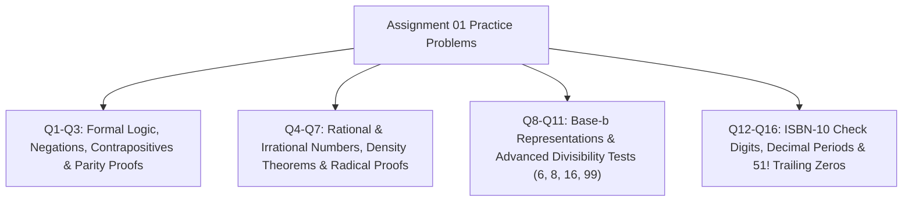

# 🏛️ PMT 1022 Introduction to Number Theory — Practice Problems for Assignment 01 Master Discussion

> [!NOTE]
> **Course:** PMT 1022 / MAT 122 (Basics of Number Theory / Introduction to Number Theory)  
> **Source Document:** [`Practice problems for assignment 01.pdf`](PMAT/1022/Papers/Practice%20problems%20for%20assignment%2001.pdf)  
> **Total Questions:** 16 In-depth Analytical & Proof Problems  
> **Course Index:** [PMT 1022 Master Syllabus Index](PMAT/1022/Short%20Notes/00_PMT_1022_Number_Theory_Syllabus_Master_Index.md)

---

## 🧭 Topic Coverage Map

---

## 📝 Detailed Solutions & Step-by-Step Proofs

---

### ❓ Question 01: Negation of Statements
> 🔗 **අදාළ Short Note & Lecture Slides:**
> * 📘 **Short Note:** [01_Foundations_Real_Numbers_and_Base_Representations.md](PMAT/1022/Short%20Notes/01_Foundations_Real_Numbers_and_Base_Representations.md)
> * 📑 **Lecture Slide:** [`01_Lesson_01_Introduction_to_Number_Theory_and_Sets.pdf`](PMAT/1022/Lecture%20Notes/01_Lesson_01_Introduction_to_Number_Theory_and_Sets.pdf)
> *(Note: The negation of $P \implies Q$ is $\mathbf{P \land \neg Q}$).*

1. **(i) "Product of two odd numbers is odd."**
   * *Symbolic Form:* $\forall m, n \in \mathbb{Z} ((m \text{ odd} \land n \text{ odd}) \to mn \text{ odd})$
   * *Negation:* **"There exist two odd integers $m$ and $n$ whose product $mn$ is even."**
2. **(ii) "If $mn$ is odd then $m$ is odd and $n$ is odd."**
   * *Negation:* **"$mn$ is odd, and (at least one of $m$ or $n$ is even)."**
3. **(iii) "If $m$ is odd or $n$ is odd then $mn$ is odd."**
   * *Negation:* **"($m$ is odd or $n$ is odd), and $mn$ is even."**
4. **(iv) "If $mn$ is even then $m$ is even or $n$ is even."**
   * *Negation:* **"$mn$ is even, and both $m$ and $n$ are odd."**
5. **(v) "Either $m$ or $n$ is even."**
   * *Negation:* **"Both $m$ and $n$ are odd."** $\blacksquare$

---

### ❓ Question 02: Contrapositive of Statements
> 🔗 **අදාළ Short Note & Lecture Slides:**
> * 📘 **Short Note:** [01_Foundations_Real_Numbers_and_Base_Representations.md](PMAT/1022/Short%20Notes/01_Foundations_Real_Numbers_and_Base_Representations.md)
> * 📑 **Lecture Slide:** [`01_Lesson_01_Introduction_to_Number_Theory_and_Sets.pdf`](PMAT/1022/Lecture%20Notes/01_Lesson_01_Introduction_to_Number_Theory_and_Sets.pdf)
> *(Note: The contrapositive of $P \implies Q$ is $\mathbf{\neg Q \implies \neg P}$).*

1. **(i) "If $mn$ is odd then $m$ is odd and $n$ is odd."**
   * *Contrapositive:* **"If $m$ is even or $n$ is even, then $mn$ is even."**
2. **(ii) "If $m$ is odd or $n$ is odd then $mn$ is odd."**
   * *Contrapositive:* **"If $mn$ is even, then both $m$ and $n$ are even."**
3. **(iii) "If $mn$ is even then $m$ is even or $n$ is even."**
   * *Contrapositive:* **"If both $m$ and $n$ are odd, then $mn$ is odd."** $\blacksquare$

---

### ❓ Question 03: Parity Proofs & Disproofs
> 🔗 **අදාළ Short Note & Lecture Slides:**
> * 📘 **Short Note:** [03_Divisibility_Theory_and_Elementary_Properties.md](PMAT/1022/Short%20Notes/03_Divisibility_Theory_and_Elementary_Properties.md) | [04_The_Division_Algorithm_and_Form_of_Integers.md](PMAT/1022/Short%20Notes/04_The_Division_Algorithm_and_Form_of_Integers.md)
> * 📑 **Lecture Slide:** [`03_Lesson_05_Divisibility_Theory_and_Properties.pdf`](PMAT/1022/Lecture%20Notes/03_Lesson_05_Divisibility_Theory_and_Properties.pdf) | [`04_Lesson_07_Division_Algorithm_Applications_and_Parity.pdf`](PMAT/1022/Lecture%20Notes/04_Lesson_07_Division_Algorithm_Applications_and_Parity.pdf)

1. **(i) "Product of two odd numbers is odd."**
   * **Proof (Direct):** Let $m = 2k + 1$ and $n = 2j + 1$ for $k, j \in \mathbb{Z}$.
     $$mn = (2k + 1)(2j + 1) = 4kj + 2k + 2j + 1 = 2(2kj + k + j) + 1 = 2M + 1$$
     Since $M = 2kj + k + j \in \mathbb{Z}$, $mn$ is **odd**. $\blacksquare$
2. **(ii) "If $mn$ is odd then $m$ is odd and $n$ is odd."**
   * **Proof (by Contrapositive):** Assume $\neg(m \text{ odd} \land n \text{ odd}) \equiv m \text{ even} \lor n \text{ even}$.
     If $m = 2k$, then $mn = (2k)n = 2(kn)$ which is even.
     Since the contrapositive is true, the original statement is **True**. $\blacksquare$
3. **(iii) "If $m$ is odd or $n$ is odd then $mn$ is odd."**
   * **Disproof (Counterexample):** Let $m = 3$ (odd) and $n = 2$ (even).
     $mn = 3 \times 2 = 6$ (even). The statement is **FALSE**. $\blacksquare$
4. **(iv) "If $mn$ is even then $m$ is even or $n$ is even."**
   * **Proof (by Contrapositive):** Assume both $m$ and $n$ are odd.
     By part (i), $mn$ must be odd. Since $\neg Q \implies \neg P$, the statement is **True**. $\blacksquare$

---

### ❓ Question 04 & 05: Rational & Irrational Operations
> 🔗 **අදාළ Short Note & Lecture Slides:**
> * 📘 **Short Note:** [01_Foundations_Real_Numbers_and_Base_Representations.md](PMAT/1022/Short%20Notes/01_Foundations_Real_Numbers_and_Base_Representations.md)
> * 📑 **Lecture Slide:** [`01_Lesson_01_Introduction_to_Number_Theory_and_Sets.pdf`](PMAT/1022/Lecture%20Notes/01_Lesson_01_Introduction_to_Number_Theory_and_Sets.pdf)

*   **Q4 (i) Sum of two rationals is rational:**
    Let $x = \frac{a}{b}, y = \frac{c}{d}$ ($a, b, c, d \in \mathbb{Z}, b, d \neq 0$).
    $$x + y = \frac{ad + bc}{bd}$$
    Since $ad + bc \in \mathbb{Z}$ and $bd \neq 0 \in \mathbb{Z}$, $x + y \in \mathbb{Q}$. $\blacksquare$
*   **Q4 (ii) Product of two rationals is rational:**
    $$x \cdot y = \frac{a}{b} \cdot \frac{c}{d} = \frac{ac}{bd} \in \mathbb{Q} \quad (\text{since } ac, bd \in \mathbb{Z}, bd \neq 0) \quad \blacksquare$$
*   **Q5 (i) Product of any two irrationals is irrational:**
    **FALSE**. Counterexample: $x = \sqrt{2}, y = \sqrt{2} \implies xy = 2 \in \mathbb{Q}$.
*   **Q5 (ii) Sum of any two irrationals is irrational:**
    **FALSE**. Counterexample: $x = \sqrt{2}, y = -\sqrt{2} \implies x + y = 0 \in \mathbb{Q}$.
*   **Q5 (iii) Sum of a rational number and an irrational number is irrational:**
    **TRUE**. Proof by Contradiction: Let $q \in \mathbb{Q}$ and $x \in \mathbb{I}$. Assume $q + x = r \in \mathbb{Q}$.
    Then $x = r - q$. By Q4(i), the difference of two rationals is rational, so $x \in \mathbb{Q}$, contradicting $x \in \mathbb{I}$. $\blacksquare$

---

### ❓ Question 06: Density of Rational & Irrational Numbers
> 🔗 **අදාළ Short Note & Lecture Slides:**
> * 📘 **Short Note:** [01_Foundations_Real_Numbers_and_Base_Representations.md](PMAT/1022/Short%20Notes/01_Foundations_Real_Numbers_and_Base_Representations.md) | [02_Mathematical_Induction_and_Well_Ordering_Principle.md](PMAT/1022/Short%20Notes/02_Mathematical_Induction_and_Well_Ordering_Principle.md)
> * 📑 **Lecture Slide:** [`01_Lesson_01_Introduction_to_Number_Theory_and_Sets.pdf`](PMAT/1022/Lecture%20Notes/01_Lesson_01_Introduction_to_Number_Theory_and_Sets.pdf) | [`02_Lesson_04_Well_Ordering_Principle.pdf`](PMAT/1022/Lecture%20Notes/02_Lesson_04_Well_Ordering_Principle.pdf)

*   **Between any two real numbers $x < y$, there is a rational number:**
    * Since $y - x > 0$, by the Archimedean Property, $\exists n \in \mathbb{Z}^+$ such that $n(y - x) > 1 \implies ny - nx > 1$.
    * Choose $m = \lfloor nx \rfloor + 1$. Then $nx < m \le nx + 1 < ny$.
    * Dividing by $n$: $x < \frac{m}{n} < y$. Since $m, n \in \mathbb{Z}$, $q = \frac{m}{n} \in \mathbb{Q}$. $\blacksquare$
*   **Between any two real numbers $x < y$, there is an irrational number:**
    * Apply the rational density to $\frac{x}{\sqrt{2}} < \frac{y}{\sqrt{2}}$.
    * There exists a non-zero rational $q \in \mathbb{Q} \setminus \{0\}$ such that $\frac{x}{\sqrt{2}} < q < \frac{y}{\sqrt{2}}$.
    * Multiplying by $\sqrt{2}$: $x < q\sqrt{2} < y$.
    * Since $q\sqrt{2}$ is irrational, this proves density of irrationals. $\blacksquare$

---

### ❓ Question 07: Irrationality of $\sqrt{2m}$ for odd integer $m$
> 🔗 **අදාළ Short Note & Lecture Slides:**
> * 📘 **Short Note:** [01_Foundations_Real_Numbers_and_Base_Representations.md](PMAT/1022/Short%20Notes/01_Foundations_Real_Numbers_and_Base_Representations.md) | [07_Prime_Numbers_Factorization_and_Euclid_Lemmas.md](PMAT/1022/Short%20Notes/07_Prime_Numbers_Factorization_and_Euclid_Lemmas.md)
> * 📑 **Lecture Slide:** [`01_Lesson_01_Introduction_to_Number_Theory_and_Sets.pdf`](PMAT/1022/Lecture%20Notes/01_Lesson_01_Introduction_to_Number_Theory_and_Sets.pdf) | [`07_Lesson_10_Primes_and_Fundamental_Theorem_of_Arithmetic.pdf`](PMAT/1022/Lecture%20Notes/07_Lesson_10_Primes_and_Fundamental_Theorem_of_Arithmetic.pdf)

**Rigorous Proof (by Contradiction):**
1. Let $m$ be an odd positive integer ($m = 2k + 1$).
2. Assume to the contrary that $\sqrt{2m} = \frac{a}{b}$ where $a, b \in \mathbb{Z}^+$ and $\gcd(a, b) = 1$.
3. Squaring both sides:
   $$2m = \frac{a^2}{b^2} \implies a^2 = 2mb^2$$
4. This implies $2 \mid a^2 \implies a$ is **even** ($a = 2c$ for $c \in \mathbb{Z}$).
5. Substitute $a = 2c$:
   $$(2c)^2 = 2mb^2 \implies 4c^2 = 2mb^2 \implies 2c^2 = mb^2$$
6. This implies $2 \mid mb^2$.
7. Since $m$ is odd ($2 \nmid m$), by Euclid's Lemma, we must have $2 \mid b^2 \implies b$ is **even**.
8. Thus $2 \mid a$ and $2 \mid b$, which contradicts $\gcd(a, b) = 1$.
9. Therefore, $\sqrt{2m}$ is **irrational**. $\blacksquare$

---

### ❓ Question 08 & 09: Base Conversions
> 🔗 **අදාළ Short Note & Lecture Slides:**
> * 📘 **Short Note:** [01_Foundations_Real_Numbers_and_Base_Representations.md](PMAT/1022/Short%20Notes/01_Foundations_Real_Numbers_and_Base_Representations.md)
> * 📑 **Lecture Slide:** [`01_Lesson_02_Basis_Representation_of_Integers.pdf`](PMAT/1022/Lecture%20Notes/01_Lesson_02_Basis_Representation_of_Integers.pdf)

*   **Q08: Convert $(453)_7$ to Decimal:**
    $$(453)_7 = 4 \cdot 7^2 + 5 \cdot 7^1 + 3 \cdot 7^0 = 4(49) + 5(7) + 3(1) = 196 + 35 + 3 = \mathbf{234_{10}} \quad \blacksquare$$
*   **Q09: Convert $214_{10}$ to Binary:**
    $$\begin{aligned}
    214 \div 2 &= 107 \quad (r=0) \\
    107 \div 2 &= 53 \quad (r=1) \\
    53 \div 2 &= 26 \quad (r=1) \\
    26 \div 2 &= 13 \quad (r=0) \\
    13 \div 2 &= 6 \quad (r=1) \\
    6 \div 2 &= 3 \quad (r=0) \\
    3 \div 2 &= 1 \quad (r=1) \\
    1 \div 2 &= 0 \quad (r=1)
    \end{aligned}$$
    $$\mathbf{214_{10} = (11010110)_2} \quad \blacksquare$$

---

### ❓ Question 10: Divisibility Tests for 6, 8, and 16
> 🔗 **අදාළ Short Note & Lecture Slides:**
> * 📘 **Short Note:** [01_Foundations_Real_Numbers_and_Base_Representations.md](PMAT/1022/Short%20Notes/01_Foundations_Real_Numbers_and_Base_Representations.md) | [08_Modular_Arithmetic_Congruences_and_Linear_Congruences.md](PMAT/1022/Short%20Notes/08_Modular_Arithmetic_Congruences_and_Linear_Congruences.md)
> * 📑 **Lecture Slide:** [`01_Lesson_02_Basis_Representation_of_Integers.pdf`](PMAT/1022/Lecture%20Notes/01_Lesson_02_Basis_Representation_of_Integers.pdf) | [`08_Lesson_11_Modular_Arithmetic_and_Congruences.pdf`](PMAT/1022/Lecture%20Notes/08_Lesson_11_Modular_Arithmetic_and_Congruences.pdf)

*   **(i) Divisibility by 6:**
    1. Prove $10^i \equiv 4 \pmod 6$ for all $i \ge 1$:
       * For $i=1$: $10 \equiv 4 \pmod 6$.
       * If $10^k \equiv 4 \pmod 6$, then $10^{k+1} = 10 \cdot 10^k \equiv 4 \cdot 4 = 16 \equiv 4 \pmod 6$.
    2. For $N = \sum_{i=0}^m a_i 10^i = a_0 + \sum_{i=1}^m a_i 10^i$:
       $$N \equiv a_0 + 4a_1 + 4a_2 + \dots + 4a_m \pmod 6$$
       Thus $6 \mid N \iff \mathbf{6 \mid (a_0 + 4a_1 + \dots + 4a_m)}$. $\blacksquare$
*   **(ii) Divisibility by 8 and 16:**
    * Modulo 8: $10 \equiv 2, 10^2 = 100 \equiv 4, 10^3 = 1000 \equiv 0 \pmod 8$.
      Thus for $i \ge 3$, $10^i \equiv 0 \pmod 8$.
      $$N \equiv a_0 + 10a_1 + 100a_2 \equiv \mathbf{a_0 + 2a_1 + 4a_2 \pmod 8}$$
    * Modulo 16: $10 \equiv 10, 100 \equiv 4, 1000 \equiv 8, 10000 \equiv 0 \pmod{16}$.
      $$\mathbf{16 \mid N \iff 16 \mid (a_0 + 10a_1 + 4a_2 + 8a_3)} \quad \blacksquare$$

---

### ❓ Question 11: Divisibility by 99
> 🔗 **අදාළ Short Note & Lecture Slides:**
> * 📘 **Short Note:** [01_Foundations_Real_Numbers_and_Base_Representations.md](PMAT/1022/Short%20Notes/01_Foundations_Real_Numbers_and_Base_Representations.md) | [08_Modular_Arithmetic_Congruences_and_Linear_Congruences.md](PMAT/1022/Short%20Notes/08_Modular_Arithmetic_Congruences_and_Linear_Congruences.md)
> * 📑 **Lecture Slide:** [`01_Lesson_02_Basis_Representation_of_Integers.pdf`](PMAT/1022/Lecture%20Notes/01_Lesson_02_Basis_Representation_of_Integers.pdf) | [`08_Lesson_11_Modular_Arithmetic_and_Congruences.pdf`](PMAT/1022/Lecture%20Notes/08_Lesson_11_Modular_Arithmetic_and_Congruences.pdf)

For $N = \sum_{i=0}^m a_i 10^i$ and $T = a_0 + 10a_1 + a_2 + 10a_3 + \dots$:
* Notice $10^2 = 100 \equiv 1 \pmod{99}$.
* Thus $10^{2k} \equiv 1 \pmod{99}$ and $10^{2k+1} \equiv 10 \pmod{99}$.
* Therefore:
  $$N = (a_0 + a_1 10) + (a_2 10^2 + a_3 10^3) + \dots \equiv (a_0 + 10a_1) + (a_2 + 10a_3) + \dots = T \pmod{99}$$
* Hence $N - T \equiv 0 \pmod{99} \implies \mathbf{99 \mid (N - T)}$. $\blacksquare$

---

### ❓ Question 12: ISBN-10 Check Digit Verification
> 🔗 **අදාළ Short Note & Lecture Slides:**
> * 📘 **Short Note:** [01_Foundations_Real_Numbers_and_Base_Representations.md](PMAT/1022/Short%20Notes/01_Foundations_Real_Numbers_and_Base_Representations.md)
> * 📑 **Lecture Slide:** [`01_Lesson_02_Basis_Representation_of_Integers.pdf`](PMAT/1022/Lecture%20Notes/01_Lesson_02_Basis_Representation_of_Integers.pdf)

**ISBN:** `0-07-061607-8` ($a_1=0, a_2=0, a_3=7, a_4=0, a_5=6, a_6=1, a_7=6, a_8=0, a_9=7$).
Calculate the weighted sum $\sum_{k=1}^9 k \cdot a_k$:
$$\begin{aligned}
S &= 1(0) + 2(0) + 3(7) + 4(0) + 5(6) + 6(1) + 7(6) + 8(0) + 9(7) \\
&= 0 + 0 + 21 + 0 + 30 + 6 + 42 + 0 + 63 \\
&= 162
\end{aligned}$$
Divide 162 by 11:
$$162 = 11 \times 14 + 8 \implies \text{Remainder } r = \mathbf{8}$$
Since the given 10th digit is **8**, the check digit is **CORRECT**! $\blacksquare$

---

### ❓ Question 13: Minimal Period of $1/17$
> 🔗 **අදාළ Short Note & Lecture Slides:**
> * 📘 **Short Note:** [08_Modular_Arithmetic_Congruences_and_Linear_Congruences.md](PMAT/1022/Short%20Notes/08_Modular_Arithmetic_Congruences_and_Linear_Congruences.md)
> * 📑 **Lecture Slide:** [`08_Lesson_11_Modular_Arithmetic_and_Congruences.pdf`](PMAT/1022/Lecture%20Notes/08_Lesson_11_Modular_Arithmetic_and_Congruences.pdf)

**Step-by-Step Solution:**
1. The minimal period of the repeating decimal expansion of $\frac{1}{p}$ (where $p$ is a prime $\neq 2, 5$) is equal to the **multiplicative order of 10 modulo $p$** (i.e. $\operatorname{ord}_p(10)$).
2. By Fermat's Little Theorem, $\operatorname{ord}_{17}(10) \mid (17 - 1 = 16)$.
3. The divisors of 16 are $1, 2, 4, 8, 16$. Let's compute powers of 10 modulo 17:
   * $10^1 \equiv 10 \pmod{17}$
   * $10^2 = 100 \equiv 15 \equiv -2 \pmod{17}$
   * $10^4 \equiv (-2)^2 = 4 \pmod{17}$
   * $10^8 \equiv 4^2 = 16 \equiv -1 \pmod{17}$
4. Since $10^8 \equiv -1 \not\equiv 1 \pmod{17}$, the order cannot be 1, 2, 4, or 8.
5. Squaring gives $10^{16} \equiv (-1)^2 = \mathbf{1 \pmod{17}}$.
6. Therefore, $\operatorname{ord}_{17}(10) = 16$, which means the decimal expansion of $\frac{1}{17}$ has a **minimal repeating period of 16 digits**:
   $$\mathbf{\frac{1}{17} = 0.\overline{0588235294117647} \quad (\text{Period length } = 16)} \quad \blacksquare$$

---

### ❓ Question 14: Decimals to Rational Representation
> 🔗 **අදාළ Short Note & Lecture Slides:**
> * 📘 **Short Note:** [01_Foundations_Real_Numbers_and_Base_Representations.md](PMAT/1022/Short%20Notes/01_Foundations_Real_Numbers_and_Base_Representations.md)
> * 📑 **Lecture Slide:** [`01_Lesson_01_Introduction_to_Number_Theory_and_Sets.pdf`](PMAT/1022/Lecture%20Notes/01_Lesson_01_Introduction_to_Number_Theory_and_Sets.pdf)

Find the relevant rational numbers in $\frac{a}{b}$ form:
* **(i) $23.456789$:**
  $$23.456789 = \mathbf{\frac{23456789}{1000000}} \quad \blacksquare$$
* **(ii) $0.101$:**
  $$0.101 = \mathbf{\frac{101}{1000}} \quad \blacksquare$$
* **(iii) $0.00001$:**
  $$0.00001 = \mathbf{\frac{1}{100000}} \quad \blacksquare$$

---

### ❓ Question 15: Terminating Decimals in the Sequence $1/2, 1/3, \dots, 1/51$
> 🔗 **අදාළ Short Note & Lecture Slides:**
> * 📘 **Short Note:** [01_Foundations_Real_Numbers_and_Base_Representations.md](PMAT/1022/Short%20Notes/01_Foundations_Real_Numbers_and_Base_Representations.md) | [07_Prime_Numbers_Factorization_and_Euclid_Lemmas.md](PMAT/1022/Short%20Notes/07_Prime_Numbers_Factorization_and_Euclid_Lemmas.md)
> * 📑 **Lecture Slide:** [`01_Lesson_01_Introduction_to_Number_Theory_and_Sets.pdf`](PMAT/1022/Lecture%20Notes/01_Lesson_01_Introduction_to_Number_Theory_and_Sets.pdf) | [`07_Lesson_10_Primes_and_Fundamental_Theorem_of_Arithmetic.pdf`](PMAT/1022/Lecture%20Notes/07_Lesson_10_Primes_and_Fundamental_Theorem_of_Arithmetic.pdf)

**Step-by-Step Solution:**
1. A fraction $\frac{1}{k}$ has a terminating decimal expansion if and only if the denominator $k$ has **no prime factors other than 2 and 5** (i.e. $k = 2^a \cdot 5^b$ for $a, b \ge 0$).
2. We list all numbers $k \in [2, 51]$ of the form $k = 2^a \cdot 5^b$:
   * **For $b = 0$ ($k = 2^a$):** $2^1 = 2, 2^2 = 4, 2^3 = 8, 2^4 = 16, 2^5 = 32 \implies \mathbf{5 \text{ terms}}$ ($2, 4, 8, 16, 32$).
   * **For $b = 1$ ($k = 5 \cdot 2^a$):** $5(1) = 5, 5(2) = 10, 5(4) = 20, 5(8) = 40 \implies \mathbf{4 \text{ terms}}$ ($5, 10, 20, 40$).
   * **For $b = 2$ ($k = 25 \cdot 2^a$):** $25(1) = 25, 25(2) = 50 \implies \mathbf{2 \text{ terms}}$ ($25, 50$).
   * **For $b \ge 3$ ($k \ge 125$):** Exceeds 51.
3. Total number of terminating decimal terms:
   $$\text{Total} = 5 + 4 + 2 = \mathbf{11 \text{ terms}} \quad \blacksquare$$

---

### ❓ Question 16: Trailing Zeros in $51!$ (Legendre's Formula)
> 🔗 **අදාළ Short Note & Lecture Slides:**
> * 📘 **Short Note:** [07_Prime_Numbers_Factorization_and_Euclid_Lemmas.md](PMAT/1022/Short%20Notes/07_Prime_Numbers_Factorization_and_Euclid_Lemmas.md)
> * 📑 **Lecture Slide:** [`07_Lesson_10_Primes_and_Fundamental_Theorem_of_Arithmetic.pdf`](PMAT/1022/Lecture%20Notes/07_Lesson_10_Primes_and_Fundamental_Theorem_of_Arithmetic.pdf)

> 🔗 **Formula:** The number of trailing zeros in $n!$ equals the highest power of 5 dividing $n!$:
> $$E_5(n!) = \sum_{k=1}^\infty \left\lfloor \frac{n}{5^k} \right\rfloor$$

For $n = 51$:
$$E_5(51!) = \left\lfloor \frac{51}{5} \right\rfloor + \left\lfloor \frac{51}{25} \right\rfloor + \left\lfloor \frac{51}{125} \right\rfloor = 10 + 2 + 0 = \mathbf{12}$$
Therefore, there are **exactly 12 zeros** at the end of the decimal expansion of $51!$. $\blacksquare$
