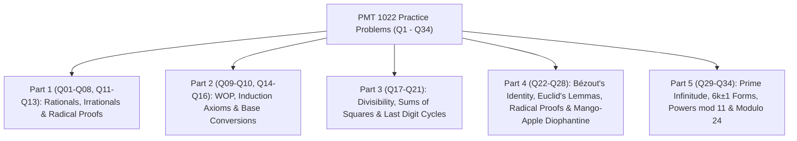

# 🏛️ PMT 1022 Introduction to Number Theory — Practice Problems Master Discussion (All 34 Questions)

> [!NOTE]
> **Course:** PMT 1022 / MAT 122 (Basics of Number Theory / Introduction to Number Theory)  
> **Source Document:** [`practice problems.pdf`](PMAT/1022/Papers/practice%20problems.pdf)  
> **Total Questions:** 34 Comprehensive Pure Mathematics Practice Problems  
> **Course Index:** [PMT 1022 Master Syllabus Index](PMAT/1022/Short%20Notes/00_PMT_1022_Number_Theory_Syllabus_Master_Index.md)

---

## 🧭 Topic Navigation (Questions 01 – 34)

---

# 📚 Part 1: Rational & Irrational Numbers (Q01 – Q08, Q11 – Q13)

> 🔗 **අදාළ Short Note & Lecture Slides:**
> * 📘 **Short Note:** [01_Foundations_Real_Numbers_and_Base_Representations.md](PMAT/1022/Short%20Notes/01_Foundations_Real_Numbers_and_Base_Representations.md)
> * 📑 **Lecture Slide:** [`01_Lesson_01_Introduction_to_Number_Theory_and_Sets.pdf`](PMAT/1022/Lecture%20Notes/01_Lesson_01_Introduction_to_Number_Theory_and_Sets.pdf)

---

### ❓ Question 01: Sum of Rational and Irrational is Irrational
**Theorem:** Let $q \in \mathbb{Q}$ and $x \in \mathbb{R} \setminus \mathbb{Q}$ (irrational). Then **$q + x$ is irrational**.

**Rigorous Proof (by Contradiction):**
1. Assume to the contrary that $q + x = r \in \mathbb{Q}$.
2. Then $x = r - q$.
3. Since $r, q \in \mathbb{Q}$, let $r = \frac{a}{b}$ and $q = \frac{c}{d}$ with $a, b, c, d \in \mathbb{Z}, b, d \neq 0$.
4. Then $x = \frac{a}{b} - \frac{c}{d} = \frac{ad - bc}{bd}$.
5. Since $ad - bc \in \mathbb{Z}$ and $bd \neq 0 \in \mathbb{Z}$, this implies $x \in \mathbb{Q}$.
6. This directly **contradicts** the hypothesis that $x$ is irrational.
7. Hence, $q + x$ is **irrational**. $\blacksquare$

---

### ❓ Question 02: Product of Two Odd Integers is Always Odd
**Rigorous Proof:**
1. Let $m$ and $n$ be odd integers. Then $\exists k, j \in \mathbb{Z}$ such that $m = 2k + 1$ and $n = 2j + 1$.
2. Their product is:
   $$mn = (2k + 1)(2j + 1) = 4kj + 2k + 2j + 1 = 2(2kj + k + j) + 1$$
3. Since $k, j \in \mathbb{Z}$, $M = 2kj + k + j \in \mathbb{Z}$.
4. Thus $mn = 2M + 1$, which is of the form of an odd integer.
5. Therefore, $mn$ is **odd**. $\blacksquare$

---

### ❓ Question 03: If $mn$ is Odd, then Both $m$ and $n$ Must be Odd
**Rigorous Proof (by Contrapositive):**
1. Statement: If $mn$ is odd $\implies$ $m$ is odd and $n$ is odd.
2. Contrapositive: If $m$ is even or $n$ is even $\implies$ $mn$ is even.
3. Without loss of generality, assume $m$ is even ($m = 2k$ for $k \in \mathbb{Z}$).
4. Then $mn = (2k)n = 2(kn)$.
5. Since $kn \in \mathbb{Z}$, $mn$ is even.
6. Since the contrapositive is true, the original statement is **True**. $\blacksquare$

---

### ❓ Question 04: Does the Sum of Two Irrationals Always Irrational?
* **Answer:** **NO**.
* **Justification (Counterexample):**
  Let $x = \sqrt{2}$ (irrational) and $y = -\sqrt{2}$ (irrational).
  Their sum is $x + y = \sqrt{2} + (-\sqrt{2}) = 0 = \frac{0}{1} \in \mathbb{Q}$ (rational). $\blacksquare$

---

### ❓ Question 05: Product of Non-Zero Rational and Irrational is Irrational
**Rigorous Proof (by Contradiction):**
1. Let $q \in \mathbb{Q} \setminus \{0\}$ and $x \in \mathbb{R} \setminus \mathbb{Q}$.
2. Assume to the contrary that $q x = r \in \mathbb{Q}$.
3. Since $q \neq 0$, $x = \frac{r}{q} = r \cdot \frac{1}{q}$.
4. Since the quotient of two rational numbers (with non-zero denominator) is rational, $x \in \mathbb{Q}$.
5. Contradiction! Thus $qx$ is **irrational**. $\blacksquare$

---

### ❓ Question 06: Irrationality of $\sqrt{2}$ and Deduction of $\frac{\sqrt{2}}{1+\sqrt{2}}$
1. **$\sqrt{2}$ is irrational:** Standard proof by contradiction ($\sqrt{2} = a/b \implies a^2 = 2b^2 \implies 2|a \implies a=2k \implies b^2=2k^2 \implies 2|b \implies \gcd(a,b) \ge 2$, contradiction).
2. **Deduction:** Assume $y = \frac{\sqrt{2}}{1+\sqrt{2}} \in \mathbb{Q}$.
   $$\frac{1}{y} = \frac{1+\sqrt{2}}{\sqrt{2}} = \frac{1}{\sqrt{2}} + 1 \implies \frac{1}{y} - 1 = \frac{1}{\sqrt{2}} \implies \sqrt{2} = \frac{y}{1 - y}$$
   Since $y \in \mathbb{Q}$, $\frac{y}{1-y} \in \mathbb{Q} \implies \sqrt{2} \in \mathbb{Q}$, a contradiction! Thus $\frac{\sqrt{2}}{1+\sqrt{2}}$ is **irrational**. $\blacksquare$

---

### ❓ Question 07: Density of Rational Numbers
**Theorem:** Between any two distinct rational numbers $r_1 < r_2$, there exists a rational number.

**Proof:**
Take the midpoint $m = \frac{r_1 + r_2}{2}$.
Since $r_1, r_2 \in \mathbb{Q}$, their sum and quotient by 2 is rational ($m \in \mathbb{Q}$).
Since $r_1 < r_2 \implies r_1 + r_1 < r_1 + r_2 < r_2 + r_2 \implies 2r_1 < r_1 + r_2 < 2r_2 \implies r_1 < m < r_2$. $\blacksquare$

---

### ❓ Question 08: Density of Irrationals Between Rational and Irrational
**Theorem:** Between a rational $r$ and an irrational $x$ ($r < x$), there exists an irrational number.

**Proof:**
Let $y = r + \frac{x - r}{\sqrt{2}}$.
* Since $x > r$, $\frac{x - r}{\sqrt{2}} > 0 \implies y > r$.
* Since $\sqrt{2} > 1$, $\frac{x - r}{\sqrt{2}} < x - r \implies y < r + (x - r) = x$.
* Thus $r < y < x$.
* Since $\frac{x - r}{\sqrt{2}}$ is irrational, by Q01, $y$ is **irrational**. $\blacksquare$

---

### ❓ Question 11: Is $22/7$ a Rational Number?
* **Answer:** **YES**.
* **Justification:** By definition, a rational number is any number that can be expressed as the ratio of two integers $\frac{a}{b}$ with $b \neq 0$. Here $a = 22 \in \mathbb{Z}$ and $b = 7 \in \mathbb{Z} \setminus \{0\}$.
*(Note: $22/7$ is an approximation of $\pi$, but $22/7 \in \mathbb{Q}$ whereas $\pi \notin \mathbb{Q}$).* $\blacksquare$

---

### ❓ Question 12: Rational Form of $0.11452323\dots$
Let $x = 0.1145\overline{23}$:
$$10000x = 1145.\overline{23}, \quad 1000000x = 114523.\overline{23}$$
$$990000x = 114523 - 1145 = 113378 \implies \mathbf{x = \frac{113378}{990000} = \frac{56689}{495000}} \quad \blacksquare$$

---

### ❓ Question 13: Is $0.101001000100001\dots$ a Rational Number?
* **Answer:** **NO**.
* **Justification:** A decimal represents a rational number if and only if it is terminating or eventually repeating (periodic). The sequence of zeros between ones increases indefinitely ($1, 2, 3, 4, 5, \dots$), so no block of digits ever repeats periodically. Thus, it is an **irrational number**. $\blacksquare$

---

# 📚 Part 2: WOP, Induction & Base Representations (Q09 – Q10, Q14 – Q16)

> 🔗 **අදාළ Short Note & Lecture Slides:**
> * 📘 **Short Notes:** 
>   * [01_Foundations_Real_Numbers_and_Base_Representations.md](PMAT/1022/Short%20Notes/01_Foundations_Real_Numbers_and_Base_Representations.md)
>   * [02_Mathematical_Induction_and_Well_Ordering_Principle.md](PMAT/1022/Short%20Notes/02_Mathematical_Induction_and_Well_Ordering_Principle.md)
> * 📑 **Lecture Slides:**
>   * [`01_Lesson_02_Basis_Representation_of_Integers.pdf`](PMAT/1022/Lecture%20Notes/01_Lesson_02_Basis_Representation_of_Integers.pdf)
>   * [`02_Lesson_03_Mathematical_Induction.pdf`](PMAT/1022/Lecture%20Notes/02_Lesson_03_Mathematical_Induction.pdf)
>   * [`02_Lesson_04_Well_Ordering_Principle.pdf`](PMAT/1022/Lecture%20Notes/02_Lesson_04_Well_Ordering_Principle.pdf)

---

### ❓ Question 09: State the Well-Ordering Principle (WOP)
**Axiom (WOP):** Every non-empty subset $S$ of positive integers ($\mathbb{Z}^+$ or $\mathbb{N}$) contains a least element (i.e. $\exists m \in S$ such that $\forall x \in S, m \le x$). $\blacksquare$

---

### ❓ Question 10: Prove Principle of Mathematical Induction using WOP
**Rigorous Proof:**
1. Let $P(n)$ be a predicate satisfying:
   * (i) $P(1)$ is True.
   * (ii) $\forall k \in \mathbb{Z}^+ (P(k) \implies P(k+1))$.
2. Assume to the contrary that $P(n)$ is not true for all $n \in \mathbb{Z}^+$.
3. Define the set of counterexamples: $S = \{n \in \mathbb{Z}^+ \mid P(n) \text{ is False}\}$.
4. By assumption, $S \neq \emptyset$ and $S \subseteq \mathbb{Z}^+$.
5. By WOP, $S$ has a least element, say $m \in S$.
6. Since $P(1)$ is True, $1 \notin S$, so $m > 1 \implies m - 1 \ge 1$.
7. Since $m - 1 < m$ and $m$ is the *least* element of $S$, $m - 1 \notin S$.
8. This means $P(m - 1)$ is **True**.
9. By condition (ii), $P(m - 1) \implies P((m - 1) + 1) = P(m)$ is **True**.
10. This contradicts $m \in S$ ($P(m)$ is False!).
11. Therefore, $S = \emptyset$, which proves $P(n)$ is True for all $n \in \mathbb{Z}^+$. $\blacksquare$

---

### ❓ Question 14: Base 10 of $(4536)_7$
$$(4536)_7 = 4(7^3) + 5(7^2) + 3(7^1) + 6(7^0) = 4(343) + 5(49) + 3(7) + 6(1) = 1372 + 245 + 21 + 6 = \mathbf{1644_{10}} \quad \blacksquare$$

---

### ❓ Question 15: Divisibility by 3 Digital Sum Theorem
**Theorem:** $3 \mid (a_m \dots a_0)_{10} \iff 3 \mid \sum_{i=0}^m a_i$.

**Proof:**
Since $10 \equiv 1 \pmod 3$, for any power $i \ge 0$, $10^i \equiv 1^i \equiv 1 \pmod 3$.
$$N = \sum_{i=0}^m a_i 10^i \equiv \sum_{i=0}^m a_i (1) = \sum_{i=0}^m a_i \pmod 3$$
Thus $3 \mid N \iff N \equiv 0 \pmod 3 \iff \sum_{i=0}^m a_i \equiv 0 \pmod 3 \iff \mathbf{3 \mid \sum a_i}$. $\blacksquare$

---

### ❓ Question 16: Convert $1234_{10}$ to Binary
$$\begin{aligned}
1234 \div 2 &= 617 \quad (r=0) \\
617 \div 2 &= 308 \quad (r=1) \\
308 \div 2 &= 154 \quad (r=0) \\
154 \div 2 &= 77 \quad (r=0) \\
77 \div 2 &= 38 \quad (r=1) \\
38 \div 2 &= 19 \quad (r=0) \\
19 \div 2 &= 9 \quad (r=1) \\
9 \div 2 &= 4 \quad (r=1) \\
4 \div 2 &= 2 \quad (r=0) \\
2 \div 2 &= 1 \quad (r=0) \\
1 \div 2 &= 0 \quad (r=1)
\end{aligned}$$
Reading remainders bottom to top:
$$\mathbf{1234_{10} = (10011010010)_2} \quad \blacksquare$$

---

# 📚 Part 3: Divisibility & Forms of Integers (Q17 – Q21)

> 🔗 **අදාළ Short Note & Lecture Slides:**
> * 📘 **Short Notes:**
>   * [03_Divisibility_Theory_and_Elementary_Properties.md](PMAT/1022/Short%20Notes/03_Divisibility_Theory_and_Elementary_Properties.md)
>   * [04_The_Division_Algorithm_and_Form_of_Integers.md](PMAT/1022/Short%20Notes/04_The_Division_Algorithm_and_Form_of_Integers.md)
>   * [08_Modular_Arithmetic_Congruences_and_Linear_Congruences.md](PMAT/1022/Short%20Notes/08_Modular_Arithmetic_Congruences_and_Linear_Congruences.md)
> * 📑 **Lecture Slides:**
>   * [`03_Lesson_05_Divisibility_Theory_and_Properties.pdf`](PMAT/1022/Lecture%20Notes/03_Lesson_05_Divisibility_Theory_and_Properties.pdf)
>   * [`04_Lesson_06_The_Division_Algorithm_Part_1.pdf`](PMAT/1022/Lecture%20Notes/04_Lesson_06_The_Division_Algorithm_Part_1.pdf)
>   * [`04_Lesson_07_Division_Algorithm_Applications_and_Parity.pdf`](PMAT/1022/Lecture%20Notes/04_Lesson_07_Division_Algorithm_Applications_and_Parity.pdf)
>   * [`08_Lesson_11_Modular_Arithmetic_and_Congruences.pdf`](PMAT/1022/Lecture%20Notes/08_Lesson_11_Modular_Arithmetic_and_Congruences.pdf)

---

### ❓ Question 17: True / False on Divisibility Properties
* **(i) If $a \mid b$ and $b \mid a$, then $a = b$ or $b = -a$:**
  **TRUE**. $b = k_1 a$ and $a = k_2 b \implies a = k_1 k_2 a \implies k_1 k_2 = 1 \implies k_1 = k_2 = \pm 1 \implies a = \pm b$.
* **(ii) If $a \mid (b + c)$, then $a \mid b$ or $a \mid c$:**
  **FALSE**. Counterexample: $5 \mid (2 + 3 = 5)$, but $5 \nmid 2$ and $5 \nmid 3$.
* **(iii) If $a \nmid b$, then $b \nmid a$:**
  **FALSE**. Counterexample: $4 \nmid 2$, but $2 \mid 4$.
* **(iv) If $a \mid b$ and $c \mid d$, then $ac \mid bd$:**
  **TRUE**. $b = k_1 a$ and $d = k_2 c \implies bd = (k_1 k_2)(ac) \implies ac \mid bd$. $\blacksquare$

---

### ❓ Question 18: $4k + 3$ Cannot be a Sum of Two Squares
Since $x^2 \equiv 0 \text{ or } 1 \pmod 4$, $a^2 + b^2 \in \{0, 1, 2\} \pmod 4$.
An integer of form $4k + 3 \equiv 3 \pmod 4$. Since $3 \notin \{0, 1, 2\}$, **$a^2 + b^2 \neq 4k + 3$**. $\blacksquare$

---

### ❓ Question 19: $4k + 2$ is Never a Perfect Square
For any integer $n$, if $n = 2m$ (even), $n^2 = 4m^2 = 4k$. If $n = 2m+1$ (odd), $n^2 = 4(m^2+m) + 1 = 4k+1$.
Thus all squares are of the form $4k$ or $4k+1$. Therefore, $4k+2$ is **never a perfect square**. $\blacksquare$

---

### ❓ Question 20: Divisibility Product Hypothesis
**Question:** If $1|a, 2|ab, 3|abc, 4|abcd, 5|abcde$, is it necessary that $120 \mid abcde$?

* **Answer:** **NO**.
* **Counterexample:** Let $a=2, b=1, c=3, d=2, e=5$.
  * $1 \mid 2$ (T), $2 \mid (2\times 1 = 2)$ (T), $3 \mid (2\times 1\times 3 = 6)$ (T), $4 \mid (6\times 2 = 12)$ (T), $5 \mid (12\times 5 = 60)$ (T).
  * The product is $abcde = 60$.
  * But $120 \nmid 60$. Hence, it is **not necessary**. $\blacksquare$

---

### ❓ Question 21: Last Digit of Powers
* (i) $50023^{756} \equiv 3^{756} = (3^4)^{189} \equiv 1^{189} = \mathbf{1 \pmod{10}}$.
* (ii) $71123^{719} \equiv 3^{719} = (3^4)^{179} \cdot 3^3 \equiv 1 \cdot 27 \equiv \mathbf{7 \pmod{10}}$.
* (iii) $70000^{29} \equiv \mathbf{0 \pmod{10}}$.
* (iv) $2^{100} + 3^{100} \equiv 6 + 1 = \mathbf{7 \pmod{10}}$. $\blacksquare$

---

# 📚 Part 4: GCD, Bézout & Diophantine Equations (Q22 – Q28)

> 🔗 **අදාළ Short Note & Lecture Slides:**
> * 📘 **Short Notes:**
>   * [05_Greatest_Common_Divisor_and_Bezout_Identity.md](PMAT/1022/Short%20Notes/05_Greatest_Common_Divisor_and_Bezout_Identity.md)
>   * [06_Euclidean_Algorithm_and_Linear_Diophantine_Equations.md](PMAT/1022/Short%20Notes/06_Euclidean_Algorithm_and_Linear_Diophantine_Equations.md)
> * 📑 **Lecture Slides:**
>   * [`05_Lesson_08_Greatest_Common_Divisor_and_Properties.pdf`](PMAT/1022/Lecture%20Notes/05_Lesson_08_Greatest_Common_Divisor_and_Properties.pdf)
>   * [`06_Lesson_09_Euclidean_Algorithm_and_Diophantine_Equations.pdf`](PMAT/1022/Lecture%20Notes/06_Lesson_09_Euclidean_Algorithm_and_Diophantine_Equations.pdf)

---

### ❓ Question 22: Bézout Coprime Characterization
$\gcd(a, b) = 1 \iff \exists x, y \in \mathbb{Z} (ax + by = 1)$.
*(Proven in detail in Module 05 Theorem 5.2.7 and Model Paper Q3(a)).* $\blacksquare$

---

### ❓ Question 23 & 24: Coprime Division Properties
* **Q23:** $a \mid c \land b \mid c \land \gcd(a, b) = 1 \implies ab \mid c$. *(Proven in Model Paper Q3(b))*. $\blacksquare$
* **Q24:** $a \mid bc \land \gcd(a, b) = 1 \implies a \mid c$. *(Proven in Model Paper Q3(c))*. $\blacksquare$

---

### ❓ Question 25 & 26: Irrationality of $\sqrt{5}$ and $\sqrt{35}$
* **Q25 ($\sqrt{5}$ is irrational):** $\sqrt{5} = a/b \implies a^2 = 5b^2 \implies 5|a^2 \implies 5|a \implies a=5k \implies b^2=5k^2 \implies 5|b \implies \gcd(a,b) \ge 5$, contradiction. $\blacksquare$
* **Q26 ($\sqrt{35}$ is irrational):** $\sqrt{35} = a/b \implies a^2 = 35b^2 \implies 5|a^2 \implies 5|a \implies a=5k \implies 25k^2 = 35b^2 \implies 5k^2 = 7b^2 \implies 5|7b^2 \implies 5|b \implies \gcd(a,b) \ge 5$, contradiction. $\blacksquare$

---

### ❓ Question 27: Solve $34x + 21y = 1$ via Euclidean Algorithm
$$\begin{aligned}
34 &= 21(1) + 13 \\
21 &= 13(1) + 8 \\
13 &= 8(1) + 5 \\
8 &= 5(1) + 3 \\
5 &= 3(1) + 2 \\
3 &= 2(1) + 1
\end{aligned}$$
Back-substitution yields $1 = 34(-8) + 21(13)$.
General Solution: **$x = -8 + 21t, y = 13 - 34t \quad (t \in \mathbb{Z})$**. $\blacksquare$

---

### ❓ Question 28: Mango and Apple Diophantine Problem
**Equation:** $31m + 21a = 1770$ with $m > a > 0$.
* General solution: $m = -3540 + 21t$ and $a = 5310 - 31t$.
* For $t = 171$: $m = -3540 + 21(171) = \mathbf{51}$, $a = 5310 - 31(171) = \mathbf{9}$.
* Since $51 > 9 > 0$, the housewife buys **51 mangoes and 9 apples**. $\blacksquare$

---

# 📚 Part 5: Primes & Modular Congruences (Q29 – Q34)

> 🔗 **අදාළ Short Note & Lecture Slides:**
> * 📘 **Short Notes:**
>   * [07_Prime_Numbers_Factorization_and_Euclid_Lemmas.md](PMAT/1022/Short%20Notes/07_Prime_Numbers_Factorization_and_Euclid_Lemmas.md)
>   * [08_Modular_Arithmetic_Congruences_and_Linear_Congruences.md](PMAT/1022/Short%20Notes/08_Modular_Arithmetic_Congruences_and_Linear_Congruences.md)
> * 📑 **Lecture Slides:**
>   * [`07_Lesson_10_Primes_and_Fundamental_Theorem_of_Arithmetic.pdf`](PMAT/1022/Lecture%20Notes/07_Lesson_10_Primes_and_Fundamental_Theorem_of_Arithmetic.pdf)
>   * [`08_Lesson_11_Modular_Arithmetic_and_Congruences.pdf`](PMAT/1022/Lecture%20Notes/08_Lesson_11_Modular_Arithmetic_and_Congruences.pdf)

---

### ❓ Question 29: Infinitude of Primes
Euclid's proof: Suppose finitely many primes $p_1, \dots, p_n$. Construct $N = p_1 \dots p_n + 1$. Any prime divisor $p \mid N$ cannot be in the list (since $p \mid 1$), contradiction. $\blacksquare$

---

### ❓ Question 30: Prime Form $6k \pm 1$ & $24 \mid (p^2 - 1)$
Any integer modulo 6 is $6k, 6k+1, 6k+2, 6k+3, 6k+4, 6k+5$. Since $p > 3$ is prime, $2 \nmid p$ and $3 \nmid p \implies p = 6k \pm 1$.
Then $p^2 - 1 = (p-1)(p+1)$. Since $p$ is odd, $8 \mid (p-1)(p+1)$, and since $3 \nmid p$, $3 \mid (p^2-1) \implies \mathbf{24 \mid (p^2 - 1)}$. $\blacksquare$

---

### ❓ Question 31: Smallest $d$ for $7^d \equiv -1 \pmod{11}$
$7^1 \equiv 7, 7^2 \equiv 5, 7^3 \equiv 2, 7^4 \equiv 3, 7^5 \equiv 10 \equiv \mathbf{-1 \pmod{11}}$.
Smallest integer is **$d = 5$**. $\blacksquare$

---

### ❓ Question 32: $p^2 \equiv 1 \pmod{24}$ for Prime $p \ge 5$
Equivalent to Q30 ($24 \mid (p^2 - 1) \iff \mathbf{p^2 \equiv 1 \pmod{24}}$). $\blacksquare$

---

### ❓ Question 33: Remainder of $7^{2026} \div 11$
$7^5 \equiv -1 \implies 7^{10} \equiv 1 \pmod{11}$.
$2026 = 10(202) + 6 \implies 7^{2026} \equiv (7^{10})^{202} \cdot 7^6 \equiv 1 \cdot (7^5 \cdot 7) \equiv -1 \cdot 7 = -7 \equiv \mathbf{4 \pmod{11}}$. $\blacksquare$

---

### ❓ Question 34: Compatibility of Congruences with Addition & Multiplication
**Theorem:** If $a \equiv b \pmod n$, then for any $c \in \mathbb{Z}$:
1. **$a + c \equiv b + c \pmod n$:**
   $a \equiv b \pmod n \implies n \mid (a - b)$.
   Notice $(a + c) - (b + c) = a - b$. Thus $n \mid ((a + c) - (b + c)) \implies \mathbf{a + c \equiv b + c \pmod n}$.
2. **$ac \equiv bc \pmod n$:**
   $ac - bc = c(a - b)$. Since $n \mid (a - b)$, $n \mid c(a - b) \implies \mathbf{ac \equiv bc \pmod n}$. $\blacksquare$
