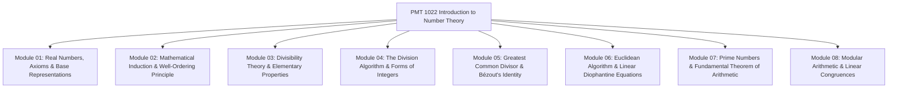

# 🏛️ PMT 1022 Introduction to Number Theory — Master Syllabus & Course Navigation Index

> [!NOTE]
> **Course Information**
> * **Course Code:** PMT 1022 / MAT 122 (Introduction to Number Theory / Basics of Number Theory)
> * **Academic Unit:** Department of Mathematics, Faculty of Applied Sciences, University of Sri Jayewardenepura
> * **Target Audience:** First Year BSc Undergraduates
> * **Course Credit:** 02 Credits (Compulsory Pure Mathematics Foundation)
> * **Purpose:** To build a rigorous foundation in the properties of integers $\mathbb{Z}$, divisibility theory, base-$b$ representations, Mathematical Induction & Well-Ordering Principle, Greatest Common Divisors, the Euclidean Algorithm, Linear Diophantine Equations, Prime Number Factorization, and Modular Arithmetic.

---

## 🗺️ Master Curriculum & Note Module Map

Click on any module below to jump directly to its complete, step-by-step "Zero-to-Hero" study guide:

---

### 📑 Comprehensive Modules Directory

| # | Note Module File | Corresponding Lecture PDFs | Core Focus Areas & Proof Techniques |
| :-: | :--- | :--- | :--- |
| **01** | [01. Foundations, Real Numbers & Base Representations](PMAT/1022/Short%20Notes/01_Foundations_Real_Numbers_and_Base_Representations.md) | [`01_Lesson_01`](PMAT/1022/Lecture%20Notes/01_Lesson_01_Introduction_to_Number_Theory_and_Sets.pdf), [`01_Lesson_02`](PMAT/1022/Lecture%20Notes/01_Lesson_02_Basis_Representation_of_Integers.pdf) | Sets of Numbers ($\mathbb{N}, \mathbb{Z}, \mathbb{Q}, \mathbb{R}$), Field & Order Axioms of $\mathbb{R}$, Absolute Value Properties, Base-$b$ Positional Representation, Base-conversion algorithms (Binary, Octal, Decimal, Hexadecimal) |
| **02** | [02. Mathematical Induction & Well-Ordering Principle](PMAT/1022/Short%20Notes/02_Mathematical_Induction_and_Well_Ordering_Principle.md) | [`02_Lesson_03`](PMAT/1022/Lecture%20Notes/02_Lesson_03_Mathematical_Induction.pdf), [`02_Lesson_04`](PMAT/1022/Lecture%20Notes/02_Lesson_04_Well_Ordering_Principle.pdf) | Weak Induction (Summations, Inequalities, Divisibility), Strong Induction, Well-Ordering Principle (WOP), Least Element Definition, Archimedean Property of $\mathbb{R}$, Equivalence of WOP & Induction |
| **03** | [03. Divisibility Theory & Elementary Properties](PMAT/1022/Short%20Notes/03_Divisibility_Theory_and_Elementary_Properties.md) | [`03_Lesson_05`](PMAT/1022/Lecture%20Notes/03_Lesson_05_Divisibility_Theory_and_Properties.pdf) | Formal Divisibility Relation ($a \mid b$), 10 Master Divisibility Theorems, Linear Combination Theorem ($a \mid b \land a \mid c \implies a \mid (bx + cy)$), Bounds & Parity of Integers |
| **04** | [04. The Division Algorithm & Forms of Integers](PMAT/1022/Short%20Notes/04_The_Division_Algorithm_and_Form_of_Integers.md) | [`04_Lesson_06`](PMAT/1022/Lecture%20Notes/04_Lesson_06_The_Division_Algorithm_Part_1.pdf), [`04_Lesson_07`](PMAT/1022/Lecture%20Notes/04_Lesson_07_Division_Algorithm_Applications_and_Parity.pdf) | The Division Algorithm ($a = bq + r, 0 \le r < b$), Existence and Uniqueness Proofs, Forms of Integers ($2k, 2k+1, 3k+r, 4k+r$), Last-digit analysis, Perfect square characterization ($4k$ or $4k+1$) |
| **05** | [05. Greatest Common Divisor & Bézout's Identity](PMAT/1022/Short%20Notes/05_Greatest_Common_Divisor_and_Bezout_Identity.md) | [`05_Lesson_08`](PMAT/1022/Lecture%20Notes/05_Lesson_08_Greatest_Common_Divisor_and_Properties.pdf) | Definition of $\gcd(a, b)$, Properties of $\gcd$, Relatively Prime (Coprime) Integers ($\gcd(a, b) = 1$), Bézout's Identity ($\gcd(a, b) = \min\{ax + by > 0\}$), Characterization of $\gcd$ as Linear Combination |
| **06** | [06. Euclidean Algorithm & Linear Diophantine Equations](PMAT/1022/Short%20Notes/06_Euclidean_Algorithm_and_Linear_Diophantine_Equations.md) | [`06_Lesson_09`](PMAT/1022/Lecture%20Notes/06_Lesson_09_Euclidean_Algorithm_and_Diophantine_Equations.pdf) | The Euclidean Algorithm, Extended Euclidean Algorithm (Back-substitution for Bézout coefficients), Linear Diophantine Equations $ax + by = c$, Solvability Criterion ($\gcd(a, b) \mid c$), General Integer Solutions Formula |
| **07** | [07. Prime Numbers & Fundamental Theorem of Arithmetic](PMAT/1022/Short%20Notes/07_Prime_Numbers_Factorization_and_Euclid_Lemmas.md) | [`07_Lesson_10`](PMAT/1022/Lecture%20Notes/07_Lesson_10_Primes_and_Fundamental_Theorem_of_Arithmetic.pdf) | Prime vs Composite Integers, Sieve of Eratosthenes, Euclid's Lemma ($p \mid ab \implies p \mid a \lor p \mid b$), Fundamental Theorem of Arithmetic (FTA - Existence and Uniqueness of Prime Factorization), Infinitude of Primes ($4k+3$ forms) |
| **08** | [08. Modular Arithmetic & Linear Congruences](PMAT/1022/Short%20Notes/08_Modular_Arithmetic_and_Congruences.md) | [`08_Lesson_11`](PMAT/1022/Lecture%20Notes/08_Lesson_11_Modular_Arithmetic_and_Congruences.pdf) | Congruence Relation ($a \equiv b \pmod m$), Basic Properties of Congruences, Arithmetic Compatibility ($+ , \times$), Complete Residue Systems Modulo $m$, Linear Congruences ($ax \equiv b \pmod m$) |

---

## 🧠 Master Number Theory Symbol & Notation Reference

| Symbol | LaTeX | Meaning | Sinhala Meaning |
| :---: | :---: | :--- | :--- |
| $\mathbb{N}$ | `\mathbb{N}` | Set of Natural Numbers $\{1, 2, 3, \dots\}$ | ස්වාභාවික සංඛ්‍යා කුලකය |
| $\mathbb{Z}$ | `\mathbb{Z}` | Set of all Integers $\{\dots, -2, -1, 0, 1, 2, \dots\}$ | නිඛිල කුලකය |
| $\mathbb{Z}^+$ | `\mathbb{Z}^+` | Set of Positive Integers $\{1, 2, 3, \dots\} = \mathbb{N}$ | ධන නිඛිල කුලකය |
| $\mathbb{Q}$ | `\mathbb{Q}` | Set of Rational Numbers $\{a/b \mid a, b \in \mathbb{Z}, b \neq 0\}$ | පරිමේය සංඛ්‍යා කුලකය |
| $\mathbb{R}$ | `\mathbb{R}` | Set of Real Numbers | තාත්වික සංඛ්‍යා කුලකය |
| $a \mid b$ | `a \mid b` | $a$ divides $b$ ($b$ is a multiple of $a$) | $a$ මගින් $b$ බෙදේ ($b = ak$) |
| $a \nmid b$ | `a \nmid b` | $a$ does not divide $b$ | $a$ මගින් $b$ නොබෙදේ |
| $\gcd(a, b)$ | `\gcd(a, b)` | Greatest Common Divisor of $a$ and $b$ | $a$ සහ $b$ හි මහා පොදු සාධකය (ම.පො.සා.) |
| $\operatorname{lcm}(a, b)$ | `\operatorname{lcm}(a, b)` | Least Common Multiple of $a$ and $b$ | $a$ සහ $b$ හි කුඩාම පොදු ගුණාකාරය (කු.පො.ගු.) |
| $a \perp b$ | `\gcd(a, b) = 1` | $a$ and $b$ are relatively prime (coprime) | $a$ සහ $b$ එකිනෙකට ප්‍රථමක වේ |
| $a \equiv b \pmod m$ | `a \equiv b \pmod m` | $a$ is congruent to $b$ modulo $m$ ($m \mid (a - b)$) | $a$ සහ $b$ යනු $m$ මාතයෙන් සමගාමී වේ |
| $(a_k a_{k-1} \dots a_0)_b$ | `(a_k \dots a_0)_b` | Base-$b$ representation of an integer | $b$ පාදයේ සංඛ්‍යා නිරූපණය |
| $\pi(x)$ | `\pi(x)` | Prime counting function (number of primes $\le x$) | $x$ ට නොවැඩි ප්‍රථමක සංඛ්‍යා ගණන |

---

## 🏆 Exam Preparation Golden Rules for Number Theory
1. **Never divide by an integer without establishing divisibility:** In number theory, expressions like $\frac{a}{b}$ are fractions, not integers, unless you have explicitly proven that $b \mid a$. Always write algebraic products $a = bk$ instead of division.
2. **The Division Algorithm Remainder must satisfy $0 \le r < b$:** If $a = -25$ and $b = 7$, writing $-25 = 7(-3) - 4$ is **WRONG** because $r = -4 < 0$. The correct form is $-25 = 7(-4) + 3$ (where $q = -4$ and $r = 3$).
3. **Linear Diophantine Equation $ax + by = c$ Solvability Condition:** Integer solutions exist **if and only if $\gcd(a, b) \mid c$**. If $\gcd(a, b) \nmid c$, immediately state that no integer solutions exist.
4. **Euclid's Lemma requires $p$ to be Prime:** $p \mid ab \implies p \mid a \lor p \mid b$ is ONLY valid if $p$ is a prime number! (Counterexample for composite: $6 \mid (2 \times 3)$, but $6 \nmid 2$ and $6 \nmid 3$).
5. **Linear Congruence $ax \equiv b \pmod m$ has solutions $\iff \gcd(a, m) \mid b$:** If $d = \gcd(a, m) \mid b$, there are exactly $d$ mutually incongruent solutions modulo $m$.

---

## 📜 Past Papers & Model Paper Master Discussions

| Paper Title | Original PDF Document | Comprehensive Discussion & Solutions |
| :--- | :--- | :--- |
| **PMT 1022 Model Examination Paper** | [`model paper.pdf`](PMAT/1022/Papers/model%20paper.pdf) | [PMT 1022 Model Paper Master Discussion](PMAT/1022/Papers/PMT_1022_Model_Paper_Discussion.md) |
| **Practice Problems for Assignment 01** | [`Practice problems for assignment 01.pdf`](PMAT/1022/Papers/Practice%20problems%20for%20assignment%2001.pdf) | [Assignment 01 Practice Discussion](PMAT/1022/Papers/PMT_1022_Practice_Assignment_01_Discussion.md) |
| **PMT 1022 Practice Problems** | [`practice problems.pdf`](PMAT/1022/Papers/practice%20problems.pdf) | [Practice Problems Master Discussion](PMAT/1022/Papers/PMT_1022_Practice_Problems_Master_Discussion.md) |
