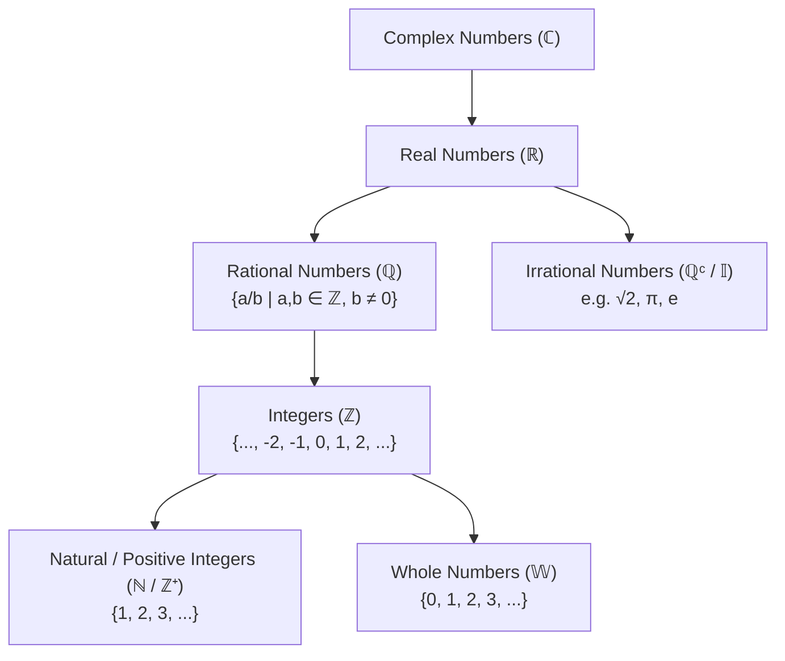
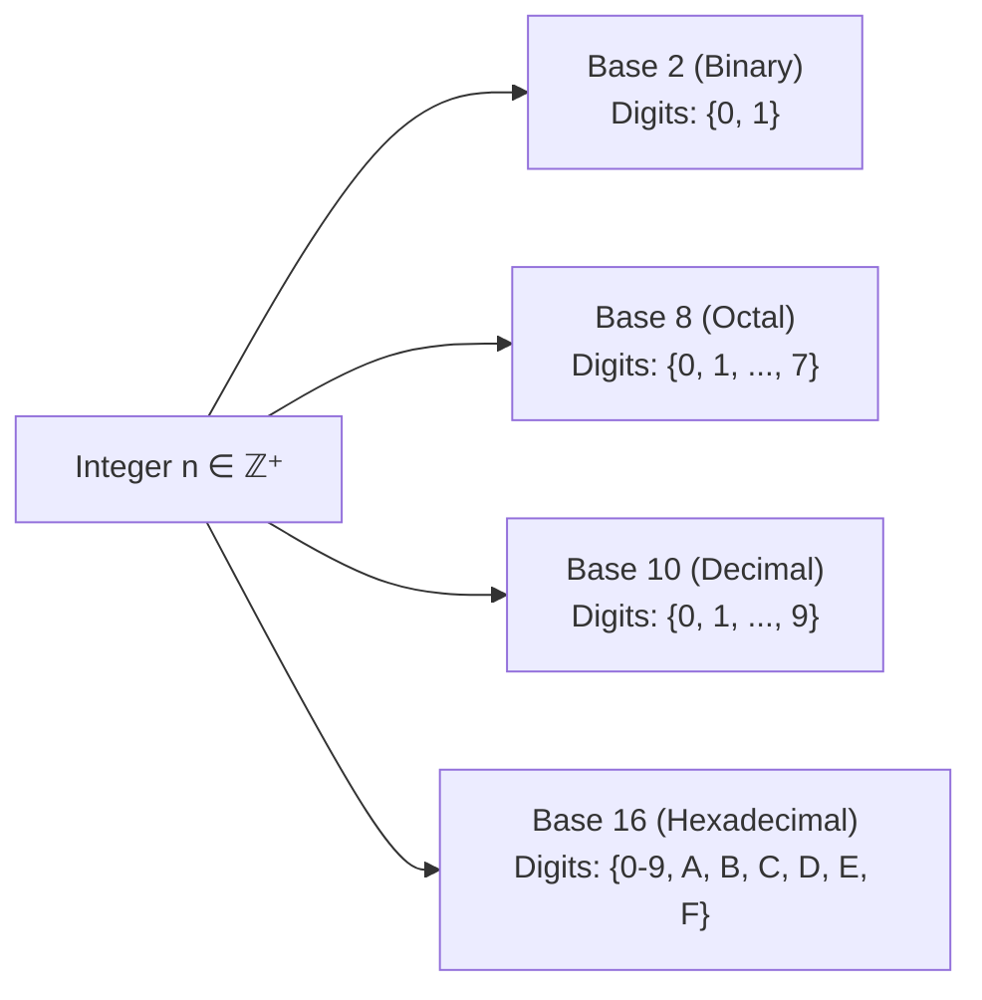

# 01. Foundations, Real Numbers & Base Representations

> [!NOTE]
> **Course Module Reference:** PMT 1022 (Introduction to Number Theory)  
> **Corresponding Lecture Slides:** [01_Lesson_01_Introduction_to_Number_Theory_and_Sets.pdf](../01_Lesson_01_Introduction_to_Number_Theory_and_Sets.pdf), [01_Lesson_02_Basis_Representation_of_Integers.pdf](../01_Lesson_02_Basis_Representation_of_Integers.pdf)  
> **Prerequisites:** Basic arithmetic operations and algebra.

---

## 1. Number Systems & Foundations (සංඛ්‍යා පද්ධති)

සංඛ්‍යා න්‍යාය (Number Theory) යනු ප්‍රධාන වශයෙන්ම **නිඛිල ($\mathbb{Z}$)** සහ ඒවායේ ගුණාංග පිළිබඳව හදාරන ගණිතයේ මූලිකම ශාඛාවයි.

### 📜 Master Hierarchy of Numbers
$$\mathbf{\mathbb{N} \subset \mathbb{W} \subset \mathbb{Z} \subset \mathbb{Q} \subset \mathbb{R} \subset \mathbb{C}}$$

---

## 2. Axioms of Real Numbers (තාත්වික සංඛ්‍යා වල ස්වයංසිද්ධි)

තාත්වික සංඛ්‍යා පද්ධතිය $(\mathbb{R}, +, \cdot, \le)$ ප්‍රධාන ස්වයංසිද්ධි කාණ්ඩ 2ක් මත පදනම් වේ:

### 1️⃣ Field Axioms (ක්ෂේත්‍ර ස්වයංසිද්ධි)
ඕනෑම $a, b, c \in \mathbb{R}$ සඳහා:
*   **Closure (සංවෘතතාව):** $a + b \in \mathbb{R}$ සහ $a \cdot b \in \mathbb{R}$.
*   **Commutative (පරිවර්ත්‍යතාව):** $a + b = b + a$ සහ $a \cdot b = b \cdot a$.
*   **Associative (සහචාරීතාව):** $(a + b) + c = a + (b + c)$ සහ $(a \cdot b) \cdot c = a \cdot (b \cdot c)$.
*   **Distributive (බෙදුම් නීතිය):** $a \cdot (b + c) = a \cdot b + a \cdot c$.
*   **Identity Elements (අනන්‍යතා සාමාජිකයන්):**
    * එකතු කිරීම සඳහා: $\exists 0 \in \mathbb{R}$ such that $a + 0 = a$.
    * ගුණ කිරීම සඳහා: $\exists 1 \in \mathbb{R}$ ($1 \neq 0$) such that $a \cdot 1 = a$.
*   **Inverses (ප්‍රතිලෝම):**
    * එකතු කිරීමේ ප්‍රතිලෝමය: $\forall a \in \mathbb{R}, \exists (-a) \in \mathbb{R}$ such that $a + (-a) = 0$.
    * ගුණ කිරීමේ ප්‍රතිලෝමය: $\forall a \neq 0, \exists a^{-1} = \frac{1}{a} \in \mathbb{R}$ such that $a \cdot a^{-1} = 1$.

### 2️⃣ Order Axioms (අනුපිළිවෙල ස්වයංසිද්ධි)
*   **Trichotomy Law (ත්‍රිකෝටික නීතිය):** ඕනෑම $a, b \in \mathbb{R}$ සඳහා පහත සම්බන්ධතා තුනෙන් **එකක් පමණක්** සත්‍ය වේ:
    $$\mathbf{a < b \quad \text{හෝ} \quad a = b \quad \text{හෝ} \quad a > b}$$
*   **Transitivity (සංක්‍රාන්තිකතාව):** $a < b \land b < c \implies a < c$.
*   **Monotonicity (ඒකතානතාව):**
    * $a < b \implies a + c < b + c$.
    * $a < b \land c > 0 \implies ac < bc$.
    * $a < b \land c < 0 \implies ac > bc$ *(සෘණ අගයකින් ගුණ කළ විට ලකුණ මාරු වේ!)*.

---

## 3. Absolute Value & Inequalities (නිරපේක්ෂ අගය)

### 📜 Formal Definition
$$|x| = \begin{cases} x & \text{if } x \ge 0 \\ -x & \text{if } x < 0 \end{cases}$$

### 🌟 Fundamental Properties
1. $|x| \ge 0$ for all $x \in \mathbb{R}$, and $|x| = 0 \iff x = 0$.
2. $|xy| = |x| \cdot |y|$.
3. $\left|\frac{x}{y}\right| = \frac{|x|}{|y|}$ (for $y \neq 0$).
4. $|-x| = |x|$ and $|x|^2 = x^2$.
5. **The Triangle Inequality (ත්‍රිකෝණ අසමානතාව):**
   $$\mathbf{|x + y| \le |x| + |y|}$$
6. **The Reverse Triangle Inequality:**
   $$\mathbf{||x| - |y|| \le |x - y|}$$

---

## 4. Basis (Base-$b$) Representation of Integers (පාද නිරූපණය)

දෛනික ජීවිතයේදී අප භාවිතා කරන්නේ 10 පාදයේ (Decimal system) සංඛ්‍යා ය. නමුත් පරිගණක හා සංඛ්‍යා න්‍යායේදී ඕනෑම නිඛිලයක් $b > 1$ වන ඕනෑම පාදයකින් නිරූපණය කළ හැක.

### 📜 The Base-$b$ Representation Theorem
> **Theorem:** Let $b \in \mathbb{Z}$ with $b > 1$ (the base). Every positive integer $n \in \mathbb{Z}^+$ can be uniquely expressed in the form:
> $$\mathbf{n = a_k b^k + a_{k-1} b^{k-1} + \dots + a_1 b + a_0 = (a_k a_{k-1} \dots a_1 a_0)_b}$$
> where:
> 1. $k \ge 0$ is a non-negative integer.
> 2. The leading coefficient $a_k \neq 0$.
> 3. Each digit $a_i$ satisfies **$0 \le a_i < b$** for $i = 0, 1, \dots, k$.

---

## 5. Base Conversion Algorithms (පාද පරිවර්තන ක්‍රම)

### 🔄 Algorithm 1: Base $b \to$ Decimal (Base 10)
සෑම ඉලක්කමක්ම ඊට අදාළ $b^i$ ස්ථානීය අගයෙන් ගුණ කර එකතු කරන්න.
$$\mathbf{(a_k a_{k-1} \dots a_0)_b = a_k \cdot b^k + a_{k-1} \cdot b^{k-1} + \dots + a_0 \cdot b^0}$$

### 🔄 Algorithm 2: Decimal (Base 10) $\to$ Base $b$
1. සංඛ්‍යාව $b$ න් බෙදමින් **ලබ්ධිය (Quotient)** සහ **ශේෂය (Remainder)** සටහන් කරන්න.
2. ලබ්ධිය 0 වන තුරු දිගටම බෙදන්න.
3. ලැබුණු ශේෂයන් **පහළ සිට ඉහළට (ප්‍රතිලෝම පිළිවෙලට)** ලියන්න.

---

## ✍️ Step-by-Step Worked Exam Problems

### 📌 Problem 1: Triangle Inequality Rigorous Proof
**Theorem:** Prove that for any $x, y \in \mathbb{R}$, **$|x + y| \le |x| + |y|$**.

**Rigorous Proof:**
1. From the definition of absolute value, for any real numbers $x, y$:
   $$-|x| \le x \le |x| \quad \text{සහ} \quad -|y| \le y \le |y|$$
2. Adding these two simultaneous inequalities:
   $$-(|x| + |y|) \le x + y \le (|x| + |y|)$$
3. Recall that $-M \le A \le M \iff |A| \le M$ for any $M \ge 0$.
4. Setting $A = x + y$ and $M = |x| + |y|$:
   $$|x + y| \le |x| + |y|$$
   $\blacksquare$

---

### 📌 Problem 2: Decimal to Base Conversion
**Question:** Express the decimal integer $n = 583_{10}$ in:
> (i) Binary (Base 2)  
> (ii) Octal (Base 8)  
> (iii) Hexadecimal (Base 16)

**Step-by-Step Solutions:**

*   **(i) Conversion to Binary (Base 2):**
    $$\begin{aligned}
    583 \div 2 &= 291 \quad \text{Remainder: } 1 \\
    291 \div 2 &= 145 \quad \text{Remainder: } 1 \\
    145 \div 2 &= 72 \quad \text{Remainder: } 1 \\
    72 \div 2 &= 36 \quad \text{Remainder: } 0 \\
    36 \div 2 &= 18 \quad \text{Remainder: } 0 \\
    18 \div 2 &= 9 \quad \text{Remainder: } 0 \\
    9 \div 2 &= 4 \quad \text{Remainder: } 1 \\
    4 \div 2 &= 2 \quad \text{Remainder: } 0 \\
    2 \div 2 &= 1 \quad \text{Remainder: } 0 \\
    1 \div 2 &= 0 \quad \text{Remainder: } 1
    \end{aligned}$$
    Reading remainders bottom to top:
    $$\mathbf{583_{10} = (1001000111)_2}$$

*   **(ii) Conversion to Octal (Base 8):**
    $$\begin{aligned}
    583 \div 8 &= 72 \quad \text{Remainder: } 7 \\
    72 \div 8 &= 9 \quad \text{Remainder: } 0 \\
    9 \div 8 &= 1 \quad \text{Remainder: } 1 \\
    1 \div 8 &= 0 \quad \text{Remainder: } 1
    \end{aligned}$$
    Reading remainders bottom to top:
    $$\mathbf{583_{10} = (1107)_8}$$

*   **(iii) Conversion to Hexadecimal (Base 16):**
    *(Note: $10=\text{A}, 11=\text{B}, 12=\text{C}, 13=\text{D}, 14=\text{E}, 15=\text{F}$)*
    $$\begin{aligned}
    583 \div 16 &= 36 \quad \text{Remainder: } 7 \\
    36 \div 16 &= 2 \quad \text{Remainder: } 4 \\
    2 \div 16 &= 0 \quad \text{Remainder: } 2
    \end{aligned}$$
    Reading remainders bottom to top:
    $$\mathbf{583_{10} = (247)_{16}}$$

---

### 📌 Problem 3: Base $b \to$ Decimal Conversion
**Question:** Convert $(3\text{A}5\text{F})_{16}$ to decimal.

**Solution:**
$$\begin{aligned}
(3\text{A}5\text{F})_{16} &= 3 \cdot 16^3 + 10 \cdot 16^2 + 5 \cdot 16^1 + 15 \cdot 16^0 \\
&= 3 \cdot 4096 + 10 \cdot 256 + 5 \cdot 16 + 15 \cdot 1 \\
&= 12288 + 2560 + 80 + 15 \\
&= \mathbf{14943_{10}}
\end{aligned}$$

### 📌 Problem 4: Digital Root & Divisibility Criteria (Lesson 02)
**Definition:** The **Digital Root ($dr(n)$)** of a positive integer $n$ is the single digit value obtained by repeatedly summing its digits until a single digit remains.

**Theorem:** For any positive integer $n = (a_k a_{k-1} \dots a_1 a_0)_{10}$:
$$n \equiv \sum_{i=0}^k a_i \pmod 9$$
*(In particular, $9 \mid n \iff 9 \mid \text{sum of digits}$, and $3 \mid n \iff 3 \mid \text{sum of digits}$).*

**Example:** Find the digital root of $n = 9887$.
$$\begin{aligned}
\text{Sum 1: } & 9 + 8 + 8 + 7 = 32 \\
\text{Sum 2: } & 3 + 2 = 5 \\
\mathbf{dr(9887)} &= \mathbf{5}
\end{aligned}$$
Since $5 \not\equiv 0 \pmod 9$ and $5 \not\equiv 0 \pmod 3$, $9887$ is neither divisible by 9 nor by 3. $\blacksquare$

---

### 📌 Problem 5: Irrationality of $\sqrt{3}$ (Lesson 01)
**Theorem:** Prove that **$\sqrt{3}$ is an irrational number**.

**Rigorous Proof (by Contradiction):**
1. Assume to the contrary that $\sqrt{3}$ is rational.
2. Then there exist integers $a, b \in \mathbb{Z}$ with $b \neq 0$ such that:
   $$\sqrt{3} = \frac{a}{b} \quad \text{where } \gcd(a, b) = 1 \text{ (in lowest terms)}$$
3. Squaring both sides gives:
   $$3 = \frac{a^2}{b^2} \implies a^2 = 3b^2$$
4. This implies that $3 \mid a^2$.
5. Since 3 is a prime number, by Euclid's Lemma, $3 \mid a^2 \implies \mathbf{3 \mid a}$.
6. Therefore, $\exists k \in \mathbb{Z}$ such that $a = 3k$.
7. Substitute $a = 3k$ into $a^2 = 3b^2$:
   $$(3k)^2 = 3b^2 \implies 9k^2 = 3b^2 \implies b^2 = 3k^2$$
8. This implies $3 \mid b^2 \implies \mathbf{3 \mid b}$.
9. Thus, $3 \mid a$ and $3 \mid b$, which means $\gcd(a, b) \ge 3$.
10. This directly **contradicts** our hypothesis that $\gcd(a, b) = 1$.
11. Hence, our assumption is false, which proves $\sqrt{3}$ is **irrational**. $\blacksquare$

---

### 📌 Problem 6: Identification Numbers & Check Digit Systems (Lesson 02)
To detect transmission errors in 10-digit identification numbers $a_1 a_2 \dots a_9 a_{10}$, the 10th digit $a_{10}$ (called the **check digit**) is chosen such that:
$$\sum_{i=1}^{10} i \cdot a_i \equiv 0 \pmod{11}$$
*(This weighted congruence instantly catches any single digit error or digit transposition!).* $\blacksquare$

## ⚠️ Exam Traps & Common Pitfalls

> [!CAUTION]
> **1. ශේෂයන් උඩ සිට පහළට ලිවීම:**
> Decimal සිට Base $b$ වලට හැරවීමේදී බෙදීමෙන් එන ශේෂයන් (Remainders) ලිවිය යුත්තේ **පහළ සිට ඉහළට (ප්‍රතිලෝමව)** වේ.
> 
> **2. Hexadecimal අකුරු වල අගයන් පටලවා ගැනීම:**
> $\text{A}=10, \text{B}=11, \text{C}=12, \text{D}=13, \text{E}=14, \text{F}=15$. $\text{A}$ යනු 1 නොවන බවත්, $\text{F}$ යනු 15 බවත් මතක තබා ගන්න.
> 
> **3. පාදයේ ඉලක්කමකට පාදයට වඩා විශාල හෝ සමාන අගයක් භාවිතය:**
> $b$ පාදයේ ඉලක්කම් $0 \le a_i < b$ විය යුතුය. උදාහරණයක් ලෙස $(278)_7$ යනු වලංගු සංඛ්‍යාවක් නොවේ (මන්ද 7 පාදයේ 7 සහ 8 ඉලක්කම් තිබිය නොහැක).
