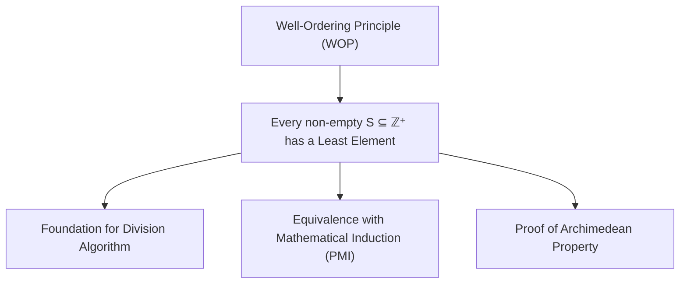

# 02. Mathematical Induction & The Well-Ordering Principle

> [!NOTE]
> **Course Module Reference:** PMT 1022 (Introduction to Number Theory)  
> **Corresponding Lecture Slides:** [02_Lesson_03_Mathematical_Induction.pdf](PMAT/1022/Lecture%20Notes/02_Lesson_03_Mathematical_Induction.pdf), [02_Lesson_04_Well_Ordering_Principle.pdf](PMAT/1022/Lecture%20Notes/02_Lesson_04_Well_Ordering_Principle.pdf)  
> **Prerequisites:** Basic propositional logic and algebra.

---

## 1. The Well-Ordering Principle (WOP - සුසංවිහිත න්‍යාය)

ස්වාභාවික සංඛ්‍යා ($\mathbb{N} = \mathbb{Z}^+$) සතු මූලිකම සහ ප්‍රබලතම ස්වයංසිද්ධිය (Axiom) වන්නේ **සුසංවිහිත න්‍යායයි**.

### 📜 Definition: Least Element (කුඩාම සාමාජිකයා)
> **Definition:** Let $S$ be a non-empty subset of real numbers ($S \subseteq \mathbb{R}$). An element $m \in S$ is called the **least element (or minimum)** of $S$ if:
> $$\mathbf{\forall x \in S, \quad m \le x}$$

*   **උදාහරණ:**
    * $S = \{3, 7, 12, 19\} \implies$ Least element = $3$.
    * $S = \{x \in \mathbb{R} \mid x > 2\} = (2, \infty) \implies$ මෙහි කුඩාම සාමාජිකයෙක් **නැත** ($2 \notin S$).
    * $\mathbb{Z}^+ = \{1, 2, 3, \dots\} \implies$ Least element = $1$.
    * $\mathbb{Z} = \{\dots, -2, -1, 0, 1, 2, \dots\} \implies$ Least element එකක් **නැත** (පහළට සීමා වී නැත).

---

### 📜 Statement of the Well-Ordering Principle (WOP)
> **The Well-Ordering Axiom:** Every non-empty subset of positive integers has a least element.
> $$\mathbf{\forall S \subseteq \mathbb{Z}^+, \quad S \neq \emptyset \implies \exists m \in S \text{ such that } \forall x \in S, m \le x}$$

---

## 2. Principle of Mathematical Induction (PMI - ගණිත අභ්‍යුහන මූලධර්මය)

ස්වාභාවික සංඛ්‍යා $\mathbb{N}$ සඳහා වන ඕනෑම ප්‍රකාශයක් $P(n)$ සාධනය කිරීමට ප්‍රධාන ක්‍රම 2ක් පවතී:

### 1️⃣ Weak Induction (සාමාන්‍ය ගණිත අභ්‍යුහනය)
*   **Step 1 (Base Step):** $n = 1$ (හෝ ආරම්භක අගය $n_0$) සඳහා $P(1)$ සත්‍ය බව පෙන්වන්න.
*   **Step 2 (Inductive Hypothesis):** කිසියම් $k \ge 1$ සඳහා $P(k)$ සත්‍ය යැයි උපකල්පනය කරන්න.
*   **Step 3 (Inductive Step):** එම උපකල්පනය ඇසුරෙන් $P(k+1)$ සත්‍ය බව සාධනය කරන්න.
*   **Step 4 (Conclusion):** ගණිත අභ්‍යුහන මූලධර්මයට අනුව සියලු $n \in \mathbb{N}$ සඳහා $P(n)$ සත්‍ය වේ.

### 2️⃣ Strong Induction (ප්‍රබල ගණිත අභ්‍යුහනය)
*   **Base Step:** $P(1), P(2), \dots, P(b)$ ආරම්භක අවස්ථා සත්‍ය බව පෙන්වන්න.
*   **Inductive Hypothesis:** $1 \le i \le k$ වන **සියලුම** $i$ සඳහා $P(i)$ සත්‍ය යැයි උපකල්පනය කරන්න.
*   **Inductive Step:** මෙම සියලු පෙර ප්‍රතිඵල භාවිතයෙන් $P(k+1)$ සත්‍ය බව සාධනය කරන්න.

---

## 3. The Archimedean Property of $\mathbb{R}$ (ආකිමිඩීස් ගුණාංගය)

> **Theorem (Archimedean Property):** If $x, y \in \mathbb{R}$ with $x > 0$, then there exists a positive integer $n \in \mathbb{Z}^+$ such that:
> $$\mathbf{nx > y}$$

### ✍️ Rigorous Proof using WOP (Contradiction):
1. Assume to the contrary that no such integer $n$ exists.
2. That is, for all $n \in \mathbb{Z}^+$, $nx \le y$.
3. Define the set:
   $$S = \{y - nx \mid n \in \mathbb{Z}^+\}$$
4. By our assumption, $y - nx \ge 0$ for all $n \in \mathbb{Z}^+$, so $S$ is a non-empty subset of non-negative real numbers.
5. By the Well-Ordering Principle, $S$ must contain a least element, say $y - mx$ for some $m \in \mathbb{Z}^+$.
6. Since $m+1 \in \mathbb{Z}^+$, the element $y - (m+1)x \in S$.
7. Now observe:
   $$y - (m+1)x = (y - mx) - x < y - mx \quad (\text{since } x > 0)$$
8. This means $y - (m+1)x$ is strictly smaller than the least element $y - mx$, which is a direct **contradiction**!
9. Therefore, our assumption is false, which proves $\exists n \in \mathbb{Z}^+$ such that $nx > y$. $\blacksquare$

---

## 4. Equivalence of WOP and Induction (WOP සහ PMI තුල්‍යතාව)

> **Theorem:** The Well-Ordering Principle (WOP) is logically equivalent to the Principle of Mathematical Induction (PMI).

### ✍️ Proof that WOP $\implies$ PMI:
1. Let $P(n)$ be a statement concerning $n \in \mathbb{Z}^+$ such that:
   * (i) $P(1)$ is True.
   * (ii) $P(k) \implies P(k+1)$ for all $k \ge 1$.
2. To show that $P(n)$ is true for all $n \in \mathbb{Z}^+$, assume to the contrary that $P(n)$ is **False** for some integers.
3. Define the set of all counterexamples:
   $$S = \{n \in \mathbb{Z}^+ \mid P(n) \text{ is False}\}$$
4. By our contrary assumption, $S \neq \emptyset$.
5. Since $S$ is a non-empty subset of $\mathbb{Z}^+$, by the **Well-Ordering Principle**, $S$ has a least element, say $m \in S$.
6. Since $P(1)$ is True (from (i)), $1 \notin S$. Thus $m > 1$, which means $m - 1 \ge 1$.
7. Since $m$ is the *least* element of $S$ and $m - 1 < m$, it follows that $m - 1 \notin S$.
8. Therefore, $P(m - 1)$ is **True**.
9. But by condition (ii), since $P(m - 1)$ is True, it must follow that $P((m - 1) + 1) = P(m)$ is **True**.
10. This contradicts $m \in S$ (that $P(m)$ is False).
11. Hence $S = \emptyset$, which proves $P(n)$ is True for all $n \in \mathbb{Z}^+$. $\blacksquare$

---

## ✍️ Step-by-Step Worked Exam Problems

### 📌 Problem 1: Divisibility Proof via Induction
**Question:** Prove by mathematical induction that for all $n \in \mathbb{N}$, **$8 \mid (3^{2n} - 1)$**.

**Rigorous Proof:**
*   **Step 1: Base Step ($n = 1$)**
    For $n = 1$: $3^{2(1)} - 1 = 3^2 - 1 = 9 - 1 = 8$.
    Since $8 = 8(1)$, $8 \mid 8$ is **True**.
*   **Step 2: Inductive Hypothesis**
    Assume the statement is true for some $k \ge 1$:
    $$8 \mid (3^{2k} - 1) \implies \exists m \in \mathbb{Z} \text{ such that } 3^{2k} - 1 = 8m \implies 3^{2k} = 8m + 1$$
*   **Step 3: Inductive Step (Prove for $n = k + 1$)**
    Consider the expression for $n = k + 1$:
    $$\begin{aligned}
    3^{2(k+1)} - 1 &= 3^{2k+2} - 1 \\
    &= 3^{2k} \cdot 3^2 - 1 \\
    &= 9 \cdot 3^{2k} - 1
    \end{aligned}$$
    Substitute the inductive hypothesis $3^{2k} = 8m + 1$:
    $$\begin{aligned}
    3^{2(k+1)} - 1 &= 9(8m + 1) - 1 \\
    &= 72m + 9 - 1 \\
    &= 72m + 8 \\
    &= 8(9m + 1)
    \end{aligned}$$
    Since $m \in \mathbb{Z}$, $q = (9m + 1) \in \mathbb{Z}$. Thus $8 \mid (3^{2(k+1)} - 1)$.
*   **Step 4: Conclusion**
    By the Principle of Mathematical Induction, $8 \mid (3^{2n} - 1)$ for all $n \in \mathbb{N}$. $\blacksquare$

---

### 📌 Problem 2: Inequality Proof via Induction
**Question:** Prove that for all integers $n \ge 5$, **$2^n > n^2$**.

**Rigorous Proof:**
*   **Step 1: Base Step ($n = 5$)**
    * $\text{LHS} = 2^5 = 32$
    * $\text{RHS} = 5^2 = 25$
    Since $32 > 25$, $P(5)$ is **True**.
*   **Step 2: Inductive Hypothesis**
    Assume $2^k > k^2$ for some integer $k \ge 5$.
*   **Step 3: Inductive Step (Prove $2^{k+1} > (k+1)^2$)**
    $$\text{LHS} = 2^{k+1} = 2 \cdot 2^k > 2k^2 = k^2 + k^2$$
    We need to show $k^2 + k^2 > (k+1)^2 = k^2 + 2k + 1 \iff k^2 > 2k + 1$.
    For $k \ge 5$:
    $$k^2 = k \cdot k \ge 5k = 2k + 3k > 2k + 1 \quad (\text{since } 3k > 1)$$
    Therefore:
    $$2^{k+1} > k^2 + k^2 > k^2 + 2k + 1 = (k+1)^2$$
    This proves $P(k+1)$ is **True**.
*   **Step 4: Conclusion**
    By Mathematical Induction, $2^n > n^2$ for all $n \ge 5$. $\blacksquare$

### 📌 Problem 3: Existence of Least Elements in Subsets (Lesson 04 Activity 1 & 2)
**Question:** Determine whether a least element exists for each of the following sets. Justify your answers:
> (i) $S_1 = \{x \in \mathbb{N} \mid x^2 - 10x + 21 \le 0\}$  
> (ii) $S_2 = \{x \in \mathbb{R} \mid x = 2^n, n \in \mathbb{Z}\}$  
> (iii) $S_3 = \{a + b - c, b + c - a, c + a - b\}$ where $a, b, c$ are side lengths of a triangle.

**Solutions:**
*   **(i) For $S_1$:**
    Solve the inequality: $x^2 - 10x + 21 \le 0 \iff (x - 3)(x - 7) \le 0 \iff 3 \le x \le 7$.
    Since $x \in \mathbb{N}$, $S_1 = \{3, 4, 5, 6, 7\}$.
    Since $S_1$ is a non-empty subset of $\mathbb{N}$, by WOP it has a least element: **$\min(S_1) = 3$**.
*   **(ii) For $S_2$:**
    $S_2 = \{\dots, \frac{1}{8}, \frac{1}{4}, \frac{1}{2}, 1, 2, 4, 8, \dots\}$.
    As $n \to -\infty$, $2^n \to 0$, but $0 \notin S_2$. For any element $2^k \in S_2$, there exists $2^{k-1} \in S_2$ with $2^{k-1} < 2^k$.
    Therefore, $S_2$ has **NO least element**.
*   **(iii) For $S_3$:**
    By the Triangle Inequality, the sum of any two sides is strictly greater than the third side: $a + b > c \implies a + b - c > 0$.
    Thus all three elements in $S_3$ are strictly positive real numbers.
    Since $S_3$ is a finite non-empty set of 3 real numbers, it **always contains a least element**: **$\min(S_3) = \min(a+b-c, b+c-a, c+a-b)$**. $\blacksquare$

---

### 📌 Problem 4: Telescoping Fraction Summation Induction (Lesson 03)
**Theorem:** Prove by mathematical induction that for all $n \in \mathbb{N}$:
$$\sum_{i=1}^n \frac{1}{i(i+1)} = \frac{n}{n+1}$$

**Rigorous Proof:**
*   **Base Step ($n = 1$):**
    $\text{LHS} = \frac{1}{1(2)} = \frac{1}{2}$. $\text{RHS} = \frac{1}{1+1} = \frac{1}{2}$. (True)
*   **Inductive Hypothesis:** Assume $\sum_{i=1}^k \frac{1}{i(i+1)} = \frac{k}{k+1}$ for some $k \ge 1$.
*   **Inductive Step ($n = k + 1$):**
    $$\begin{aligned}
    \sum_{i=1}^{k+1} \frac{1}{i(i+1)} &= \sum_{i=1}^k \frac{1}{i(i+1)} + \frac{1}{(k+1)(k+2)} \\
    &= \frac{k}{k+1} + \frac{1}{(k+1)(k+2)} \\
    &= \frac{k(k+2) + 1}{(k+1)(k+2)} = \frac{k^2 + 2k + 1}{(k+1)(k+2)} = \frac{(k+1)^2}{(k+1)(k+2)} = \mathbf{\frac{k+1}{k+2}}
    \end{aligned}$$
*   **Conclusion:** By PMI, the identity holds for all $n \in \mathbb{N}$. $\blacksquare$

## ⚠️ Exam Traps & Common Pitfalls

> [!CAUTION]
> **1. Well-Ordering Principle එක $\mathbb{R}$ හෝ $\mathbb{Z}$ සඳහා යෙදීම:**
> WOP වලංගු වන්නේ **ධන නිඛිල ($\mathbb{Z}^+$)** හෝ බින්දුවෙන් පහළට සීමා වූ නිඛිල කුලක සඳහා පමණි. 
> * $\mathbb{Z}$ සඳහා Least element එකක් නැත (මන්ද $\dots, -100, -101, \dots$ ලෙස සෘණ අන්තයට යයි).
> * $\mathbb{R}^+$ සඳහා Least element එකක් නැත (උදා: $(0, 1)$ හි කුඩාම අගයක් නැත, 0 අයත් නොවේ).
> 
> **2. Base Step එක අතහැර දැමීම:**
> Base step එක පරීක්ෂා නොකර Inductive step එක පමණක් කිරීමෙන් වැරදි ප්‍රකාශන පවා "ඔප්පු" කළ හැකි වේ. සෑම විටම $n=1$ (හෝ අදාළ $n_0$) නිවැරදිව පරීක්ෂා කරන්න.
