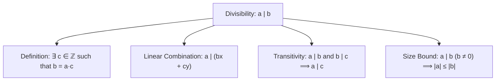

# 03. Divisibility Theory & Elementary Properties

> [!NOTE]
> **Course Module Reference:** PMT 1022 (Introduction to Number Theory)  
> **Corresponding Lecture Slides:** [03_Lesson_05_Divisibility_Theory_and_Properties.pdf](../03_Lesson_05_Divisibility_Theory_and_Properties.pdf)  
> **Prerequisites:** [01. Foundations & Number Systems](01_Foundations_Real_Numbers_and_Base_Representations.md)

---

## 1. The Divisibility Relation (භාජ්‍යතා සම්බන්ධතාවය)

සංඛ්‍යා න්‍යායේ කේන්ද්‍රීයම සංකල්පය වන්නේ නිඛිල එකිනෙක බෙදීමේ ගුණාංගයි.

### 📜 Formal Definition of Divisibility
> **Definition:** Let $a, b \in \mathbb{Z}$ with $a \neq 0$. We say that **$a$ divides $b$** (or **$b$ is divisible by $a$**, or **$a$ is a factor/divisor of $b$**, or **$b$ is a multiple of $a$**), denoted by:
> $$\mathbf{a \mid b}$$
> if there exists an integer $c \in \mathbb{Z}$ such that:
> $$\mathbf{b = a \cdot c}$$
> If no such integer $c$ exists, we write **$a \nmid b$** ($a$ does not divide $b$).

*   **උදාහරණ:**
    * $4 \mid 12$ මන්ද $12 = 4 \cdot 3$ ($3 \in \mathbb{Z}$).
    * $-5 \mid 30$ මන්ද $30 = (-5) \cdot (-6)$ ($-6 \in \mathbb{Z}$).
    * $7 \mid 0$ මන්ද $0 = 7 \cdot 0$ ($0 \in \mathbb{Z}$).
    * $0 \mid 5$ යන්න **අර්ථ නොදක්වයි** (0 න් බෙදීම කළ නොහැක).
    * $4 \nmid 10$ මන්ද $10 = 4 \cdot c$ වන පරිදි කිසිදු නිඛිලයක් $c \in \mathbb{Z}$ නොපවතින බැවිනි ($c = 2.5 \notin \mathbb{Z}$).

---

## 2. The 10 Master Theorems of Divisibility (මූලික භාජ්‍යතා ප්‍රමේයයන්)

පහත දැක්වෙන්නේ විභාගයේදී කෙලින්ම සාධනය කිරීමට අසන ප්‍රධාන ප්‍රමේයයන් 10යි:

### 📜 Theorem 1: Division of Zero
> **Statement:** For any non-zero integer $a \in \mathbb{Z} \setminus \{0\}$, **$a \mid 0$**.  
> **Proof:** Since $0 = a \cdot 0$ and $0 \in \mathbb{Z}$, by definition $a \mid 0$. $\blacksquare$

### 📜 Theorem 2: Divisors of Unity
> **Statement:** For any integer $a \in \mathbb{Z}$, **$1 \mid a$** and **$-1 \mid a$**.  
> **Proof:** $a = 1 \cdot a$ and $a = (-1) \cdot (-a)$. Since $a, -a \in \mathbb{Z}$, both hold. $\blacksquare$

### 📜 Theorem 3: Reflexivity
> **Statement:** For any $a \neq 0$, **$a \mid a$** and **$a \mid -a$**.  
> **Proof:** $a = a \cdot 1$ and $-a = a \cdot (-1)$. $\blacksquare$

### 📜 Theorem 4: Multiple Factor Property
> **Statement:** If $a \mid b$, then for any integer $c \in \mathbb{Z}$, **$a \mid bc$**.  
> **Proof:** Since $a \mid b$, $\exists k \in \mathbb{Z}$ such that $b = ak$. Multiplying by $c$ gives $bc = (ak)c = a(kc)$. Since $kc \in \mathbb{Z}$, $a \mid bc$. $\blacksquare$

### 📜 Theorem 5: Transitivity (සංක්‍රාන්තිකතාව)
> **Statement:** If $a \mid b$ and $b \mid c$, then **$a \mid c$**.  
> **Proof:**  
> 1. $a \mid b \implies \exists k_1 \in \mathbb{Z}$ such that $b = a k_1$.  
> 2. $b \mid c \implies \exists k_2 \in \mathbb{Z}$ such that $c = b k_2$.  
> 3. Substitute $b$: $c = (a k_1) k_2 = a (k_1 k_2)$.  
> 4. Since $k_1, k_2 \in \mathbb{Z}$, $k_3 = (k_1 k_2) \in \mathbb{Z}$. Thus $a \mid c$. $\blacksquare$

### 📜 Theorem 6: Mutual Divisibility (Antisymmetry up to Sign)
> **Statement:** If $a \mid b$ and $b \mid a$, then **$a = \pm b$** (i.e. $|a| = |b|$).  
> **Proof:**  
> 1. $a \mid b \implies b = a k_1$ and $b \mid a \implies a = b k_2$ for some $k_1, k_2 \in \mathbb{Z}$.  
> 2. Then $a = (a k_1) k_2 = a (k_1 k_2) \implies a (1 - k_1 k_2) = 0$.  
> 3. Since $a \neq 0$, $k_1 k_2 = 1$.  
> 4. In integers $\mathbb{Z}$, $k_1 k_2 = 1 \implies k_1 = k_2 = 1$ or $k_1 = k_2 = -1$.  
> 5. Therefore, $b = \pm a \iff a = \pm b$. $\blacksquare$

### 📜 Theorem 7: The Linear Combination Theorem (රේඛීය සංයෝජන ප්‍රමේයය)
> **Statement:** If $a \mid b$ and $a \mid c$, then for **any** integers $x, y \in \mathbb{Z}$:
> $$\mathbf{a \mid (bx + cy)}$$
> **Proof:**  
> 1. $a \mid b \implies b = a k_1$ and $a \mid c \implies c = a k_2$ ($k_1, k_2 \in \mathbb{Z}$).  
> 2. For any $x, y \in \mathbb{Z}$:
>    $$bx + cy = (a k_1)x + (a k_2)y = a(k_1 x + k_2 y)$$
> 3. Since $k_1, k_2, x, y \in \mathbb{Z}$, $k_3 = (k_1 x + k_2 y) \in \mathbb{Z}$.  
> 4. Therefore, by definition, $a \mid (bx + cy)$. $\blacksquare$
> 
> *   *Special Cases:*
>     * $x=1, y=1 \implies a \mid (b + c)$
>     * $x=1, y=-1 \implies a \mid (b - c)$

### 📜 Theorem 8: Product of Divisibilities
> **Statement:** If $a \mid b$ and $c \mid d$, then **$ac \mid bd$**.  
> **Proof:** $b = a k_1$ and $d = c k_2 \implies bd = (a k_1)(c k_2) = (ac)(k_1 k_2)$. Since $k_1 k_2 \in \mathbb{Z}$, $ac \mid bd$. $\blacksquare$

### 📜 Theorem 9: Size Comparison / Boundedness
> **Statement:** If $a \mid b$ and $b \neq 0$, then **$|a| \le |b|$**.  
> **Proof:**  
> 1. $a \mid b \implies b = ak$ for some $k \in \mathbb{Z}$.  
> 2. Since $b \neq 0$, $k \neq 0$, which means $|k| \ge 1$.  
> 3. Taking absolute values: $|b| = |ak| = |a| \cdot |k| \ge |a| \cdot 1 = |a|$.  
> 4. Thus $|a| \le |b|$. $\blacksquare$

### 📜 Theorem 10: Cancellation Property
> **Statement:** For $c \neq 0$, **$a \mid b \iff ac \mid bc$**.  
> **Proof:** $b = ak \iff bc = (ac)k$ for the exact same integer $k \in \mathbb{Z}$. $\blacksquare$

---

## ✍️ Step-by-Step Worked Exam Problems

### 📌 Problem 1: Sum and Divisibility Contradiction
**Theorem:** For all integers $a, b, c \in \mathbb{Z}$, if $a \mid b$ and $a \nmid c$, prove that **$a \nmid (b + c)$**.

**Rigorous Proof (Contradiction):**
1. Assume to the contrary that $a \mid (b + c)$.
2. We are given that $a \mid b$. By Theorem 7 (Linear combination with $x = 1, y = -1$):
   $$a \mid ((b + c) - b) \implies a \mid c$$
3. This directly **contradicts** the given hypothesis that $a \nmid c$.
4. Therefore, our assumption must be false, which proves $a \nmid (b + c)$. $\blacksquare$

---

### 📌 Problem 2: Divisibility of Quadratic Forms
**Question:** Prove that if $a \mid (2x + 3y)$ and $a \mid (3x + 5y)$, then **$a \mid x$** and **$a \mid y$**.

**Rigorous Proof:**
1. Let $E_1 = 2x + 3y$ and $E_2 = 3x + 5y$. We are given $a \mid E_1$ and $a \mid E_2$.
2. To isolate $x$, eliminate $y$:
   $$5 E_1 - 3 E_2 = 5(2x + 3y) - 3(3x + 5y) = 10x + 15y - 9x - 15y = x$$
   By the Linear Combination Theorem ($x_1 = 5, y_1 = -3$), since $a \mid E_1$ and $a \mid E_2$, it follows that:
   $$a \mid (5E_1 - 3E_2) \implies \mathbf{a \mid x}$$
3. To isolate $y$, eliminate $x$:
   $$3 E_1 - 2 E_2 = 3(2x + 3y) - 2(3x + 5y) = 6x + 9y - 6x - 10y = -y$$
   By the Linear Combination Theorem ($x_2 = 3, y_2 = -2$):
   $$a \mid (3E_1 - 2E_2) \implies a \mid (-y) \implies \mathbf{a \mid y}$$
4. Hence, $a \mid x$ and $a \mid y$. $\blacksquare$

---

### 📌 Problem 3: Consecutive Integers Product
**Question:** Prove that the product of any three consecutive integers is divisible by $6$.

**Rigorous Proof:**
1. Let the three consecutive integers be $n, n+1, n+2$ for $n \in \mathbb{Z}$.
2. Their product is $P = n(n+1)(n+2)$.
3. **Divisibility by 2:** Among any two consecutive integers, at least one is even. Thus $2 \mid n(n+1) \implies 2 \mid P$.
4. **Divisibility by 3:** Among any three consecutive integers, exactly one is a multiple of 3. Thus $3 \mid P$.
5. Since $\gcd(2, 3) = 1$, $2 \mid P$ and $3 \mid P \implies 2 \cdot 3 \mid P \implies \mathbf{6 \mid n(n+1)(n+2)}$. $\blacksquare$

### 📌 Problem 4: Factor Bound Theorem (Lesson 05 Section 5.3.2)
**Theorem:** Let $n$ be a composite positive integer. Show that if $n = kl$ with $1 \le k \le l < n$, then **$k \le \sqrt{n}$**.

**Rigorous Proof (by Contradiction):**
1. We are given $n = kl$ with $1 \le k \le l < n$.
2. Assume to the contrary that $k > \sqrt{n}$.
3. Since $l \ge k$, it follows that $l \ge k > \sqrt{n}$, so $l > \sqrt{n}$.
4. Multiplying these two strictly positive inequalities:
   $$n = k \cdot l > \sqrt{n} \cdot \sqrt{n} = n \implies \mathbf{n > n}$$
5. This is an obvious logical contradiction ($\mathbf{F}$).
6. Therefore, our assumption $k > \sqrt{n}$ must be false, which proves **$k \le \sqrt{n}$**. $\blacksquare$

---

### 📌 Problem 5: Advanced Divisibility via Induction (Lesson 05 Section 5.2.6)
**Theorem:** Prove that for all $n \in \mathbb{N}$, **$64 \mid (3^{2n+2} - 8n - 9)$**.

**Rigorous Proof:**
*   **Base Step ($n = 1$):**
    For $n = 1$: $3^{2(1)+2} - 8(1) - 9 = 3^4 - 8 - 9 = 81 - 17 = 64 = 64(1)$. (True)
*   **Inductive Hypothesis:**
    Assume $64 \mid (3^{2k+2} - 8k - 9)$ for some $k \ge 1$, so $3^{2k+2} - 8k - 9 = 64m \implies 3^{2k+2} = 64m + 8k + 9$.
*   **Inductive Step ($n = k + 1$):**
    $$\begin{aligned}
    3^{2(k+1)+2} - 8(k+1) - 9 &= 3^{2k+4} - 8k - 8 - 9 \\
    &= 3^2 \cdot 3^{2k+2} - 8k - 17 \\
    &= 9(64m + 8k + 9) - 8k - 17 \\
    &= 9(64m) + 72k + 81 - 8k - 17 \\
    &= 64(9m) + 64k + 64 \\
    &= \mathbf{64(9m + k + 1)}
    \end{aligned}$$
    Since $m, k \in \mathbb{Z}$, $q = 9m + k + 1 \in \mathbb{Z}$. Thus $64 \mid (3^{2(k+1)+2} - 8(k+1) - 9)$.
*   **Conclusion:** By PMI, $64 \mid (3^{2n+2} - 8n - 9)$ for all $n \in \mathbb{N}$. $\blacksquare$

## ⚠️ Exam Traps & Common Pitfalls

> [!CAUTION]
> **1. $a \mid b$ සහ $a / b$ පටලවා ගැනීම:**
> * $a \mid b$ යනු **සම්බන්ධතාවයකි (Statement / Proposition)** - එය සත්‍ය හෝ අසත්‍ය වේ ("$a$ මගින් $b$ බෙදේ").
> * $a / b$ හෝ $\frac{a}{b}$ යනු **සංඛ්‍යාවකි (Number / Operation)**. විභාගයේදී $a \mid b$ වෙනුවට $\frac{a}{b}$ ලියන්න එපා!
> 
> **2. $b > 0$ බව තහවුරු නොකර $a \le b$ යැයි ලිවීම:**
> $a \mid b$ වූ පමණින් $a \le b$ නොවේ! උදාහරණයක් ලෙස $5 \mid -10$ සත්‍ය නමුත් $5 \not\le -10$. නිවැරදි ප්‍රමේයය වන්නේ **$|a| \le |b|$ (for $b \neq 0$)** යන්නයි.
> 
> **3. $a \mid bc \implies a \mid b \lor a \mid c$ යැයි අනුමාන කිරීම:**
> මෙය සත්‍ය වන්නේ **$a$ ප්‍රථමක සංඛ්‍යාවක් (Prime)** නම් පමණි (Euclid's Lemma). සංයුක්ත සංඛ්‍යා සඳහා මෙය අසත්‍ය වේ (උදා: $6 \mid (2 \times 3)$, නමුත් $6 \nmid 2$ සහ $6 \nmid 3$).
