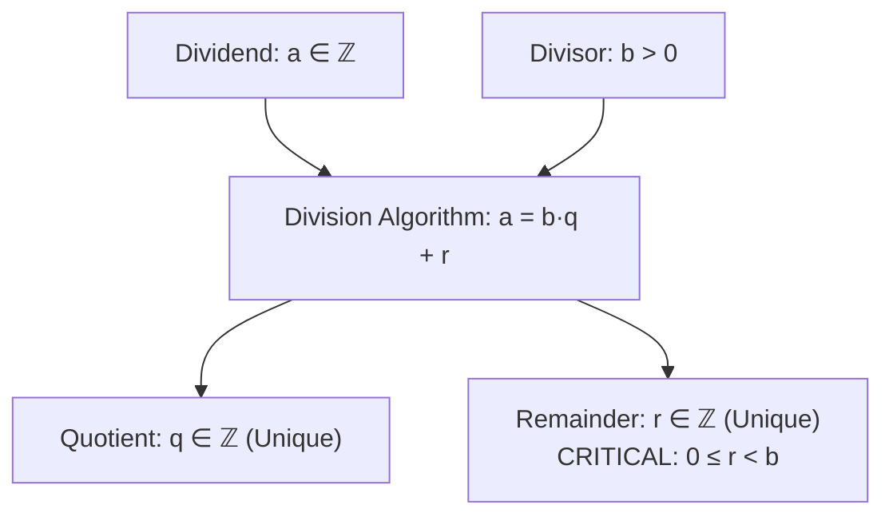

# 04. The Division Algorithm & Forms of Integers

> [!NOTE]
> **Course Module Reference:** PMT 1022 (Introduction to Number Theory)  
> **Corresponding Lecture Slides:** [04_Lesson_06_The_Division_Algorithm_Part_1.pdf](PMAT/1022/Lecture%20Notes/04_Lesson_06_The_Division_Algorithm_Part_1.pdf), [04_Lesson_07_Division_Algorithm_Applications_and_Parity.pdf](PMAT/1022/Lecture%20Notes/04_Lesson_07_Division_Algorithm_Applications_and_Parity.pdf)  
> **Prerequisites:** [02. Mathematical Induction & Well-Ordering Principle](PMAT/1022/Short%20Notes/02_Mathematical_Induction_and_Well_Ordering_Principle.md), [03. Divisibility Theory](PMAT/1022/Short%20Notes/03_Divisibility_Theory_and_Elementary_Properties.md)

---

## 1. The Division Algorithm (බෙදීමේ ඇල්ගොරිතමය)

නම "ඇල්ගොරිතමය" වුවද, මෙය සංඛ්‍යා න්‍යායේ මූලිකම **ප්‍රමේයයකි (Theorem)**.

### 📜 Statement of the Division Algorithm
> **Theorem:** Given any integers $a$ and $b$ with $b > 0$, there exist **unique** integers $q$ (called the **quotient**) and $r$ (called the **remainder**) such that:
> $$\mathbf{a = b \cdot q + r \quad \text{where} \quad 0 \le r < b}$$

*   **වඩාත් සාමාන්‍ය ආකාරය ($b \neq 0$ වන ඕනෑම නිඛිලයක් සඳහා):**
    $$a = b \cdot q + r \quad \text{where} \quad \mathbf{0 \le r < |b|}$$

*   **උදාහරණ:**
    * $a = 17, b = 5 \implies 17 = 5(3) + 2 \quad (q = 3, r = 2, \text{ since } 0 \le 2 < 5)$.
    * $a = -17, b = 5 \implies -17 = 5(-4) + 3 \quad (q = -4, r = 3, \text{ since } 0 \le 3 < 5)$.  
      *(⚠️ $-17 = 5(-3) - 2$ ලෙස ලිවීම වැරදිය! මන්ද $r \ge 0$ විය යුතුය).*

---

## 2. Complete Rigorous Proof of the Division Algorithm (විභාග සාධනය)

මෙම සාධනය ප්‍රධාන කොටස් 2කින් සමන්විත වේ: **(1) Existence (පැවැත්ම)** සහ **(2) Uniqueness (අනන්‍යතාවය)**.

### ✍️ Part 1: Existence of $q$ and $r$ (Using Well-Ordering Principle)
1. Consider the set of all non-negative numbers formed by subtracting multiples of $b$ from $a$:
   $$S = \{a - bk \mid k \in \mathbb{Z} \text{ and } a - bk \ge 0\}$$
2. **Show that $S$ is non-empty ($S \neq \emptyset$):**
   * If $a \ge 0$, choosing $k = 0$ gives $a - b(0) = a \ge 0$, so $a \in S$.
   * If $a < 0$, since $b \ge 1$, we have $1 - b \le 0$. Choosing $k = a$ gives:
     $$a - ba = a(1 - b) \ge 0 \quad (\text{negative} \times \text{non-positive} = \text{non-negative})$$
     Thus $a - ba \in S$.
   * In both cases, $S$ contains at least one non-negative integer. Hence $S \neq \emptyset$.
3. **Apply the Well-Ordering Principle:**
   Since $S$ is a non-empty subset of non-negative integers ($\mathbb{Z}^+ \cup \{0\}$), by WOP, $S$ has a **least element**, say $r$.
4. Since $r \in S$, there exists some integer $q \in \mathbb{Z}$ such that:
   $$r = a - bq \ge 0 \implies \mathbf{a = bq + r} \quad (\text{with } r \ge 0)$$
5. **Show that $r < b$ (by Contradiction):**
   * Assume to the contrary that $r \ge b$.
   * Then $r - b \ge 0$.
   * Observe that:
     $$r - b = (a - bq) - b = a - b(q + 1) \ge 0$$
   * Since $r - b$ is of the form $a - bk$ and $\ge 0$, it follows that $(r - b) \in S$.
   * But since $b > 0$, we have $r - b < r$.
   * This means $r - b \in S$ is strictly smaller than the least element $r$, which is a **contradiction**!
   * Therefore, our assumption $r \ge b$ is false, which proves **$r < b$**.
6. Hence, there exist integers $q, r$ such that $a = bq + r$ with **$0 \le r < b$**. $\blacksquare$

---

### ✍️ Part 2: Uniqueness of $q$ and $r$
1. Suppose there are two pairs of integers $(q_1, r_1)$ and $(q_2, r_2)$ satisfying:
   $$a = b q_1 + r_1 \quad (0 \le r_1 < b) \quad \text{සහ} \quad a = b q_2 + r_2 \quad (0 \le r_2 < b)$$
2. Equating the two expressions:
   $$b q_1 + r_1 = b q_2 + r_2 \implies b(q_1 - q_2) = r_2 - r_1$$
3. Taking absolute values:
   $$b |q_1 - q_2| = |r_2 - r_1|$$
4. Since $0 \le r_1 < b$ and $0 \le r_2 < b$, the difference must satisfy:
   $$-b < r_2 - r_1 < b \implies |r_2 - r_1| < b$$
5. Substituting this into (3) gives:
   $$b |q_1 - q_2| < b$$
6. Since $b > 0$, dividing by $b$ yields:
   $$|q_1 - q_2| < 1$$
7. Since $q_1, q_2$ are integers, $|q_1 - q_2|$ is a non-negative integer. The only integer strictly less than 1 is **0**:
   $$|q_1 - q_2| = 0 \implies \mathbf{q_1 = q_2}$$
8. Substituting $q_1 = q_2$ back into $b(q_1 - q_2) = r_2 - r_1$ gives:
   $$r_2 - r_1 = 0 \implies \mathbf{r_1 = r_2}$$
9. Therefore, the quotient $q$ and remainder $r$ are **strictly unique**. $\blacksquare$

---

## 3. Forms of Integers (නිඛිල වල ආකාර)

Division Algorithm මගින් ඕනෑම නිඛිලයක් කිසියම් $b$ භාජකයකින් බෙදූ විට ලැබෙන ශේෂයන් අනුව කාණ්ඩ වලට බෙදිය හැක:

| Divisor $b$ | Possible Remainders $r$ | Standard Forms of any Integer $n \in \mathbb{Z}$ |
| :---: | :---: | :--- |
| **2** | $0, 1$ | $2k$ (Even), $2k + 1$ (Odd) |
| **3** | $0, 1, 2$ | $3k, 3k + 1, 3k + 2$ |
| **4** | $0, 1, 2, 3$ | $4k, 4k + 1, 4k + 2, 4k + 3$ |
| **6** | $0, 1, 2, 3, 4, 5$ | $6k, 6k + 1, 6k + 2, 6k + 3, 6k + 4, 6k + 5$ |

---

## ✍️ Step-by-Step Worked Exam Problems

### 📌 Problem 1: Square of an Integer (පූර්ණ වර්ගයක ආකාරය)
**Theorem:** Prove that the square of any integer is either of the form **$4k$** or **$4k + 1$** for some integer $k$.

**Rigorous Proof:**
1. Let $n$ be any integer. By the Division Algorithm with divisor $b = 2$, $n$ is either even or odd:
   $$n = 2m \quad \text{හෝ} \quad n = 2m + 1 \quad (m \in \mathbb{Z})$$
2. **Case 1 ($n$ is Even, $n = 2m$):**
   $$n^2 = (2m)^2 = 4m^2 = 4k \quad (\text{where } k = m^2 \in \mathbb{Z})$$
3. **Case 2 ($n$ is Odd, $n = 2m + 1$):**
   $$n^2 = (2m + 1)^2 = 4m^2 + 4m + 1 = 4(m^2 + m) + 1 = 4k + 1 \quad (\text{where } k = m^2 + m \in \mathbb{Z})$$
4. Hence, the square of any integer is of the form $4k$ or $4k + 1$. $\blacksquare$

*   *Corollary (Exam Trap):* කිසිදු පූර්ණ වර්ග සංඛ්‍යාවක් $4k + 2$ හෝ $4k + 3$ ආකාරයෙන් පැවතිය නොහැක! (උදා: $n^2 = 1234567$ විය නොහැක මන්ද $1234567 = 4(308641) + 3$).

---

### 📌 Problem 2: Square of an Odd Integer
**Theorem:** Prove that the square of any odd integer is of the form **$8k + 1$**.

**Rigorous Proof:**
1. Let $n$ be an odd integer. By Division Algorithm with $b = 4$, every odd integer is of the form:
   $$n = 4m + 1 \quad \text{හෝ} \quad n = 4m + 3 \quad (m \in \mathbb{Z})$$
2. **Case 1 ($n = 4m + 1$):**
   $$n^2 = (4m + 1)^2 = 16m^2 + 8m + 1 = 8(2m^2 + m) + 1 = 8k + 1 \quad (k = 2m^2 + m \in \mathbb{Z})$$
3. **Case 2 ($n = 4m + 3$):**
   $$n^2 = (4m + 3)^2 = 16m^2 + 24m + 9 = 16m^2 + 24m + 8 + 1 = 8(2m^2 + 3m + 1) + 1 = 8k + 1$$
4. Therefore, in all cases, the square of any odd integer is of the form **$8k + 1$**. $\blacksquare$

---

### 📌 Problem 3: Divisibility by 24
**Question:** Prove that if $n$ is an odd integer, then **$24 \mid (n^3 - n)$** and **$24 \mid (n^2 - 1)(n^2 + 3)$**.

**Rigorous Proof:**
1. For $n^3 - n = n(n^2 - 1) = (n - 1)n(n + 1)$:
   * Since $n$ is odd, both $n - 1$ and $n + 1$ are consecutive even integers.
   * One of them is divisible by 2, and the other is divisible by 4.
   * Thus their product $(n - 1)(n + 1)$ is divisible by $2 \times 4 = 8$.
   * Since $(n - 1), n, (n + 1)$ are three consecutive integers, at least one is divisible by 3.
   * Since $\gcd(8, 3) = 1$, the product is divisible by $8 \times 3 = 24$.
2. Thus $24 \mid (n^3 - n)$. $\blacksquare$

### 📌 Problem 4: Last Digit Periodic Cycles (Lesson 07 Activity 1 & Example 1)
**Question:** Without full expansion, find:
> (i) The set of all possible last digits of $k^2$ for $k \in \mathbb{N}$.  
> (ii) The set of all possible last digits of $k^4$ for $k \in \mathbb{N}$.  
> (iii) All possible remainders when $2019^k$ is divided by 10 for $k \in \mathbb{N}$.

**Solutions:**
*   **(i) Last Digits of $k^2$:**
    Any integer $k \equiv r \pmod{10}$ where $r \in \{0, 1, 2, 3, 4, 5, 6, 7, 8, 9\}$.
    Squaring remainders modulo 10:
    $0^2=0, 1^2=1, 2^2=4, 3^2=9, 4^2\equiv 6, 5^2\equiv 5, 6^2\equiv 6, 7^2\equiv 9, 8^2\equiv 4, 9^2\equiv 1$.
    $$\mathbf{\{\text{Last digit of } k^2 \mid k \in \mathbb{N}\} = \{0, 1, 4, 5, 6, 9\}}$$
    *(Notice: An integer ending in 2, 3, 7, or 8 can **NEVER** be a perfect square!).*
*   **(ii) Last Digits of $k^4$:**
    Squaring the elements of the previous set:
    $0^2=0, 1^2=1, 4^2\equiv 6, 5^2\equiv 5, 6^2\equiv 6, 9^2\equiv 1$.
    $$\mathbf{\{\text{Last digit of } k^4 \mid k \in \mathbb{N}\} = \{0, 1, 5, 6\}}$$
*   **(iii) Remainders of $2019^k \pmod{10}$:**
    Since $2019 \equiv 9 \equiv -1 \pmod{10}$:
    * For odd $k$: $2019^k \equiv (-1)^{\text{odd}} = -1 \equiv \mathbf{9 \pmod{10}}$.
    * For even $k$: $2019^k \equiv (-1)^{\text{even}} = \mathbf{1 \pmod{10}}$.
    $$\mathbf{\text{Possible Remainders} = \{1, 9\}}$$ $\blacksquare$

---

### 📌 Problem 5: Divisibility by 24 for all $n \in \mathbb{Z}$ (Lesson 06 Example 6.3.3)
**Theorem:** Prove that for **every integer $n \in \mathbb{Z}$**, **$24 \mid n(n^2 - 1)(3n + 2)$**.

**Rigorous Proof:**
1. Express $E = n(n^2 - 1)(3n + 2) = (n - 1)n(n + 1)(3n + 2)$.
2. Since $(n - 1), n, (n + 1)$ are three consecutive integers, $3 \mid (n - 1)n(n + 1) \implies \mathbf{3 \mid E}$.
3. By the Division Algorithm with $b = 4$, $n$ is of the form $4k, 4k+1, 4k+2,$ or $4k+3$:
   * **If $n = 4k$:** $4 \mid n$ and $2 \mid (3n + 2) = 2(6k + 1) \implies 4 \times 2 = 8 \mid E$.
   * **If $n = 4k + 1$:** $4 \mid (n - 1) = 4k$ and $2 \mid (n + 1) = 2(2k + 1) \implies 8 \mid E$.
   * **If $n = 4k + 2$:** $2 \mid n = 2(2k + 1)$ and $4 \mid (3n + 2) = 3(4k + 2) + 2 = 12k + 8 = 4(3k + 2) \implies 8 \mid E$.
   * **If $n = 4k + 3$:** $2 \mid (n - 1) = 2(2k + 1)$ and $4 \mid (n + 1) = 4(k + 1) \implies 8 \mid E$.
4. Thus in all cases, **$8 \mid E$**.
5. Since $\gcd(3, 8) = 1$, $3 \mid E$ and $8 \mid E \implies 3 \times 8 = \mathbf{24 \mid E}$. $\blacksquare$

## ⚠️ Exam Traps & Common Pitfalls

> [!CAUTION]
> **1. සෘණ සංඛ්‍යා බෙදීමේදී සෘණ ශේෂයක් ගැනීම:**
> $-29 = 6(-4) - 5$ ලෙස ලිවීම **සම්පූර්ණයෙන්ම වැරදිය**. Division algorithm හි $0 \le r < b$ විය යුතු බැවින් නිවැරදි ආකාරය වන්නේ **$-29 = 6(-5) + 1$** ($q = -5, r = 1$) යන්නයි.
> 
> **2. $n^2 = 4k + 2$ හෝ $4k + 3$ විය හැකි යැයි උපකල්පනය:**
> පූර්ණ වර්ග සංඛ්‍යාවක් 4 න් බෙදූ විට ශේෂය 0 හෝ 1 පමණි. මෙය Contradiction proofs (උදා: $x^2 - 4y = 2$ ට නිඛිල විසඳුම් නැති බව පෙන්වීමට) ඉතා බහුලව භාවිතා වේ.
