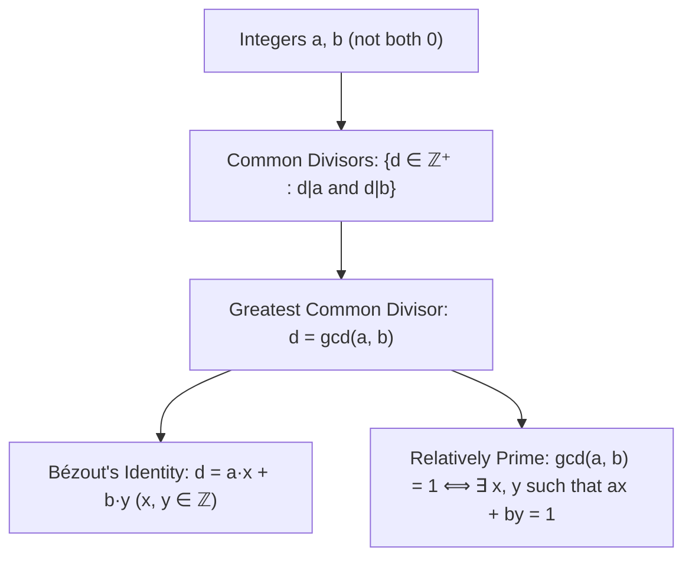

# 05. Greatest Common Divisor & Bézout's Identity

> [!NOTE]
> **Course Module Reference:** PMT 1022 (Introduction to Number Theory)  
> **Corresponding Lecture Slides:** [05_Lesson_08_Greatest_Common_Divisor_and_Properties.pdf](PMAT/1022/Lecture%20Notes/05_Lesson_08_Greatest_Common_Divisor_and_Properties.pdf)  
> **Prerequisites:** [03. Divisibility Theory](PMAT/1022/Short%20Notes/03_Divisibility_Theory_and_Elementary_Properties.md), [04. The Division Algorithm](PMAT/1022/Short%20Notes/04_The_Division_Algorithm_and_Form_of_Integers.md)

---

## 1. Greatest Common Divisor ($\gcd$ / මහා පොදු සාධකය)

සංඛ්‍යා දෙකක් එකවර බෙදිය හැකි විශාලතම ධන නිඛිලය මහා පොදු සාධකය ($\gcd$) වේ.

### 📜 Formal Definition of $\gcd(a, b)$
> **Definition:** Let $a$ and $b$ be integers, not both zero. A positive integer $d \in \mathbb{Z}^+$ is called the **greatest common divisor** of $a$ and $b$, denoted by **$\gcd(a, b)$** or **$(a, b)$**, if:
> 1. **$d \mid a$** and **$d \mid b$** ($d$ is a common divisor).
> 2. If $c \in \mathbb{Z}$ is any common divisor of $a$ and $b$ (i.e. $c \mid a \land c \mid b$), then **$c \le d$** (or equivalently **$c \mid d$**).

*   **උදාහරණ:**
    * $\gcd(12, 18) = 6$
    * $\gcd(-24, 36) = 12$ *(සෑම විටම $\gcd \ge 1$ වේ!)*
    * $\gcd(7, 0) = 7$
    * $\gcd(0, 0)$ අර්ථ **නොදක්වයි**.

---

## 2. Bézout's Identity (බේසෝගේ අනන්‍යතාවය)

සංඛ්‍යා න්‍යායේ ඉතාම වැදගත් ප්‍රමේයයක් වන Bézout's Identity මගින් $\gcd(a, b)$ යන්න $a$ සහ $b$ හි රේඛීය සංයෝජනයක් (Linear Combination) ලෙස ප්‍රකාශ කළ හැකි බව පෙන්වයි.

### 📜 Statement of Bézout's Theorem
> **Theorem (Bézout's Identity):** Let $a$ and $b$ be integers, not both zero. Then there exist integers $x, y \in \mathbb{Z}$ such that:
> $$\mathbf{\gcd(a, b) = a \cdot x + b \cdot y}$$
> Furthermore, $\gcd(a, b)$ is the **smallest positive integer** that can be written in the form $ax + by$:
> $$\mathbf{\gcd(a, b) = \min \{ax + by \mid x, y \in \mathbb{Z} \text{ and } ax + by > 0\}}$$

---

### ✍️ Complete Rigorous Proof of Bézout's Identity
1. Consider the set of all positive linear combinations of $a$ and $b$:
   $$S = \{ax + by \mid x, y \in \mathbb{Z} \text{ and } ax + by > 0\}$$
2. **Show $S \neq \emptyset$:**
   Since not both $a, b$ are zero:
   * If $a \neq 0$, take $x = 1, y = 0 \implies a(1) + b(0) = a$. If $a > 0$, $a \in S$. If $a < 0$, take $x = -1, y = 0 \implies -a > 0 \in S$.
   * Thus $S$ always contains at least one positive integer, so $S \neq \emptyset$.
3. **Apply the Well-Ordering Principle:**
   Since $S$ is a non-empty subset of positive integers ($\mathbb{Z}^+$), by the Well-Ordering Principle, $S$ has a **least element**, let's denote it by $d$.
4. Since $d \in S$, there exist integers $x_0, y_0 \in \mathbb{Z}$ such that:
   $$\mathbf{d = a x_0 + b y_0 > 0}$$
5. **Show that $d \mid a$ and $d \mid b$ (Common Divisor):**
   * By the Division Algorithm, divide $a$ by $d$:
     $$a = d \cdot q + r \quad \text{where} \quad 0 \le r < d$$
   * Express the remainder $r$:
     $$r = a - dq = a - (a x_0 + b y_0)q = a(1 - q x_0) + b(-q y_0)$$
   * Notice that $r$ is a linear combination of $a$ and $b$.
   * If $r > 0$, then $r \in S$.
   * But $r < d$, which contradicts that $d$ is the *least* element of $S$!
   * Therefore, we must have $r = 0$, which proves **$a = dq \implies d \mid a$**.
   * By an identical argument dividing $b$ by $d$, we obtain **$d \mid b$**.
   * Thus $d$ is a common divisor of $a$ and $b$.
6. **Show that $d$ is the Greatest Common Divisor:**
   * Let $c$ be any common divisor of $a$ and $b$ (i.e. $c \mid a$ and $c \mid b$).
   * By the Linear Combination Theorem of divisibility (Module 03):
     $$c \mid a \land c \mid b \implies c \mid (a x_0 + b y_0) \implies c \mid d$$
   * Since $d > 0$ and $c \mid d$, it follows that $c \le d$.
7. Therefore, $d = \gcd(a, b) = a x_0 + b y_0$. $\blacksquare$

---

## 3. Fundamental Properties of $\gcd$ (ම.පො.සා. හි මූලික ගුණාංග)

### 📜 Master Theorems

1. **Common Factor Extraction:** For any $k \in \mathbb{Z}^+$:
   $$\mathbf{\gcd(ka, kb) = k \cdot \gcd(a, b)}$$
2. **Reduction by $\gcd$ (Coprime Quotient Theorem):**
   If $d = \gcd(a, b)$, then:
   $$\mathbf{\gcd\left(\frac{a}{d}, \frac{b}{d}\right) = 1}$$
   *(සාධනය: $d = ax + by \implies 1 = \left(\frac{a}{d}\right)x + \left(\frac{b}{d}\right)y$. රේඛීය සංයෝජනය 1 වන බැවින් $\gcd=1$ වේ).*
3. **Invariance under Subtraction:**
   For any integer $k \in \mathbb{Z}$:
   $$\mathbf{\gcd(a, b) = \gcd(a - bk, b)}$$
   *(මෙය Euclidean Algorithm හි පදනමයි!)*
4. **Euclid's Lemma (Generalized):**
   If $a \mid bc$ and $\gcd(a, b) = 1$, then **$a \mid c$**.
   *(සාධනය: $\gcd(a, b) = 1 \implies ax + by = 1$. Multiply by $c$: $acx + bcy = c$. Since $a \mid ac$ and $a \mid bc$, by linear combination $a \mid (acx + bcy) \implies a \mid c$).*
5. **Divisibility by Coprime Numbers:**
   If $a \mid c$ and $b \mid c$, with $\gcd(a, b) = 1$, then **$ab \mid c$**.

---

## 4. Relatively Prime / Coprime Integers (එකිනෙකට ප්‍රථමක සංඛ්‍යා)

> **Definition:** Two integers $a$ and $b$ are called **relatively prime (or coprime)** if:
> $$\mathbf{\gcd(a, b) = 1}$$

### 📜 Characterization Theorem
> **Theorem:** Two integers $a$ and $b$ are relatively prime if and only if there exist integers $x, y \in \mathbb{Z}$ such that:
> $$\mathbf{a \cdot x + b \cdot y = 1}$$

---

## ✍️ Step-by-Step Worked Exam Problems

### 📌 Problem 1: Consecutive Integers are Coprime
**Theorem:** Prove that for any integer $n \in \mathbb{Z}$, the consecutive integers $n$ and $n + 1$ are relatively prime (i.e. **$\gcd(n, n+1) = 1$**).

**Rigorous Proof:**
1. Let $d = \gcd(n, n+1)$.
2. By definition of $\gcd$, $d \mid n$ and $d \mid (n+1)$.
3. By the Linear Combination Theorem:
   $$d \mid ((n+1) - n) \implies d \mid 1$$
4. Since $d$ is a positive integer ($d \in \mathbb{Z}^+$) and the only positive divisor of 1 is 1:
   $$d = 1$$
5. Therefore, $\gcd(n, n+1) = 1$. $\blacksquare$

---

### 📌 Problem 2: Coprime Properties Proof
**Theorem:** Prove that if $\gcd(a, b) = 1$ and $\gcd(a, c) = 1$, then **$\gcd(a, bc) = 1$**.

**Rigorous Proof:**
1. Since $\gcd(a, b) = 1$, by Bézout's Identity, $\exists x_1, y_1 \in \mathbb{Z}$ such that:
   $$a x_1 + b y_1 = 1$$
2. Since $\gcd(a, c) = 1$, $\exists x_2, y_2 \in \mathbb{Z}$ such that:
   $$a x_2 + c y_2 = 1$$
3. Multiply the two equations together:
   $$(a x_1 + b y_1)(a x_2 + c y_2) = 1 \cdot 1 = 1$$
4. Expand the LHS:
   $$a^2 x_1 x_2 + a c x_1 y_2 + a b x_2 y_1 + b c y_1 y_2 = 1$$
5. Factor out $a$:
   $$a (a x_1 x_2 + c x_1 y_2 + b x_2 y_1) + (bc) (y_1 y_2) = 1$$
6. Let $X = a x_1 x_2 + c x_1 y_2 + b x_2 y_1 \in \mathbb{Z}$ and $Y = y_1 y_2 \in \mathbb{Z}$. Then:
   $$a X + (bc) Y = 1$$
7. By the Characterization Theorem of Coprime Integers, this proves **$\gcd(a, bc) = 1$**. $\blacksquare$

### 📌 Problem 3: Coprime Linear Combinations (Lesson 08 Example 8.2.10)
**Theorem:** Show that the numbers **$6k + 5$** and **$5k + 4$** are relatively prime for **every integer $k \in \mathbb{Z}$**.

**Rigorous Proof:**
1. Let $A = 6k + 5$ and $B = 5k + 4$.
2. We seek a linear combination $A x + B y$ that eliminates the variable $k$:
   $$5(6k + 5) - 6(5k + 4) = (30k + 25) - (30k + 24) = 1$$
3. Thus, there exist integers $x = 5$ and $y = -6$ such that:
   $$(6k + 5)(5) + (5k + 4)(-6) = 1$$
4. By the Characterization Theorem of Coprime Integers, this proves:
   $$\mathbf{\gcd(6k + 5, 5k + 4) = 1 \quad \text{for all } k \in \mathbb{Z}}$$ $\blacksquare$

---

### 📌 Problem 4: GCD of Sum and Difference (Lesson 08 Activity)
**Theorem:** If $\gcd(a, b) = 1$, prove that **$\gcd(a + b, a - b)$ is either $1$ or $2$**.

**Rigorous Proof:**
1. Let $d = \gcd(a + b, a - b)$.
2. By definition of $\gcd$, $d \mid (a + b)$ and $d \mid (a - b)$.
3. By the Linear Combination Theorem:
   $$d \mid ((a + b) + (a - b)) \implies d \mid 2a$$
   $$d \mid ((a + b) - (a - b)) \implies d \mid 2b$$
4. Since $d \mid 2a$ and $d \mid 2b$, $d$ is a common divisor of $2a$ and $2b$. Thus:
   $$d \mid \gcd(2a, 2b)$$
5. Using the factor extraction property: $\gcd(2a, 2b) = 2 \cdot \gcd(a, b) = 2(1) = 2$.
6. Therefore, $d \mid 2$.
7. Since $d$ is a positive integer, the only positive divisors of 2 are **$1$ and $2$**.
8. Hence, **$\gcd(a + b, a - b) \in \{1, 2\}$**. $\blacksquare$

## ⚠️ Exam Traps & Common Pitfalls

> [!CAUTION]
> **1. $ax + by = d$ දුටු සැනින් $d = \gcd(a, b)$ යැයි නිගමනය කිරීම:**
> $ax + by = 6$ වූ පමණින් $\gcd(a, b) = 6$ නොවේ! $\gcd(a, b)$ යනු 6 හි සාධකයකි (මන්ද $\gcd(a,b) \mid (ax+by) \implies \gcd(a,b) \mid 6$). $\gcd(a, b) = d$ වන්නේ $d$ යනු **කුඩාම ධන අගය** වන විට හෝ **$d = 1$** වන විට පමණි!
> 
> **2. $\gcd$ හි සෘණ ලකුණු ඇතුළත් කිරීම:**
> $\gcd$ අර්ථ දැක්වීමෙන්ම **ධන නිඛිලයකි ($\mathbb{Z}^+$)**. උදාහරණයක් ලෙස $\gcd(-15, -20) = 5$ වේ ($-5$ නොවේ).
