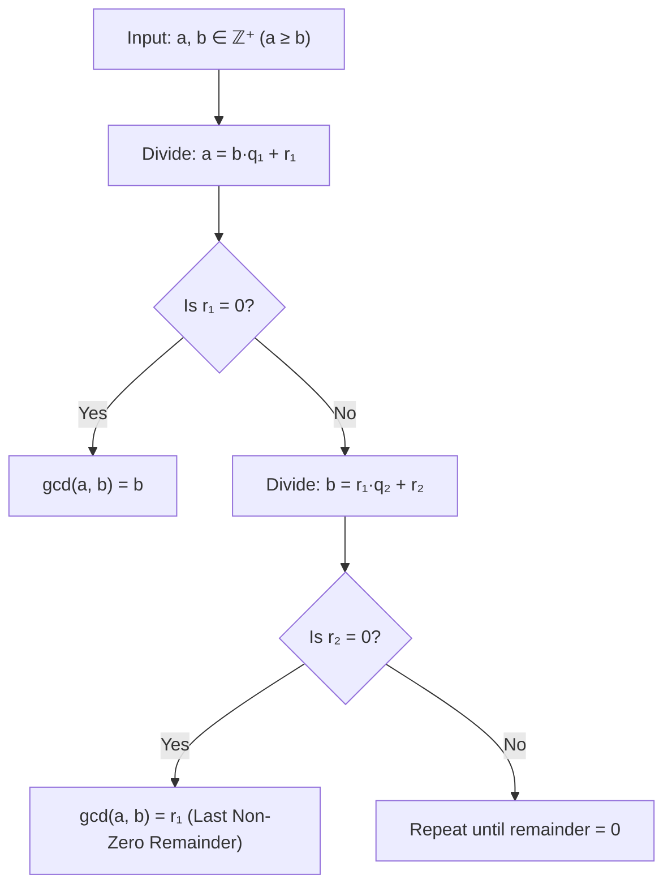
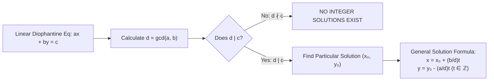

# 06. Euclidean Algorithm & Linear Diophantine Equations

> [!NOTE]
> **Course Module Reference:** PMT 1022 (Introduction to Number Theory)  
> **Corresponding Lecture Slides:** [06_Lesson_09_Euclidean_Algorithm_and_Diophantine_Equations.pdf](../06_Lesson_09_Euclidean_Algorithm_and_Diophantine_Equations.pdf)  
> **Prerequisites:** [04. The Division Algorithm](04_The_Division_Algorithm_and_Form_of_Integers.md), [05. Greatest Common Divisor & Bézout's Identity](05_Greatest_Common_Divisor_and_Bezout_Identity.md)

---

## 1. The Euclidean Algorithm (යුක්ලිඩ්ගේ ඇල්ගොරිතමය)

විශාල සංඛ්‍යා දෙකක මහා පොදු සාධකය ($\gcd$) සාධක නොකඩා ඉතා වේගයෙන් සෙවීමට යුක්ලිඩ්ගේ ඇල්ගොරිතමය භාවිතා වේ.

### 📜 The Fundamental Reduction Lemma
> **Lemma:** If $a = bq + r$, then:
> $$\mathbf{\gcd(a, b) = \gcd(b, r)}$$
> **Proof:**
> * Let $d = \gcd(a, b) \implies d \mid a \land d \mid b \implies d \mid (a - bq) \implies d \mid r$. Thus $d$ is a common divisor of $b$ and $r \implies d \le \gcd(b, r)$.
> * Let $c = \gcd(b, r) \implies c \mid b \land c \mid r \implies c \mid (bq + r) \implies c \mid a$. Thus $c$ is a common divisor of $a$ and $b \implies c \le \gcd(a, b) = d$.
> * Since $d \le c$ and $c \le d$, we conclude $d = c$, i.e. $\gcd(a, b) = \gcd(b, r)$. $\blacksquare$

---

### 🔄 The Step-by-Step Euclidean Algorithm
Let $a \ge b > 0$. Apply the Division Algorithm repeatedly:
$$\begin{aligned}
a &= b \cdot q_1 + r_1 && (0 < r_1 < b) \\
b &= r_1 \cdot q_2 + r_2 && (0 < r_2 < r_1) \\
r_1 &= r_2 \cdot q_3 + r_3 && (0 < r_3 < r_2) \\
&\vdots && \\
r_{n-2} &= r_{n-1} \cdot q_n + r_n && (0 < r_n < r_{n-1}) \\
r_{n-1} &= r_n \cdot q_{n+1} + 0 && (\text{Remainder is } 0)
\end{aligned}$$

> **Theorem:** The **last non-zero remainder** $\mathbf{r_n}$ is the Greatest Common Divisor:
> $$\mathbf{\gcd(a, b) = r_n}$$

---

## 2. Extended Euclidean Algorithm (Back-Substitution)

යුක්ලිඩ් ඇල්ගොරිතමයේ පියවර **පසුපසට ආදේශ කිරීමෙන් (Back-substitution)** Bézout's coefficients $x, y \in \mathbb{Z}$ සෙවිය හැක:
$$\mathbf{\gcd(a, b) = a \cdot x + b \cdot y}$$

*   **ක්‍රමවේදය:**
    1. අවසන් නොවන ශේෂය $r_n$ උක්ත කරන්න: $r_n = r_{n-2} - r_{n-1} q_n$.
    2. ඊට පෙර පේළියෙන් $r_{n-1}$ උක්ත කර ආදේශ කරන්න.
    3. $a$ සහ $b$ ලැබෙන තෙක් ඉහළට ගොස් සුළු කරන්න.

---

## 3. Linear Diophantine Equations ($ax + by = c$)

> **Definition:** An algebraic equation where the unknowns are restricted to take **only integer values ($\mathbb{Z}$)** is called a **Diophantine Equation**.
> 
> A **Linear Diophantine Equation in two variables** has the standard form:
> $$\mathbf{a \cdot x + b \cdot y = c \quad (a, b, c \in \mathbb{Z})}$$

---

### 📜 Master Solvability & General Solution Theorems

### 1️⃣ The Solvability Criterion
> **Theorem:** The linear Diophantine equation $ax + by = c$ has an integer solution if and only if:
> $$\mathbf{d \mid c \quad \text{where} \quad d = \gcd(a, b)}$$
> *(If $\gcd(a, b) \nmid c$, there are **no integer solutions**).*

### 2️⃣ The Complete General Solution Formula
> **Theorem:** If $d = \gcd(a, b) \mid c$, and $(x_0, y_0)$ is any particular integer solution, then the **complete set of all integer solutions** is given by:
> $$\mathbf{x = x_0 + \left(\frac{b}{d}\right) t \quad \text{and} \quad y = y_0 - \left(\frac{a}{d}\right) t \quad \text{for all } t \in \mathbb{Z}}$$

---

## ✍️ Step-by-Step Worked Exam Problems

### 📌 Problem 1: Euclidean Algorithm & Bézout Representation
**Question:** Use the Euclidean Algorithm to find $\gcd(1234, 5678)$ and express it as a linear combination $1234x + 5678y$.

**Step 1: Euclidean Algorithm (Forward Pass):**
$$\begin{aligned}
5678 &= 1234 \cdot 4 + 742 && \text{--- (1)} \\
1234 &= 742 \cdot 1 + 492 && \text{--- (2)} \\
742 &= 492 \cdot 1 + 250 && \text{--- (3)} \\
492 &= 250 \cdot 1 + 242 && \text{--- (4)} \\
250 &= 242 \cdot 1 + 8 && \text{--- (5)} \\
242 &= 8 \cdot 30 + 2 && \text{--- (6)} \\
8 &= 2 \cdot 4 + 0 && \text{--- (7)}
\end{aligned}$$
The last non-zero remainder is **2**.
$$\mathbf{\gcd(1234, 5678) = 2}$$

**Step 2: Extended Euclidean Algorithm (Back-Substitution):**
From (6):
$$2 = 242 - 8(30)$$
Substitute $8 = 250 - 242(1)$ from (5):
$$2 = 242 - [250 - 242(1)](30) = 242(31) - 250(30)$$
Substitute $242 = 492 - 250(1)$ from (4):
$$2 = [492 - 250(1)](31) - 250(30) = 492(31) - 250(61)$$
Substitute $250 = 742 - 492(1)$ from (3):
$$2 = 492(31) - [742 - 492(1)](61) = 492(92) - 742(61)$$
Substitute $492 = 1234 - 742(1)$ from (2):
$$2 = [1234 - 742(1)](92) - 742(61) = 1234(92) - 742(153)$$
Substitute $742 = 5678 - 1234(4)$ from (1):
$$\begin{aligned}
2 &= 1234(92) - [5678 - 1234(4)](153) \\
&= 1234(92 + 612) - 5678(153) \\
&= \mathbf{1234(704) + 5678(-153)}
\end{aligned}$$
Thus, $\gcd(1234, 5678) = 2 = 1234 x + 5678 y$ with **$x = 704$** and **$y = -153$**. $\blacksquare$

---

### 📌 Problem 2: Complete Solution of Linear Diophantine Equation
**Question:** Find all integer solutions to the Linear Diophantine Equation **$172x + 20y = 1000$**.

**Step-by-Step Solution:**

*   **Step 1: Find $\gcd(172, 20)$ using Euclidean Algorithm:**
    $$\begin{aligned}
    172 &= 20 \cdot 8 + 12 \\
    20 &= 12 \cdot 1 + 8 \\
    12 &= 8 \cdot 1 + 4 \\
    8 &= 4 \cdot 2 + 0
    \end{aligned}$$
    Thus, $d = \gcd(172, 20) = \mathbf{4}$.

*   **Step 2: Check Solvability:**
    $d = 4$ and $c = 1000$. Since $1000 = 4 \times 250$, **$4 \mid 1000$**.
    Therefore, integer solutions **exist**!

*   **Step 3: Find Particular Solution $(x_0, y_0)$:**
    Express $4 = \gcd(172, 20)$ as a linear combination by back-substitution:
    $$\begin{aligned}
    4 &= 12 - 8(1) \\
    &= 12 - [20 - 12(1)](1) = 12(2) - 20(1) \\
    &= [172 - 20(8)](2) - 20(1) \\
    &= 172(2) - 20(16) - 20(1) \\
    4 &= 172(2) + 20(-17)
    \end{aligned}$$
    Multiply the entire equation by $\frac{1000}{4} = 250$:
    $$172(2 \times 250) + 20(-17 \times 250) = 1000$$
    $$172(500) + 20(-4250) = 1000$$
    A particular solution is **$x_0 = 500, y_0 = -4250$**.

*   **Step 4: Write the General Solution Formula:**
    With $a = 172, b = 20, d = 4$:
    $$\frac{b}{d} = \frac{20}{4} = 5 \quad \text{and} \quad \frac{a}{d} = \frac{172}{4} = 43$$
    The general solution for all $t \in \mathbb{Z}$ is:
    $$\mathbf{x = 500 + 5t \quad \text{and} \quad y = -4250 - 43t \quad (t \in \mathbb{Z})}$$

*   *(Note: Choosing $t = -99$ gives the smaller particular solution $x_0 = 5, y_0 = 7$, leading to the equivalent elegant form: $x = 5 + 5k, y = 7 - 43k$ for $k \in \mathbb{Z}$).* $\blacksquare$

---

### 📌 Problem 3: Positive Integer Solutions
**Question:** Find all **positive integer solutions** ($x > 0, y > 0$) to **$5x + 3y = 52$**.

**Solution:**
1. $\gcd(5, 3) = 1$, and $1 \mid 52$.
2. Particular solution: $5(2) + 3(-3) = 1 \implies 5(104) + 3(-156) = 52$. Or simply by inspection: $x_0 = 5, y_0 = 9$ since $5(5) + 3(9) = 25 + 27 = 52$.
3. General solution:
   $$x = 5 + 3t \quad \text{and} \quad y = 9 - 5t \quad (t \in \mathbb{Z})$$
4. Apply the positivity conditions:
   * $x > 0 \implies 5 + 3t > 0 \implies 3t > -5 \implies t > -\frac{5}{3} \approx -1.67 \implies t \ge -1$.
   * $y > 0 \implies 9 - 5t > 0 \implies 5t < 9 \implies t < \frac{9}{5} = 1.8 \implies t \le 1$.
5. The possible integer values for $t$ are **$t \in \{-1, 0, 1\}$**.
6. Evaluating $(x, y)$ for each $t$:
   * $t = -1 \implies x = 5 + 3(-1) = 2, \quad y = 9 - 5(-1) = 14 \implies \mathbf{(2, 14)}$
   * $t = 0 \implies x = 5, \quad y = 9 \implies \mathbf{(5, 9)}$
   * $t = 1 \implies x = 5 + 3(1) = 8, \quad y = 9 - 5(1) = 4 \implies \mathbf{(8, 4)}$
7. **Positive Solutions:** **$\{(2, 14), (5, 9), (8, 4)\}$**. $\blacksquare$

### 📌 Problem 4: GCD of Large Integers (Lesson 09 Example 9.1.3)
**Question:** Use the Euclidean Algorithm to calculate **$\gcd(42823, 6409)$**.

**Step-by-Step Solution:**
$$\begin{aligned}
42823 &= 6409 \cdot 6 + 4369 \\
6409 &= 4369 \cdot 1 + 2040 \\
4369 &= 2040 \cdot 2 + 289 \\
2040 &= 289 \cdot 7 + 17 \\
289 &= 17 \cdot 17 + 0
\end{aligned}$$
The last non-zero remainder is **17**.
$$\mathbf{\gcd(42823, 6409) = 17} \quad \blacksquare$$

---

### 📌 Problem 5: Solving $34x + 21y = 1$ (Lesson 09 Activity Question 3)
**Question:** Find all integer solutions to the Linear Diophantine Equation **$34x + 21y = 1$**.

**Step-by-Step Solution:**
1. **Euclidean Algorithm on 34 and 21:**
   $$\begin{aligned}
   34 &= 21 \cdot 1 + 13 && \text{--- (1)} \\
   21 &= 13 \cdot 1 + 8 && \text{--- (2)} \\
   13 &= 8 \cdot 1 + 5 && \text{--- (3)} \\
   8 &= 5 \cdot 1 + 3 && \text{--- (4)} \\
   5 &= 3 \cdot 1 + 2 && \text{--- (5)} \\
   3 &= 2 \cdot 1 + 1 && \text{--- (6)} \\
   2 &= 1 \cdot 2 + 0 && \text{--- (7)}
   \end{aligned}$$
   Thus $\gcd(34, 21) = 1$. Since $1 \mid 1$, solutions exist.
2. **Back-Substitution for Particular Solution:**
   $$\begin{aligned}
   1 &= 3 - 2(1) \\
   &= 3 - [5 - 3(1)](1) = 3(2) - 5(1) \\
   &= [8 - 5(1)](2) - 5(1) = 8(2) - 5(3) \\
   &= 8(2) - [13 - 8(1)](3) = 8(5) - 13(3) \\
   &= [21 - 13(1)](5) - 13(3) = 21(5) - 13(8) \\
   &= 21(5) - [34 - 21(1)](8) = 21(13) - 34(8) \\
   1 &= \mathbf{34(-8) + 21(13)}
   \end{aligned}$$
   A particular solution is **$x_0 = -8, y_0 = 13$**.
3. **General Solution:**
   $$\mathbf{x = -8 + 21t \quad \text{and} \quad y = 13 - 34t \quad (t \in \mathbb{Z})} \quad \blacksquare$$

## ⚠️ Exam Traps & Common Pitfalls

> [!CAUTION]
> **1. $\gcd(a, b) \nmid c$ පරීක්ෂා නොකර විසඳුම් සෙවීමට යාම:**
> උදා: $6x + 9y = 25$ හි $\gcd(6, 9) = 3$. $3 \nmid 25$ බැවින් කිසිදු නිඛිල විසඳුමක් නැත. මෙය ආරම්භයේදීම පරීක්ෂා කර නොලියුවහොත් කාලය නාස්ති වේ.
> 
> **2. General Solution සූත්‍රයේ ලකුණු පටලවා ගැනීම:**
> $x = x_0 + \left(\frac{b}{d}\right)t$ වන විට $y = y_0 \mathbf{-} \left(\frac{a}{d}\right)t$ වේ (එකක $+$ වන විට අනෙක $-$ විය යුතුය, එවිට $a\frac{b}{d}t - b\frac{a}{d}t = 0$ ලෙස කැපී යයි).
