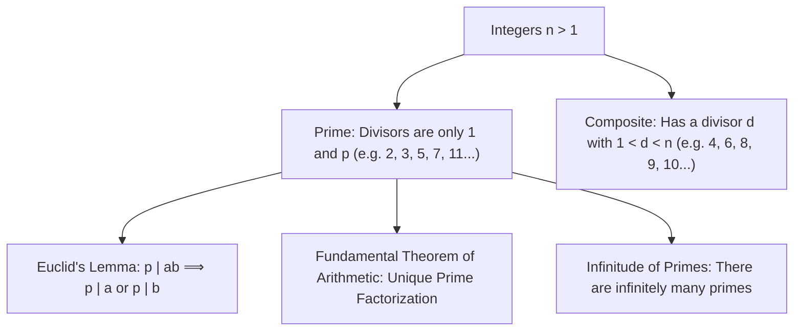

# 07. Prime Numbers, Factorization & Euclid's Lemmas

> [!NOTE]
> **Course Module Reference:** PMT 1022 (Introduction to Number Theory)  
> **Corresponding Lecture Slides:** [07_Lesson_10_Primes_and_Fundamental_Theorem_of_Arithmetic.pdf](../07_Lesson_10_Primes_and_Fundamental_Theorem_of_Arithmetic.pdf)  
> **Prerequisites:** [03. Divisibility Theory](03_Divisibility_Theory_and_Elementary_Properties.md), [05. Greatest Common Divisor & Bézout's Identity](05_Greatest_Common_Divisor_and_Bezout_Identity.md)

---

## 1. Prime Numbers & Primality Testing (ප්‍රථමක සංඛ්‍යා)

සංඛ්‍යා න්‍යායේ "පරමාණු" (Building Blocks) වන්නේ ප්‍රථමක සංඛ්‍යායි.

### 📜 Formal Definitions
> **Definition (Prime Number):** An integer $p > 1$ is called a **prime number** (or **prime**) if its only positive divisors are $1$ and $p$.
> 
> **Definition (Composite Number):** An integer $n > 1$ that is not prime is called a **composite number**.
> 
> *(⚠️ $1$ යනු ප්‍රථමක සංඛ්‍යාවක්ද නොවේ, සංයුක්ත සංඛ්‍යාවක්ද නොවේ. එය **Unit (ඒකකය)** ලෙස හැඳින්වේ).*

---

### 📜 Primality Testing Theorem
> **Theorem:** If $n > 1$ is a composite integer, then $n$ must have a prime divisor $p$ satisfying:
> $$\mathbf{p \le \sqrt{n}}$$

### ✍️ Proof:
1. Since $n$ is composite, there exist integers $a, b$ such that $n = ab$ with $1 < a \le b < n$.
2. If both $a > \sqrt{n}$ and $b > \sqrt{n}$, then:
   $$n = ab > \sqrt{n} \cdot \sqrt{n} = n \implies n > n \quad (\text{Contradiction!})$$
3. Therefore, we must have at least one factor $a \le \sqrt{n}$.
4. By the Well-Ordering Principle / Induction, every integer $a > 1$ has at least one prime factor $p$.
5. Since $p \mid a$ and $a \le \sqrt{n}$, it follows that $p \le \sqrt{n}$.
6. Since $p \mid a$ and $a \mid n$, by transitivity $p \mid n$. $\blacksquare$

*   *Practical Use:* සංඛ්‍යාවක් ප්‍රථමකදැයි බැලීමට, $\sqrt{n}$ ට අඩු ප්‍රථමක සංඛ්‍යා වලින් පමණක් බෙදෙන්නේදැයි බැලීම 100% ප්‍රමාණවත්ය!

---

## 2. Euclid's Lemma (යුක්ලිඩ්ගේ ප්‍රමේයය)

> **Theorem (Euclid's Lemma):** If $p$ is a prime number and **$p \mid ab$**, then:
> $$\mathbf{p \mid a \quad \text{හෝ} \quad p \mid b}$$

### ✍️ Complete Rigorous Proof:
1. We are given that $p$ is a prime number and $p \mid ab$.
2. Suppose that $p \nmid a$. We must prove that $p \mid b$.
3. Since $p$ is prime, its only positive divisors are $1$ and $p$.
4. Since $p \nmid a$, the greatest common divisor of $p$ and $a$ can only be **$1$**:
   $$\gcd(p, a) = 1$$
5. Since $\gcd(p, a) = 1$, by Bézout's Identity, there exist integers $x, y \in \mathbb{Z}$ such that:
   $$p x + a y = 1$$
6. Multiply both sides by $b$:
   $$p b x + a b y = b$$
7. Notice that $p \mid (pbx)$ (since $p \mid p$) and $p \mid (aby)$ (since we are given $p \mid ab$).
8. By the Linear Combination Theorem:
   $$p \mid (pbx + aby) \implies \mathbf{p \mid b}$$
9. Therefore, if $p \mid ab$, then $p \mid a$ or $p \mid b$. $\blacksquare$

*   **Generalized Euclid's Lemma:**
    If $p$ is prime and $p \mid (a_1 a_2 \dots a_k)$, then **$p \mid a_i$** for some $1 \le i \le k$.

---

## 3. The Fundamental Theorem of Arithmetic (FTA / අංක ගණිතයේ මූලික ප්‍රමේයය)

> **The Fundamental Theorem of Arithmetic:** Every integer $n > 1$ can be expressed as a product of prime numbers:
> $$\mathbf{n = p_1^{a_1} p_2^{a_2} \dots p_k^{a_k}}$$
> and this prime factorization is **strictly unique**, up to the order in which the prime factors are written.

### ✍️ Proof of Existence (Using Strong Induction):
1. **Base Case ($n = 2$):** 2 is prime, so it is already a product of one prime.
2. **Inductive Hypothesis:** Assume that every integer $m$ with $2 \le m \le k$ can be factored into primes.
3. **Inductive Step ($n = k + 1$):**
   * If $k + 1$ is prime, we are done.
   * If $k + 1$ is composite, then $k + 1 = ab$ where $1 < a, b < k + 1$.
   * By the inductive hypothesis, both $a$ and $b$ can be factored into primes:
     $$a = p_1 p_2 \dots p_r \quad \text{සහ} \quad b = q_1 q_2 \dots q_s$$
   * Then $k + 1 = ab = p_1 \dots p_r q_1 \dots q_s$, which is a product of primes.
4. By Strong Mathematical Induction, every $n > 1$ has a prime factorization.

### ✍️ Proof of Uniqueness (Using Euclid's Lemma & Contradiction):
1. Assume there exists an integer $n > 1$ with two different prime factorizations:
   $$n = p_1 p_2 \dots p_r = q_1 q_2 \dots q_s \quad (\text{where all } p_i, q_j \text{ are primes})$$
2. Then $p_1 \mid (q_1 q_2 \dots q_s)$. By generalized Euclid's lemma, $p_1 \mid q_j$ for some $j$.
3. Since $q_j$ is prime, its only divisors are 1 and $q_j$. Thus $p_1 = q_j$.
4. Cancel $p_1$ and $q_j$ from both sides:
   $$p_2 \dots p_r = q_1 \dots q_{j-1} q_{j+1} \dots q_s$$
5. Continuing this cancellation process, every prime on the LHS must match a prime on the RHS, which proves $r = s$ and the factorization is **unique**. $\blacksquare$

---

## 4. Canonical Factorization & $\gcd / \operatorname{lcm}$ Formula

If the canonical prime factorizations of $a$ and $b$ are:
$$a = p_1^{a_1} p_2^{a_2} \dots p_k^{a_k} \quad \text{සහ} \quad b = p_1^{b_1} p_2^{b_2} \dots p_k^{b_k} \quad (a_i, b_i \ge 0)$$

Then:
$$\mathbf{\gcd(a, b) = p_1^{\min(a_1, b_1)} p_2^{\min(a_2, b_2)} \dots p_k^{\min(a_k, b_k)}}$$
$$\mathbf{\operatorname{lcm}(a, b) = p_1^{\max(a_1, b_1)} p_2^{\max(a_2, b_2)} \dots p_k^{\max(a_k, b_k)}}$$

### 📜 Master Identity
Since $\min(x, y) + \max(x, y) = x + y$:
$$\mathbf{\gcd(a, b) \cdot \operatorname{lcm}(a, b) = a \cdot b}$$

---

## 5. Infinitude of Primes (ප්‍රථමක සංඛ්‍යා අනන්ත ගණනක් පැවතීම)

### 📜 Euclid's Theorem
> **Theorem:** There are infinitely many prime numbers.

### ✍️ Proof (by Contradiction):
1. Assume to the contrary that there are only finitely many primes, say $P = \{p_1, p_2, \dots, p_k\}$.
2. Construct the integer:
   $$N = p_1 \cdot p_2 \dots p_k + 1$$
3. Since $N > 1$, by FTA, $N$ must have at least one prime factor $p$.
4. Since $P$ contains all primes, $p = p_i$ for some $1 \le i \le k$.
5. Thus $p \mid (p_1 p_2 \dots p_k)$.
6. Since $p \mid N$ and $p \mid (p_1 p_2 \dots p_k)$, by the linear combination theorem:
   $$p \mid (N - p_1 p_2 \dots p_k) \implies p \mid 1$$
7. This implies $p = 1$, which contradicts that $p$ is a prime number ($p > 1$).
8. Therefore, the number of prime numbers is **infinite**. $\blacksquare$

---

## ✍️ Step-by-Step Worked Exam Problems

### 📌 Problem 1: Primes of the Form $4k + 3$
**Theorem:** Prove that there are infinitely many prime numbers of the form **$4k + 3$**.

**Rigorous Proof:**
1. First note that every odd integer is of the form $4k + 1$ or $4k + 3$.
2. The product of two numbers of the form $4k + 1$ is again of the form $4k + 1$:
   $$(4a + 1)(4b + 1) = 16ab + 4a + 4b + 1 = 4(4ab + a + b) + 1 = 4m + 1$$
3. Thus, if an integer of the form $4k + 3$ is factored into primes, **at least one prime factor must be of the form $4k + 3$** (if all were $4k+1$, their product would be $4k+1$).
4. Now assume to the contrary that there are only finitely many primes of the form $4k + 3$, say:
   $$p_1 = 3, p_2 = 7, p_3 = 11, \dots, p_r$$
5. Construct the integer:
   $$N = 4(p_1 p_2 \dots p_r) - 1 = 4(p_1 p_2 \dots p_r - 1) + 3$$
6. Notice $N$ is of the form $4k + 3$. By step (3), $N$ must have a prime factor $q$ of the form $4k + 3$.
7. Since our list contains all such primes, $q = p_i$ for some $1 \le i \le r$.
8. Thus $q \mid (4 p_1 \dots p_r)$.
9. Since $q \mid N$ and $q \mid (4 p_1 \dots p_r)$, we have $q \mid (4 p_1 \dots p_r - N) \implies q \mid 1$.
10. This gives $q = 1$, a **contradiction**!
11. Therefore, there are infinitely many primes of the form $4k + 3$. $\blacksquare$

### 📌 Problem 2: Exponents in Square Factorizations (Lesson 10 Activity 01)
**Theorem:** A positive integer $n > 1$ is a **perfect square if and only if all exponents** in its canonical prime factorization are **even numbers**.

**Rigorous Proof:**
*   $(\implies):$ Let $n$ be a square, so $n = m^2$ for some $m \in \mathbb{Z}^+$.
    By FTA, let $m = p_1^{b_1} p_2^{b_2} \dots p_k^{b_k}$.
    Then $n = m^2 = (p_1^{b_1} \dots p_k^{b_k})^2 = p_1^{2b_1} p_2^{2b_2} \dots p_k^{2b_k}$.
    Each exponent $a_i = 2b_i$ is an even number.
*   $(\impliedby):$ Let $n = p_1^{a_1} p_2^{a_2} \dots p_k^{a_k}$ where every $a_i = 2c_i$ is even ($c_i \in \mathbb{Z}^+$).
    Then $n = p_1^{2c_1} p_2^{2c_2} \dots p_k^{2c_k} = (p_1^{c_1} p_2^{c_2} \dots p_k^{c_k})^2 = m^2$.
    Thus $n$ is a perfect square. $\blacksquare$

---

### 📌 Problem 3: Number of Divisors Function $d(n)$ (Lesson 10 Example 10.3.1)
**Theorem:** If $n = p_1^{a_1} p_2^{a_2} \dots p_k^{a_k}$ is the canonical prime factorization of $n$, then the **number of positive divisors** $d(n)$ (or $\tau(n)$) is given by:
$$\mathbf{d(n) = (a_1 + 1)(a_2 + 1) \dots (a_k + 1)}$$

**Example:** Find the total number of positive divisors of $n = 2400$.
1. Find prime factorization:
   $$2400 = 24 \times 100 = (2^3 \times 3) \times (2^2 \times 5^2) = \mathbf{2^5 \cdot 3^1 \cdot 5^2}$$
2. Calculate $d(2400)$:
   $$d(2400) = (5 + 1)(1 + 1)(2 + 1) = 6 \times 2 \times 3 = \mathbf{36 \text{ divisors}}$$ $\blacksquare$

## ⚠️ Exam Traps & Common Pitfalls

> [!CAUTION]
> **1. Euclid's Lemma සංයුක්ත සංඛ්‍යා සඳහා යෙදීම:**
> $ab$ බෙදෙන්නේ ප්‍රථමක සංඛ්‍යාවකින් නම් පමණක් $p|a$ හෝ $p|b$ වේ. $6 \mid (4 \times 9) \implies 6 \mid 36$ සත්‍ය වුවද $6 \nmid 4$ සහ $6 \nmid 9$ වේ.
> 
> **2. $\gcd(a, b) \cdot \operatorname{lcm}(a, b) = abc$ යැයි සංඛ්‍යා 3ක් සඳහා වැරදියට ලිවීම:**
> සූත්‍රය $\gcd(a, b) \cdot \operatorname{lcm}(a, b) = a \cdot b$ වලංගු වන්නේ **සංඛ්‍යා දෙකක් සඳහා පමණි**! සංඛ්‍යා 3ක් සඳහා $\gcd(a, b, c) \cdot \operatorname{lcm}(a, b, c) \neq abc$.
