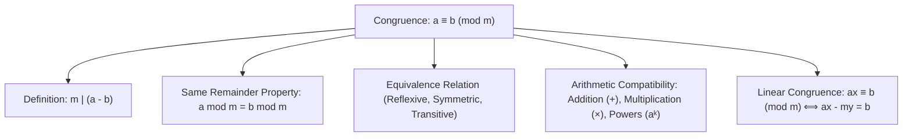

# 08. Modular Arithmetic & Linear Congruences

> [!NOTE]
> **Course Module Reference:** PMT 1022 (Introduction to Number Theory)  
> **Corresponding Lecture Slides:** [08_Lesson_11_Modular_Arithmetic_and_Congruences.pdf](../08_Lesson_11_Modular_Arithmetic_and_Congruences.pdf)  
> **Prerequisites:** [03. Divisibility Theory](03_Divisibility_Theory_and_Elementary_Properties.md), [04. The Division Algorithm](04_The_Division_Algorithm_and_Form_of_Integers.md), [06. Euclidean Algorithm & Diophantine Equations](06_Euclidean_Algorithm_and_Linear_Diophantine_Equations.md)

---

## 1. The Congruence Relation (සමගාමීතා සම්බන්ධතාවය)

මාපාංක අංක ගණිතය (Modular Arithmetic) හෙවත් "ඔරලෝසු අංක ගණිතය" (Clock Arithmetic) පදනම් වන්නේ සමගාමීතාවය මතයි.

### 📜 Formal Definition of Congruence Modulo $m$
> **Definition:** Let $m$ be a positive integer ($m \in \mathbb{Z}^+$), called the **modulus**. Two integers $a$ and $b$ are said to be **congruent modulo $m$**, denoted by:
> $$\mathbf{a \equiv b \pmod m}$$
> if and only if **$m$ divides $(a - b)$** (that is, **$m \mid (a - b)$**).
> 
> If $m \nmid (a - b)$, we write **$a \not\equiv b \pmod m$** ($a$ is incongruent to $b$ modulo $m$).

*   **උදාහරණ:**
    * $17 \equiv 5 \pmod 6$ මන්ද $6 \mid (17 - 5) = 12$.
    * $38 \equiv 2 \pmod 4$ මන්ද $4 \mid (38 - 2) = 36$.
    * $-8 \equiv 7 \pmod 5$ මන්ද $5 \mid (-8 - 7) = -15$.

---

### 📜 Characterization via Remainder Theorem
> **Theorem:** Two integers $a$ and $b$ are congruent modulo $m$ ($a \equiv b \pmod m$) **if and only if they leave the exact same remainder** when divided by $m$ using the Division Algorithm.

### ✍️ Proof:
*   $(\implies):$ Let $a = m q_1 + r_1$ and $b = m q_2 + r_2$ where $0 \le r_1, r_2 < m$.
    Then $a - b = m(q_1 - q_2) + (r_1 - r_2)$.
    Since $m \mid (a - b)$, we must have $m \mid (r_1 - r_2)$.
    Since $0 \le r_1, r_2 < m$, we have $-m < r_1 - r_2 < m$. The only multiple of $m$ in this range is 0.
    Thus $r_1 - r_2 = 0 \implies \mathbf{r_1 = r_2}$.
*   $(\impliedby):$ If $r_1 = r_2 = r$, then $a - b = (m q_1 + r) - (m q_2 + r) = m(q_1 - q_2) \implies m \mid (a - b) \implies a \equiv b \pmod m$. $\blacksquare$

---

## 2. Congruence is an Equivalence Relation (තුල්‍යතා සම්බන්ධතාවයක් බව)

> **Theorem:** For any fixed modulus $m \in \mathbb{Z}^+$, the congruence relation modulo $m$ is an **equivalence relation** on $\mathbb{Z}$.

### ✍️ Proof of Properties:
1. **Reflexive (ප්‍රත්‍යාවර්තී):** For any $a \in \mathbb{Z}$, $a - a = 0 = m \cdot 0$. Since $m \mid (a - a)$, **$a \equiv a \pmod m$**.
2. **Symmetric (සමමිතික):** If $a \equiv b \pmod m \implies m \mid (a - b) \implies a - b = km \implies b - a = (-k)m \implies m \mid (b - a) \implies \mathbf{b \equiv a \pmod m}$.
3. **Transitive (සංක්‍රාන්තික):** If $a \equiv b \pmod m$ and $b \equiv c \pmod m$, then $a - b = k_1 m$ and $b - c = k_2 m$. Adding them gives $a - c = (a - b) + (b - c) = (k_1 + k_2)m \implies m \mid (a - c) \implies \mathbf{a \equiv c \pmod m}$. $\blacksquare$

---

## 3. Algebraic Rules of Modular Arithmetic (සමගාමීතාවයේ වීජීය නීති)

> **Theorem:** If $a \equiv b \pmod m$ and $c \equiv d \pmod m$, then:
> 1. **Addition:** $\mathbf{a + c \equiv b + d \pmod m}$
> 2. **Subtraction:** $\mathbf{a - c \equiv b - d \pmod m}$
> 3. **Multiplication:** $\mathbf{a \cdot c \equiv b \cdot d \pmod m}$
> 4. **Power Law:** $\mathbf{a^k \equiv b^k \pmod m}$ for any positive integer $k \in \mathbb{Z}^+$.
> 5. **Polynomial Property:** $P(a) \equiv P(b) \pmod m$ for any polynomial $P(x)$ with integer coefficients.

---

## 4. Cancellation Law in Modular Arithmetic (කැපීමේ නීතිය)

සාමාන්‍ය වීජ ගණිතයේ මෙන් දෙපසම ඇති සංඛ්‍යාවක් සරලව කපා හැරිය නොහැක!

> **Theorem (Modular Cancellation Law):**
> If **$c a \equiv c b \pmod m$**, then:
> $$\mathbf{a \equiv b \pmod{\frac{m}{\gcd(c, m)}}}$$
> 
> *   **Special Case (when $\gcd(c, m) = 1$):**
>     If $c a \equiv c b \pmod m$ and **$\gcd(c, m) = 1$**, then:
>     $$\mathbf{a \equiv b \pmod m}$$

*   **උදාහරණය:**
    $4 \cdot 2 \equiv 4 \cdot 5 \pmod 6 \implies 8 \equiv 20 \pmod 6$ (True, $6 \mid 12$).
    නමුත් දෙපස 4 න් බෙදූ විට $2 \equiv 5 \pmod 6$ නොවේ! මන්ද $\gcd(4, 6) = 2$.
    නිවැරදි ප්‍රතිඵලය: $2 \equiv 5 \pmod{6/2} \implies 2 \equiv 5 \pmod 3$.

---

## 5. Linear Congruences ($ax \equiv b \pmod m$)

> **Definition:** An equation of the form:
> $$\mathbf{a x \equiv b \pmod m \quad (a, b, m \in \mathbb{Z}, m > 0)}$$
> where $x$ is an unknown integer, is called a **Linear Congruence in one variable**.

### 🔗 Connection to Linear Diophantine Equations
$$ax \equiv b \pmod m \iff m \mid (ax - b) \iff ax - b = my \iff \mathbf{a x - m y = b}$$

---

### 📜 Master Solvability & Number of Solutions Theorem
> **Theorem:** Let $d = \gcd(a, m)$.
> 1. The linear congruence $ax \equiv b \pmod m$ has solutions **if and only if $d \mid b$**.
> 2. If $d \mid b$, then there are **exactly $d$ mutually incongruent solutions modulo $m$**.
> 3. If $x_0$ is any particular solution, the complete set of $d$ incongruent solutions modulo $m$ is given by:
>    $$\mathbf{x_k = x_0 + k \cdot \left(\frac{m}{d}\right) \quad \text{for } k = 0, 1, 2, \dots, d - 1}$$

---

## ✍️ Step-by-Step Worked Exam Problems

### 📌 Problem 1: Remainder of High Powers
**Question:** Find the remainder when **$2^{100}$** is divided by **$7$**.

**Solution:**
1. Work modulo 7:
   $$2^1 \equiv 2 \pmod 7$$
   $$2^2 \equiv 4 \pmod 7$$
   $$2^3 = 8 \equiv 1 \pmod 7$$
2. Since $2^3 \equiv 1 \pmod 7$, divide the exponent 100 by 3:
   $$100 = 3 \times 33 + 1$$
3. Therefore:
   $$2^{100} = (2^3)^{33} \cdot 2^1 \equiv (1)^{33} \cdot 2 \equiv 1 \cdot 2 \equiv \mathbf{2 \pmod 7}$$
4. The remainder is **2**. $\blacksquare$

---

### 📌 Problem 2: Solving a Linear Congruence with Multiple Solutions
**Question:** Solve the linear congruence **$15x \equiv 9 \pmod{24}$**.

**Step-by-Step Solution:**

*   **Step 1: Check Solvability & Number of Solutions:**
    $a = 15, b = 9, m = 24$.
    Calculate $d = \gcd(15, 24) = \mathbf{3}$.
    Since $3 \mid 9$, solutions **exist**, and there are **exactly 3 incongruent solutions modulo 24**.

*   **Step 2: Simplify the Congruence:**
    Divide the entire congruence ($a, b,$ and modulus $m$) by $d = 3$:
    $$\frac{15}{3}x \equiv \frac{9}{3} \pmod{\frac{24}{3}} \implies \mathbf{5x \equiv 3 \pmod 8}$$

*   **Step 3: Find a Particular Solution $x_0$:**
    Multiply both sides by 5 (since $5 \times 5 = 25 \equiv 1 \pmod 8$):
    $$5(5x) \equiv 5(3) \pmod 8$$
    $$25x \equiv 15 \pmod 8$$
    Since $25 \equiv 1 \pmod 8$ and $15 \equiv 7 \pmod 8$:
    $$\mathbf{x \equiv 7 \pmod 8} \implies \mathbf{x_0 = 7}$$

*   **Step 4: Generate all 3 Incongruent Solutions Modulo 24:**
    Using the formula $x_k = x_0 + k \left(\frac{m}{d}\right) = 7 + k(8)$ for $k = 0, 1, 2$:
    * $k = 0 \implies x_0 = 7$
    * $k = 1 \implies x_1 = 7 + 8(1) = \mathbf{15}$
    * $k = 2 \implies x_2 = 7 + 8(2) = \mathbf{23}$

*   **Final Answer:**
    The complete set of solutions modulo 24 is:
    $$\mathbf{x \equiv 7, 15, 23 \pmod{24}} \quad \blacksquare$$

---

### 📌 Problem 3: Divisibility by 13
**Question:** Prove that for all integers $n \ge 1$, **$13 \mid (4^{2n+1} + 3^{n+2})$**.

**Solution via Modular Arithmetic:**
1. We want to show $4^{2n+1} + 3^{n+2} \equiv 0 \pmod{13}$.
2. Express in powers:
   $$4^{2n+1} = 4 \cdot (4^2)^n = 4 \cdot 16^n$$
   $$3^{n+2} = 3^2 \cdot 3^n = 9 \cdot 3^n$$
3. Reduce modulo 13 ($16 \equiv 3 \pmod{13}$):
   $$4^{2n+1} + 3^{n+2} \equiv 4 \cdot 3^n + 9 \cdot 3^n \pmod{13}$$
4. Factor out $3^n$:
   $$4 \cdot 3^n + 9 \cdot 3^n = (4 + 9) \cdot 3^n = 13 \cdot 3^n$$
5. Since $13 \equiv 0 \pmod{13}$:
   $$13 \cdot 3^n \equiv 0 \cdot 3^n \equiv \mathbf{0 \pmod{13}}$$
6. Hence $13 \mid (4^{2n+1} + 3^{n+2})$ for all $n \ge 1$. $\blacksquare$

### 📌 Problem 4: False Implications in Modular Arithmetic (Lesson 11 Activity 01)
**Question:** Prove or disprove: If $a^2 \equiv b^2 \pmod n$, then $a \equiv b \pmod n$.

**Disproof by Counterexample:**
*   The statement is **FALSE**.
*   Let $n = 5$, $a = 4$, and $b = 1$.
*   Calculate $a^2 \pmod 5$: $4^2 = 16 \equiv \mathbf{1 \pmod 5}$.
*   Calculate $b^2 \pmod 5$: $1^2 = \mathbf{1 \pmod 5}$.
*   Thus $4^2 \equiv 1^2 \pmod 5$ is **True**.
*   However, $4 - 1 = 3$, and $5 \nmid 3$, so **$4 \not\equiv 1 \pmod 5$**.
*   Therefore, taking square roots in modular arithmetic without considering signs/factors is **invalid**! $\blacksquare$

---

### 📌 Problem 5: Complete Residue Systems (CRS) Modulo $m$ (Lesson 11)
**Definition:** A set of $m$ integers $\{r_1, r_2, \dots, r_m\}$ is called a **Complete Residue System modulo $m$** (CRS) if:
1. No two elements in the set are congruent modulo $m$ ($r_i \not\equiv r_j \pmod m$ for all $i \neq j$).
2. Every integer $n \in \mathbb{Z}$ is congruent modulo $m$ to exactly one element $r_k$ in the set.

*   *Standard Example:* $\{0, 1, 2, \dots, m - 1\}$ is the canonical least non-negative CRS modulo $m$.
*   *Another Valid Example modulo 5:* $\{-2, -1, 0, 1, 2\}$ is a complete symmetric CRS modulo 5! $\blacksquare$

## ⚠️ Exam Traps & Common Pitfalls

> [!CAUTION]
> **1. Congruence එකක දෙපස බෙදීමේදී Modulus එක බෙදීමට අමතක වීම:**
> $6x \equiv 6y \pmod 8$ වූ විට $x \equiv y \pmod 8$ ලෙස ලිවීම **වැරදිය**. නිවැරදි පිළිතුර $x \equiv y \pmod 4$ වේ ($\gcd(6, 8) = 2$ න් modulus එක බෙදිය යුතුය).
> 
> **2. Modulo $m$ විසඳුම් ගණන $d = \gcd(a, m)$ බව අමතක වීම:**
> $15x \equiv 9 \pmod{24}$ හි $x \equiv 7 \pmod 8$ සොයා ගත් පසු පිළිතුර එතැනින් නතර කළහොත් ලකුණු අහිමි වේ! $\pmod{24}$ යටතේ විසඳුම් 3ක් ($x = 7, 15, 23$) සම්පූර්ණයෙන්ම ලිවිය යුතුය.
